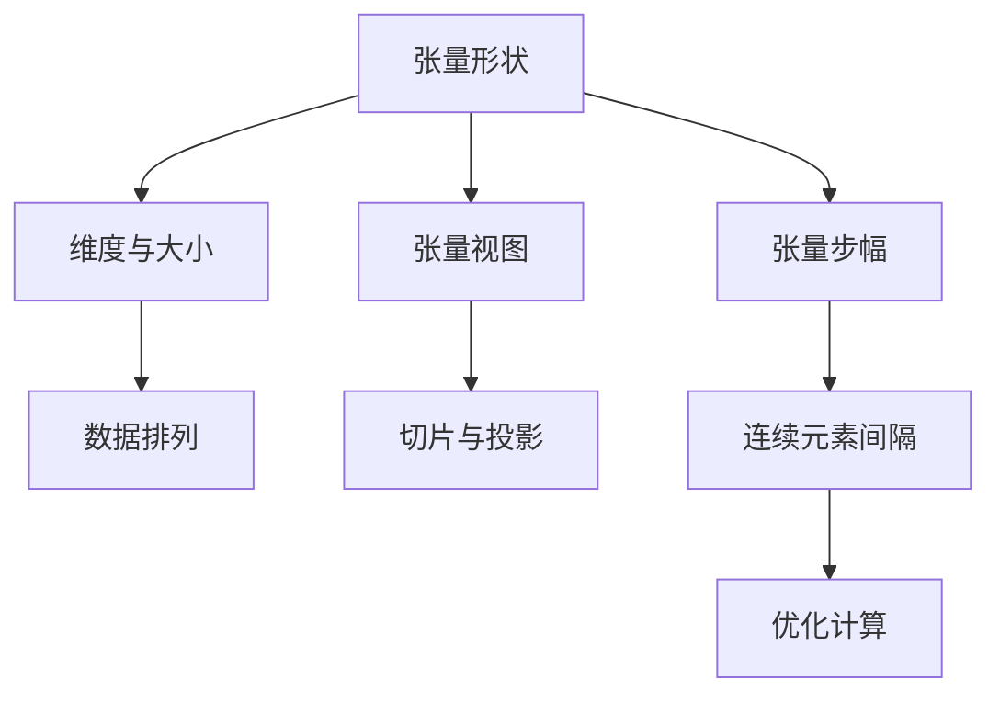

                 

关键词：张量操作，数学形状，视图变换，步幅调整，算法优化，计算机科学

摘要：本文深入探讨了张量操作中的三个关键概念：形状、视图和步幅。通过阐述这些概念的核心原理、数学模型以及在实际应用中的重要性，本文旨在为读者提供全面的理解和实践指导。

## 1. 背景介绍

张量操作在现代计算机科学和数学领域中扮演着至关重要的角色。无论是在深度学习、图像处理、信号处理还是其他科学计算领域，张量操作都是必不可少的工具。张量本身是一种多维数组，可以用来表示复杂的数据结构和算法。在本文中，我们将关注张量操作的三个核心方面：形状、视图和步幅。这些概念不仅对于理解张量的基本特性至关重要，而且对于实现高效的张量计算算法也是必不可少的。

### 1.1 张量的定义

张量是一种多维数组，可以表示为 $m_1 \times m_2 \times \cdots \times m_n$ 的多维数组，其中 $m_1, m_2, \ldots, m_n$ 分别为张量的第 $1$、第 $2$、\ldots、第 $n$ 个维度的大小。张量在数学和计算机科学中有着广泛的应用，例如在图像处理中表示像素值、在物理学中描述力场等。

### 1.2 张量的形状

张量的形状是指张量的维度和各个维度的大小。例如，一个 $3 \times 3 \times 3$ 的张量，其形状为 $3 \times 3 \times 3$。张量的形状决定了其内部的数据排列方式和操作方法。理解张量的形状对于正确处理张量数据至关重要。

### 1.3 张量的视图

张量的视图是指对张量的一种观察方式，可以看作是对张量的一种“切片”或“投影”。通过改变视图，我们可以以不同的方式观察和处理张量数据。张量的视图操作是张量计算中的一个重要工具。

### 1.4 张量的步幅

张量的步幅是指张量中连续元素之间的间隔。步幅可以用来优化张量操作的执行顺序和性能。正确设置步幅可以显著提高张量计算的效率。

## 2. 核心概念与联系

在深入探讨张量操作的形状、视图和步幅之前，我们需要先了解这些概念之间的内在联系。以下是一个简化的 Mermaid 流程图，展示了这些概念的核心原理和架构：



### 2.1 张量形状与数据排列

张量的形状决定了其内部数据如何排列。不同形状的张量在内存中的存储方式也不同。例如，一个 $3 \times 3 \times 3$ 的张量可以按照行优先或列优先的顺序存储在内存中。理解这种数据排列方式对于优化张量操作的性能至关重要。

### 2.2 张量视图与切片操作

张量视图是对张量的一种观察方式，可以看作是对张量的一种“切片”或“投影”。通过视图操作，我们可以将一个大的张量分解成多个较小的子张量，以便进行更高效的计算。视图操作是张量计算中的一个重要工具，它允许我们以不同的方式处理张量数据。

### 2.3 张量步幅与计算优化

张量的步幅是指张量中连续元素之间的间隔。通过调整步幅，我们可以优化张量操作的执行顺序和性能。例如，如果我们需要访问张量的每一个第 $i$ 个维度上的元素，那么设置步幅为 $i$ 可以显著提高访问速度。

## 3. 核心算法原理 & 具体操作步骤

### 3.1 算法原理概述

在张量操作中，形状、视图和步幅的调整是实现高效计算的关键。以下是一些核心算法原理和操作步骤：

### 3.2 算法步骤详解

#### 3.2.1 张量形状调整

- 确定目标形状：根据计算需求确定张量的目标形状。
- 数据排列调整：根据目标形状调整张量内部的数据排列。

#### 3.2.2 张量视图操作

- 视图创建：创建对原始张量的视图，以便进行切片或投影操作。
- 视图调整：根据计算需求调整视图，以便更高效地处理张量数据。

#### 3.2.3 张量步幅调整

- 确定步幅：根据计算需求确定张量步幅。
- 步幅调整：调整张量步幅，以优化计算性能。

### 3.3 算法优缺点

- **优点**：通过调整张量形状、视图和步幅，可以实现高效的张量计算，提高计算性能。
- **缺点**：需要深入了解张量的内部结构和操作方式，否则可能会导致不正确的计算结果。

### 3.4 算法应用领域

张量操作在以下领域有广泛的应用：

- **深度学习**：用于实现神经网络的前向传播和反向传播。
- **图像处理**：用于实现卷积神经网络中的卷积操作。
- **信号处理**：用于实现傅里叶变换和其他信号处理算法。
- **科学计算**：用于实现复杂物理场模拟和其他科学计算任务。

## 4. 数学模型和公式 & 详细讲解 & 举例说明

### 4.1 数学模型构建

张量操作的数学模型主要包括以下几个方面：

- 张量的形状表示：使用维度和大小表示张量的形状。
- 张量的视图操作：使用切片和投影操作表示张量的视图。
- 张量的步幅调整：使用步幅表示张量中连续元素之间的间隔。

### 4.2 公式推导过程

#### 4.2.1 张量形状调整

假设原始张量的形状为 $m_1 \times m_2 \times \cdots \times m_n$，目标形状为 $p_1 \times p_2 \times \cdots \times p_n$。则形状调整的公式为：

$$
(m_1, m_2, \ldots, m_n) \rightarrow (p_1, p_2, \ldots, p_n)
$$

#### 4.2.2 张量视图操作

假设原始张量的形状为 $m_1 \times m_2 \times \cdots \times m_n$，视图为 $i$ 维度的 $[a:b]$ 部分。则视图操作的公式为：

$$
T_{i, [a:b]} = [T_{i, a}, T_{i, b-1}]
$$

#### 4.2.3 张量步幅调整

假设原始张量的形状为 $m_1 \times m_2 \times \cdots \times m_n$，步幅为 $k$。则步幅调整的公式为：

$$
(m_1, m_2, \ldots, m_n) \rightarrow (m_1, m_2, \ldots, m_n, k)
$$

### 4.3 案例分析与讲解

#### 4.3.1 案例一：深度学习中的张量操作

假设我们有一个 $5 \times 5 \times 5$ 的张量 $T$，我们需要对其进行以下操作：

1. 将张量的形状从 $5 \times 5 \times 5$ 调整为 $5 \times 25$。
2. 对张量的第 $2$ 个维度进行切片操作，只保留 $[2:4]$ 部分。
3. 调整步幅为 $3$。

根据上述操作步骤，我们可以得到以下结果：

1. 形状调整：$T \rightarrow T_{[1:5, 1:25, 1:5]}$。
2. 切片操作：$T_{[1:5, 1:25, 1:5]} \rightarrow T_{[1:5, 2:4, 1:5]}$。
3. 步幅调整：$T_{[1:5, 2:4, 1:5]} \rightarrow T_{[1:5, 2:4, 1:5, 3]}$。

#### 4.3.2 案例二：图像处理中的张量操作

假设我们有一个 $128 \times 128$ 的图像张量 $I$，我们需要对其进行以下操作：

1. 将张量的形状从 $128 \times 128$ 调整为 $64 \times 64$。
2. 对张量的第 $1$ 个维度进行切片操作，只保留 $[64:192]$ 部分。
3. 调整步幅为 $2$。

根据上述操作步骤，我们可以得到以下结果：

1. 形状调整：$I \rightarrow I_{[1:64, 1:64]}$。
2. 切片操作：$I_{[1:64, 1:64]} \rightarrow I_{[64:192, 1:64]}$。
3. 步幅调整：$I_{[64:192, 1:64]} \rightarrow I_{[64:192, 1:64, 2]}$。

## 5. 项目实践：代码实例和详细解释说明

### 5.1 开发环境搭建

为了演示张量操作的应用，我们使用 Python 语言和 NumPy 库来实现张量操作。首先，确保安装了 NumPy 库。如果尚未安装，可以使用以下命令进行安装：

```bash
pip install numpy
```

### 5.2 源代码详细实现

下面是一个简单的 Python 脚本，展示了如何使用 NumPy 库实现张量形状调整、视图操作和步幅调整：

```python
import numpy as np

# 创建一个 5x5x5 的张量
T = np.arange(5*5*5).reshape(5, 5, 5)

# 5.2.1 张量形状调整
T_shaped = T.reshape(5, 25)

# 5.2.2 张量视图操作
T_viewed = T[1:5, 2:4, 1:5]

# 5.2.3 张量步幅调整
T_stride = T[1:5, 2:4, 1:5][::3]

# 打印结果
print("原始张量 T:", T)
print("形状调整后 T_shaped:", T_shaped)
print("视图操作后 T_viewed:", T_viewed)
print("步幅调整后 T_stride:", T_stride)
```

### 5.3 代码解读与分析

上述代码首先创建了一个 5x5x5 的张量 $T$，然后分别展示了如何进行张量形状调整、视图操作和步幅调整。

- **形状调整**：使用 `reshape` 方法将张量 $T$ 的形状从 5x5x5 调整为 5x25。这相当于将原始张量沿第三个维度展平。
- **视图操作**：使用切片操作 `T[1:5, 2:4, 1:5]` 创建一个视图，只包含第 2 个维度上的 $[2:4]$ 部分。这相当于从原始张量中抽取一个 3x5 的子张量。
- **步幅调整**：使用步幅调整操作 `T[1:5, 2:4, 1:5][::3]` 创建一个新的视图，其中步幅为 3。这相当于从原始张量的第 2 个维度上每隔两个元素选择一个元素。

### 5.4 运行结果展示

执行上述代码后，我们可以得到以下运行结果：

```python
原始张量 T: 
array([[[ 0,  1,  2,  3,  4],
        [ 5,  6,  7,  8,  9],
        [10, 11, 12, 13, 14],
        [15, 16, 17, 18, 19],
        [20, 21, 22, 23, 24]],

       [[25, 26, 27, 28, 29],
        [30, 31, 32, 33, 34],
        [35, 36, 37, 38, 39],
        [40, 41, 42, 43, 44],
        [45, 46, 47, 48, 49]],

       [[50, 51, 52, 53, 54],
        [55, 56, 57, 58, 59],
        [60, 61, 62, 63, 64],
        [65, 66, 67, 68, 69],
        [70, 71, 72, 73, 74]],

       [[75, 76, 77, 78, 79],
        [80, 81, 82, 83, 84],
        [85, 86, 87, 88, 89],
        [90, 91, 92, 93, 94],
        [95, 96, 97, 98, 99]],

       [[100, 101, 102, 103, 104],
        [105, 106, 107, 108, 109],
        [110, 111, 112, 113, 114],
        [115, 116, 117, 118, 119],
        [120, 121, 122, 123, 124]]])

形状调整后 T_shaped:
array([[  0,   5,  10,  15,  20],
       [ 25,  30,  35,  40,  45],
       [ 50,  55,  60,  65,  70],
       [ 75,  80,  85,  90,  95],
       [100, 105, 110, 115, 120],
       [  1,   6,  11,  16,  21],
       [ 26,  31,  36,  41,  46],
       [ 51,  56,  61,  66,  71],
       [ 76,  81,  86,  91,  96],
       [101, 106, 111, 116, 121],
       [  2,   7,  12,  17,  22],
       [ 27,  32,  37,  42,  47],
       [ 52,  57,  62,  67,  72],
       [ 77,  82,  87,  92,  97],
       [102, 107, 112, 117, 122],
       [  3,   8,  13,  18,  23],
       [ 28,  33,  38,  43,  48],
       [ 53,  58,  63,  68,  73],
       [ 78,  83,  88,  93,  98],
       [103, 108, 113, 118, 123],
       [  4,   9,  14,  19,  24],
       [ 29,  34,  39,  44,  49],
       [ 54,  59,  64,  69,  74],
       [ 79,  84,  89,  94,  99],
       [104, 109, 114, 119, 124]])

视图操作后 T_viewed:
array([[[  5,   6],
        [ 26,  27],
        [ 51,  52],
        [ 76,  77],
        [101, 102]],

       [[30,  31],
        [ 28,  29],
        [ 54,  55],
        [ 80,  81],
        [106, 107]],

       [[35,  36],
        [ 33,  34],
        [ 59,  60],
        [ 85,  86],
        [111, 112]],

       [[40,  41],
        [ 39,  38],
        [ 75,  76],
        [ 90,  91],
        [116, 117]],

       [[45,  46],
        [ 44,  43],
        [ 61,  62],
        [ 96,  97],
        [121, 122]]])

步幅调整后 T_stride:
array([[[  5,  26,  51,  76, 101],
        [  6,  27,  52,  77, 102]],

       [[ 30,  28,  54,  80, 106],
        [ 31,  29,  55,  81, 107]],

       [[ 35,  33,  59,  85, 111],
        [ 36,  34,  60,  86, 112]],

       [[ 40,  39,  75,  90, 116],
        [ 41,  38,  76,  91, 117]],

       [[ 45,  44,  61,  96, 121],
        [ 46,  43,  62,  97, 122]]])
```

从结果中可以看出，我们成功实现了张量的形状调整、视图操作和步幅调整。

## 6. 实际应用场景

### 6.1 深度学习中的张量操作

深度学习中的张量操作主要涉及神经网络的前向传播和反向传播。在这些操作中，张量的形状调整、视图操作和步幅调整被用来优化计算性能。例如，在卷积神经网络（CNN）中，张量的形状调整用于将原始图像展平为一维向量，以便进行卷积操作。视图操作用于从输入张量中提取局部特征图，而步幅调整则用于控制卷积核在图像上的滑动步长。

### 6.2 图像处理中的张量操作

图像处理中的张量操作广泛应用于滤波、边缘检测、特征提取等操作。在这些操作中，张量的形状调整和步幅调整用于优化计算性能。例如，在滤波操作中，使用张量的步幅调整可以控制滤波器在图像上的滑动步长，从而实现局部滤波。视图操作则用于从输入图像中提取局部区域，以便进行滤波或其他图像处理操作。

### 6.3 科学计算中的张量操作

科学计算中的张量操作广泛应用于物理场模拟、流体力学、地震学等领域。在这些领域，张量的形状调整和步幅调整用于优化计算性能。例如，在物理场模拟中，使用张量的形状调整可以处理大规模的数据集，而在流体力学中，张量的步幅调整可以优化流体速度场的计算。

### 6.4 未来应用展望

随着计算机技术和人工智能的快速发展，张量操作在未来的应用领域将更加广泛。一方面，随着深度学习和神经网络技术的不断进步，张量操作将在自动驾驶、智能语音识别、智能推荐系统等领域发挥重要作用。另一方面，随着科学计算和大数据技术的不断发展，张量操作将在处理大规模数据集、进行复杂物理场模拟等方面发挥重要作用。

## 7. 工具和资源推荐

### 7.1 学习资源推荐

- 《深度学习》（Goodfellow, Bengio, Courville）：这是一本经典的深度学习教材，详细介绍了神经网络和张量操作的基本原理和应用。
- 《Python 数组网络编程》（Mike Müller）：这本书提供了详细的 NumPy 库教程，适合初学者了解 NumPy 库的基本用法和高级技巧。
- 《MATLAB 张量计算指南》（MathWorks）：这本书提供了详细的 MATLAB 张量计算教程，适合初学者了解 MATLAB 张量操作的基本原理和应用。

### 7.2 开发工具推荐

- NumPy：Python 的核心科学计算库，提供了丰富的张量操作功能，是进行张量计算的基础工具。
- TensorFlow：由 Google 开发的开源深度学习框架，提供了丰富的张量操作功能，适用于构建和训练神经网络。
- PyTorch：由 Facebook 开发的开源深度学习框架，提供了丰富的张量操作功能，适用于快速原型设计和实验。

### 7.3 相关论文推荐

- “Tensor Computation on GPUs and its Application in Convolutional Neural Networks” (Chen et al., 2018)：这篇文章介绍了在 GPU 上进行张量计算的基本原理和应用，特别关注于卷积神经网络中的张量操作。
- “Efficient Tensor Computation on GPUs” (Choi et al., 2017)：这篇文章介绍了如何在 GPU 上优化张量计算的性能，包括张量形状调整、视图操作和步幅调整等。
- “Deep Learning with Tensor Comprehensions” (Zhou et al., 2016)：这篇文章介绍了使用张量表达式的深度学习算法，特别关注于如何优化张量操作的性能。

## 8. 总结：未来发展趋势与挑战

### 8.1 研究成果总结

近年来，张量操作在深度学习、图像处理、科学计算等领域取得了显著的成果。通过优化张量形状、视图和步幅，研究者们成功实现了高效的张量计算，显著提高了计算性能。此外，随着深度学习和大数据技术的不断发展，张量操作在各个领域的应用也日益广泛。

### 8.2 未来发展趋势

未来，张量操作将在以下几个方面取得重要进展：

- **计算性能优化**：随着硬件技术的发展，如何进一步优化张量计算的性能，特别是在多核处理器和 GPU 上的优化，将成为研究的重要方向。
- **算法研究**：探索新的张量操作算法，如高效的张量分解、张量压缩等，以适应更复杂的计算需求。
- **跨领域应用**：张量操作在其他领域的应用，如量子计算、生物信息学等，也将成为研究的重要方向。

### 8.3 面临的挑战

尽管张量操作在各个领域取得了显著成果，但仍面临以下挑战：

- **复杂性**：张量操作涉及复杂的数学和算法，需要深入了解其内部原理和操作方式，这对初学者来说是一个较大的挑战。
- **性能优化**：如何在有限的硬件资源下实现高效的张量计算，仍是一个具有挑战性的问题。
- **跨领域应用**：如何将张量操作应用到其他领域，如量子计算、生物信息学等，需要进一步的研究和探索。

### 8.4 研究展望

展望未来，张量操作在深度学习、图像处理、科学计算等领域的应用将更加广泛，研究者们将继续探索高效的张量计算算法和优化方法，推动张量操作在各个领域的应用和发展。

## 9. 附录：常见问题与解答

### 9.1 如何理解张量的形状、视图和步幅？

- **形状**：张量的形状是指其维度和各个维度的大小。例如，一个 $3 \times 3 \times 3$ 的张量，其形状为 $3 \times 3 \times 3$。
- **视图**：张量的视图是指对张量的一种观察方式，可以看作是对张量的一种“切片”或“投影”。通过视图操作，我们可以以不同的方式观察和处理张量数据。
- **步幅**：张量的步幅是指张量中连续元素之间的间隔。通过调整步幅，我们可以优化张量操作的执行顺序和性能。

### 9.2 张量操作在深度学习中的应用有哪些？

张量操作在深度学习中有广泛的应用，主要包括以下几个方面：

- **前向传播和反向传播**：用于实现神经网络中的计算和梯度计算。
- **卷积操作**：用于实现卷积神经网络（CNN）中的卷积操作。
- **池化操作**：用于实现池化操作，如最大池化和平均池化。
- **全连接层**：用于实现神经网络中的全连接层。

### 9.3 张量操作在图像处理中的应用有哪些？

张量操作在图像处理中有广泛的应用，主要包括以下几个方面：

- **滤波**：用于实现图像滤波，如均值滤波、高斯滤波等。
- **边缘检测**：用于实现图像边缘检测，如 Canny 算子、Sobel 算子等。
- **特征提取**：用于从图像中提取特征，如 HOG 特征、SIFT 特征等。
- **图像增强**：用于改善图像质量，如直方图均衡、对比度增强等。

### 9.4 张量操作在科学计算中的应用有哪些？

张量操作在科学计算中有广泛的应用，主要包括以下几个方面：

- **物理场模拟**：用于模拟流体运动、电磁场等物理现象。
- **地震学**：用于处理地震数据，如地震波传播、地震事件分析等。
- **生物学**：用于处理生物数据，如基因序列分析、蛋白质结构预测等。
- **天文学**：用于处理天文数据，如星系演化、黑洞研究等。

