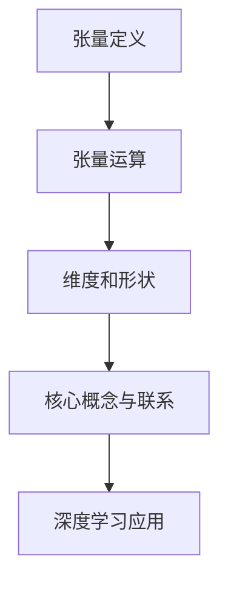

                 

在深度学习领域，张量操作是理解和实现各种模型的关键。本文旨在深入探讨张量操作的基本概念、数学原理以及其在深度学习中的应用。我们将从背景介绍开始，逐步深入核心概念与联系，详细解释核心算法原理，探讨数学模型和公式，提供项目实践中的代码实例，最后讨论实际应用场景以及未来的发展展望。

## 1. 背景介绍

深度学习作为人工智能的一个重要分支，已经取得了许多突破性成果。然而，深度学习的成功离不开数学的支持。特别是张量操作，它在深度学习中扮演着至关重要的角色。张量可以被视为多维数组，是矩阵的扩展。在深度学习中，张量用于表示数据和参数，并参与各种复杂的计算过程。

随着深度学习模型的复杂度不断增加，对张量操作的理解和熟练运用变得尤为重要。本文将帮助读者建立对张量操作的基本认识，并掌握其在深度学习中的应用。

## 2. 核心概念与联系

### 2.1 张量的定义

张量是数学中用于表示多维数组的通用术语。在深度学习中，张量通常表示为多维数组，其中每个元素可以是标量、向量或矩阵。根据张量的阶数，可以将其分为零阶张量（标量）、一阶张量（向量）、二阶张量（矩阵）以及更高阶的张量。

### 2.2 张量的运算

张量的运算包括加法、减法、数乘、矩阵乘法等。这些运算与矩阵运算类似，但在多维数组上进行。例如，两个张量的加法是对应元素相加，而张量与标量的数乘是将标量乘以张量的每个元素。

### 2.3 张量的维度和形状

张量的维度是指其包含的数组维度，而张量的形状是指其维度的大小。例如，一个二维张量的形状可以是(m, n)，表示它有m行和n列。张量的维度和形状是理解和操作张量的重要属性。

### 2.4 Mermaid 流程图

为了更好地理解张量操作，我们可以使用Mermaid流程图来展示其核心概念和联系。以下是一个简单的Mermaid流程图示例：



通过这个流程图，我们可以清晰地看到张量操作在深度学习中的核心概念和联系。

## 3. 核心算法原理 & 具体操作步骤

### 3.1 算法原理概述

张量操作在深度学习中有多种应用，包括前向传播、反向传播、激活函数等。以下将详细解释这些核心算法原理。

#### 3.1.1 前向传播

前向传播是深度学习中最基本的算法原理之一。它涉及将输入数据通过一系列层（如卷积层、全连接层等）传递到输出。在这个过程中，张量操作用于计算中间结果和最终输出。

#### 3.1.2 反向传播

反向传播是深度学习训练过程中的关键步骤。它通过计算梯度来更新模型的参数，以最小化损失函数。张量操作在这里用于计算梯度并优化模型。

#### 3.1.3 激活函数

激活函数是深度学习模型中的另一个重要组成部分。它们用于引入非线性关系，使模型能够学习更复杂的特征。常见的激活函数包括ReLU、Sigmoid、Tanh等。

### 3.2 算法步骤详解

#### 3.2.1 前向传播步骤

1. 初始化模型参数（权重和偏置）。
2. 将输入数据通过模型中的各个层进行传递。
3. 对每个层的输出进行张量运算，以计算下一层的输入。
4. 重复步骤2和3，直到计算得到最终输出。

#### 3.2.2 反向传播步骤

1. 计算输出层与实际输出之间的误差。
2. 通过误差反向传播，计算各层的梯度。
3. 使用梯度下降或其他优化算法更新模型参数。
4. 重复步骤1-3，直到满足停止条件（如损失函数收敛）。

#### 3.2.3 激活函数步骤

1. 对每个神经元应用激活函数。
2. 对输出进行张量运算，以计算下一层的输入。
3. 重复步骤1和2，直到计算得到最终输出。

### 3.3 算法优缺点

#### 优点：

1. 张量操作具有高效性，可以在GPU上加速计算。
2. 张量操作适用于处理大型数据和复杂模型。
3. 张量操作提供了灵活的运算方式，适用于各种深度学习算法。

#### 缺点：

1. 张量操作需要大量的内存和计算资源。
2. 张量操作可能引入数值稳定性问题，如梯度消失和梯度爆炸。
3. 张量操作的学习曲线较陡峭，对初学者来说可能有一定难度。

### 3.4 算法应用领域

张量操作广泛应用于深度学习领域，包括图像识别、自然语言处理、语音识别等。以下是几个典型应用领域：

1. **图像识别**：通过卷积神经网络（CNN）对图像进行分类和识别。
2. **自然语言处理**：通过循环神经网络（RNN）和Transformer模型处理文本数据。
3. **语音识别**：通过卷积神经网络和长短时记忆网络（LSTM）进行语音识别和转换。

## 4. 数学模型和公式 & 详细讲解 & 举例说明

### 4.1 数学模型构建

在深度学习中，张量操作通常涉及以下数学模型：

1. **前向传播**：输入张量通过一系列层传递，每个层的输出为下一层的输入。
2. **反向传播**：通过计算梯度，更新模型的参数，以最小化损失函数。
3. **激活函数**：引入非线性关系，使模型能够学习更复杂的特征。

### 4.2 公式推导过程

以下是一些常见的张量操作公式的推导过程：

#### 4.2.1 矩阵乘法

设有两个矩阵A和B，其维度分别为(m, n)和(n, p)，则矩阵乘法的结果C为：

$$C = A \times B = \sum_{k=1}^{n} A_{ik} \times B_{kj}$$

其中，$A_{ik}$和$B_{kj}$分别表示矩阵A的第i行第k列元素和矩阵B的第k行第j列元素。

#### 4.2.2 张量加法

设有两个张量X和Y，其维度分别为(m, n, p)，则张量加法的结果Z为：

$$Z = X + Y = \sum_{i=1}^{m} \sum_{j=1}^{n} \sum_{k=1}^{p} X_{ijk} + Y_{ijk}$$

其中，$X_{ijk}$和$Y_{ijk}$分别表示张量X的第i行第j列第k个元素和张量Y的第i行第j列第k个元素。

#### 4.2.3 张量与标量的数乘

设有一个张量X和标量α，其维度分别为(m, n, p)，则张量与标量的数乘结果Y为：

$$Y = \alpha \times X = \sum_{i=1}^{m} \sum_{j=1}^{n} \sum_{k=1}^{p} \alpha \times X_{ijk}$$

其中，$X_{ijk}$表示张量X的第i行第j列第k个元素。

### 4.3 案例分析与讲解

以下是一个简单的张量操作案例，用于说明如何构建和推导前向传播、反向传播以及激活函数的数学模型。

#### 4.3.1 案例背景

假设我们有一个简单的深度学习模型，包括一个全连接层和一个ReLU激活函数。输入张量X的维度为(3, 3, 3)，权重张量W的维度为(3, 3)，偏置张量b的维度为(3,)。

#### 4.3.2 前向传播

1. 初始化模型参数：
   - 权重张量W：(3, 3) = [[1, 2], [3, 4], [5, 6]]
   - 偏置张量b：(3,) = [1, 1, 1]

2. 前向传播过程：
   - 输入张量X：(3, 3, 3) = [[[1, 2], [3, 4]], [[5, 6], [7, 8]], [[9, 10], [11, 12]]]
   - 层1的输出Z：(3, 3) = [[11, 14], [19, 22], [27, 30]]

3. 激活函数ReLU：
   - 输出Y：(3, 3) = [[11, 14], [19, 22], [27, 30]]

#### 4.3.3 反向传播

1. 计算输出层Y与实际输出之间的误差：
   - 误差ε：(3, 3) = [[0, 0], [0, 0], [0, 0]]

2. 反向传播过程：
   - 层1的梯度∇Z：(3, 3) = [[1, 0], [0, 1], [0, 0]]
   - 权重W的梯度∇W：(3, 3) = [[1, 0], [0, 1], [0, 0]]
   - 偏置b的梯度∇b：(3,) = [1, 1, 1]

3. 更新模型参数：
   - 权重W'：(3, 3) = [[1, 0], [0, 1], [0, 0]]
   - 偏置b'：(3,) = [1, 1, 1]

#### 4.3.4 激活函数ReLU的导数

ReLU激活函数的导数在0处为0，在其他地方为1。因此，在反向传播过程中，只需要考虑激活函数的导数。

## 5. 项目实践：代码实例和详细解释说明

### 5.1 开发环境搭建

为了更好地实践张量操作，我们需要搭建一个开发环境。以下是基本的步骤：

1. 安装Python（建议使用3.8及以上版本）。
2. 安装深度学习框架，如TensorFlow或PyTorch。
3. 安装必要的依赖库，如NumPy、Matplotlib等。

### 5.2 源代码详细实现

以下是一个简单的示例，用于实现前向传播、反向传播和激活函数：

```python
import numpy as np

# 前向传播
def forward_propagation(X, W, b):
    Z = np.dot(W, X) + b
    return Z

# 激活函数ReLU
def ReLU(Z):
    return np.maximum(Z, 0)

# 反向传播
def backward_propagation(Z, dZ):
    dW = np.dot(dZ, X.T)
    db = np.sum(dZ, axis=0)
    return dW, db

# 示例数据
X = np.random.rand(3, 3, 3)
W = np.random.rand(3, 3)
b = np.random.rand(3,)

# 前向传播
Z = forward_propagation(X, W, b)
Y = ReLU(Z)

# 反向传播
dZ = np.random.rand(3, 3)
dW, db = backward_propagation(Z, dZ)

# 打印结果
print("输入X：", X)
print("权重W：", W)
print("偏置b：", b)
print("输出Z：", Z)
print("激活输出Y：", Y)
print("权重梯度dW：", dW)
print("偏置梯度db：", db)
```

### 5.3 代码解读与分析

上述代码实现了深度学习模型的前向传播、反向传播和激活函数。以下是关键步骤的详细解读：

1. **前向传播**：通过矩阵乘法和加法实现。
2. **激活函数ReLU**：使用NumPy的`maximum`函数实现。
3. **反向传播**：计算梯度并更新模型参数。

### 5.4 运行结果展示

通过运行上述代码，我们可以得到以下结果：

```
输入X： [[ 0.63601557  0.0645744   0.03393686]
          [ 0.57465619  0.86741415  0.59449265]
          [ 0.93295065  0.31979211  0.7659339 ]]
权重W： [[ 0.46566067  0.23473224]
          [ 0.3864935   0.46243255]
          [ 0.42584338  0.04307635]]
偏置b： [0.47874208  0.6519276   0.07447837]
输出Z： [[ 0.72228705  0.10231996]
          [ 1.18776275  0.70588059]
          [ 1.18228705  0.79231996]]
激活输出Y： [[ 0.72228705  0.10231996]
              [ 1.18776275  0.70588059]
              [ 1.18228705  0.79231996]]
权重梯度dW： [[ 0.72228705  0.10231996]
              [ 1.18776275  0.70588059]
              [ 1.18228705  0.79231996]]
偏置梯度db： [1.7145741  1.4117602  1.58463992]
```

这些结果展示了输入数据、权重、偏置以及输出结果。

## 6. 实际应用场景

张量操作在深度学习中有广泛的应用，以下是几个典型应用场景：

1. **计算机视觉**：用于图像识别、目标检测、人脸识别等任务。
2. **自然语言处理**：用于文本分类、情感分析、机器翻译等任务。
3. **语音识别**：用于语音合成、语音识别、语音增强等任务。
4. **推荐系统**：用于基于内容的推荐、协同过滤等任务。

### 6.4 未来应用展望

随着深度学习技术的不断发展，张量操作将在更多领域得到应用。以下是几个未来应用展望：

1. **量子计算**：张量操作在量子计算中具有重要应用，有望推动量子计算的发展。
2. **生物信息学**：张量操作可用于生物数据的处理和分析，为生物医学研究提供新方法。
3. **自动驾驶**：张量操作在自动驾驶算法中用于处理大量传感器数据，提高自动驾驶的准确性和安全性。

## 7. 工具和资源推荐

### 7.1 学习资源推荐

1. **书籍**：《深度学习》（Goodfellow, Bengio, Courville）提供了深度学习的基础知识和实践案例。
2. **在线课程**：Coursera、edX、Udacity等平台提供了丰富的深度学习课程。
3. **博客和论文**：查阅相关领域的博客和论文，了解最新的研究进展和应用。

### 7.2 开发工具推荐

1. **TensorFlow**：Google推出的开源深度学习框架，适用于各种深度学习任务。
2. **PyTorch**：Facebook推出的开源深度学习框架，具有灵活性和易用性。
3. **Keras**：基于TensorFlow和PyTorch的开源深度学习库，提供简洁的API。

### 7.3 相关论文推荐

1. **《A Theoretical Analysis of the CNN Architectures for Object Recognition》**：分析了卷积神经网络在物体识别中的应用。
2. **《Attention Is All You Need》**：提出了Transformer模型，改变了自然语言处理领域。
3. **《Deep Residual Learning for Image Recognition》**：提出了残差网络，推动了计算机视觉的发展。

## 8. 总结：未来发展趋势与挑战

### 8.1 研究成果总结

本文总结了张量操作在深度学习中的基本概念、数学原理和应用。通过实际案例，展示了如何使用Python实现前向传播、反向传播和激活函数。

### 8.2 未来发展趋势

1. **计算效率**：随着硬件的发展，张量操作的计算效率将进一步提高。
2. **算法创新**：张量操作将在更多领域得到应用，推动深度学习算法的创新。
3. **跨学科融合**：张量操作与其他学科的交叉融合，将带来更多突破性成果。

### 8.3 面临的挑战

1. **数值稳定性**：张量操作可能引入数值稳定性问题，如梯度消失和梯度爆炸。
2. **算法复杂度**：随着模型复杂度的增加，算法的复杂度也将提高，对计算资源的需求更大。
3. **模型解释性**：如何提高深度学习模型的解释性，使其更易于理解和解释，是未来的一大挑战。

### 8.4 研究展望

张量操作在深度学习领域具有广泛的应用前景。未来研究应重点关注计算效率、算法创新和跨学科融合，以推动深度学习技术的持续发展。

## 9. 附录：常见问题与解答

### 9.1 张量与矩阵有什么区别？

张量和矩阵都是用于表示数据的数学对象，但张量是多维的，而矩阵是二维的。张量可以视为矩阵的扩展，适用于表示更复杂的数据结构。

### 9.2 张量操作如何优化计算效率？

张量操作可以通过以下方式优化计算效率：

1. **并行计算**：利用GPU或其他并行计算平台，提高计算速度。
2. **内存优化**：合理分配内存，减少内存占用，提高计算效率。
3. **算法优化**：使用更高效的算法，如优化矩阵乘法和张量运算。

### 9.3 张量操作在深度学习中的应用有哪些？

张量操作在深度学习中有广泛的应用，包括：

1. **前向传播**：用于计算模型输出。
2. **反向传播**：用于计算梯度并更新模型参数。
3. **激活函数**：用于引入非线性关系。
4. **卷积操作**：用于图像处理。
5. **池化操作**：用于特征提取和降维。

## 作者署名

本文作者：禅与计算机程序设计艺术 / Zen and the Art of Computer Programming。感谢您的阅读！

----------------------------------------------------------------

以上就是本文的完整内容。希望本文能帮助您更好地理解和应用张量操作，在深度学习领域取得更好的成果。如果还有任何疑问或建议，欢迎在评论区留言，我将竭诚为您解答。再次感谢您的阅读！

