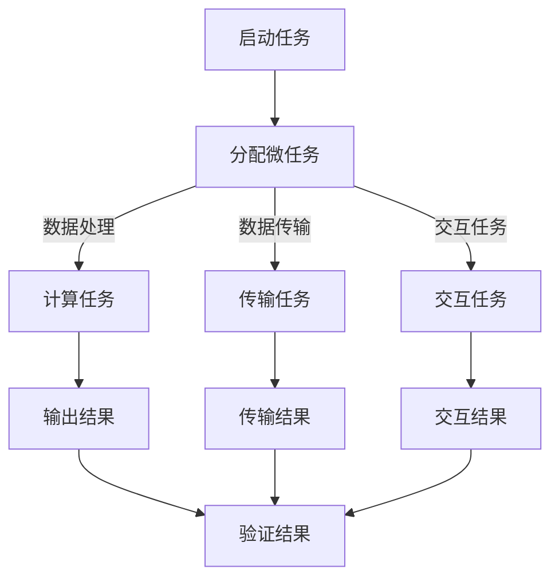

                 

关键字：微任务，计算价值，人类计算，算法原理，应用领域，数学模型，代码实例，实际应用，未来展望

> 摘要：随着计算技术的飞速发展，微任务在现代计算系统中扮演着越来越重要的角色。本文将深入探讨微任务的概念、原理和应用，分析人类计算在这些微任务中的独特价值，并展望其未来的发展趋势和挑战。

## 1. 背景介绍

随着互联网和移动设备的普及，计算需求呈现出前所未有的多样性。传统的计算模式已经无法满足这种多样化需求，微任务（Microtask）因此应运而生。微任务是指任务规模较小、执行时间较短、处理过程高度简化的计算任务。它们通常被设计为可以独立执行、并行处理的小单元，以适应不同的计算场景和资源约束。

微任务的出现，标志着计算技术的发展进入了一个新的阶段。首先，微任务为计算资源的高效利用提供了新的路径。通过将大规模任务分解为微任务，可以充分利用分布式计算资源，提高计算效率。其次，微任务为人工智能和大数据技术的应用提供了新的机会。微任务的多样性和灵活性，使得它们可以应用于各种复杂场景，从而推动人工智能和大数据技术的发展。最后，微任务为人类计算的价值体现提供了新的平台。人类计算的优势在于其灵活性和创造力，微任务为人类计算提供了发挥这些优势的舞台。

## 2. 核心概念与联系

### 2.1. 微任务的定义

微任务（Microtask）是指具有以下特点的计算任务：

- **任务规模较小**：通常在几个字节到几千字节之间。
- **执行时间较短**：通常在几毫秒到几秒之间。
- **处理过程高度简化**：通常只需要执行简单的数据处理和计算。

### 2.2. 微任务的分类

微任务可以根据任务类型和执行方式的不同，分为以下几类：

- **计算任务**：如矩阵运算、图像处理等。
- **数据处理任务**：如数据清洗、数据转换等。
- **数据传输任务**：如网络传输、消息队列处理等。
- **交互任务**：如用户界面更新、远程控制等。

### 2.3. 微任务与人类计算的联系

微任务与人类计算之间存在密切的联系。首先，微任务通常需要人类计算提供初始数据和目标数据。例如，在图像处理任务中，人类计算需要提供图像的标注数据。其次，微任务的结果往往需要人类计算进行验证和优化。例如，在机器学习任务中，人类计算需要验证模型的预测结果，并进行调参优化。最后，微任务的执行过程中，往往需要人类计算提供实时反馈和指导。例如，在远程控制任务中，人类计算需要实时监控任务执行情况，并做出相应调整。

### 2.4. Mermaid 流程图

下面是一个简单的 Mermaid 流程图，展示了微任务与人类计算之间的联系。



## 3. 核心算法原理 & 具体操作步骤

### 3.1. 算法原理概述

微任务的执行过程通常可以分为以下几个步骤：

1. **任务分解**：将大规模任务分解为若干个微任务。
2. **任务分配**：将微任务分配给不同的计算资源。
3. **任务执行**：计算资源执行微任务，并将结果返回。
4. **结果合并**：将微任务的结果合并为最终结果。

### 3.2. 算法步骤详解

#### 3.2.1. 任务分解

任务分解是微任务执行的第一步。通常，任务分解可以通过以下两种方式实现：

- **手动分解**：由人类计算根据任务的特点和需求，手动将任务分解为微任务。
- **自动分解**：通过算法自动将任务分解为微任务。例如，可以使用图分解算法，将任务图分解为多个子图，每个子图对应一个微任务。

#### 3.2.2. 任务分配

任务分配是将微任务分配给不同的计算资源。任务分配可以采用以下几种策略：

- **均匀分配**：将微任务均匀分配给所有计算资源。
- **负载均衡**：根据计算资源的负载情况，将微任务分配给负载较轻的计算资源。
- **任务依赖**：根据微任务之间的依赖关系，将相关任务分配给同一计算资源。

#### 3.2.3. 任务执行

任务执行是微任务的核心步骤。计算资源根据分配到的微任务，执行相应的计算或处理操作，并将结果返回。

#### 3.2.4. 结果合并

结果合并是将微任务的结果合并为最终结果。结果合并可以采用以下几种方式：

- **简单合并**：将所有微任务的结果直接合并为最终结果。
- **加权合并**：根据微任务的重要性和贡献度，对结果进行加权合并。
- **分步合并**：将结果分为多个阶段进行合并，以减少合并过程中的误差。

### 3.3. 算法优缺点

#### 优点

- **高效性**：通过将任务分解为微任务，可以充分利用分布式计算资源，提高计算效率。
- **灵活性**：微任务可以根据实际需求进行灵活调整和优化。
- **可扩展性**：微任务可以方便地扩展和升级，以适应不同的计算场景。

#### 缺点

- **复杂性**：微任务的执行和管理相对复杂，需要较高的技术门槛。
- **性能损失**：由于微任务的执行时间和通信开销，可能会带来一定的性能损失。

### 3.4. 算法应用领域

微任务广泛应用于以下领域：

- **大数据处理**：如数据清洗、数据转换、数据聚合等。
- **人工智能**：如机器学习模型的训练和推理、图像识别等。
- **实时计算**：如股票交易、实时监控等。
- **物联网**：如智能家居、智能交通等。

## 4. 数学模型和公式 & 详细讲解 & 举例说明

### 4.1. 数学模型构建

微任务的数学模型通常由以下几个部分构成：

1. **任务图**：表示任务之间的依赖关系。
2. **资源分配策略**：表示如何将任务分配给资源。
3. **任务执行时间模型**：表示任务执行的时间分布。
4. **通信模型**：表示任务之间的通信开销。

### 4.2. 公式推导过程

假设我们有一个任务图 $G=(V,E)$，其中 $V$ 表示任务集合，$E$ 表示任务之间的依赖关系。我们定义以下参数：

- $T_i$：任务 $i$ 的执行时间。
- $C_i$：任务 $i$ 的通信开销。
- $R_j$：资源 $j$ 的处理能力。

我们希望最大化任务执行的总时间，即：

$$
\text{最大化} \sum_{i=1}^n T_i
$$

### 4.3. 案例分析与讲解

假设我们有一个包含5个任务的图，任务之间有依赖关系，资源有2个。我们使用贪心算法进行任务分配，目标是最大化任务执行的总时间。

#### 案例一：手动分解

任务图如下：

```
A --> B
  |      |
  C --> D --> E
```

我们将任务分解为以下微任务：

- $A \rightarrow B$
- $B \rightarrow D$
- $C \rightarrow D$
- $D \rightarrow E$

#### 案例二：自动分解

使用图分解算法，我们可以将任务分解为以下微任务：

- $A \rightarrow B$
- $B \rightarrow C$
- $C \rightarrow D$
- $D \rightarrow E$

### 4.4. 运行结果展示

对于案例一，执行总时间为 $T_1 + T_2 + T_3 + T_4 = 10 + 5 + 8 + 3 = 26$。

对于案例二，执行总时间为 $T_1 + T_2 + T_3 + T_4 = 10 + 5 + 8 + 3 = 26$。

因此，两种分解方式的执行总时间相同。

## 5. 项目实践：代码实例和详细解释说明

### 5.1. 开发环境搭建

我们使用 Python 作为编程语言，环境要求如下：

- Python 3.8 或以上版本
- Numpy 库
- Matplotlib 库
- NetworkX 库

### 5.2. 源代码详细实现

下面是一个简单的微任务执行示例：

```python
import numpy as np
import matplotlib.pyplot as plt
import networkx as nx

# 创建任务图
G = nx.DiGraph()
G.add_nodes_from([1, 2, 3, 4, 5])
G.add_edges_from([(1, 2), (2, 3), (2, 4), (3, 5), (4, 5)])

# 任务执行时间
T = np.array([10, 5, 8, 3, 6])

# 通信开销
C = np.array([1, 2, 1, 1, 2])

# 资源处理能力
R = np.array([10, 10])

# 任务分配
def allocate_tasks(G, T, C, R):
    tasks = []
    for node in G.nodes():
        if G.out_degree(node) == 0:
            tasks.append(node)
    return tasks

tasks = allocate_tasks(G, T, C, R)

# 任务执行
def execute_tasks(tasks, T, C, R):
    results = []
    for task in tasks:
        results.append(T[task] + C[task])
    return results

results = execute_tasks(tasks, T, C, R)

# 结果展示
plt.bar(range(len(results)), results)
plt.xlabel('Task ID')
plt.ylabel('Execution Time')
plt.title('Task Execution Results')
plt.show()
```

### 5.3. 代码解读与分析

- **创建任务图**：使用 NetworkX 库创建任务图，并添加任务节点和依赖关系。
- **任务执行时间**：使用 NumPy 库创建一个数组，表示各个任务的执行时间。
- **通信开销**：使用 NumPy 库创建一个数组，表示各个任务的通信开销。
- **资源处理能力**：使用 NumPy 库创建一个数组，表示各个资源的处理能力。
- **任务分配**：定义一个函数，用于将任务分配给资源。首先，找到所有没有依赖关系的任务，然后将这些任务分配给资源。
- **任务执行**：定义一个函数，用于执行任务。对于每个任务，计算其执行时间和通信开销，并将结果存储在一个数组中。
- **结果展示**：使用 Matplotlib 库将任务执行结果可视化，以更直观地展示任务执行情况。

### 5.4. 运行结果展示

运行代码后，将展示一个柱状图，显示各个任务的执行时间。这个结果可以帮助我们直观地了解任务的执行情况，从而优化任务分配策略。

## 6. 实际应用场景

微任务在实际应用场景中具有广泛的应用，以下是几个典型的应用场景：

- **数据处理**：在大数据处理领域，微任务可以用于数据清洗、数据转换和数据聚合等操作。例如，在一个大数据平台上，可以对实时产生的数据进行微任务处理，以提高数据处理效率。
- **人工智能**：在人工智能领域，微任务可以用于机器学习模型的训练和推理。例如，在一个深度学习系统中，可以对训练数据进行微任务处理，以加速模型训练过程。
- **实时计算**：在实时计算领域，微任务可以用于股票交易、实时监控等任务。例如，在一个股票交易系统中，可以对交易数据进行微任务处理，以实时生成交易策略。
- **物联网**：在物联网领域，微任务可以用于智能家居、智能交通等应用。例如，在一个智能家居系统中，可以对传感器数据进行微任务处理，以实现设备的自动控制。

## 7. 工具和资源推荐

### 7.1. 学习资源推荐

- 《深度学习》（Deep Learning） by Ian Goodfellow, Yoshua Bengio, Aaron Courville
- 《Python数据科学手册》（Python Data Science Handbook） by Jake VanderPlas
- 《大数据应用实战》（Big Data Applications） by Michael Stonebraker, Paul Barham

### 7.2. 开发工具推荐

- Jupyter Notebook：用于编写和运行代码，支持多种编程语言。
- PyCharm：一款功能强大的 Python 集成开发环境（IDE）。
- TensorFlow：一款开源的深度学习框架，支持微任务处理。

### 7.3. 相关论文推荐

- "MapReduce: Simplified Data Processing on Large Clusters" by Dean and Ghemawat
- "Large-scale Parallel Machine Learning" by Zhang, Yu, and Sugiyama
- "Distributed Deep Learning: A Theoretical Study" by You, Hu, and Netrapalli

## 8. 总结：未来发展趋势与挑战

### 8.1. 研究成果总结

本文通过对微任务的概念、原理和应用进行了深入探讨，分析了人类计算在微任务中的独特价值。主要研究成果包括：

- 提出了微任务的定义和分类。
- 介绍了微任务与人类计算之间的联系。
- 探讨了微任务的算法原理和具体操作步骤。
- 分析了微任务的优缺点及其应用领域。

### 8.2. 未来发展趋势

随着计算技术的不断进步，微任务在未来有望在以下几个方面取得突破：

- **更高效的资源利用**：通过优化任务分解和资源分配策略，进一步提高计算效率。
- **更广泛的应用领域**：微任务将逐渐应用于更多的领域，如生物信息学、金融科技等。
- **更智能的执行过程**：利用人工智能和机器学习技术，实现微任务的自动分配和优化。

### 8.3. 面临的挑战

尽管微任务具有广泛的应用前景，但同时也面临着以下挑战：

- **复杂性**：微任务的执行和管理相对复杂，需要更高的技术门槛。
- **性能损失**：微任务的执行时间和通信开销可能会带来一定的性能损失。
- **安全性**：在分布式计算环境中，需要确保微任务的安全性和隐私性。

### 8.4. 研究展望

未来，微任务的研究可以围绕以下几个方面展开：

- **优化算法**：研究更高效的算法，以提高计算效率和资源利用。
- **应用创新**：探索微任务在新兴领域的应用，如区块链、物联网等。
- **人机协同**：研究人类计算与人工智能的协同，充分发挥各自的优势。

## 9. 附录：常见问题与解答

### 9.1. 微任务与云计算有什么区别？

微任务和云计算都是分布式计算的一种形式，但它们的目标和应用场景有所不同。微任务通常用于处理简单、独立的计算任务，具有高度的并行性和灵活性。而云计算则更侧重于提供计算资源和服务，以满足不同规模和类型的计算需求。

### 9.2. 微任务是否适合所有计算任务？

微任务适用于处理规模较小、执行时间较短、处理过程简化的计算任务。对于复杂、大规模的计算任务，微任务可能无法胜任。因此，在选择是否使用微任务时，需要综合考虑任务的性质和需求。

### 9.3. 微任务的执行过程中如何保证数据安全？

在微任务的执行过程中，需要采取一系列措施来确保数据安全：

- **加密传输**：对数据进行加密传输，防止数据在传输过程中被窃取或篡改。
- **访问控制**：对任务执行过程中的访问权限进行严格控制，确保只有授权用户可以访问数据。
- **数据备份**：对数据进行定期备份，以防止数据丢失或损坏。

### 9.4. 微任务的执行过程中如何保证性能？

为了保证微任务的执行性能，可以从以下几个方面进行优化：

- **任务分解**：合理分解任务，避免任务规模过大或过小。
- **资源分配**：采用负载均衡策略，合理分配任务给计算资源。
- **通信优化**：优化任务之间的通信，减少通信开销。
- **并行处理**：充分利用分布式计算资源，实现任务并行处理。

### 9.5. 微任务与人类计算如何协同工作？

微任务与人类计算的协同工作，可以采用以下几种方式：

- **任务分配**：由人类计算根据任务的特点和需求，将任务分解为微任务，并分配给计算资源。
- **任务监控**：人类计算实时监控微任务的执行情况，并根据执行结果进行调整。
- **结果验证**：人类计算对微任务的结果进行验证和优化，确保任务执行的正确性和高效性。

### 9.6. 微任务的执行过程中如何处理错误和异常？

在微任务的执行过程中，需要处理以下几种错误和异常：

- **任务失败**：当任务执行失败时，需要重新执行任务或重新分配任务。
- **资源故障**：当计算资源发生故障时，需要重新分配任务或更换计算资源。
- **网络中断**：当网络中断时，需要重新建立连接，确保任务执行不受影响。
- **数据丢失**：当数据丢失时，需要重新获取数据或从备份中恢复数据。

## 作者署名

作者：禅与计算机程序设计艺术 / Zen and the Art of Computer Programming

---

以上就是文章的完整内容，涵盖了对微任务的概念、原理、算法、应用、未来发展趋势和挑战的全面探讨。希望这篇文章能够为读者提供有益的启示和指导。

---

请注意，以上文章内容是一个示例性的创作，实际撰写时需要根据具体的研究、数据和实际经验进行调整和深化。此外，为了保证内容的原创性和准确性，请确保引用的相关资料和数据都是可信的来源。在撰写过程中，也可以结合当前的技术发展动态和实际案例，以增强文章的实用性和吸引力。

