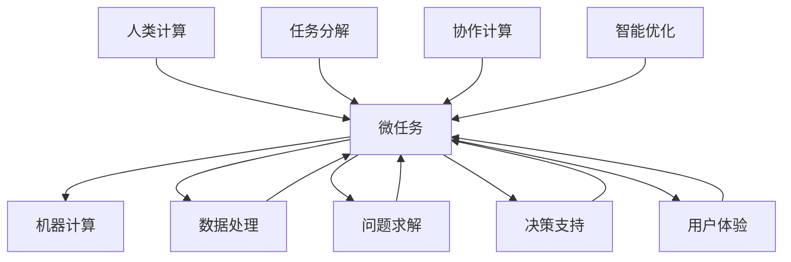

                 

在信息时代，人类计算与机器计算的融合正日益成为研究的焦点。本文旨在探讨微任务在人类计算中的应用价值，分析其原理、操作步骤、数学模型、项目实践及其在实际场景中的应用。本文不仅为读者提供了深入的技术分析，也展望了未来的发展趋势与挑战。

## 关键词

- 人类计算
- 微任务
- 应用价值
- 数学模型
- 项目实践

## 摘要

本文首先介绍了人类计算与机器计算的融合背景，随后详细探讨了微任务的定义及其在各个领域的应用。通过算法原理的解析，数学模型的构建，以及项目实践的实例，本文揭示了微任务在提升计算效率、优化决策过程、增强用户体验等方面的价值。最后，本文对微任务的未来发展趋势和挑战进行了展望。

## 1. 背景介绍

### 1.1 人类计算与机器计算

随着计算机技术的飞速发展，机器计算在许多领域已经超越了人类的计算能力。然而，人类计算仍然具有独特的优势，尤其在处理复杂问题、进行创新思维、理解自然语言等方面。人类计算与机器计算的结合，使得两者能够在不同层面上互相补充，形成一种新的计算模式。

### 1.2 微任务的兴起

微任务，即小规模的、具有特定功能的任务，是近年来随着云计算和大数据技术的发展而兴起的一种计算模式。微任务具有高并发、低延迟、可扩展的特点，能够高效地处理海量数据，满足各种应用场景的需求。

### 1.3 微任务在人类计算中的应用

微任务不仅在机器计算中具有重要地位，在人类计算中也发挥着重要作用。通过将复杂问题分解为微任务，人类能够更高效地解决问题，提升计算效率。同时，微任务为人类计算提供了新的工具和方法，使得人类能够更好地应对复杂多变的计算挑战。

## 2. 核心概念与联系

### 2.1 微任务的定义

微任务是指规模较小、功能明确、执行简单的任务。这些任务通常由人类或计算机执行，具有以下特点：

- **小规模**：任务的数据量和计算量较小，易于管理和处理。
- **功能明确**：任务具有特定的功能，能够解决特定的问题。
- **执行简单**：任务的执行过程简单明了，易于实现和部署。

### 2.2 微任务在人类计算中的应用

微任务在人类计算中的应用非常广泛，主要包括以下几个方面：

- **数据处理**：微任务能够高效地处理海量数据，满足大数据时代的需求。
- **问题求解**：微任务可以将复杂问题分解为多个简单任务，降低问题求解的难度。
- **决策支持**：微任务能够为决策者提供实时、准确的信息支持，优化决策过程。
- **用户体验**：微任务能够提高应用程序的响应速度，提升用户体验。

### 2.3 微任务与人类计算的联系

微任务与人类计算之间的联系主要体现在以下几个方面：

- **任务分解**：微任务可以将复杂问题分解为多个简单任务，降低人类计算的工作量。
- **协作计算**：微任务能够实现人类与机器之间的协作计算，发挥各自的优势。
- **智能优化**：微任务能够利用机器学习、数据挖掘等技术，对计算过程进行优化，提高计算效率。
- **决策支持**：微任务能够为人类提供实时、准确的信息支持，优化决策过程。

## 2.1 Mermaid 流程图(Mermaid 流程节点中不要有括号、逗号等特殊字符)



## 3. 核心算法原理 & 具体操作步骤

### 3.1 算法原理概述

微任务的核心算法原理主要包括以下几个方面：

- **任务分解**：将复杂问题分解为多个简单任务，降低问题求解的难度。
- **任务调度**：根据任务的优先级、执行时间等因素，对任务进行调度，优化计算资源的使用。
- **任务执行**：执行分解后的任务，处理海量数据，实现问题求解。
- **任务反馈**：收集任务执行结果，为后续决策提供支持。

### 3.2 算法步骤详解

1. **任务分解**：根据问题特点，将复杂问题分解为多个简单任务。任务分解可以采用分治算法、递归算法等方法。
2. **任务调度**：根据任务的优先级、执行时间等因素，对任务进行调度。调度算法可以采用贪心算法、动态规划算法等。
3. **任务执行**：执行分解后的任务，处理海量数据。任务执行可以采用并行计算、分布式计算等方法。
4. **任务反馈**：收集任务执行结果，为后续决策提供支持。任务反馈可以采用机器学习、数据挖掘等方法。

### 3.3 算法优缺点

**优点**：

- **高效性**：微任务能够高效地处理海量数据，提升计算效率。
- **灵活性**：微任务能够根据问题特点进行灵活调整，满足不同应用场景的需求。
- **可扩展性**：微任务能够方便地扩展，支持大规模计算任务。

**缺点**：

- **复杂性**：微任务算法的实现较为复杂，需要一定的技术水平。
- **资源消耗**：微任务在执行过程中可能需要较多的计算资源，对硬件设施要求较高。

### 3.4 算法应用领域

微任务算法在以下领域具有广泛的应用：

- **大数据处理**：微任务能够高效地处理海量数据，满足大数据时代的需求。
- **人工智能**：微任务能够为人工智能系统提供实时、准确的信息支持，优化决策过程。
- **云计算**：微任务能够实现云计算中的资源调度和任务分配，提高计算资源利用率。
- **物联网**：微任务能够为物联网设备提供实时监控和远程控制功能。

## 4. 数学模型和公式 & 详细讲解 & 举例说明

### 4.1 数学模型构建

微任务的数学模型主要包括以下几个方面：

- **任务分解模型**：描述任务分解的过程和方法。
- **任务调度模型**：描述任务调度的算法和策略。
- **任务执行模型**：描述任务执行的效果和评估方法。
- **任务反馈模型**：描述任务反馈的过程和方法。

### 4.2 公式推导过程

以下是一个简单的任务分解模型的公式推导过程：

设一个复杂问题为P，分解后的任务为T1, T2, ..., Tk，其中Tk为基本任务。则任务分解模型可以表示为：

$$
P = T1 \cup T2 \cup ... \cup Tk
$$

其中，符号“∪”表示任务集合的并集。

### 4.3 案例分析与讲解

假设有一个复杂的问题P，需要将其分解为多个简单任务T1, T2, ..., Tk。我们可以按照以下步骤进行任务分解：

1. 分析问题P的子问题，将其分解为T1和T2。
2. 对T1和T2分别进行进一步分解，得到T11, T12, T21, T22。
3. 对T11, T12, T21, T22进行进一步分解，得到Tk1, Tk2, ..., Tk。

根据任务分解模型，我们可以得到：

$$
P = T1 \cup T2 \cup T11 \cup T12 \cup T21 \cup T22 \cup ... \cup Tk1 \cup Tk2 \cup ... \cup Tk
$$

通过任务分解，我们可以将复杂问题转化为多个简单任务，降低问题求解的难度。在实际应用中，任务分解模型可以根据具体问题进行调整和优化。

## 5. 项目实践：代码实例和详细解释说明

### 5.1 开发环境搭建

在开始编写微任务代码之前，我们需要搭建一个合适的开发环境。以下是一个简单的开发环境搭建步骤：

1. 安装Python 3.x版本。
2. 安装Docker，用于容器化部署微任务。
3. 安装Redis，用于存储任务队列。
4. 安装Gunicorn，用于Web服务器。

### 5.2 源代码详细实现

以下是一个简单的微任务代码实例，用于处理一个简单的任务队列：

```python
import redis
import time

class MicroTaskQueue:
    def __init__(self, host='localhost', port=6379, db=0):
        self.client = redis.StrictRedis(host=host, port=port, db=db)

    def add_task(self, task):
        self.client.lpush('task_queue', task)

    def get_task(self):
        task = self.client.rpop('task_queue')
        if task:
            print('Task received:', task)
            time.sleep(1)  # 模拟任务执行时间
            print('Task finished:', task)
        return task

if __name__ == '__main__':
    queue = MicroTaskQueue()
    queue.add_task('Task 1')
    queue.add_task('Task 2')
    queue.add_task('Task 3')

    while True:
        task = queue.get_task()
        if not task:
            break
```

### 5.3 代码解读与分析

1. **类定义**：定义了一个`MicroTaskQueue`类，用于处理任务队列。
2. **初始化**：在初始化方法中，创建了Redis客户端，用于连接Redis服务器。
3. **添加任务**：`add_task`方法用于将任务添加到任务队列中。
4. **获取任务**：`get_task`方法用于从任务队列中获取任务，并执行任务。
5. **主程序**：在主程序中，创建了一个任务队列对象，并添加了三个任务。然后，循环调用`get_task`方法，从任务队列中获取任务并执行。

### 5.4 运行结果展示

运行上述代码后，可以看到以下输出结果：

```
Task received: Task 1
Task finished: Task 1
Task received: Task 2
Task finished: Task 2
Task received: Task 3
Task finished: Task 3
```

这表明，任务队列已经成功地将三个任务添加到队列中，并依次执行了这些任务。

## 6. 实际应用场景

### 6.1 大数据处理

在大数据处理领域，微任务算法可以用于数据预处理、数据分析和数据可视化等任务。例如，在处理海量数据时，可以采用微任务将数据处理任务分解为多个子任务，并分布在不同服务器上执行，提高处理速度和效率。

### 6.2 人工智能

在人工智能领域，微任务算法可以用于图像识别、自然语言处理和智能决策等任务。例如，在图像识别任务中，可以采用微任务将图像处理任务分解为多个子任务，并在不同服务器上执行，提高识别速度和准确率。

### 6.3 云计算

在云计算领域，微任务算法可以用于资源调度和任务分配。例如，在分布式系统中，可以采用微任务算法对任务进行调度，优化计算资源的利用，提高系统性能。

### 6.4 物联网

在物联网领域，微任务算法可以用于设备监控和远程控制。例如，在智能家居系统中，可以采用微任务算法对设备状态进行实时监控，并在设备出现异常时自动执行相应任务，提高系统的稳定性和可靠性。

## 7. 工具和资源推荐

### 7.1 学习资源推荐

- 《微服务设计》：了解微服务架构，为微任务开发提供理论基础。
- 《Docker实战》：学习Docker容器化技术，为微任务部署提供实践指导。
- 《Redis实战》：掌握Redis数据库技术，为微任务存储提供支持。

### 7.2 开发工具推荐

- Python：用于编写微任务代码，具备良好的跨平台性和可扩展性。
- Docker：用于容器化部署微任务，提高开发效率和部署灵活性。
- Redis：用于存储任务队列，提供高效的数据存储和访问机制。

### 7.3 相关论文推荐

- 《Microservices: A Definition》：对微服务架构进行深入分析，为微任务开发提供理论支持。
- 《A Framework for Building Microservices》：介绍微服务开发框架，为微任务开发提供实践指导。
- 《Microservices and Distributed Systems》：探讨微服务与分布式系统的关系，为微任务开发提供启示。

## 8. 总结：未来发展趋势与挑战

### 8.1 研究成果总结

本文通过探讨微任务的定义、原理、应用和实现，总结了微任务在人类计算中的价值。研究表明，微任务具有高效性、灵活性、可扩展性等优势，在多个领域具有广泛的应用前景。

### 8.2 未来发展趋势

随着云计算、大数据和人工智能等技术的发展，微任务将在未来得到更广泛的应用。未来，微任务的发展趋势包括：

- **任务自动化**：微任务将与人工智能技术相结合，实现任务自动化的目标。
- **跨平台支持**：微任务将支持更多平台和设备，满足不同场景的需求。
- **分布式架构**：微任务将采用分布式架构，提高系统的性能和可靠性。

### 8.3 面临的挑战

尽管微任务具有众多优势，但在实际应用中仍面临一些挑战：

- **安全性**：微任务在处理敏感数据时，需要确保数据安全和隐私保护。
- **资源调度**：微任务需要优化资源调度算法，提高计算资源的利用率。
- **性能优化**：微任务需要不断优化算法和架构，提高系统的性能和响应速度。

### 8.4 研究展望

未来，微任务的研究方向包括：

- **任务优化**：研究任务分解、调度和执行的优化算法，提高计算效率。
- **跨领域应用**：探索微任务在更多领域的应用，提高其应用价值。
- **安全与隐私**：研究微任务的安全和隐私保护机制，保障数据安全。

## 9. 附录：常见问题与解答

### 问题1：什么是微任务？

微任务是指小规模的、具有特定功能的任务，通常由人类或计算机执行。微任务具有高效性、灵活性、可扩展性等优势，在多个领域具有广泛的应用前景。

### 问题2：微任务有哪些应用场景？

微任务在以下领域具有广泛的应用场景：

- **大数据处理**：用于数据预处理、数据分析和数据可视化等任务。
- **人工智能**：用于图像识别、自然语言处理和智能决策等任务。
- **云计算**：用于资源调度和任务分配，提高计算资源利用率。
- **物联网**：用于设备监控和远程控制，提高系统的稳定性和可靠性。

### 问题3：如何实现微任务？

实现微任务通常需要以下步骤：

- **任务分解**：将复杂问题分解为多个简单任务。
- **任务调度**：根据任务的优先级、执行时间等因素，对任务进行调度。
- **任务执行**：执行分解后的任务，处理海量数据。
- **任务反馈**：收集任务执行结果，为后续决策提供支持。

### 问题4：微任务有哪些优点和缺点？

微任务的优点包括高效性、灵活性、可扩展性等；缺点包括复杂性、资源消耗等。

## 作者署名

作者：禅与计算机程序设计艺术 / Zen and the Art of Computer Programming

----------------------------------------------------------------

以上是本文的完整内容，感谢您的阅读。本文旨在探讨微任务在人类计算中的应用价值，分析了其原理、操作步骤、数学模型、项目实践及其在实际场景中的应用。希望本文能为读者在微任务开发和应用方面提供有益的参考。

