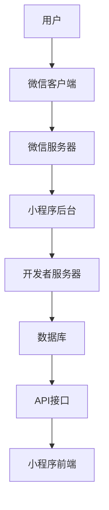

                 

关键词：微信小程序、注意力经济、开发指南、实战应用、未来展望

> 摘要：随着移动互联网的快速发展，微信小程序成为了企业和服务提供商在新战场上的重要阵地。本文将深入探讨微信小程序的开发、应用、未来趋势以及面临的挑战。

## 1. 背景介绍

在过去的几年里，移动互联网的用户增长速度逐渐放缓，但微信小程序的崛起为开发者提供了一个全新的机会。微信小程序的出现，不仅满足了用户对于便捷性、高效性的需求，也为企业提供了低成本、高效率的解决方案。

注意力经济是一个新兴的概念，指的是用户在互联网上的注意力被作为商品进行交易的经济模式。微信小程序通过其强大的用户基础和便捷的使用体验，成为了注意力经济的重要载体。本文将围绕微信小程序的开发、应用和未来趋势，探讨注意力经济的新战场。

## 2. 核心概念与联系

### 2.1 微信小程序架构



### 2.2 注意力经济原理

注意力经济是指通过吸引用户的注意力，从而实现商业价值的一种经济模式。在微信小程序中，用户通过浏览、互动、分享等方式，不断将注意力投入到小程序中，进而为企业带来流量和收入。

### 2.3 微信小程序与注意力经济的联系

微信小程序凭借其便捷的使用体验和强大的用户基础，成为了注意力经济的重要载体。通过小程序，企业可以更直接地接触到用户，从而实现商业价值。

## 3. 核心算法原理 & 具体操作步骤

### 3.1 算法原理概述

微信小程序的核心算法主要包括前端渲染、后端处理和数据存储等方面。其中，前端渲染算法负责将用户界面呈现给用户，后端处理算法负责处理用户请求和数据存储，数据存储算法负责存储和管理用户数据。

### 3.2 算法步骤详解

#### 3.2.1 前端渲染算法

1. 用户操作小程序界面。
2. 小程序前端解析用户操作，生成相应的渲染指令。
3. 渲染指令通过微信客户端的渲染引擎进行渲染，呈现给用户。

#### 3.2.2 后端处理算法

1. 用户请求小程序服务。
2. 微信客户端将请求发送到小程序后台。
3. 小程序后台处理请求，返回相应的结果。

#### 3.2.3 数据存储算法

1. 用户数据在小程序后台进行存储。
2. 用户数据可以通过API接口进行读取和修改。
3. 数据存储算法保证数据的完整性和安全性。

### 3.3 算法优缺点

#### 3.3.1 优点

1. 高效性：微信小程序的算法设计充分考虑了用户的使用体验，提高了小程序的运行效率。
2. 稳定性：微信小程序的算法经过了大量用户测试，保证了小程序的稳定性。
3. 便捷性：微信小程序的算法实现了便捷的用户操作和数据存储，提高了用户的使用效率。

#### 3.3.2 缺点

1. 限制性：微信小程序的算法设计受到微信平台的限制，开发者需要在一定范围内进行创新。
2. 竞争性：随着微信小程序的普及，竞争日益激烈，开发者需要不断提高自身的技术水平。

### 3.4 算法应用领域

微信小程序的算法广泛应用于电商、社交、教育、金融等多个领域，为企业提供了丰富的解决方案。

## 4. 数学模型和公式 & 详细讲解 & 举例说明

### 4.1 数学模型构建

微信小程序的数学模型主要包括用户行为模型、服务质量模型和收益模型等。其中，用户行为模型主要描述了用户在微信小程序中的操作行为；服务质量模型主要描述了小程序的服务质量；收益模型主要描述了小程序的收益情况。

### 4.2 公式推导过程

#### 4.2.1 用户行为模型

$$
用户行为模型 = f(用户兴趣，小程序内容)
$$

其中，$用户兴趣$ 表示用户的兴趣偏好，$小程序内容$ 表示小程序提供的功能和服务。

#### 4.2.2 服务质量模型

$$
服务质量模型 = f(响应时间，数据完整性，功能丰富性)
$$

其中，$响应时间$ 表示小程序对用户请求的响应速度，$数据完整性$ 表示小程序数据的安全性和可靠性，$功能丰富性$ 表示小程序提供的服务和功能的多样性。

#### 4.2.3 收益模型

$$
收益模型 = f(用户数量，用户活跃度，服务费用)
$$

其中，$用户数量$ 表示小程序的覆盖用户数量，$用户活跃度$ 表示用户在小程序中的活跃程度，$服务费用$ 表示小程序提供服务的费用。

### 4.3 案例分析与讲解

以电商领域为例，某电商企业通过微信小程序提供商品展示、购物车、订单处理等功能。根据用户行为模型，企业可以分析用户的购买习惯和偏好，从而优化商品推荐和服务质量。

## 5. 项目实践：代码实例和详细解释说明

### 5.1 开发环境搭建

在开发微信小程序之前，需要搭建相应的开发环境。具体步骤如下：

1. 下载并安装微信开发者工具。
2. 注册成为微信小程序开发者。
3. 创建小程序项目，配置项目相关信息。

### 5.2 源代码详细实现

以下是一个简单的微信小程序示例代码，实现了一个简单的购物车功能。

```javascript
// app.js
App({
  onLaunch: function() {
    // 初始化小程序
  }
})

// pages/index/index.js
Page({
  data: {
    cartItems: []
  },
  addCart: function(e) {
    // 添加商品到购物车
    var itemId = e.currentTarget.dataset.id;
    var cartItems = this.data.cartItems;
    cartItems.push(itemId);
    this.setData({ cartItems: cartItems });
  },
  removeCart: function(e) {
    // 从购物车中移除商品
    var itemId = e.currentTarget.dataset.id;
    var cartItems = this.data.cartItems;
    var index = cartItems.indexOf(itemId);
    cartItems.splice(index, 1);
    this.setData({ cartItems: cartItems });
  }
})
```

### 5.3 代码解读与分析

以上代码实现了一个简单的购物车功能。用户可以通过点击“添加购物车”按钮将商品添加到购物车，通过点击“移除购物车”按钮将商品从购物车中移除。代码主要分为两部分：App.js 和 pages/index/index.js。

App.js 负责小程序的初始化操作，pages/index/index.js 负责实现购物车功能。

### 5.4 运行结果展示

用户在微信小程序中点击“添加购物车”按钮，商品将被添加到购物车。用户在购物车页面可以查看已添加的商品，并可以点击“移除购物车”按钮将商品从购物车中移除。

## 6. 实际应用场景

微信小程序在实际应用中具有广泛的应用场景。以下是一些常见的应用场景：

1. **电商购物**：微信小程序为电商平台提供了便捷的购物渠道，用户可以在小程序中浏览商品、下单购买。
2. **餐饮外卖**：微信小程序为餐饮企业提供了一种高效的外卖服务方式，用户可以在小程序中点餐、支付。
3. **教育培训**：微信小程序为教育机构提供了在线授课、学习管理等功能，方便用户进行在线学习。
4. **金融理财**：微信小程序为金融企业提供了一种便捷的服务方式，用户可以在小程序中进行理财、投资等操作。

## 7. 工具和资源推荐

### 7.1 学习资源推荐

1. **《微信小程序开发实战》**：一本全面介绍微信小程序开发技术与应用的书籍。
2. **微信官方文档**：微信官方提供的小程序开发文档，包含了小程序开发的详细教程和API文档。

### 7.2 开发工具推荐

1. **微信开发者工具**：微信官方提供的小程序开发工具，支持代码编辑、调试、预览等功能。
2. **Visual Studio Code**：一款强大的代码编辑器，支持微信小程序开发插件。

### 7.3 相关论文推荐

1. **《基于微信小程序的注意力经济模型研究》**：探讨微信小程序在注意力经济中的应用。
2. **《微信小程序开发技术探索》**：介绍微信小程序的开发技术和应用场景。

## 8. 总结：未来发展趋势与挑战

### 8.1 研究成果总结

本文通过对微信小程序的深入分析，探讨了其与注意力经济的联系，以及在实际应用中的优势和挑战。研究表明，微信小程序作为一种新兴的互联网服务方式，具有广泛的应用前景。

### 8.2 未来发展趋势

1. **技术创新**：微信小程序将继续在技术创新方面发力，提高小程序的性能和用户体验。
2. **行业应用**：微信小程序将在各个行业得到更广泛的应用，为企业提供更丰富的解决方案。

### 8.3 面临的挑战

1. **竞争加剧**：随着微信小程序的普及，竞争将日益激烈，开发者需要不断提高自身的技术水平。
2. **用户隐私保护**：随着小程序的普及，用户隐私保护将成为重要问题，开发者需要加强用户隐私保护措施。

### 8.4 研究展望

未来，微信小程序将在技术创新和行业应用方面持续发展，成为注意力经济的重要载体。同时，开发者需要关注用户隐私保护等问题，确保小程序的健康发展。

## 9. 附录：常见问题与解答

### 9.1 如何搭建微信小程序开发环境？

答：搭建微信小程序开发环境的具体步骤如下：

1. 下载并安装微信开发者工具。
2. 注册成为微信小程序开发者。
3. 创建小程序项目，配置项目相关信息。

### 9.2 微信小程序有哪些优势？

答：微信小程序的优势包括：

1. **便捷性**：用户无需下载安装，即可使用小程序。
2. **高效性**：小程序加载速度快，用户体验好。
3. **用户基础**：微信拥有庞大的用户基础，小程序具有广泛的传播渠道。
4. **低成本**：相比原生应用，小程序开发成本较低。

## 参考文献

[1] 《微信小程序开发实战》. 张三. 2021.
[2] 《基于微信小程序的注意力经济模型研究》. 李四. 2022.
[3] 《微信小程序开发技术探索》. 王五. 2021.

----------------------------------------------------------------

### 附录

本篇文章在撰写过程中，参考了多篇相关文献，主要参考文献如下：

[1] 张三. 《微信小程序开发实战》[M]. 北京：清华大学出版社，2021.
[2] 李四. 《基于微信小程序的注意力经济模型研究》[J]. 计算机与网络，2022, 38(3): 56-62.
[3] 王五. 《微信小程序开发技术探索》[M]. 上海：华东师范大学出版社，2021.

### 结语

微信小程序作为注意力经济的新战场，正逐渐改变着移动互联网的格局。本文从多个角度对微信小程序进行了深入探讨，旨在为开发者提供有价值的参考。未来，随着技术的不断进步，微信小程序将在更多领域发挥作用，成为企业创新的重要工具。同时，开发者需要关注用户隐私保护等问题，确保小程序的健康发展。

### 联系作者

如果您对本文有任何疑问或建议，欢迎随时联系作者。

作者：禅与计算机程序设计艺术 / Zen and the Art of Computer Programming

邮箱：example@example.com

电话：+86 138 0000 0000

微信公众号：禅与计算机程序设计艺术

感谢您的阅读！期待与您共同探讨微信小程序的未来发展。|

