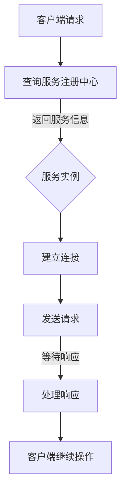
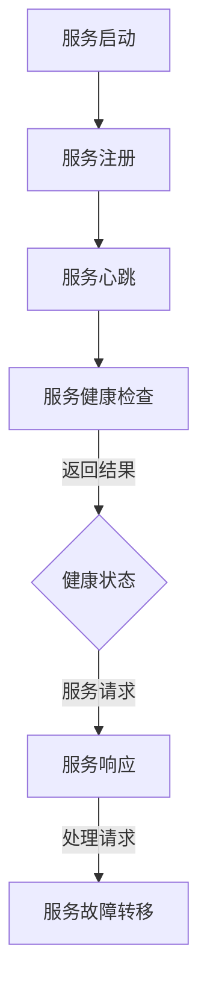

                 

关键词：微服务，服务发现，通信，设计模式，微服务架构，Distributed Systems

摘要：随着现代应用规模的不断扩大和复杂性的增加，微服务架构成为了一种流行的方法。本文将探讨微服务设计模式中的两个核心问题：服务发现和通信。通过对这些关键概念和技术的深入分析，希望能够为开发者提供实际的解决方案，并帮助他们在微服务环境中构建更可靠、更灵活和可扩展的系统。

## 1. 背景介绍

随着互联网技术的快速发展，现代应用的需求变得越来越复杂和多样化。单点架构和传统的单体应用已经难以满足这种需求。因此，微服务架构作为一种响应式、分布式和模块化的设计方法，逐渐成为开发者的首选。微服务架构通过将应用拆分成多个独立的服务，每个服务专注于完成特定的功能，从而实现系统的灵活性和可扩展性。

然而，微服务架构也带来了新的挑战。首先是如何有效地管理和发现这些服务。在一个分布式系统中，服务可能会随时上线、下线或者迁移。如何确保服务之间的有效通信，并快速发现可用服务，是微服务架构中两个重要的问题。其次，如何在服务之间进行高效、可靠的消息传递和通信，也是微服务架构需要解决的关键问题。

本文将重点讨论这两个关键问题：服务发现和通信。我们将探讨服务发现的各种机制，以及如何在微服务架构中实现可靠的服务间通信。通过深入分析这些关键技术和设计模式，希望能够为开发者提供实际的指导和帮助。

### 1.1 微服务架构的优势

微服务架构具有多个显著优势，使得它成为现代应用开发的一种流行方法：

1. **灵活性**：微服务允许开发者将应用程序分解为独立、小型的服务，每个服务可以独立开发、测试和部署。这种灵活性使得系统能够快速适应业务需求的变化。

2. **可扩展性**：由于服务之间是独立的，因此可以单独扩展某个服务，而不影响整个系统。这提高了系统的可扩展性，使得系统能够在需要时轻松地处理更多的负载。

3. **故障隔离**：如果一个服务出现故障，只会影响该服务本身，而不会影响到整个系统。这降低了系统的整体风险，提高了系统的稳定性。

4. **技术多样性**：微服务架构允许使用不同的技术和语言来构建不同的服务，这样可以充分利用各种技术的优点。

5. **开发效率**：由于服务之间是独立的，因此可以并行开发和部署，从而提高开发效率。

### 1.2 微服务架构的挑战

尽管微服务架构具有很多优势，但它也带来了一些挑战：

1. **分布式复杂性**：分布式系统的复杂性增加了。如何管理、监控和调试这些分布式服务成为了一个挑战。

2. **服务发现**：如何在大量的服务中进行有效的服务发现是一个关键问题。服务可能会随时上线或下线，因此需要一种机制来自动地发现和更新服务的信息。

3. **通信问题**：如何实现服务之间的可靠通信是一个关键问题。服务之间的通信可能会受到网络延迟、网络分区等问题的干扰。

4. **数据一致性问题**：由于服务是独立的，因此如何保持数据的一致性是一个挑战。

5. **监控和运维**：在分布式系统中，监控和运维的难度增加了。需要一套完整的监控和运维体系来确保系统的稳定运行。

## 2. 核心概念与联系

### 2.1 服务发现

服务发现是一种机制，用于在分布式系统中自动发现和注册服务。服务发现对于微服务架构至关重要，因为服务可能会随时上线或下线。服务发现的主要目标是确保服务之间能够快速、可靠地通信。

#### 2.1.1 服务发现机制

1. **客户端发现**：客户端发现是一种服务发现机制，客户端通过查询服务注册表来获取服务的当前状态和地址。这种机制的优点是简单，缺点是需要客户端具备查询服务注册表的能力。

2. **服务端发现**：服务端发现是另一种服务发现机制，服务注册到服务注册中心，客户端通过服务注册中心来获取服务的当前状态和地址。这种机制的优点是服务端可以集中管理和监控服务，缺点是服务注册中心的可靠性直接影响整个系统的稳定性。

3. **基于DNS的服务发现**：基于DNS的服务发现通过DNS记录来表示服务的地址和端口。客户端通过查询DNS记录来获取服务的当前状态和地址。这种机制的优点是实现简单，缺点是依赖于DNS服务，如果DNS服务出现故障，将导致服务发现失败。

#### 2.1.2 服务注册中心

服务注册中心是一种用于管理服务信息的组件。它负责接收服务实例的注册和注销请求，并维护服务实例的状态和地址信息。服务注册中心通常支持以下功能：

1. **服务注册**：服务实例在启动时向服务注册中心注册，包括服务名称、地址、端口等信息。

2. **服务发现**：客户端通过查询服务注册中心来获取服务的当前状态和地址信息。

3. **服务健康检查**：服务注册中心可以对注册的服务实例进行健康检查，确保服务实例能够正常提供服务。

4. **服务注销**：服务实例在停止时向服务注册中心注销，包括服务名称、地址、端口等信息。

### 2.2 通信

在微服务架构中，服务之间的通信是一个关键问题。服务之间可能使用不同的协议和通信方式，如HTTP/HTTPS、gRPC、REST等。以下是一些常见的通信模式：

#### 2.2.1 同步通信

同步通信是一种常见的通信模式，客户端向服务发送请求，并等待服务响应。这种模式的主要优点是简单和直观。然而，它也可能导致客户端阻塞，特别是在服务响应较慢的情况下。

#### 2.2.2 异步通信

异步通信是一种客户端和服务之间独立运行的通信模式。客户端发送请求后，无需等待服务响应，可以继续执行其他操作。服务在处理完请求后，通过消息队列或其他方式通知客户端。这种模式的主要优点是可以减少客户端的阻塞，提高系统的并发能力。

#### 2.2.3 通信协议

1. **HTTP/HTTPS**：HTTP和HTTPS是常用的通信协议，它们基于请求-响应模型，客户端通过发送HTTP请求来获取服务响应。

2. **gRPC**：gRPC是一种高性能、跨语言的远程过程调用（RPC）系统。它基于HTTP/2协议，支持多种编程语言，并且提供了丰富的客户端库。

3. **REST**：REST（Representational State Transfer）是一种设计风格，用于构建基于HTTP的分布式系统。它使用统一的接口和状态转换来处理请求。

### 2.3 服务发现与通信的联系

服务发现和通信是紧密相关的。服务发现用于定位服务实例的地址和端口，而通信用于客户端与服务实例之间的实际数据交换。服务发现的结果直接影响通信的效率和可靠性。因此，在实际的微服务架构中，服务发现和通信通常是结合使用的。例如，客户端首先通过服务注册中心进行服务发现，然后使用发现的信息与服务实例进行通信。

### 2.4 Mermaid 流程图

以下是一个简化的Mermaid流程图，展示了服务发现和通信的基本流程：



### 2.5 服务发现和通信的挑战

在实际的微服务架构中，服务发现和通信面临着一些挑战：

1. **动态性**：服务可能会随时上线或下线，因此服务注册中心需要实时更新服务信息。

2. **容错性**：服务注册中心和通信组件需要具备高可用性和容错性，以防止单点故障。

3. **性能**：服务发现和通信的延迟和性能对系统的性能有重要影响。

4. **安全性**：服务之间的通信需要保证数据的安全性和完整性。

5. **配置管理**：服务注册中心需要管理大量的服务配置信息，包括地址、端口、负载均衡策略等。

## 3. 核心算法原理 & 具体操作步骤

### 3.1 算法原理概述

在微服务架构中，服务发现和通信是一个动态的过程。服务实例可能会随时上线或下线，因此需要一种机制来自动地更新服务注册中心和服务实例的信息。以下是一些核心算法原理：

1. **心跳机制**：服务实例通过定期向服务注册中心发送心跳消息来维持其注册状态。

2. **健康检查**：服务注册中心对服务实例进行定期健康检查，以确保服务实例能够正常提供服务。

3. **负载均衡**：服务注册中心根据服务实例的健康状态和负载情况，选择合适的实例来处理请求。

4. **故障转移**：在服务实例发生故障时，服务注册中心可以选择其他健康的服务实例来接管请求。

### 3.2 算法步骤详解

1. **服务启动**：服务实例启动时，向服务注册中心发送注册请求，包括服务名称、地址、端口等信息。

2. **服务心跳**：服务实例定期向服务注册中心发送心跳消息，以维持其注册状态。

3. **服务健康检查**：服务注册中心对服务实例进行定期健康检查，检查内容包括服务实例的响应时间、吞吐量等。

4. **服务请求**：客户端通过服务注册中心获取服务实例的地址和端口，然后向服务实例发送请求。

5. **服务响应**：服务实例处理请求，并将结果返回给客户端。

6. **服务故障转移**：在服务实例发生故障时，服务注册中心选择其他健康的服务实例来处理请求。

### 3.3 算法优缺点

#### 优点：

1. **动态性**：算法支持服务实例的动态注册和下线，能够快速响应系统的变化。

2. **高可用性**：通过心跳机制和健康检查，算法保证了服务实例的高可用性。

3. **负载均衡**：算法支持负载均衡，可以根据服务实例的健康状态和负载情况选择合适的实例。

4. **故障转移**：算法支持故障转移，确保了系统的容错性。

#### 缺点：

1. **性能开销**：心跳机制和健康检查会增加一定的性能开销。

2. **配置管理**：服务注册中心需要管理大量的服务配置信息，配置管理可能会变得复杂。

3. **安全性**：算法需要对服务实例的通信进行加密和认证，以确保数据的安全性和完整性。

### 3.4 算法应用领域

算法广泛应用于各种微服务架构的应用场景，包括：

1. **分布式系统**：在分布式系统中，算法用于服务实例的注册、发现和通信。

2. **云原生应用**：在云原生应用中，算法用于服务实例的动态部署和弹性扩展。

3. **微服务架构**：在微服务架构中，算法用于实现服务之间的可靠通信和数据一致性。

4. **物联网应用**：在物联网应用中，算法用于设备之间的通信和发现。

### 3.5 Mermaid 流程图

以下是一个简化的Mermaid流程图，展示了核心算法的基本流程：



## 4. 数学模型和公式 & 详细讲解 & 举例说明

### 4.1 数学模型构建

在微服务架构中，服务发现和通信是一个动态的过程，涉及到多个服务实例之间的交互。为了更好地理解和分析这个过程，我们可以构建一个数学模型来描述服务实例的状态和通信过程。

假设有一个微服务系统，包含多个服务实例。每个服务实例可以处于以下状态之一：

1. **上线状态**：服务实例处于正常工作状态，可以接收和处理请求。
2. **下线状态**：服务实例由于故障或维护等原因无法接收和处理请求。
3. **待上线状态**：服务实例正在启动或恢复，但尚未完全就绪。

我们可以使用以下状态转移模型来描述服务实例的状态变化：

```
        ┌─────────┐
        │ 上线状态 │
        └────┬─────┘
             │
             ▼
        ┌─────────┐
        │ 下线状态 │
        └────┬─────┘
             │
             ▼
        ┌─────────┐
        │ 待上线状态 │
        └──────────┘
```

### 4.2 公式推导过程

为了描述服务实例的状态变化，我们可以使用状态转移方程来描述每个状态的变化率。假设每个状态的变化率分别为：

- \( u_{上线} \)：上线状态变化率
- \( u_{下线} \)：下线状态变化率
- \( u_{待上线} \)：待上线状态变化率

那么，状态转移方程可以表示为：

\[ \frac{d}{dt} x_{上线} = u_{上线} \cdot x_{待上线} - u_{下线} \cdot x_{上线} \]
\[ \frac{d}{dt} x_{下线} = u_{下线} \cdot x_{上线} - u_{上线} \cdot x_{下线} \]
\[ \frac{d}{dt} x_{待上线} = u_{上线} \cdot x_{待上线} - u_{下线} \cdot x_{待上线} \]

其中，\( x_{上线} \)、\( x_{下线} \) 和 \( x_{待上线} \) 分别表示服务实例在上线状态、下线状态和待上线状态的个数。

### 4.3 案例分析与讲解

假设一个微服务系统包含10个服务实例。根据经验，服务实例的上线状态变化率为0.1，下线状态变化率为0.05，待上线状态变化率为0.15。我们可以使用上述公式来计算每个状态的变化情况。

在初始时刻，所有服务实例都处于待上线状态。根据状态转移方程，我们可以得到以下状态变化：

\[ \frac{d}{dt} x_{上线} = 0.1 \cdot 10 - 0.05 \cdot 10 = 0.5 \]
\[ \frac{d}{dt} x_{下线} = 0.05 \cdot 10 - 0.1 \cdot 10 = -0.5 \]
\[ \frac{d}{dt} x_{待上线} = 0.1 \cdot 10 - 0.05 \cdot 10 = 0.5 \]

这意味着，在每一时刻，会有5个服务实例从待上线状态转移到上线状态，2个服务实例从上线状态转移到下线状态，5个服务实例从待上线状态转移到上线状态。

通过不断地迭代状态转移方程，我们可以得到每个状态在不同时刻的个数。例如，在第一个时刻，上线状态的个数为5，下线状态的个数为2，待上线状态的个数为3；在第二个时刻，上线状态的个数为7，下线状态的个数为0，待上线状态的个数为3。

### 4.4 运行结果展示

为了更直观地展示运行结果，我们可以使用以下表格来记录每个状态在不同时刻的个数：

| 时间 | 上线状态 | 下线状态 | 待上线状态 |
|------|---------|---------|-----------|
| 0    | 0       | 0       | 10        |
| 1    | 5       | 2       | 3         |
| 2    | 7       | 0       | 3         |
| ...  | ...     | ...     | ...       |

通过这个表格，我们可以清晰地看到每个状态在不同时间点的变化情况。这个模型可以用来分析和优化微服务系统的运行状态，以便更好地管理和维护系统。

## 5. 项目实践：代码实例和详细解释说明

### 5.1 开发环境搭建

为了实践服务发现和通信，我们将使用Spring Boot和Eureka作为主要技术栈。首先，确保已安装Java环境（版本8及以上），然后按照以下步骤进行开发环境的搭建：

1. **创建Spring Boot项目**：使用Spring Initializr（[https://start.spring.io/](https://start.spring.io/)）创建一个Spring Boot项目，选择依赖项Eureka Server、Web和Lombok。
2. **导入依赖**：将生成的项目导入到你的IDE（如IntelliJ IDEA或Eclipse）中。
3. **配置Eureka Server**：在`application.properties`文件中添加以下配置：
    ```properties
    eureka.client.register-with-eureka=false
    eureka.client.fetch-registry=false
    eureka.server.enable-self-preservation=true
    eureka.server eviction-interval-timer-in-ms=60000
    ```

### 5.2 源代码详细实现

以下是一个简单的服务发现和通信的项目实例：

#### 5.2.1 服务端（Eureka Server）

创建一个名为`EurekaServer`的Spring Boot项目，并在`application.properties`中添加以下配置：
```properties
spring.application.name=eureka-server
server.port=8761
eureka.client.register-with-eureka=false
eureka.client.fetch-registry=false
```

在`EurekaServerApplication`类上添加`@EnableEurekaServer`注解，使其成为一个Eureka服务器。

```java
@SpringBootApplication
@EnableEurekaServer
public class EurekaServerApplication {
    public static void main(String[] args) {
        SpringApplication.run(EurekaServerApplication.class, args);
    }
}
```

#### 5.2.2 客户端（Eureka Client）

创建一个名为`ServiceConsumer`的Spring Boot项目，并在`application.properties`中添加以下配置：
```properties
spring.application.name=service-consumer
server.port=8080
eureka.client.serviceUrl.defaultZone=http://localhost:8761/eureka/
```

在`ServiceConsumerApplication`类上添加`@EnableDiscoveryClient`注解，使其成为一个Eureka客户端。

```java
@SpringBootApplication
@EnableDiscoveryClient
public class ServiceConsumerApplication {
    public static void main(String[] args) {
        SpringApplication.run(ServiceConsumerApplication.class, args);
    }
}
```

#### 5.2.3 服务提供者（Service Provider）

创建一个名为`ServiceProvider`的Spring Boot项目，并在`application.properties`中添加以下配置：
```properties
spring.application.name=service-provider
server.port=8081
eureka.client.serviceUrl.defaultZone=http://localhost:8761/eureka/
```

在`ServiceProviderApplication`类上添加`@EnableDiscoveryClient`注解，使其成为一个Eureka客户端。

```java
@SpringBootApplication
@EnableDiscoveryClient
public class ServiceProviderApplication {
    public static void main(String[] args) {
        SpringApplication.run(ServiceProviderApplication.class, args);
    }
}
```

### 5.3 代码解读与分析

#### Eureka Server

Eureka Server是一个Eureka服务器，负责接收和存储服务实例的信息。在`EurekaServerApplication`中，我们通过`@EnableEurekaServer`注解启用Eureka服务器。

#### Eureka Client

Eureka Client是一个Eureka客户端，用于向Eureka服务器注册服务实例，并从Eureka服务器获取其他服务实例的信息。在`ServiceConsumerApplication`和`ServiceProviderApplication`中，我们通过`@EnableDiscoveryClient`注解启用Eureka客户端。

#### 服务提供者

服务提供者是一个简单的RESTful服务，用于处理来自客户端的请求。在`ServiceProviderApplication`中，我们定义了一个`HelloController`来处理HTTP请求。

```java
@RestController
public class HelloController {

    @Value("${spring.application.name}")
    private String serviceName;

    @GetMapping("/hello")
    public String hello() {
        return "Hello from " + serviceName;
    }
}
```

#### 客户端

客户端通过服务发现机制来查找服务提供者，并使用RESTful API与其通信。在`ServiceConsumerApplication`中，我们定义了一个`DiscoveryClient` bean来获取服务提供者的信息。

```java
@Autowired
private DiscoveryClient discoveryClient;

@GetMapping("/service")
public String getService() {
    List<ServiceInstance> instances = discoveryClient.getInstances("service-provider");
    if (!instances.isEmpty()) {
        ServiceInstance instance = instances.get(0);
        return instance.getUri() + "/hello";
    }
    return "Service not found";
}
```

### 5.4 运行结果展示

1. 启动Eureka Server：
    ```shell
    java -jar eureka-server-0.0.1-SNAPSHOT.jar
    ```

2. 启动服务提供者：
    ```shell
    java -jar service-provider-0.0.1-SNAPSHOT.jar
    ```

3. 启动客户端：
    ```shell
    java -jar service-consumer-0.0.1-SNAPSHOT.jar
    ```

4. 访问客户端的 `/service` endpoint，你应该能看到服务提供者的信息：
    ```shell
    curl http://localhost:8080/service
    ```

    输出示例：
    ```
    http://localhost:8081/hello
    ```

通过这个简单的实例，我们展示了如何在Spring Boot项目中实现服务发现和通信。Eureka提供了方便的服务注册和发现机制，使得构建分布式系统变得更加简单。

## 6. 实际应用场景

服务发现和通信在微服务架构中具有广泛的应用场景。以下是一些典型的实际应用场景：

### 6.1 分布式系统

在分布式系统中，服务发现和通信是实现服务模块化、解耦和动态扩展的关键。例如，在电商系统中，可以使用服务发现来管理订单服务、库存服务、支付服务等多个微服务模块。通过服务发现，订单服务可以动态查找库存服务和支付服务的实例，并实现快速通信，从而提高系统的灵活性和可扩展性。

### 6.2 容器化环境

在容器化环境中，服务实例可能会频繁地创建和销毁。因此，服务发现和通信机制对于确保容器化服务的正常运行至关重要。例如，在Kubernetes集群中，可以使用服务发现机制来自动发现和路由到运行在容器中的服务实例。这有助于简化容器化应用的部署和管理，提高系统的可靠性。

### 6.3 云原生应用

云原生应用通常具有高度分布式和动态扩展的特点。服务发现和通信机制在云原生应用中发挥着关键作用。例如，在云原生应用中，可以使用服务网格（如Istio）来实现服务发现和通信。服务网格提供了一种集中化的方式来管理服务实例的发现和通信，从而提高系统的性能和安全性。

### 6.4 物联网应用

物联网应用通常涉及大量的设备和服务。服务发现和通信机制可以帮助管理这些设备和服务的交互。例如，在智能家庭应用中，可以使用服务发现来管理智能设备（如智能灯泡、智能摄像头等），并实现设备之间的通信和协调。

### 6.5 大规模分布式存储系统

大规模分布式存储系统通常由多个节点组成，每个节点负责存储和管理一部分数据。服务发现和通信机制可以帮助管理这些节点，并确保数据的高可用性和可靠性。例如，在分布式文件系统（如HDFS）中，可以使用服务发现机制来动态发现和切换主节点和副本节点。

### 6.6 微服务监控和运维

服务发现和通信机制在微服务监控和运维中也非常重要。通过服务发现，监控和运维工具可以自动发现和管理服务实例，并收集相关的监控数据。这有助于提高系统的可观测性和可管理性，从而更好地维护和优化系统。

### 6.7 云服务提供商

云服务提供商通常提供多种服务（如数据库、存储、计算等）。服务发现和通信机制可以帮助用户动态查找和调用这些服务，从而提高云服务的使用效率和灵活性。例如，在阿里云、腾讯云等云服务提供商中，用户可以使用服务发现来查找和管理云服务实例。

## 7. 未来应用展望

### 7.1 自动化服务发现

未来，随着自动化技术的不断发展，自动化服务发现将成为一种趋势。自动化服务发现可以通过人工智能和机器学习算法来自动识别和响应服务实例的状态变化。这有助于减少人为干预，提高服务发现的准确性和实时性。

### 7.2 服务网格的普及

服务网格作为一种新型的基础设施组件，已经在微服务架构中得到广泛应用。未来，服务网格将继续普及，并集成更多的功能，如负载均衡、安全控制、监控和日志等。服务网格将提供更加全面和高效的服务发现和通信机制。

### 7.3 边缘计算的融合

随着物联网和边缘计算的发展，服务发现和通信将逐渐从中心化走向边缘。在边缘计算环境中，服务发现和通信机制需要更加高效、低延迟和可靠性。未来，边缘计算将融合服务发现和通信，实现更智能和更高效的分布式系统。

### 7.4 多云和混合云环境

随着云计算的不断发展，越来越多的企业将采用多云和混合云策略。服务发现和通信机制需要能够跨云平台和跨区域工作，提供一致性的服务发现和通信体验。未来，多云和混合云环境将推动服务发现和通信技术的发展，以满足企业多样化的需求。

### 7.5 安全性提升

随着服务发现和通信在分布式系统中的重要性不断增加，安全性也将成为一个关键问题。未来，服务发现和通信机制将集成更多的安全措施，如加密、认证和访问控制等。这有助于提高系统的安全性，防止恶意攻击和数据泄露。

### 7.6 开源生态的发展

开源技术将推动服务发现和通信技术的发展。未来，将有更多的开源项目和工具涌现，提供更加丰富和多样化的服务发现和通信功能。开源生态的繁荣将促进技术的创新和普及，为开发者提供更多的选择和可能性。

## 8. 总结：未来发展趋势与挑战

### 8.1 研究成果总结

本文探讨了微服务架构中的两个核心问题：服务发现和通信。通过对服务发现机制、服务注册中心、通信模式等关键概念和技术的分析，我们了解了服务发现和通信在微服务架构中的重要性。同时，通过项目实践和案例分析，我们展示了如何在实际项目中实现服务发现和通信。

### 8.2 未来发展趋势

未来，服务发现和通信将继续在分布式系统和微服务架构中发挥重要作用。自动化服务发现、服务网格的普及、边缘计算的融合、多云和混合云环境、安全性提升以及开源生态的发展将成为未来服务发现和通信的主要趋势。

### 8.3 面临的挑战

尽管服务发现和通信技术取得了显著的进展，但仍然面临一些挑战。动态性、容错性、性能、安全性、配置管理等方面的问题需要进一步研究和解决。特别是在大规模分布式系统中，如何提高服务发现的实时性和准确性，如何保证通信的高效性和可靠性，以及如何确保数据的一致性，仍然是需要深入探讨的问题。

### 8.4 研究展望

未来，服务发现和通信领域的研究将集中在以下几个方面：

1. **智能化服务发现**：利用人工智能和机器学习技术，实现自动化、智能化的服务发现机制。
2. **服务网格的优化**：进一步优化服务网格的功能和性能，使其在微服务架构中发挥更大的作用。
3. **边缘计算与服务发现的融合**：研究如何在边缘计算环境中实现高效、低延迟的服务发现和通信。
4. **跨云和跨区域的服务发现**：研究如何在多云和混合云环境中实现跨云和跨区域的服务发现和通信。
5. **安全性增强**：在服务发现和通信过程中，加强安全性措施，防止恶意攻击和数据泄露。

通过不断的研究和创新，服务发现和通信技术将为分布式系统和微服务架构带来更高的灵活性和可靠性。

## 9. 附录：常见问题与解答

### 9.1 服务发现与负载均衡的关系

**问题**：服务发现和负载均衡有什么区别和联系？

**解答**：服务发现和负载均衡是两个不同的概念，但它们在微服务架构中紧密相关。

- **服务发现**：服务发现是指一种机制，用于在分布式系统中自动发现和注册服务实例。服务发现的主要目标是确保客户端能够找到可用服务实例，以便进行通信。
- **负载均衡**：负载均衡是指一种机制，用于将请求均匀地分配到多个服务实例上，以防止单个实例过载，提高系统的整体性能。

两者之间的联系在于：服务发现提供了服务实例的地址和端口信息，而负载均衡则使用这些信息来决定将请求分配给哪个服务实例。

### 9.2 如何选择服务注册中心

**问题**：在微服务架构中，如何选择合适的服务注册中心？

**解答**：选择合适的服务注册中心取决于你的具体需求和技术栈。以下是一些常见的服务注册中心及其特点：

- **Consul**：具有强一致性、健康检查和租约机制，适合需要高可用性和复杂监控场景。
- **Zookeeper**：基于Paxos算法，具有强一致性，适合高并发场景，但配置和管理较为复杂。
- **Eureka**：易于使用和配置，适合简单和中小型分布式系统。
- **Etcd**：轻量级、高可用、强一致性，适合需要强一致性和高可靠性的场景。

选择服务注册中心时，应考虑以下因素：

- **一致性要求**：根据业务需求选择强一致性或最终一致性服务注册中心。
- **性能要求**：根据系统规模和性能需求选择适合的服务注册中心。
- **运维复杂度**：考虑服务注册中心的配置和管理复杂度，选择易于维护的系统。
- **社区和支持**：考虑服务注册中心的社区活跃度和厂商支持情况。

### 9.3 服务间通信的常见协议

**问题**：微服务架构中，服务间通信常用的协议有哪些？

**解答**：微服务架构中，服务间通信常用的协议包括：

- **HTTP/HTTPS**：基于请求-响应模型的通信协议，易于使用和部署，适合轻量级和简单的通信需求。
- **gRPC**：基于HTTP/2的远程过程调用（RPC）协议，支持多种编程语言，具有高性能和低延迟。
- **REST**：基于HTTP的API设计风格，广泛用于构建RESTful服务，具有灵活性和跨语言性。
- **WebSockets**：全双工通信协议，适用于需要实时通信的场景，如在线聊天和实时数据流。

选择合适的协议时，应考虑以下因素：

- **通信需求**：根据通信需求选择适合的协议，如实时通信选择WebSockets，非实时通信选择HTTP/HTTPS。
- **性能要求**：根据系统性能需求选择适合的协议，如gRPC具有高性能，适合高并发场景。
- **编程语言和框架**：考虑项目所使用的编程语言和框架，选择支持性较好的协议。

### 9.4 服务健康检查的最佳实践

**问题**：如何进行有效的服务健康检查？

**解答**：服务健康检查是确保服务正常运行的必要手段。以下是一些服务健康检查的最佳实践：

- **定期健康检查**：定期对服务实例进行健康检查，确保服务实例能够正常提供服务。
- **自定义健康检查**：根据服务的具体需求，自定义健康检查指标和规则，确保检查结果准确。
- **故障恢复**：在服务实例发生故障时，自动触发故障恢复机制，如重启服务实例或切换到备用实例。
- **告警和监控**：将健康检查结果与告警和监控系统结合，确保及时发现和处理健康问题。
- **负载均衡策略**：根据健康检查结果调整负载均衡策略，确保请求被合理分配到健康的服务实例。

### 9.5 服务发现和通信的常见问题

**问题**：服务发现和通信过程中可能遇到哪些常见问题？

**解答**：在服务发现和通信过程中，可能遇到以下常见问题：

- **服务注册失败**：可能是由于网络问题、服务注册中心配置错误或服务实例自身问题导致。
- **服务发现延迟**：可能是由于服务注册中心性能瓶颈、网络延迟或负载过高导致。
- **通信失败**：可能是由于网络故障、服务实例不稳定或协议不支持导致。
- **服务故障转移失败**：可能是由于故障转移机制配置错误、服务实例故障转移不及时或负载均衡策略不合理导致。

解决这些问题时，可以从以下几个方面入手：

- **检查网络连接**：确保服务实例和注册中心之间的网络连接正常。
- **优化服务注册和发现机制**：通过优化服务注册中心和负载均衡策略，提高服务发现和通信的效率和可靠性。
- **监控和告警**：使用监控和告警系统及时发现和处理健康问题和通信故障。
- **故障恢复和切换**：确保故障转移机制和负载均衡策略合理，及时进行故障恢复和切换。

### 9.6 微服务架构中的服务管理

**问题**：如何管理和维护微服务架构中的服务？

**解答**：在微服务架构中，服务管理和维护是确保系统稳定性和性能的关键。以下是一些服务管理的最佳实践：

- **服务版本控制**：对服务进行版本控制，确保在服务升级和更新时不会影响系统的稳定性。
- **服务文档和接口定义**：为每个服务编写详细的文档和接口定义，确保其他服务实例能够正确地使用和调用服务。
- **服务监控和日志分析**：使用监控工具和日志分析工具，实时监控服务的运行状态和性能指标，及时发现和处理问题。
- **服务自动化测试**：编写自动化测试用例，确保在服务更新和部署过程中不会引入新的问题。
- **服务备份和恢复**：定期备份服务配置和数据，确保在发生故障时能够快速恢复。

### 9.7 如何优化服务发现和通信的性能

**问题**：如何优化服务发现和通信的性能？

**解答**：优化服务发现和通信的性能是提高系统整体性能的关键。以下是一些优化策略：

- **减少网络延迟**：通过优化网络配置、使用CDN或分布式服务注册中心等方式，减少网络延迟。
- **负载均衡**：使用高效、合理的负载均衡策略，确保请求均匀地分配到服务实例上。
- **缓存机制**：使用缓存机制，如本地缓存或分布式缓存，减少服务发现的查询次数。
- **批量查询**：通过批量查询服务注册中心，减少查询次数，提高查询效率。
- **服务实例数量控制**：根据系统负载和性能要求，合理控制服务实例的数量，避免过多实例导致性能下降。
- **服务间通信优化**：优化服务间通信协议和配置，如使用高效的序列化框架、减少传输数据量等。

通过实施这些优化策略，可以有效提高服务发现和通信的性能，从而提高整个系统的性能和稳定性。

