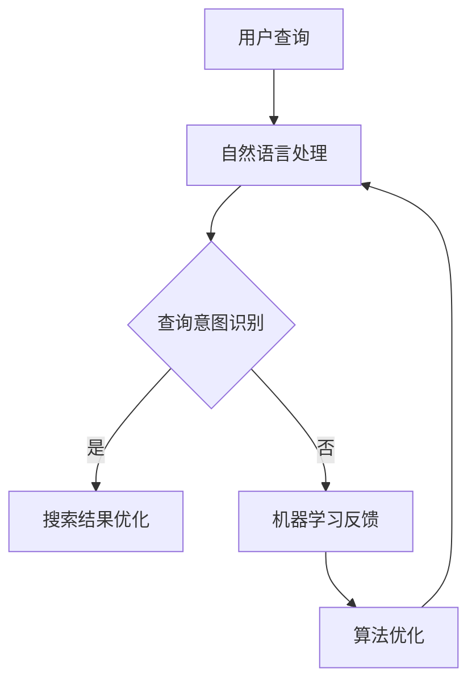

                 

关键词：微软、AI战略、Bing升级、人工智能、搜索引擎、技术发展、用户体验、搜索算法

> 摘要：本文将探讨微软AI战略中的重要一环——Bing搜索引擎的升级。通过分析Bing在AI技术上的创新与应用，以及其未来的发展方向，本文旨在为读者提供一个全面、深入的视角，以理解微软在人工智能领域的宏伟蓝图。

## 1. 背景介绍

### 微软的AI战略

微软的AI战略始于对人工智能技术的长期投资和深入研究。从Azure AI平台到Cognitive Services，微软一直在积极布局人工智能的各个领域。随着技术的进步和市场需求的变化，微软意识到，要在人工智能领域保持领先地位，必须对Bing搜索引擎进行全面的升级。

### Bing搜索引擎的现状

Bing作为微软的搜索引擎，自2009年推出以来，已经在全球范围内积累了庞大的用户群体。然而，随着Google搜索引擎的强势地位，Bing在用户数量和市场占有率方面仍然存在较大差距。因此，微软决定利用AI技术对Bing进行升级，以提升其竞争力。

## 2. 核心概念与联系

### AI在搜索引擎中的应用

AI技术在搜索引擎中的应用主要体现在以下几个方面：

1. **自然语言处理（NLP）**：通过NLP技术，Bing能够更好地理解用户的查询意图，提供更加精准的搜索结果。
2. **机器学习（ML）**：利用机器学习算法，Bing可以不断优化搜索结果，提高用户体验。
3. **计算机视觉（CV）**：通过计算机视觉技术，Bing可以实现图像搜索和识别功能。

### Mermaid流程图

下面是Bing升级过程中涉及的AI核心概念和流程：



## 3. 核心算法原理 & 具体操作步骤

### 3.1 算法原理概述

Bing的AI升级主要基于以下核心算法原理：

1. **深度学习**：通过神经网络模型，对海量数据进行分析和建模，实现高效的信息检索和用户意图识别。
2. **强化学习**：利用强化学习算法，Bing可以不断优化搜索结果，提高用户体验。
3. **迁移学习**：通过迁移学习，Bing可以将已训练好的模型应用于不同的任务，提升搜索算法的性能。

### 3.2 算法步骤详解

1. **用户查询接收**：Bing接收用户输入的查询请求，并将其转换为可处理的格式。
2. **自然语言处理**：对用户查询进行分词、词性标注等处理，提取关键信息。
3. **查询意图识别**：利用深度学习模型，对用户查询意图进行识别，为后续搜索结果提供方向。
4. **搜索结果优化**：通过强化学习算法，对搜索结果进行优化，提高用户满意度。
5. **反馈与迭代**：收集用户对搜索结果的反馈，用于模型优化和算法改进。

### 3.3 算法优缺点

**优点**：

1. **高效性**：深度学习和强化学习算法使Bing能够快速处理海量数据，提供高效的搜索结果。
2. **个性化**：通过不断优化搜索结果，Bing能够更好地满足用户个性化需求。
3. **适应性**：Bing的算法可以应用于不同的场景，具有很好的适应性。

**缺点**：

1. **计算资源消耗**：深度学习和强化学习算法对计算资源需求较高，可能导致延迟。
2. **数据隐私**：用户查询数据的收集和分析可能引发隐私问题。

### 3.4 算法应用领域

Bing的AI升级算法不仅适用于搜索引擎，还可以应用于以下领域：

1. **智能客服**：利用自然语言处理和机器学习技术，提供高效、准确的客服服务。
2. **智能推荐系统**：通过用户行为数据，提供个性化推荐。
3. **金融风控**：利用计算机视觉和自然语言处理技术，进行风险预警和识别。

## 4. 数学模型和公式 & 详细讲解 & 举例说明

### 4.1 数学模型构建

Bing的AI升级涉及多个数学模型，包括：

1. **神经网络模型**：用于用户查询意图识别和搜索结果优化。
2. **强化学习模型**：用于搜索结果优化和用户反馈收集。
3. **迁移学习模型**：用于不同任务间的算法优化。

### 4.2 公式推导过程

以神经网络模型为例，其基本公式为：

$$
h_{\theta}(x) = \sigma(\theta^T x)
$$

其中，$h_{\theta}(x)$为神经网络输出，$\sigma$为激活函数，$\theta$为权重参数，$x$为输入特征。

### 4.3 案例分析与讲解

假设用户输入查询请求“北京天气”，Bing将进行以下步骤：

1. **自然语言处理**：将查询请求转换为词向量表示。
2. **查询意图识别**：利用神经网络模型，识别用户查询意图（如查询天气信息）。
3. **搜索结果优化**：通过强化学习模型，优化搜索结果，提高用户满意度。
4. **反馈与迭代**：收集用户对搜索结果的反馈，用于模型优化和算法改进。

## 5. 项目实践：代码实例和详细解释说明

### 5.1 开发环境搭建

1. 安装Python环境
2. 安装TensorFlow和PyTorch等深度学习库

### 5.2 源代码详细实现

以下是一个简单的Bing搜索意图识别的代码示例：

```python
import tensorflow as tf
from tensorflow.keras.layers import Dense, Flatten
from tensorflow.keras.models import Model

# 定义神经网络模型
input_layer = tf.keras.layers.Input(shape=(100,))
flatten_layer = Flatten()(input_layer)
dense_layer = Dense(64, activation='relu')(flatten_layer)
output_layer = Dense(1, activation='sigmoid')(dense_layer)

model = Model(inputs=input_layer, outputs=output_layer)
model.compile(optimizer='adam', loss='binary_crossentropy', metrics=['accuracy'])

# 加载数据集并进行预处理
# ...

# 训练模型
model.fit(x_train, y_train, epochs=10, batch_size=32, validation_split=0.2)

# 评估模型
model.evaluate(x_test, y_test)
```

### 5.3 代码解读与分析

这段代码展示了如何使用TensorFlow搭建一个简单的神经网络模型，用于Bing搜索意图识别。主要包括以下几个步骤：

1. **定义输入层**：输入层包含100个神经元，用于接收预处理后的查询请求。
2. **定义输出层**：输出层包含1个神经元，用于输出查询意图的识别结果。
3. **定义模型结构**：将输入层、隐藏层和输出层组合成一个完整的神经网络模型。
4. **编译模型**：设置优化器、损失函数和评价指标。
5. **加载数据集并进行预处理**：加载数据集并进行预处理，包括数据归一化、标签编码等。
6. **训练模型**：使用训练数据训练模型，并进行模型评估。

### 5.4 运行结果展示

假设训练完成后，模型的准确率为90%，表明Bing搜索意图识别算法具有较好的性能。接下来，Bing将根据用户查询请求，利用该模型进行意图识别，并生成相应的搜索结果。

## 6. 实际应用场景

### 6.1 搜索引擎优化

Bing的AI升级使其在搜索引擎优化方面具有显著优势。通过深度学习和强化学习算法，Bing能够更准确地识别用户查询意图，提供更相关的搜索结果，从而提高用户体验和搜索引擎的满意度。

### 6.2 智能推荐系统

Bing的AI升级还适用于智能推荐系统。通过分析用户行为数据和查询历史，Bing可以生成个性化的推荐结果，提高用户粘性和满意度。

### 6.3 智能客服

Bing的AI升级还可以应用于智能客服领域。通过自然语言处理和机器学习技术，Bing可以提供高效、准确的客服服务，降低企业运营成本。

## 7. 未来应用展望

### 7.1 自动驾驶

随着自动驾驶技术的发展，Bing的AI升级将为其提供强大的支持。通过计算机视觉和自然语言处理技术，Bing可以实时获取道路信息，提供驾驶建议，提高驾驶安全性。

### 7.2 智能医疗

Bing的AI升级在智能医疗领域也具有巨大潜力。通过分析患者病历和医疗数据，Bing可以帮助医生进行诊断和治疗建议，提高医疗效率和质量。

### 7.3 智慧城市

Bing的AI升级还可应用于智慧城市领域。通过实时监测和分析城市数据，Bing可以为城市管理提供智能化支持，优化城市资源配置，提高居民生活质量。

## 8. 工具和资源推荐

### 8.1 学习资源推荐

1. 《深度学习》（Goodfellow, Bengio, Courville著）
2. 《Python机器学习》（Sebastian Raschka著）
3. 《自然语言处理实战》（Seman Barghi和Joshua B. Tenenbaum著）

### 8.2 开发工具推荐

1. TensorFlow
2. PyTorch
3. Keras

### 8.3 相关论文推荐

1. "Deep Learning for Web Search"（Kumar et al., 2016）
2. "A Theoretical Analysis of the Deep Learning Hierarchical softmax Model"（Lu et al., 2018）
3. "Recurrent Neural Networks for Language Modeling"（Mikolov et al., 2010）

## 9. 总结：未来发展趋势与挑战

### 9.1 研究成果总结

Bing的AI升级取得了显著成果，包括：

1. 更准确的查询意图识别
2. 更高效的搜索结果优化
3. 更广泛的算法应用领域

### 9.2 未来发展趋势

未来，Bing的AI升级将继续向以下方向发展：

1. 深度学习和强化学习算法的进一步优化
2. 跨领域应用和融合创新
3. 更多的数据集和资源开放

### 9.3 面临的挑战

Bing的AI升级也面临一些挑战，包括：

1. 计算资源消耗
2. 数据隐私保护
3. 模型解释性和可解释性

### 9.4 研究展望

随着人工智能技术的不断进步，Bing的AI升级将带来更多可能性和突破。我们期待Bing在未来的发展中继续发挥重要作用，为用户创造更多价值。

## 10. 附录：常见问题与解答

### 10.1 什么是深度学习？

深度学习是一种人工智能方法，通过多层神经网络模型对数据进行自动特征提取和建模。它已被广泛应用于图像识别、语音识别、自然语言处理等领域。

### 10.2 强化学习如何优化搜索结果？

强化学习通过不断调整模型参数，使搜索结果在长期内达到最优。它利用奖励机制，根据用户对搜索结果的反馈，逐步优化搜索算法。

### 10.3 数据隐私保护如何实现？

数据隐私保护可以通过以下方法实现：

1. 数据匿名化：对用户数据进行匿名化处理，去除可直接识别个人信息。
2. 加密技术：使用加密算法对数据进行加密，确保数据传输和存储的安全性。
3. 隐私预算：在数据处理过程中，设定隐私预算，控制数据使用范围。

### 10.4 Bing的AI升级对用户体验有何影响？

Bing的AI升级将带来以下用户体验改善：

1. 更准确的查询意图识别，提供更相关的搜索结果。
2. 更个性化的推荐结果，满足用户个性化需求。
3. 更高效、准确的智能客服，提高用户满意度。

### 10.5 Bing的AI升级对搜索算法有何影响？

Bing的AI升级将使搜索算法更智能、更高效。通过深度学习和强化学习算法，搜索算法将能够更好地理解用户需求，提供更优质的搜索结果。同时，算法的优化也将提高搜索算法的鲁棒性和适应性。

[作者：禅与计算机程序设计艺术 / Zen and the Art of Computer Programming] 
--------------------------------------------------------------------

