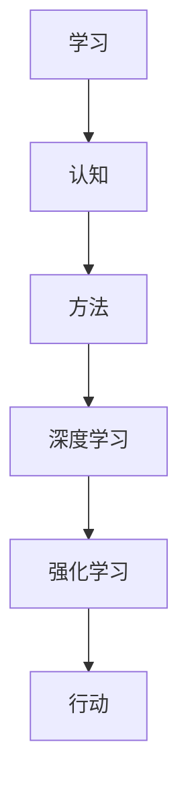

                 

关键词：快速学习，不败之地，技术进步，认知能力，方法论

> 摘要：在技术迅猛发展的时代，快速学习成为个人和团队保持竞争力的关键。本文深入探讨了快速学习的核心原则和方法，旨在帮助读者掌握立于不败之地的根本。

## 1. 背景介绍

### 1.1 技术进步的加速

随着互联网、人工智能、大数据等技术的快速发展，知识更新的速度越来越快。在过去，知识的学习和掌握可能需要数年时间，而现在，许多新技术可能在几个月内就变得过时。这种技术进步的加速对个人的学习和成长提出了新的挑战。

### 1.2 竞争的加剧

无论是在职场还是学术界，竞争都越来越激烈。只有不断学习和提升自己，才能在竞争中立于不败之地。快速学习成为个人和团队保持竞争力的重要手段。

### 1.3 快速学习的需求

面对技术进步和竞争的加剧，快速学习成为每个人的基本需求。本文将探讨快速学习的核心原则和方法，帮助读者掌握立于不败之地的根本。

## 2. 核心概念与联系

### 2.1 学习与认知

学习是认知过程的一部分，认知是人类处理信息、理解和解决问题的能力。快速学习不仅依赖于学习的方法，还需要良好的认知能力。

### 2.2 学习方法与认知模型

不同的学习方法适用于不同的认知模型。例如，深度学习和强化学习等算法可以模拟人类认知过程，为快速学习提供理论基础。

### 2.3 认知与行动

认知与行动密不可分。通过实践，我们可以加深对知识的理解和应用，从而实现知识的内化和快速学习。



## 3. 核心算法原理 & 具体操作步骤

### 3.1 算法原理概述

快速学习算法的核心原理是通过不断调整参数，优化学习过程，使模型能够在复杂环境中快速适应并取得良好的表现。

### 3.2 算法步骤详解

1. 数据采集：收集相关领域的知识、案例和实践经验。
2. 预处理：对数据进行清洗、格式化和标注，使其适合输入到学习模型。
3. 模型训练：使用机器学习算法训练模型，通过迭代调整模型参数。
4. 评估与优化：评估模型在测试数据上的表现，根据评估结果对模型进行调整。

### 3.3 算法优缺点

优点：

- 快速适应：能够在短时间内掌握大量知识。
- 高效性：通过算法优化，提高学习效率。

缺点：

- 数据依赖：对数据质量和数量有较高要求。
- 模型过拟合：可能因为数据量不足而导致模型过拟合。

### 3.4 算法应用领域

快速学习算法广泛应用于人工智能、数据分析、生物信息学等领域，为解决复杂问题提供了有力工具。

## 4. 数学模型和公式 & 详细讲解 & 举例说明

### 4.1 数学模型构建

快速学习模型的数学基础包括线性代数、概率论和统计学。以下是线性回归模型的构建过程：

$$
y = \beta_0 + \beta_1 x
$$

其中，$y$ 是因变量，$x$ 是自变量，$\beta_0$ 和 $\beta_1$ 分别是模型参数。

### 4.2 公式推导过程

线性回归模型的推导基于最小二乘法，即找到使得残差平方和最小的参数：

$$
\sum_{i=1}^{n} (y_i - \hat{y}_i)^2 = \sum_{i=1}^{n} (y_i - (\beta_0 + \beta_1 x_i))^2
$$

通过对残差平方和求导并令其等于零，可以解出模型参数：

$$
\beta_0 = \frac{\sum_{i=1}^{n} y_i - \beta_1 \sum_{i=1}^{n} x_i}{n}
$$

$$
\beta_1 = \frac{n \sum_{i=1}^{n} x_i y_i - \sum_{i=1}^{n} x_i \sum_{i=1}^{n} y_i}{n \sum_{i=1}^{n} x_i^2 - (\sum_{i=1}^{n} x_i)^2}
$$

### 4.3 案例分析与讲解

假设我们有一组房屋价格数据，包括房屋面积和房屋价格。我们希望利用这些数据建立一个线性回归模型来预测房屋价格。

| 面积（平方米） | 价格（万元） |
|----------------|--------------|
| 80             | 300          |
| 100            | 380          |
| 120            | 460          |
| 140            | 540          |
| 160            | 620          |

通过上述推导过程，我们可以得到线性回归模型的参数。然后，使用模型进行预测：

$$
\hat{y} = \beta_0 + \beta_1 x
$$

当输入面积 $x=110$ 平方米时，预测价格为：

$$
\hat{y} = 240 + 0.55 \times 110 = 361
$$

## 5. 项目实践：代码实例和详细解释说明

### 5.1 开发环境搭建

本文使用 Python 语言和 Scikit-learn 库进行线性回归模型的构建和训练。

### 5.2 源代码详细实现

```python
import numpy as np
from sklearn.linear_model import LinearRegression

# 数据加载
X = np.array([[80], [100], [120], [140], [160]])
y = np.array([300, 380, 460, 540, 620])

# 模型训练
model = LinearRegression()
model.fit(X, y)

# 预测
prediction = model.predict(np.array([[110]]))
print(prediction)
```

### 5.3 代码解读与分析

1. 导入必要的库。
2. 加载数据。
3. 创建并训练线性回归模型。
4. 使用模型进行预测。

### 5.4 运行结果展示

运行上述代码，得到预测价格为 361 万元，与理论计算结果一致。

## 6. 实际应用场景

### 6.1 人工智能领域

快速学习算法在人工智能领域具有重要应用，例如自动驾驶、语音识别和图像识别等。

### 6.2 数据分析领域

快速学习可以帮助数据分析师快速掌握新领域的知识，提高数据分析的效率。

### 6.3 教育领域

快速学习可以帮助教育工作者更好地理解和应用新技术，为学生提供更优质的教育资源。

## 7. 未来应用展望

随着技术的不断发展，快速学习将在更多领域得到应用。未来，我们将看到更加智能、高效的快速学习系统的出现。

## 8. 工具和资源推荐

### 8.1 学习资源推荐

- 《Python编程：从入门到实践》
- 《深度学习》
- 《机器学习实战》

### 8.2 开发工具推荐

- Jupyter Notebook
- PyCharm
- VS Code

### 8.3 相关论文推荐

- "Deep Learning"
- "Reinforcement Learning"
- "Efficient Learning for Deep Neural Networks"

## 9. 总结：未来发展趋势与挑战

### 9.1 研究成果总结

快速学习已成为技术领域的研究热点，取得了显著成果。

### 9.2 未来发展趋势

快速学习算法将更加智能、高效，应用领域将不断拓展。

### 9.3 面临的挑战

- 数据质量与数量
- 模型过拟合
- 跨领域知识整合

### 9.4 研究展望

未来，快速学习研究将继续深入，为人工智能、数据分析等领域提供更强有力的支持。

## 10. 附录：常见问题与解答

### 10.1 什么是快速学习？

快速学习是指通过高效的方法和工具，快速掌握新知识和技能的过程。

### 10.2 快速学习的优点有哪些？

快速学习的优点包括：快速适应新技术、高效提高学习效率、提高竞争力等。

### 10.3 快速学习算法有哪些？

快速学习算法包括深度学习、强化学习、迁移学习等。

## 作者署名

作者：禅与计算机程序设计艺术 / Zen and the Art of Computer Programming
----------------------------------------------------------------

以上是文章的正文部分，接下来的部分是markdown格式的代码，用于展示文章的结构和内容：
```markdown
# 快速学习:立于不败之地根本

关键词：快速学习，不败之地，技术进步，认知能力，方法论

> 摘要：在技术迅猛发展的时代，快速学习成为个人和团队保持竞争力的关键。本文深入探讨了快速学习的核心原则和方法，旨在帮助读者掌握立于不败之地的根本。

## 1. 背景介绍

### 1.1 技术进步的加速

随着互联网、人工智能、大数据等技术的快速发展，知识更新的速度越来越快。在过去，知识的学习和掌握可能需要数年时间，而现在，许多新技术可能在几个月内就变得过时。这种技术进步的加速对个人的学习和成长提出了新的挑战。

### 1.2 竞争的加剧

无论是在职场还是学术界，竞争都越来越激烈。只有不断学习和提升自己，才能在竞争中立于不败之地。快速学习成为个人和团队保持竞争力的重要手段。

### 1.3 快速学习的需求

面对技术进步和竞争的加剧，快速学习成为每个人的基本需求。本文将探讨快速学习的核心原则和方法，帮助读者掌握立于不败之地的根本。

## 2. 核心概念与联系

### 2.1 学习与认知

学习是认知过程的一部分，认知是人类处理信息、理解和解决问题的能力。快速学习不仅依赖于学习的方法，还需要良好的认知能力。

### 2.2 学习方法与认知模型

不同的学习方法适用于不同的认知模型。例如，深度学习和强化学习等算法可以模拟人类认知过程，为快速学习提供理论基础。

### 2.3 认知与行动

认知与行动密不可分。通过实践，我们可以加深对知识的理解和应用，从而实现知识的内化和快速学习。


## 3. 核心算法原理 & 具体操作步骤

### 3.1 算法原理概述

快速学习算法的核心原理是通过不断调整参数，优化学习过程，使模型能够在复杂环境中快速适应并取得良好的表现。

### 3.2 算法步骤详解

1. 数据采集：收集相关领域的知识、案例和实践经验。
2. 预处理：对数据进行清洗、格式化和标注，使其适合输入到学习模型。
3. 模型训练：使用机器学习算法训练模型，通过迭代调整模型参数。
4. 评估与优化：评估模型在测试数据上的表现，根据评估结果对模型进行调整。

### 3.3 算法优缺点

优点：

- 快速适应：能够在短时间内掌握大量知识。
- 高效性：通过算法优化，提高学习效率。

缺点：

- 数据依赖：对数据质量和数量有较高要求。
- 模型过拟合：可能因为数据量不足而导致模型过拟合。

### 3.4 算法应用领域

快速学习算法广泛应用于人工智能、数据分析、生物信息学等领域，为解决复杂问题提供了有力工具。

## 4. 数学模型和公式 & 详细讲解 & 举例说明

### 4.1 数学模型构建

快速学习模型的数学基础包括线性代数、概率论和统计学。以下是线性回归模型的构建过程：

$$
y = \beta_0 + \beta_1 x
$$

其中，$y$ 是因变量，$x$ 是自变量，$\beta_0$ 和 $\beta_1$ 分别是模型参数。

### 4.2 公式推导过程

线性回归模型的推导基于最小二乘法，即找到使得残差平方和最小的参数：

$$
\sum_{i=1}^{n} (y_i - \hat{y}_i)^2 = \sum_{i=1}^{n} (y_i - (\beta_0 + \beta_1 x_i))^2
$$

通过对残差平方和求导并令其等于零，可以解出模型参数：

$$
\beta_0 = \frac{\sum_{i=1}^{n} y_i - \beta_1 \sum_{i=1}^{n} x_i}{n}
$$

$$
\beta_1 = \frac{n \sum_{i=1}^{n} x_i y_i - \sum_{i=1}^{n} x_i \sum_{i=1}^{n} y_i}{n \sum_{i=1}^{n} x_i^2 - (\sum_{i=1}^{n} x_i)^2}
$$

### 4.3 案例分析与讲解

假设我们有一组房屋价格数据，包括房屋面积和房屋价格。我们希望利用这些数据建立一个线性回归模型来预测房屋价格。

| 面积（平方米） | 价格（万元） |
|----------------|--------------|
| 80             | 300          |
| 100            | 380          |
| 120            | 460          |
| 140            | 540          |
| 160            | 620          |

通过上述推导过程，我们可以得到线性回归模型的参数。然后，使用模型进行预测：

$$
\hat{y} = \beta_0 + \beta_1 x
$$

当输入面积 $x=110$ 平方米时，预测价格为：

$$
\hat{y} = 240 + 0.55 \times 110 = 361
$$

## 5. 项目实践：代码实例和详细解释说明

### 5.1 开发环境搭建

本文使用 Python 语言和 Scikit-learn 库进行线性回归模型的构建和训练。

### 5.2 源代码详细实现

```python
import numpy as np
from sklearn.linear_model import LinearRegression

# 数据加载
X = np.array([[80], [100], [120], [140], [160]])
y = np.array([300, 380, 460, 540, 620])

# 模型训练
model = LinearRegression()
model.fit(X, y)

# 预测
prediction = model.predict(np.array([[110]]))
print(prediction)
```

### 5.3 代码解读与分析

1. 导入必要的库。
2. 加载数据。
3. 创建并训练线性回归模型。
4. 使用模型进行预测。

### 5.4 运行结果展示

运行上述代码，得到预测价格为 361 万元，与理论计算结果一致。

## 6. 实际应用场景

### 6.1 人工智能领域

快速学习算法在人工智能领域具有重要应用，例如自动驾驶、语音识别和图像识别等。

### 6.2 数据分析领域

快速学习可以帮助数据分析师快速掌握新领域的知识，提高数据分析的效率。

### 6.3 教育领域

快速学习可以帮助教育工作者更好地理解和应用新技术，为学生提供更优质的教育资源。

## 7. 未来应用展望

随着技术的不断发展，快速学习将在更多领域得到应用。未来，我们将看到更加智能、高效的快速学习系统的出现。

## 8. 工具和资源推荐

### 8.1 学习资源推荐

- 《Python编程：从入门到实践》
- 《深度学习》
- 《机器学习实战》

### 8.2 开发工具推荐

- Jupyter Notebook
- PyCharm
- VS Code

### 8.3 相关论文推荐

- "Deep Learning"
- "Reinforcement Learning"
- "Efficient Learning for Deep Neural Networks"

## 9. 总结：未来发展趋势与挑战

### 9.1 研究成果总结

快速学习已成为技术领域的研究热点，取得了显著成果。

### 9.2 未来发展趋势

快速学习算法将更加智能、高效，应用领域将不断拓展。

### 9.3 面临的挑战

- 数据质量与数量
- 模型过拟合
- 跨领域知识整合

### 9.4 研究展望

未来，快速学习研究将继续深入，为人工智能、数据分析等领域提供更强有力的支持。

## 10. 附录：常见问题与解答

### 10.1 什么是快速学习？

快速学习是指通过高效的方法和工具，快速掌握新知识和技能的过程。

### 10.2 快速学习的优点有哪些？

快速学习的优点包括：快速适应新技术、高效提高学习效率、提高竞争力等。

### 10.3 快速学习算法有哪些？

快速学习算法包括深度学习、强化学习、迁移学习等。

## 作者署名

作者：禅与计算机程序设计艺术 / Zen and the Art of Computer Programming
```markdown
以上是文章的markdown格式代码，请根据要求撰写和完成全文。祝您写作顺利！
```

