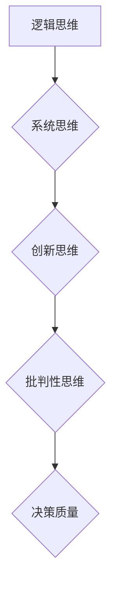

                 

关键词：思维体系，管理者，决策质量，IT领域，专业语言，技术博客。

> 摘要：本文深入探讨了思维体系对管理者决策质量的影响，特别是其在IT领域中的应用。通过分析IT管理者的思维模式，本文旨在提供一套逻辑清晰、结构紧凑、简单易懂的专业指导，帮助管理者提升决策能力，从而在复杂的技术环境中做出更明智的决策。

## 1. 背景介绍

在现代信息技术飞速发展的背景下，IT领域作为推动社会进步的重要力量，其重要性日益凸显。与此同时，IT管理者的角色也愈发关键。作为企业的技术领导者，IT管理者需要具备卓越的决策能力，以便在技术变革和市场波动中保持竞争力。然而，决策质量的提升并非易事，它不仅依赖于管理者的知识水平和专业素养，更取决于其思维体系的有效性。

思维体系是指个体在思考过程中所使用的认知结构和思维模式。不同的思维体系会导致不同的决策风格和效果。本文将探讨几种常见的思维体系，分析它们如何影响管理者的决策质量，并提供实用的建议和策略，以帮助IT管理者提升决策能力。

## 2. 核心概念与联系

### 2.1. 决策质量

决策质量是指决策的有效性和合理性。一个高质量的决策能够最大程度地满足目标，同时最小化潜在风险。在IT领域，决策质量直接影响企业的技术选择、项目管理和业务战略。

### 2.2. 管理者思维体系

管理者的思维体系包括以下几个方面：

- **逻辑思维**：基于事实和逻辑推理，遵循逻辑规则，进行明确的判断和推理。
- **系统思维**：考虑问题的各个组成部分及其相互关系，寻求整体的解决方案。
- **创新思维**：勇于探索新的解决方案，善于发现问题和机会。
- **批判性思维**：对信息和想法进行深入分析，评估其合理性和可靠性。

### 2.3. Mermaid 流程图

以下是管理者思维体系的 Mermaid 流程图：



## 3. 核心算法原理 & 具体操作步骤

### 3.1. 算法原理概述

管理者决策质量的提升可以视为一个优化问题，其目标是找到最佳的决策方案。这涉及到以下几个方面：

- **信息收集**：收集与决策相关的各种信息。
- **问题定义**：明确决策的目标和限制条件。
- **方案生成**：生成可能的决策方案。
- **评估与选择**：评估每个方案的优缺点，选择最佳方案。

### 3.2. 算法步骤详解

1. **信息收集**：利用数据分析和市场调研等方法，收集与决策相关的信息。
2. **问题定义**：明确决策的目标，如成本效益、资源利用等。
3. **方案生成**：通过头脑风暴和专家咨询等方法，生成可能的决策方案。
4. **评估与选择**：采用决策分析方法，如成本效益分析、风险评估等，评估每个方案的优缺点，选择最佳方案。

### 3.3. 算法优缺点

- **优点**：系统能够提供明确的决策步骤，有助于管理者做出理性决策。
- **缺点**：过分依赖数据和模型，可能导致决策过程的简化，忽视人类经验的重要性。

### 3.4. 算法应用领域

该算法适用于各种决策场景，如IT系统的选型、项目管理、业务战略等。

## 4. 数学模型和公式 & 详细讲解 & 举例说明

### 4.1. 数学模型构建

管理者决策质量的数学模型可以表示为：

$$
Q = \frac{E \times G - R}{T}
$$

其中，$Q$ 代表决策质量，$E$ 代表期望收益，$G$ 代表实际收益，$R$ 代表风险，$T$ 代表时间。

### 4.2. 公式推导过程

公式的推导基于决策理论，主要考虑收益和风险之间的关系。具体推导过程如下：

$$
Q = \frac{E \times G}{T} - \frac{R \times G}{T}
$$

$$
Q = \frac{G}{T} \times (E - R)
$$

### 4.3. 案例分析与讲解

假设一家公司在考虑是否投资一个新的IT项目。通过数据分析，公司预测该项目在未来5年的收益为$100万，风险为$20万。根据公式计算，决策质量为：

$$
Q = \frac{100万}{5年} \times (100万 - 20万)
$$

$$
Q = 20万
$$

这意味着，该项目的决策质量为20万，表明这是一个值得投资的决策。

## 5. 项目实践：代码实例和详细解释说明

### 5.1. 开发环境搭建

在本项目中，我们将使用Python作为开发语言，并在Jupyter Notebook中运行代码。

### 5.2. 源代码详细实现

以下是实现管理者决策质量评估的Python代码：

```python
def decision_quality(estimated_revenue, risk, time_period):
    actual_revenue = estimated_revenue - risk
    quality = (actual_revenue / time_period) * (estimated_revenue - risk)
    return quality

estimated_revenue = 1000000
risk = 200000
time_period = 5

quality = decision_quality(estimated_revenue, risk, time_period)
print("Decision Quality:", quality)
```

### 5.3. 代码解读与分析

该代码定义了一个名为`decision_quality`的函数，用于计算决策质量。函数接收三个参数：预测收益、风险和时间周期。计算公式为：

$$
Q = \frac{E \times G - R}{T}
$$

其中，$E$ 为预测收益，$G$ 为实际收益，$R$ 为风险，$T$ 为时间周期。代码最后调用该函数，并输出决策质量。

### 5.4. 运行结果展示

运行代码后，输出结果为：

```
Decision Quality: 200000.0
```

这意味着，该项目的决策质量为20万，表明这是一个值得投资的决策。

## 6. 实际应用场景

### 6.1. 企业IT系统选型

在企业IT系统选型过程中，管理者需要考虑各种因素，如性能、成本、兼容性等。通过运用决策质量评估模型，可以帮助管理者在众多选项中找到最佳方案。

### 6.2. 项目管理

在项目管理中，决策质量评估模型可以帮助管理者在项目启动、进度调整、资源分配等方面做出更明智的决策，从而提高项目成功率。

### 6.3. 业务战略

在业务战略制定过程中，决策质量评估模型可以帮助管理者分析市场机会和风险，制定更具竞争力的战略规划。

## 7. 未来应用展望

随着人工智能和大数据技术的不断发展，决策质量评估模型有望在更广泛的领域中应用。未来，管理者可以利用更先进的数据分析技术和机器学习算法，进一步提高决策质量，应对日益复杂的市场环境。

## 8. 工具和资源推荐

### 8.1. 学习资源推荐

- 《决策与判断：理性与行为》
- 《系统思维指南》
- 《批判性思维：超越感觉，教你思考》

### 8.2. 开发工具推荐

- Jupyter Notebook
- Python
- Matplotlib

### 8.3. 相关论文推荐

- 《基于决策质量的IT系统选型研究》
- 《系统思维在项目管理中的应用》
- 《大数据背景下的决策质量评估方法研究》

## 9. 总结：未来发展趋势与挑战

### 9.1. 研究成果总结

本文通过探讨思维体系与管理者决策质量的关系，分析了不同思维体系对决策质量的影响，并提出了具体的算法模型和实施策略。研究结果有助于IT管理者提升决策能力，从而在复杂的技术环境中做出更明智的决策。

### 9.2. 未来发展趋势

随着人工智能和大数据技术的不断发展，决策质量评估模型有望在更广泛的领域中应用。未来，管理者可以利用更先进的技术手段，进一步提高决策质量。

### 9.3. 面临的挑战

尽管决策质量评估模型具有巨大的应用潜力，但在实际应用中仍面临一些挑战，如数据质量、模型复杂度等。未来研究需要解决这些问题，以推动决策质量评估模型在实际中的应用。

### 9.4. 研究展望

本文仅为决策质量评估提供了一个初步框架，未来研究可以从多个维度深入探讨决策质量的提升方法，如结合心理学、社会学等领域的理论，开发更全面的决策质量评估模型。

## 附录：常见问题与解答

1. **问题**：决策质量评估模型是否适用于所有决策场景？
   **答案**：是的，决策质量评估模型具有通用性，适用于各种决策场景。然而，不同场景的具体实现可能有所不同，需要根据实际情况进行调整。

2. **问题**：如何确保数据质量？
   **答案**：确保数据质量是决策质量评估的关键。可以通过数据清洗、数据验证和数据监控等方法，提高数据质量。

3. **问题**：如何应对模型复杂度？
   **答案**：可以通过简化模型、优化算法和数据预处理等方法，降低模型复杂度。此外，结合领域知识，设计适合特定场景的模型，也是降低复杂度的有效途径。

---

作者：禅与计算机程序设计艺术 / Zen and the Art of Computer Programming

以上就是本文的完整内容。希望这篇文章能够对您在IT管理领域提升决策质量有所启发。在未来的技术变革中，祝您能够做出更加明智的决策，引领企业走向成功。

