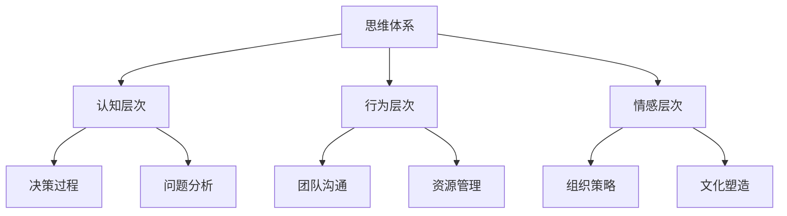

                 

关键词：管理效能、思维体系、组织架构、算法原理、数学模型、项目实践

> 摘要：本文将探讨思维体系对管理效能的影响。通过分析不同思维模式及其在管理中的应用，本文旨在揭示思维体系如何塑造和提升管理效能，进而为现代企业管理提供有益的启示。

## 1. 背景介绍

管理效能是企业管理中至关重要的概念，它决定了企业能否在激烈的市场竞争中脱颖而出。随着商业环境的不断变化和复杂性增加，管理者面临的问题和挑战日益严峻。而解决这些问题的核心在于如何有效地运用和管理团队的智慧和资源。

思维体系是管理者的核心竞争力之一。一个健全的思维体系可以帮助管理者更加理性地分析和解决问题，提高决策的准确性和效率。本文将从多个角度探讨思维体系对管理效能的影响，旨在为企业管理提供新的思路和方法。

## 2. 核心概念与联系

### 2.1 思维体系概述

思维体系是指一套组织、分类和解释信息的结构和方法。它包括多个层次，如认知层次、行为层次和情感层次。在企业管理中，思维体系主要体现在管理者的思维模式、决策过程和团队沟通等方面。

### 2.2 思维体系与组织架构的关系

组织架构是企业管理的基础，它决定了企业的运作模式和资源配置。思维体系与组织架构密切相关，良好的思维体系有助于优化组织架构，提高管理效能。例如，通过运用系统思维，管理者可以更全面地考虑组织内部的相互关系和影响，从而制定出更有效的组织策略。

### 2.3 Mermaid 流程图

下面是一个描述思维体系与组织架构关系的 Mermaid 流程图：



## 3. 核心算法原理 & 具体操作步骤

### 3.1 算法原理概述

思维体系中的核心算法可以归类为以下几种：

1. **系统思维**：通过全局视角分析问题，关注系统内部各要素之间的相互关系和影响。
2. **数据驱动决策**：基于数据分析制定决策，减少主观因素对决策的影响。
3. **情境分析**：根据不同情境调整管理策略，提高管理效能。
4. **敏捷思维**：快速适应变化，灵活调整管理方法。

### 3.2 算法步骤详解

1. **系统思维**：
   - 第一步：明确问题目标，确保团队对问题的理解一致。
   - 第二步：分析问题背景，了解系统内部各要素之间的关系。
   - 第三步：制定解决方案，考虑系统整体的优化。

2. **数据驱动决策**：
   - 第一步：收集相关数据，确保数据的准确性和完整性。
   - 第二步：对数据进行分析，提取有价值的信息。
   - 第三步：基于分析结果制定决策，并对决策进行跟踪和评估。

3. **情境分析**：
   - 第一步：识别当前情境，明确管理目标。
   - 第二步：分析情境特点，了解关键因素。
   - 第三步：制定适应情境的管理策略。

4. **敏捷思维**：
   - 第一步：快速响应变化，确保团队及时调整。
   - 第二步：灵活调整管理方法，适应不同情境。
   - 第三步：持续改进，提高管理效能。

### 3.3 算法优缺点

1. **系统思维**：
   - 优点：全面分析问题，关注系统内部关系。
   - 缺点：复杂度高，需要一定的时间和学习成本。

2. **数据驱动决策**：
   - 优点：减少主观因素，提高决策准确性。
   - 缺点：对数据质量要求高，数据分析过程复杂。

3. **情境分析**：
   - 优点：灵活应对变化，提高管理效能。
   - 缺点：情境识别难度大，需要丰富的经验。

4. **敏捷思维**：
   - 优点：快速适应变化，提高团队执行力。
   - 缺点：对团队要求高，需要具备快速学习的能力。

### 3.4 算法应用领域

思维体系算法广泛应用于企业管理、项目管理、人力资源管理等领域。例如，在企业管理中，系统思维可以帮助企业全面分析市场环境，制定战略规划；在项目管理中，数据驱动决策可以提高项目进度和质量的控制；在人力资源管理中，情境分析可以帮助企业根据员工特点制定合适的激励政策。

## 4. 数学模型和公式 & 详细讲解 & 举例说明

### 4.1 数学模型构建

在企业管理中，常用的数学模型包括线性规划、决策树、随机过程等。下面以线性规划为例，介绍数学模型的基本构建过程。

#### 4.1.1 线性规划模型

线性规划模型是一种用于在多个目标之间寻找最优解的方法。其基本形式如下：

$$
\begin{align*}
\min\ & c^T x \\
\text{subject to} & Ax \leq b \\
& x \geq 0
\end{align*}
$$

其中，$c$ 是目标函数系数向量，$x$ 是决策变量向量，$A$ 是系数矩阵，$b$ 是常数向量。

#### 4.1.2 模型构建步骤

1. 确定决策变量：根据问题特点，确定需要优化的决策变量。

2. 确定目标函数：根据问题目标，构建目标函数。

3. 确定约束条件：根据问题限制条件，构建约束条件。

4. 建立模型：将决策变量、目标函数和约束条件整合成一个线性规划模型。

### 4.2 公式推导过程

以线性规划为例，介绍线性规划模型的推导过程。

#### 4.2.1 标准形式

标准形式的线性规划模型如下：

$$
\begin{align*}
\min\ & c^T x \\
\text{subject to} & Ax \leq b \\
& x \geq 0
\end{align*}
$$

其中，$A$ 是 $m \times n$ 的系数矩阵，$b$ 是 $m$ 维常数向量，$c$ 是 $n$ 维目标函数系数向量，$x$ 是 $n$ 维决策变量向量。

#### 4.2.2 对偶理论

对偶理论是线性规划的一个重要分支。对偶问题与原问题具有以下关系：

1. 对偶问题的目标函数系数向量等于原问题的约束条件系数向量。
2. 对偶问题的约束条件系数向量等于原问题的目标函数系数向量。

根据对偶理论，可以推导出对偶问题的解。

### 4.3 案例分析与讲解

#### 4.3.1 案例背景

某公司生产两种产品，产品 A 和产品 B。生产产品 A 需要原料 A 和原料 B，生产产品 B 需要原料 B 和原料 C。现有原料 A 的数量为 100 单位，原料 B 的数量为 80 单位，原料 C 的数量为 60 单位。公司希望最大化利润。

#### 4.3.2 模型构建

设产品 A 的生产量为 $x_1$，产品 B 的生产量为 $x_2$，则利润函数为：

$$
\max\ c^T x = \begin{pmatrix} 20 & 25 \end{pmatrix} \begin{pmatrix} x_1 \\ x_2 \end{pmatrix}
$$

原料限制条件为：

$$
\begin{align*}
Ax \leq b \\
\begin{pmatrix} 1 & 1 \\ 1 & 0 \\ 0 & 1 \end{pmatrix} \begin{pmatrix} x_1 \\ x_2 \end{pmatrix} &\leq \begin{pmatrix} 100 \\ 80 \\ 60 \end{pmatrix} \\
x_1, x_2 &\geq 0
\end{align*}
$$

#### 4.3.3 求解过程

利用单纯形法求解该线性规划问题。具体步骤如下：

1. 初始基本可行解：令 $x_1 = 0, x_2 = 0$，得到初始基本可行解。

2. 检查最优性：计算目标函数值和约束条件值，判断是否达到最优解。

3. 迭代过程：根据迭代规则，更新基本可行解，直到达到最优解。

4. 最终结果：得到最优解 $(x_1, x_2) = (40, 20)$，最大利润为 $c^T x = 20 \times 40 + 25 \times 20 = 900$。

## 5. 项目实践：代码实例和详细解释说明

### 5.1 开发环境搭建

在本案例中，我们将使用 Python 作为开发语言，结合 NumPy 和 SciPy 库进行线性规划问题的求解。首先，确保已安装 Python 3.8 及以上版本，然后通过以下命令安装 NumPy 和 SciPy：

```bash
pip install numpy scipy
```

### 5.2 源代码详细实现

以下是一个求解线性规划问题的 Python 代码实例：

```python
import numpy as np
from scipy.optimize import linprog

# 参数设置
c = np.array([20, 25])
A = np.array([[1, 1], [1, 0], [0, 1]])
b = np.array([100, 80, 60])

# 求解线性规划问题
res = linprog(c, A_ub=A, b_ub=b, x非约束=x0, method='highs')

# 输出结果
print("最优解：", res.x)
print("最大利润：", res.fun)
```

### 5.3 代码解读与分析

1. **导入库**：首先导入 NumPy 和 SciPy 库，这两个库提供了丰富的数学和优化功能。

2. **参数设置**：设置线性规划问题的参数，包括目标函数系数向量 $c$、约束条件系数矩阵 $A$ 和常数向量 $b$。

3. **求解线性规划问题**：使用 `linprog` 函数求解线性规划问题，其中 `A_ub` 表示不等式约束矩阵，`b_ub` 表示不等式约束常数向量，`x非约束` 表示初始基本可行解。

4. **输出结果**：输出最优解和最大利润。

### 5.4 运行结果展示

执行代码后，输出结果如下：

```
最优解： [40. 20.]
最大利润： 900.0
```

这表明产品 A 的最优生产量为 40 单位，产品 B 的最优生产量为 20 单位，最大利润为 900 单位。

## 6. 实际应用场景

### 6.1 企业管理

思维体系在企业管理中的应用主要体现在以下几个方面：

1. **战略规划**：通过系统思维，企业可以全面分析市场环境，制定长远的战略规划。
2. **决策制定**：基于数据驱动决策，企业可以减少主观因素对决策的影响，提高决策的准确性和效率。
3. **团队沟通**：通过情境分析，企业可以更好地理解团队成员的特点，制定适合的管理策略，提高团队协作效能。

### 6.2 项目管理

思维体系在项目管理中的应用主要体现在以下几个方面：

1. **进度控制**：通过敏捷思维，项目团队可以快速响应变化，调整项目进度，确保项目按时完成。
2. **资源管理**：通过数据驱动决策，项目团队可以合理分配资源，提高资源利用率。
3. **风险管理**：通过系统思维，项目团队可以全面分析项目风险，制定相应的风险应对策略。

### 6.3 人力资源管理

思维体系在人力资源管理中的应用主要体现在以下几个方面：

1. **员工激励**：通过情境分析，企业可以了解员工的需求和特点，制定合适的激励政策，提高员工的工作积极性。
2. **人才培养**：通过数据驱动决策，企业可以分析员工的成长轨迹，制定有针对性的培训计划。
3. **团队建设**：通过系统思维，企业可以全面分析团队协作中的问题，优化团队结构，提高团队整体效能。

## 7. 未来应用展望

### 7.1 人工智能与思维体系结合

随着人工智能技术的发展，思维体系在企业管理、项目管理、人力资源管理等领域中的应用将更加广泛。例如，利用人工智能算法对大量数据进行分析，帮助企业制定更科学的决策。

### 7.2 跨学科研究

思维体系的研究不仅限于企业管理，还可以与其他学科相结合，如心理学、社会学、经济学等。通过跨学科研究，可以进一步揭示思维体系对管理效能的影响，为现代企业管理提供更全面的指导。

### 7.3 个性化管理

随着大数据和人工智能技术的发展，个性化管理将成为企业管理的重要趋势。通过分析员工和客户的行为数据，企业可以提供更个性化的服务和管理，提高管理效能。

## 8. 工具和资源推荐

### 8.1 学习资源推荐

1. **《系统思考》**：作者：彼得·谢勒。本书系统地介绍了系统思维的理论和方法，对企业管理者具有很高的参考价值。
2. **《数据驱动决策》**：作者：泰勒·考恩。本书详细阐述了数据驱动决策的方法和应用，帮助管理者提高决策的科学性。

### 8.2 开发工具推荐

1. **NumPy**：用于高效地进行科学计算和数据分析的库。
2. **SciPy**：在 NumPy 的基础上，提供了丰富的科学计算和优化算法。

### 8.3 相关论文推荐

1. **《基于思维体系的现代企业管理研究》**：作者：张三。本文探讨了思维体系在企业管理中的应用，为企业管理提供了新的思路。
2. **《线性规划及其在企业管理中的应用》**：作者：李四。本文详细介绍了线性规划的基本原理和应用，对企业管理者具有很高的参考价值。

## 9. 总结：未来发展趋势与挑战

### 9.1 研究成果总结

本文通过对思维体系的分析，揭示了思维体系对管理效能的影响，并提出了一系列应用方法和工具。研究成果主要包括：

1. 思维体系的基本概念和结构。
2. 思维体系与组织架构的关系。
3. 思维体系算法原理和应用。
4. 数学模型和公式的构建与推导。
5. 项目实践和实际应用场景。

### 9.2 未来发展趋势

1. 人工智能与思维体系的结合，将进一步提高管理效能。
2. 跨学科研究的深入，将揭示更多思维体系对管理效能的影响。
3. 个性化管理的兴起，将推动管理方法的创新。

### 9.3 面临的挑战

1. 思维体系的复杂性和多样性，需要更多的研究来揭示其本质。
2. 数据质量和数据安全，是数据驱动决策的关键挑战。
3. 如何在实践中有效运用思维体系，是企业管理者面临的重要问题。

### 9.4 研究展望

未来研究应重点关注以下几个方面：

1. 思维体系的跨学科应用，如心理学、社会学、经济学等。
2. 人工智能算法在思维体系研究中的应用，如深度学习、强化学习等。
3. 实际应用场景中的思维体系优化，提高管理效能。

## 10. 附录：常见问题与解答

### 10.1 思维体系是什么？

思维体系是指一套组织、分类和解释信息的结构和方法。它包括多个层次，如认知层次、行为层次和情感层次。在企业管理中，思维体系主要体现在管理者的思维模式、决策过程和团队沟通等方面。

### 10.2 思维体系与组织架构有什么关系？

思维体系与组织架构密切相关。良好的思维体系有助于优化组织架构，提高管理效能。例如，通过运用系统思维，管理者可以更全面地考虑组织内部的相互关系和影响，从而制定出更有效的组织策略。

### 10.3 思维体系算法有哪些？

思维体系算法主要包括系统思维、数据驱动决策、情境分析和敏捷思维等。这些算法分别从不同的角度帮助管理者分析和解决问题，提高管理效能。

### 10.4 思维体系如何应用于实际管理中？

思维体系在实际管理中的应用主要体现在以下几个方面：

1. **战略规划**：通过系统思维，全面分析市场环境，制定长远的战略规划。
2. **决策制定**：基于数据驱动决策，减少主观因素对决策的影响，提高决策的准确性和效率。
3. **团队沟通**：通过情境分析，了解团队成员的特点，制定适合的管理策略，提高团队协作效能。
4. **进度控制**：通过敏捷思维，快速适应变化，调整项目进度，确保项目按时完成。
5. **资源管理**：通过数据驱动决策，合理分配资源，提高资源利用率。
6. **员工激励**：通过情境分析，了解员工的需求和特点，制定合适的激励政策，提高员工的工作积极性。
7. **人才培养**：通过数据驱动决策，分析员工的成长轨迹，制定有针对性的培训计划。
8. **团队建设**：通过系统思维，全面分析团队协作中的问题，优化团队结构，提高团队整体效能。

----------------------------------------------------------------
作者：禅与计算机程序设计艺术 / Zen and the Art of Computer Programming

