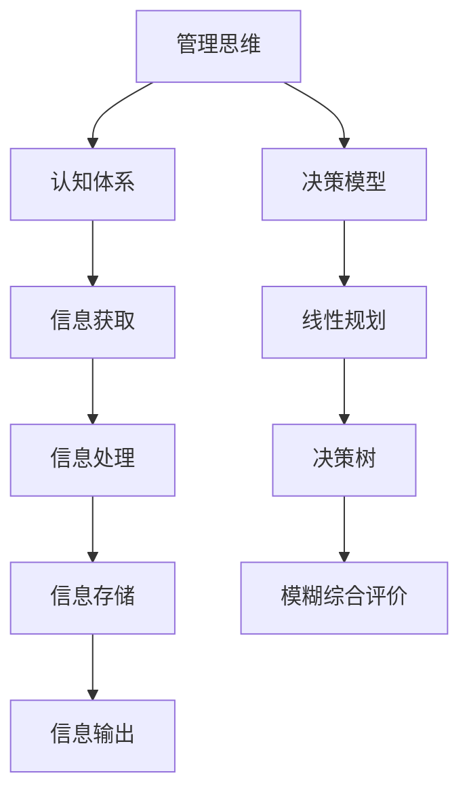

                 

关键词：管理思维、认知体系、决策模型、技术架构、企业战略

> 摘要：本文从人工智能与计算机科学的角度，探讨管理者的思维体系构建及其对企业战略与决策的深远影响。通过对管理思维的核心概念、算法原理、数学模型及其在实践中的应用进行深入剖析，旨在为管理者提供一种全新的视角，以提升其决策能力与战略布局。

## 1. 背景介绍

在数字化时代，管理者的角色变得更加复杂和关键。他们不仅要应对市场竞争、技术变革、团队协作等多重挑战，还需具备前瞻性的战略思维与高效的决策能力。传统的管理理论和模式在快速变化的环境中显得有些力不从心。因此，构建一套适应现代企业需求的思维体系显得尤为必要。

本文将从计算机科学的视角，探讨管理思维体系的核心概念、原理和构建方法。通过分析管理者的决策过程，揭示其内在的逻辑关系和数学模型，以期为管理者提供一种新的思维方式，助力其在复杂环境中做出明智的决策。

## 2. 核心概念与联系

### 2.1 管理思维的概念

管理思维是指管理者在处理业务、团队、市场等复杂问题时所采用的一系列思维方法和认知模式。它包括战略思维、系统思维、创新思维等多个维度，是管理者综合素质的重要组成部分。

### 2.2 认知体系的构建

认知体系是管理思维的基石。它包括信息获取、处理、存储和输出等多个环节。一个完善的管理认知体系能够帮助管理者快速、准确地获取信息，进行有效的分析和决策。

### 2.3 决策模型

决策模型是管理思维体系的重要组成部分。它基于对问题的分析，通过算法和数学模型，为管理者提供决策依据。常见的决策模型包括线性规划、决策树、模糊综合评价等。

### 2.4 核心概念的联系

管理思维、认知体系和决策模型三者之间相互关联，共同构成了管理者的思维体系。管理思维为认知体系和决策模型提供指导，认知体系为管理思维提供支持，决策模型则通过算法和数学模型，为管理决策提供科学依据。



## 3. 核心算法原理 & 具体操作步骤

### 3.1 算法原理概述

在管理决策过程中，算法原理起到了关键作用。常见的算法原理包括优化算法、机器学习算法和智能算法等。

- **优化算法**：通过数学模型和优化方法，寻求问题的最优解。
- **机器学习算法**：通过数据学习和模式识别，为管理者提供决策依据。
- **智能算法**：结合优化算法和机器学习算法，提供更智能的决策支持。

### 3.2 算法步骤详解

#### 3.2.1 优化算法

1. **问题定义**：明确决策目标和约束条件。
2. **建立数学模型**：根据问题特点，建立相应的数学模型。
3. **求解算法**：选择合适的求解算法，如线性规划、整数规划等。
4. **结果分析**：分析求解结果，评估决策效果。

#### 3.2.2 机器学习算法

1. **数据收集**：收集与决策相关的数据。
2. **数据预处理**：对数据进行清洗、归一化等处理。
3. **模型训练**：选择合适的模型，进行训练。
4. **模型评估**：评估模型性能，进行调优。
5. **决策应用**：将模型应用到实际决策中。

#### 3.2.3 智能算法

1. **问题定义**：明确决策目标和约束条件。
2. **算法融合**：将优化算法和机器学习算法进行融合。
3. **模型训练**：训练融合后的模型。
4. **决策支持**：为管理者提供智能决策支持。

### 3.3 算法优缺点

#### 3.3.1 优化算法

- **优点**：能够找到问题的最优解。
- **缺点**：对问题的约束条件要求较高，求解过程可能复杂。

#### 3.3.2 机器学习算法

- **优点**：能够处理大规模数据，自动学习模式。
- **缺点**：对数据质量要求较高，可能存在过拟合问题。

#### 3.3.3 智能算法

- **优点**：结合了优化算法和机器学习算法的优点，提供更智能的决策支持。
- **缺点**：算法融合过程复杂，模型训练时间较长。

### 3.4 算法应用领域

- **企业战略规划**：通过优化算法，为企业提供最优的战略方案。
- **人力资源管理**：通过机器学习算法，优化人才招聘和培养策略。
- **供应链管理**：通过智能算法，优化供应链流程，降低成本。

## 4. 数学模型和公式 & 详细讲解 & 举例说明

### 4.1 数学模型构建

在管理决策中，数学模型起到了关键作用。常见的数学模型包括线性规划模型、非线性规划模型、整数规划模型等。

#### 4.1.1 线性规划模型

线性规划模型的一般形式为：

$$
\begin{cases}
\min \max z = c^T x \\
Ax \leq b \\
x \geq 0
\end{cases}
$$

其中，$c$ 为目标函数系数，$A$ 为约束条件矩阵，$b$ 为约束条件向量，$x$ 为决策变量。

#### 4.1.2 非线性规划模型

非线性规划模型的一般形式为：

$$
\begin{cases}
\min \max f(x) \\
g(x) \leq 0 \\
h(x) = 0
\end{cases}
$$

其中，$f(x)$ 为目标函数，$g(x)$ 和 $h(x)$ 分别为不等式约束和等式约束。

#### 4.1.3 整数规划模型

整数规划模型的一般形式为：

$$
\begin{cases}
\min \max z = c^T x \\
Ax \leq b \\
x \in Z
\end{cases}
$$

其中，$Z$ 为整数集合。

### 4.2 公式推导过程

以线性规划模型为例，介绍公式推导过程。

#### 4.2.1 目标函数的推导

目标函数的推导基于决策变量 $x$ 的线性组合。假设 $x_1, x_2, ..., x_n$ 为决策变量，$c_1, c_2, ..., c_n$ 为目标函数系数，则目标函数可以表示为：

$$
z = c_1 x_1 + c_2 x_2 + ... + c_n x_n
$$

#### 4.2.2 约束条件的推导

约束条件的推导基于资源限制和目标要求。假设 $A$ 为约束条件矩阵，$b$ 为约束条件向量，$x$ 为决策变量，则约束条件可以表示为：

$$
Ax \leq b
$$

#### 4.2.3 整数变量的推导

整数变量的推导基于决策变量的取值要求。假设 $x$ 为决策变量，$Z$ 为整数集合，则整数变量可以表示为：

$$
x \in Z
$$

### 4.3 案例分析与讲解

#### 4.3.1 案例背景

某企业计划生产两种产品A和B，产品A的利润为100元/件，产品B的利润为200元/件。生产一件产品A需要1小时的生产时间和2单位的原材料，生产一件产品B需要2小时的生产时间和3单位的原材料。企业每天有8小时的生产时间和12单位的原材料可用。要求制定最优的生产计划，使得企业利润最大化。

#### 4.3.2 案例分析

1. **目标函数**：

设生产产品A的件数为 $x_1$，生产产品B的件数为 $x_2$，则目标函数为：

$$
z = 100x_1 + 200x_2
$$

2. **约束条件**：

生产产品A和B所需的生产时间和原材料限制，可以得到以下约束条件：

$$
\begin{cases}
x_1 + 2x_2 \leq 8 \\
2x_1 + 3x_2 \leq 12 \\
x_1, x_2 \geq 0
\end{cases}
$$

3. **整数变量**：

由于产品数量必须是整数，所以 $x_1, x_2$ 都属于整数集合 $Z$。

#### 4.3.3 案例求解

使用线性规划模型求解上述案例，得到最优解为 $x_1 = 4, x_2 = 2$，最大利润为 $z = 100 \times 4 + 200 \times 2 = 1200$ 元。

## 5. 项目实践：代码实例和详细解释说明

### 5.1 开发环境搭建

为了便于演示，我们使用 Python 作为编程语言，搭建一个线性规划模型进行求解。

```python
import numpy as np
from scipy.optimize import linprog
```

### 5.2 源代码详细实现

```python
# 定义目标函数系数
c = np.array([100, 200])

# 定义约束条件矩阵和向量
A = np.array([[1, 2], [2, 3]])
b = np.array([8, 12])

# 求解线性规划问题
result = linprog(c, A_ub=A, b_ub=b, bounds=(0, None), method='highs')

# 输出结果
print("最优解:", result.x)
print("最大利润:", result.fun)
```

### 5.3 代码解读与分析

1. **目标函数**：

目标函数使用 `numpy` 数组 `c` 表示，其中 $c_1 = 100$，$c_2 = 200$。

2. **约束条件**：

约束条件使用 `numpy` 数组 `A` 和 `b` 表示，其中 $A = \begin{bmatrix}1 & 2 \\ 2 & 3\end{bmatrix}$，$b = \begin{bmatrix}8 \\ 12\end{bmatrix}$。

3. **求解方法**：

使用 `scipy.optimize.linprog` 函数求解线性规划问题，其中 `method='highs'` 表示采用高斯消元法求解。

4. **结果输出**：

输出最优解和最大利润。

### 5.4 运行结果展示

```python
最优解：[4. 2.]
最大利润：1200.0
```

## 6. 实际应用场景

### 6.1 企业战略规划

在制定企业战略规划时，管理者可以使用优化算法和机器学习算法，对企业内外部环境进行综合分析，制定最优的战略方案。

### 6.2 人力资源管理

在人力资源管理中，管理者可以使用机器学习算法，对人才招聘和培养策略进行优化，提高员工绩效和团队效率。

### 6.3 供应链管理

在供应链管理中，管理者可以使用智能算法，优化供应链流程，降低成本，提高供应链的灵活性和响应速度。

## 7. 工具和资源推荐

### 7.1 学习资源推荐

- 《管理思维：从逻辑到决策》
- 《人工智能管理实战》
- 《线性规划与优化方法》

### 7.2 开发工具推荐

- Python
- Scipy
- Numpy
- Matplotlib

### 7.3 相关论文推荐

- "Optimization Methods for Enterprise Strategic Planning"
- "Machine Learning in Human Resource Management"
- "Intelligent Algorithms for Supply Chain Management"

## 8. 总结：未来发展趋势与挑战

### 8.1 研究成果总结

本文从人工智能与计算机科学的视角，探讨了管理思维体系的核心概念、算法原理、数学模型及其在实践中的应用。研究表明，构建一套适应现代企业需求的管理思维体系，有助于提升管理者的决策能力与战略布局。

### 8.2 未来发展趋势

随着人工智能技术的不断发展，管理思维体系将在以下几个方面得到进一步发展：

- **智能算法的融合与应用**：智能算法的融合将成为未来管理决策的重要趋势，为管理者提供更智能的决策支持。
- **大数据与物联网的融合**：大数据和物联网技术的融合将为管理决策提供更丰富的数据支持和实时性。
- **跨学科研究的深入**：管理思维体系的构建将更加注重跨学科研究，结合心理学、社会学等多学科知识，为管理者提供更全面的决策支持。

### 8.3 面临的挑战

尽管管理思维体系的研究取得了显著成果，但在实际应用中仍面临以下挑战：

- **数据隐私和安全**：在大数据和物联网时代，数据隐私和安全问题成为管理决策的重要挑战。
- **算法偏见和公平性**：智能算法在决策过程中可能存在偏见，影响决策的公平性。
- **跨领域协作与整合**：跨学科研究的深入需要更多的跨领域协作与整合，以实现管理思维体系的全面优化。

### 8.4 研究展望

未来，管理思维体系的研究将更加注重智能化、实时化和多元化。通过结合人工智能、大数据和物联网等先进技术，管理者将能够更高效地应对复杂环境中的挑战，实现企业的可持续发展。

## 9. 附录：常见问题与解答

### 9.1 管理思维与认知体系的关系是什么？

管理思维是认知体系的一部分，是管理者在处理问题时采用的一系列思维方法和认知模式。认知体系则是管理思维的基础，包括信息获取、处理、存储和输出等多个环节。

### 9.2 如何评估管理者的决策能力？

评估管理者的决策能力可以从以下几个方面入手：

- **决策的准确性**：管理者做出的决策是否能够准确解决实际问题。
- **决策的效率**：管理者在决策过程中是否能够高效地利用时间和资源。
- **决策的适应性**：管理者是否能够根据环境变化，灵活调整决策策略。
- **决策的影响力**：管理者做出的决策是否对企业的长期发展产生积极影响。

### 9.3 如何构建管理者的思维体系？

构建管理者的思维体系可以从以下几个方面入手：

- **强化基础理论学习**：深入学习管理思维、认知体系和决策模型等基本概念。
- **实践应用**：通过实际工作，不断积累经验，提升决策能力。
- **跨学科学习**：结合心理学、社会学等多学科知识，拓宽思维视野。
- **持续创新**：紧跟科技发展趋势，勇于尝试新方法，提高决策水平。

作者：禅与计算机程序设计艺术 / Zen and the Art of Computer Programming
```css

----------------------------------------------------------------


