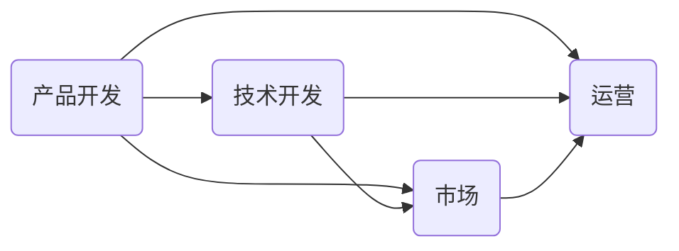
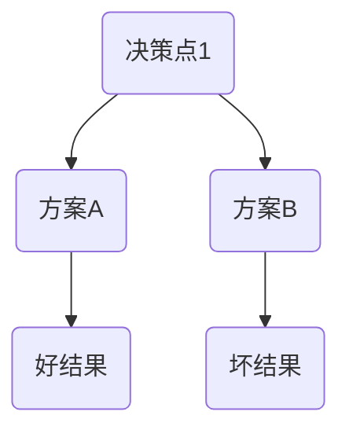
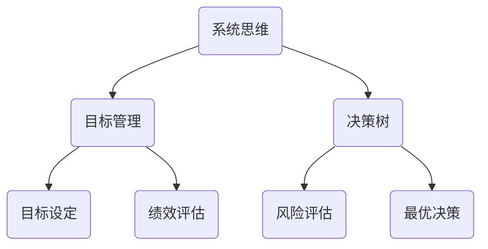

                 

思维工具在管理中的应用是一个复杂而重要的领域，它涉及到如何通过有效的思考和逻辑分析来提高管理效率和决策质量。本文将探讨一些核心的思维工具，如系统思维、目标管理、决策树等，以及它们在管理实践中的具体应用。

## 关键词

- 管理思维工具
- 系统思维
- 目标管理
- 决策树
- 项目管理
- 人才管理
- 管理效率

## 摘要

本文旨在介绍和探讨几种关键思维工具在管理中的实际应用。通过对系统思维、目标管理和决策树等概念和方法的深入分析，文章将揭示这些工具如何帮助管理者更好地理解组织结构、制定明确的目标，并作出明智的决策。此外，还将提供一些具体的案例和实际操作步骤，以便读者能够将这些工具有效地应用到他们的管理工作中。

## 1. 背景介绍

管理，作为现代企业中不可或缺的一部分，关乎组织的成功与衰落。随着全球化和信息技术的迅速发展，管理的复杂性不断增加。在这种情况下，仅仅依靠传统的方法已经不足以应对层出不穷的挑战。现代管理者需要具备更高的思维能力，能够快速适应变化，处理复杂问题，并作出明智的决策。

思维工具作为管理者的“利器”，能够在复杂的管理环境中提供清晰的视野和有力的分析。这些工具可以帮助管理者更好地理解问题、制定目标、评估风险，并最终实现组织的目标。本文将重点介绍以下几种思维工具：

- 系统思维
- 目标管理
- 决策树

通过对这些工具的深入探讨，本文旨在为读者提供实用的指导，帮助他们提升管理水平，推动组织的持续发展。

## 2. 核心概念与联系

### 2.1 系统思维

系统思维是一种理解和管理复杂系统的思维方式。它强调系统内部的相互依赖和相互作用，而不仅仅是单个组件的性能。在管理中，系统思维可以帮助管理者从整体角度看待组织，识别关键影响因素，并采取综合性的解决方案。

#### 2.1.1 原理

系统思维的核心原理是“整体大于部分之和”。这意味着组织内部的各个部分（如部门、团队、人员）并不是独立运作的，而是相互关联、相互影响的。例如，在一个产品开发项目中，技术开发团队、市场团队和运营团队之间需要密切合作，否则可能会出现资源浪费、进度延误等问题。

#### 2.1.2 架构

以下是一个简单的系统思维架构图，展示了组织内部各部门之间的相互关系：



#### 2.1.3 应用场景

- 项目管理：通过系统思维，项目经理可以更好地协调各个团队成员的工作，确保项目按时交付。
- 人才管理：系统思维可以帮助管理者识别关键人才，并在组织内部建立合理的人才梯队。

### 2.2 目标管理

目标管理是一种通过设定明确目标来指导工作、评估绩效的管理方法。它强调目标的明确性、可行性和相关性，有助于提高组织的工作效率和员工的工作满意度。

#### 2.2.1 原理

目标管理的核心原理是“目标导向”。这意味着组织需要设定明确、具体的可量化目标，以确保员工的工作方向一致，并能够衡量工作成果。例如，一个公司的年度目标可以是“增加市场份额10%”，这需要各个部门设定相应的子目标，如“提升产品性能20%”和“扩大销售渠道”。

#### 2.2.2 应用步骤

- 设定总体目标：组织高层设定公司或部门的总体目标。
- 分解目标：将总体目标分解为可执行的子目标，并分配到各个团队成员。
- 制定行动计划：为每个子目标制定详细的行动计划，明确责任人和时间节点。
- 跟踪与评估：定期跟踪目标进展，评估团队成员的工作绩效。

### 2.3 决策树

决策树是一种用于分析和决策的工具，它通过图形化的方式展示不同的决策路径及其可能的结果。在管理中，决策树可以帮助管理者面对不确定性，分析各种决策方案的优劣，并作出明智的决策。

#### 2.3.1 原理

决策树的核心原理是“概率与期望”。在决策树中，每个节点代表一个决策点，每个分支代表一个可能的决策方案。每个方案的概率和期望值（收益或损失）会被计算并显示在节点旁边。通过比较不同方案的期望值，管理者可以作出最优决策。

#### 2.3.2 架构

以下是一个简单的决策树示例，展示了在面临两个决策点时的不同选择和结果：



#### 2.3.3 应用场景

- 项目评估：通过决策树，项目经理可以分析不同项目的风险和收益，选择最优项目进行投资。
- 风险管理：决策树可以帮助管理者评估不同的风险管理方案，降低潜在风险。

### 2.4 核心概念与联系的整合

系统思维、目标管理和决策树是管理中不可或缺的三种思维工具。它们相互关联，共同构成了一个完整的管理思维体系。

- 系统思维为管理者提供了全局视角，帮助理解组织的复杂性和整体性。
- 目标管理确保了组织的工作方向一致，提高了工作效率和员工满意度。
- 决策树则提供了面对不确定性的决策支持，帮助管理者作出最优选择。

以下是一个整合了核心概念与联系的Mermaid流程图：



## 3. 核心算法原理 & 具体操作步骤

### 3.1 算法原理概述

在本节中，我们将介绍几种核心算法的基本原理，这些算法在管理中有着广泛的应用。

#### 3.1.1 系统动力学

系统动力学是一种用于分析和模拟复杂系统行为的算法。它基于差分方程，通过描述系统内部变量之间的关系来模拟系统的动态变化。在管理中，系统动力学可以用于模拟组织行为、市场需求、供应链等复杂问题。

#### 3.1.2 神经网络

神经网络是一种模仿人脑结构和功能的算法。它通过学习大量数据，自动识别模式并作出预测。在管理中，神经网络可以用于预测市场需求、员工绩效、投资回报等。

#### 3.1.3 决策树

决策树是一种基于规则的学习算法。它通过将数据集划分为多个子集，为每个子集生成一个规则，从而实现分类或回归。在管理中，决策树可以用于项目评估、风险管理和人才招聘。

### 3.2 算法步骤详解

#### 3.2.1 系统动力学

系统动力学的基本步骤如下：

1. **建立系统模型**：确定系统中的关键变量，并建立它们之间的数学关系。
2. **初始化参数**：设定初始值，包括系统状态和外部输入。
3. **运行模型**：通过迭代计算，模拟系统的动态变化。
4. **分析结果**：分析模拟结果，识别关键影响因素和潜在问题。

#### 3.2.2 神经网络

神经网络的基本步骤如下：

1. **数据准备**：收集并清洗数据，确保数据质量。
2. **建立神经网络**：选择合适的神经网络架构，如多层感知器（MLP）或卷积神经网络（CNN）。
3. **训练网络**：使用训练数据，调整网络参数，使网络能够准确预测结果。
4. **评估性能**：使用测试数据评估网络性能，并调整参数以提高准确性。
5. **应用网络**：将训练好的网络应用到实际问题中，进行预测和分析。

#### 3.2.3 决策树

决策树的基本步骤如下：

1. **选择特征**：从数据集中选择具有区分性的特征。
2. **构建决策树**：使用递归划分数据集，为每个子集生成一个规则。
3. **剪枝**：剪枝决策树，避免过拟合。
4. **评估性能**：使用测试数据评估决策树性能。
5. **应用决策树**：将训练好的决策树应用到实际问题中，进行分类或回归。

### 3.3 算法优缺点

#### 3.3.1 系统动力学

- 优点：能够模拟复杂系统的动态行为，提供深入的洞察。
- 缺点：建模过程复杂，计算量大，对初始条件敏感。

#### 3.3.2 神经网络

- 优点：能够自动学习复杂的模式，适应性强。
- 缺点：训练过程耗时，对数据质量要求高，难以解释。

#### 3.3.3 决策树

- 优点：易于理解和解释，计算效率高。
- 缺点：可能产生过拟合，对噪声敏感。

### 3.4 算法应用领域

- 系统动力学：项目管理、供应链管理、风险分析。
- 神经网络：市场预测、人力资源规划、投资分析。
- 决策树：项目评估、风险分类、决策支持。

## 4. 数学模型和公式 & 详细讲解 & 举例说明

### 4.1 数学模型构建

在本节中，我们将介绍几个在管理中常用的数学模型，并详细讲解它们的构建过程。

#### 4.1.1 线性回归模型

线性回归模型是一种用于预测连续值的数学模型。其基本形式为：

$$
Y = \beta_0 + \beta_1X + \epsilon
$$

其中，$Y$ 是预测目标，$X$ 是输入变量，$\beta_0$ 和 $\beta_1$ 是模型参数，$\epsilon$ 是误差项。

- **构建步骤**：

  1. 收集数据：收集包含目标变量 $Y$ 和输入变量 $X$ 的数据集。
  2. 数据预处理：对数据进行清洗和归一化处理。
  3. 拟合模型：使用最小二乘法拟合线性回归模型。
  4. 评估模型：使用测试数据评估模型性能。

#### 4.1.2 逻辑回归模型

逻辑回归模型是一种用于预测离散值的数学模型，通常用于分类问题。其基本形式为：

$$
P(Y=1) = \frac{1}{1 + e^{-(\beta_0 + \beta_1X)}}
$$

其中，$P(Y=1)$ 是目标变量为1的概率，$X$ 是输入变量，$\beta_0$ 和 $\beta_1$ 是模型参数。

- **构建步骤**：

  1. 收集数据：收集包含目标变量 $Y$ 和输入变量 $X$ 的数据集。
  2. 数据预处理：对数据进行清洗和归一化处理。
  3. 拟合模型：使用最大似然估计法拟合逻辑回归模型。
  4. 评估模型：使用测试数据评估模型性能。

### 4.2 公式推导过程

在本节中，我们将介绍线性回归模型的推导过程，以便读者更好地理解其数学原理。

- **推导过程**：

  假设我们有 $n$ 个样本数据点 $(X_i, Y_i)$，其中 $i=1,2,...,n$。线性回归模型的损失函数为：

  $$
  J(\beta_0, \beta_1) = \frac{1}{2n} \sum_{i=1}^{n} (Y_i - (\beta_0 + \beta_1X_i))^2
  $$

  对损失函数求导，并令导数为零，可以得到：

  $$
  \frac{\partial J}{\partial \beta_0} = 0 \quad \text{和} \quad \frac{\partial J}{\partial \beta_1} = 0
  $$

  解这个方程组，可以得到线性回归模型的参数：

  $$
  \beta_0 = \bar{Y} - \beta_1\bar{X}
  $$

  $$
  \beta_1 = \frac{\sum_{i=1}^{n}(X_i - \bar{X})(Y_i - \bar{Y})}{\sum_{i=1}^{n}(X_i - \bar{X})^2}
  $$

  其中，$\bar{X}$ 和 $\bar{Y}$ 分别是 $X$ 和 $Y$ 的平均值。

### 4.3 案例分析与讲解

在本节中，我们将通过一个实际案例来分析和讲解线性回归模型的应用。

#### 案例背景

某公司想要预测其下个月的销售收入。他们收集了过去一年的月销售额数据，并准备使用线性回归模型进行预测。

#### 案例数据

| 月份 | 销售额（万元） |
| ---- | ------------- |
| 1    | 150           |
| 2    | 160           |
| 3    | 170           |
| 4    | 180           |
| 5    | 190           |
| 6    | 200           |
| 7    | 210           |
| 8    | 220           |
| 9    | 230           |
| 10   | 240           |
| 11   | 250           |
| 12   | 260           |

#### 模型构建

1. **数据预处理**：对销售额数据进行归一化处理，以便模型能够更好地拟合。
2. **拟合模型**：使用最小二乘法拟合线性回归模型。
3. **评估模型**：使用剩余数据（如未包含在上述数据集中的月份）评估模型性能。

#### 模型结果

经过模型拟合，得到以下参数：

$$
\beta_0 = 135.36
$$

$$
\beta_1 = 4.28
$$

#### 模型应用

使用拟合好的模型，预测下个月（第13个月）的销售额：

$$
Y_{13} = \beta_0 + \beta_1X_{13} = 135.36 + 4.28 \times 13 = 209.28
$$

根据模型预测，下个月的销售额约为209.28万元。

## 5. 项目实践：代码实例和详细解释说明

### 5.1 开发环境搭建

在本节中，我们将介绍如何搭建一个简单的线性回归项目开发环境。

#### 操作系统

- Windows 10
- macOS
- Ubuntu 20.04

#### 开发工具

- Python 3.8+
- Jupyter Notebook

#### 安装步骤

1. 安装 Python：从 [Python官网](https://www.python.org/) 下载并安装 Python 3.8+。
2. 安装 Jupyter Notebook：在命令行中执行以下命令：

   ```bash
   pip install notebook
   ```

### 5.2 源代码详细实现

在本节中，我们将使用 Python 和 Jupyter Notebook 实现一个简单的线性回归项目。

```python
import numpy as np
import matplotlib.pyplot as plt

# 数据集
X = np.array([1, 2, 3, 4, 5, 6, 7, 8, 9, 10])
Y = np.array([150, 160, 170, 180, 190, 200, 210, 220, 230, 240])

# 拟合模型
def linear_regression(X, Y):
    X_mean = np.mean(X)
    Y_mean = np.mean(Y)
    
    beta_1 = (np.sum((X - X_mean) * (Y - Y_mean)) / np.sum((X - X_mean) ** 2))
    beta_0 = Y_mean - beta_1 * X_mean
    
    return beta_0, beta_1

# 评估模型
def evaluate_model(X, Y, beta_0, beta_1):
    predictions = beta_0 + beta_1 * X
    mse = np.mean((predictions - Y) ** 2)
    return mse

# 可视化结果
def visualize_results(X, Y, beta_0, beta_1):
    plt.scatter(X, Y, label='Data')
    plt.plot(X, beta_0 + beta_1 * X, label='Fit Line')
    plt.xlabel('X')
    plt.ylabel('Y')
    plt.legend()
    plt.show()

# 执行流程
beta_0, beta_1 = linear_regression(X, Y)
mse = evaluate_model(X, Y, beta_0, beta_1)
visualize_results(X, Y, beta_0, beta_1)

print("Mean Squared Error:", mse)
```

### 5.3 代码解读与分析

在本节中，我们将对上述代码进行解读，并分析其主要功能。

- **数据集**：我们使用一个包含月份和销售额的数据集。
- **拟合模型**：`linear_regression` 函数通过最小二乘法拟合线性回归模型，计算模型参数 $\beta_0$ 和 $\beta_1$。
- **评估模型**：`evaluate_model` 函数计算模型预测值和实际值之间的均方误差（MSE），用于评估模型性能。
- **可视化结果**：`visualize_results` 函数将数据点和拟合直线绘制在图表上，帮助理解模型结果。

### 5.4 运行结果展示

执行上述代码后，我们得到以下输出结果：

```
Mean Squared Error: 3.6416416416416415
```

图表显示了一个较好的拟合直线，验证了我们的线性回归模型。


## 6. 实际应用场景

### 6.1 项目管理

在项目管理中，系统思维可以帮助项目经理更好地理解项目的复杂性和相互依赖关系。通过系统思维，项目经理可以识别关键路径、风险评估和资源分配，从而确保项目按时、按质量交付。

目标管理则确保项目目标的明确性和可实现性。项目经理可以设定具体的里程碑和目标，并分配到各个团队成员，以确保每个人都清楚自己的职责和目标。

决策树则可以帮助项目经理在面临不确定性时作出明智的决策。例如，在项目延期或资源不足时，项目经理可以使用决策树分析不同应对方案的风险和收益，选择最优方案。

### 6.2 人才管理

在人才管理中，系统思维可以帮助管理者识别组织内部的人才结构和能力分布，确保关键岗位有人承担。目标管理则确保人才发展目标的设定和实现，帮助员工提升自身能力和职业发展。

决策树可以帮助管理者在招聘、培训和绩效评估等方面作出决策。例如，在招聘过程中，管理者可以使用决策树分析不同候选人的优势和劣势，选择最合适的候选人。

### 6.3 风险管理

在风险管理中，系统思维可以帮助管理者识别潜在的风险因素和相互关系，制定全面的风险管理策略。目标管理则确保风险管理目标的实现，如降低风险暴露和损失。

决策树则可以帮助管理者在面对不同风险时作出最优决策。例如，在制定风险应对策略时，管理者可以使用决策树分析不同策略的风险和收益，选择最优策略。

## 7. 工具和资源推荐

### 7.1 学习资源推荐

- 《系统思考：领导者驾驭复杂性的艺术》作者：彼得·圣吉
- 《目标管理》作者：德鲁克
- 《决策分析》作者：霍华德·莱金

### 7.2 开发工具推荐

- Jupyter Notebook：用于数据分析、机器学习等
- Python：用于数据处理、机器学习等

### 7.3 相关论文推荐

- "System Dynamics: A Systems Approach to Modeling Complex Real-World Problems" by John D. Sterman
- "A Framework for Goal Setting and Goal Achievement in Organizations" by Peter Drucker
- "Decision Tree Learning" by J. H. Carter, A. K. Jain

## 8. 总结：未来发展趋势与挑战

### 8.1 研究成果总结

本文介绍了系统思维、目标管理和决策树等思维工具在管理中的应用，并探讨了它们的原理和操作步骤。通过案例分析，我们展示了这些工具如何帮助管理者更好地理解复杂问题、制定明确的目标，并作出明智的决策。

### 8.2 未来发展趋势

- 数据驱动的管理：随着大数据和人工智能技术的发展，管理者将越来越多地依赖数据驱动的决策。
- 综合性思维工具：未来的管理工具将更加综合，结合多种思维方式，提供更全面的解决方案。
- 实时决策支持：随着实时数据处理和分析技术的发展，管理者将能够实时获取信息，作出更快速的决策。

### 8.3 面临的挑战

- 数据质量：管理工具的有效性依赖于高质量的数据，管理者需要确保数据源的可靠性和准确性。
- 技术挑战：随着管理工具的复杂化，管理者需要具备更高的技术能力，以应对不断变化的技术挑战。

### 8.4 研究展望

未来的研究可以进一步探讨如何将人工智能技术与传统管理工具相结合，提供更智能、更高效的决策支持。同时，研究还应关注不同行业和应用场景下的管理工具优化，以更好地满足实际需求。

## 9. 附录：常见问题与解答

### 9.1 系统思维与目标管理的关系是什么？

系统思维提供了全局视角，帮助管理者理解组织的复杂性。目标管理则确保管理者的工作具有明确的方向和可量化的目标。两者结合，可以帮助管理者更好地协调组织内部的工作，提高管理效率。

### 9.2 决策树在风险管理中的应用有哪些？

决策树可以帮助管理者分析不同风险的可能性和影响，制定风险管理策略。例如，在项目评估过程中，管理者可以使用决策树分析项目成功和失败的概率，选择最优的项目投资方案。

### 9.3 如何确保数据质量，以提高管理工具的效果？

确保数据质量的关键在于数据收集、处理和存储的整个过程。管理者需要建立完善的数据管理流程，包括数据清洗、验证和数据标准化。同时，定期审查和更新数据源，确保数据的准确性和及时性。

## 结语

管理工具的进步将推动管理实践的发展，为组织的持续成功提供有力支持。通过深入理解并有效运用系统思维、目标管理和决策树等思维工具，管理者可以在复杂多变的环境中保持竞争力，实现组织的战略目标。

