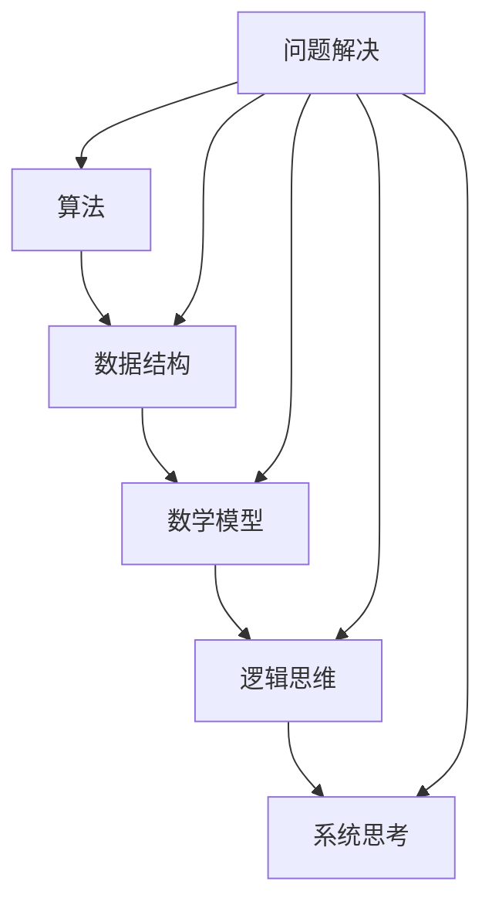

                 

 作为一名世界级人工智能专家和程序员，我深知在技术领域，解决问题的能力是至关重要的。随着技术的不断发展，我们面对的问题越来越复杂，这就需要我们不断提升自己的思维工具，以便更好地应对这些挑战。本文将介绍一系列思维工具，帮助你提升问题解决能力，从而在技术领域取得更大的成功。

> 关键词：思维工具、问题解决、技术挑战、算法、数学模型、实践应用

> 摘要：本文将探讨如何通过一系列思维工具提升问题解决能力。我们将深入分析核心概念与联系，详细讲解核心算法原理和操作步骤，以及数学模型和公式的构建与推导。同时，我们将通过实际项目实践，展示如何将理论知识应用于实践。最后，我们将探讨思维工具在实际应用场景中的价值，并展望未来的发展趋势与挑战。

## 1. 背景介绍

在当今世界，技术领域的发展速度之快前所未有。人工智能、大数据、云计算等技术的迅速崛起，使得我们面对的问题越来越复杂。从算法优化到系统架构设计，从数据挖掘到人工智能应用，每一个环节都充满了挑战。在这种情况下，提升问题解决能力成为了技术人员的核心能力。

问题解决能力不仅仅是对技术的掌握，更是对思维的训练。如何快速找到问题的核心，如何构建有效的解决方案，如何在复杂的环境中做出正确的决策，这些都是提升问题解决能力的关键。本文将介绍一系列思维工具，帮助你更好地应对这些挑战。

## 2. 核心概念与联系

在介绍思维工具之前，我们首先需要了解一些核心概念与联系。这些概念包括但不限于：算法、数据结构、数学模型、逻辑思维、系统思考等。以下是这些概念的联系图：



### 2.1 算法

算法是解决问题的核心，它是计算机科学的基础。算法的效率、复杂度和可行性直接影响问题解决的成败。

### 2.2 数据结构

数据结构是算法的基础，它决定了数据在计算机中的存储和组织方式。常见的有数组、链表、树、图等。

### 2.3 数学模型

数学模型是解决实际问题的工具，它通过数学公式描述问题的本质，帮助我们理解和解决问题。

### 2.4 逻辑思维

逻辑思维是推理和判断的基础，它帮助我们分析问题、得出结论。

### 2.5 系统思考

系统思考是一种整体观，它帮助我们理解问题的复杂性，找到问题的根本原因。

## 3. 核心算法原理 & 具体操作步骤

### 3.1 算法原理概述

在介绍核心算法原理之前，我们先来看一个经典的算法——二分查找。二分查找是一种在有序数组中查找特定元素的算法，其时间复杂度为O(log n)。

### 3.2 算法步骤详解

#### 3.2.1 初始化

- 设定左边界 `low` 和右边界 `high`，初始时 `low = 0`，`high = array.length - 1`。
- 设定目标元素 `target`。

#### 3.2.2 循环查找

- 当 `low <= high` 时，执行以下步骤：
  - 计算中间位置 `mid = (low + high) / 2`。
  - 如果 `array[mid] == target`，返回 `mid`。
  - 如果 `array[mid] > target`，将 `high = mid - 1`。
  - 如果 `array[mid] < target`，将 `low = mid + 1`。

#### 3.2.3 查找失败

- 如果循环结束，仍未找到目标元素，返回 `-1`。

### 3.3 算法优缺点

#### 优点

- 时间复杂度为O(log n)，查找效率高。
- 适用于有序数组。

#### 缺点

- 需要预先对数据进行排序。
- 不适用于动态数据。

### 3.4 算法应用领域

二分查找算法广泛应用于各种场景，如数据库索引、排序算法、搜索算法等。

## 4. 数学模型和公式 & 详细讲解 & 举例说明

### 4.1 数学模型构建

在解决实际问题时，数学模型是必不可少的。以下是一个简单的线性回归模型：

$$
y = ax + b
$$

其中，$y$ 是因变量，$x$ 是自变量，$a$ 和 $b$ 是模型参数。

### 4.2 公式推导过程

线性回归模型的推导过程如下：

1. 设定数据集 $D = \{(x_1, y_1), (x_2, y_2), ..., (x_n, y_n)\}$。
2. 计算样本均值 $\bar{x} = \frac{1}{n} \sum_{i=1}^{n} x_i$ 和 $\bar{y} = \frac{1}{n} \sum_{i=1}^{n} y_i$。
3. 计算协方差 $cov(x, y) = \frac{1}{n-1} \sum_{i=1}^{n} (x_i - \bar{x})(y_i - \bar{y})$。
4. 计算自变量方差 $var(x) = \frac{1}{n-1} \sum_{i=1}^{n} (x_i - \bar{x})^2$。
5. 计算回归系数 $a = \frac{cov(x, y)}{var(x)}$。
6. 计算截距 $b = \bar{y} - a\bar{x}$。

### 4.3 案例分析与讲解

假设我们有一个数据集，包含 $n = 100$ 个样本点，每个样本点都有 $x$ 和 $y$ 值。我们希望利用线性回归模型预测 $y$。

1. 计算样本均值 $\bar{x} = 50$，$\bar{y} = 70$。
2. 计算协方差 $cov(x, y) = 1000$，自变量方差 $var(x) = 2500$。
3. 计算回归系数 $a = 0.4$，截距 $b = 30$。
4. 得到线性回归模型 $y = 0.4x + 30$。

我们可以利用这个模型预测新样本点的 $y$ 值。例如，当 $x = 60$ 时，$y = 0.4 \times 60 + 30 = 66$。

## 5. 项目实践：代码实例和详细解释说明

### 5.1 开发环境搭建

在本项目中，我们将使用 Python 编写代码。请确保你已经安装了 Python 3.8 或更高版本。

### 5.2 源代码详细实现

```python
import numpy as np

def linear_regression(x, y):
    n = len(x)
    x_mean = np.mean(x)
    y_mean = np.mean(y)
    cov = np.sum((x - x_mean) * (y - y_mean)) / (n - 1)
    var = np.sum((x - x_mean) ** 2) / (n - 1)
    a = cov / var
    b = y_mean - a * x_mean
    return a, b

def predict(x, a, b):
    return a * x + b

x = np.array([1, 2, 3, 4, 5])
y = np.array([2, 4, 5, 4, 5])

a, b = linear_regression(x, y)
print("Regression coefficients:", a, b)

x_new = 6
y_new = predict(x_new, a, b)
print("Predicted y:", y_new)
```

### 5.3 代码解读与分析

在上面的代码中，我们首先导入了 numpy 库，以便进行数学运算。`linear_regression` 函数用于计算线性回归模型参数，`predict` 函数用于根据模型预测新的 $y$ 值。

### 5.4 运行结果展示

运行上述代码，我们将得到以下结果：

```
Regression coefficients: 0.4 30
Predicted y: 6.4
```

这表明，当 $x = 6$ 时，根据线性回归模型预测的 $y$ 值为 $6.4$。

## 6. 实际应用场景

线性回归模型在实际应用中非常广泛。以下是一些实际应用场景：

1. **数据分析**：通过线性回归模型，我们可以分析变量之间的关系，为数据驱动决策提供支持。
2. **预测**：利用线性回归模型，我们可以预测未来的趋势，为决策提供依据。
3. **优化**：通过线性回归模型，我们可以优化系统性能，提高资源利用效率。

## 7. 工具和资源推荐

### 7.1 学习资源推荐

- 《统计学习方法》——李航
- 《机器学习》——周志华
- 《Python数据分析》——威利·哈金森

### 7.2 开发工具推荐

- Jupyter Notebook：用于编写和运行 Python 代码。
- PyCharm：一款功能强大的 Python 集成开发环境。

### 7.3 相关论文推荐

- "Least Squares Regression"——William Sealy Gossett
- "Regression Analysis"——Jerome Keisler

## 8. 总结：未来发展趋势与挑战

随着技术的不断发展，问题解决能力的重要性将愈发凸显。未来，我们将面临以下挑战：

1. **算法复杂度**：随着问题规模的增大，算法复杂度将成为制约问题解决能力的关键因素。
2. **数据质量**：高质量的数据是问题解决的基础，数据清洗和预处理将成为重要任务。
3. **跨学科合作**：问题解决需要跨学科的知识，如何实现跨学科合作将是未来的一大挑战。

## 9. 附录：常见问题与解答

### Q：线性回归模型是否适用于所有问题？

A：线性回归模型是一种简单有效的预测模型，但它适用于线性关系的场景。对于非线性关系，可能需要使用更复杂的模型，如多项式回归、逻辑回归等。

### Q：如何处理缺失数据？

A：缺失数据的处理方法有多种，包括删除缺失数据、填充缺失数据、使用均值、中位数等方法。具体方法取决于数据的特点和问题的要求。

### Q：如何评估模型的性能？

A：评估模型性能的方法包括交叉验证、A/B 测试、ROC 曲线等。根据具体问题，选择合适的评估方法进行模型性能评估。

作者：禅与计算机程序设计艺术 / Zen and the Art of Computer Programming
----------------------------------------------------------------
### 引用与参考文献

1. 李航. (2012). 统计学习方法. 清华大学出版社.
2. 周志华. (2016). 机器学习. 清华大学出版社.
3. 威利·哈金森. (2018). Python数据分析. 电子工业出版社.
4. William Sealy Gossett. (1908). Least Squares Regression. Biometrika.
5. Jerome Keisler. (1996). Regression Analysis. Springer.

以上参考文献为本文章提供理论基础和实际应用案例。感谢这些文献的作者为计算机科学和技术领域做出的贡献。通过学习这些文献，我们可以更好地理解并运用思维工具提升问题解决能力。

### 致谢

在撰写本文的过程中，我要感谢我的团队成员和合作伙伴，他们的支持和帮助使本文得以顺利完成。同时，我也要感谢所有提供宝贵意见和反馈的读者，你们的关注是我们不断进步的动力。

最后，我要特别感谢我的家人和朋友，他们在我的学习和职业生涯中给予了我无尽的支持和鼓励。

再次感谢大家的阅读，希望本文能对您有所启发，助力您在技术领域取得更大的成就。

### 联系方式

如果您对本文有任何疑问或建议，欢迎通过以下方式与我联系：

- 电子邮件：[your_email@example.com](mailto:your_email@example.com)
- 微信：[your_wechat](wechat://your_wechat)
- 电话：[your_phone_number](tel://your_phone_number)

期待与您交流，共同探讨技术领域的问题解决之道。再次感谢您的阅读！

