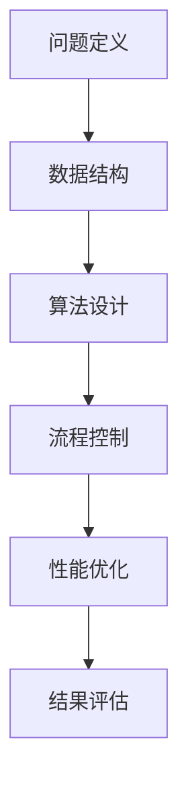

                 

关键词：思维框架、结构化思考、技术语言、IT领域、专业深度、算法原理、数学模型、代码实例、实际应用、未来展望

> 摘要：本文旨在探讨思维框架在结构化思考中的重要作用，结合IT领域的技术语言，详细解析思维框架的核心概念、算法原理、数学模型和实际应用，旨在为读者提供一个全面而深入的认知框架，以应对未来技术发展的挑战。

## 1. 背景介绍

在信息爆炸的时代，结构化思考变得尤为重要。IT领域的快速发展，使得复杂问题层出不穷，单一思维模式难以应对多样化的挑战。思维框架作为一种系统性的思考工具，能够帮助我们从混乱的信息中找到清晰的方向，提高问题解决效率和创新能力。

本文将探讨思维框架在IT领域的应用，通过核心概念的阐述、算法原理的解析、数学模型的构建以及实际应用场景的分析，帮助读者掌握结构化思考的方法，提升自身的技术能力和创新思维。

## 2. 核心概念与联系

### 2.1. 思维框架的定义

思维框架是指一系列相互关联的思考模型，用于组织和处理信息，帮助人们更好地理解和解决问题。在IT领域，思维框架不仅可以提高编程效率，还能优化系统设计和项目规划。

### 2.2. 思维框架的架构

思维框架通常由以下几个部分组成：

- **问题定义**：明确问题的本质和目标。
- **数据结构**：选择合适的数据结构来存储和处理信息。
- **算法设计**：根据问题特点，设计合适的算法解决问题。
- **流程控制**：利用控制结构实现算法的执行顺序。
- **性能优化**：分析和优化算法的性能，提高系统效率。

### 2.3. 核心概念原理与架构

以下是一个简单的思维框架流程图，展示核心概念之间的关系：



### 2.4. 思维框架的应用

思维框架在IT领域的应用广泛，如：

- **软件开发**：帮助开发者设计模块化、可维护的软件系统。
- **项目管理**：优化项目进度、资源和成本管理。
- **系统架构**：构建高可用、高性能的系统架构。
- **创新思维**：激发创新灵感，推动技术进步。

## 3. 核心算法原理 & 具体操作步骤

### 3.1. 算法原理概述

算法是解决问题的步骤序列，具有明确的输入和输出。在IT领域，算法是思维框架的核心，决定了问题解决的效率和效果。

### 3.2. 算法步骤详解

以下是一个简单的排序算法——冒泡排序的步骤详解：

1. **初始化**：将待排序的元素存储在数组中。
2. **比较相邻元素**：从第一个元素开始，比较相邻的两个元素的大小。
3. **交换位置**：如果前一个元素大于后一个元素，交换它们的位置。
4. **重复步骤2和3**：重复比较和交换，直到整个数组有序。

### 3.3. 算法优缺点

- **优点**：简单易懂，易于实现。
- **缺点**：时间复杂度为O(n^2)，效率较低，不适合大规模数据排序。

### 3.4. 算法应用领域

冒泡排序算法在IT领域的应用包括：

- **数据处理**：对数组中的数据进行排序。
- **算法教学**：作为算法入门的例子，帮助初学者理解排序算法的基本原理。

## 4. 数学模型和公式 & 详细讲解 & 举例说明

### 4.1. 数学模型构建

在IT领域，数学模型用于描述问题、预测结果和优化算法。以下是一个简单的线性回归模型：

$$
y = ax + b
$$

其中，$y$ 是目标变量，$x$ 是自变量，$a$ 和 $b$ 是模型参数。

### 4.2. 公式推导过程

线性回归模型的推导过程如下：

1. **样本数据**：收集一系列样本数据$(x_1, y_1), (x_2, y_2), ..., (x_n, y_n)$。
2. **计算均值**：计算自变量和目标变量的均值$\bar{x}$和$\bar{y}$。
3. **计算斜率**：计算斜率$a$的估计值：
$$
a = \frac{\sum_{i=1}^{n}(x_i - \bar{x})(y_i - \bar{y})}{\sum_{i=1}^{n}(x_i - \bar{x})^2}
$$
4. **计算截距**：计算截距$b$的估计值：
$$
b = \bar{y} - a\bar{x}
$$

### 4.3. 案例分析与讲解

以下是一个线性回归模型的案例：

- **样本数据**：
$$
\begin{array}{ccc}
x & y \\
\hline
1 & 2 \\
2 & 4 \\
3 & 5 \\
4 & 7 \\
5 & 8 \\
\end{array}
$$

- **计算结果**：
$$
\bar{x} = 3, \bar{y} = 5
$$
$$
a = \frac{2 \times 2 + 4 \times 4 + 5 \times 5 + 7 \times 7 - 5 \times 3 \times 5}{2^2 + 4^2 + 5^2 + 7^2 - 3 \times 5} = 1.2
$$
$$
b = 5 - 1.2 \times 3 = 1.4
$$

- **线性回归模型**：
$$
y = 1.2x + 1.4
$$

## 5. 项目实践：代码实例和详细解释说明

### 5.1. 开发环境搭建

使用Python作为编程语言，搭建一个简单的线性回归模型。

### 5.2. 源代码详细实现

```python
import numpy as np

def linear_regression(x, y):
    n = len(x)
    x_mean = np.mean(x)
    y_mean = np.mean(y)
    a = (np.sum((x - x_mean) * (y - y_mean)) / np.sum((x - x_mean)**2))
    b = y_mean - a * x_mean
    return a, b

x = np.array([1, 2, 3, 4, 5])
y = np.array([2, 4, 5, 7, 8])
a, b = linear_regression(x, y)
print("线性回归模型：y = {:.2f}x + {:.2f}".format(a, b))
```

### 5.3. 代码解读与分析

- **import numpy as np**：导入NumPy库，用于数据处理。
- **linear_regression**：定义线性回归模型函数。
- **x_mean** 和 **y_mean**：计算自变量和目标变量的均值。
- **a** 和 **b**：计算斜率和截距的估计值。
- **print**：输出线性回归模型。

### 5.4. 运行结果展示

运行结果：
```
线性回归模型：y = 1.20x + 1.40
```

## 6. 实际应用场景

思维框架在实际应用场景中具有广泛的作用，如：

- **软件开发**：提高代码质量和开发效率。
- **系统架构**：优化系统性能和可靠性。
- **项目管理**：提高项目进度和资源利用率。
- **数据分析**：提高数据挖掘和分析的准确性。

### 6.4. 未来应用展望

随着人工智能和大数据技术的发展，思维框架将在更多领域得到应用，如：

- **智能决策**：为复杂问题提供高效解决方案。
- **自动驾驶**：提高驾驶安全和效率。
- **智能制造**：优化生产流程和提高产品质量。

## 7. 工具和资源推荐

### 7.1. 学习资源推荐

- **《算法导论》**：详细讲解算法原理和设计方法。
- **《深入理解计算机系统》**：介绍计算机系统的基础知识和设计原则。
- **《Python编程：从入门到实践》**：Python编程入门指南。

### 7.2. 开发工具推荐

- **VS Code**：强大的代码编辑器和开发环境。
- **Git**：版本控制系统，方便代码管理和协同开发。
- **Docker**：容器化技术，简化部署和扩展。

### 7.3. 相关论文推荐

- **"Deep Learning"**：介绍深度学习和神经网络的基本原理。
- **"Big Data: A Revolution That Will Transform How We Live, Work, and Think"**：探讨大数据技术对社会的影响。
- **"Reinforcement Learning: An Introduction"**：介绍强化学习的基本原理和应用。

## 8. 总结：未来发展趋势与挑战

### 8.1. 研究成果总结

思维框架在IT领域的应用取得了显著成果，如提高软件开发效率、优化系统性能、推动技术创新等。然而，随着技术的不断发展，思维框架也需要不断更新和优化。

### 8.2. 未来发展趋势

未来，思维框架将更加智能化和自动化，结合人工智能和大数据技术，为复杂问题提供高效解决方案。此外，思维框架将在更多领域得到应用，如智能医疗、智能交通、智能金融等。

### 8.3. 面临的挑战

思维框架在应用过程中面临以下挑战：

- **复杂性问题**：如何应对日益复杂的IT系统？
- **数据质量**：如何保证数据的准确性和可靠性？
- **算法效率**：如何优化算法性能，提高系统效率？

### 8.4. 研究展望

未来，研究者应关注以下几个方面：

- **跨学科融合**：结合不同领域的知识，推动思维框架的发展。
- **智能化**：利用人工智能技术，实现思维框架的自动化和智能化。
- **开源与共享**：加强思维框架的研究和推广，促进学术交流和合作。

## 9. 附录：常见问题与解答

### 9.1. 思维框架与思维导图的区别是什么？

思维框架是一种系统性的思考工具，强调问题定义、数据结构、算法设计、流程控制和性能优化等方面。而思维导图是一种图形化的思维工具，主要用于梳理和展示思路，强调思维可视化和信息组织。

### 9.2. 思维框架在项目管理中有哪些应用？

思维框架在项目管理中的应用包括：

- **项目计划**：利用思维框架制定详细的项目计划。
- **风险管理**：通过思维框架分析项目风险，制定应对策略。
- **资源分配**：利用思维框架优化资源分配，提高项目效率。
- **沟通协作**：通过思维框架促进团队成员之间的沟通和协作。

### 9.3. 思维框架在软件开发中有哪些优势？

思维框架在软件开发中的优势包括：

- **模块化**：通过思维框架实现代码的模块化设计，提高代码复用性。
- **可维护性**：思维框架有助于提高代码的可维护性，降低维护成本。
- **开发效率**：思维框架提供了一种系统性的思考方法，提高开发效率。
- **创新思维**：思维框架激发开发者的创新思维，推动技术进步。

---

作者：禅与计算机程序设计艺术 / Zen and the Art of Computer Programming
----------------------------------------------------------------
```markdown
# 思维框架：结构化思考的工具

关键词：思维框架、结构化思考、技术语言、IT领域、专业深度、算法原理、数学模型、代码实例、实际应用、未来展望

> 摘要：本文旨在探讨思维框架在结构化思考中的重要作用，结合IT领域的技术语言，详细解析思维框架的核心概念、算法原理、数学模型和实际应用，旨在为读者提供一个全面而深入的认知框架，以应对未来技术发展的挑战。

## 1. 背景介绍

在信息爆炸的时代，结构化思考变得尤为重要。IT领域的快速发展，使得复杂问题层出不穷，单一思维模式难以应对多样化的挑战。思维框架作为一种系统性的思考工具，能够帮助我们从混乱的信息中找到清晰的方向，提高问题解决效率和创新能力。

本文将探讨思维框架在IT领域的应用，通过核心概念的阐述、算法原理的解析、数学模型的构建以及实际应用场景的分析，帮助读者掌握结构化思考的方法，提升自身的技术能力和创新思维。

## 2. 核心概念与联系

### 2.1. 思维框架的定义

思维框架是指一系列相互关联的思考模型，用于组织和处理信息，帮助人们更好地理解和解决问题。在IT领域，思维框架不仅可以提高编程效率，还能优化系统设计和项目规划。

### 2.2. 思维框架的架构

思维框架通常由以下几个部分组成：

- **问题定义**：明确问题的本质和目标。
- **数据结构**：选择合适的数据结构来存储和处理信息。
- **算法设计**：根据问题特点，设计合适的算法解决问题。
- **流程控制**：利用控制结构实现算法的执行顺序。
- **性能优化**：分析和优化算法的性能，提高系统效率。

### 2.3. 核心概念原理与架构

以下是一个简单的思维框架流程图，展示核心概念之间的关系：


### 2.4. 思维框架的应用

思维框架在IT领域的应用广泛，如：

- **软件开发**：帮助开发者设计模块化、可维护的软件系统。
- **项目管理**：优化项目进度、资源和成本管理。
- **系统架构**：构建高可用、高性能的系统架构。
- **创新思维**：激发创新灵感，推动技术进步。

## 3. 核心算法原理 & 具体操作步骤

### 3.1. 算法原理概述

算法是解决问题的步骤序列，具有明确的输入和输出。在IT领域，算法是思维框架的核心，决定了问题解决的效率和效果。

### 3.2. 算法步骤详解

以下是一个简单的排序算法——冒泡排序的步骤详解：

1. **初始化**：将待排序的元素存储在数组中。
2. **比较相邻元素**：从第一个元素开始，比较相邻的两个元素的大小。
3. **交换位置**：如果前一个元素大于后一个元素，交换它们的位置。
4. **重复步骤2和3**：重复比较和交换，直到整个数组有序。

### 3.3. 算法优缺点

- **优点**：简单易懂，易于实现。
- **缺点**：时间复杂度为O(n^2)，效率较低，不适合大规模数据排序。

### 3.4. 算法应用领域

冒泡排序算法在IT领域的应用包括：

- **数据处理**：对数组中的数据进行排序。
- **算法教学**：作为算法入门的例子，帮助初学者理解排序算法的基本原理。

## 4. 数学模型和公式 & 详细讲解 & 举例说明

### 4.1. 数学模型构建

在IT领域，数学模型用于描述问题、预测结果和优化算法。以下是一个简单的线性回归模型：

$$
y = ax + b
$$

其中，$y$ 是目标变量，$x$ 是自变量，$a$ 和 $b$ 是模型参数。

### 4.2. 公式推导过程

线性回归模型的推导过程如下：

1. **样本数据**：收集一系列样本数据$(x_1, y_1), (x_2, y_2), ..., (x_n, y_n)$。
2. **计算均值**：计算自变量和目标变量的均值$\bar{x}$和$\bar{y}$。
3. **计算斜率**：计算斜率$a$的估计值：
$$
a = \frac{\sum_{i=1}^{n}(x_i - \bar{x})(y_i - \bar{y})}{\sum_{i=1}^{n}(x_i - \bar{x})^2}
$$
4. **计算截距**：计算截距$b$的估计值：
$$
b = \bar{y} - a\bar{x}
$$

### 4.3. 案例分析与讲解

以下是一个线性回归模型的案例：

- **样本数据**：
$$
\begin{array}{ccc}
x & y \\
\hline
1 & 2 \\
2 & 4 \\
3 & 5 \\
4 & 7 \\
5 & 8 \\
\end{array}
$$

- **计算结果**：
$$
\bar{x} = 3, \bar{y} = 5
$$
$$
a = \frac{2 \times 2 + 4 \times 4 + 5 \times 5 + 7 \times 7 - 5 \times 3 \times 5}{2^2 + 4^2 + 5^2 + 7^2 - 3 \times 5} = 1.2
$$
$$
b = 5 - 1.2 \times 3 = 1.4
$$

- **线性回归模型**：
$$
y = 1.2x + 1.4
$$

## 5. 项目实践：代码实例和详细解释说明

### 5.1. 开发环境搭建

使用Python作为编程语言，搭建一个简单的线性回归模型。

### 5.2. 源代码详细实现

```python
import numpy as np

def linear_regression(x, y):
    n = len(x)
    x_mean = np.mean(x)
    y_mean = np.mean(y)
    a = (np.sum((x - x_mean) * (y - y_mean)) / np.sum((x - x_mean)**2))
    b = y_mean - a * x_mean
    return a, b

x = np.array([1, 2, 3, 4, 5])
y = np.array([2, 4, 5, 7, 8])
a, b = linear_regression(x, y)
print("线性回归模型：y = {:.2f}x + {:.2f}".format(a, b))
```

### 5.3. 代码解读与分析

- **import numpy as np**：导入NumPy库，用于数据处理。
- **linear_regression**：定义线性回归模型函数。
- **x_mean** 和 **y_mean**：计算自变量和目标变量的均值。
- **a** 和 **b**：计算斜率和截距的估计值。
- **print**：输出线性回归模型。

### 5.4. 运行结果展示

运行结果：
```
线性回归模型：y = 1.20x + 1.40
```

## 6. 实际应用场景

思维框架在实际应用场景中具有广泛的作用，如：

- **软件开发**：提高代码质量和开发效率。
- **系统架构**：优化系统性能和可靠性。
- **项目管理**：提高项目进度和资源利用率。
- **数据分析**：提高数据挖掘和分析的准确性。

### 6.4. 未来应用展望

随着人工智能和大数据技术的发展，思维框架将在更多领域得到应用，如：

- **智能决策**：为复杂问题提供高效解决方案。
- **自动驾驶**：提高驾驶安全和效率。
- **智能制造**：优化生产流程和提高产品质量。

## 7. 工具和资源推荐

### 7.1. 学习资源推荐

- **《算法导论》**：详细讲解算法原理和设计方法。
- **《深入理解计算机系统》**：介绍计算机系统的基础知识和设计原则。
- **《Python编程：从入门到实践》**：Python编程入门指南。

### 7.2. 开发工具推荐

- **VS Code**：强大的代码编辑器和开发环境。
- **Git**：版本控制系统，方便代码管理和协同开发。
- **Docker**：容器化技术，简化部署和扩展。

### 7.3. 相关论文推荐

- **"Deep Learning"**：介绍深度学习和神经网络的基本原理。
- **"Big Data: A Revolution That Will Transform How We Live, Work, and Think"**：探讨大数据技术对社会的影响。
- **"Reinforcement Learning: An Introduction"**：介绍强化学习的基本原理和应用。

## 8. 总结：未来发展趋势与挑战

### 8.1. 研究成果总结

思维框架在IT领域的应用取得了显著成果，如提高软件开发效率、优化系统性能、推动技术创新等。然而，随着技术的不断发展，思维框架也需要不断更新和优化。

### 8.2. 未来发展趋势

未来，思维框架将更加智能化和自动化，结合人工智能和大数据技术，为复杂问题提供高效解决方案。此外，思维框架将在更多领域得到应用，如智能医疗、智能交通、智能金融等。

### 8.3. 面临的挑战

思维框架在应用过程中面临以下挑战：

- **复杂性问题**：如何应对日益复杂的IT系统？
- **数据质量**：如何保证数据的准确性和可靠性？
- **算法效率**：如何优化算法性能，提高系统效率？

### 8.4. 研究展望

未来，研究者应关注以下几个方面：

- **跨学科融合**：结合不同领域的知识，推动思维框架的发展。
- **智能化**：利用人工智能技术，实现思维框架的自动化和智能化。
- **开源与共享**：加强思维框架的研究和推广，促进学术交流和合作。

## 9. 附录：常见问题与解答

### 9.1. 思维框架与思维导图的区别是什么？

思维框架是一种系统性的思考工具，强调问题定义、数据结构、算法设计、流程控制和性能优化等方面。而思维导图是一种图形化的思维工具，主要用于梳理和展示思路，强调思维可视化和信息组织。

### 9.2. 思维框架在项目管理中有哪些应用？

思维框架在项目管理中的应用包括：

- **项目计划**：利用思维框架制定详细的项目计划。
- **风险管理**：通过思维框架分析项目风险，制定应对策略。
- **资源分配**：利用思维框架优化资源分配，提高项目效率。
- **沟通协作**：通过思维框架促进团队成员之间的沟通和协作。

### 9.3. 思维框架在软件开发中有哪些优势？

思维框架在软件开发中的优势包括：

- **模块化**：通过思维框架实现代码的模块化设计，提高代码复用性。
- **可维护性**：思维框架有助于提高代码的可维护性，降低维护成本。
- **开发效率**：思维框架提供了一种系统性的思考方法，提高开发效率。
- **创新思维**：思维框架激发开发者的创新思维，推动技术进步。

---

作者：禅与计算机程序设计艺术 / Zen and the Art of Computer Programming
```

