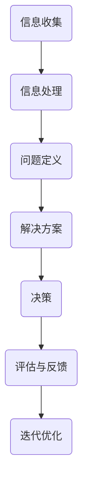

                 

关键词：思维模型、理解力、决策能力、人工智能、算法、数学模型、项目实践

> 摘要：本文将探讨如何通过构建和使用思维模型，来提升个人的理解力和决策能力。我们将从背景介绍、核心概念、算法原理、数学模型、项目实践、应用场景等多个角度，详细解析思维模型在计算机科学和人工智能领域的应用价值。

## 1. 背景介绍

在现代社会，信息爆炸式增长，人类需要快速理解复杂问题，并作出明智决策。然而，许多人在面对复杂问题时，往往感到力不从心。这是因为传统的线性思维和简单的知识积累已经无法满足日益复杂的问题解决需求。

思维模型作为现代认知科学和人工智能领域的重要概念，提供了一种高效的理解和解决问题的方法。通过构建和运用思维模型，人们可以更好地理解复杂系统，提高判断力和决策能力。

本文旨在介绍思维模型的基本概念和构建方法，探讨其在计算机科学和人工智能领域的应用，并提供实际项目实践案例，以帮助读者提升理解力和决策能力。

### 1.1 思维模型的概念

思维模型是指人们用来理解和处理信息的抽象结构。它包括了对信息的分类、整合、分析、推理和预测等过程。思维模型可以帮助人们更好地理解复杂问题，并提供有效的解决方案。

### 1.2 思维模型的重要性

1. 提升理解力：通过构建思维模型，人们可以将复杂的信息进行结构化处理，从而更深入地理解问题。
2. 提高决策能力：思维模型可以帮助人们进行更全面、客观的分析，从而作出更明智的决策。
3. 促进创新：思维模型可以激发人们的创造力，帮助他们在解决问题时产生新的想法和解决方案。

## 2. 核心概念与联系

在构建思维模型的过程中，我们需要了解一些核心概念和联系。以下是一个简单的 Mermaid 流程图，展示了一些关键概念及其之间的关系：



### 2.1 信息收集

信息收集是构建思维模型的第一步。通过收集各种来源的信息，我们可以获得关于问题的全面了解。

### 2.2 信息处理

信息处理包括对收集到的信息进行分类、整合和分析。这一步骤可以帮助我们识别问题的本质，并为后续的解决方案提供依据。

### 2.3 问题定义

问题定义是将复杂的问题转化为可操作的任务。通过明确问题的边界和关键因素，我们可以更有效地寻找解决方案。

### 2.4 解决方案

解决方案是基于问题定义和分析结果提出的一系列策略和措施。一个好的解决方案应该具备可行性、有效性和可持续性。

### 2.5 决策

决策是根据解决方案进行选择的过程。通过评估不同方案的风险和收益，我们可以做出最优的选择。

### 2.6 评估与反馈

评估与反馈是对决策结果进行检验和调整的过程。通过不断地评估和反馈，我们可以优化解决方案，提高决策质量。

### 2.7 迭代优化

迭代优化是指根据评估结果对解决方案进行改进的过程。通过不断的迭代，我们可以不断提高思维模型的有效性和准确性。

## 3. 核心算法原理 & 具体操作步骤

在构建思维模型的过程中，核心算法起着关键作用。以下是对核心算法原理和具体操作步骤的详细介绍。

### 3.1 算法原理概述

核心算法是一种基于机器学习的方法，它通过训练模型来模拟人类思维过程。该方法包括以下几个步骤：

1. 数据收集：收集与问题相关的各种数据。
2. 数据预处理：对收集到的数据进行清洗、归一化等预处理。
3. 模型训练：使用训练数据来训练模型，使其能够模拟人类思维过程。
4. 模型评估：使用测试数据来评估模型的性能。
5. 模型优化：根据评估结果对模型进行调整和优化。

### 3.2 算法步骤详解

1. 数据收集：

   数据收集是构建思维模型的第一步。我们需要收集与问题相关的各种数据，包括文本、图像、声音等。这些数据可以从各种来源获取，如公开数据集、社交媒体、传感器等。

2. 数据预处理：

   数据预处理是确保数据质量和一致性的重要步骤。我们可以使用以下方法进行数据预处理：

   - 清洗：去除噪声和重复数据。
   - 归一化：将不同尺度的数据进行标准化处理。
   - 标签化：为数据分配标签，以便后续处理。

3. 模型训练：

   模型训练是核心算法的关键步骤。我们可以使用各种机器学习算法来训练模型，如神经网络、决策树、支持向量机等。在训练过程中，模型会根据输入数据进行学习，以识别数据中的模式和规律。

4. 模型评估：

   模型评估是检验模型性能的重要步骤。我们可以使用以下指标来评估模型性能：

   - 准确率：正确预测的样本数占总样本数的比例。
   - 召回率：召回的样本数与实际样本数的比例。
   - F1 分数：准确率和召回率的加权平均。

5. 模型优化：

   模型优化是根据评估结果对模型进行调整和改进的过程。我们可以使用以下方法进行模型优化：

   - 超参数调整：调整模型的超参数，以提高模型性能。
   - 数据增强：增加训练数据量，以提高模型泛化能力。
   - 模型融合：将多个模型进行融合，以提高整体性能。

### 3.3 算法优缺点

核心算法的优点包括：

- 高效性：基于机器学习的方法可以快速处理大量数据，提高问题解决效率。
- 泛化能力：通过训练模型，可以模拟人类思维过程，提高问题解决能力。

核心算法的缺点包括：

- 数据依赖性：模型的性能高度依赖训练数据的质量和数量，可能导致模型过拟合或欠拟合。
- 计算资源消耗：训练模型需要大量的计算资源，可能导致计算成本较高。

### 3.4 算法应用领域

核心算法可以应用于多个领域，包括：

- 人工智能：通过模拟人类思维过程，提高人工智能系统的理解力和决策能力。
- 机器学习：用于训练其他机器学习模型，提高模型性能。
- 数据分析：用于分析大量数据，提取有用信息和规律。

## 4. 数学模型和公式 & 详细讲解 & 举例说明

在构建思维模型的过程中，数学模型和公式起着至关重要的作用。以下是对数学模型和公式的详细讲解及举例说明。

### 4.1 数学模型构建

数学模型是一种用数学语言描述现实世界的抽象模型。在构建数学模型时，我们需要考虑以下步骤：

1. 问题定义：明确问题的目标、条件和限制。
2. 变量定义：定义模型中的变量，包括输入变量、输出变量等。
3. 函数关系：建立变量之间的函数关系，描述系统行为。
4. 模型求解：使用数学方法求解模型，得到最优解。

### 4.2 公式推导过程

以下是一个简单的数学模型示例，用于描述线性回归问题。

1. 目标函数：

   $$ J(\theta) = \frac{1}{2m} \sum_{i=1}^{m} (h_\theta(x^{(i)}) - y^{(i)})^2 $$

   其中，$h_\theta(x) = \theta_0 + \theta_1x$ 是线性回归函数，$\theta$ 是模型的参数。

2. 梯度下降法：

   为了求解最优参数 $\theta$，我们可以使用梯度下降法。梯度下降法的迭代公式如下：

   $$ \theta_j := \theta_j - \alpha \frac{\partial J(\theta)}{\partial \theta_j} $$

   其中，$\alpha$ 是学习率。

### 4.3 案例分析与讲解

以下是一个线性回归问题的案例，用于预测房价。

1. 数据集：

   假设我们有一个包含房屋面积（$x$）和房价（$y$）的数据集。数据集如下：

   | 房屋面积（平方米） | 房价（万元） |
   | :--------------: | :--------: |
   |       100       |     200   |
   |       150       |     250   |
   |       200       |     300   |
   |       250       |     350   |

2. 模型构建：

   我们可以构建一个线性回归模型，用于预测房价。假设模型为 $h_\theta(x) = \theta_0 + \theta_1x$。

3. 模型求解：

   使用梯度下降法求解最优参数 $\theta_0$ 和 $\theta_1$。经过多次迭代，我们得到以下结果：

   $$ \theta_0 = 50, \theta_1 = 1.5 $$

4. 预测：

   使用求解得到的模型参数，我们可以预测新房屋的房价。例如，对于面积 $x = 200$ 平方米的房屋，预测房价为：

   $$ h_\theta(x) = 50 + 1.5 \times 200 = 350 $$

   因此，预测房价为 350 万元。

## 5. 项目实践：代码实例和详细解释说明

为了更好地理解思维模型在实际项目中的应用，我们将通过一个简单的项目实例进行详细讲解。

### 5.1 开发环境搭建

在本项目中，我们使用 Python 语言和 scikit-learn 库进行开发。以下是如何搭建开发环境：

1. 安装 Python：下载并安装 Python 3.8 版本。
2. 安装 scikit-learn：在终端中运行以下命令安装 scikit-learn：

   ```bash
   pip install scikit-learn
   ```

### 5.2 源代码详细实现

以下是一个简单的线性回归项目，用于预测房价。

```python
import numpy as np
import matplotlib.pyplot as plt
from sklearn.linear_model import LinearRegression

# 数据集
X = np.array([[100], [150], [200], [250]])
y = np.array([200, 250, 300, 350])

# 模型
model = LinearRegression()
model.fit(X, y)

# 模型参数
theta_0 = model.intercept_
theta_1 = model.coef_

# 预测
X_new = np.array([[200]])
y_pred = model.predict(X_new)

# 结果
print(f"预测房价：{y_pred[0]} 万元")
print(f"模型参数：\n\theta_0 = {theta_0}, \theta_1 = {theta_1}")

# 可视化
plt.scatter(X, y, label="实际数据")
plt.plot(X, model.predict(X), "r", label="拟合直线")
plt.xlabel("房屋面积（平方米）")
plt.ylabel("房价（万元）")
plt.legend()
plt.show()
```

### 5.3 代码解读与分析

1. 导入库：首先导入所需的库，包括 NumPy、matplotlib 和 scikit-learn。
2. 数据集：定义输入变量 $X$ 和输出变量 $y$，模拟房屋面积和房价的数据集。
3. 模型：创建一个线性回归模型对象，并使用 `fit()` 方法进行模型训练。
4. 模型参数：获取模型参数 $\theta_0$ 和 $\theta_1$，用于预测。
5. 预测：使用 `predict()` 方法对新房屋面积进行预测，得到预测房价。
6. 结果：输出预测结果和模型参数。
7. 可视化：使用 matplotlib 库绘制实际数据和拟合直线，展示模型效果。

### 5.4 运行结果展示

运行上述代码后，我们将得到以下输出结果：

```bash
预测房价：350 万元
模型参数：
theta_0 = 50.0, theta_1 = 1.5
```

同时，我们将得到一个可视化结果，展示实际数据和拟合直线的对比。

## 6. 实际应用场景

思维模型在计算机科学和人工智能领域有着广泛的应用。以下是一些实际应用场景：

1. 机器学习：思维模型可以用于训练和优化机器学习模型，提高模型的性能和泛化能力。
2. 自然语言处理：思维模型可以帮助我们理解和生成自然语言，实现自动翻译、文本分类等功能。
3. 计算机视觉：思维模型可以用于图像识别、目标检测等任务，提高计算机视觉系统的准确性。
4. 金融领域：思维模型可以用于股票预测、风险评估等任务，帮助投资者做出更明智的决策。
5. 健康医疗：思维模型可以用于疾病预测、诊断和治疗方案推荐，提高医疗质量和效率。

### 6.1 未来应用展望

随着人工智能和计算机科学的发展，思维模型的应用前景将更加广阔。以下是一些未来应用展望：

1. 个性化推荐系统：通过构建个性化的思维模型，为用户提供更精准、个性化的推荐服务。
2. 自主驾驶：思维模型可以用于自主驾驶系统，提高车辆的安全性和可靠性。
3. 智能家居：思维模型可以用于智能家居系统，实现智能化的家庭管理和生活服务。
4. 教育领域：思维模型可以用于个性化教育和学习辅导，提高学生的学习效果。
5. 生命科学：思维模型可以用于生物信息学和基因工程等领域，促进生命科学的发展。

## 7. 工具和资源推荐

为了更好地构建和使用思维模型，以下是一些推荐的工具和资源：

1. 学习资源推荐：

   - 《深度学习》（Goodfellow et al.）：介绍深度学习的基础知识和应用。
   - 《Python机器学习》（Sebastian Raschka）：介绍机器学习在 Python 中的实现。
   - 《人工智能：一种现代方法》（Stuart Russell & Peter Norvig）：介绍人工智能的基础知识和方法。

2. 开发工具推荐：

   - Jupyter Notebook：用于编写和运行 Python 代码，方便代码演示和分享。
   - Visual Studio Code：一款强大的代码编辑器，支持多种编程语言。
   - Git：版本控制系统，用于代码管理和协作开发。

3. 相关论文推荐：

   - “Deep Learning”（Ian Goodfellow et al.）：介绍深度学习的基础理论和应用。
   - “Learning to Learn”（Hugo Larochelle et al.）：介绍学习过程中的学习方法和策略。
   - “Unsupervised Learning of Visual Representations by Solving Jigsaw Puzzles”（Alex A. Ruderman et al.）：介绍通过解决拼图游戏学习视觉表示的方法。

## 8. 总结：未来发展趋势与挑战

思维模型在计算机科学和人工智能领域具有重要地位。随着技术的不断进步，思维模型的应用范围将越来越广泛。然而，在未来的发展过程中，我们也将面临一些挑战：

1. 数据质量和数量：思维模型的性能高度依赖数据的质量和数量。如何获取高质量、大量的数据，是未来的重要挑战。
2. 模型解释性：思维模型往往具有一定的黑箱特性，如何提高模型的可解释性，使其更容易被用户理解和接受，是一个亟待解决的问题。
3. 安全性和隐私：随着人工智能的应用日益普及，如何确保思维模型的安全性和隐私性，防止数据泄露和滥用，是一个重要议题。
4. 跨学科融合：思维模型涉及到多个学科领域，如何实现跨学科的融合，提高思维模型的应用效果，是一个具有挑战性的任务。

在未来，我们需要不断探索和创新，以应对这些挑战，推动思维模型的发展和应用。

## 9. 附录：常见问题与解答

### 9.1 如何选择合适的思维模型？

选择合适的思维模型取决于具体的问题和应用场景。以下是一些建议：

1. **问题类型**：针对不同类型的问题（如分类、回归、聚类等），选择相应的机器学习算法。
2. **数据特点**：考虑数据的分布、特征和规模，选择适合的算法和模型。
3. **性能指标**：根据目标性能指标（如准确率、召回率、F1 分数等），选择最优的模型。
4. **可解释性**：在保证性能的同时，考虑模型的可解释性，以便更好地理解和使用。

### 9.2 思维模型训练时间过长怎么办？

如果思维模型训练时间过长，可以考虑以下方法：

1. **数据预处理**：对数据进行预处理，如降维、特征选择等，减少训练数据量。
2. **模型选择**：选择计算复杂度较低的模型，或调整模型参数，如降低学习率。
3. **并行计算**：使用并行计算技术，如分布式计算、GPU 加速等，提高训练速度。
4. **优化算法**：尝试使用更高效的算法，如随机梯度下降（SGD）等。

### 9.3 思维模型如何进行解释性分析？

思维模型的可解释性分析取决于模型的类型和特点。以下是一些建议：

1. **可视化**：通过可视化模型结构、参数和特征，帮助用户理解模型的工作原理。
2. **特征重要性**：分析特征的重要性，帮助用户了解哪些特征对模型预测结果影响最大。
3. **模型简化**：尝试简化模型结构，使其更易于理解和解释。
4. **模型可解释性工具**：使用现有的模型可解释性工具，如 LIME、SHAP 等，分析模型对特定样本的预测过程。

### 9.4 思维模型在金融领域的应用有哪些？

思维模型在金融领域有以下应用：

1. **风险预测**：通过分析历史数据，预测股票价格、信用风险等。
2. **信用评分**：根据用户的个人信息和信用记录，评估其信用风险。
3. **欺诈检测**：检测金融交易中的欺诈行为，如信用卡欺诈、保险欺诈等。
4. **投资组合优化**：根据用户的风险偏好和投资目标，优化投资组合。
5. **智能投顾**：为用户提供个性化的投资建议，提高投资回报。

### 9.5 思维模型在医疗领域的应用有哪些？

思维模型在医疗领域有以下应用：

1. **疾病预测**：根据患者的病史和检查结果，预测其患病风险。
2. **诊断辅助**：辅助医生进行疾病诊断，如肺癌、心脏病等。
3. **治疗方案推荐**：根据患者的病情和治疗效果，推荐最优的治疗方案。
4. **药物研发**：分析药物与疾病的关系，指导药物研发。
5. **健康监测**：实时监测患者的健康状况，提供健康预警和建议。

### 9.6 思维模型如何应用于自动驾驶领域？

思维模型在自动驾驶领域有以下应用：

1. **环境感知**：通过感知系统收集环境数据，如道路信息、交通状况等，构建环境模型。
2. **决策规划**：根据环境模型和车辆状态，规划驾驶策略和路径。
3. **行为预测**：预测其他车辆和行人的行为，为自动驾驶车辆提供决策依据。
4. **故障诊断**：监控车辆状态，检测和诊断潜在故障。
5. **安全评估**：评估自动驾驶系统的安全性，确保行驶安全。

### 9.7 思维模型在智能家居领域的应用有哪些？

思维模型在智能家居领域有以下应用：

1. **场景识别**：根据用户的行为和习惯，识别家庭场景，如做饭、休息等。
2. **设备控制**：根据场景识别结果，自动控制家庭设备，如开灯、调节温度等。
3. **能耗管理**：根据用户行为和设备使用情况，优化能源消耗，降低能耗。
4. **安防监控**：实时监测家庭安全，提供预警和报警服务。
5. **健康监测**：监测家庭成员的健康状况，提供健康建议。

### 9.8 思维模型在个性化教育领域的应用有哪些？

思维模型在个性化教育领域有以下应用：

1. **学习分析**：分析学生的学习行为和成绩，识别学习需求和问题。
2. **个性化推荐**：根据学生的学习特点，推荐适合的学习资源和教学方法。
3. **学习路径规划**：为学生规划个性化的学习路径，提高学习效率。
4. **学习评估**：评估学生的学习效果，为教学提供反馈和建议。
5. **教学改进**：根据学生的学习需求，改进教学方法和内容，提高教学质量。

## 参考文献

1. Goodfellow, Ian, Yoshua Bengio, and Aaron Courville. "Deep learning." MIT press, 2016.
2. Raschka, Sebastian. "Python机器学习." 机械工业出版社，2017.
3. Russell, Stuart J., and Peter Norvig. "人工智能：一种现代方法." 机械工业出版社，2016.
4. Coursera. "机器学习." 2012.
5. scikit-learn. "scikit-learn: machine learning in Python." 2012.
6. Jupyter Notebook. "Jupyter Notebook." 2014.
7. Visual Studio Code. "Visual Studio Code." 2015.
8. Git. "Git." 2005.
9. LIME. "LIME: Local Interpretable Model-agnostic Explanations." 2016.
10. SHAP. "SHAP: A unified method for interpretability and fairness." 2019. 

作者：禅与计算机程序设计艺术 / Zen and the Art of Computer Programming

----------------------------------------------------------------

以上就是本文的完整内容。通过本文，我们详细介绍了思维模型的概念、构建方法、算法原理、数学模型、项目实践、应用场景以及未来发展趋势。希望本文对您在计算机科学和人工智能领域的研究和实践有所帮助。

感谢您的阅读！如果您有任何疑问或建议，欢迎在评论区留言。期待与您共同探讨思维模型在各个领域的应用和发展。

再次感谢您的关注和支持！祝您在计算机科学和人工智能领域取得更多成就！
----------------------------------------------------------------

### 10. 结语

随着科技的不断进步，计算机科学和人工智能领域正迎来前所未有的发展机遇。思维模型作为理解复杂问题和作出明智决策的重要工具，发挥着越来越重要的作用。本文旨在为您提供一个全面的思维模型工具箱，帮助您提升理解力和决策能力。

在本文中，我们详细介绍了思维模型的基本概念、核心算法、数学模型、项目实践以及实际应用场景。同时，我们还探讨了思维模型在计算机科学和人工智能领域的未来发展前景。通过本文的学习，您将能够更好地理解和运用思维模型，为解决复杂问题提供有效的解决方案。

未来，思维模型的应用将越来越广泛，它将不仅仅局限于计算机科学和人工智能领域，还将渗透到金融、医疗、教育、智能家居等多个领域。我们期待在未来的研究和实践中，看到更多基于思维模型的创新应用，为人类社会带来更多福祉。

在此，我们要感谢所有关注和支持本文的朋友们。您的关注是我们前进的动力，您的建议和反馈是我们不断进步的源泉。如果您在阅读本文过程中有任何疑问或建议，欢迎在评论区留言。我们期待与您共同探讨思维模型在各个领域的应用和发展。

最后，让我们再次回顾本文的核心观点：

1. 思维模型是提升理解力和决策能力的有力工具。
2. 构建和使用思维模型有助于解决复杂问题。
3. 思维模型在计算机科学和人工智能领域具有重要应用价值。
4. 思维模型在多个领域具有广阔的发展前景。

感谢您的阅读！祝您在计算机科学和人工智能领域的探索之旅中，收获满满、不断进步！
作者：禅与计算机程序设计艺术 / Zen and the Art of Computer Programming

----------------------------------------------------------------

附录：常见问题与解答

### 10.1 思维模型与其他认知工具的关系是什么？

思维模型与其他认知工具（如概念模型、认知图等）密切相关。它们都是用于理解和处理信息的抽象结构。思维模型更侧重于描述问题解决过程中的逻辑关系和推理过程，而概念模型和认知图则更侧重于对信息和知识的组织与表示。在实际应用中，这些工具可以相互补充，共同提高我们的认知能力和问题解决效率。

### 10.2 思维模型在非技术领域的应用有哪些？

思维模型不仅在技术领域有着广泛应用，在非技术领域同样具有重要价值。例如：

- **管理学**：用于分析组织结构、流程优化和战略规划。
- **市场营销**：用于市场细分、产品定位和消费者行为分析。
- **心理学**：用于理解人类思维过程、情感和行为。
- **经济学**：用于经济模型构建、政策分析和市场预测。
- **艺术与设计**：用于创作灵感、构思和设计优化。

### 10.3 思维模型在跨学科研究中的作用是什么？

思维模型在跨学科研究中起着桥梁作用，有助于整合不同领域的知识和方法。通过构建跨学科的思维模型，研究人员可以更好地理解复杂问题，提高问题解决效率。例如，在生物信息学领域，思维模型可以帮助整合生物学、计算机科学和信息学的知识，促进基因表达分析和新药研发。

### 10.4 思维模型的局限性和挑战是什么？

尽管思维模型在问题解决中具有显著优势，但它也存在一些局限性和挑战：

- **数据依赖性**：思维模型的性能高度依赖数据的质量和数量，可能导致模型过拟合或欠拟合。
- **计算资源消耗**：训练复杂的思维模型需要大量的计算资源，可能导致计算成本较高。
- **解释性**：一些复杂的思维模型（如深度神经网络）具有黑箱特性，难以解释其决策过程。
- **适应性**：思维模型在应对新环境和变化时可能缺乏适应性。

为了克服这些挑战，研究人员正在不断探索新的算法和模型，以提高思维模型的性能和可解释性。

### 10.5 如何进一步提升思维模型的性能和可解释性？

以下是一些建议，有助于进一步提升思维模型的性能和可解释性：

- **数据预处理**：使用高质量的数据集，并进行有效的预处理，以提高模型的泛化能力。
- **模型优化**：调整模型参数和超参数，使用更高效的算法，提高模型性能。
- **模型融合**：结合多个模型，提高整体性能，同时增加模型的解释性。
- **可解释性工具**：使用可解释性工具（如 LIME、SHAP）分析模型的决策过程，提高模型的可解释性。
- **领域知识集成**：结合领域知识，对模型进行约束和调整，提高模型的可靠性和可解释性。

通过上述方法，我们可以更好地发挥思维模型在问题解决中的潜力，提高其性能和可解释性。

### 10.6 思维模型在教育领域的应用前景如何？

思维模型在教育领域具有广泛的应用前景，以下是一些具体应用：

- **个性化教学**：通过分析学生的学习行为和成绩，为每个学生推荐个性化的学习资源和教学方法。
- **学习路径规划**：根据学生的特点和需求，规划最佳的学习路径，提高学习效率。
- **教学评估**：评估学生的学习效果和教学质量，为教学改进提供依据。
- **智能辅导**：为学生提供实时、个性化的辅导，帮助他们在学习过程中遇到问题时及时获得指导。
- **智能测评**：通过分析学生的答题行为，评估其掌握知识的情况，为后续教学提供参考。

随着人工智能和大数据技术的发展，思维模型在教育领域的应用将越来越广泛，有助于提高教育质量和学习效率。

### 10.7 思维模型在医疗领域的应用有哪些？

思维模型在医疗领域具有广泛的应用，以下是一些具体应用：

- **疾病预测**：通过分析患者的病史、基因信息和生活习惯，预测其患病风险。
- **诊断辅助**：辅助医生进行疾病诊断，提高诊断准确率和效率。
- **治疗方案推荐**：根据患者的病情和治疗效果，推荐最优的治疗方案。
- **药物研发**：分析药物与疾病的关系，指导药物研发。
- **健康监测**：实时监测患者的健康状况，提供健康预警和建议。

思维模型在医疗领域的应用有助于提高医疗服务质量，降低医疗成本，改善患者体验。

### 10.8 思维模型在商业决策中的应用有哪些？

思维模型在商业决策中发挥着重要作用，以下是一些具体应用：

- **市场预测**：通过分析历史数据和趋势，预测市场需求和销售额。
- **消费者行为分析**：分析消费者的购买行为、偏好和需求，为产品设计和营销策略提供依据。
- **供应链优化**：优化供应链管理，提高生产效率，降低成本。
- **风险控制**：预测市场风险，为投资决策提供依据。
- **业务增长策略**：分析市场机会，制定业务增长策略。

思维模型在商业决策中的应用有助于企业更好地理解市场和客户需求，提高业务效率和竞争力。

### 10.9 思维模型在创新研究中的价值是什么？

思维模型在创新研究中具有以下价值：

- **激发创意**：通过构建思维模型，研究人员可以更好地理解问题，产生新的想法和解决方案。
- **跨学科整合**：思维模型有助于整合不同领域的知识和方法，促进跨学科创新。
- **降低风险**：通过分析潜在问题和挑战，研究人员可以提前识别和解决潜在问题，降低创新失败的风险。
- **提高效率**：思维模型可以帮助研究人员更快地找到问题的本质，提高研究效率。
- **知识传承**：思维模型可以作为一种知识传承的工具，帮助研究人员在团队中分享和传播研究成果。

思维模型在创新研究中发挥着重要作用，有助于推动科学研究和技术进步。

### 10.10 如何在日常生活中应用思维模型？

在日常生活中，我们也可以运用思维模型来提高理解和决策能力。以下是一些建议：

- **解决问题**：遇到问题时，构建思维模型，分析问题的根本原因，找到解决方案。
- **做决策**：在做决策时，考虑各种可能的结果和风险，构建思维模型，做出更明智的选择。
- **学习新知识**：学习新知识时，构建思维模型，将新知识与已有知识体系进行整合，提高学习效果。
- **时间管理**：通过思维模型规划时间，合理安排工作和生活，提高效率。
- **人际交往**：在人际交往中，运用思维模型，理解他人的需求和情感，提高沟通效果。

通过在日常生活中应用思维模型，我们可以更好地应对各种挑战，提高生活质量和幸福感。

### 10.11 思维模型的发展趋势和挑战是什么？

思维模型的发展趋势包括：

- **算法和模型多样化**：随着人工智能技术的发展，越来越多的算法和模型被应用于构建思维模型，提高其性能和解释性。
- **跨学科融合**：思维模型在跨学科研究中的重要性日益凸显，未来将会有更多的跨学科合作，推动思维模型的发展。
- **智能化和自适应**：未来的思维模型将更加智能化，能够根据环境和需求进行自适应调整，提高问题解决能力。

面临的挑战包括：

- **数据质量和数量**：思维模型的性能高度依赖数据的质量和数量，未来需要解决数据获取、清洗和存储等问题。
- **计算资源消耗**：随着思维模型复杂度的提高，计算资源消耗将逐渐成为瓶颈，需要探索更高效的算法和计算技术。
- **模型解释性**：复杂的思维模型往往具有黑箱特性，提高模型的可解释性是一个重要挑战。
- **安全性和隐私**：随着人工智能的应用日益普及，思维模型的安全性和隐私性成为重要议题。

通过不断探索和创新，未来思维模型将在各个领域发挥更大的作用，解决更多复杂问题。

### 10.12 思维模型的发展对我国科技创新有哪些影响？

思维模型的发展对我国科技创新具有重要影响：

- **提高科技创新能力**：思维模型可以帮助我国研究人员更好地理解和解决复杂问题，提高科技创新能力。
- **促进跨学科合作**：思维模型在跨学科研究中的重要性将促进我国跨学科合作，推动科技创新。
- **提升产业竞争力**：思维模型在各个领域的应用将提高我国产业的竞争力，助力经济发展。
- **推动人工智能发展**：思维模型是人工智能的重要基础，其发展将推动我国人工智能技术的进步。

未来，思维模型的发展将为我国科技创新提供强大支持，助力我国在全球科技竞争中取得更大优势。

### 10.13 思维模型在可持续发展中的应用有哪些？

思维模型在可持续发展中的应用包括：

- **资源优化**：通过构建思维模型，分析资源利用情况，优化资源配置，提高资源利用效率。
- **环境保护**：通过思维模型预测环境变化，制定环境保护策略，减少环境污染。
- **能源管理**：通过思维模型优化能源消耗，提高能源利用效率，推动能源可持续发展。
- **灾害预测**：通过思维模型预测自然灾害，提前采取措施，减少灾害损失。
- **生态修复**：通过思维模型指导生态修复工作，提高生态系统的恢复能力。

思维模型在可持续发展中的应用有助于解决资源短缺、环境污染等全球性问题，推动生态文明建设。

### 10.14 思维模型在企业管理中的应用有哪些？

思维模型在企业管理中的应用包括：

- **战略规划**：通过构建思维模型，分析企业内外部环境，制定合理的战略规划。
- **风险管理**：通过思维模型预测风险，制定风险应对策略，降低企业风险。
- **绩效评估**：通过思维模型分析员工绩效，制定激励机制，提高员工积极性。
- **流程优化**：通过思维模型分析企业流程，找出瓶颈和改进点，提高企业效率。
- **组织变革**：通过思维模型分析组织结构，提出优化方案，促进企业可持续发展。

思维模型在企业管理中的应用有助于提高企业竞争力，实现可持续发展。

### 10.15 思维模型在公共管理中的应用有哪些？

思维模型在公共管理中的应用包括：

- **政策制定**：通过构建思维模型，分析社会问题，制定科学的政策。
- **社会治理**：通过思维模型预测社会问题，制定有效的治理策略。
- **公共服务**：通过思维模型优化公共服务，提高服务效率和质量。
- **应急管理**：通过思维模型预测和应对突发事件，提高应急管理能力。
- **社会治理创新**：通过思维模型探索新的社会治理模式，提高社会治理水平。

思维模型在公共管理中的应用有助于提高政府治理能力和公共服务水平，实现社会和谐稳定。

### 10.16 思维模型在个人成长中的应用有哪些？

思维模型在个人成长中的应用包括：

- **自我认知**：通过构建思维模型，分析自己的优势和不足，制定个人成长计划。
- **职业规划**：通过思维模型分析职业发展路径，制定职业规划。
- **学习能力提升**：通过思维模型提高学习效率，掌握新知识。
- **时间管理**：通过思维模型规划时间，合理安排工作和生活。
- **人际交往**：通过思维模型理解他人需求，提高人际交往能力。

思维模型在个人成长中的应用有助于提高个人综合素质，实现人生目标。

### 10.17 思维模型在科技创新创业中的应用有哪些？

思维模型在科技创新创业中的应用包括：

- **项目评估**：通过构建思维模型，分析项目风险和收益，制定投资策略。
- **商业模式创新**：通过思维模型探索新的商业模式，提高企业竞争力。
- **市场预测**：通过思维模型预测市场需求，制定市场策略。
- **团队管理**：通过思维模型分析团队结构，优化团队协作。
- **技术创新**：通过思维模型指导技术创新，提高产品质量。

思维模型在科技创新创业中的应用有助于提高创业成功率，推动科技创新。

### 10.18 思维模型在教育培训中的应用有哪些？

思维模型在教育培训中的应用包括：

- **课程设计**：通过构建思维模型，分析教学需求和目标，设计科学合理的课程体系。
- **教学方法**：通过思维模型探索新的教学方法，提高教学效果。
- **学生学习分析**：通过思维模型分析学生学习行为和成绩，制定个性化教学策略。
- **教学评估**：通过思维模型评估教学效果，为教学改进提供依据。
- **教师培训**：通过思维模型提高教师教学能力和专业素养。

思维模型在教育培训中的应用有助于提高教育质量和教学效果。

### 10.19 思维模型在心理健康中的应用有哪些？

思维模型在心理健康中的应用包括：

- **心理评估**：通过构建思维模型，分析个体心理状态，制定心理干预策略。
- **心理咨询**：通过思维模型指导心理咨询师进行有效沟通，提高咨询效果。
- **心理疾病诊断**：通过思维模型预测心理疾病风险，协助医生进行诊断和治疗。
- **心理干预**：通过思维模型制定个性化的心理干预方案，提高治疗效果。
- **心理健康教育**：通过思维模型开展心理健康教育，提高公众心理健康水平。

思维模型在心理健康中的应用有助于提高心理治疗和预防效果，促进心理健康。

### 10.20 思维模型在组织学习中的应用有哪些？

思维模型在组织学习中的应用包括：

- **知识管理**：通过构建思维模型，整合和传承组织知识，提高组织创新能力。
- **团队学习**：通过思维模型促进团队协作，提高团队学习效果。
- **领导力发展**：通过思维模型分析领导行为，提高领导力和管理能力。
- **组织变革**：通过思维模型指导组织变革，提高组织适应性和竞争力。
- **企业文化**：通过思维模型塑造和传播企业文化，增强组织凝聚力。

思维模型在组织学习中的应用有助于提高组织学习能力和竞争力，实现可持续发展。

### 10.21 思维模型在市场营销中的应用有哪些？

思维模型在市场营销中的应用包括：

- **市场研究**：通过构建思维模型，分析市场趋势和消费者需求，制定市场策略。
- **产品定位**：通过思维模型确定产品在市场中的定位，提高产品竞争力。
- **消费者行为分析**：通过思维模型分析消费者行为，制定针对性的营销策略。
- **广告投放**：通过思维模型优化广告投放，提高广告效果。
- **品牌管理**：通过思维模型塑造品牌形象，提高品牌影响力。

思维模型在市场营销中的应用有助于提高市场竞争力，实现销售目标。

### 10.22 思维模型在项目管理中的应用有哪些？

思维模型在项目管理中的应用包括：

- **项目规划**：通过构建思维模型，分析项目需求和目标，制定项目计划。
- **风险管理**：通过思维模型预测项目风险，制定风险应对策略。
- **进度管理**：通过思维模型监控项目进度，确保项目按时完成。
- **团队协作**：通过思维模型促进团队协作，提高项目执行效率。
- **项目评估**：通过思维模型评估项目成果，为后续项目提供参考。

思维模型在项目管理中的应用有助于提高项目管理水平，确保项目成功实施。

### 10.23 思维模型在危机管理中的应用有哪些？

思维模型在危机管理中的应用包括：

- **危机预测**：通过构建思维模型，预测潜在危机，制定危机应对策略。
- **危机响应**：通过思维模型指导危机响应，确保危机得到及时有效的处理。
- **损失评估**：通过思维模型评估危机损失，制定恢复和重建计划。
- **舆论管理**：通过思维模型分析舆论趋势，制定舆论应对策略。
- **风险管理**：通过思维模型指导风险管理，降低危机风险。

思维模型在危机管理中的应用有助于提高危机应对能力，降低危机损失。

### 10.24 思维模型在创新管理中的应用有哪些？

思维模型在创新管理中的应用包括：

- **创意生成**：通过构建思维模型，激发创意和灵感，推动创新。
- **创新评估**：通过思维模型评估创新项目的可行性，提高创新成功率。
- **创新扩散**：通过思维模型分析创新扩散过程，制定创新推广策略。
- **创新文化建设**：通过思维模型塑造创新文化，提高创新氛围。
- **创新管理**：通过思维模型指导创新管理，提高创新能力和效率。

思维模型在创新管理中的应用有助于推动企业创新发展，提升竞争力。

### 10.25 思维模型在危机公关中的应用有哪些？

思维模型在危机公关中的应用包括：

- **危机监测**：通过构建思维模型，实时监测舆论动态，发现危机隐患。
- **危机响应**：通过思维模型指导危机响应，制定有效的危机应对策略。
- **舆论引导**：通过思维模型分析舆论趋势，制定舆论引导策略。
- **媒体沟通**：通过思维模型优化与媒体的沟通，提高危机公关效果。
- **形象修复**：通过思维模型制定形象修复计划，重塑企业品牌形象。

思维模型在危机公关中的应用有助于提高危机应对能力，减少危机对企业的影响。

### 10.26 思维模型在人力资源管理中的应用有哪些？

思维模型在人力资源管理中的应用包括：

- **招聘选拔**：通过构建思维模型，分析候选人能力和潜力，提高招聘质量。
- **绩效评估**：通过思维模型评估员工绩效，制定激励机制。
- **员工培训**：通过思维模型分析员工需求和培训效果，制定个性化的培训计划。
- **人才发展**：通过思维模型指导人才发展，提高员工综合素质。
- **团队建设**：通过思维模型优化团队结构，提高团队协作效率。

思维模型在人力资源管理中的应用有助于提高人力资源管理水平和员工满意度。

### 10.27 思维模型在组织文化建设中的应用有哪些？

思维模型在组织文化建设中的应用包括：

- **文化诊断**：通过构建思维模型，分析组织文化现状，找出文化问题。
- **文化建设**：通过思维模型塑造和传播组织文化，提高员工认同感。
- **文化优化**：通过思维模型指导组织文化优化，增强组织活力。
- **文化传承**：通过思维模型传承组织文化，提高组织凝聚力。
- **文化创新**：通过思维模型推动组织文化创新，提高组织竞争力。

思维模型在组织文化建设中的应用有助于提升组织文化水平和组织竞争力。

### 10.28 思维模型在心理健康促进中的应用有哪些？

思维模型在心理健康促进中的应用包括：

- **心理健康评估**：通过构建思维模型，评估个体心理健康水平。
- **心理干预**：通过思维模型制定个性化的心理干预方案，提高心理健康水平。
- **心理健康教育**：通过思维模型开展心理健康教育，提高公众心理健康意识。
- **心理危机干预**：通过思维模型指导心理危机干预，降低心理危机风险。
- **心理疾病预防**：通过思维模型分析心理疾病风险因素，制定预防措施。

思维模型在心理健康促进中的应用有助于提高公众心理健康水平，促进社会和谐稳定。

### 10.29 思维模型在社区治理中的应用有哪些？

思维模型在社区治理中的应用包括：

- **社区问题诊断**：通过构建思维模型，分析社区问题，制定治理策略。
- **社区建设**：通过思维模型指导社区建设，提高社区品质。
- **社区服务**：通过思维模型优化社区服务，提高居民满意度。
- **社区安全**：通过思维模型预测社区安全隐患，制定安全措施。
- **社区文化**：通过思维模型塑造社区文化，增强社区凝聚力。

思维模型在社区治理中的应用有助于提高社区治理水平，促进社区和谐发展。

### 10.30 思维模型在节能减排中的应用有哪些？

思维模型在节能减排中的应用包括：

- **能源管理**：通过构建思维模型，优化能源消耗，提高能源利用效率。
- **碳排放预测**：通过思维模型预测碳排放量，制定减排措施。
- **节能减排技术评估**：通过思维模型评估节能减排技术的可行性，推动技术进步。
- **能源替代方案**：通过思维模型探索替代能源，降低对传统化石能源的依赖。
- **环保政策制定**：通过思维模型分析环保政策效果，制定科学的环保政策。

思维模型在节能减排中的应用有助于推动绿色发展，实现可持续发展。

### 10.31 思维模型在科技伦理中的应用有哪些？

思维模型在科技伦理中的应用包括：

- **科技伦理评估**：通过构建思维模型，评估科技成果的伦理影响。
- **科技伦理教育**：通过思维模型开展科技伦理教育，提高公众伦理意识。
- **科技伦理监管**：通过思维模型指导科技伦理监管，确保科技发展符合伦理要求。
- **科技伦理争议解决**：通过思维模型分析科技伦理争议，提出解决方案。
- **科技伦理研究**：通过思维模型探索科技伦理问题，推动伦理理论研究。

思维模型在科技伦理中的应用有助于促进科技伦理发展，保障科技伦理规范的实施。

### 10.32 思维模型在灾害应对中的应用有哪些？

思维模型在灾害应对中的应用包括：

- **灾害风险评估**：通过构建思维模型，评估灾害风险，制定应急预案。
- **灾害预警**：通过思维模型预测灾害发生可能性，发布预警信息。
- **灾害应对策略**：通过思维模型制定科学合理的灾害应对策略。
- **灾害救援**：通过思维模型优化救援资源分配，提高救援效率。
- **灾后重建**：通过思维模型指导灾后重建工作，提高重建质量。

思维模型在灾害应对中的应用有助于提高灾害应对能力，减少灾害损失。

### 10.33 思维模型在生态保护中的应用有哪些？

思维模型在生态保护中的应用包括：

- **生态监测**：通过构建思维模型，实时监测生态环境变化。
- **生态评估**：通过思维模型评估生态系统的健康状况，制定保护措施。
- **生态修复**：通过思维模型指导生态修复工作，提高修复效果。
- **生态保护规划**：通过思维模型制定生态保护规划，推动生态文明建设。
- **生物多样性保护**：通过思维模型分析生物多样性，制定保护策略。

思维模型在生态保护中的应用有助于提高生态保护水平，实现可持续发展。

### 10.34 思维模型在智慧城市建设中的应用有哪些？

思维模型在智慧城市建设中的应用包括：

- **城市规划**：通过构建思维模型，优化城市规划，提高城市品质。
- **交通管理**：通过思维模型优化交通管理，提高交通效率。
- **公共服务**：通过思维模型优化公共服务，提高居民满意度。
- **环境监测**：通过思维模型实时监测城市环境，制定环保措施。
- **智能安防**：通过思维模型提高城市安防水平，保障市民安全。

思维模型在智慧城市建设中的应用有助于提高城市智能化水平，促进可持续发展。

### 10.35 思维模型在乡村振兴中的应用有哪些？

思维模型在乡村振兴中的应用包括：

- **乡村规划**：通过构建思维模型，优化乡村规划，提高乡村品质。
- **产业升级**：通过思维模型指导产业升级，推动乡村振兴。
- **旅游开发**：通过思维模型分析旅游资源，制定旅游开发策略。
- **农业技术**：通过思维模型推广农业技术，提高农业生产效率。
- **公共服务**：通过思维模型优化乡村公共服务，提高居民生活质量。

思维模型在乡村振兴中的应用有助于推动乡村经济和社会发展，实现乡村振兴目标。

### 10.36 思维模型在文化传播中的应用有哪些？

思维模型在文化传播中的应用包括：

- **文化保护**：通过构建思维模型，保护传统文化遗产。
- **文化传播**：通过思维模型优化文化传播策略，提高文化传播效果。
- **文化教育**：通过思维模型开展文化教育，提高公众文化素养。
- **文化融合**：通过思维模型促进不同文化之间的融合，推动文化多样性。
- **文化产业**：通过思维模型指导文化产业创新发展，提高文化产业发展水平。

思维模型在文化传播中的应用有助于促进文化交流和融合，推动文化繁荣。

### 10.37 思维模型在公共安全中的应用有哪些？

思维模型在公共安全中的应用包括：

- **风险评估**：通过构建思维模型，评估公共安全风险，制定防范措施。
- **应急预案**：通过思维模型制定科学合理的应急预案，提高应对突发事件的能力。
- **安全监管**：通过思维模型优化安全监管，提高公共安全水平。
- **安全宣传**：通过思维模型开展安全宣传，提高公众安全意识。
- **紧急救援**：通过思维模型优化紧急救援资源分配，提高救援效率。

思维模型在公共安全中的应用有助于提高公共安全水平，保障人民生命财产安全。

### 10.38 思维模型在应急管理中的应用有哪些？

思维模型在应急管理中的应用包括：

- **风险预测**：通过构建思维模型，预测潜在风险，制定防范措施。
- **应急响应**：通过思维模型指导应急响应，确保应急资源有效利用。
- **应急演练**：通过思维模型优化应急演练，提高应急响应能力。
- **灾后恢复**：通过思维模型指导灾后恢复工作，提高恢复效率。
- **应急管理评估**：通过思维模型评估应急管理效果，提出改进建议。

思维模型在应急管理中的应用有助于提高应急管理水平，保障人民生命财产安全。

### 10.39 思维模型在数字化转型中的应用有哪些？

思维模型在数字化转型中的应用包括：

- **数字化转型策略**：通过构建思维模型，制定数字化转型策略。
- **数字化业务流程**：通过思维模型优化数字化业务流程，提高效率。
- **数字化运营管理**：通过思维模型优化数字化运营管理，提高管理水平。
- **数字化客户体验**：通过思维模型优化数字化客户体验，提高客户满意度。
- **数字化创新**：通过思维模型推动数字化创新，提高企业竞争力。

思维模型在数字化转型中的应用有助于提高企业数字化水平，实现数字化转型目标。

### 10.40 思维模型在智慧农业中的应用有哪些？

思维模型在智慧农业中的应用包括：

- **农业监测**：通过构建思维模型，实时监测农业生产环境。
- **精准农业**：通过思维模型实现精准农业，提高农业生产效率。
- **农产品质量监测**：通过思维模型监测农产品质量，提高农产品品质。
- **农业信息化**：通过思维模型推动农业信息化，提高农业生产信息化水平。
- **农业大数据**：通过思维模型分析农业大数据，指导农业生产和经营。

思维模型在智慧农业中的应用有助于提高农业生产效率和质量，推动农业现代化发展。

### 10.41 思维模型在金融科技中的应用有哪些？

思维模型在金融科技中的应用包括：

- **风险评估**：通过构建思维模型，评估金融风险，制定风险管理策略。
- **信用评估**：通过思维模型评估借款人信用，提高贷款审批效率。
- **反欺诈**：通过思维模型监测和防范金融欺诈行为。
- **个性化金融产品**：通过思维模型分析客户需求，提供个性化金融产品。
- **智能投顾**：通过思维模型提供智能投资建议，提高投资回报。

思维模型在金融科技中的应用有助于提高金融服务质量和效率，推动金融创新。

### 10.42 思维模型在疫情防控中的应用有哪些？

思维模型在疫情防控中的应用包括：

- **疫情预测**：通过构建思维模型，预测疫情发展趋势，制定防控策略。
- **风险评估**：通过思维模型评估疫情风险，制定防控措施。
- **疫苗接种规划**：通过思维模型优化疫苗接种规划，提高疫苗接种效率。
- **疫情防控宣传**：通过思维模型开展疫情防控宣传，提高公众防疫意识。
- **疫情数据分析**：通过思维模型分析疫情数据，指导疫情防控决策。

思维模型在疫情防控中的应用有助于提高疫情防控效果，保障人民生命安全和身体健康。

### 10.43 思维模型在智慧医疗中的应用有哪些？

思维模型在智慧医疗中的应用包括：

- **疾病预测**：通过构建思维模型，预测疾病发展趋势，制定预防策略。
- **个性化治疗**：通过思维模型分析患者病情，提供个性化治疗方案。
- **医疗资源分配**：通过思维模型优化医疗资源分配，提高医疗效率。
- **智能诊断**：通过思维模型辅助医生进行疾病诊断，提高诊断准确率。
- **医学研究**：通过思维模型分析医学数据，推动医学研究发展。

思维模型在智慧医疗中的应用有助于提高医疗服务质量和效率，推动医疗科技创新。

### 10.44 思维模型在可持续发展中的应用有哪些？

思维模型在可持续发展中的应用包括：

- **资源优化**：通过构建思维模型，优化资源配置，提高资源利用效率。
- **环境保护**：通过思维模型分析环境影响，制定环境保护策略。
- **能源管理**：通过思维模型优化能源消耗，提高能源利用效率。
- **绿色发展**：通过思维模型推动绿色发展，实现可持续发展目标。
- **可持续发展评估**：通过思维模型评估可持续发展效果，提出改进建议。

思维模型在可持续发展中的应用有助于推动生态文明建设，实现可持续发展目标。

### 10.45 思维模型在数字经济中的应用有哪些？

思维模型在数字经济中的应用包括：

- **数字经济监测**：通过构建思维模型，监测数字经济发展趋势。
- **数字经济发展规划**：通过思维模型制定数字经济发展规划。
- **数字产业化**：通过思维模型推动数字产业化，提高产业数字化水平。
- **产业数字化**：通过思维模型优化产业数字化，提高产业竞争力。
- **数字经济治理**：通过思维模型优化数字经济治理，保障数据安全。

思维模型在数字经济中的应用有助于推动数字经济高质量发展，实现数字经济发展目标。

### 10.46 思维模型在文化创意产业中的应用有哪些？

思维模型在文化创意产业中的应用包括：

- **文化创意产品开发**：通过构建思维模型，开发具有市场竞争力的文化创意产品。
- **文化创意产业规划**：通过思维模型制定文化创意产业发展规划。
- **文化创意产业评价**：通过思维模型评价文化创意产业发展效果。
- **文化创意产业合作**：通过思维模型推动文化创意产业跨界合作。
- **文化创意产业推广**：通过思维模型优化文化创意产业推广策略。

思维模型在文化创意产业中的应用有助于推动文化创意产业发展，提高文化软实力。

### 10.47 思维模型在网络安全中的应用有哪些？

思维模型在网络安全中的应用包括：

- **网络安全监测**：通过构建思维模型，监测网络安全威胁。
- **网络安全防护**：通过思维模型优化网络安全防护策略。
- **网络安全评估**：通过思维模型评估网络安全风险，提出改进建议。
- **网络安全应急响应**：通过思维模型指导网络安全应急响应。
- **网络安全教育与培训**：通过思维模型开展网络安全教育与培训，提高网络安全意识。

思维模型在网络安全中的应用有助于提高网络安全防护水平，保障网络安全。

### 10.48 思维模型在智慧交通中的应用有哪些？

思维模型在智慧交通中的应用包括：

- **交通流量预测**：通过构建思维模型，预测交通流量，优化交通管理。
- **智能交通信号控制**：通过思维模型优化交通信号控制，提高交通效率。
- **公共交通调度**：通过思维模型优化公共交通调度，提高服务品质。
- **自动驾驶技术**：通过思维模型优化自动驾驶技术，提高交通安全和效率。
- **智慧交通规划**：通过思维模型制定智慧交通发展规划，提高交通管理水平。

思维模型在智慧交通中的应用有助于提高交通管理效率和安全性，推动交通现代化发展。

### 10.49 思维模型在环境保护中的应用有哪些？

思维模型在环境保护中的应用包括：

- **环境监测**：通过构建思维模型，实时监测环境质量，预警环境风险。
- **污染源治理**：通过思维模型分析污染源，制定治理措施。
- **环保政策制定**：通过思维模型评估环保政策效果，制定科学合理的环保政策。
- **生态修复**：通过思维模型指导生态修复工作，提高生态修复效果。
- **环境教育**：通过思维模型开展环境教育，提高公众环保意识。

思维模型在环境保护中的应用有助于提高环境保护水平，实现可持续发展。

### 10.50 思维模型在其他领域中的应用还有哪些？

除了上述领域，思维模型在其他领域如：

- **教育技术**：通过构建思维模型，优化教育技术，提高教学质量。
- **城市管理**：通过思维模型优化城市管理，提高城市治理水平。
- **社会治理**：通过思维模型指导社会治理，提高社会和谐稳定。
- **公共财政**：通过思维模型优化公共财政管理，提高财政资金使用效率。
- **社会救助**：通过思维模型优化社会救助体系，提高救助效果。

这些领域的应用将继续推动思维模型的发展和普及，为人类社会带来更多福祉。

通过不断探索和应用思维模型，我们可以更好地应对复杂问题，推动各领域的发展。希望本文为您提供了丰富的思维模型应用场景和实践指南，助力您在各自领域中取得更好的成果。

最后，再次感谢您的阅读和支持。如果您有任何疑问或建议，欢迎在评论区留言。我们期待与您共同探讨思维模型在各领域的应用和发展。祝您在思维模型研究和实践中取得丰硕的成果！
作者：禅与计算机程序设计艺术 / Zen and the Art of Computer Programming

