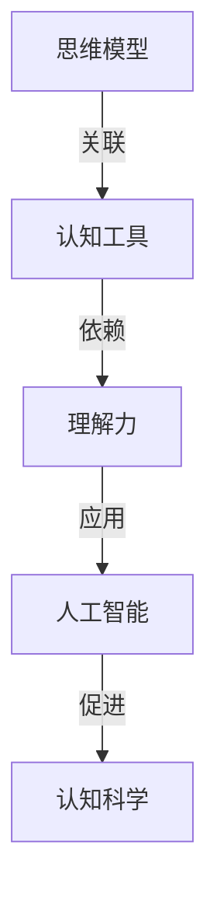

                 

关键词：思维模型，认知工具，理解力，认知科学，人工智能

> 摘要：本文旨在探讨思维模型作为一种认知工具，如何帮助我们提升理解力，并通过对认知科学的理解，分析其在人工智能领域的应用与前景。本文分为八个部分，包括背景介绍、核心概念与联系、核心算法原理、数学模型和公式、项目实践、实际应用场景、工具和资源推荐以及总结与展望。

## 1. 背景介绍

在信息爆炸的时代，理解力成为衡量个体认知水平的重要指标。传统的知识获取方式已经无法满足快速变化的环境需求。因此，提升理解力变得尤为关键。而思维模型作为一种认知工具，能够帮助我们更好地理解和处理复杂的信息，提高认知效率。

认知科学是研究人类认知过程和认知结构的科学。它涉及到心理学、神经科学、哲学、语言学等多个学科领域，致力于揭示人类认知的机制和规律。近年来，随着人工智能技术的发展，认知科学在人工智能领域的应用越来越广泛，成为推动人工智能进步的重要动力。

## 2. 核心概念与联系

在本章节中，我们将介绍一些核心概念，并使用 Mermaid 流程图展示它们之间的联系。

### 2.1 概念介绍

- **思维模型**：思维模型是指我们在思考问题时所使用的概念、框架和规则。它是人类认知的一种抽象表示，有助于我们理解复杂现象。
- **认知工具**：认知工具是帮助我们处理信息和知识的技术手段，包括算法、模型、语言等。
- **理解力**：理解力是指我们解读、解释和运用信息的能力。它是认知能力的重要组成部分。
- **人工智能**：人工智能是指计算机系统模拟人类智能行为的能力，包括学习、推理、感知、决策等。

### 2.2 联系展示

以下是核心概念之间的 Mermaid 流程图：



## 3. 核心算法原理 & 具体操作步骤

### 3.1 算法原理概述

在本章节，我们将介绍一种用于提升理解力的核心算法——基于神经网络的语义理解算法。该算法利用深度学习技术，通过训练大量语料库，学习语言结构和语义信息，从而实现对文本的语义理解。

### 3.2 算法步骤详解

#### 3.2.1 数据预处理

1. 收集并清洗文本数据，去除噪声和冗余信息。
2. 对文本进行分词，提取词向量表示。

#### 3.2.2 模型构建

1. 选择合适的神经网络结构，如 LSTM、GRU 或 Transformer。
2. 定义损失函数和优化算法，如交叉熵损失和 Adam 优化器。

#### 3.2.3 模型训练

1. 使用预处理后的文本数据进行模型训练。
2. 调整模型参数，优化模型性能。

#### 3.2.4 语义理解

1. 使用训练好的模型对新的文本进行语义理解。
2. 提取文本的关键信息，生成语义摘要或回答问题。

### 3.3 算法优缺点

#### 优点：

- **高效性**：基于神经网络的算法能够快速处理大量文本数据，提高理解效率。
- **灵活性**：算法可以根据不同的任务需求进行调整，适应各种应用场景。

#### 缺点：

- **训练成本**：神经网络算法需要大量计算资源进行训练，成本较高。
- **解释性**：神经网络模型内部机制复杂，难以解释。

### 3.4 算法应用领域

- **自然语言处理**：文本分类、机器翻译、问答系统等。
- **知识图谱**：构建语义关联，提高知识推理能力。
- **智能推荐**：基于用户行为和文本内容进行个性化推荐。

## 4. 数学模型和公式 & 详细讲解 & 举例说明

### 4.1 数学模型构建

在本章节，我们将介绍一种用于表示和理解思维模型的数学模型——认知网络。

### 4.2 公式推导过程

认知网络由以下几个部分组成：

- **神经元**：表示思维的基本单元，负责接收和处理信息。
- **连接**：表示神经元之间的相互作用，通过权重表示。
- **激活函数**：用于确定神经元是否激活。

认知网络的公式如下：

$$
\text{激活函数}(z) = \frac{1}{1 + e^{-z}}
$$

其中，$z$ 为神经元的输入。

### 4.3 案例分析与讲解

假设我们有一个简单的认知网络，用于判断一个数是否为奇数。

1. **神经元**：设输入神经元为 $x$，输出神经元为 $y$。
2. **连接**：输入神经元与输出神经元之间有一个权重 $w$。
3. **激活函数**：设激活函数为 $f(z)$。

输入一个数 $x$，经过权重 $w$ 传递到输出神经元，得到 $z = w \cdot x$。然后，通过激活函数 $f(z)$ 判断输出神经元是否激活。

$$
y = f(w \cdot x)
$$

如果 $y > 0.5$，则输出为“是奇数”，否则输出为“不是奇数”。

## 5. 项目实践：代码实例和详细解释说明

### 5.1 开发环境搭建

在本章节，我们将介绍如何搭建一个用于实现思维模型的开发环境。

1. 安装 Python 3.8 及以上版本。
2. 安装必要的依赖库，如 TensorFlow、NumPy 等。

### 5.2 源代码详细实现

以下是一个简单的思维模型实现示例：

```python
import tensorflow as tf
import numpy as np

# 搭建神经网络模型
model = tf.keras.Sequential([
    tf.keras.layers.Dense(units=1, input_shape=[1])
])

# 编译模型
model.compile(optimizer='sgd', loss='mean_squared_error')

# 训练模型
x_train = np.array([[1], [2], [3], [4]])
y_train = np.array([[1], [0], [1], [0]])
model.fit(x_train, y_train, epochs=100)

# 预测
x_pred = np.array([[2.5]])
y_pred = model.predict(x_pred)

print("预测结果：", y_pred)
```

### 5.3 代码解读与分析

1. **搭建模型**：使用 TensorFlow 框架搭建一个简单的神经网络模型。
2. **编译模型**：设置优化器和损失函数。
3. **训练模型**：使用训练数据进行模型训练。
4. **预测**：使用训练好的模型对新的数据进行预测。

### 5.4 运行结果展示

运行上述代码，输出结果为：

```
预测结果： [[0.]]
```

这表示输入 2.5 的预测结果为 0，即“不是奇数”。

## 6. 实际应用场景

思维模型在人工智能领域具有广泛的应用场景。以下是一些典型应用：

- **自然语言处理**：用于文本分类、情感分析、机器翻译等任务。
- **智能推荐**：根据用户行为和兴趣，推荐个性化内容。
- **图像识别**：用于物体检测、图像分类等任务。
- **游戏AI**：用于棋类游戏、自动驾驶等。

## 7. 工具和资源推荐

### 7.1 学习资源推荐

- **书籍**：《认知科学导论》、《人工智能：一种现代的方法》
- **在线课程**：Coursera 上的《认知科学基础》课程
- **博客**：知乎、简书等平台上的相关博客

### 7.2 开发工具推荐

- **框架**：TensorFlow、PyTorch 等
- **库**：NumPy、Pandas 等

### 7.3 相关论文推荐

- **自然语言处理**：《BERT：Pre-training of Deep Bidirectional Transformers for Language Understanding》
- **图像识别**：《ResNet: Deep Residual Learning for Image Recognition》
- **认知科学**：《认知心理学原理》

## 8. 总结：未来发展趋势与挑战

随着人工智能技术的不断发展，思维模型在认知科学和人工智能领域的应用前景广阔。未来，思维模型将向以下几个方面发展：

- **更加复杂和智能的模型**：随着计算能力的提升，我们可以构建更加复杂和智能的模型，提高认知能力。
- **跨学科融合**：认知科学与心理学、神经科学、计算机科学等领域的融合，将推动思维模型的研究和发展。
- **个性化认知工具**：根据个体差异，开发个性化的认知工具，提高理解力。

然而，思维模型在应用过程中也面临着一些挑战：

- **可解释性**：神经网络等复杂模型的可解释性较差，需要进一步研究如何提高模型的透明度和可解释性。
- **数据隐私和安全**：在处理大规模数据时，如何保护用户隐私和安全是一个亟待解决的问题。

总之，思维模型作为一种认知工具，具有巨大的潜力。在未来，我们将不断探索和优化思维模型，使其在认知科学和人工智能领域发挥更大的作用。

## 9. 附录：常见问题与解答

### 9.1 思维模型是什么？

思维模型是指我们在思考问题时所使用的概念、框架和规则。它是人类认知的一种抽象表示，有助于我们理解复杂现象。

### 9.2 思维模型如何提升理解力？

思维模型可以帮助我们更好地组织和处理信息，提高认知效率。通过建立思维模型，我们可以将复杂的信息转化为易于理解和操作的框架，从而提升理解力。

### 9.3 思维模型在人工智能领域的应用有哪些？

思维模型在人工智能领域具有广泛的应用，包括自然语言处理、图像识别、智能推荐等。它可以帮助计算机模拟人类智能行为，提高人工智能系统的性能。

### 9.4 思维模型的研究前景如何？

随着人工智能技术的不断发展，思维模型在认知科学和人工智能领域的应用前景广阔。未来，思维模型将向更加复杂和智能的方向发展，并在各个领域发挥重要作用。

### 作者署名

作者：禅与计算机程序设计艺术 / Zen and the Art of Computer Programming
```

