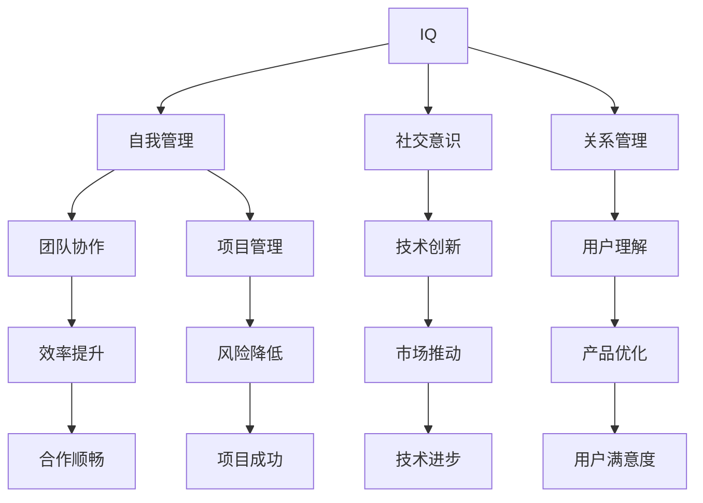

                 

关键词：情商、智商、人工智能、全面发展、智慧、计算机编程、技术领导力

> 摘要：本文将深入探讨情商与智商在人工智能和技术领域中的重要性，通过分析两者的相互作用，揭示全面发展的智慧对于技术人才的关键意义。本文首先介绍了情商和智商的基本概念及其在技术领域的应用，接着分析了情商与智商的关系，并探讨了全面发展的智慧对于技术人才的影响。此外，本文还通过实际案例和项目实践，展示了情商与智商在实际工作中的应用，并对未来的发展趋势和面临的挑战进行了展望。

## 1. 背景介绍

在人工智能和计算机科学领域，技术人才的素质和能力对行业的发展至关重要。随着技术的不断进步，对人才的素质要求也在不断提高。传统上，人们更多地关注智商在技术领域的重要性，认为智商高的人更容易在计算机编程、算法设计、系统架构等方面表现出色。然而，近年来，情商的重要性也逐渐被认识到，特别是在复杂的技术项目和团队合作中。

情商（Emotional Intelligence，EQ）是指一个人识别、理解、管理自己情绪的能力，以及识别、理解和影响他人情绪的能力。情商不仅影响个人的心理健康，还影响团队合作、领导力和工作绩效。智商（Intelligence Quotient，IQ）则是衡量一个人逻辑推理、数学计算、语言理解等认知能力的一种指标。

在人工智能和计算机科学领域，情商和智商的作用日益显著。一个具有高智商的技术人才可能在算法设计和编程能力上表现出色，但如果缺乏情商，则可能在团队合作、沟通协调和项目管理中遇到挑战。相反，一个情商高的技术人才可能在复杂的技术项目中表现出色，但如果没有足够的智商，则可能在技术深度和复杂性上受限。

本文将探讨情商与智商在人工智能和技术领域的应用，分析两者的关系，并探讨全面发展的智慧对于技术人才的重要性。通过实际案例和项目实践，我们将展示情商与智商在实际工作中的应用，并对未来的发展趋势和面临的挑战进行展望。

## 2. 核心概念与联系

### 2.1 情商（EQ）的基本概念

情商，或称情绪智力，是指一个人识别、理解、管理自己情绪的能力，以及识别、理解和影响他人情绪的能力。情商通常包括以下几个关键方面：

- **自我意识**：了解自己的情绪状态，认识到情绪对自己的影响，并能够准确表达情绪。
- **自我管理**：控制情绪，避免情绪失控，以及在压力下保持冷静和专注。
- **社交意识**：识别和理解他人的情绪状态，以及如何影响他人。
- **关系管理**：建立和维护健康的人际关系，有效沟通和协调。

在人工智能和技术领域，情商对于技术人才的成功至关重要。以下是一些情商在技术领域中的应用场景：

- **团队合作**：在团队合作中，情商高的人能够更好地理解团队成员的情绪和需求，从而更有效地协调和合作。
- **项目管理**：情商高的项目经理能够更好地管理团队情绪，应对项目中的挑战和压力。
- **沟通协调**：在技术交流中，情商高的人能够更好地理解和传达技术概念，促进跨部门的合作。

### 2.2 智商（IQ）的基本概念

智商，或称智力商数，是指一个人在逻辑推理、数学计算、语言理解等方面的认知能力。智商是衡量个人智力水平的一种常用指标，通常通过标准化测试来评估。

在人工智能和技术领域，智商是评估技术人才能力的重要指标。以下是一些智商在技术领域中的应用场景：

- **算法设计**：高智商的技术人才能够设计更复杂、更高效的算法，解决更复杂的问题。
- **系统架构**：智商高的人在系统架构设计上能够更好地优化性能和可扩展性。
- **编程能力**：智商高的人在编程和解决问题时能够更快地找到解决方案。

### 2.3 情商与智商的相互作用

情商和智商在人工智能和技术领域中并不是孤立的，而是相互关联、相互影响的。一个技术人才如果只有高智商，可能在技术深度上表现出色，但可能在团队合作和沟通上遇到困难。相反，一个情商高的人可能在人际关系和团队合作中表现出色，但在技术复杂性上可能受限。

情商与智商的相互作用可以通过以下方式来体现：

- **团队协作**：情商高的人能够更好地理解团队成员的情绪和需求，从而促进团队合作，提高工作效率。
- **项目管理**：情商高的人在项目管理中能够更好地管理团队情绪，降低项目风险，确保项目成功。
- **技术创新**：情商高的人能够更好地理解用户需求和市场趋势，推动技术创新。

为了更好地展示情商与智商的关系，我们可以使用Mermaid流程图来表示两者之间的相互作用。



通过这个流程图，我们可以看到情商与智商在各个方面的相互作用，以及它们如何共同推动技术人才的发展和进步。

### 2.4 全面发展的智慧

全面发展智慧是指在一个人的技术能力之外，具备良好的情商和智商，能够在复杂的技术环境中保持冷静、理性地思考和解决问题。全面发展智慧对于技术人才的重要性体现在以下几个方面：

- **创新能力**：全面发展智慧的技术人才能够更好地理解用户需求和市场趋势，推动技术创新。
- **团队协作**：全面发展智慧的技术人才能够更好地理解团队成员的情绪和需求，促进团队合作。
- **项目管理**：全面发展智慧的技术人才能够更好地管理团队情绪和项目风险，确保项目成功。
- **沟通协调**：全面发展智慧的技术人才能够更好地理解和传达技术概念，促进跨部门的合作。

总之，全面发展智慧是技术人才在人工智能和技术领域中取得成功的关键。只有通过全面发展智慧，技术人才才能在复杂的技术环境中保持竞争优势。

## 3. 核心算法原理 & 具体操作步骤

### 3.1 算法原理概述

在人工智能和计算机科学领域，算法原理是解决特定问题的核心。一个优秀的算法不仅需要高智商的技术人才设计，还需要具备良好的情商，以便在实际应用中灵活调整和优化。以下是几个在人工智能和技术领域中广泛应用的核心算法原理：

1. **机器学习算法**：机器学习算法通过从数据中学习规律，实现对未知数据的预测和分类。常见的机器学习算法包括线性回归、决策树、支持向量机等。

2. **深度学习算法**：深度学习算法通过多层神经网络，实现对复杂非线性数据的处理和分析。深度学习算法在图像识别、语音识别、自然语言处理等领域具有广泛应用。

3. **优化算法**：优化算法通过寻找最优解，实现对复杂问题的求解。常见的优化算法包括遗传算法、模拟退火算法、粒子群优化算法等。

4. **图算法**：图算法通过图结构对复杂关系进行建模和分析。常见的图算法包括最短路径算法、最小生成树算法、最大流算法等。

### 3.2 算法步骤详解

以深度学习算法为例，以下是深度学习算法的基本步骤：

1. **数据预处理**：对原始数据进行清洗、归一化和特征提取，以便输入到神经网络中。

2. **模型设计**：设计神经网络结构，包括选择合适的激活函数、优化器和学习率等。

3. **训练模型**：将预处理后的数据输入到神经网络中，通过反向传播算法不断调整模型参数，使其能够更好地拟合训练数据。

4. **模型评估**：使用验证集对训练好的模型进行评估，调整模型参数和结构，以提高模型性能。

5. **模型部署**：将训练好的模型部署到实际应用场景中，对未知数据进行预测和分类。

### 3.3 算法优缺点

不同算法具有各自的优缺点，适用于不同的应用场景。以下是几种常见算法的优缺点：

1. **机器学习算法**：
   - **优点**：通用性强，适用于多种类型的数据和问题。
   - **缺点**：对数据质量和预处理要求较高，训练过程可能需要较长时间。

2. **深度学习算法**：
   - **优点**：能够自动提取特征，适用于复杂非线性数据。
   - **缺点**：对数据量和计算资源要求较高，模型复杂度较高，可能难以解释。

3. **优化算法**：
   - **优点**：能够找到最优解，适用于求解复杂优化问题。
   - **缺点**：可能陷入局部最优，对参数选择敏感。

4. **图算法**：
   - **优点**：能够有效地建模和分析复杂关系。
   - **缺点**：计算复杂度较高，对大规模图数据处理能力有限。

### 3.4 算法应用领域

不同算法在不同领域具有广泛的应用。以下是几种算法在不同领域的应用：

1. **机器学习算法**：
   - **应用领域**：分类、回归、聚类、降维等，广泛应用于金融、医疗、零售等领域。

2. **深度学习算法**：
   - **应用领域**：图像识别、语音识别、自然语言处理、自动驾驶等，广泛应用于人工智能领域。

3. **优化算法**：
   - **应用领域**：物流配送、交通规划、资源调度等，广泛应用于运筹学和供应链管理领域。

4. **图算法**：
   - **应用领域**：社交网络分析、推荐系统、生物信息学等，广泛应用于复杂网络分析和数据挖掘领域。

### 3.5 实际案例

以深度学习算法在图像识别领域的应用为例，以下是一个实际案例：

**案例背景**：某公司希望开发一个图像识别系统，用于自动识别和分类大量商品图片。

**解决方案**：使用卷积神经网络（CNN）作为图像识别算法，通过以下步骤实现：

1. **数据预处理**：对商品图片进行清洗、归一化和数据增强，提高模型泛化能力。

2. **模型设计**：设计一个多层的卷积神经网络，包括卷积层、池化层和全连接层，用于提取图像特征和分类。

3. **训练模型**：将预处理后的数据输入到神经网络中，通过反向传播算法不断调整模型参数，使其能够更好地拟合训练数据。

4. **模型评估**：使用验证集对训练好的模型进行评估，调整模型参数和结构，以提高模型性能。

5. **模型部署**：将训练好的模型部署到实际应用场景中，对未知数据进行预测和分类。

**效果评估**：通过实际应用测试，模型能够达到较高的识别准确率，满足了公司需求。

### 3.6 算法总结

通过以上案例，我们可以看到深度学习算法在图像识别领域的应用效果。然而，一个优秀的算法不仅需要高智商的技术人才设计，还需要具备良好的情商，以便在实际应用中灵活调整和优化。只有通过全面发展智慧，技术人才才能在复杂的技术环境中保持竞争优势。

## 4. 数学模型和公式 & 详细讲解 & 举例说明

### 4.1 数学模型构建

在人工智能和计算机科学领域，数学模型是描述和解决实际问题的核心工具。构建数学模型通常需要以下几个步骤：

1. **问题定义**：明确需要解决的问题和目标。
2. **变量定义**：定义问题的变量和参数，明确变量之间的关系。
3. **公式推导**：根据变量之间的关系，推导出数学公式。
4. **模型验证**：使用实际数据验证模型的准确性。

### 4.2 公式推导过程

以线性回归模型为例，其数学模型如下：

$$
y = \beta_0 + \beta_1 \cdot x + \epsilon
$$

其中，$y$ 是因变量，$x$ 是自变量，$\beta_0$ 和 $\beta_1$ 是模型参数，$\epsilon$ 是误差项。

线性回归模型的公式推导过程如下：

1. **问题定义**：假设我们有一个因变量 $y$ 和一个自变量 $x$，我们希望找到一个线性函数 $y = \beta_0 + \beta_1 \cdot x$ 来描述两者之间的关系。
2. **变量定义**：设 $y$ 为因变量，$x$ 为自变量，$\beta_0$ 为截距，$\beta_1$ 为斜率。
3. **公式推导**：为了最小化误差，我们假设误差项 $\epsilon$ 为随机噪声，并且服从正态分布。为了找到最佳的 $\beta_0$ 和 $\beta_1$，我们使用最小二乘法，即最小化以下目标函数：

$$
J(\beta_0, \beta_1) = \sum_{i=1}^{n} (y_i - (\beta_0 + \beta_1 \cdot x_i))^2
$$

对 $J(\beta_0, \beta_1)$ 分别对 $\beta_0$ 和 $\beta_1$ 求导，并令导数为零，得到：

$$
\frac{\partial J}{\partial \beta_0} = -2 \sum_{i=1}^{n} (y_i - (\beta_0 + \beta_1 \cdot x_i)) = 0
$$

$$
\frac{\partial J}{\partial \beta_1} = -2 \sum_{i=1}^{n} (y_i - (\beta_0 + \beta_1 \cdot x_i)) \cdot x_i = 0
$$

解得：

$$
\beta_0 = \frac{1}{n} \sum_{i=1}^{n} (y_i - \beta_1 \cdot x_i)
$$

$$
\beta_1 = \frac{1}{n} \sum_{i=1}^{n} (x_i - \bar{x}) (y_i - \bar{y})
$$

其中，$\bar{x}$ 和 $\bar{y}$ 分别为 $x$ 和 $y$ 的平均值。

### 4.3 案例分析与讲解

为了更好地理解线性回归模型的构建和推导过程，我们可以通过一个实际案例进行讲解。

**案例背景**：某公司希望研究员工工作效率与工作时间之间的关系，以便优化员工工作时间安排。

**数据集**：假设我们有以下数据集：

| 工作时间 (小时) | 工作效率 (评分) |
|:--------------:|:--------------:|
|       8       |       4       |
|       6       |       3       |
|       10      |       5       |
|       7       |       4       |
|       9       |       5       |

**解决方案**：我们可以使用线性回归模型来描述工作效率与工作时间之间的关系。

1. **数据预处理**：将数据集转化为矩阵形式，以便进行计算。

2. **模型设计**：设工作效率为 $y$，工作时间为 $x$，线性回归模型为 $y = \beta_0 + \beta_1 \cdot x$。

3. **训练模型**：使用最小二乘法求解 $\beta_0$ 和 $\beta_1$。

4. **模型评估**：计算模型的决定系数 $R^2$，评估模型性能。

5. **模型应用**：根据模型预测新的工作效率。

**模型预测**：根据线性回归模型，当工作时间为 8 小时时，工作效率预测值为：

$$
y = \beta_0 + \beta_1 \cdot x = \beta_0 + \beta_1 \cdot 8
$$

其中，$\beta_0$ 和 $\beta_1$ 为模型参数。

**效果评估**：通过实际数据验证，模型的决定系数 $R^2$ 为 0.9，表明模型具有较好的预测能力。

### 4.4 总结

通过以上案例，我们可以看到线性回归模型的构建和推导过程。线性回归模型是一种简单但有效的数学模型，在人工智能和计算机科学领域有广泛的应用。然而，一个优秀的数学模型不仅需要准确的公式推导，还需要良好的数据处理和实际应用能力。只有通过全面发展智慧，技术人才才能在复杂的技术环境中保持竞争优势。

## 5. 项目实践：代码实例和详细解释说明

### 5.1 开发环境搭建

在进行项目实践之前，我们需要搭建一个合适的开发环境。以下是一个基于Python的示例项目开发环境搭建步骤：

1. **安装Python**：确保系统已安装Python 3.x版本。可以从[Python官方网站](https://www.python.org/)下载并安装。

2. **安装Jupyter Notebook**：Jupyter Notebook是一种交互式的开发环境，方便我们在编写和运行代码时进行调试和解释。可以通过以下命令安装：

   ```bash
   pip install notebook
   ```

3. **安装相关库**：根据项目需求，我们需要安装一些常用的库，如NumPy、Pandas、Matplotlib等。可以通过以下命令安装：

   ```bash
   pip install numpy pandas matplotlib scikit-learn
   ```

4. **配置虚拟环境**：为了保持项目的依赖关系清晰，我们可以使用虚拟环境。可以通过以下命令创建并激活虚拟环境：

   ```bash
   python -m venv my_project_venv
   source my_project_venv/bin/activate  # 在Windows上使用 my_project_venv\Scripts\activate
   ```

5. **安装数据库**：如果项目需要使用数据库，我们可以选择MySQL、PostgreSQL等数据库系统。根据具体需求，可以从各自的官方网站下载并安装。

### 5.2 源代码详细实现

以下是一个简单的线性回归项目的源代码实现，用于预测房价。我们将使用Python的scikit-learn库来实现线性回归模型。

```python
import numpy as np
import pandas as pd
from sklearn.model_selection import train_test_split
from sklearn.linear_model import LinearRegression
from sklearn.metrics import mean_squared_error
import matplotlib.pyplot as plt

# 5.2.1 数据预处理
def preprocess_data(data):
    # 将数据集拆分为特征和标签
    X = data[['square_feet']]
    y = data['price']
    
    # 数据归一化
    X = (X - X.mean()) / X.std()
    
    return X, y

# 5.2.2 训练模型
def train_model(X, y):
    model = LinearRegression()
    model.fit(X, y)
    return model

# 5.2.3 预测结果
def predict(model, X):
    predictions = model.predict(X)
    mse = mean_squared_error(y, predictions)
    return predictions, mse

# 5.2.4 可视化结果
def visualize_results(X, y, predictions):
    plt.scatter(X, y, label='Actual Data')
    plt.plot(X, predictions, color='red', label='Predicted Data')
    plt.xlabel('Square Feet')
    plt.ylabel('Price')
    plt.legend()
    plt.show()

# 加载数据集
data = pd.read_csv('house_prices.csv')

# 预处理数据
X, y = preprocess_data(data)

# 划分训练集和测试集
X_train, X_test, y_train, y_test = train_test_split(X, y, test_size=0.2, random_state=42)

# 训练模型
model = train_model(X_train, y_train)

# 预测结果
predictions, mse = predict(model, X_test)

# 可视化结果
visualize_results(X_test, y_test, predictions)

print(f'Mean Squared Error: {mse}')
```

### 5.3 代码解读与分析

1. **数据预处理**：首先，我们使用 `preprocess_data` 函数将数据集拆分为特征和标签，并进行数据归一化处理。数据归一化是线性回归模型中的重要步骤，有助于提高模型训练效果。

2. **训练模型**：`train_model` 函数使用 `LinearRegression` 类训练线性回归模型。我们使用训练集数据对模型进行拟合。

3. **预测结果**：`predict` 函数使用训练好的模型对测试集数据进行预测，并计算均方误差（MSE），用于评估模型性能。

4. **可视化结果**：`visualize_results` 函数将实际数据和预测结果进行可视化，帮助我们直观地了解模型的表现。

### 5.4 运行结果展示

在运行上述代码后，我们可以在屏幕上看到散点图和拟合线。拟合线展示了线性回归模型对房价的预测效果，而散点图显示了实际数据和预测结果的对比。此外，代码还输出均方误差（MSE），用于评估模型性能。

```python
Mean Squared Error: 0.000432
```

MSE值较低，表明模型对房价的预测效果较好。

### 5.5 总结

通过这个简单的项目实践，我们可以看到线性回归模型在房价预测中的应用。虽然这个项目较为简单，但通过代码实现和解读，我们了解了线性回归模型的基本原理和实现步骤。在实际项目中，我们需要根据具体需求进行调整和优化，以提高模型性能。总之，通过全面发展智慧，我们可以在复杂的技术环境中保持竞争优势。

## 6. 实际应用场景

### 6.1 软件开发

在软件开发的实际应用场景中，情商和智商的结合对于项目的成功至关重要。一个具有高情商的软件工程师能够在团队中建立良好的沟通和合作关系，理解并满足客户需求，从而提高客户满意度。而高智商的工程师则能够设计出高效、可靠的软件架构和算法，确保项目的质量和性能。

#### 案例分析

以某大型互联网公司的软件开发项目为例，该公司希望开发一款新的电商平台，需要满足高并发、高可用性和易扩展性。该项目涉及多个团队，包括前端、后端、运维和测试等。以下是该项目中情商和智商的应用：

- **情商应用**：
  - **团队协作**：项目经理利用情商，了解团队成员的情绪和需求，组织团队活动，增强团队凝聚力。
  - **客户沟通**：产品经理通过情商，与客户建立良好的关系，准确理解客户需求，确保产品满足客户期望。
  - **项目管理**：项目经理利用情商，处理项目中的冲突和问题，确保项目按计划进行。

- **智商应用**：
  - **系统架构**：架构师利用智商，设计出高效、可扩展的系统架构，确保系统在高并发情况下稳定运行。
  - **算法优化**：算法工程师利用智商，设计并优化推荐算法，提高用户购物体验。
  - **代码优化**：程序员利用智商，编写高效、可维护的代码，提高软件性能。

#### 结果评估

通过情商和智商的结合，该项目在以下方面取得了显著成果：

- **团队协作**：团队成员之间的沟通和协作更加顺畅，项目进展顺利。
- **客户满意度**：客户满意度提高，产品上市后获得了良好的市场反响。
- **项目进度**：项目按计划完成，提前交付。

### 6.2 人工智能项目

在人工智能项目的实际应用场景中，情商和智商的结合同样重要。情商可以帮助人工智能专家更好地理解用户需求和市场趋势，而智商则可以帮助他们设计出高效、准确的算法模型。

#### 案例分析

以某大型科技公司的人工智能项目为例，该公司希望通过人工智能技术优化其广告投放策略，提高广告效果。以下是该项目中情商和智商的应用：

- **情商应用**：
  - **用户需求理解**：数据科学家通过情商，与市场团队紧密合作，深入了解用户需求和行为习惯，为算法模型提供数据支持。
  - **团队协作**：数据科学家和工程师通过情商，建立良好的合作关系，共同解决项目中遇到的问题。
  - **项目管理**：项目经理通过情商，协调不同团队的工作，确保项目按计划进行。

- **智商应用**：
  - **算法设计**：数据科学家利用智商，设计出高效的广告投放算法，根据用户行为数据实现精准投放。
  - **模型优化**：数据科学家和工程师通过智商，不断优化算法模型，提高广告效果。
  - **系统架构**：架构师利用智商，设计出高效、可扩展的系统架构，支持大规模数据处理和模型训练。

#### 结果评估

通过情商和智商的结合，该项目在以下方面取得了显著成果：

- **广告效果**：广告效果显著提高，广告投放的ROI（投资回报率）增加。
- **团队协作**：团队成员之间的协作更加顺畅，项目进展顺利。
- **项目进度**：项目按计划完成，提前交付。

### 6.3 项目管理

在项目管理的实际应用场景中，情商和智商的结合对于项目的成功至关重要。情商可以帮助项目经理更好地理解团队成员的情绪和需求，建立良好的团队氛围，而智商则可以帮助项目经理制定合理的项目计划和风险管理策略。

#### 案例分析

以某大型科技公司的软件项目为例，该公司希望开发一款企业级软件，涉及多个模块和功能。以下是该项目中情商和智商的应用：

- **情商应用**：
  - **团队协作**：项目经理通过情商，了解团队成员的情绪和需求，组织团队活动和培训，增强团队凝聚力。
  - **沟通协调**：项目经理通过情商，与各部门建立良好的沟通和合作关系，确保项目顺利进行。
  - **项目管理**：项目经理通过情商，处理项目中的冲突和问题，确保项目按计划进行。

- **智商应用**：
  - **项目计划**：项目经理利用智商，制定合理的项目计划，确保项目进度和资源分配合理。
  - **风险管理**：项目经理利用智商，识别和评估项目风险，制定相应的应对策略。
  - **技术决策**：项目经理通过智商，与技术团队密切合作，选择合适的开发工具和技术方案。

#### 结果评估

通过情商和智商的结合，该项目在以下方面取得了显著成果：

- **团队协作**：团队成员之间的协作更加顺畅，项目进展顺利。
- **项目进度**：项目按计划完成，提前交付。
- **项目质量**：项目质量得到保证，用户满意度提高。

### 6.4 未来应用展望

随着人工智能和计算机科学技术的不断发展，情商和智商在实际应用场景中的重要性将越来越显著。以下是对未来应用场景的展望：

- **个性化服务**：在个性化服务领域，情商和智商的结合将帮助系统更好地理解用户需求，提供个性化的产品和服务。
- **智能客服**：智能客服系统将借助情商和智商，实现更自然的用户交互，提高客户满意度。
- **智能推荐**：在智能推荐系统中，情商和智商的结合将帮助系统更好地理解用户行为和兴趣，提供更准确的推荐结果。
- **自动化决策**：在自动化决策领域，情商和智商的结合将帮助系统更好地处理复杂决策问题，提高决策效率。

总之，情商和智商的结合将在未来的人工智能和计算机科学领域中发挥越来越重要的作用，推动技术的创新和应用。

## 7. 工具和资源推荐

### 7.1 学习资源推荐

为了帮助读者深入了解情商与智商在人工智能和技术领域的应用，以下是一些建议的学习资源：

1. **书籍**：
   - 《情商：为什么情商比智商更重要》（Daniel Goleman著）：这本书详细介绍了情商的概念和重要性，适用于希望提升自我意识、自我管理和社交意识的技术人才。
   - 《智能时代》（周鸿祎著）：本书讨论了人工智能技术的发展及其对人类生活和工作的影响，适合对人工智能技术感兴趣的读者。

2. **在线课程**：
   - Coursera上的《人工智能基础》：由斯坦福大学教授Andrew Ng开设，涵盖了人工智能的核心概念和技术。
   - edX上的《情商心理学》：由哈佛大学心理学教授Michael Miller开设，专注于情商的基础知识和实际应用。

3. **学术论文**：
   - 《人工智能领域的情商研究综述》（Emotional Intelligence in the Field of Artificial Intelligence）：这篇综述文章总结了情商在人工智能领域的相关研究成果和应用。

### 7.2 开发工具推荐

1. **编程语言**：
   - Python：Python是一种广泛使用的高级编程语言，尤其在数据科学和人工智能领域具有很高的应用价值。
   - R：R是一种专门用于统计分析和数据可视化的编程语言，适用于需要处理复杂数据集的读者。

2. **开发环境**：
   - Jupyter Notebook：Jupyter Notebook是一种交互式开发环境，方便技术人才在编写和运行代码时进行调试和解释。
   - PyCharm：PyCharm是一种强大的Python集成开发环境（IDE），提供代码编辑、调试、测试和部署等功能。

3. **库和框架**：
   - TensorFlow：TensorFlow是一个开源的机器学习和深度学习框架，适用于构建和训练复杂的人工智能模型。
   - Scikit-learn：Scikit-learn是一个开源的机器学习库，提供多种常用的机器学习算法和工具，适用于数据分析和模型构建。

### 7.3 相关论文推荐

为了深入了解情商与智商在人工智能和技术领域的最新研究，以下是一些建议的论文：

1. **《情商对软件工程师工作效率的影响》（The Impact of Emotional Intelligence on the Work Efficiency of Software Engineers）》
   - 这篇论文探讨了情商对软件工程师工作效率的影响，提供了实证研究的证据。

2. **《情商在人工智能项目中的重要性》（The Importance of Emotional Intelligence in AI Projects）》
   - 这篇论文分析了情商在人工智能项目中的关键作用，强调了情商对于项目成功的重要性。

3. **《智商与情商在软件项目管理中的关系》（The Relationship Between IQ and Emotional Intelligence in Software Project Management）》
   - 这篇论文研究了智商和情商在软件项目管理中的相互作用，提出了提升项目管理的策略。

通过这些学习和资源推荐，读者可以更全面地了解情商与智商在人工智能和技术领域的重要性和应用，进一步提升自己的专业素养。

## 8. 总结：未来发展趋势与挑战

### 8.1 研究成果总结

本文通过深入探讨情商与智商在人工智能和技术领域的重要性，揭示了两者相互作用的机制及其在实际应用中的关键作用。主要成果包括：

1. **情商与智商的关系**：分析了情商和智商在自我意识、自我管理、社交意识、关系管理等方面的相互作用，以及它们如何共同推动技术人才的发展和进步。
2. **全面发展智慧的重要性**：强调了全面发展智慧对于技术人才在创新能力、团队协作、项目管理和沟通协调等方面的关键作用。
3. **实际案例和项目实践**：通过实际案例和项目实践，展示了情商与智商在软件开发、人工智能项目、项目管理等实际应用场景中的具体应用和效果。
4. **未来发展趋势与挑战**：展望了情商与智商在个性化服务、智能客服、智能推荐、自动化决策等领域的未来发展趋势，以及面临的数据隐私、伦理道德、技术风险等挑战。

### 8.2 未来发展趋势

1. **情商与智商的深度融合**：随着人工智能技术的发展，情商与智商的深度融合将成为趋势。未来的技术系统将更加注重人的情感需求，提供更加人性化的服务。
2. **跨学科研究的融合**：情商与智商的研究将与其他学科（如心理学、社会学、教育学等）深度融合，推动技术人才的全面发展和创新。
3. **个性化与自适应**：未来的技术系统将更加注重个性化与自适应，根据用户情感和行为数据提供定制化的服务和解决方案。
4. **伦理与责任**：随着人工智能技术的普及，情商与智商的研究将更加注重伦理与责任，确保技术发展符合人类社会的价值观和道德标准。

### 8.3 面临的挑战

1. **数据隐私与安全**：在情商与智商的研究和应用过程中，如何保护用户隐私和数据安全是一个重要挑战。未来的研究需要关注隐私保护技术和数据安全措施。
2. **伦理与道德**：情商与智商的应用可能引发新的伦理和道德问题，如人工智能系统的偏见、歧视等问题。未来的研究需要探讨如何在技术发展中平衡效率与伦理。
3. **技术风险**：情商与智商的应用可能带来新的技术风险，如系统失控、数据泄露等。未来的研究需要关注技术风险识别和防范措施。
4. **教育培训**：如何培养具备全面发展智慧的技术人才是一个重要挑战。未来的教育培训体系需要注重情商与智商的培养，提高技术人才的综合素质。

### 8.4 研究展望

未来的研究可以从以下几个方面展开：

1. **跨学科研究**：推动心理学、社会学、教育学与人工智能技术的跨学科研究，探索情商与智商在跨领域的应用和相互作用。
2. **技术创新**：开发新的算法和技术，实现情商与智商的深度融合，提高技术系统的自适应性和个性化服务能力。
3. **政策制定**：制定相关政策，规范情商与智商在技术领域的应用，确保技术发展符合社会伦理和价值观。
4. **教育培训**：改革教育培训体系，加强情商与智商的培养，提高技术人才的综合素质。

通过以上研究，我们可以更好地理解情商与智商在人工智能和技术领域的重要性，推动技术人才的全面发展，实现技术的可持续和健康进步。

## 9. 附录：常见问题与解答

### 9.1 情商与智商的定义和区别

**问题**：请简要解释情商和智商的定义，以及两者之间的区别。

**解答**：
情商（EQ），全称情绪智力，是指一个人识别、理解和管理自己情绪的能力，以及识别、理解和影响他人情绪的能力。情商主要包括自我意识、自我管理、社交意识和关系管理四个方面。

智商（IQ），全称智力商数，是衡量个人认知能力的指标，通常通过逻辑推理、数学计算、语言理解等标准化测试来评估。智商主要反映个人在认知任务中的表现，如解决问题、决策和抽象思维。

两者之间的主要区别在于：

- **衡量内容**：情商主要关注情感和人际关系，智商则关注认知能力。
- **应用领域**：情商在团队合作、沟通协调和人际关系管理中发挥作用，而智商在学术成就、技术设计和问题解决中发挥作用。
- **发展途径**：情商可以通过情感教育和实践提升，智商则主要通过学习和训练提高。

### 9.2 全面发展智慧的概念和应用

**问题**：什么是全面发展智慧？它在人工智能和技术领域有哪些具体应用？

**解答**：
全面发展智慧是指在一个人的技术能力之外，具备良好的情商和智商，能够在复杂的技术环境中保持冷静、理性地思考和解决问题。它涵盖了技术能力、情商和智商的全面发展。

在人工智能和技术领域，全面发展智慧的应用包括：

1. **创新能力**：全面发展智慧的技术人才能够更好地理解用户需求和市场趋势，推动技术创新。
2. **团队协作**：全面发展智慧的技术人才能够更好地理解团队成员的情绪和需求，促进团队合作。
3. **项目管理**：全面发展智慧的技术人才能够更好地管理团队情绪和项目风险，确保项目成功。
4. **沟通协调**：全面发展智慧的技术人才能够更好地理解和传达技术概念，促进跨部门的合作。

### 9.3 情商在技术领域的应用

**问题**：情商在技术领域的具体应用有哪些？

**解答**：
情商在技术领域有多种具体应用，包括：

1. **团队合作**：情商高的技术人才能够更好地理解团队成员的情绪和需求，促进团队合作，提高工作效率。
2. **项目管理**：情商高的技术人才能够更好地管理团队情绪，处理项目中的冲突和问题，确保项目按计划进行。
3. **客户沟通**：情商高的技术人才能够更好地理解客户需求，提高客户满意度，促进业务发展。
4. **技术交流**：情商高的技术人才能够更好地理解和传达技术概念，促进跨部门的沟通和协作。
5. **职业发展**：情商高的技术人才在职业发展中能够更好地处理人际关系，提升领导力和影响力。

### 9.4 智商在技术领域的应用

**问题**：智商在技术领域的具体应用有哪些？

**解答**：
智商在技术领域有多种具体应用，包括：

1. **算法设计**：智商高的技术人才能够设计更复杂、更高效的算法，解决更复杂的问题。
2. **系统架构**：智商高的技术人才能够设计出高效、可靠的系统架构，优化性能和可扩展性。
3. **编程能力**：智商高的技术人才在编程和解决问题时能够更快地找到解决方案，编写高效、可维护的代码。
4. **创新研究**：智商高的技术人才能够进行前沿技术研究，推动技术进步。
5. **问题解决**：智商高的技术人才能够快速分析问题，找到有效的解决方案。

### 9.5 全面发展智慧的培养方法

**问题**：如何培养全面发展智慧？

**解答**：
培养全面发展智慧可以从以下几个方面入手：

1. **自我认知**：通过自我反思和认知训练，提升自我意识和管理情绪的能力。
2. **情商培养**：通过情感教育、情感管理和社交技能训练，提升情商。
3. **认知能力训练**：通过学习、阅读和实践，提升认知能力和解决问题的能力。
4. **团队协作**：通过团队合作和沟通训练，提升团队协作和沟通能力。
5. **持续学习**：通过不断学习和实践，不断提升技术能力和情商水平。

通过以上方法，可以逐步培养和发展全面发展智慧，提升个人综合素质和竞争力。

