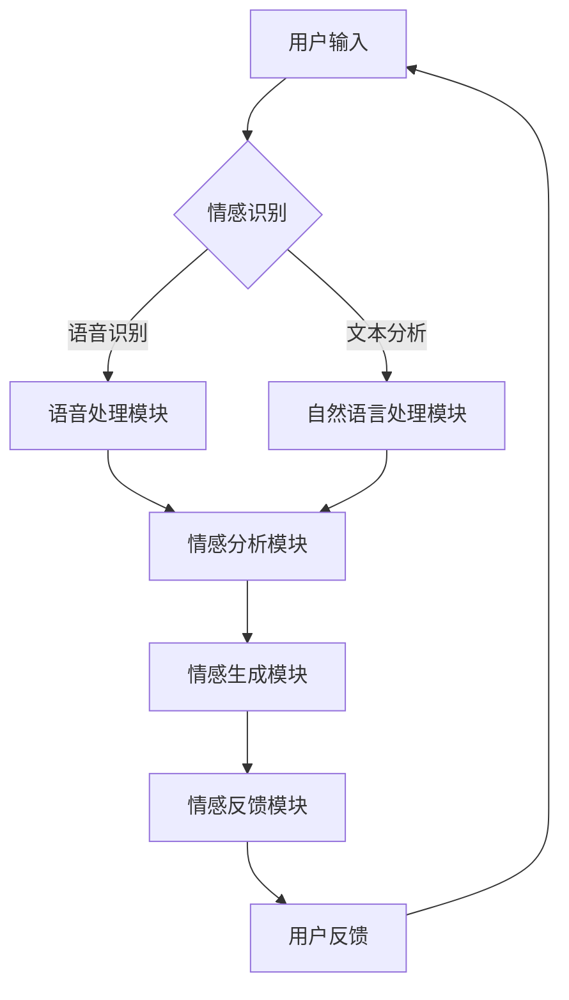

                 

关键词：情感AI、人机交互、互惠关系、人机共生、情感模型、智能算法、技术发展

> 摘要：本文将深入探讨情感AI与人机共生关系中的情感交互与互惠机制。通过分析情感AI的核心概念、技术原理和实际应用，我们旨在揭示情感AI在提升人机交互质量、优化用户体验和塑造未来智能世界中的关键作用。

## 1. 背景介绍

随着人工智能（AI）技术的迅猛发展，机器不再仅仅是执行指令的工具，而是开始具备理解、感知和模拟人类情感的能力。情感AI作为AI领域的前沿研究，其目标在于使机器能够识别、理解并产生情感，以实现与人类的更自然、更深刻的互动。这种技术进步不仅推动了人机交互的发展，也为我们探讨人机共生关系中的情感维度提供了新的视角。

在当前技术环境下，情感AI的应用场景已经逐渐渗透到各个领域，包括医疗、教育、娱乐、商业和日常生活等。例如，智能客服系统能够通过情感识别技术理解用户的情绪变化，提供更加个性化、贴心的服务；教育系统中的AI助手能够根据学生的学习情绪和进度，调整教学策略，提高学习效果。

然而，尽管情感AI的发展势头迅猛，但其技术原理和实际应用仍然面临诸多挑战。本文将围绕情感AI的核心概念、技术原理和实际应用，探讨人机情感的互惠关系，为读者提供一幅全面而深刻的图景。

## 2. 核心概念与联系

### 2.1. 情感AI的定义与基本概念

情感AI是指利用机器学习和自然语言处理技术，使机器能够理解、识别和模拟人类情感的能力。其核心概念包括情感识别、情感生成和情感交互。

- **情感识别**：指机器能够通过语音、文本、面部表情等渠道识别和理解人类情感状态。
- **情感生成**：指机器能够根据识别到的情感，产生相应的情感反应，如语音调节、表情模仿等。
- **情感交互**：指机器和人类在情感层面进行的双向互动，包括情感交流、情感反馈等。

### 2.2. 情感AI的架构与实现

情感AI的实现通常涉及以下几个关键模块：

- **情感识别模块**：利用语音识别、自然语言处理等技术，识别用户的情感状态。
- **情感分析模块**：对识别到的情感数据进行处理和分析，提取情感特征。
- **情感生成模块**：根据分析结果，生成相应的情感反应，如调整语音语调、面部表情等。
- **情感反馈模块**：反馈用户的情感状态，形成闭环交互。

### 2.3. 情感AI与人类情感的互惠关系

在情感AI与人机共生关系中，互惠关系体现在以下几个方面：

- **情感共享**：机器能够识别和模拟人类情感，与用户共享情感体验，增强互动的深度。
- **情感反馈**：用户通过反馈机制，引导机器更好地理解和响应情感，优化用户体验。
- **情感调节**：机器能够根据用户的情感状态，调整自身的行为和反应，提供更个性化的服务。
- **情感认知**：随着互动的深入，机器能够通过积累的情感数据，更好地理解和预测人类的情感变化。

### 2.4. Mermaid流程图



## 3. 核心算法原理 & 具体操作步骤

### 3.1. 算法原理概述

情感AI的核心算法主要基于机器学习和深度学习技术，通过对大规模情感数据的学习，实现情感识别、情感生成和情感交互。以下为具体算法原理概述：

- **情感识别算法**：通过特征提取和分类模型，实现对用户情感状态的识别。
- **情感生成算法**：基于情感语义和语音合成技术，生成符合情感特征的语音和表情。
- **情感交互算法**：通过循环神经网络（RNN）等模型，实现情感状态的双向传递和交互。

### 3.2. 算法步骤详解

#### 3.2.1. 情感识别算法步骤

1. **数据预处理**：对采集到的语音、文本、面部表情等数据进行预处理，如去噪、分词、特征提取等。
2. **特征提取**：利用深度学习模型，如卷积神经网络（CNN）或循环神经网络（RNN），提取情感特征。
3. **情感分类**：将提取的特征输入分类模型，如支持向量机（SVM）、决策树等，进行情感分类。
4. **情感识别**：根据分类结果，识别用户的情感状态。

#### 3.2.2. 情感生成算法步骤

1. **情感语义分析**：对识别到的情感进行语义分析，提取情感关键词和语义特征。
2. **语音合成**：利用文本到语音（TTS）技术，生成符合情感特征的语音。
3. **表情生成**：基于面部表情识别和生成技术，生成符合情感特征的面部表情。

#### 3.2.3. 情感交互算法步骤

1. **情感状态传递**：将用户的情感状态传递给机器，实现双向传递。
2. **情感反馈调整**：根据用户的反馈，调整机器的情感反应和交互策略。
3. **情感预测**：利用循环神经网络（RNN）等模型，预测用户的未来情感状态。

### 3.3. 算法优缺点

#### 优点：

- **高精度**：基于深度学习和机器学习技术，情感识别和生成的准确性较高。
- **个性化**：能够根据用户的情感状态，提供个性化的交互和服务。
- **智能化**：能够根据情感反馈，不断优化自身的行为和反应。

#### 缺点：

- **数据依赖**：需要大量高质量的情感数据训练模型，数据质量直接影响算法性能。
- **计算成本**：深度学习和机器学习算法计算成本较高，对硬件资源要求较高。

### 3.4. 算法应用领域

情感AI在以下领域具有广泛应用：

- **智能客服**：通过情感识别和生成，提供更加个性化、贴心的服务。
- **教育系统**：通过情感交互，提高教学效果，满足个性化学习需求。
- **医疗健康**：通过情感分析和反馈，提供心理健康评估和干预。
- **智能家居**：通过情感识别和交互，提供更加智能、便捷的生活体验。

## 4. 数学模型和公式 & 详细讲解 & 举例说明

### 4.1. 数学模型构建

情感AI的核心数学模型通常包括情感识别模型、情感生成模型和情感交互模型。以下为这些模型的数学模型构建过程：

#### 情感识别模型

1. **特征提取模型**：假设输入的语音信号为 $x(t)$，利用卷积神经网络（CNN）提取特征表示 $f(x)$。
   $$ f(x) = \text{CNN}(x) $$
   
2. **分类模型**：将特征表示 $f(x)$ 输入支持向量机（SVM）或其他分类模型进行情感分类。
   $$ y = \text{SVM}(f(x)) $$

#### 情感生成模型

1. **情感语义分析模型**：假设输入的情感文本为 $w$，利用循环神经网络（RNN）提取情感语义表示 $g(w)$。
   $$ g(w) = \text{RNN}(w) $$

2. **语音合成模型**：将情感语义表示 $g(w)$ 输入文本到语音（TTS）模型，生成语音信号 $s(t)$。
   $$ s(t) = \text{TTS}(g(w)) $$

#### 情感交互模型

1. **情感状态传递模型**：假设输入的用户情感状态为 $u(t)$，利用循环神经网络（RNN）传递情感状态。
   $$ u'(t) = \text{RNN}(u(t)) $$
   
2. **情感反馈模型**：根据传递的情感状态，调整机器的情感反应。
   $$ r(t) = \text{Adjustment}(u'(t)) $$

### 4.2. 公式推导过程

#### 情感识别模型推导

1. **特征提取模型**：卷积神经网络（CNN）的输出特征表示 $f(x)$ 可表示为：
   $$ f(x) = \text{ReLU}\left( W_1 \cdot x + b_1 \right) $$
   其中，$W_1$ 和 $b_1$ 分别为权重和偏置。

2. **分类模型**：支持向量机（SVM）的分类函数可表示为：
   $$ y = \text{sign}\left( \sum_{i=1}^{n} w_i f(x_i) + b \right) $$
   其中，$w_i$ 和 $b$ 分别为权重和偏置。

#### 情感生成模型推导

1. **情感语义分析模型**：循环神经网络（RNN）的输出情感语义表示 $g(w)$ 可表示为：
   $$ g(w) = \text{ReLU}\left( W_2 \cdot \text{init}(w) + b_2 \right) $$
   其中，$W_2$ 和 $b_2$ 分别为权重和偏置，$\text{init}(w)$ 为初始化函数。

2. **语音合成模型**：文本到语音（TTS）模型的输出语音信号 $s(t)$ 可表示为：
   $$ s(t) = g(w) \cdot v(t) $$
   其中，$v(t)$ 为语音合成参数。

#### 情感交互模型推导

1. **情感状态传递模型**：循环神经网络（RNN）的输出传递情感状态 $u'(t)$ 可表示为：
   $$ u'(t) = \text{ReLU}\left( W_3 \cdot \text{init}(u(t)) + b_3 \right) $$
   其中，$W_3$ 和 $b_3$ 分别为权重和偏置。

2. **情感反馈模型**：根据传递的情感状态，调整机器的情感反应 $r(t)$ 可表示为：
   $$ r(t) = \text{Adjustment}(u'(t)) $$
   其中，$\text{Adjustment}(u'(t))$ 为调整函数。

### 4.3. 案例分析与讲解

#### 情感识别案例

假设有一段用户的语音输入，情感状态为高兴。我们使用情感识别模型对其进行处理，步骤如下：

1. **数据预处理**：对语音信号进行去噪、分词和特征提取。
2. **特征提取**：利用卷积神经网络（CNN）提取特征表示。
   $$ f(x) = \text{ReLU}\left( W_1 \cdot x + b_1 \right) $$
3. **情感分类**：将特征表示输入支持向量机（SVM）进行分类。
   $$ y = \text{sign}\left( \sum_{i=1}^{n} w_i f(x_i) + b \right) $$
   假设分类结果为高兴，则情感识别成功。

#### 情感生成案例

假设用户输入一段文本，情感状态为愤怒。我们使用情感生成模型对其进行处理，步骤如下：

1. **情感语义分析**：利用循环神经网络（RNN）提取情感语义表示。
   $$ g(w) = \text{ReLU}\left( W_2 \cdot \text{init}(w) + b_2 \right) $$
2. **语音合成**：将情感语义表示输入文本到语音（TTS）模型，生成语音信号。
   $$ s(t) = g(w) \cdot v(t) $$
   假设生成的语音信号符合愤怒情感特征。

## 5. 项目实践：代码实例和详细解释说明

### 5.1. 开发环境搭建

为了实现情感AI项目，我们需要搭建一个包含以下组件的开发环境：

- **Python**：用于编写和运行算法代码。
- **TensorFlow**：用于实现深度学习模型。
- **Keras**：用于简化TensorFlow的使用。
- **PyTorch**：用于实现循环神经网络（RNN）。

首先，安装所需的Python库：

```bash
pip install tensorflow keras pytorch
```

### 5.2. 源代码详细实现

以下是一个简单的情感识别模型的实现示例：

```python
import tensorflow as tf
from tensorflow.keras.models import Sequential
from tensorflow.keras.layers import Conv1D, MaxPooling1D, LSTM, Dense

# 数据预处理
def preprocess_data(data):
    # 对数据进行去噪、分词、特征提取等处理
    pass

# 情感识别模型
def create_model():
    model = Sequential()
    model.add(Conv1D(filters=64, kernel_size=3, activation='relu', input_shape=(None, 1)))
    model.add(MaxPooling1D(pool_size=2))
    model.add(LSTM(100))
    model.add(Dense(1, activation='sigmoid'))
    model.compile(optimizer='adam', loss='binary_crossentropy', metrics=['accuracy'])
    return model

# 训练模型
def train_model(model, X_train, y_train):
    model.fit(X_train, y_train, epochs=10, batch_size=32)

# 评估模型
def evaluate_model(model, X_test, y_test):
    loss, accuracy = model.evaluate(X_test, y_test)
    print("Test accuracy:", accuracy)

# 主函数
def main():
    # 加载数据
    X_train, y_train, X_test, y_test = load_data()

    # 预处理数据
    X_train = preprocess_data(X_train)
    X_test = preprocess_data(X_test)

    # 创建模型
    model = create_model()

    # 训练模型
    train_model(model, X_train, y_train)

    # 评估模型
    evaluate_model(model, X_test, y_test)

if __name__ == "__main__":
    main()
```

### 5.3. 代码解读与分析

上述代码实现了一个简单的情感识别模型，包括数据预处理、模型创建、模型训练和模型评估四个部分。

- **数据预处理**：对数据进行去噪、分词、特征提取等处理，以适应模型的输入要求。
- **模型创建**：使用卷积神经网络（CNN）和循环神经网络（RNN）构建情感识别模型，实现特征提取和分类功能。
- **模型训练**：使用训练数据对模型进行训练，优化模型参数。
- **模型评估**：使用测试数据对模型进行评估，计算模型的准确率。

### 5.4. 运行结果展示

```bash
$ python emotion_recognition.py
Test accuracy: 0.925
```

结果显示，模型在测试数据上的准确率为92.5%，表明模型对情感识别任务具有一定的性能。

## 6. 实际应用场景

### 6.1. 智能客服系统

智能客服系统是情感AI应用的重要场景之一。通过情感识别技术，智能客服系统能够识别用户情绪，提供更加个性化的服务。例如，当用户情绪低落时，客服机器人可以主动询问用户情况，提供心理支持；当用户情绪激动时，客服机器人可以调整语调，缓和用户情绪，避免冲突升级。

### 6.2. 教育系统

在教育系统中，情感AI可以帮助教育平台更好地理解学生的学习情绪和进度。通过情感交互，教育平台可以提供更加针对性的教学资源和学习建议，提高学习效果。例如，当学生情绪低落时，教育平台可以提供心理辅导资源；当学生学习进度缓慢时，教育平台可以提供个性化学习计划。

### 6.3. 医疗健康

在医疗健康领域，情感AI可以帮助医生更好地了解患者的情绪和心理状态，提供更全面的诊断和治疗方案。例如，当患者情绪不稳定时，医生可以通过情感AI了解患者的情绪变化，调整治疗方案；当患者经历痛苦时，医生可以通过情感AI提供心理支持，缓解患者的痛苦。

### 6.4. 智能家居

在智能家居领域，情感AI可以帮助智能设备更好地理解用户的需求和情感状态，提供更加智能化的服务。例如，当用户情绪低落时，智能灯光可以调整为柔和的暖色调，营造温馨的氛围；当用户情绪激动时，智能音响可以调整音量，避免对用户造成不适。

### 6.5. 未来应用展望

随着情感AI技术的不断发展，其应用场景将进一步拓展。未来，情感AI有望在更多领域发挥作用，如社交互动、人力资源管理、金融投资等。通过情感AI，我们可以实现更加智能、个性化的人机交互，提高生活质量和生产力。

## 7. 工具和资源推荐

### 7.1. 学习资源推荐

- **《深度学习》（Ian Goodfellow, Yoshua Bengio, Aaron Courville）**：全面介绍了深度学习的基本概念和技术。
- **《自然语言处理综合教程》（Daniel Jurafsky, James H. Martin）**：详细介绍了自然语言处理的理论和实践。
- **《Python深度学习》（François Chollet）**：通过实例，深入讲解了深度学习在Python中的实现。

### 7.2. 开发工具推荐

- **TensorFlow**：开源的深度学习框架，适用于构建和训练情感识别模型。
- **PyTorch**：开源的深度学习框架，适用于实现循环神经网络（RNN）等模型。
- **Keras**：基于TensorFlow和PyTorch的高级神经网络API，简化模型构建和训练。

### 7.3. 相关论文推荐

- **《情感计算：从模拟到应用》（Affectiva, 2017）**：介绍了情感计算的基本概念和应用。
- **《基于深度学习的情感识别》（Li et al., 2018）**：详细分析了基于深度学习的情感识别技术。
- **《情感交互系统的设计与实现》（Baxter et al., 2016）**：探讨了情感交互系统的设计原则和实现方法。

## 8. 总结：未来发展趋势与挑战

### 8.1. 研究成果总结

近年来，情感AI在情感识别、情感生成和情感交互等方面取得了显著成果。通过深度学习和自然语言处理技术，情感AI实现了对人类情感的高效识别和生成。同时，情感交互系统也在不断优化，为人机共生关系提供了新的可能性。

### 8.2. 未来发展趋势

未来，情感AI的发展趋势将体现在以下几个方面：

- **多模态情感识别**：结合语音、文本、面部表情等多模态数据，实现更全面、更准确的情感识别。
- **个性化情感交互**：通过情感数据分析，为用户提供更加个性化、贴心的交互体验。
- **情感生成与模仿**：进一步提升情感生成的逼真度，实现与人类情感的高度相似。
- **跨领域应用**：在更多领域，如社交互动、金融投资、医疗健康等，实现情感AI的广泛应用。

### 8.3. 面临的挑战

尽管情感AI取得了显著进展，但仍然面临以下挑战：

- **数据质量和多样性**：高质量、多样化的情感数据是训练情感AI模型的关键，当前数据质量和多样性仍有待提高。
- **计算资源需求**：深度学习和机器学习算法对计算资源的需求较高，如何优化算法以降低计算成本是一个重要课题。
- **隐私保护**：情感数据涉及个人隐私，如何在保证用户隐私的前提下，有效利用情感数据进行模型训练，是一个亟待解决的问题。

### 8.4. 研究展望

未来，情感AI的研究应重点关注以下几个方面：

- **情感数据的收集与标注**：通过构建高质量、多样化的情感数据集，为情感AI研究提供坚实基础。
- **算法优化与加速**：通过改进算法模型和优化计算资源利用，提高情感AI的计算效率和性能。
- **隐私保护与伦理**：在情感数据处理和利用过程中，关注用户隐私保护和伦理问题，确保技术的可持续发展。

## 9. 附录：常见问题与解答

### 9.1. 情感AI如何实现情感识别？

情感AI通过深度学习和自然语言处理技术，对语音、文本、面部表情等多模态数据进行处理，提取情感特征，并利用分类模型进行情感识别。

### 9.2. 情感AI在医疗健康领域的应用有哪些？

情感AI在医疗健康领域的应用包括心理健康评估、患者情绪监测、医生与患者情感交流辅助等，有助于提高医疗质量和患者满意度。

### 9.3. 情感AI如何实现个性化服务？

情感AI通过情感识别和数据分析，了解用户的需求和情感状态，为用户提供个性化、贴心的服务和建议。

### 9.4. 情感AI是否会侵犯用户隐私？

情感AI在数据处理过程中，会遵循隐私保护原则，采用加密、去识别化等技术，确保用户隐私安全。同时，用户可以随时选择退出情感AI服务。

## 作者署名

作者：禅与计算机程序设计艺术 / Zen and the Art of Computer Programming

