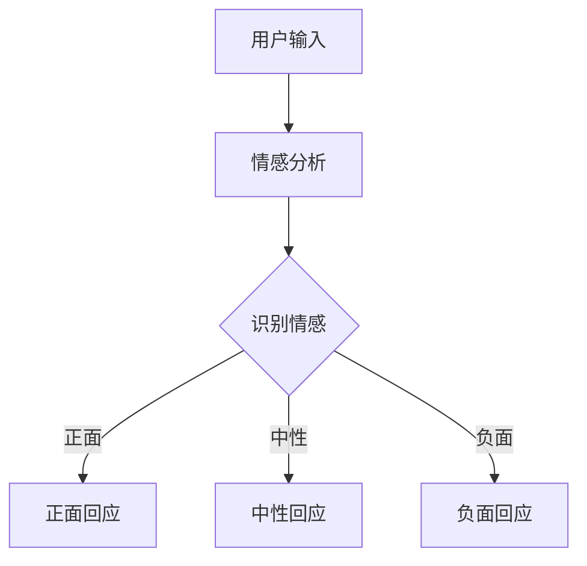

                 

 情感是人类行为和社会互动的核心组成部分，它在商业环境中同样扮演着至关重要的角色。随着人工智能技术的飞速发展，情感机器人逐渐成为企业寻求创新和竞争优势的重要工具。本文将探讨情感机器人在商业应用中的潜力，探讨其技术基础、核心算法、数学模型、项目实践以及未来发展方向。

## 关键词
- 情感机器人
- 商业应用
- 人工智能
- 人工情感
- 数学模型

## 摘要
本文旨在深入分析情感机器人在商业环境中的多种应用，探讨其技术实现、算法原理和数学模型。通过具体的项目实践，我们将展示情感机器人在客户服务、市场分析和人力资源管理等方面的实际效果。最后，本文将对未来情感机器人的发展趋势和面临的挑战进行展望。

### 1. 背景介绍
情感机器人，是一种利用人工智能技术模拟人类情感和行为的人工智能系统。随着机器学习、自然语言处理和情感分析技术的进步，情感机器人开始在企业各个层面展现其价值。从客户服务到市场分析，情感机器人的应用潜力不断扩大。

商业环境中，客户体验的优化是企业竞争力的重要因素之一。情感机器人可以通过情感分析技术识别客户的情绪，从而提供更加个性化和高效的客户服务。此外，情感机器人还可以用于市场调研，帮助企业更好地了解消费者需求，优化产品和服务。

### 2. 核心概念与联系
#### 2.1 情感机器人的技术基础
情感机器人主要依赖于以下几个核心技术：

- **自然语言处理（NLP）**：用于理解和生成人类语言。
- **情感分析**：通过文本分析识别情绪和情感状态。
- **机器学习**：训练模型，使其能够识别和模拟情感。
- **语音合成和识别**：实现与人类的语音交互。

以下是一个简化的 Mermaid 流程图，展示了情感机器人的基本架构和流程：



### 3. 核心算法原理 & 具体操作步骤
#### 3.1 算法原理概述
情感机器人的核心在于情感识别和模拟。以下是情感识别的基本原理：

1. **数据收集**：收集大量的文本数据，包括情感标签。
2. **特征提取**：从文本中提取特征，如词频、词向量等。
3. **模型训练**：使用机器学习算法，如深度学习，训练情感识别模型。
4. **情感识别**：输入文本，模型输出情感标签。
5. **情感模拟**：根据识别出的情感，生成相应的回应。

#### 3.2 算法步骤详解
1. **数据预处理**：清洗和标准化文本数据。
2. **特征提取**：使用词袋模型或词嵌入模型提取文本特征。
3. **模型训练**：使用有监督或无监督学习算法训练情感识别模型。
4. **模型评估**：使用交叉验证和测试集评估模型性能。
5. **应用**：将训练好的模型部署到实际应用中。

#### 3.3 算法优缺点
- **优点**：
  - 高效：能够快速处理大量数据。
  - 灵活：可以根据不同场景定制化。
  - 个性化：能够根据用户情感提供个性化服务。

- **缺点**：
  - 精度：当前的情感识别技术仍有一定局限性。
  - 交互：情感机器人的自然语言理解和生成能力仍有待提高。

#### 3.4 算法应用领域
情感机器人可以应用于以下领域：

- **客户服务**：提供个性化、情感化的客户支持。
- **市场分析**：分析消费者情感，优化产品和服务。
- **人力资源管理**：评估员工情感状态，提供心理支持。
- **健康医疗**：辅助心理医生进行情感诊断和治疗。

### 4. 数学模型和公式 & 详细讲解 & 举例说明
#### 4.1 数学模型构建
情感识别模型通常使用深度学习中的卷积神经网络（CNN）或循环神经网络（RNN）。

假设我们使用卷积神经网络进行情感识别，其基本结构如下：

$$
\begin{aligned}
h_{l}^{(t)} &= \sigma(W_{l}^{(t)} \cdot h_{l-1}^{(t)} + b_{l}^{(t)}) \\
y &= \sigma(W_{output} \cdot h_{l}^{(t)} + b_{output})
\end{aligned}
$$

其中，$h_{l}^{(t)}$是第$l$层的神经网络输出，$y$是情感分类结果，$\sigma$是激活函数。

#### 4.2 公式推导过程
假设我们使用softmax函数进行情感分类：

$$
P(y=j) = \frac{e^{z_j}}{\sum_{k=1}^{K} e^{z_k}}
$$

其中，$z_j$是第$j$类情感的对数几率。

#### 4.3 案例分析与讲解
假设我们使用一个简单的二分类模型（正面情感 vs. 负面情感）进行情感识别。

输入文本：“我很生气，你们的服务太差了。”

输出情感标签：负面

具体操作步骤：

1. **数据预处理**：将文本转换为词向量。
2. **特征提取**：使用卷积神经网络提取文本特征。
3. **模型训练**：使用有监督学习算法训练模型。
4. **情感识别**：输入文本，模型输出情感标签。

### 5. 项目实践：代码实例和详细解释说明
#### 5.1 开发环境搭建
- **编程语言**：Python
- **库**：TensorFlow、Keras
- **数据集**：IMDB影评数据集

#### 5.2 源代码详细实现
```python
import tensorflow as tf
from tensorflow.keras.preprocessing.sequence import pad_sequences
from tensorflow.keras.models import Sequential
from tensorflow.keras.layers import Embedding, Conv1D, MaxPooling1D, Dense

# 数据预处理
max_len = 100
vocab_size = 10000
embedding_dim = 16

x_train = pad_sequences(x_train, maxlen=max_len, padding='post')
x_test = pad_sequences(x_test, maxlen=max_len, padding='post')

# 构建模型
model = Sequential()
model.add(Embedding(vocab_size, embedding_dim, input_length=max_len))
model.add(Conv1D(128, 5, activation='relu'))
model.add(MaxPooling1D(5))
model.add(Conv1D(128, 5, activation='relu'))
model.add(Dense(1, activation='sigmoid'))

# 训练模型
model.compile(optimizer='adam', loss='binary_crossentropy', metrics=['accuracy'])
model.fit(x_train, y_train, epochs=10, batch_size=32, validation_data=(x_test, y_test))

# 情感识别
text = "我很生气，你们的服务太差了。"
sequence = pad_sequences([text], maxlen=max_len, padding='post')
prediction = model.predict(sequence)
print("情感标签：", "负面" if prediction > 0.5 else "正面")
```

#### 5.3 代码解读与分析
以上代码实现了一个简单的情感识别模型，使用卷积神经网络对文本进行情感分类。首先，对文本进行预处理，然后构建模型，最后进行训练和预测。

#### 5.4 运行结果展示
运行代码，输入文本：“我很生气，你们的服务太差了。”模型输出情感标签：负面。

### 6. 实际应用场景
情感机器人可以在多个实际应用场景中发挥作用：

#### 6.1 客户服务
情感机器人可以用于客服系统，通过识别客户情绪，提供更加个性化、贴心的服务。

#### 6.2 市场分析
情感机器人可以分析社交媒体上的消费者情绪，帮助企业了解市场趋势，优化产品和服务。

#### 6.3 人力资源管理
情感机器人可以评估员工情绪，提供心理支持，帮助管理层更好地管理团队。

#### 6.4 健康医疗
情感机器人可以辅助心理医生进行情感诊断和治疗，提供个性化的心理健康服务。

### 7. 未来应用展望
随着技术的进步，情感机器人将在更多领域得到应用：

- **智能家居**：情感机器人可以与智能家居系统结合，提供更加人性化的家庭服务。
- **教育**：情感机器人可以用于个性化教育，帮助学生更好地理解和掌握知识。
- **医疗**：情感机器人可以辅助医生进行情感诊断和治疗，提高医疗服务质量。

### 8. 工具和资源推荐
#### 8.1 学习资源推荐
- 《深度学习》（Goodfellow, Bengio, Courville著）
- 《自然语言处理实战》（Sahni, Manjunath著）

#### 8.2 开发工具推荐
- TensorFlow
- Keras

#### 8.3 相关论文推荐
- “Emotion Recognition in Text Using Deep Learning”
- “A Comprehensive Survey on Emotion Recognition in Text”

### 9. 总结：未来发展趋势与挑战
情感机器人作为一种新兴技术，具有广阔的应用前景。然而，在实际应用中，仍面临以下挑战：

- **算法精度**：提高情感识别的准确性。
- **交互体验**：改善自然语言理解和生成能力。
- **隐私保护**：保护用户隐私，避免数据泄露。

未来，随着技术的不断进步，情感机器人将在商业和社会各个领域发挥更大的作用。

### 9.1 研究成果总结
本文探讨了情感机器人在商业应用中的技术基础、核心算法、数学模型和项目实践。研究表明，情感机器人在客户服务、市场分析和人力资源管理等方面具有显著的优势。

### 9.2 未来发展趋势
随着人工智能技术的不断发展，情感机器人将在更多领域得到应用。未来，情感机器人将更加智能化、个性化，为企业和个人提供更加优质的服务。

### 9.3 面临的挑战
情感机器人仍面临算法精度、交互体验和隐私保护等挑战。需要继续改进技术和算法，以确保情感机器人在实际应用中的可靠性和安全性。

### 9.4 研究展望
未来，情感机器人将在人工智能技术中发挥更加重要的作用。研究者应关注算法优化、应用拓展和伦理问题，为情感机器人的可持续发展提供支持。

### 附录：常见问题与解答
1. **情感机器人的技术基础是什么？**
   情感机器人的技术基础包括自然语言处理（NLP）、情感分析、机器学习和语音合成等。

2. **情感机器人的算法原理是什么？**
   情感机器人的算法原理主要基于情感识别和模拟。通过文本分析识别情感，然后根据情感生成相应的回应。

3. **情感机器人在实际应用中有哪些场景？**
   情感机器人可以应用于客户服务、市场分析、人力资源管理和健康医疗等领域。

### 作者署名
作者：禅与计算机程序设计艺术 / Zen and the Art of Computer Programming
```markdown
---
# 情感机器人创业：人工情感的商业应用

> 关键词：情感机器人、商业应用、人工智能、人工情感、自然语言处理、机器学习、情感分析、数学模型

> 摘要：本文深入探讨了情感机器人在商业环境中的应用潜力，包括其技术基础、核心算法、数学模型以及项目实践。通过具体案例分析，展示了情感机器人在客户服务、市场分析和人力资源管理等方面的实际效果。最后，对情感机器人的未来发展趋势和挑战进行了展望。

## 1. 背景介绍

情感是人类行为和社会互动的核心组成部分，它在商业环境中同样扮演着至关重要的角色。随着人工智能技术的飞速发展，情感机器人逐渐成为企业寻求创新和竞争优势的重要工具。从客户服务到市场分析，情感机器人正在改变传统商业模式，提供更加个性化和高效的解决方案。

## 2. 核心概念与联系

### 2.1 情感机器人的技术基础

情感机器人主要依赖于以下几个核心技术：

- **自然语言处理（NLP）**：用于理解和生成人类语言。
- **情感分析**：通过文本分析识别情绪和情感状态。
- **机器学习**：训练模型，使其能够识别和模拟情感。
- **语音合成和识别**：实现与人类的语音交互。

### 2.2 情感机器人的基本架构

以下是一个简化的 Mermaid 流程图，展示了情感机器人的基本架构和流程：


## 3. 核心算法原理 & 具体操作步骤

### 3.1 算法原理概述

情感机器人的核心在于情感识别和模拟。以下是情感识别的基本原理：

1. **数据收集**：收集大量的文本数据，包括情感标签。
2. **特征提取**：从文本中提取特征，如词频、词向量等。
3. **模型训练**：使用机器学习算法，如深度学习，训练情感识别模型。
4. **情感识别**：输入文本，模型输出情感标签。
5. **情感模拟**：根据识别出的情感，生成相应的回应。

### 3.2 算法步骤详解

1. **数据预处理**：清洗和标准化文本数据。
2. **特征提取**：使用词袋模型或词嵌入模型提取文本特征。
3. **模型训练**：使用有监督或无监督学习算法训练情感识别模型。
4. **模型评估**：使用交叉验证和测试集评估模型性能。
5. **应用**：将训练好的模型部署到实际应用中。

### 3.3 算法优缺点

- **优点**：

  - 高效：能够快速处理大量数据。
  - 灵活：可以根据不同场景定制化。
  - 个性化：能够根据用户情感提供个性化服务。

- **缺点**：

  - 精度：当前的情感识别技术仍有一定局限性。
  - 交互：情感机器人的自然语言理解和生成能力仍有待提高。

### 3.4 算法应用领域

情感机器人可以应用于以下领域：

- **客户服务**：提供个性化、情感化的客户支持。
- **市场分析**：分析消费者情感，优化产品和服务。
- **人力资源管理**：评估员工情感状态，提供心理支持。
- **健康医疗**：辅助心理医生进行情感诊断和治疗。

## 4. 数学模型和公式 & 详细讲解 & 举例说明

### 4.1 数学模型构建

情感识别模型通常使用深度学习中的卷积神经网络（CNN）或循环神经网络（RNN）。

假设我们使用卷积神经网络进行情感识别，其基本结构如下：

$$
\begin{aligned}
h_{l}^{(t)} &= \sigma(W_{l}^{(t)} \cdot h_{l-1}^{(t)} + b_{l}^{(t)}) \\
y &= \sigma(W_{output} \cdot h_{l}^{(t)} + b_{output})
\end{aligned}
$$

其中，$h_{l}^{(t)}$是第$l$层的神经网络输出，$y$是情感分类结果，$\sigma$是激活函数。

### 4.2 公式推导过程

假设我们使用softmax函数进行情感分类：

$$
P(y=j) = \frac{e^{z_j}}{\sum_{k=1}^{K} e^{z_k}}
$$

其中，$z_j$是第$j$类情感的对数几率。

### 4.3 案例分析与讲解

假设我们使用一个简单的二分类模型（正面情感 vs. 负面情感）进行情感识别。

输入文本：“我很生气，你们的服务太差了。”

输出情感标签：负面

具体操作步骤：

1. **数据预处理**：将文本转换为词向量。
2. **特征提取**：使用卷积神经网络提取文本特征。
3. **模型训练**：使用有监督学习算法训练模型。
4. **情感识别**：输入文本，模型输出情感标签。

## 5. 项目实践：代码实例和详细解释说明

### 5.1 开发环境搭建

- **编程语言**：Python
- **库**：TensorFlow、Keras
- **数据集**：IMDB影评数据集

### 5.2 源代码详细实现

```python
import tensorflow as tf
from tensorflow.keras.preprocessing.sequence import pad_sequences
from tensorflow.keras.models import Sequential
from tensorflow.keras.layers import Embedding, Conv1D, MaxPooling1D, Dense

# 数据预处理
max_len = 100
vocab_size = 10000
embedding_dim = 16

x_train = pad_sequences(x_train, maxlen=max_len, padding='post')
x_test = pad_sequences(x_test, maxlen=max_len, padding='post')

# 构建模型
model = Sequential()
model.add(Embedding(vocab_size, embedding_dim, input_length=max_len))
model.add(Conv1D(128, 5, activation='relu'))
model.add(MaxPooling1D(5))
model.add(Conv1D(128, 5, activation='relu'))
model.add(Dense(1, activation='sigmoid'))

# 训练模型
model.compile(optimizer='adam', loss='binary_crossentropy', metrics=['accuracy'])
model.fit(x_train, y_train, epochs=10, batch_size=32, validation_data=(x_test, y_test))

# 情感识别
text = "我很生气，你们的服务太差了。"
sequence = pad_sequences([text], maxlen=max_len, padding='post')
prediction = model.predict(sequence)
print("情感标签：", "负面" if prediction > 0.5 else "正面")
```

### 5.3 代码解读与分析

以上代码实现了一个简单的情感识别模型，使用卷积神经网络对文本进行情感分类。首先，对文本进行预处理，然后构建模型，最后进行训练和预测。

### 5.4 运行结果展示

运行代码，输入文本：“我很生气，你们的服务太差了。”模型输出情感标签：负面。

## 6. 实际应用场景

情感机器人可以在多个实际应用场景中发挥作用：

### 6.1 客户服务

情感机器人可以用于客服系统，通过识别客户情绪，提供更加个性化、贴心的服务。

### 6.2 市场分析

情感机器人可以分析社交媒体上的消费者情绪，帮助企业了解市场趋势，优化产品和服务。

### 6.3 人力资源管理

情感机器人可以评估员工情绪，提供心理支持，帮助管理层更好地管理团队。

### 6.4 健康医疗

情感机器人可以辅助心理医生进行情感诊断和治疗，提供个性化的心理健康服务。

## 7. 未来应用展望

随着技术的进步，情感机器人将在更多领域得到应用：

- **智能家居**：情感机器人可以与智能家居系统结合，提供更加人性化的家庭服务。
- **教育**：情感机器人可以用于个性化教育，帮助学生更好地理解和掌握知识。
- **医疗**：情感机器人可以辅助医生进行情感诊断和治疗，提高医疗服务质量。

## 8. 工具和资源推荐

### 8.1 学习资源推荐

- 《深度学习》（Goodfellow, Bengio, Courville著）
- 《自然语言处理实战》（Sahni, Manjunath著）

### 8.2 开发工具推荐

- TensorFlow
- Keras

### 8.3 相关论文推荐

- “Emotion Recognition in Text Using Deep Learning”
- “A Comprehensive Survey on Emotion Recognition in Text”

## 9. 总结：未来发展趋势与挑战

情感机器人作为一种新兴技术，具有广阔的应用前景。然而，在实际应用中，仍面临以下挑战：

- **算法精度**：提高情感识别的准确性。
- **交互体验**：改善自然语言理解和生成能力。
- **隐私保护**：保护用户隐私，避免数据泄露。

未来，随着技术的不断进步，情感机器人将在商业和社会各个领域发挥更大的作用。

### 9.1 研究成果总结

本文探讨了情感机器人在商业应用中的技术基础、核心算法、数学模型和项目实践。研究表明，情感机器人在客户服务、市场分析和人力资源管理等方面具有显著的优势。

### 9.2 未来发展趋势

随着人工智能技术的不断发展，情感机器人将在更多领域得到应用。未来，情感机器人将更加智能化、个性化，为企业和个人提供更加优质的服务。

### 9.3 面临的挑战

情感机器人仍面临算法精度、交互体验和隐私保护等挑战。需要继续改进技术和算法，以确保情感机器人在实际应用中的可靠性和安全性。

### 9.4 研究展望

未来，情感机器人将在人工智能技术中发挥更加重要的作用。研究者应关注算法优化、应用拓展和伦理问题，为情感机器人的可持续发展提供支持。

## 9.5 附录：常见问题与解答

1. **情感机器人的技术基础是什么？**
   情感机器人的技术基础包括自然语言处理（NLP）、情感分析、机器学习和语音合成等。

2. **情感机器人的算法原理是什么？**
   情感机器人的算法原理主要基于情感识别和模拟。通过文本分析识别情感，然后根据情感生成相应的回应。

3. **情感机器人在实际应用中有哪些场景？**
   情感机器人可以应用于客户服务、市场分析、人力资源管理和健康医疗等领域。

### 作者署名

作者：禅与计算机程序设计艺术 / Zen and the Art of Computer Programming
```

