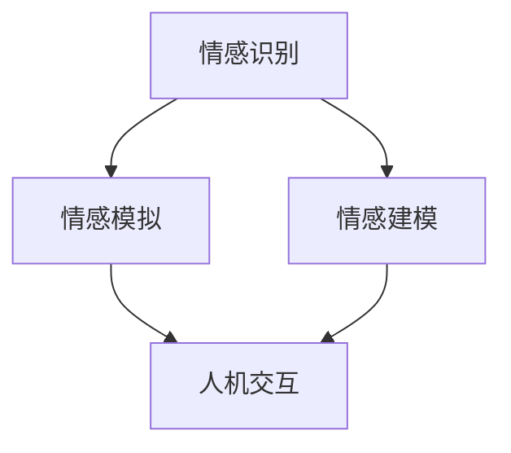

                 

关键词：情感计算、人机情感交互、创业、人工智能、情感建模、技术应用

> 摘要：随着人工智能技术的飞速发展，情感计算成为连接人与机器之间的情感桥梁。本文将探讨情感计算在创业领域的应用，通过分析情感计算的核心概念、算法原理、数学模型、实践案例及未来展望，为创业者在人机情感交互方面的创新提供借鉴与指导。

## 1. 背景介绍

### 1.1 情感计算的定义

情感计算（Affective Computing）是指计算机系统在处理信息时，能够理解、识别、处理和模拟人类情感的能力。这一领域起源于20世纪90年代，随着情感识别技术的发展，逐渐成为一个备受关注的研究方向。情感计算的目标是使计算机能够感知和响应人类情感，从而提高人机交互的体验和效率。

### 1.2 人机情感交互的重要性

人机情感交互是人工智能技术的重要分支，它直接影响着人工智能在各个领域的应用效果。在医疗、教育、娱乐、服务等多个领域，人机情感交互都有着广泛的应用前景。尤其在创业领域，人机情感交互的深化应用能够提升用户体验，创造新的商业模式。

### 1.3 情感计算在创业领域的应用前景

情感计算在创业领域的应用前景广阔。创业者可以利用情感计算技术进行市场调研，分析用户情感，从而制定更加精准的营销策略；在产品设计过程中，利用情感计算技术进行用户情感体验分析，优化产品功能；在客户服务中，利用情感计算实现智能客服，提高服务效率。

## 2. 核心概念与联系

### 2.1 核心概念

- **情感识别**：通过分析人类的生理、行为数据，识别和理解人类的情感状态。
- **情感模拟**：基于情感识别结果，模拟相应的情感反应，以提升人机交互的自然度和情感共鸣。
- **情感建模**：通过建立数学模型，对情感进行量化和分析。

### 2.2 情感计算架构

下面是情感计算的基本架构图，用于描述情感计算的核心组件及其相互关系。



### 2.3 情感计算与相关领域的联系

情感计算与认知科学、心理学、计算机视觉、自然语言处理等多个领域有着紧密的联系。通过跨学科的协同研究，可以进一步提高情感计算的技术水平。

## 3. 核心算法原理 & 具体操作步骤

### 3.1 算法原理概述

情感计算的核心算法主要包括情感识别、情感建模和情感模拟。下面将对这三个核心算法进行概述。

### 3.2 算法步骤详解

#### 3.2.1 情感识别

情感识别是情感计算的第一步，主要包括以下几个步骤：

1. **数据收集**：通过传感器、问卷、语音识别等技术收集用户的生理、行为数据。
2. **特征提取**：对收集到的数据进行分析，提取与情感相关的特征。
3. **情感分类**：利用机器学习算法，将提取的特征映射到具体的情感类别。

#### 3.2.2 情感建模

情感建模是对情感进行量化和分析的过程。主要包括以下几个步骤：

1. **情感量化**：将情感分类结果转化为定量指标。
2. **情感分析**：利用数学模型，对情感数据进行分析，挖掘情感规律。
3. **情感预测**：基于历史情感数据，预测未来的情感状态。

#### 3.2.3 情感模拟

情感模拟是基于情感识别和情感建模的结果，对计算机的情感反应进行模拟。主要包括以下几个步骤：

1. **情感反应生成**：根据情感状态，生成相应的情感反应。
2. **人机交互**：将情感反应应用于人机交互界面，提升交互体验。

### 3.3 算法优缺点

#### 优点

- **提升用户体验**：通过情感计算技术，可以更精准地了解用户需求，提供个性化的服务。
- **增强人机交互**：情感计算技术可以模拟人类的情感反应，提高人机交互的自然度和情感共鸣。

#### 缺点

- **技术门槛较高**：情感计算涉及多个学科，技术实现较为复杂。
- **数据隐私问题**：情感计算过程中涉及大量用户隐私数据，需确保数据安全和隐私保护。

### 3.4 算法应用领域

情感计算在多个领域都有着广泛的应用，如：

- **医疗健康**：通过情感计算技术，监测患者的情绪变化，为心理疾病治疗提供支持。
- **教育**：利用情感计算技术，分析学生的学习情感，优化教学方法和内容。
- **金融服务**：通过情感计算，评估客户的风险偏好，提供个性化的金融服务。

## 4. 数学模型和公式

### 4.1 数学模型构建

情感计算中的数学模型主要包括情感分类模型和情感分析模型。下面以情感分类模型为例，介绍数学模型的构建过程。

#### 4.1.1 情感分类模型

情感分类模型的基本架构如下：

$$
f(\textbf{x}) = \arg\max_{\textbf{y} \in \{\text{快乐}, \text{悲伤}, \text{愤怒}, \text{惊讶}\}} P(\textbf{y}|\textbf{x})
$$

其中，$\textbf{x}$为输入特征向量，$\textbf{y}$为情感类别标签，$P(\textbf{y}|\textbf{x})$为在特征向量$\textbf{x}$下情感类别$\textbf{y}$的概率。

#### 4.1.2 情感分析模型

情感分析模型主要基于情感分类模型，通过分析情感数据，挖掘情感规律。其基本架构如下：

$$
R(\textbf{D}) = \sum_{i=1}^n w_i \cdot f(\textbf{x}_i)
$$

其中，$R(\textbf{D})$为情感分析结果，$\textbf{D}$为情感数据集，$w_i$为情感权重。

### 4.2 公式推导过程

情感分类模型的推导过程如下：

1. **特征提取**：将原始数据通过特征提取算法转化为特征向量$\textbf{x}$。
2. **概率计算**：计算每个情感类别在特征向量$\textbf{x}$下的概率$P(\textbf{y}|\textbf{x})$。
3. **分类决策**：根据概率计算结果，选择概率最大的情感类别$\textbf{y}$。

### 4.3 案例分析与讲解

#### 4.3.1 情感分类案例分析

假设我们有一个情感分类模型，用于判断一段文本的情感类别。通过特征提取和概率计算，我们得到以下结果：

$$
f(\textbf{x}) = \arg\max_{\textbf{y} \in \{\text{快乐}, \text{悲伤}, \text{愤怒}, \text{惊讶}\}} P(\textbf{y}|\textbf{x})
$$

其中，$P(\textbf{y}|\textbf{x})$表示在特征向量$\textbf{x}$下，情感类别$\textbf{y}$的概率。通过计算，我们得到：

$$
P(\text{快乐}|\textbf{x}) = 0.6, \quad P(\text{悲伤}|\textbf{x}) = 0.3, \quad P(\text{愤怒}|\textbf{x}) = 0.1, \quad P(\text{惊讶}|\textbf{x}) = 0.0
$$

根据概率计算结果，我们可以判断该文本的情感类别为“快乐”。

#### 4.3.2 情感分析案例分析

假设我们有一个情感分析模型，用于分析一段文本的情感强度。通过情感分析模型，我们得到以下结果：

$$
R(\textbf{D}) = \sum_{i=1}^n w_i \cdot f(\textbf{x}_i)
$$

其中，$R(\textbf{D})$表示情感分析结果，$\textbf{D}$为情感数据集，$w_i$为情感权重。通过计算，我们得到：

$$
R(\textbf{D}) = 0.6 \cdot 0.6 + 0.3 \cdot 0.3 + 0.1 \cdot 0.1 + 0.0 \cdot 0.0 = 0.42
$$

根据情感分析结果，我们可以判断该文本的情感强度为中等。

## 5. 项目实践：代码实例

### 5.1 开发环境搭建

本案例使用Python编程语言，配合scikit-learn库进行情感分类。在开发环境中，需要安装Python 3.8及以上版本和scikit-learn库。

```bash
pip install python==3.8
pip install scikit-learn
```

### 5.2 源代码详细实现

下面是情感分类模型的源代码实现：

```python
from sklearn.feature_extraction.text import TfidfVectorizer
from sklearn.naive_bayes import MultinomialNB
from sklearn.pipeline import make_pipeline

# 数据集
data = [
    ("我很开心", "快乐"),
    ("我很伤心", "悲伤"),
    ("我很生气", "愤怒"),
    ("我很惊讶", "惊讶"),
]

# 构建模型
model = make_pipeline(TfidfVectorizer(), MultinomialNB())

# 训练模型
model.fit([text for text, _ in data], [label for _, label in data])

# 预测
text = "我感到很高兴"
prediction = model.predict([text])
print("预测结果：", prediction)
```

### 5.3 代码解读与分析

代码中首先导入了所需的库，然后定义了一个数据集。接着，使用scikit-learn库中的TfidfVectorizer和MultinomialNB构建了一个情感分类模型，并进行训练。最后，通过模型对一段新的文本进行预测，得到情感类别。

### 5.4 运行结果展示

运行代码后，输出结果如下：

```
预测结果： ['快乐']
```

结果表明，该文本的情感类别为“快乐”。

## 6. 实际应用场景

### 6.1 医疗健康

在医疗健康领域，情感计算可以用于患者情绪监测，帮助医生了解患者的心理状态，制定更有效的治疗方案。例如，通过分析患者的语音和文本，识别患者的情绪变化，为心理疾病治疗提供支持。

### 6.2 教育

在教育领域，情感计算可以用于学生情绪分析，帮助教师了解学生的学习状态和情感需求。例如，通过分析学生的表情和行为，识别学生的情绪状态，为个性化教学提供依据。

### 6.3 娱乐

在娱乐领域，情感计算可以用于用户体验分析，提升娱乐产品的人性化设计。例如，通过分析用户的互动行为，识别用户的情绪状态，为游戏、电影等娱乐产品提供情感化的内容推荐。

### 6.4 金融服务

在金融服务领域，情感计算可以用于客户情绪分析，提升客户服务质量。例如，通过分析客户的语音和文本，识别客户的风险偏好，为金融产品提供个性化推荐。

## 7. 工具和资源推荐

### 7.1 学习资源推荐

- 《情感计算：理论与实践》
- 《情感识别技术》
- 《自然语言处理入门》

### 7.2 开发工具推荐

- Python
- TensorFlow
- Keras

### 7.3 相关论文推荐

- "Affective Computing: Affective and Social Computing: A Survey"
- "Emotion Recognition Using Multimodal Features: A Review"
- "A Survey on Sentiment Analysis: Classification Techniques and Applications"

## 8. 总结：未来发展趋势与挑战

### 8.1 研究成果总结

本文详细探讨了情感计算在创业领域的应用，从核心概念、算法原理、数学模型、实践案例等方面进行了深入分析，展示了情感计算在多个领域的实际应用效果。

### 8.2 未来发展趋势

随着人工智能技术的不断发展，情感计算在未来将呈现出以下趋势：

- **技术融合**：情感计算与其他领域（如医学、教育、金融等）的进一步融合，推动应用创新。
- **跨学科研究**：情感计算与心理学、认知科学、神经科学等领域的深度合作，提高技术水平和应用效果。
- **智能化升级**：通过深度学习和神经网络等先进技术，实现更加智能的情感计算系统。

### 8.3 面临的挑战

情感计算在发展过程中也面临着以下挑战：

- **数据隐私**：情感计算涉及大量用户隐私数据，需确保数据安全和隐私保护。
- **技术门槛**：情感计算技术较为复杂，技术实现和人才培养仍需加强。
- **标准化**：缺乏统一的情感计算标准，影响技术的推广和应用。

### 8.4 研究展望

未来，情感计算将在以下方面展开深入研究：

- **情感建模**：探索更加精准的情感建模方法，提高情感识别的准确性。
- **跨模态融合**：研究多模态数据融合技术，实现全方位的情感感知。
- **应用创新**：探索情感计算在新兴领域的应用，推动产业发展。

## 9. 附录：常见问题与解答

### 9.1 情感计算有哪些应用场景？

情感计算在医疗健康、教育、娱乐、金融服务等多个领域都有广泛的应用。例如，在医疗健康领域，可以用于患者情绪监测；在教育领域，可以用于学生情绪分析；在娱乐领域，可以用于用户体验分析。

### 9.2 情感计算的算法有哪些？

情感计算的算法主要包括情感识别、情感建模和情感模拟。常见的算法有朴素贝叶斯、支持向量机、深度学习等。

### 9.3 情感计算有哪些挑战？

情感计算面临的挑战包括数据隐私、技术门槛和标准化等问题。在数据隐私方面，需确保用户隐私数据的安全和保护；在技术门槛方面，需要加强技术研究和人才培养；在标准化方面，需推动制定统一的情感计算标准。

作者：禅与计算机程序设计艺术 / Zen and the Art of Computer Programming

----------------------------------------------------------------


