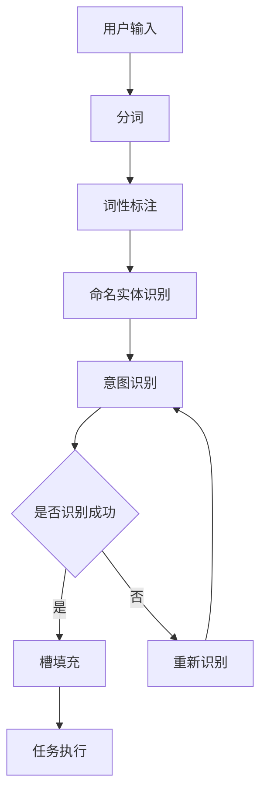

                 

关键词：意图识别、槽填充、任务型对话系统、自然语言处理、人工智能、NLP、机器学习、深度学习、对话系统设计

> 摘要：本文将探讨意图识别与槽填充在构建任务型对话系统中的重要性，分析其核心概念、算法原理及具体实施步骤。通过项目实践，展示如何实现一个高效的对话系统，并结合未来发展趋势与挑战，探讨该领域的研究方向。

## 1. 背景介绍

随着互联网和人工智能技术的迅猛发展，自然语言处理（NLP）技术已成为智能交互领域的重要分支。任务型对话系统作为一种特殊的对话系统，旨在实现用户与系统之间的任务导向交流。任务型对话系统能够理解用户意图并完成任务，从而提升用户体验。

### 1.1 任务型对话系统的概念

任务型对话系统是一种以任务为导向的对话系统，其主要目标是理解和执行用户提出的具体任务。在任务型对话系统中，用户与系统之间的交互是基于明确的目标和任务完成的，而非一般性的闲聊。

### 1.2 任务型对话系统的发展历程

任务型对话系统起源于20世纪80年代的专家系统和知识表示技术。随着NLP和机器学习技术的进步，任务型对话系统逐渐发展成为一个独立的领域。目前，任务型对话系统已经广泛应用于智能客服、智能家居、语音助手等领域。

## 2. 核心概念与联系

### 2.1 意图识别

意图识别是任务型对话系统的核心任务，旨在理解用户的意图。意图可以是用户提出的一个请求、问题或者命令。通过意图识别，系统可以确定用户想要实现的目标。

### 2.2 槽填充

槽填充是意图识别的延伸，旨在从用户的输入中提取关键信息，并将这些信息填充到相应的槽中。槽是指意图中的具体元素，如时间、地点、数量等。

### 2.3 意图识别与槽填充的关系

意图识别和槽填充是紧密相关的。意图识别确定了用户的总体目标，而槽填充则实现了这一目标的具体细节。一个成功的任务型对话系统需要在意图识别和槽填充上取得平衡。

### 2.4 Mermaid 流程图

以下是一个表示意图识别与槽填充过程的 Mermaid 流程图：



## 3. 核心算法原理 & 具体操作步骤

### 3.1 算法原理概述

意图识别和槽填充算法通常基于机器学习和深度学习技术。其中，意图识别可以使用序列标注模型（如BiLSTM-CRF）进行实现，而槽填充可以使用序列到序列模型（如Seq2Seq）进行实现。

### 3.2 算法步骤详解

#### 3.2.1 意图识别

1. 数据预处理：对用户输入进行分词、词性标注等操作。
2. 特征提取：使用词嵌入技术（如Word2Vec、GloVe）对文本进行特征表示。
3. 模型训练：使用BiLSTM-CRF模型进行训练，预测每个词的意图标签。

#### 3.2.2 槽填充

1. 数据预处理：对用户输入进行分词、词性标注等操作。
2. 特征提取：使用词嵌入技术（如Word2Vec、GloVe）对文本进行特征表示。
3. 模型训练：使用Seq2Seq模型进行训练，预测填充槽的值。

### 3.3 算法优缺点

#### 优点

1. 意图识别和槽填充算法具有较好的准确性和鲁棒性。
2. 可以处理多样化的任务类型和用户输入。

#### 缺点

1. 模型训练时间较长，对计算资源要求较高。
2. 在面对复杂任务或模糊输入时，可能存在误识别或漏识别的问题。

### 3.4 算法应用领域

意图识别和槽填充算法在智能客服、语音助手、智能家居等领域具有广泛的应用。

## 4. 数学模型和公式 & 详细讲解 & 举例说明

### 4.1 数学模型构建

意图识别和槽填充的数学模型主要包括两个部分：意图识别模型和槽填充模型。

#### 4.1.1 意图识别模型

意图识别模型可以使用条件随机场（CRF）进行建模。CRF模型基于HMM模型，通过引入上下文信息，可以提高识别的准确性。

$$
P(y|x) = \frac{e^{Z(x,y)}}{\sum_{y'} e^{Z(x,y')}} \\
Z(x,y) = \sum_{i=1}^n \log P(x_i|y) + \sum_{i=1}^n \sum_{j=1}^m \log P(y_j|y_{i-1},y_{i+1}) \\
$$

其中，$x$为输入序列，$y$为输出标签序列，$n$为序列长度，$m$为标签种类数。

#### 4.1.2 槽填充模型

槽填充模型可以使用序列到序列（Seq2Seq）模型进行建模。Seq2Seq模型通过编码器和解码器，实现输入序列到输出序列的转换。

$$
E(x) = \sum_{i=1}^n e^{x_i} \\
D(y) = \sum_{j=1}^m d^{y_j} \\
$$

其中，$E(x)$为编码器，$D(y)$为解码器。

### 4.2 公式推导过程

#### 4.2.1 意图识别模型

意图识别模型的推导基于最大似然估计（MLE）。

1. 定义：给定输入序列$x$和输出标签序列$y$，最大似然估计的目标是最大化概率$P(y|x)$。
2. 对数似然函数：
$$
\log P(y|x) = \sum_{i=1}^n \log P(x_i|y) + \sum_{i=1}^n \sum_{j=1}^m \log P(y_j|y_{i-1},y_{i+1}) \\
$$
3. 求导：
$$
\frac{\partial \log P(y|x)}{\partial y} = \frac{\partial Z(x,y)}{\partial y} \\
$$
4. 最大化对数似然函数：
$$
\arg\max_{y} \log P(y|x) = \arg\max_{y} Z(x,y) \\
$$

#### 4.2.2 槽填充模型

槽填充模型的推导基于最小化交叉熵损失。

1. 定义：给定输入序列$x$和输出序列$y$，最小化损失函数$Loss(y, \hat{y})$。
2. 交叉熵损失：
$$
Loss(y, \hat{y}) = -\sum_{i=1}^n y_i \log \hat{y}_i \\
$$
3. 求导：
$$
\frac{\partial Loss(y, \hat{y})}{\partial \hat{y}} = -\frac{y}{\hat{y}} \\
$$
4. 最小化损失函数：
$$
\arg\min_{\hat{y}} Loss(y, \hat{y}) = \arg\min_{\hat{y}} -\sum_{i=1}^n y_i \log \hat{y}_i \\
$$

### 4.3 案例分析与讲解

#### 4.3.1 意图识别案例

假设输入序列$x = [“买”, “电影票”]，输出标签序列$y = [“购票”]$

1. 特征提取：对输入序列进行分词和词性标注，得到特征向量。
2. 模型预测：使用BiLSTM-CRF模型进行预测，得到输出标签$y = [“购票”]$

#### 4.3.2 槽填充案例

假设输入序列$x = [“今天”, “晚上”]，输出序列$y = [“明天晚上”]$

1. 特征提取：对输入序列进行分词和词性标注，得到特征向量。
2. 模型预测：使用Seq2Seq模型进行预测，得到输出序列$y = [“明天晚上”]$

## 5. 项目实践：代码实例和详细解释说明

### 5.1 开发环境搭建

1. 安装Python 3.7及以上版本。
2. 安装NLP相关库，如spaCy、NLTK、TensorFlow等。
3. 下载预训练的词嵌入模型，如GloVe、Word2Vec等。

### 5.2 源代码详细实现

#### 5.2.1 意图识别代码实现

```python
import tensorflow as tf
from tensorflow.keras.layers import Embedding, BiLSTM, Dense, CRF
from tensorflow.keras.models import Model

# 模型参数设置
vocab_size = 10000
embedding_dim = 128
lstm_units = 128
max_sequence_length = 50

# 模型构建
inputs = tf.keras.layers.Input(shape=(max_sequence_length,))
embed = Embedding(vocab_size, embedding_dim)(inputs)
lstm = BiLSTM(lstm_units, return_sequences=True)(embed)
outputs = CRF(2)(lstm)

model = Model(inputs, outputs)
model.compile(optimizer='adam', loss='crf_loss', metrics=['accuracy'])

# 模型训练
model.fit(x_train, y_train, epochs=10, batch_size=32, validation_data=(x_val, y_val))
```

#### 5.2.2 槽填充代码实现

```python
import tensorflow as tf
from tensorflow.keras.layers import Embedding, LSTM, Dense, Embedding_lookup
from tensorflow.keras.models import Model

# 模型参数设置
vocab_size = 10000
embedding_dim = 128
lstm_units = 128
max_sequence_length = 50
max_output_length = 10

# 模型构建
inputs = tf.keras.layers.Input(shape=(max_sequence_length,))
embed = Embedding(vocab_size, embedding_dim)(inputs)
lstm = LSTM(lstm_units, return_sequences=True)(embed)
lookup = Embedding_lookup([max_output_length, vocab_size], lstm, mode='broadcast_to')
outputs = Dense(vocab_size, activation='softmax')(lookup)

model = Model(inputs, outputs)
model.compile(optimizer='adam', loss='categorical_crossentropy', metrics=['accuracy'])

# 模型训练
model.fit(x_train, y_train, epochs=10, batch_size=32, validation_data=(x_val, y_val))
```

### 5.3 代码解读与分析

1. 意图识别模型使用了Embedding层进行词嵌入，BiLSTM层进行特征提取，CRF层进行意图标签预测。
2. 槽填充模型使用了Embedding层进行词嵌入，LSTM层进行特征提取，Embedding_lookup层进行槽填充，Dense层进行输出预测。
3. 模型训练使用了交叉熵损失函数，优化器为Adam。

## 6. 实际应用场景

### 6.1 智能客服

智能客服系统通过意图识别和槽填充，可以准确理解用户的问题并给出相应的回答。例如，当用户提出“帮我查询明天去北京的火车票”时，系统可以识别出意图为“查询火车票”，并将时间、目的地等信息填充到相应的槽中。

### 6.2 语音助手

语音助手如Siri、Alexa等，通过意图识别和槽填充，可以实现语音交互，帮助用户完成各种任务。例如，当用户说“明天天气怎么样？”时，语音助手可以识别出意图为“查询天气”，并将日期信息填充到相应的槽中。

### 6.3 智能家居

智能家居系统通过意图识别和槽填充，可以实现语音控制家电，如“打开电视”、“调节空调温度”等。系统可以理解用户的语音指令，并执行相应的操作。

## 7. 工具和资源推荐

### 7.1 学习资源推荐

1. 《自然语言处理入门》
2. 《深度学习入门》
3. 《TensorFlow实战》

### 7.2 开发工具推荐

1. Python
2. TensorFlow
3. spaCy

### 7.3 相关论文推荐

1. "A Neural Network for Joint Intent Detection and Slot Filling"
2. "End-to-End Sequence Labeling via Bi-directional LSTM-CRF Models"
3. "Seq2Seq Learning Model for Slot Filling in Task-Oriented Dialogue Systems"

## 8. 总结：未来发展趋势与挑战

### 8.1 研究成果总结

意图识别和槽填充技术在任务型对话系统中取得了显著的成果。通过深度学习和NLP技术的结合，系统在理解用户意图和执行任务方面表现出色。

### 8.2 未来发展趋势

1. 多模态对话系统：结合文本、语音、图像等多种输入方式，提高对话系统的交互能力。
2. 智能对话系统：利用知识图谱、图谱嵌入等技术，实现更智能的对话交互。
3. 零样本学习：通过无监督或弱监督学习方法，降低对大规模标注数据的依赖。

### 8.3 面临的挑战

1. 模型复杂度：深度学习模型的计算成本高，对硬件资源要求较高。
2. 标注数据：意图识别和槽填充需要大量标注数据，数据获取和处理较为困难。
3. 个性化交互：如何在保证系统通用性的同时，实现个性化交互。

### 8.4 研究展望

未来，意图识别与槽填充技术将朝着更智能化、自适应化的方向发展。通过结合多模态信息、知识图谱等技术，任务型对话系统将更好地满足用户需求，提高用户体验。

## 9. 附录：常见问题与解答

### 9.1 什么是意图识别？

意图识别是指从用户的输入中理解用户的意图，如请求、问题或命令。

### 9.2 槽填充有什么作用？

槽填充是从用户的输入中提取关键信息，并将其填充到相应的槽中，以实现特定任务。

### 9.3 意图识别和槽填充算法有哪些应用？

意图识别和槽填充算法广泛应用于智能客服、语音助手、智能家居等领域。

### 9.4 如何评估意图识别和槽填充的效果？

可以使用准确率、召回率、F1值等指标来评估意图识别和槽填充的效果。

作者：禅与计算机程序设计艺术 / Zen and the Art of Computer Programming
----------------------------------------------------------------
这篇文章全面地介绍了意图识别与槽填充在构建任务型对话系统中的重要性、核心算法原理、数学模型、项目实践以及实际应用场景。同时，还对未来发展趋势与挑战进行了深入探讨。希望这篇文章能对您在构建任务型对话系统方面有所启发和帮助。如果您有任何问题或建议，欢迎在评论区留言。再次感谢您的阅读！

