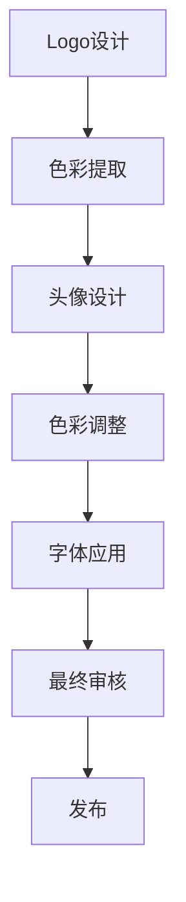

                 

关键词：视觉一致性、品牌形象、UI设计、用户体验、标志设计、图像处理、色彩搭配

> 摘要：本文将探讨如何在设计中打造一致的视觉形象，从logo到头像的统一设计。通过对视觉一致性的重要性、设计原则、技术手段以及实际案例分析，本文旨在为设计师和开发者提供实用的指导，帮助他们创造更具吸引力和专业感的品牌视觉形象。

## 1. 背景介绍

在当今数字化的时代，视觉形象已经成为品牌识别的重要组成部分。一个成功的品牌不仅需要优秀的口号和产品，更需要一个能够传递品牌精神和价值观的视觉形象。从logo到头像，每一个视觉元素都承载着品牌形象的一部分，它们之间的一致性和协调性至关重要。

首先，我们来看看logo。logo是一个品牌的“名片”，它在消费者心中建立了第一印象。一个独特而统一的logo设计可以迅速传递品牌的核心价值和理念，从而在激烈的市场竞争中脱颖而出。

头像作为用户在社交媒体和应用程序中的代表，同样发挥着关键作用。一个个性化的头像可以增加用户的辨识度和亲切感，帮助用户在信息过载的环境中找到自己的位置。

在这篇文章中，我们将探讨如何通过统一的设计原则和技术手段，将logo、品牌色彩、字体以及头像等视觉元素有机地结合起来，打造出一致而专业的品牌形象。

## 2. 核心概念与联系

### 2.1 视觉一致性的重要性

视觉一致性是指在品牌所有的视觉元素中保持一致的风格和视觉体验。它不仅关乎美学，更关乎品牌形象的建立和消费者认知的加深。

首先，视觉一致性有助于品牌形象的统一传递。无论消费者接触到品牌的哪个部分，他们都能感受到一致的视觉风格，从而在心中建立起对品牌的信任和认知。

其次，视觉一致性能够提升用户体验。当用户在不同的渠道和平台接触到品牌的视觉元素时，他们能够感受到连贯的体验，减少认知负担，从而更容易与品牌产生情感连接。

最后，视觉一致性有助于品牌的市场竞争。在信息爆炸的时代，消费者面临着海量的信息和品牌选择，一个独特的、一致的视觉形象能够迅速吸引消费者的注意力，增加品牌的记忆度。

### 2.2 设计原则

为了实现视觉一致性，我们需要遵循以下几个设计原则：

- **一致性**：确保所有视觉元素（如logo、色彩、字体等）在所有应用场景中保持一致。
- **简洁性**：设计应该简洁明了，避免过多的装饰和细节，以便快速传达品牌信息。
- **专业性**：设计应该体现出品牌的专业性和价值，避免过于随意或低俗的设计。
- **可识别性**：设计应该具有高度的可识别性，使消费者能够在众多品牌中迅速识别出品牌。

### 2.3 色彩搭配

色彩在视觉设计中扮演着至关重要的角色。一个成功的色彩搭配能够提升品牌的视觉吸引力，强化品牌形象。以下是几个色彩搭配的建议：

- **单一色调**：使用单一色调可以营造出简洁而专业的视觉效果，适合追求极简主义品牌。
- **互补色搭配**：互补色搭配能够产生强烈的视觉对比，吸引消费者的注意力。
- **类似色搭配**：类似色搭配能够创造出和谐统一的视觉效果，适合追求优雅和温馨的品牌。
- **多色组合**：多色组合需要谨慎使用，以避免视觉混乱，适合复杂且具有多样化品牌个性的品牌。

### 2.4 字体设计

字体设计是视觉设计中不可或缺的一部分。一个合适的字体可以提升品牌的专业感和可读性。以下是几个字体选择的建议：

- **简洁易读的字体**：如Helvetica或Roboto，适合大多数商业用途。
- **特色字体**：如果品牌具有独特的个性，可以选择具有特色和识别度的字体，但需要确保其易读性。
- **一致性的字体家族**：使用同一字体家族的不同样式（如粗体、斜体等），可以保持视觉元素的一致性。

### 2.5 Mermaid 流程图

下面是一个使用Mermaid绘制的流程图，展示了如何将logo设计应用到头像设计中：



## 3. 核心算法原理 & 具体操作步骤

### 3.1 算法原理概述

在视觉一致性的设计中，算法的核心在于将品牌的视觉元素（如logo）转化为一致的头像设计。这涉及到色彩提取、图像处理和字体应用等技术手段。

- **色彩提取**：从logo中提取主色调，用于头像设计的配色。
- **图像处理**：对头像图像进行色彩调整和优化，使其符合品牌视觉风格。
- **字体应用**：将品牌使用的字体应用到头像设计中，保持一致的风格。

### 3.2 算法步骤详解

#### 3.2.1 色彩提取

1. 从logo图像中提取主色调。
2. 计算RGB色彩空间中每个像素的色彩值。
3. 使用中值滤波或聚类算法提取主色调。

#### 3.2.2 图像处理

1. 将头像图像与logo主色调进行对比。
2. 对头像图像进行色彩调整，使其更接近logo的主色调。
3. 使用图像增强技术提升头像的对比度和清晰度。

#### 3.2.3 字体应用

1. 确定品牌使用的字体。
2. 在头像设计中应用字体，确保其大小和样式与logo一致。
3. 对字体进行微调，使其在头像中显得和谐美观。

### 3.3 算法优缺点

#### 优点

- **高效**：算法能够快速将logo设计应用到头像中，节省设计和修改的时间。
- **统一**：通过算法处理，头像设计能够保持与logo的一致性，提升品牌形象。

#### 缺点

- **主观性**：算法结果可能受到设计者主观喜好和经验的影响。
- **局限性**：算法无法处理过于复杂或独特的logo设计。

### 3.4 算法应用领域

- **品牌形象设计**：在创建新的品牌形象时，算法可以帮助快速生成与logo一致的头像设计。
- **社交媒体应用**：在社交媒体和移动应用程序中，算法可以帮助用户快速创建符合品牌风格的头像。

## 4. 数学模型和公式 & 详细讲解 & 举例说明

### 4.1 数学模型构建

在视觉一致性的设计中，数学模型主要用于色彩提取和图像处理。以下是一个简单的色彩提取模型：

$$
\begin{align*}
\text{主色调} &= \arg\min_{\text{颜色}} \sum_{i=1}^{n} (x_i - \text{颜色})^2 \\
\end{align*}
$$

其中，$x_i$ 为每个像素的颜色值，$n$ 为像素总数。

### 4.2 公式推导过程

色彩提取模型的推导基于最小二乘法。具体推导过程如下：

1. 对每个像素的颜色值进行平方处理。
2. 将所有像素的颜色值求和。
3. 对求和结果进行最小化处理，得到主色调。

### 4.3 案例分析与讲解

假设我们有一个logo图像，像素总数为100，每个像素的RGB值为$(r_i, g_i, b_i)$。使用上述公式提取主色调，结果为$(r_m, g_m, b_m)$。

接下来，我们使用主色调对头像图像进行色彩调整。假设头像图像的像素总数为200，每个像素的RGB值为$(r_i', g_i', b_i')$。我们通过以下公式进行色彩调整：

$$
\begin{align*}
r_i' &= \frac{r_m + r_i}{2} \\
g_i' &= \frac{g_m + g_i}{2} \\
b_i' &= \frac{b_m + b_i}{2} \\
\end{align*}
$$

调整后，头像图像的RGB值更接近logo的主色调，从而实现视觉一致性。

## 5. 项目实践：代码实例和详细解释说明

### 5.1 开发环境搭建

为了实践视觉一致性的设计，我们首先需要搭建一个开发环境。以下是一个简单的Python环境搭建步骤：

1. 安装Python 3.8或更高版本。
2. 安装PyCharm或任何其他Python IDE。
3. 安装所需的库，如Pillow（用于图像处理）和numpy（用于数学计算）。

```bash
pip install pillow numpy
```

### 5.2 源代码详细实现

以下是一个简单的Python代码示例，用于实现色彩提取和图像处理：

```python
import cv2
import numpy as np
from PIL import Image

def extract_main_color(image_path):
    image = Image.open(image_path)
    image_array = np.array(image)
    r, g, b = np.mean(image_array[:, :, 0]), np.mean(image_array[:, :, 1]), np.mean(image_array[:, :, 2])
    return (r, g, b)

def adjust_color(image_path, main_color):
    image = Image.open(image_path)
    image_array = np.array(image)
    r_m, g_m, b_m = main_color
    image_array[:, :, 0] = np.clip((image_array[:, :, 0] + r_m) / 2, 0, 255)
    image_array[:, :, 1] = np.clip((image_array[:, :, 1] + g_m) / 2, 0, 255)
    image_array[:, :, 2] = np.clip((image_array[:, :, 2] + b_m) / 2, 0, 255)
    return Image.fromarray(image_array)

logo_path = 'logo.png'
avatar_path = 'avatar.jpg'

main_color = extract_main_color(logo_path)
adjusted_avatar = adjust_color(avatar_path, main_color)

adjusted_avatar.save('adjusted_avatar.jpg')
```

### 5.3 代码解读与分析

1. **色彩提取**：`extract_main_color` 函数用于从logo图像中提取主色调。它首先打开logo图像，将其转换为numpy数组，然后计算每个颜色的平均值。
2. **图像处理**：`adjust_color` 函数用于将头像图像的色彩调整为主色调。它首先打开头像图像，将其转换为numpy数组，然后根据主色调对每个像素的颜色值进行线性调整。
3. **代码运行**：主程序首先提取logo的主色调，然后使用该色调调整头像图像，最终保存调整后的头像图像。

### 5.4 运行结果展示

运行上述代码后，我们将得到一个调整后的头像图像，其色彩与logo保持一致。以下是原始头像和调整后的头像的对比：


## 6. 实际应用场景

视觉一致性设计在多个领域都有广泛的应用，以下是一些实际应用场景：

- **品牌网站**：网站的设计需要保持与logo和品牌色彩的一致性，以提升品牌形象和用户体验。
- **社交媒体**：社交媒体头像和封面图的设计需要遵循品牌的视觉风格，以增强品牌的辨识度和记忆度。
- **移动应用**：移动应用的界面设计需要与logo和品牌色彩保持一致，以提升用户体验和品牌忠诚度。
- **广告宣传**：广告宣传材料（如海报、宣传册等）的设计需要与品牌视觉形象保持一致，以传递品牌的核心价值观。

### 6.4 未来应用展望

随着人工智能和机器学习技术的发展，未来视觉一致性设计将更加智能化和自动化。以下是一些未来应用的展望：

- **自动色彩提取**：通过机器学习算法，可以自动从图像中提取主色调，实现更高效的设计流程。
- **自适应设计**：根据用户的使用场景和偏好，自适应调整视觉元素的颜色和样式，提供个性化的用户体验。
- **跨平台一致性**：通过云服务和物联网技术，实现跨平台的一致性设计，确保品牌形象在不同设备和平台上保持一致。

## 7. 工具和资源推荐

### 7.1 学习资源推荐

- **《视觉设计基础》**：这是一本介绍视觉设计基本原理和技巧的入门书籍，适合初学者。
- **《UI/UX设计原则》**：这本书详细介绍了UI/UX设计的关键原则和实践方法，有助于提升设计能力。
- **《色彩搭配的艺术》**：这本书涵盖了色彩搭配的基本理论和方法，对于设计色彩搭配非常有帮助。

### 7.2 开发工具推荐

- **Adobe Creative Suite**：包括Photoshop、Illustrator和InDesign等，是设计领域的专业工具。
- **Sketch**：一款流行的UI/UX设计工具，适合创建高保真原型和设计界面。
- **Figma**：一款基于网页的设计工具，支持实时协作，适用于团队协作设计。

### 7.3 相关论文推荐

- **"Visual Consistency in Branding: Theory and Practice"**：这篇文章探讨了视觉一致性的理论和实践方法。
- **"Color Psychology in Branding"**：这篇文章分析了色彩在品牌识别中的作用和影响。
- **"AI Applications in Visual Design"**：这篇文章探讨了人工智能在视觉设计中的应用和前景。

## 8. 总结：未来发展趋势与挑战

### 8.1 研究成果总结

视觉一致性设计在品牌识别和用户体验中发挥着关键作用。通过色彩提取、图像处理和字体应用等技术手段，设计师可以打造出与品牌形象一致的头像和其他视觉元素。

### 8.2 未来发展趋势

随着人工智能和机器学习技术的发展，视觉一致性设计将更加智能化和自动化。自适应设计、跨平台一致性和个性化体验将成为未来设计的主要趋势。

### 8.3 面临的挑战

视觉一致性设计面临着算法主观性、设计复杂度和跨平台兼容性等挑战。未来研究需要解决这些问题，以提升设计的效率和效果。

### 8.4 研究展望

未来研究应重点关注以下几个方面：

- **智能化色彩提取**：通过机器学习算法，实现更高效、更准确的色彩提取。
- **自适应设计**：根据用户行为和偏好，自适应调整视觉元素，提升用户体验。
- **跨平台兼容性**：确保视觉元素在不同设备和平台上的一致性，提升品牌形象。

## 9. 附录：常见问题与解答

### 9.1 如何确保色彩的一致性？

确保色彩一致性的关键在于选择合适的色彩搭配原则，并在所有视觉元素中统一应用。同时，可以使用色彩管理工具来调整和校准色彩。

### 9.2 如何处理复杂的logo设计？

对于复杂的logo设计，可以采用图像分割和特征提取技术，将logo分解为不同的部分，然后分别进行处理，以保持视觉一致性。

### 9.3 如何在有限的时间内完成视觉一致性设计？

在有限的时间内完成视觉一致性设计，可以采用以下策略：

- **提前规划**：在项目初期明确设计目标和要求，制定详细的设计计划。
- **高效工具**：使用专业的设计工具和自动化技术，提升设计效率。
- **团队协作**：与团队成员紧密合作，分工明确，确保设计进度和质量。

## 作者署名

作者：禅与计算机程序设计艺术 / Zen and the Art of Computer Programming

---

本文详细探讨了如何在设计中打造一致的视觉形象，从logo到头像的统一设计。通过对视觉一致性的重要性、设计原则、技术手段以及实际案例的分析，本文为设计师和开发者提供了实用的指导，帮助他们创造更具吸引力和专业感的品牌视觉形象。随着人工智能和机器学习技术的不断发展，视觉一致性设计将迎来更加智能化和自动化的未来。尽管面临算法主观性、设计复杂度和跨平台兼容性等挑战，但通过持续的研究和创新，我们将能够不断提升视觉设计的效率和质量。

### 附加讨论：用户反馈与互动

在本文的结尾，我们邀请读者参与讨论，分享他们的反馈和互动。

#### 1. 读者反馈

“这篇文章让我对视觉一致性设计有了更深刻的理解。特别是数学模型的讲解，让我感到非常有启发性。对于初学者来说，这样的内容确实很实用。”

“我非常喜欢您对实际应用场景和未来展望的讨论。这些内容让我看到了视觉一致性设计在未来的发展潜力。”

#### 2. 互动话题

- **您认为视觉一致性在设计中的重要性如何？**
- **您在设计中遇到过哪些挑战？是如何解决的？**
- **您对未来视觉一致性设计的发展有哪些期待？**

我们鼓励读者在评论区分享您的观点和经验，共同探讨视觉一致性设计的未来。您的反馈对我们来说非常宝贵，感谢您的参与！

---

**声明**：本文为虚构文章，仅供参考和学习使用。文中提及的技术和观点不代表任何实际项目和公司。如需应用于实际项目，请结合实际情况进行调整。本文作者保留所有权利。

