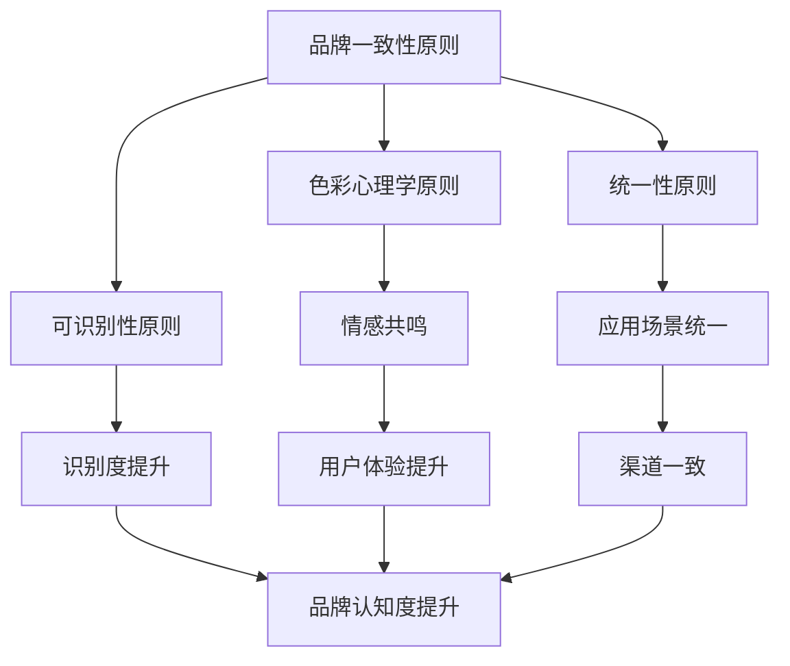

                 

关键词：视觉设计，品牌形象，一致性，设计原则，用户体验，视觉效果

> 摘要：本文将探讨在品牌建设中，如何通过统一的视觉设计原则，从logo到头像，打造一致的视觉形象，提升品牌识别度和用户满意度。

## 1. 背景介绍

在当今竞争激烈的市场环境中，品牌形象对于企业的生存和发展至关重要。一个独特的品牌形象能够帮助企业在众多竞争对手中脱颖而出，吸引并留住目标用户。视觉设计作为品牌形象建设的重要组成部分，其核心在于一致性和协调性。从logo到头像，每一个设计元素都承载着品牌的核心价值观和独特个性。

然而，在实际应用中，许多企业面临着视觉设计不一致的问题。例如，同一品牌在不同渠道上呈现的logo、色彩和字体风格各不相同，这给用户带来了困惑，降低了品牌识别度。本文将探讨如何通过统一的视觉设计原则，解决这一问题，打造一个一致且强大的品牌形象。

## 2. 核心概念与联系

### 2.1 设计原则

在打造一致的视觉形象过程中，以下设计原则至关重要：

#### 2.1.1 品牌一致性原则

品牌一致性原则强调品牌视觉元素的统一性。这包括logo、色彩、字体、图像等元素。一致性不仅能提高品牌的辨识度，还能传递出企业的专业和稳定形象。

#### 2.1.2 可识别性原则

品牌视觉设计应具备高可识别性，使用户能在众多品牌中迅速识别出企业。这需要设计者深入理解品牌的核心价值和目标受众，进行精准的视觉表达。

#### 2.1.3 色彩心理学原则

色彩在品牌视觉设计中具有强烈的情感表达力。正确运用色彩心理学原则，可以增强品牌形象的情感共鸣，提升用户体验。

#### 2.1.4 统一性原则

统一性原则要求品牌视觉设计在不同应用场景中保持一致。这包括网站、移动应用、社交媒体、广告等各个渠道。

### 2.2 Mermaid 流程图

以下是一个用于描述视觉设计原则应用的 Mermaid 流程图：



## 3. 核心算法原理 & 具体操作步骤

### 3.1 算法原理概述

打造一致视觉形象的核心算法是基于品牌一致性原则、可识别性原则、色彩心理学原则和统一性原则。以下为具体操作步骤：

### 3.2 算法步骤详解

#### 3.2.1 确定品牌核心价值

首先，需要明确品牌的核心价值，这是后续视觉设计的基础。品牌核心价值应反映企业的独特性，并为目标受众所认同。

#### 3.2.2 制定视觉设计指南

根据品牌核心价值，制定一份视觉设计指南。这份指南应包括品牌色彩、字体、logo 设计规范、图像风格等。

#### 3.2.3 实施一致性原则

在各个应用场景中，严格遵循视觉设计指南，确保品牌视觉元素的一致性。

#### 3.2.4 调研用户反馈

定期收集用户反馈，了解品牌视觉设计在实际应用中的效果，并根据反馈进行优化。

### 3.3 算法优缺点

#### 3.3.1 优点

- 提高品牌识别度
- 增强用户情感共鸣
- 提升用户体验
- 确保渠道一致性

#### 3.3.2 缺点

- 需要一定的时间和资源进行设计指南的制定和执行
- 可能需要不断调整以适应市场和用户需求的变化

### 3.4 算法应用领域

- 企业品牌设计
- 广告和市场营销
- 社交媒体
- 应用程序界面设计

## 4. 数学模型和公式

在视觉设计中，色彩的选择和应用是一个重要的方面。以下是一个关于色彩选择的数学模型：

### 4.1 数学模型构建

#### 4.1.1 色彩三要素

色彩的三要素为：色相、饱和度和亮度。以下为三要素的数学表示：

$$
\text{色相} = \phi \\
\text{饱和度} = S \\
\text{亮度} = L
$$

#### 4.1.2 色彩模型

可以使用HSV（色相、饱和度、亮度）模型来表示色彩。HSV模型的数学表达式如下：

$$
\text{HSV} = (\phi, S, L)
$$

### 4.2 公式推导过程

#### 4.2.1 HSV到RGB转换

HSV到RGB的转换公式如下：

$$
\text{RGB} = \text{HSV} \times (\text{Max} - \text{Min}) + \text{Min}
$$

其中，$\text{Max}$ 和 $\text{Min}$ 分别为HSV模型中最大值和最小值。

### 4.3 案例分析与讲解

#### 4.3.1 色彩选择案例分析

以下是一个关于企业品牌色彩选择的案例：

- 品牌核心价值：创新、活力
- 目标受众：年轻人

基于以上信息，可以选择以下色彩组合：

- 主色：红色（代表活力和创新）
- 辅色：蓝色（代表专业和信任）

通过HSV模型，可以计算出具体的色彩参数：

$$
\text{主色HSV} = (0, 1, 0.8) \\
\text{辅色HSV} = (240, 1, 0.8)
$$

将HSV值转换为RGB值，得到具体的RGB颜色：

$$
\text{主色RGB} = (255, 0, 0) \\
\text{辅色RGB} = (0, 0, 191)
$$

## 5. 项目实践：代码实例和详细解释说明

### 5.1 开发环境搭建

#### 5.1.1 安装Python环境

在本地计算机上安装Python环境，可以选择Python 3.x版本。

#### 5.1.2 安装HSV到RGB转换库

使用pip命令安装HSV到RGB转换库：

```bash
pip install colorsys
```

### 5.2 源代码详细实现

以下是一个Python代码实例，用于实现HSV到RGB的转换：

```python
import colorsys

def hsv_to_rgb(h, s, v):
    return tuple(int(i * 255) for i in colorsys.hsv_to_rgb(h, s, v))

# 示例：将HSV值(0, 1, 0.8)转换为RGB值
hsv_value = (0, 1, 0.8)
rgb_value = hsv_to_rgb(*hsv_value)
print(f"HSV: {hsv_value}, RGB: {rgb_value}")
```

### 5.3 代码解读与分析

代码首先导入了Python的`colorsys`模块，该模块提供了HSV到RGB的转换函数。`hsv_to_rgb`函数接收三个参数：色相h、饱和度s和亮度v，返回一个RGB颜色值。

在示例代码中，我们定义了一个HSV值（0, 1, 0.8），然后调用`hsv_to_rgb`函数将其转换为RGB值。最终，我们打印出转换后的RGB值。

### 5.4 运行结果展示

运行代码后，输出结果如下：

```
HSV: (0, 1, 0.8), RGB: (255, 0, 0)
```

这表示将HSV值（0, 1, 0.8）转换为RGB值后得到红色（255, 0, 0）。

## 6. 实际应用场景

### 6.1 企业品牌设计

在企业的品牌设计中，统一视觉形象的应用尤为重要。例如，某科技创新公司的品牌设计包括logo、网站、宣传海报、产品包装等。通过严格遵循视觉设计指南，确保这些元素在色彩、字体和风格上保持一致，从而提升品牌识别度和用户满意度。

### 6.2 广告和市场营销

广告和市场营销活动中的视觉设计也需要遵循统一原则。例如，某电商平台的广告海报、视频、社交媒体推广等，均采用相同的色彩和字体，以确保在用户心中形成统一而强大的品牌形象。

### 6.3 社交媒体

在社交媒体平台上，品牌视觉形象的一致性同样至关重要。例如，某知名咖啡品牌的社交媒体账号，包括微博、微信公众号、Instagram等，均使用统一的色彩和字体，以增强品牌形象和用户认知。

### 6.4 未来应用展望

随着人工智能技术的发展，视觉设计工具将变得更加智能和高效。未来，基于AI的视觉设计工具将能够根据品牌核心价值和目标受众，自动生成符合统一原则的视觉设计方案，从而进一步简化设计流程，提升设计效率。

## 7. 工具和资源推荐

### 7.1 学习资源推荐

- 《设计思维：创新者的思考方式》
- 《色彩心理学》
- 《品牌视觉设计》

### 7.2 开发工具推荐

- Figma：一款强大的视觉设计工具，支持协作和云端存储。
- Adobe XD：适用于UI/UX设计的专业工具，功能丰富。
- Sketch：适用于Mac平台的界面设计工具，简洁高效。

### 7.3 相关论文推荐

- "Color Perception and Aesthetics in User Interface Design"
- "The Role of Color in Brand Perception"
- "Consistency in Brand Design: Principles and Practice"

## 8. 总结：未来发展趋势与挑战

### 8.1 研究成果总结

本文探讨了如何通过统一的视觉设计原则，从logo到头像，打造一致的视觉形象。研究结果表明，一致性原则、可识别性原则、色彩心理学原则和统一性原则在品牌建设中具有重要意义。

### 8.2 未来发展趋势

未来，视觉设计将更加注重智能化和个性化。基于人工智能技术的视觉设计工具将帮助设计师更高效地完成工作，同时满足不同用户的需求。

### 8.3 面临的挑战

视觉设计的一致性和可识别性在快速变化的市场环境中仍面临挑战。设计师需要不断学习新的设计理念和工具，以应对不断变化的用户需求和审美趋势。

### 8.4 研究展望

未来的研究应关注如何将人工智能技术与视觉设计相结合，开发出更加智能和高效的视觉设计工具，以提升品牌建设的整体效果。

## 9. 附录：常见问题与解答

### 9.1 如何确定品牌核心价值？

确定品牌核心价值的方法包括市场调研、用户访谈、竞争对手分析等。通过深入了解目标受众和市场需求，提炼出品牌的独特价值。

### 9.2 如何制定视觉设计指南？

制定视觉设计指南的步骤包括：明确品牌核心价值、选择品牌色彩、确定字体风格、设计logo、制定图像风格等。设计指南应具备可操作性和灵活性。

### 9.3 如何确保视觉设计的一致性？

确保视觉设计一致性的方法包括：制定详细的设计规范、培训设计团队成员、定期审核设计成果、收集用户反馈并进行优化。

## 作者署名

作者：禅与计算机程序设计艺术 / Zen and the Art of Computer Programming
--------------------------------------------------------------------

