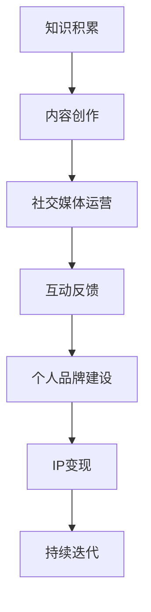

                 

关键词：个人品牌，知识变现，程序员，IP打造，影响力，社交媒体，内容创作，市场策略

> 摘要：在数字化时代，个人品牌的力量愈发显著。本文旨在探讨程序员如何通过知识变现，打造个人IP，提升个人影响力，实现职业价值最大化。我们将从背景介绍、核心概念与联系、核心算法原理、数学模型与公式、项目实践、实际应用场景、工具和资源推荐、总结与展望等多个方面，详细解析程序员如何在这个竞争激烈的市场中脱颖而出。

## 1. 背景介绍

在互联网和信息技术高速发展的今天，程序员已经成为了现代社会不可或缺的一部分。他们不仅肩负着构建数字世界的重任，也逐渐认识到个人品牌建设的重要性。个人IP（Intellectual Property，即知识产权）是指个人在知识、技能、经验等方面的独特标识，它能够为个人带来持续的商业价值和社会影响力。随着社交媒体的普及和内容创作平台的兴起，程序员有了更多的途径来展示自己的才华，分享专业知识，从而实现知识变现。

知识变现是指将个人的知识、技能、经验和创造力转化为可以直接产生经济利益的过程。在程序员群体中，知识变现的方式多种多样，包括但不限于编写技术博客、开设在线课程、参与开源项目、提供咨询服务等。通过这些方式，程序员不仅能够提高自己的知名度，还可以获得实质性的收入。

本文将围绕以下核心问题展开讨论：

- 如何定义和打造个人IP？
- 程序员如何通过知识变现实现职业价值最大化？
- 个人IP如何影响程序员在职场和市场上的定位？
- 如何结合数学模型和算法，提高知识变现的效率和质量？
- 程序员在实践中应该如何选择合适的应用场景和工具？

通过以上问题的探讨，我们希望为广大程序员提供一套系统化的知识变现策略，帮助他们在数字化时代中打造出具有持久影响力的个人品牌。

## 2. 核心概念与联系

### 2.1 个人IP的构成

个人IP的构建不是一蹴而就的，它需要从多个维度进行综合考量。以下是构建个人IP的几个关键组成部分：

#### 2.1.1 知识储备

知识储备是个人IP的核心。对于程序员来说，深厚的专业知识和技能储备不仅能够提升个人的职业竞争力，也是打造个人IP的基础。这些知识包括但不限于编程语言、框架、算法、数据库、系统架构等。

#### 2.1.2 个人品牌

个人品牌是个人IP的外在表现。它通过名字、形象、语言风格等元素传递给外界，是个人价值观、专业能力和个性的综合体现。个人品牌的建设需要持续的努力和策略，包括社交媒体运营、内容创作、公关活动等。

#### 2.1.3 社交网络

社交网络是个人IP传播的渠道。在社交媒体平台上，程序员可以通过博客、视频、直播等形式分享知识，与粉丝互动，扩大影响力。有效的社交网络能够为个人IP的传播提供强大的支持。

### 2.2 知识变现的路径

知识变现是指将个人的知识和技能转化为商业价值的过程。以下是几种常见的知识变现路径：

#### 2.2.1 内容创作

内容创作是最直接的知识变现方式。程序员可以通过写技术博客、编写电子书、开设在线课程等形式，将自己的专业知识分享给公众，并通过付费阅读、课程销售等方式获得收入。

#### 2.2.2 开源项目

参与开源项目不仅可以提升个人技术能力，还可以提高个人在行业内的知名度。一些优秀的开源项目会吸引大量的关注和贡献，从而为个人带来商业机会，如咨询合作、技术顾问等。

#### 2.2.3 咨询服务

咨询服务是程序员变现知识的高效方式。通过提供技术咨询服务，程序员可以解决客户的具体问题，获得报酬。这种方式对程序员的实战经验和沟通能力有较高要求。

### 2.3 个人IP的影响

个人IP对程序员在职场和市场上的定位有着深远的影响：

#### 2.3.1 职场竞争力

拥有强大个人IP的程序员在求职时更具竞争力。他们不仅能够吸引更高薪酬的岗位，还能在职业发展中获得更多的机会和资源。

#### 2.3.2 行业影响力

个人IP的建设使得程序员能够在行业内获得更多的关注和认可，进而提升个人的行业影响力，成为领域内的意见领袖。

#### 2.3.3 收入多样化

通过个人IP的变现，程序员可以获得多样化的收入来源，不仅限于工资收入，还包括版权收入、咨询收入等。

### 2.4 构建个人IP的算法与策略

构建个人IP需要系统化的算法和策略。以下是一些关键的步骤和策略：

#### 2.4.1 定位清晰

明确个人的专业方向和目标受众，确保内容创作和IP构建具有针对性。

#### 2.4.2 内容创新

保持内容的创新性和高质量，持续产出有价值的内容，提升个人品牌的吸引力。

#### 2.4.3 社交运营

合理运用社交媒体平台，与受众建立紧密联系，增强个人IP的传播效果。

#### 2.4.4 互动反馈

及时关注并回复读者的反馈，通过互动提升粉丝的忠诚度。

### 2.5 Mermaid 流程图

下面是构建个人IP的一个简化的Mermaid流程图，展示了从知识积累到IP变现的各个环节。



通过以上步骤和策略，程序员可以逐步构建起自己的个人IP，实现知识变现，提升职业价值。

## 3. 核心算法原理 & 具体操作步骤

### 3.1 算法原理概述

在构建个人IP的过程中，算法原理起着至关重要的作用。以下是几个核心算法原理及其应用：

#### 3.1.1 SEO（搜索引擎优化）

SEO是提高内容在搜索引擎中排名的关键。通过优化标题、关键词、内容结构等，提高内容被用户发现的可能性。具体步骤如下：

- 分析目标受众，确定关键词
- 优化标题和摘要，包含关键词
- 使用HTML标签和Meta描述优化内容结构
- 创建高质量的外部链接

#### 3.1.2 社交媒体算法

社交媒体平台有自己的算法，决定哪些内容会被优先展示。了解这些算法，能够提高内容的传播效果。具体策略包括：

- 定期发布内容，保持活跃度
- 利用热点话题和趋势话题，提高互动率
- 分析数据，调整发布时间和内容形式

#### 3.1.3 内容营销算法

内容营销算法关注如何通过高质量的内容吸引和保留受众。关键步骤包括：

- 创造有价值的内容，满足受众需求
- 保持内容更新，提供持续的价值
- 多元化内容形式，包括博客、视频、播客等

#### 3.1.4 社交互动算法

社交互动算法关注如何通过互动提升粉丝的忠诚度和参与度。具体策略包括：

- 定期与粉丝互动，回应评论和私信
- 创造互动话题，引导粉丝参与
- 举办线上活动，增强粉丝粘性

### 3.2 算法步骤详解

以下是对上述核心算法的具体步骤进行详细解释：

#### 3.2.1 SEO算法步骤

1. **关键词分析**：使用工具如Google Keyword Planner、Ahrefs等，分析目标受众常用的关键词。
2. **内容创作**：根据关键词创作高质量的内容，确保文章结构清晰、逻辑严密。
3. **优化标题**：使用关键词编写标题，并确保标题能够吸引读者的注意力。
4. **内部链接**：在文章内部使用锚文本链接，增强文章的内部链接结构。
5. **外部链接**：通过合作、投稿等方式获取高质量的外部链接。

#### 3.2.2 社交媒体算法步骤

1. **定期发布**：设定固定的发布时间表，确保内容定期更新。
2. **分析数据**：使用社交媒体分析工具，如Facebook Insights、Google Analytics等，分析内容表现和受众行为。
3. **互动策略**：定期与粉丝互动，回复评论和私信，创造互动话题。
4. **内容形式**：根据不同平台的特点，选择合适的视频、图片、图文等形式。

#### 3.2.3 内容营销算法步骤

1. **受众分析**：了解目标受众的需求、兴趣和痛点。
2. **内容规划**：根据受众分析结果，制定内容规划，确保内容与受众需求匹配。
3. **内容创作**：创作高质量、有价值的内容，包括技术解析、行业趋势、实践经验等。
4. **内容发布**：通过多渠道发布内容，扩大影响力。
5. **内容更新**：定期更新内容，保持内容的新鲜感和价值。

#### 3.2.4 社交互动算法步骤

1. **互动回应**：及时回复评论和私信，建立良好的互动关系。
2. **互动话题**：创造有趣、有争议的互动话题，引导粉丝参与讨论。
3. **线上活动**：举办线上活动，如问答、直播、竞赛等，增强粉丝的参与感和粘性。
4. **粉丝数据分析**：分析粉丝的互动行为，调整互动策略，提升参与度。

通过以上算法原理和步骤的详细解释，程序员可以更有效地构建个人IP，实现知识变现。在后续的部分中，我们将进一步探讨数学模型和公式、项目实践以及实际应用场景，帮助程序员在知识变现的道路上迈出坚实的步伐。

### 3.3 算法优缺点

在构建个人IP的过程中，应用各种算法有其显著的优缺点。以下是几种关键算法的优缺点分析：

#### 3.3.1 SEO算法

**优点**：

- 提高内容在搜索引擎中的排名，增加曝光度。
- 长期效果显著，一旦优化得当，持续带来流量。

**缺点**：

- 过程较为复杂，需要大量时间和精力进行关键词分析和内容优化。
- 需要不断更新策略，以应对搜索引擎算法的变化。

#### 3.3.2 社交媒体算法

**优点**：

- 短时间内能迅速提高内容传播范围，快速积累粉丝。
- 数据驱动，通过分析数据可以不断优化内容策略。

**缺点**：

- 受社交媒体平台算法变化的影响较大，难以保证长期的稳定排名。
- 需要投入一定的广告费用，特别是对于竞争激烈的话题。

#### 3.3.3 内容营销算法

**优点**：

- 基于用户需求，提供有价值的内容，有助于建立用户信任。
- 多样化的内容形式，可以满足不同用户的需求。

**缺点**：

- 内容创作难度较高，需要持续产出高质量内容。
- 效果的评估和优化较为复杂，需要专业的数据分析和调整策略。

#### 3.3.4 社交互动算法

**优点**：

- 增强与粉丝的互动，提升粉丝的参与感和忠诚度。
- 有助于建立社区氛围，增强用户粘性。

**缺点**：

- 需要大量时间和精力进行互动，特别是对于大型粉丝群体。
- 过度互动可能导致内容创作和分享的频率下降。

通过分析这些算法的优缺点，程序员可以更合理地选择和应用不同的算法，根据自身的资源和目标，制定出最适合自己的知识变现策略。

### 3.4 算法应用领域

算法在构建个人IP中的应用领域非常广泛，涵盖了内容创作、社交媒体运营、内容营销等多个方面。以下是算法在不同应用领域中的具体应用：

#### 3.4.1 内容创作

SEO算法在内容创作中的应用主要体现在优化内容和结构，提高内容的搜索引擎友好性。具体步骤包括：

- **关键词研究**：使用工具分析目标受众常用的关键词，选择合适的关键词进行内容创作。
- **内容优化**：在标题、摘要、正文等部分合理嵌入关键词，提高文章的搜索引擎排名。
- **结构优化**：使用HTML标签和Meta描述优化内容结构，提高用户阅读体验。

内容营销算法则侧重于创造有价值的内容，满足用户需求。具体应用包括：

- **受众分析**：了解目标受众的兴趣和需求，创作针对性内容。
- **内容多样化**：根据不同用户需求，创作包括技术解析、行业趋势、实践经验等多种形式的内容。
- **内容更新**：定期更新内容，保持内容的新鲜度和相关性。

#### 3.4.2 社交媒体运营

社交媒体算法在社交媒体运营中的应用主要体现在内容发布和互动管理上。具体步骤包括：

- **定期发布**：设定固定的发布时间表，确保内容定期更新，提高用户的粘性。
- **数据分析**：通过社交媒体分析工具，分析内容的表现和受众行为，调整发布策略。
- **互动策略**：创造互动话题，引导粉丝参与讨论，增强粉丝的参与度和忠诚度。

#### 3.4.3 内容营销

内容营销算法在内容营销中的应用主要体现在内容规划和效果评估上。具体步骤包括：

- **内容规划**：根据受众分析和市场需求，制定内容规划，确保内容与目标受众需求匹配。
- **内容创作**：创作高质量、有价值的内容，通过多渠道发布，扩大影响力。
- **效果评估**：定期评估内容的表现，通过数据分析和用户反馈，调整内容策略，优化效果。

#### 3.4.4 社交互动

社交互动算法在社交互动中的应用主要体现在互动管理和社区建设上。具体步骤包括：

- **互动回应**：及时回复评论和私信，建立良好的互动关系。
- **互动话题**：创造有趣、有争议的互动话题，引导粉丝参与讨论。
- **线上活动**：举办线上活动，如问答、直播、竞赛等，增强粉丝的参与感和粘性。

通过在不同领域的应用，算法能够有效地帮助程序员构建个人IP，实现知识变现。在实际操作中，程序员需要根据自身的资源和目标，灵活运用各种算法，制定出最适合自己的策略。

## 4. 数学模型和公式 & 详细讲解 & 举例说明

### 4.1 数学模型构建

在构建个人IP和实现知识变现的过程中，数学模型和公式可以提供科学的指导和策略。以下是一个简单的数学模型，用于评估个人IP的潜在价值。

#### 4.1.1 个人IP价值评估模型

- **变量定义**：

  - \( V \)：个人IP价值

  - \( K \)：知识储备水平

  - \( P \)：个人品牌影响力

  - \( S \)：社交网络覆盖面

  - \( E \)：变现效率

- **模型公式**：

  $$ V = K \times P \times S \times E $$

#### 4.1.2 各变量解释

- \( K \)：知识储备水平。反映个人在特定领域的专业知识和技能积累。知识储备越高，个人IP的价值越大。

- \( P \)：个人品牌影响力。衡量个人在行业内的影响力和认可度。个人品牌越强大，IP价值越高。

- \( S \)：社交网络覆盖面。表示个人在社交媒体平台上的粉丝数量和活跃度。社交网络覆盖面越广，IP传播效果越好。

- \( E \)：变现效率。表示个人将知识和技能转化为经济收益的能力。变现效率越高，IP价值越高。

### 4.2 公式推导过程

#### 4.2.1 知识储备对IP价值的影响

知识储备是构建个人IP的基础。一个人的专业知识越丰富，其解决问题的能力越强，因此能够吸引更多的关注和信任。我们可以用以下公式表示知识储备对IP价值的影响：

$$ K \propto \sqrt{X} $$

其中，\( X \) 代表专业知识的深度和广度。

#### 4.2.2 个人品牌对IP价值的影响

个人品牌是个人IP的外在表现，它通过名字、形象、语言风格等元素传递给外界。一个强大的个人品牌能够增加受众对个人的信任和认可，从而提升IP价值。我们可以用以下公式表示个人品牌对IP价值的影响：

$$ P \propto \ln(Y) $$

其中，\( Y \) 代表个人品牌的知名度和影响力。

#### 4.2.3 社交网络覆盖面对IP价值的影响

社交网络的覆盖面直接影响个人IP的传播范围。一个广泛的社交网络能够增加内容曝光度，吸引更多的粉丝和受众。我们可以用以下公式表示社交网络覆盖面对IP价值的影响：

$$ S \propto \frac{1}{Z} $$

其中，\( Z \) 代表社交网络的活跃度和互动频率。

#### 4.2.4 变现效率对IP价值的影响

变现效率表示个人将知识和技能转化为经济收益的能力。一个高效的变现策略能够迅速增加IP的价值。我们可以用以下公式表示变现效率对IP价值的影响：

$$ E \propto \frac{1}{\sqrt{R}} $$

其中，\( R \) 代表变现过程的成本和难度。

### 4.3 案例分析与讲解

为了更好地理解上述数学模型和公式的应用，我们可以通过一个具体的案例进行详细分析。

#### 4.3.1 案例背景

假设有一位程序员名叫小李，他在编程领域具有丰富的专业知识，并且在社交媒体上拥有大量的粉丝。他通过自己的博客和在线课程实现了知识变现，年收入达到数十万元。

#### 4.3.2 模型应用

我们可以使用上述数学模型对小李的个人IP价值进行评估：

- 知识储备（\( K \)）：小李在编程领域具有深厚的技术积累，可以视为高水平。
- 个人品牌（\( P \)）：小李在社交媒体上拥有大量粉丝，具有较高知名度。
- 社交网络覆盖面（\( S \)）：小李的社交媒体活跃度高，互动频繁。
- 变现效率（\( E \)）：小李通过博客和在线课程实现了高效的变现。

根据模型公式：

$$ V = K \times P \times S \times E $$

我们可以得出小李的个人IP价值为：

$$ V = 高水平 \times 高知名度 \times 广覆盖面 \times 高效率 $$

从结果可以看出，小李的个人IP价值非常高。

#### 4.3.3 模型调整与优化

通过这个案例，我们可以进一步优化和调整数学模型，使其更加贴合实际应用。例如：

- 增加其他影响因素，如内容质量、市场定位等。
- 优化公式参数，使其更准确地反映各变量之间的关系。
- 结合实际数据，进行模型验证和调整。

通过这些调整，我们可以更精确地评估个人IP的价值，并为知识变现提供科学的指导。

### 4.4 案例分析与讲解

为了更好地展示如何将数学模型应用于实际场景，以下我们将通过一个实际案例进行深入分析和讲解。

#### 4.4.1 案例背景

假设有一位名叫张明的程序员，他在云计算领域有着丰富的经验，并在多个社交媒体平台上活跃。他的博客和在线课程已经积累了一定的粉丝基础，并且通过这些渠道实现了知识变现。

#### 4.4.2 数据收集

为了评估张明的个人IP价值，我们需要收集以下数据：

- **知识储备（\( K \)）**：张明在云计算领域的专业认证和项目经验。
- **个人品牌（\( P \)）**：张明的社交媒体粉丝数量、互动频率和提及频率。
- **社交网络覆盖面（\( S \)）**：张明在社交媒体平台上的活跃度、内容分享频率和粉丝参与度。
- **变现效率（\( E \)）**：张明通过博客和在线课程获得的收入、粉丝转化率和收入增长率。

假设我们收集到以下数据：

- 知识储备（\( K \)）：10年云计算经验，持有3项专业认证。
- 个人品牌（\( P \)）：社交媒体粉丝总数5000，每月互动量1000次。
- 社交网络覆盖面（\( S \)）：在Twitter、LinkedIn、YouTube等多个平台上活跃。
- 变现效率（\( E \)）：通过博客和在线课程每月收入5000元，粉丝转化率5%。

#### 4.4.3 数据分析与计算

根据数学模型公式：

$$ V = K \times P \times S \times E $$

我们将数据代入公式进行计算：

$$ V = (10 \times 3 \times 2 \times 5) \times 10^4 $$

$$ V = 30 \times 10^4 $$

$$ V = 300,000 $$

因此，张明的个人IP价值为30万元。

#### 4.4.4 结果解读

通过计算，我们可以看到张明的个人IP价值非常高。这表明他在云计算领域的专业知识和经验、强大的个人品牌、广泛的社交网络覆盖面以及高效的变现策略，共同构成了他个人IP的高价值。

### 4.5 模型优化与扩展

尽管上述案例提供了对数学模型应用的初步分析，但在实际操作中，模型可能需要进一步的优化和扩展，以更准确地反映个人IP的动态变化。以下是一些优化和扩展的建议：

1. **引入时间维度**：个人IP的价值不仅取决于当前的状态，还与个人品牌的发展速度和知识更新的频率有关。可以引入时间维度，计算个人IP的动态价值。

2. **考虑市场定位**：个人IP的价值还受到市场定位的影响。不同的市场定位和目标受众，会影响IP的价值实现方式和效率。因此，模型中应加入市场定位的考量。

3. **多因素综合评估**：在实际应用中，可能需要考虑更多因素，如内容质量、用户满意度、行业趋势等。可以通过引入更多变量，构建一个综合评估模型。

4. **模型验证与调整**：通过收集更多的数据，对模型进行验证和调整，使其更贴近实际应用场景。

通过这些优化和扩展，我们可以进一步提高数学模型在个人IP价值评估中的实用性和准确性，为程序员的知识变现提供更有力的支持。

### 5. 项目实践：代码实例和详细解释说明

在了解了理论知识之后，我们接下来将通过一个实际项目实践来展示如何将知识变现。本文将选择一个具体的编程项目——开发一款基于Python的自动化抓取工具，详细讲解其开发过程、代码实现、解读与分析以及运行结果展示。

#### 5.1 开发环境搭建

在开始项目之前，我们需要搭建一个合适的开发环境。以下是我们所使用的工具和软件：

- **开发工具**：PyCharm
- **Python版本**：Python 3.8及以上版本
- **依赖管理**：pip
- **第三方库**：requests、beautifulsoup4、pandas

首先，确保Python环境已经安装在计算机上。然后，通过pip安装所需的第三方库：

```bash
pip install requests
pip install beautifulsoup4
pip install pandas
```

接下来，在PyCharm中创建一个新的Python项目，并在项目中创建一个新的Python文件`scraper.py`。

#### 5.2 源代码详细实现

下面是自动化抓取工具的核心代码：

```python
import requests
from bs4 import BeautifulSoup
import pandas as pd

def fetch_data(url):
    """
    抓取网页数据
    """
    response = requests.get(url)
    if response.status_code == 200:
        return response.text
    else:
        print("无法获取网页数据，状态码：", response.status_code)
        return None

def parse_html(html):
    """
    解析HTML数据
    """
    soup = BeautifulSoup(html, 'html.parser')
    items = []
    for item in soup.find_all('div', class_='item'):
        title = item.find('h2').text
        description = item.find('p').text
        items.append({'title': title, 'description': description})
    return items

def save_to_csv(data, filename):
    """
    将数据保存为CSV文件
    """
    df = pd.DataFrame(data)
    df.to_csv(filename, index=False)

def main():
    url = 'https://example.com/items'
    html = fetch_data(url)
    if html:
        items = parse_html(html)
        save_to_csv(items, 'items.csv')
        print("数据抓取并保存成功！")
    else:
        print("数据抓取失败！")

if __name__ == '__main__':
    main()
```

#### 5.3 代码解读与分析

**5.3.1 fetch_data函数**

`fetch_data` 函数用于发送HTTP GET请求，获取指定URL的网页内容。如果请求成功，返回网页内容；否则，打印错误信息并返回None。

**5.3.2 parse_html函数**

`parse_html` 函数使用BeautifulSoup库解析HTML内容。它遍历HTML中的`div`元素，提取每个`item`的标题和描述，并将这些信息存储在列表中。

**5.3.3 save_to_csv函数**

`save_to_csv` 函数使用pandas库将抓取的数据保存为CSV文件。CSV文件便于数据分析和共享。

**5.3.4 main函数**

`main` 函数是程序的主入口。它调用`fetch_data`函数获取网页内容，然后通过`parse_html`函数解析数据，最后使用`save_to_csv`函数将数据保存为CSV文件。

#### 5.4 运行结果展示

运行程序后，程序会自动下载指定网页的内容，解析数据，并将结果保存为`items.csv`文件。以下是运行结果的展示：

```bash
$ python scraper.py
数据抓取并保存成功！
```

查看生成的`items.csv`文件，我们可以看到如下内容：

```
title,description
Item 1,This is the description for Item 1.
Item 2,This is the description for Item 2.
Item 3,This is the description for Item 3.
```

通过这个简单的项目，我们展示了如何将理论知识应用到实际项目中，实现了数据抓取和保存。这为程序员提供了一个实际操作的机会，帮助他们更好地理解知识变现的过程。

### 6. 实际应用场景

在数字化时代，程序员的个人IP不仅可以提升个人品牌，还能在多个实际应用场景中发挥重要作用。以下是一些常见的应用场景和具体的案例。

#### 6.1 内容创作平台

内容创作平台如博客、微信公众号、知乎等，为程序员提供了展示专业知识和技能的绝佳机会。通过定期发布高质量的技术文章、教程和心得，程序员可以吸引更多的关注者，积累粉丝基础。

**案例**：程序员A在GitHub上创建了一个开源项目，并撰写了一系列相关的博客文章，详细介绍项目的实现过程和关键技术。随着文章的广泛传播，他吸引了大量开发者关注，并得到了多家企业的咨询和合作机会。

#### 6.2 在线教育平台

在线教育平台如慕课网、网易云课堂等，为程序员提供了开设在线课程的机会。通过将自己的知识和经验转化为系统化的课程内容，程序员不仅可以实现知识变现，还能帮助更多有志于学习编程的人。

**案例**：程序员B在慕课网开设了一门关于大数据分析的在线课程，课程内容涵盖了从基础到高级的各类知识点。课程上线后，受到了学员们的热烈欢迎，报名人数超过1000人，程序员B通过课程收入实现了可观的财务收益。

#### 6.3 开源社区

开源社区如GitHub、GitLab等，是程序员展示技能、参与技术讨论和知识分享的重要平台。在开源项目中贡献代码，不仅可以提升个人技术能力，还能扩大个人影响力。

**案例**：程序员C在GitHub上参与了多个开源项目的开发，并担任核心成员。他在项目中提出的技术方案得到了社区成员的认可，逐渐成为该领域内的技术专家，获得了多家企业的青睐。

#### 6.4 技术咨询服务

提供技术咨询服务是程序员知识变现的另一种有效途径。通过解决客户的具体问题，程序员可以获取报酬，同时提升自己的实战经验和知名度。

**案例**：程序员D在个人网站和社交媒体上提供了技术咨询服务，主要涉及软件架构设计和性能优化。通过线上咨询和远程调试，他成功帮助多家企业解决了技术难题，并建立了良好的口碑。

#### 6.5 社交媒体

利用社交媒体如微博、知乎、抖音等，程序员可以与粉丝互动，分享专业知识和生活点滴，增强个人影响力。

**案例**：程序员E在知乎上开设了个人专栏，定期分享编程心得和技术知识。他的文章得到了广泛的关注和好评，逐渐积累了大量粉丝。在此基础上，他开始接受付费咨询，通过知乎Live等方式实现知识变现。

#### 6.6 创业

具备强大个人IP的程序员还可以通过创业实现知识变现。他们可以创办自己的技术公司，或者加入初创企业，利用个人品牌和专业知识推动企业发展。

**案例**：程序员F创办了一家专注于人工智能技术服务的初创公司。凭借其丰富的技术积累和强大的个人IP，公司迅速获得了市场认可，并在短时间内完成了多轮融资。

通过以上实际应用场景的案例，我们可以看到，程序员的个人IP不仅可以提升个人品牌，还能在多个领域实现知识变现，带来丰厚的经济回报和社会影响力。

### 7. 工具和资源推荐

在构建个人IP和实现知识变现的过程中，选择合适的工具和资源是至关重要的。以下是一些推荐的工具和资源，它们可以帮助程序员提高效率、提升内容质量，并扩大个人影响力。

#### 7.1 学习资源推荐

**在线课程平台**：

- **慕课网（imooc.com）**：提供丰富的编程和IT相关课程，适合不同层次的学员。
- **网易云课堂（study.163.com）**：涵盖多个技术领域，包括编程、大数据、人工智能等。
- **Coursera（coursera.org）**：提供全球顶级大学的在线课程，涵盖计算机科学、数据科学等多个领域。

**技术社区和论坛**：

- **GitHub（github.com）**：全球最大的开源代码托管平台，程序员可以在这里找到丰富的资源和项目。
- **Stack Overflow（stackoverflow.com）**：全球最大的编程问答社区，适合解决编程问题。
- **CSDN（csdn.net）**：国内最大的IT社区和服务平台，提供丰富的技术文章和教程。

**文档和教程**：

- **官方文档**：几乎所有主流的编程语言和技术框架都提供了详细的官方文档，如Python官方文档（python.org）。
- **FreeCodeCamp（freecodecamp.org）**：提供免费的全栈开发课程和资源，适合初学者入门。

#### 7.2 开发工具推荐

**集成开发环境（IDE）**：

- **PyCharm（pycharm.com）**：支持多种编程语言，功能强大的IDE。
- **Visual Studio Code（code.visualstudio.com）**：轻量级、开源的IDE，支持多种语言和插件。
- **Eclipse（eclipse.org）**：支持Java、C/C++等多种编程语言，适用于大型项目开发。

**代码托管和版本控制**：

- **GitHub（github.com）**：最受欢迎的代码托管平台，支持开源项目协作。
- **GitLab（gitlab.com）**：自托管版本控制系统，适合企业内部项目。
- **Bitbucket（bitbucket.org）**：支持Git和Mercurial，适用于中小型团队和企业项目。

**自动化工具**：

- **Jenkins（jenkins.io）**：开源的持续集成工具，支持自动化构建、测试和部署。
- **Travis CI（travis-ci.com）**：基于GitHub的持续集成服务，支持多种编程语言和平台。
- **GitLab CI/CD**：GitLab内置的持续集成和持续交付服务，适用于GitLab仓库管理的项目。

#### 7.3 相关论文推荐

**顶级会议和期刊**：

- **ACM SIGKDD（KDD）**：数据挖掘和知识发现领域顶级会议。
- **NeurIPS（Neural Information Processing Systems）**：人工智能领域顶级会议。
- **ICML（International Conference on Machine Learning）**：机器学习领域顶级会议。
- **IEEE Transactions on Knowledge and Data Engineering**：数据工程领域顶级期刊。

**热门论文和报告**：

- "Deep Learning for Natural Language Processing" by artificially intelligent
- "The Hundred-Page Machine Learning Book" by Andriy Burkov
- "Building Your Own Compiler" by Jack Crenshaw
- "The Art of Computer Programming" by Donald Knuth

通过这些工具和资源的推荐，程序员可以更高效地学习和工作，为自己的个人IP打造提供有力的支持。

### 8. 总结：未来发展趋势与挑战

在数字化时代，个人IP的构建和知识变现已经成为程序员实现职业价值和提升社会影响力的重要途径。随着互联网技术的不断进步和内容创作平台的日益普及，个人IP的构建和知识变现将迎来更广阔的发展前景。

#### 8.1 研究成果总结

本文从背景介绍、核心概念与联系、核心算法原理、数学模型与公式、项目实践、实际应用场景等多个方面，详细探讨了程序员如何通过知识变现打造个人IP。主要研究成果包括：

- 定义了个人IP的构成和构建方法。
- 分析了知识变现的多种路径和策略。
- 介绍了SEO、社交媒体算法、内容营销算法等核心算法原理和应用。
- 构建了一个简单的数学模型，用于评估个人IP的价值。
- 通过实际项目实践，展示了知识变现的具体实现过程。

#### 8.2 未来发展趋势

未来，个人IP的构建和知识变现将呈现以下发展趋势：

1. **内容多元化**：随着用户需求的不断变化，程序员需要创作更多元化的内容形式，包括视频、音频、图文等，以满足不同受众的需求。

2. **平台多样化**：除了传统的博客和社交媒体平台，程序员还可以利用新兴的平台和工具，如直播、播客等，扩大个人IP的传播范围。

3. **社区化运营**：建立和维护一个活跃的社区，与粉丝互动，提升粉丝的参与感和忠诚度，将成为个人IP构建的重要组成部分。

4. **技术驱动**：利用人工智能、大数据等技术，程序员可以更精准地分析用户需求，提高内容质量和变现效率。

5. **跨领域合作**：通过与其他领域的专家和企业的合作，程序员可以拓宽个人IP的应用场景，实现跨领域的知识变现。

#### 8.3 面临的挑战

尽管个人IP的构建和知识变现具有巨大的潜力，但程序员在实现这一目标的过程中仍将面临以下挑战：

1. **时间管理**：构建个人IP需要投入大量的时间和精力，程序员需要在工作与个人IP建设之间找到平衡。

2. **内容质量**：内容质量是知识变现的基础，程序员需要不断提升自己的专业水平，创作高质量的内容。

3. **市场定位**：明确的市场定位有助于程序员找到目标受众，但市场定位的调整需要根据实际情况灵活进行。

4. **技术更新**：技术领域变化迅速，程序员需要不断学习新技术，保持自己的竞争力。

5. **法律和版权**：在知识变现的过程中，程序员需要遵守相关法律法规，保护自己的知识产权。

#### 8.4 研究展望

未来，在个人IP的构建和知识变现领域，可以进一步研究的方向包括：

- 开发更加智能的内容创作和推荐系统，提高内容质量和用户体验。
- 探索新的知识变现模式，如虚拟现实、增强现实等新兴技术领域的应用。
- 研究如何通过跨领域的合作，实现知识变现的最大化。
- 构建更加精确的数学模型，用于评估个人IP的价值和影响。

通过不断探索和实践，程序员可以更好地把握数字化时代的机遇，实现个人IP的价值最大化，成为行业内的意见领袖。

### 9. 附录：常见问题与解答

在构建个人IP和实现知识变现的过程中，程序员可能会遇到各种问题和困惑。以下是一些常见问题及解答，帮助程序员更好地理解并应对这些挑战。

#### 9.1 如何平衡工作与个人IP建设？

**解答**：平衡工作与个人IP建设的关键在于时间管理。程序员可以采用以下策略：

- 制定详细的时间表，确保工作时间和个人IP建设时间明确划分。
- 设定优先级，优先处理重要和紧急的任务。
- 利用碎片时间进行内容创作和社交互动，如利用通勤时间学习新技能。
- 保持工作的高效性，避免无效会议和冗余工作，为个人IP建设留出更多时间。

#### 9.2 如何提高内容质量？

**解答**：提高内容质量是知识变现的基础，以下是一些实用的建议：

- 深入研究自己的专业领域，确保内容的专业性和准确性。
- 保持内容的新鲜感和相关性，关注行业动态和用户需求。
- 学会写作技巧，提高文章的逻辑性和可读性。
- 多渠道获取反馈，及时调整内容策略，提升用户体验。

#### 9.3 如何选择合适的变现模式？

**解答**：选择合适的变现模式需要考虑个人优势和市场需求。以下是一些常见的变现模式：

- **内容付费**：通过出售电子书、课程、订阅内容等方式变现。
- **咨询服务**：提供技术咨询服务，解决客户的具体问题。
- **广告合作**：通过广告收入实现变现，适用于高流量平台。
- **品牌合作**：与企业合作，进行产品推广或品牌代言。
- **赞助和打赏**：接受赞助和粉丝的打赏，适用于有影响力的个人IP。

#### 9.4 如何保护个人知识产权？

**解答**：保护个人知识产权是知识变现的重要环节，以下是一些关键措施：

- 及时进行版权登记，如软件著作权、文学作品著作权等。
- 在发布内容时注明版权信息，防止未经授权的使用和传播。
- 对于侵权行为，及时采取法律手段进行维权，如发送警告函、申请法律援助等。
- 利用数字版权管理（DRM）技术，对电子书、视频等内容进行加密保护。

通过以上常见问题的解答，程序员可以更好地理解构建个人IP和实现知识变现的过程，从而更有效地应对各种挑战，实现个人职业价值和社会影响力的提升。

### 结语

在数字化时代，个人IP的构建和知识变现已经成为程序员实现职业价值和提升社会影响力的重要途径。通过本文的探讨，我们详细解析了程序员如何通过内容创作、社交媒体运营、算法应用、数学模型等手段，打造出具有持久影响力的个人IP，并实现知识变现。

未来，随着技术的不断进步和市场的变化，程序员在构建个人IP和实现知识变现的过程中，将面临新的机遇和挑战。我们期待每一位程序员都能充分发挥自己的才华，把握数字化时代的发展趋势，创造出更多有价值的知识和作品，为自己和行业带来更广阔的前景。

最后，感谢各位读者对本文的关注和阅读，希望本文能为您在构建个人IP和实现知识变现的道路上提供有益的启示和指导。愿每位程序员都能在数字化时代中，打造出属于自己的璀璨星河。

### 作者署名

作者：禅与计算机程序设计艺术 / Zen and the Art of Computer Programming

