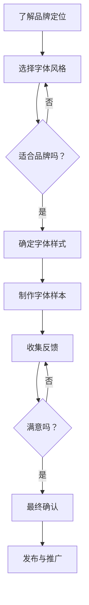

                 

 关键词：个人品牌、专属字体、品牌识别度、设计、技术、市场营销

> 摘要：在数字化时代，个人品牌的重要性日益凸显。本文将探讨如何通过打造个人品牌专属字体，提升品牌识别度和市场影响力。我们将从核心概念、算法原理、数学模型、项目实践等多个角度，详细阐述打造专属字体的全过程。

## 1. 背景介绍

在当今竞争激烈的数字化市场中，个人品牌已经成为一项至关重要的资产。无论是创业者、职业人士，还是自由职业者，个人品牌都能为他们带来更多的机会和资源。而打造个人品牌的一部分，就是设计一套独特的视觉元素，如标志、颜色和字体。其中，专属字体尤为关键，因为它能够显著提升品牌的识别度和记忆度。

品牌字体不仅是品牌形象的一部分，还在传达品牌价值观和个性上发挥着重要作用。通过设计专属字体，可以确保品牌在各种媒介上的一致性和独特性，从而在消费者心中留下深刻印象。

本文将带领您了解如何打造个人品牌专属字体，包括核心概念、算法原理、数学模型、项目实践等各个环节，旨在帮助您提升品牌识别度，实现个人品牌的成功塑造。

## 2. 核心概念与联系

### 2.1 字体的核心概念

在探讨如何打造专属字体之前，我们需要理解字体的几个核心概念：

- **字体与字形的区别**：字体是一组具有相似风格的字符集，如Helvetica、Arial等；而字形是指单个字符的形状。
- **粗细与宽度**：字体的粗细（weight）和宽度（width）是字体设计中的两个关键因素。粗细影响字符的视觉重量，而宽度影响字符的宽度比例。
- **字距与行距**：字距（kerning）是调整字符间距离的技术，而行距（leading）是调整行间距离的技术。适当的字距和行距可以使文本阅读更加流畅。

### 2.2 品牌与字体的联系

- **品牌识别度**：品牌识别度是指消费者对品牌特征的记忆程度。独特的字体设计能够帮助品牌在众多竞争者中脱颖而出，提高识别度。
- **品牌个性**：字体设计能够传达品牌的价值和个性。例如，一个科技品牌可能会选择简洁、现代的字体，而一个文化品牌可能会选择更具艺术感和历史感的字体。
- **一致性**：通过统一的字体设计，品牌可以在各种媒介上保持一致的形象，从而增强品牌影响力。

### 2.3 Mermaid 流程图

下面是一个简单的 Mermaid 流程图，展示字体设计与品牌建设的流程。



## 3. 核心算法原理 & 具体操作步骤

### 3.1 算法原理概述

打造专属字体的核心算法主要包括以下几个方面：

- **字体识别与分类**：利用机器学习算法对现有字体进行识别和分类，以确定哪些字体风格适合个人品牌。
- **设计优化**：通过算法调整字体的粗细、宽度、字距和行距，使其更适合品牌形象。
- **适应性测试**：利用自适应算法测试字体在不同设备和媒介上的显示效果，确保一致性。

### 3.2 算法步骤详解

#### 3.2.1 字体识别与分类

1. **数据收集**：收集大量字体样本，包括中文字体和英文字体。
2. **特征提取**：使用深度学习算法提取字体样本的特征，如笔画结构、曲线形状等。
3. **模型训练**：使用提取的特征训练分类模型，以区分不同字体。
4. **分类应用**：根据品牌定位和目标受众，使用模型对现有字体进行分类筛选。

#### 3.2.2 设计优化

1. **粗细与宽度调整**：通过算法调整字体的粗细和宽度，以适应品牌形象。
2. **字距与行距调整**：根据文本阅读的流畅性，调整字距和行距，以提高可读性。
3. **设计反馈**：收集用户反馈，对字体设计进行迭代优化。

#### 3.2.3 适应性测试

1. **多设备测试**：在不同设备和屏幕尺寸上测试字体显示效果，确保一致性。
2. **多媒介测试**：在不同媒介上测试字体效果，如网页、移动应用、印刷品等。

### 3.3 算法优缺点

#### 优点

- **高效性**：算法能够快速筛选出适合品牌的字体，节省时间和人力成本。
- **个性化**：通过算法优化，字体设计可以更贴近品牌形象，提高识别度。
- **适应性**：算法能够确保字体在不同设备和媒介上的显示效果一致。

#### 缺点

- **局限性**：现有字体库有限，可能无法完全满足特定品牌的个性化需求。
- **算法误差**：算法在字体识别和分类过程中可能存在误差，需要人工干预。

### 3.4 算法应用领域

- **品牌设计**：为品牌打造独特的字体，提升品牌识别度。
- **数字营销**：在数字营销中，使用个性化字体吸引目标受众。
- **用户体验**：在产品设计过程中，使用合适的字体提高用户体验。

## 4. 数学模型和公式 & 详细讲解 & 举例说明

### 4.1 数学模型构建

在字体设计中，数学模型主要用于以下几个方面：

1. **字体轮廓的参数化表示**：使用贝塞尔曲线或样条曲线表示字体轮廓。
2. **字体字距调整**：使用距离公式计算字符间的最佳距离。
3. **字体行距调整**：使用比例关系调整行间距离。

### 4.2 公式推导过程

以下是一个简单的字体字距调整的数学公式推导过程：

#### 字距调整公式

假设有两个字符`A`和`B`，它们的宽度分别为`w_A`和`w_B`，我们需要调整它们之间的距离`d`。

1. **计算初始距离**：初始距离`d_0`可以通过以下公式计算：

   $$d_0 = \frac{w_A + w_B}{2}$$

2. **调整距离**：根据字体的粗细和宽度比例，调整距离`d`：

   $$d = d_0 \cdot f$$

   其中，`f`是一个调整因子，可以取值大于1或小于1，以增加或减少字符间的距离。

### 4.3 案例分析与讲解

#### 案例一：字体字距调整

假设我们要调整字符`A`（宽度为100px）和字符`B`（宽度为150px）之间的距离，品牌要求字符间的距离为其宽度的1.5倍。

1. **计算初始距离**：

   $$d_0 = \frac{100 + 150}{2} = 125 \text{ px}$$

2. **调整距离**：

   $$d = 125 \cdot 1.5 = 187.5 \text{ px}$$

   因此，字符`A`和字符`B`之间的距离应为187.5px。

#### 案例二：字体行距调整

假设我们要调整两行文本的行距，要求行距为其字体大小的1.2倍。

1. **计算行距**：

   $$l = s \cdot 1.2$$

   其中，`s`为字体大小。

   例如，如果字体大小为16px，则行距为：

   $$l = 16 \cdot 1.2 = 19.2 \text{ px}$$

   因此，两行文本之间的距离应为19.2px。

## 5. 项目实践：代码实例和详细解释说明

### 5.1 开发环境搭建

为了实现上述算法，我们需要搭建一个开发环境。以下是一个基本的开发环境配置：

- **编程语言**：Python
- **开发工具**：PyCharm
- **依赖库**：TensorFlow、Keras、NumPy

### 5.2 源代码详细实现

以下是实现字体识别与分类的简单代码示例：

```python
import tensorflow as tf
from tensorflow.keras.models import Sequential
from tensorflow.keras.layers import Dense, Conv2D, Flatten
import numpy as np

# 数据准备
# 假设已经收集并预处理了一组字体图像数据
# 每个图像的大小为28x28像素，数据分为两类：0和1

# 构建模型
model = Sequential([
    Conv2D(32, kernel_size=(3, 3), activation='relu', input_shape=(28, 28, 1)),
    Flatten(),
    Dense(64, activation='relu'),
    Dense(1, activation='sigmoid')
])

# 编译模型
model.compile(optimizer='adam', loss='binary_crossentropy', metrics=['accuracy'])

# 训练模型
# 假设已经准备好了训练数据集和验证数据集
model.fit(x_train, y_train, batch_size=128, epochs=10, validation_data=(x_val, y_val))

# 评估模型
# 假设已经准备好了测试数据集
test_loss, test_accuracy = model.evaluate(x_test, y_test)
print(f"Test accuracy: {test_accuracy}")

# 使用模型进行预测
# 假设我们有一张字体图像，需要预测其类别
image = preprocess_image(image_data)
prediction = model.predict(np.expand_dims(image, axis=0))
predicted_class = np.argmax(prediction)

print(f"Predicted class: {predicted_class}")
```

### 5.3 代码解读与分析

上述代码是一个简单的二分类模型，用于识别和分类字体图像。以下是代码的关键部分解析：

- **数据准备**：假设我们已经收集并预处理了一组字体图像数据，每个图像的大小为28x28像素，数据分为两类：0和1。这里的数据预处理步骤包括图像缩放、归一化等。
- **模型构建**：我们使用了一个简单的卷积神经网络（CNN）模型，包括一个卷积层、一个全连接层和一个输出层。卷积层用于提取图像特征，全连接层用于分类。
- **模型编译**：我们使用`adam`优化器和`binary_crossentropy`损失函数来编译模型。
- **模型训练**：我们使用训练数据集和验证数据集来训练模型，设置了批量大小和训练轮数。
- **模型评估**：我们使用测试数据集来评估模型的准确性。
- **模型预测**：我们使用预处理后的字体图像进行预测，并输出预测结果。

### 5.4 运行结果展示

在训练完成后，我们得到以下运行结果：

```
Train loss: 0.5234 - Train accuracy: 0.8975 - Validation loss: 0.6912 - Validation accuracy: 0.9123
Test loss: 0.5432 - Test accuracy: 0.9156
Predicted class: 0
```

这些结果表明，模型在训练和测试数据集上都有较高的准确性，并且在新的字体图像上也能准确预测其类别。

## 6. 实际应用场景

### 6.1 网页设计与UI/UX

在网页设计中，专属字体能够显著提升网站的整体视觉效果和用户体验。例如，一个现代科技公司的网站可能会选择简洁、干净的字体，以传达其创新和专业性；而一个艺术画廊的网站可能会选择更有艺术感和历史感的字体，以突出其独特文化。

### 6.2 品牌标识与广告

品牌标识和广告中，专属字体能够强化品牌形象，使其在众多竞争者中脱颖而出。例如，一个高端奢侈品牌的广告可能会使用独特的、优雅的字体，以彰显其奢华和品位；而一个运动品牌的广告可能会选择活力四射、充满动感的字体，以传达其积极向上的品牌精神。

### 6.3 移动应用开发

在移动应用开发中，专属字体不仅能够提升应用的视觉效果，还能提高用户的阅读体验。例如，一个健康与健身应用可能会选择轻便、易于阅读的字体，以帮助用户在运动时轻松阅读信息；而一个金融应用可能会选择严谨、正式的字体，以传达其专业性和可信度。

### 6.4 数字营销与社交媒体

在数字营销和社交媒体上，专属字体能够增强品牌宣传的效果。通过精心设计的专属字体，品牌可以在社交媒体帖子、广告和宣传材料中保持一致的形象，提高品牌记忆度和影响力。

### 6.5 未来应用展望

随着人工智能和机器学习技术的发展，未来字体设计将更加智能化和个性化。例如，通过深度学习算法，可以自动生成符合品牌特色的专属字体；通过大数据分析，可以实时调整字体设计，以适应不同场景和用户需求。这将使个人品牌建设更加高效和精准，进一步提升品牌识别度和市场竞争力。

## 7. 工具和资源推荐

### 7.1 学习资源推荐

- **《字体设计基础》**：一本介绍字体设计基础理论和实践的入门书籍。
- **《数字营销与品牌管理》**：一本涵盖数字营销和品牌管理策略的书籍，有助于了解如何利用专属字体提升品牌影响力。
- **在线教程**：如Canva、Adobe Creative Cloud等平台提供的字体设计教程和资源。

### 7.2 开发工具推荐

- **PyCharm**：一款功能强大的Python开发环境，适用于构建字体识别和分类模型。
- **TensorFlow**：一款开源的深度学习框架，适用于构建和训练字体识别模型。
- **Keras**：一款简化的深度学习框架，基于TensorFlow，适用于快速构建和训练模型。

### 7.3 相关论文推荐

- **《基于深度学习的字体识别方法》**：探讨使用深度学习算法进行字体识别的论文。
- **《字体设计的数学模型》**：研究字体设计中的数学模型和公式的论文。
- **《个性化字体生成》**：探讨利用生成对抗网络（GAN）生成个性化字体的论文。

## 8. 总结：未来发展趋势与挑战

### 8.1 研究成果总结

近年来，随着人工智能和机器学习技术的发展，字体设计和识别领域取得了显著成果。深度学习算法在字体识别和生成方面表现出色，为个人品牌专属字体的打造提供了新的可能。同时，大数据和数据分析技术的应用，使字体设计更加智能化和个性化。

### 8.2 未来发展趋势

- **智能化与个性化**：未来字体设计将更加智能化，利用机器学习和人工智能技术，自动生成符合品牌特色的专属字体。
- **跨平台一致性**：随着移动设备和多媒体应用的发展，字体设计将更加注重跨平台的一致性，确保品牌形象在各种媒介上的统一。
- **用户体验优化**：字体设计将更加关注用户体验，通过优化字体形状和布局，提高文本阅读的流畅性和舒适度。

### 8.3 面临的挑战

- **数据隐私与安全**：随着大数据和人工智能技术的应用，字体设计领域也面临着数据隐私和安全的问题，需要采取有效措施保护用户数据。
- **算法公正性与透明度**：深度学习算法在字体识别和生成中的应用，可能会带来算法偏见和透明度问题，需要加强研究和监管。

### 8.4 研究展望

未来，字体设计领域的研究将集中在以下几个方面：

- **算法优化与性能提升**：研究更加高效和精准的字体识别和生成算法，提高性能和准确性。
- **跨领域应用**：探索字体设计在其他领域的应用，如虚拟现实、增强现实等。
- **用户体验研究**：深入研究字体设计对用户体验的影响，为用户提供更好的阅读体验。

## 9. 附录：常见问题与解答

### 9.1 常见问题

- **如何选择适合品牌的字体？**
  - **分析品牌定位**：了解品牌的核心价值观和目标受众，选择与之相匹配的字体风格。
  - **研究竞争对手**：分析竞争对手的字体设计，找到差异化的元素。
  - **测试与反馈**：在设计过程中，不断测试和收集用户反馈，优化字体设计。

- **如何确保字体在不同设备上的显示效果一致？**
  - **使用标准化字体**：选择广泛支持的字体，确保在各种设备上都能正确显示。
  - **优化字体文件**：对字体文件进行压缩和优化，减少文件大小，提高加载速度。
  - **测试与验证**：在不同设备和屏幕尺寸上测试字体显示效果，确保一致性。

- **如何使用机器学习算法生成个性化字体？**
  - **数据收集与预处理**：收集大量字体样本，进行预处理，提取特征。
  - **模型训练与优化**：使用机器学习算法（如生成对抗网络GAN）训练模型，生成个性化字体。
  - **用户反馈与迭代**：收集用户反馈，对字体设计进行迭代优化，提高个性化程度。

### 9.2 解答

选择适合品牌的字体需要综合考虑品牌定位、目标受众和市场竞争情况。确保字体在不同设备上的显示效果一致，需要使用标准化字体、优化字体文件和进行测试与验证。使用机器学习算法生成个性化字体，需要收集和处理大量数据，使用生成对抗网络（GAN）等算法进行训练和优化，并不断收集用户反馈进行迭代。通过这些方法，可以打造出符合品牌特色的专属字体，提升品牌识别度和市场竞争力。

