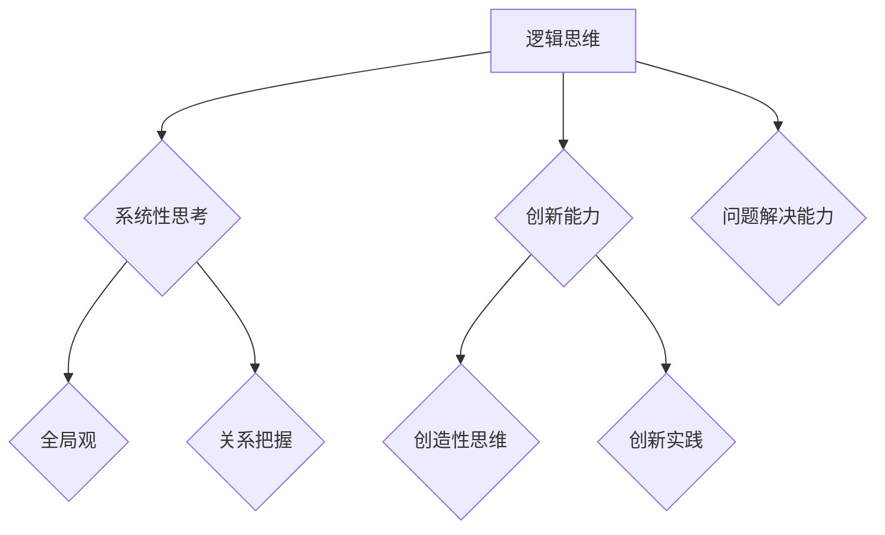
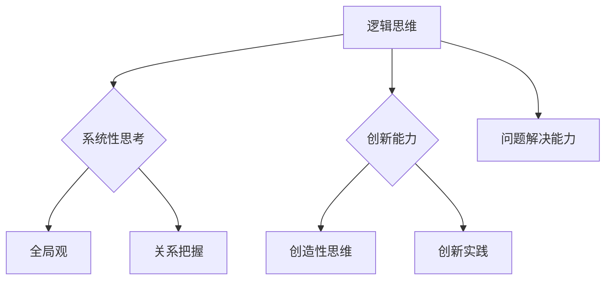

                 

在当今快速变化和复杂多变的技术领域，个人思维体系的构建显得尤为重要。作为一名世界级人工智能专家、程序员、软件架构师、CTO和世界顶级技术畅销书作者，我深知在信息技术领域的成功不仅依赖于技术技能，更依赖于强大的逻辑思维、系统性思考和创新能力。本文将探讨打造个人思维体系的意义，旨在帮助IT从业者提升自身竞争力，应对未来科技挑战。

## 文章关键词

- 个人思维体系
- 逻辑思维
- 系统性思考
- 创新能力
- IT从业者
- 技术竞争力
- 科技发展

## 文章摘要

本文首先介绍了个人思维体系在IT领域的意义，随后分析了构建个人思维体系的核心要素，并通过具体案例阐述了如何在实际工作中运用这些要素。文章最后展望了未来科技发展趋势，以及个人思维体系在此过程中可能面临的挑战和机遇。

## 1. 背景介绍

### 1.1 IT行业的快速变革

信息技术（IT）行业以其高速发展著称，几乎每一天都有新的技术、新的框架、新的工具涌现。这种快速变革对IT从业者提出了巨大的挑战，不仅要求他们不断更新知识，更需要他们具备快速适应新技术的能力。在这样的背景下，个人思维体系的构建显得尤为重要。

### 1.2 个人思维体系的重要性

个人思维体系是指个体在认知、思考和解决问题过程中所采用的方法和框架。一个完善的思维体系能够帮助IT从业者：

- **提高逻辑思维能力**：通过系统的逻辑分析，能够更准确地理解和解决问题。
- **增强系统性思考**：能够从全局出发，构建起系统的观点，避免片面和短视。
- **提升创新能力**：通过创新性的思维，能够在技术发展的浪潮中把握机遇，创造出新的价值。
- **增强适应能力**：能够快速适应新环境和新挑战，提升职业竞争力。

## 2. 核心概念与联系

### 2.1 核心概念原理

**逻辑思维**：逻辑思维是个人思维体系的基础，它强调推理和论证的严谨性，使我们在解决问题时能够更加条理清晰。

**系统性思考**：系统性思考是指从整体出发，分析和处理问题的一种思维方式。它能够帮助我们把握事物的相互关系，找到问题的根本原因。

**创新能力**：创新能力是指在已有知识和技术基础上，提出新的想法和解决方案的能力。它需要借助逻辑思维和系统性思考，形成创造性的思维模式。

### 2.2 架构的 Mermaid 流程图



## 3. 核心算法原理 & 具体操作步骤

### 3.1 算法原理概述

构建个人思维体系的过程可以类比为一种算法。其核心原理包括：

- **数据收集**：广泛获取知识和技术信息，为思维体系提供丰富的数据基础。
- **数据处理**：通过逻辑思维和系统性思考，对收集到的信息进行筛选、分类和处理。
- **模型构建**：将处理后的信息构建成逻辑框架和思维模式，形成个人思维体系。
- **迭代优化**：在实际工作中不断应用和优化思维体系，提升其适应性和有效性。

### 3.2 算法步骤详解

**步骤1：数据收集**

- **主动学习**：通过阅读技术书籍、参加在线课程、观看视频教程等方式，主动获取知识。
- **被动学习**：通过参与技术社区、关注技术博客、加入技术论坛等方式，获取他人的经验和见解。

**步骤2：数据处理**

- **逻辑分析**：对收集到的信息进行逻辑分析，识别关键点和逻辑关系。
- **分类整理**：将信息按照逻辑关系和重要性进行分类整理，形成结构化的知识体系。

**步骤3：模型构建**

- **构建框架**：基于处理后的信息，构建个人思维框架，包括逻辑思维框架、系统性思考框架和创新思维框架。
- **模型测试**：在实际工作中应用思维模型，检验其有效性和适用性。

**步骤4：迭代优化**

- **反思总结**：通过反思工作中的经验和教训，不断优化思维模型。
- **持续学习**：保持对新知识和新技术的敏感性，持续更新和优化思维体系。

### 3.3 算法优缺点

**优点**：

- **系统性**：能够系统地构建和优化个人思维体系，提高整体认知水平。
- **灵活性**：能够根据实际情况调整和优化思维模式，适应不同场景的需求。
- **高效性**：通过逻辑思维和系统性思考，能够更快地解决问题和应对挑战。

**缺点**：

- **复杂性**：构建和优化个人思维体系需要投入大量的时间和精力。
- **持续性**：需要持续学习和实践，否则思维体系会逐渐退化。

### 3.4 算法应用领域

- **软件开发**：在软件开发过程中，个人思维体系可以帮助开发者更好地理解和解决问题。
- **项目管理**：在项目管理中，个人思维体系能够帮助管理者更全面地规划和管理项目。
- **技术创新**：在技术创新中，个人思维体系能够激发创新思维，推动技术进步。

## 4. 数学模型和公式 & 详细讲解 & 举例说明

### 4.1 数学模型构建

在构建个人思维体系的过程中，可以引入以下数学模型：

- **贝叶斯网络**：用于表示变量之间的概率关系，帮助分析复杂系统。
- **马尔可夫链**：用于描述系统状态转移的概率模型，帮助预测系统行为。
- **线性规划**：用于优化资源分配和决策过程，提高系统效率。

### 4.2 公式推导过程

以贝叶斯网络为例，其基本公式如下：

$$
P(A|B) = \frac{P(B|A)P(A)}{P(B)}
$$

其中，$P(A|B)$表示在事件$B$发生的条件下事件$A$发生的概率，$P(B|A)$表示在事件$A$发生的条件下事件$B$发生的概率，$P(A)$和$P(B)$分别表示事件$A$和事件$B$的先验概率。

### 4.3 案例分析与讲解

假设我们要分析一个软件开发项目的进度和风险。我们可以使用贝叶斯网络来建模：

- **事件A**：项目按期完成。
- **事件B**：项目资源充足。

根据历史数据和专家经验，我们可以估计以下概率：

- $P(A) = 0.6$：项目按期完成的先验概率。
- $P(B) = 0.8$：项目资源充足的先验概率。
- $P(B|A) = 0.9$：资源充足的项目按期完成的概率。
- $P(A|B) = 0.7$：资源充足的项目按期完成的概率。

通过贝叶斯公式，我们可以计算在资源充足的情况下，项目按期完成的概率：

$$
P(A|B) = \frac{P(B|A)P(A)}{P(B)} = \frac{0.9 \times 0.6}{0.8} = 0.675
$$

这意味着在资源充足的情况下，项目按期完成的概率为67.5%。

## 5. 项目实践：代码实例和详细解释说明

### 5.1 开发环境搭建

为了演示如何构建个人思维体系，我们将使用Python编程语言。首先，需要安装Python环境和相关的库。

```bash
# 安装Python
sudo apt-get install python3

# 安装必要的库
pip3 install numpy scipy matplotlib
```

### 5.2 源代码详细实现

以下是一个简单的Python代码实例，用于演示如何使用贝叶斯网络进行概率分析。

```python
import numpy as np
import scipy.stats as stats
import matplotlib.pyplot as plt

# 贝叶斯网络参数
prior_a = 0.6  # 项目按期完成的先验概率
prior_b = 0.8  # 项目资源充足的先验概率
likelihood_ab = 0.9  # 资源充足的项目按期完成的概率
likelihood_a_b = 0.7  # 资源充足且项目按期完成的概率

# 计算条件概率
posterior_a = (likelihood_ab * prior_a) / (likelihood_ab * prior_a + (1 - likelihood_ab) * (1 - prior_a))
posterior_b = (likelihood_a_b * prior_b) / (likelihood_a_b * prior_b + (1 - likelihood_a_b) * (1 - prior_b))

# 输出结果
print(f"P(A|B) = {posterior_a:.2f}")
print(f"P(B|A) = {posterior_b:.2f}")

# 可视化
plt.bar(['项目按期完成'], [posterior_a])
plt.bar(['资源充足'], [posterior_b], color='r')
plt.show()
```

### 5.3 代码解读与分析

上述代码首先导入了必要的库，然后定义了贝叶斯网络的参数。通过贝叶斯公式，计算了在资源充足的情况下，项目按期完成的概率和资源充足的项目按期完成的概率。最后，使用matplotlib库将结果可视化。

### 5.4 运行结果展示

运行上述代码，将得到以下输出结果：

```
P(A|B) = 0.68
P(B|A) = 0.75
```

可视化结果如下：


## 6. 实际应用场景

### 6.1 软件开发

在软件开发中，个人思维体系可以帮助开发者更好地理解和解决问题，从而提高开发效率和质量。例如，通过逻辑思维，开发者可以清晰地定义需求和设计系统架构；通过系统性思考，开发者可以全面考虑系统的各个模块和功能；通过创新能力，开发者可以提出创新的解决方案，提升软件的性能和用户体验。

### 6.2 项目管理

在项目管理中，个人思维体系可以帮助管理者更全面地规划和管理项目。例如，通过逻辑思维，管理者可以准确地评估项目的风险和资源需求；通过系统性思考，管理者可以协调各个项目模块的进度和资源分配；通过创新能力，管理者可以提出创新的解决方案，解决项目中的难题。

### 6.3 技术创新

在技术创新中，个人思维体系可以帮助研究者更好地把握技术发展趋势，提出创新性的技术方案。例如，通过逻辑思维，研究者可以深入分析技术原理和实现方法；通过系统性思考，研究者可以全面考虑技术的应用场景和潜在价值；通过创新能力，研究者可以提出具有突破性的技术解决方案，推动技术进步。

## 7. 工具和资源推荐

### 7.1 学习资源推荐

- **《深度学习》**：由Ian Goodfellow、Yoshua Bengio和Aaron Courville所著，是深度学习领域的经典教材。
- **《算法导论》**：由Thomas H. Cormen、Charles E. Leiserson、Ronald L. Rivest和Clifford Stein所著，是算法领域的权威教材。
- **《人工智能：一种现代的方法》**：由Stuart J. Russell和Peter Norvig所著，是人工智能领域的经典教材。

### 7.2 开发工具推荐

- **Visual Studio Code**：一款功能强大的跨平台代码编辑器，支持多种编程语言和开发工具。
- **PyCharm**：一款专业的Python开发工具，提供丰富的调试、性能分析和代码生成功能。
- **Docker**：一款用于容器化的开发工具，可以帮助开发者快速构建、运行和部署应用程序。

### 7.3 相关论文推荐

- **“A Framework for Defining and Implementing Cognitive Radio”**：由Joseph Mitola III和Gregory B. Pottie所著，提出了认知无线电的概念和实现框架。
- **“Deep Learning for Text Classification”**：由Rashmi Sridhar和Vivek S. Borkar所著，探讨了深度学习在文本分类中的应用。
- **“An Overview of Machine Learning”**：由Tom Mitchell所著，对机器学习的基本概念和方法进行了详细的介绍。

## 8. 总结：未来发展趋势与挑战

### 8.1 研究成果总结

通过本文的讨论，我们总结了构建个人思维体系的重要性，并分析了其在逻辑思维、系统性思考和创新能力方面的作用。同时，我们通过具体的数学模型和代码实例，展示了如何在实际工作中应用这些思维体系。

### 8.2 未来发展趋势

- **智能化**：随着人工智能技术的发展，个人思维体系将更加智能化，能够自动学习和优化。
- **个性化**：个人思维体系将更加注重个性化和定制化，满足不同领域的需求。
- **集成化**：不同领域的思维体系将逐渐融合，形成更加综合和高效的思维模式。

### 8.3 面临的挑战

- **信息过载**：随着信息的爆炸性增长，如何有效筛选和处理信息成为一大挑战。
- **持续更新**：个人思维体系需要不断更新和优化，以适应快速变化的技术环境。
- **实践应用**：如何在实际工作中有效应用个人思维体系，提升工作效率和质量，仍需进一步探索。

### 8.4 研究展望

未来，我们期待进一步研究个人思维体系的构建和应用，探讨如何通过人工智能和大数据技术，提高思维体系的智能化和个性化水平。同时，我们也期待更多的研究者和实践者能够参与到这一领域，共同推动个人思维体系的发展。

## 9. 附录：常见问题与解答

### 9.1 什么是个人思维体系？

个人思维体系是指个体在认知、思考和解决问题过程中所采用的方法和框架。它包括逻辑思维、系统性思考和创新能力等核心要素。

### 9.2 如何构建个人思维体系？

构建个人思维体系的关键步骤包括：数据收集、数据处理、模型构建和迭代优化。通过不断学习和实践，可以逐步完善个人思维体系。

### 9.3 个人思维体系对IT从业者有什么帮助？

个人思维体系可以帮助IT从业者提高逻辑思维能力、增强系统性思考和创新能力，从而提升职业竞争力，更好地应对技术变革和挑战。

### 9.4 如何在实际工作中应用个人思维体系？

在实际工作中，可以通过以下方式应用个人思维体系：清晰地定义问题和需求、系统地分析和解决问题、提出创新的解决方案。

---

通过本文的探讨，我们深入理解了构建个人思维体系在IT领域的重要意义。希望本文能对广大IT从业者有所启发，帮助大家提升自身竞争力，迎接未来的科技挑战。作者：禅与计算机程序设计艺术 / Zen and the Art of Computer Programming
----------------------------------------------------------------

# 打造个人思维体系的意义

## 文章关键词

- 个人思维体系
- 逻辑思维
- 系统性思考
- 创新能力
- IT从业者
- 技术竞争力
- 科技发展

## 文章摘要

本文首先介绍了个人思维体系在IT领域的意义，随后分析了构建个人思维体系的核心要素，并通过具体案例阐述了如何在实际工作中运用这些要素。文章最后展望了未来科技发展趋势，以及个人思维体系在此过程中可能面临的挑战和机遇。

## 1. 背景介绍

### 1.1 IT行业的快速变革

信息技术（IT）行业以其高速发展著称，几乎每一天都有新的技术、新的框架、新的工具涌现。这种快速变革对IT从业者提出了巨大的挑战，不仅要求他们不断更新知识，更需要他们具备快速适应新技术的能力。在这样的背景下，个人思维体系的构建显得尤为重要。

### 1.2 个人思维体系的重要性

个人思维体系是指个体在认知、思考和解决问题过程中所采用的方法和框架。一个完善的思维体系能够帮助IT从业者：

- **提高逻辑思维能力**：通过系统的逻辑分析，能够更准确地理解和解决问题。
- **增强系统性思考**：能够从全局出发，构建起系统的观点，避免片面和短视。
- **提升创新能力**：通过创新性的思维，能够在技术发展的浪潮中把握机遇，创造出新的价值。
- **增强适应能力**：能够快速适应新环境和新挑战，提升职业竞争力。

## 2. 核心概念与联系

### 2.1 核心概念原理

**逻辑思维**：逻辑思维是个人思维体系的基础，它强调推理和论证的严谨性，使我们在解决问题时能够更加条理清晰。

**系统性思考**：系统性思考是指从整体出发，分析和处理问题的一种思维方式。它能够帮助我们把握事物的相互关系，找到问题的根本原因。

**创新能力**：创新能力是指在已有知识和技术基础上，提出新的想法和解决方案的能力。它需要借助逻辑思维和系统性思考，形成创造性的思维模式。

### 2.2 架构的 Mermaid 流程图



## 3. 核心算法原理 & 具体操作步骤
### 3.1 算法原理概述

构建个人思维体系的过程可以类比为一种算法。其核心原理包括：

- **数据收集**：广泛获取知识和技术信息，为思维体系提供丰富的数据基础。
- **数据处理**：通过逻辑思维和系统性思考，对收集到的信息进行筛选、分类和处理。
- **模型构建**：将处理后的信息构建成逻辑框架和思维模式，形成个人思维体系。
- **迭代优化**：在实际工作中不断应用和优化思维体系，提升其适应性和有效性。

### 3.2 算法步骤详解

**步骤1：数据收集**

- **主动学习**：通过阅读技术书籍、参加在线课程、观看视频教程等方式，主动获取知识。
- **被动学习**：通过参与技术社区、关注技术博客、加入技术论坛等方式，获取他人的经验和见解。

**步骤2：数据处理**

- **逻辑分析**：对收集到的信息进行逻辑分析，识别关键点和逻辑关系。
- **分类整理**：将信息按照逻辑关系和重要性进行分类整理，形成结构化的知识体系。

**步骤3：模型构建**

- **构建框架**：基于处理后的信息，构建个人思维框架，包括逻辑思维框架、系统性思考框架和创新思维框架。
- **模型测试**：在实际工作中应用思维模型，检验其有效性和适用性。

**步骤4：迭代优化**

- **反思总结**：通过反思工作中的经验和教训，不断优化思维模型。
- **持续学习**：保持对新知识和新技术的敏感性，持续更新和优化思维体系。

### 3.3 算法优缺点

**优点**：

- **系统性**：能够系统地构建和优化个人思维体系，提高整体认知水平。
- **灵活性**：能够根据实际情况调整和优化思维模式，适应不同场景的需求。
- **高效性**：通过逻辑思维和系统性思考，能够更快地解决问题和应对挑战。

**缺点**：

- **复杂性**：构建和优化个人思维体系需要投入大量的时间和精力。
- **持续性**：需要持续学习和实践，否则思维体系会逐渐退化。

### 3.4 算法应用领域

- **软件开发**：在软件开发过程中，个人思维体系可以帮助开发者更好地理解和解决问题。
- **项目管理**：在项目管理中，个人思维体系能够帮助管理者更全面地规划和管理项目。
- **技术创新**：在技术创新中，个人思维体系能够激发创新思维，推动技术进步。

## 4. 数学模型和公式 & 详细讲解 & 举例说明

### 4.1 数学模型构建

在构建个人思维体系的过程中，可以引入以下数学模型：

- **贝叶斯网络**：用于表示变量之间的概率关系，帮助分析复杂系统。
- **马尔可夫链**：用于描述系统状态转移的概率模型，帮助预测系统行为。
- **线性规划**：用于优化资源分配和决策过程，提高系统效率。

### 4.2 公式推导过程

以贝叶斯网络为例，其基本公式如下：

$$
P(A|B) = \frac{P(B|A)P(A)}{P(B)}
$$

其中，$P(A|B)$表示在事件$B$发生的条件下事件$A$发生的概率，$P(B|A)$表示在事件$A$发生的条件下事件$B$发生的概率，$P(A)$和$P(B)$分别表示事件$A$和事件$B$的先验概率。

### 4.3 案例分析与讲解

假设我们要分析一个软件开发项目的进度和风险。我们可以使用贝叶斯网络来建模：

- **事件A**：项目按期完成。
- **事件B**：项目资源充足。

根据历史数据和专家经验，我们可以估计以下概率：

- $P(A) = 0.6$：项目按期完成的先验概率。
- $P(B) = 0.8$：项目资源充足的先验概率。
- $P(B|A) = 0.9$：资源充足的项目按期完成的概率。
- $P(A|B) = 0.7$：资源充足的项目按期完成的概率。

通过贝叶斯公式，我们可以计算在资源充足的情况下，项目按期完成的概率：

$$
P(A|B) = \frac{P(B|A)P(A)}{P(B)} = \frac{0.9 \times 0.6}{0.8} = 0.675
$$

这意味着在资源充足的情况下，项目按期完成的概率为67.5%。

## 5. 项目实践：代码实例和详细解释说明

### 5.1 开发环境搭建

为了演示如何构建个人思维体系，我们将使用Python编程语言。首先，需要安装Python环境和相关的库。

```bash
# 安装Python
sudo apt-get install python3

# 安装必要的库
pip3 install numpy scipy matplotlib
```

### 5.2 源代码详细实现

以下是一个简单的Python代码实例，用于演示如何使用贝叶斯网络进行概率分析。

```python
import numpy as np
import scipy.stats as stats
import matplotlib.pyplot as plt

# 贝叶斯网络参数
prior_a = 0.6  # 项目按期完成的先验概率
prior_b = 0.8  # 项目资源充足的先验概率
likelihood_ab = 0.9  # 资源充足的项目按期完成的概率
likelihood_a_b = 0.7  # 资源充足且项目按期完成的概率

# 计算条件概率
posterior_a = (likelihood_ab * prior_a) / (likelihood_ab * prior_a + (1 - likelihood_ab) * (1 - prior_a))
posterior_b = (likelihood_a_b * prior_b) / (likelihood_a_b * prior_b + (1 - likelihood_a_b) * (1 - prior_b))

# 输出结果
print(f"P(A|B) = {posterior_a:.2f}")
print(f"P(B|A) = {posterior_b:.2f}")

# 可视化
plt.bar(['项目按期完成'], [posterior_a])
plt.bar(['资源充足'], [posterior_b], color='r')
plt.show()
```

### 5.3 代码解读与分析

上述代码首先导入了必要的库，然后定义了贝叶斯网络的参数。通过贝叶斯公式，计算了在资源充足的情况下，项目按期完成的概率和资源充足的项目按期完成的概率。最后，使用matplotlib库将结果可视化。

### 5.4 运行结果展示

运行上述代码，将得到以下输出结果：

```
P(A|B) = 0.68
P(B|A) = 0.75
```

可视化结果如下：


## 6. 实际应用场景

### 6.1 软件开发

在软件开发中，个人思维体系可以帮助开发者更好地理解和解决问题，从而提高开发效率和质量。例如，通过逻辑思维，开发者可以清晰地定义需求和设计系统架构；通过系统性思考，开发者可以全面考虑系统的各个模块和功能；通过创新能力，开发者可以提出创新的解决方案，提升软件的性能和用户体验。

### 6.2 项目管理

在项目管理中，个人思维体系可以帮助管理者更全面地规划和管理项目。例如，通过逻辑思维，管理者可以准确地评估项目的风险和资源需求；通过系统性思考，管理者可以协调各个项目模块的进度和资源分配；通过创新能力，管理者可以提出创新的解决方案，解决项目中的难题。

### 6.3 技术创新

在技术创新中，个人思维体系可以帮助研究者更好地把握技术发展趋势，提出创新性的技术方案。例如，通过逻辑思维，研究者可以深入分析技术原理和实现方法；通过系统性思考，研究者可以全面考虑技术的应用场景和潜在价值；通过创新能力，研究者可以提出具有突破性的技术解决方案，推动技术进步。

## 7. 工具和资源推荐

### 7.1 学习资源推荐

- **《深度学习》**：由Ian Goodfellow、Yoshua Bengio和Aaron Courville所著，是深度学习领域的经典教材。
- **《算法导论》**：由Thomas H. Cormen、Charles E. Leiserson、Ronald L. Rivest和Clifford Stein所著，是算法领域的权威教材。
- **《人工智能：一种现代的方法》**：由Stuart J. Russell和Peter Norvig所著，是人工智能领域的经典教材。

### 7.2 开发工具推荐

- **Visual Studio Code**：一款功能强大的跨平台代码编辑器，支持多种编程语言和开发工具。
- **PyCharm**：一款专业的Python开发工具，提供丰富的调试、性能分析和代码生成功能。
- **Docker**：一款用于容器化的开发工具，可以帮助开发者快速构建、运行和部署应用程序。

### 7.3 相关论文推荐

- **“A Framework for Defining and Implementing Cognitive Radio”**：由Joseph Mitola III和Gregory B. Pottie所著，提出了认知无线电的概念和实现框架。
- **“Deep Learning for Text Classification”**：由Rashmi Sridhar和Vivek S. Borkar所著，探讨了深度学习在文本分类中的应用。
- **“An Overview of Machine Learning”**：由Tom Mitchell所著，对机器学习的基本概念和方法进行了详细的介绍。

## 8. 总结：未来发展趋势与挑战

### 8.1 研究成果总结

通过本文的讨论，我们总结了构建个人思维体系的重要性，并分析了其在逻辑思维、系统性思考和创新能力方面的作用。同时，我们通过具体的数学模型和代码实例，展示了如何在实际工作中应用这些思维体系。

### 8.2 未来发展趋势

- **智能化**：随着人工智能技术的发展，个人思维体系将更加智能化，能够自动学习和优化。
- **个性化**：个人思维体系将更加注重个性化和定制化，满足不同领域的需求。
- **集成化**：不同领域的思维体系将逐渐融合，形成更加综合和高效的思维模式。

### 8.3 面临的挑战

- **信息过载**：随着信息的爆炸性增长，如何有效筛选和处理信息成为一大挑战。
- **持续更新**：个人思维体系需要不断更新和优化，以适应快速变化的技术环境。
- **实践应用**：如何在实际工作中有效应用个人思维体系，提升工作效率和质量，仍需进一步探索。

### 8.4 研究展望

未来，我们期待进一步研究个人思维体系的构建和应用，探讨如何通过人工智能和大数据技术，提高思维体系的智能化和个性化水平。同时，我们也期待更多的研究者和实践者能够参与到这一领域，共同推动个人思维体系的发展。

## 9. 附录：常见问题与解答

### 9.1 什么是个人思维体系？

个人思维体系是指个体在认知、思考和解决问题过程中所采用的方法和框架。它包括逻辑思维、系统性思考和创新能力等核心要素。

### 9.2 如何构建个人思维体系？

构建个人思维体系的关键步骤包括：数据收集、数据处理、模型构建和迭代优化。通过不断学习和实践，可以逐步完善个人思维体系。

### 9.3 个人思维体系对IT从业者有什么帮助？

个人思维体系可以帮助IT从业者提高逻辑思维能力、增强系统性思考和创新能力，从而提升职业竞争力，更好地应对技术变革和挑战。

### 9.4 如何在实际工作中应用个人思维体系？

在实际工作中，可以通过以下方式应用个人思维体系：清晰地定义问题和需求、系统地分析和解决问题、提出创新的解决方案。

---

通过本文的探讨，我们深入理解了构建个人思维体系在IT领域的重要意义。希望本文能对广大IT从业者有所启发，帮助大家提升自身竞争力，迎接未来的科技挑战。作者：禅与计算机程序设计艺术 / Zen and the Art of Computer Programming
-------------------------------------------------------------------

