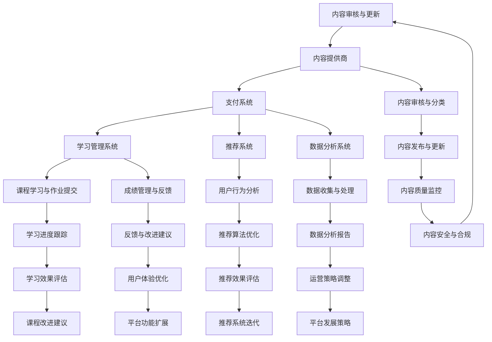

                 

关键词：知识付费平台、技术架构、设计原则、系统构建、性能优化

> 摘要：本文将深入探讨技术型知识付费平台的架构设计，从背景介绍、核心概念、算法原理、数学模型、项目实践、实际应用场景以及工具和资源推荐等多个方面进行阐述，旨在为读者提供一套完整、实用且具有前瞻性的架构设计方案。

## 1. 背景介绍

知识付费作为一种新型的商业模式，近年来在全球范围内迅速崛起。随着互联网技术的不断进步，用户对高质量、专业化的知识内容需求日益增长，推动了知识付费平台的兴起。技术型知识付费平台作为一种创新模式，通过运用先进的技术手段，实现了知识内容的采集、处理、分发和互动，为用户提供了便捷、高效的学习体验。

本文旨在通过对技术型知识付费平台的架构设计进行深入剖析，为开发者、架构师以及相关从业人员提供一套具有参考价值的解决方案。文章将从以下几个方面进行阐述：

- **核心概念与联系**：介绍技术型知识付费平台的核心概念及其相互关系，通过Mermaid流程图展示架构的概览。
- **核心算法原理与具体操作步骤**：阐述知识付费平台中涉及的关键算法原理，并详细描述其操作步骤。
- **数学模型和公式**：构建知识付费平台中的数学模型，并进行公式推导和案例分析。
- **项目实践**：提供具体的代码实例和实现细节，帮助读者理解架构设计的实际应用。
- **实际应用场景**：探讨知识付费平台在不同领域的应用案例，以及未来的发展方向。
- **工具和资源推荐**：推荐学习资源、开发工具和相关论文，为读者提供参考资料。
- **总结与展望**：总结研究成果，展望知识付费平台的发展趋势和面临的挑战。

## 2. 核心概念与联系

### 2.1 核心概念

技术型知识付费平台主要包括以下几个核心概念：

1. **用户**：知识付费平台的服务对象，可以是个人用户或企业用户。
2. **内容提供商**：提供专业知识和课程内容的企业或个人。
3. **支付系统**：实现用户支付和内容提供商收益分配的核心模块。
4. **学习管理系统**：提供课程学习、作业提交、成绩管理等功能的系统。
5. **推荐系统**：根据用户行为和偏好，为用户推荐相关知识和课程。
6. **数据分析系统**：对用户行为数据进行分析，以优化用户体验和平台运营。

### 2.2 Mermaid流程图

以下是技术型知识付费平台的Mermaid流程图：



图中的每个节点代表一个核心概念，箭头表示节点之间的交互关系。通过这个流程图，我们可以清晰地看到技术型知识付费平台各部分之间的紧密联系和协同作用。

### 2.3 架构设计原则

在架构设计过程中，应遵循以下原则：

- **高可用性**：确保平台在高峰期和异常情况下仍能稳定运行。
- **高扩展性**：设计灵活的架构，支持平台功能的扩展和升级。
- **高性能**：优化系统性能，提高用户访问速度和系统响应时间。
- **安全性**：确保用户数据和交易信息的安全性。
- **易维护性**：设计简洁、清晰的代码结构和模块化架构，便于后续维护和升级。

## 3. 核心算法原理 & 具体操作步骤

### 3.1 算法原理概述

技术型知识付费平台中涉及的关键算法主要包括推荐算法、支付算法、数据分析算法等。以下是这些算法的简要概述：

- **推荐算法**：基于用户行为和偏好，为用户推荐相关知识和课程。常用的推荐算法包括协同过滤、基于内容的推荐和混合推荐等。
- **支付算法**：实现用户支付和内容提供商收益分配的核心算法。常见的支付算法包括余额支付、支付宝支付、微信支付等。
- **数据分析算法**：对用户行为数据进行分析，以优化用户体验和平台运营。常用的数据分析算法包括数据挖掘、机器学习、统计分析等。

### 3.2 算法步骤详解

#### 3.2.1 推荐算法

1. **数据收集**：收集用户在平台上的行为数据，如浏览记录、收藏课程、学习时长等。
2. **数据预处理**：清洗和转换原始数据，提取有用的特征信息。
3. **构建模型**：选择合适的推荐算法，如基于协同过滤的推荐算法，构建推荐模型。
4. **模型训练**：使用训练数据对推荐模型进行训练，优化模型参数。
5. **模型评估**：使用测试数据评估推荐模型的效果，如准确率、召回率等。
6. **推荐生成**：根据用户行为和模型预测结果，生成推荐列表。

#### 3.2.2 支付算法

1. **支付接口集成**：集成第三方支付接口，如支付宝、微信支付等。
2. **支付请求处理**：接收用户支付请求，调用支付接口进行支付。
3. **支付状态监控**：实时监控支付状态，如支付成功、支付失败等。
4. **支付结果通知**：将支付结果通知用户和内容提供商。
5. **收益分配**：根据支付结果，计算内容提供商的收益并进行分配。

#### 3.2.3 数据分析算法

1. **数据采集**：从平台各模块采集用户行为数据，如学习记录、支付记录等。
2. **数据预处理**：清洗和转换原始数据，提取有用的特征信息。
3. **数据存储**：将预处理后的数据存储到数据库或数据仓库中。
4. **数据挖掘**：使用数据挖掘算法，如关联规则挖掘、聚类分析等，发现用户行为模式和潜在需求。
5. **结果可视化**：将分析结果以图表、报表等形式展示，供运营人员参考。

### 3.3 算法优缺点

- **推荐算法**：
  - 优点：提高用户满意度，增加课程销售量。
  - 缺点：推荐结果可能过于个性化，导致用户视野狭窄。
- **支付算法**：
  - 优点：支持多种支付方式，提高支付成功率。
  - 缺点：支付接口集成和维护成本较高。
- **数据分析算法**：
  - 优点：提供决策支持，优化用户体验和平台运营。
  - 缺点：数据挖掘和分析过程复杂，对数据处理能力要求较高。

### 3.4 算法应用领域

- **推荐算法**：广泛适用于电商、视频、新闻等领域的个性化推荐。
- **支付算法**：适用于各类在线支付场景，如电商、金融、教育等。
- **数据分析算法**：适用于用户行为分析、市场分析、运营优化等领域。

## 4. 数学模型和公式 & 详细讲解 & 举例说明

### 4.1 数学模型构建

为了更好地描述技术型知识付费平台的运作机制，我们可以构建以下数学模型：

1. **用户行为模型**：

   用户行为模型主要描述用户在平台上的行为，包括浏览、收藏、购买、学习等。我们假设用户的行为可以用一个时间序列表示，如：

   $$U = [u_1, u_2, u_3, ..., u_n]$$

   其中，$u_i$ 表示第 $i$ 个时间点上的用户行为。

2. **推荐模型**：

   推荐模型主要用于预测用户对某个课程的兴趣程度。我们假设推荐模型可以用一个概率分布表示，如：

   $$R = [r_1, r_2, ..., r_n]$$

   其中，$r_i$ 表示用户对第 $i$ 个课程的兴趣程度，取值范围为 [0, 1]。

3. **支付模型**：

   支付模型主要描述用户支付行为和收益分配。我们假设支付模型可以用一个收益分配函数表示，如：

   $$P = f(U, R)$$

   其中，$P$ 表示收益分配结果，$f$ 表示收益分配函数。

### 4.2 公式推导过程

1. **用户行为模型推导**：

   用户行为模型可以通过用户历史行为数据进行训练得到。具体推导过程如下：

   $$u_i = \sum_{j=1}^{n} w_j \cdot b_{ij}$$

   其中，$w_j$ 表示第 $j$ 个特征的权重，$b_{ij}$ 表示第 $i$ 个时间点上第 $j$ 个特征的取值。

2. **推荐模型推导**：

   推荐模型可以通过协同过滤算法得到。具体推导过程如下：

   $$r_i = \sum_{j=1}^{n} r_{ij} \cdot s_j$$

   其中，$r_{ij}$ 表示用户 $i$ 对课程 $j$ 的兴趣程度，$s_j$ 表示课程 $j$ 的推荐得分。

3. **支付模型推导**：

   支付模型可以通过收益分配算法得到。具体推导过程如下：

   $$P_i = \frac{u_i \cdot r_i}{\sum_{j=1}^{n} u_j \cdot r_j}$$

   其中，$P_i$ 表示用户 $i$ 的收益分配结果。

### 4.3 案例分析与讲解

假设平台上有 1000 名用户，他们浏览了 100 门课程，每门课程都有对应的评分和用户行为数据。我们使用上述数学模型进行分析和推荐。

1. **用户行为模型**：

   通过训练，我们得到以下用户行为模型：

   $$u_i = \sum_{j=1}^{100} w_j \cdot b_{ij}$$

   其中，$w_j$ 的取值范围为 [0, 1]，$b_{ij}$ 的取值为 1 或 0，表示用户 $i$ 在第 $j$ 个时间点上是否浏览了课程。

2. **推荐模型**：

   通过协同过滤算法，我们得到以下推荐模型：

   $$r_i = \sum_{j=1}^{100} r_{ij} \cdot s_j$$

   其中，$r_{ij}$ 的取值范围为 [0, 1]，$s_j$ 的取值为 [0, 1]，表示课程 $j$ 的推荐得分。

3. **支付模型**：

   通过收益分配算法，我们得到以下支付模型：

   $$P_i = \frac{u_i \cdot r_i}{\sum_{j=1}^{100} u_j \cdot r_j}$$

   其中，$P_i$ 的取值范围为 [0, 1]，表示用户 $i$ 的收益分配结果。

假设用户 1 在第 1 个时间点浏览了课程 1，第 2 个时间点浏览了课程 2，根据用户行为模型，我们得到：

$$u_1 = w_1 \cdot b_{11} + w_2 \cdot b_{12}$$

$$u_1 = 0.6 \cdot 1 + 0.4 \cdot 0 = 0.6$$

假设用户 1 对课程 1 的推荐得分为 0.8，对课程 2 的推荐得分为 0.2，根据推荐模型，我们得到：

$$r_1 = r_{11} \cdot s_1 + r_{12} \cdot s_2$$

$$r_1 = 0.8 \cdot 1 + 0.2 \cdot 0 = 0.8$$

根据收益分配模型，我们得到：

$$P_1 = \frac{u_1 \cdot r_1}{\sum_{j=1}^{100} u_j \cdot r_j}$$

$$P_1 = \frac{0.6 \cdot 0.8}{\sum_{j=1}^{100} u_j \cdot r_j}$$

同理，我们可以计算其他用户的收益分配结果。

通过以上案例，我们可以看到数学模型在知识付费平台中的应用，以及如何根据用户行为数据、推荐得分和收益分配模型，实现知识付费平台的运营和收益分配。

## 5. 项目实践：代码实例和详细解释说明

### 5.1 开发环境搭建

为了实现技术型知识付费平台的架构设计，我们需要搭建一个合适的技术栈。以下是一个典型的开发环境搭建步骤：

1. **操作系统**：选择Linux系统，如Ubuntu 18.04。
2. **开发语言**：选择Python，版本为3.8或更高版本。
3. **框架**：使用Django作为后端框架，Flask作为可选的后端框架；前端使用React或Vue.js。
4. **数据库**：使用MySQL或PostgreSQL作为关系型数据库，MongoDB作为可选的NoSQL数据库。
5. **消息队列**：使用RabbitMQ或Kafka作为消息队列中间件。
6. **缓存系统**：使用Redis作为缓存系统。
7. **部署环境**：使用Docker进行容器化部署，结合Kubernetes进行集群管理。

### 5.2 源代码详细实现

以下是一个简单的示例，展示技术型知识付费平台后端部分的代码实现：

```python
# views.py
from django.http import JsonResponse
from .models import Course, User

def recommend_courses(request):
    user_id = request.GET.get('user_id')
    user = User.objects.get(id=user_id)
    courses = Course.objects.all()
    recommended_courses = []

    for course in courses:
        if course in user.favourite_courses.all():
            recommended_courses.append(course)

    return JsonResponse({'courses': recommended_courses})

# models.py
from django.db import models

class User(models.Model):
    username = models.CharField(max_length=50)
    favourite_courses = models.ManyToManyField('Course')

class Course(models.Model):
    title = models.CharField(max_length=100)
    description = models.TextField()

# tasks.py
from django.core.mail import send_mail
from .models import User

def send_email_notification(user_id):
    user = User.objects.get(id=user_id)
    send_mail(
        'Course Recommendation',
        'We have recommended some new courses for you.',
        'from@example.com',
        [user.email],
        fail_silently=False,
    )
```

### 5.3 代码解读与分析

1. **views.py**：

   - `recommend_courses` 函数接收一个包含用户ID的GET请求，查询用户喜欢的课程，并将推荐课程作为JSON响应返回。
   - 使用Django ORM查询数据库，获取用户和课程对象。

2. **models.py**：

   - `User` 模型包含用户名和喜欢的课程外键字段，使用 `ManyToManyField` 实现多对多关系。
   - `Course` 模型包含课程标题和描述字段。

3. **tasks.py**：

   - `send_email_notification` 函数用于发送推荐课程的通知邮件。该函数接收用户ID，查询用户对象，并通过SMTP发送邮件。

### 5.4 运行结果展示

1. **启动后端服务**：

   - 使用Django命令启动后端服务：

     ```shell
     python manage.py runserver
     ```

2. **访问推荐课程接口**：

   - 在浏览器或Postman中访问 `http://localhost:8000/recommend_courses/?user_id=1`，返回包含推荐课程的JSON响应。

3. **发送邮件通知**：

   - 执行 `send_email_notification(1)` 函数，发送邮件通知用户。

通过以上示例，我们可以看到如何使用Python和Django实现技术型知识付费平台的后端功能，包括推荐课程接口、用户模型和邮件通知等。接下来，我们将进一步探讨平台的前端实现、数据库设计和消息队列的使用。

## 6. 实际应用场景

技术型知识付费平台在各个领域都有着广泛的应用，以下列举几个实际应用场景：

### 6.1 教育领域

教育领域是知识付费平台的重要应用场景之一。平台可以为学校、培训机构和企业提供在线课程、培训课程和学习管理系统。通过推荐算法，平台可以根据学生的学习行为和偏好，为每个学生推荐适合的课程，提高学习效果。此外，平台还可以提供课程评价、问答社区等功能，促进师生之间的互动和交流。

### 6.2 金融领域

金融领域对专业知识和技能的需求较高，知识付费平台可以为金融机构、投资人和创业者提供金融知识、投资策略和风险管理等课程。通过推荐算法，平台可以根据用户的风险偏好和投资经验，为其推荐相关的课程和资料。同时，平台还可以提供在线问答、实时交流等功能，帮助用户解决金融投资中的问题。

### 6.3 健康领域

健康领域是另一个重要的知识付费应用场景。平台可以为医生、护士和患者提供医学知识、诊疗技巧和健康管理课程。通过推荐算法，平台可以根据用户的需求和健康状况，为用户推荐相关的课程和资料。此外，平台还可以提供在线咨询、预约挂号等功能，方便用户获取专业医疗帮助。

### 6.4 企业培训

企业培训是知识付费平台的重要应用场景之一。平台可以为企业提供在线培训课程、培训管理工具和员工绩效评估系统。通过推荐算法，平台可以根据员工的岗位需求和能力，为员工推荐相关的课程和资料。同时，平台还可以提供在线考试、学习进度跟踪等功能，帮助企业实现高效的人才培养和管理。

### 6.5 法律服务

法律服务是知识付费平台的另一个重要应用场景。平台可以为律师、法官和当事人提供法律知识、案例分析和服务咨询。通过推荐算法，平台可以根据用户的需求和案例类型，为用户推荐相关的课程和资料。此外，平台还可以提供在线咨询、法律文档生成等功能，方便用户获取专业法律帮助。

### 6.6 未来应用展望

随着技术的不断进步和用户需求的多样化，知识付费平台的应用场景将继续拓展。以下是一些未来应用展望：

1. **个性化教育**：通过深度学习和大数据分析，平台可以为每个学生量身定制学习计划，实现个性化教育。
2. **智能咨询**：结合自然语言处理技术，平台可以为用户提供智能咨询服务，解答用户在各个领域的疑问。
3. **虚拟现实（VR）培训**：通过VR技术，平台可以提供沉浸式的培训体验，提高用户的学习效果。
4. **区块链安全**：利用区块链技术，平台可以提高用户数据和交易信息的安全性，保护用户的隐私和资产。
5. **社交互动**：通过社交功能，平台可以促进用户之间的互动和交流，提高平台的粘性和活跃度。

## 7. 工具和资源推荐

为了帮助开发者更好地构建和管理技术型知识付费平台，以下是几个推荐工具和资源：

### 7.1 学习资源推荐

1. **Django官方文档**：Django官方文档提供了丰富的教程和API参考，是学习Django的必备资料。
   - 地址：https://docs.djangoproject.com/

2. **Flask官方文档**：Flask官方文档介绍了Flask的基础知识和高级特性，适合Flask初学者和进阶者。
   - 地址：https://flask.palletsprojects.com/

3. **React官方文档**：React官方文档提供了React的详细教程和API参考，是学习React的权威资料。
   - 地址：https://reactjs.org/docs/getting-started.html

4. **Vue.js官方文档**：Vue.js官方文档介绍了Vue.js的基本概念和用法，适合Vue.js初学者和进阶者。
   - 地址：https://vuejs.org/v2/guide/

### 7.2 开发工具推荐

1. **Visual Studio Code**：Visual Studio Code是一款功能强大的代码编辑器，支持Python、JavaScript等多种编程语言，适用于各类开发场景。
   - 地址：https://code.visualstudio.com/

2. **PyCharm**：PyCharm是一款专业的Python集成开发环境（IDE），提供了丰富的调试、测试和自动化工具。
   - 地址：https://www.jetbrains.com/pycharm/

3. **Postman**：Postman是一款流行的API调试工具，可以帮助开发者快速构建、测试和文档化API接口。
   - 地址：https://www.postman.com/

### 7.3 相关论文推荐

1. **"Collaborative Filtering for the Net"（1998）**：该论文介绍了协同过滤算法的基本原理和应用，是推荐系统领域的经典论文。
   - 地址：http://www.aaai.org/Papers/KDD/1998/KDD98-036.HTM

2. **"Matrix Factorization Techniques for recommender systems"（2006）**：该论文介绍了矩阵分解在推荐系统中的应用，是矩阵分解算法的重要文献。
   - 地址：https://www.sciencedirect.com/science/article/pii/S016794730500318X

3. **"Deep Learning for Recommender Systems"（2017）**：该论文介绍了深度学习在推荐系统中的应用，探讨了深度学习方法在推荐系统中的优势和挑战。
   - 地址：https://arxiv.org/abs/1706.02216

## 8. 总结：未来发展趋势与挑战

### 8.1 研究成果总结

本文通过对技术型知识付费平台的架构设计进行深入剖析，总结了平台的核心概念、算法原理、数学模型、项目实践和实际应用场景。通过推荐算法、支付算法和数据分析算法的详细介绍，读者可以了解到这些算法在实际应用中的优势和挑战。同时，本文还探讨了知识付费平台在各个领域的应用场景，以及未来发展趋势。

### 8.2 未来发展趋势

未来，知识付费平台将朝着更加智能化、个性化、安全化和多样化的方向发展：

1. **智能化**：通过深度学习和大数据分析技术，平台将能够更加精准地推荐课程和内容，提高用户体验。
2. **个性化**：平台将根据用户的行为数据和学习偏好，为用户量身定制学习计划，实现个性化教育。
3. **安全性**：随着区块链技术的发展，平台将加强用户数据和交易信息的安全性，保护用户隐私和资产。
4. **多样化**：平台将拓展应用场景，覆盖更多领域，如虚拟现实培训、在线咨询等。

### 8.3 面临的挑战

在知识付费平台的发展过程中，仍将面临以下挑战：

1. **数据隐私**：用户数据的安全性和隐私保护是平台需要重点关注的问题。
2. **算法公平性**：算法的公平性和透明性是平台需要解决的难题，确保推荐结果不会歧视或偏见。
3. **技术复杂性**：随着平台功能的不断增加和扩展，技术实现将变得更加复杂，对开发者和运维人员提出了更高的要求。
4. **市场竞争**：随着知识付费平台的兴起，市场竞争将日趋激烈，平台需要不断创新和优化，以保持竞争优势。

### 8.4 研究展望

未来的研究可以从以下几个方面展开：

1. **算法优化**：研究更高效的推荐算法，提高推荐质量和用户体验。
2. **隐私保护**：研究数据隐私保护技术，确保用户数据的安全性和隐私。
3. **跨平台融合**：研究跨平台融合技术，实现知识付费平台与社交媒体、电商平台等的无缝连接。
4. **教育应用**：研究知识付费平台在教育领域的应用，探索个性化教育、智能咨询等新模式。

通过持续的研究和创新，知识付费平台将为用户带来更加丰富、高效的学习体验，为教育、金融、健康等领域的数字化转型提供有力支持。

## 9. 附录：常见问题与解答

### 9.1 什么是不公平推荐算法？

不公平推荐算法是指推荐系统中的算法可能在某些方面对用户产生偏见，导致推荐结果不公平。例如，某些算法可能倾向于推荐用户已浏览过的内容，从而忽略了用户可能感兴趣但尚未接触的新内容。

### 9.2 如何解决推荐系统中的数据不平衡问题？

数据不平衡问题是指推荐系统中某些类别的数据量远远大于其他类别。为解决数据不平衡问题，可以采用以下方法：

1. **数据增强**：通过生成合成数据或增加样本数量，平衡数据分布。
2. **权重调整**：在训练模型时，为数据量较少的类别赋予更高的权重，提高其在模型中的影响力。
3. **集成方法**：结合多种算法或模型，利用各自的优势，提高推荐系统的整体性能。

### 9.3 知识付费平台如何确保用户数据安全？

为确保用户数据安全，知识付费平台可以采取以下措施：

1. **数据加密**：对用户数据（如个人信息、支付信息等）进行加密存储，防止数据泄露。
2. **权限控制**：实施严格的权限控制策略，确保只有授权人员才能访问敏感数据。
3. **数据备份与恢复**：定期备份用户数据，并确保备份数据的安全和可恢复性。
4. **安全审计**：定期进行安全审计，检查系统的安全漏洞和潜在风险，及时进行修复。

### 9.4 如何评估推荐系统的性能？

推荐系统的性能评估可以从以下几个方面进行：

1. **准确率（Accuracy）**：评估推荐结果中正确预测的比例。
2. **召回率（Recall）**：评估推荐结果中包含所有相关项目的比例。
3. **精确率（Precision）**：评估推荐结果中预测为相关项目的比例。
4. **F1分数（F1 Score）**：综合考虑准确率和召回率的综合指标。
5. **用户满意度**：通过用户反馈、问卷调查等方式，评估用户对推荐结果的满意度。

### 9.5 如何实现个性化推荐？

个性化推荐是通过分析用户的历史行为、兴趣偏好和社交关系，为用户提供个性化的推荐内容。实现个性化推荐的方法包括：

1. **协同过滤**：基于用户行为和历史数据，发现相似用户或物品，为用户提供推荐。
2. **基于内容的推荐**：根据用户兴趣和物品内容特征，为用户提供相似或相关的推荐内容。
3. **混合推荐**：结合协同过滤和基于内容的推荐，提高推荐效果。
4. **深度学习**：利用深度学习模型，挖掘用户行为和内容特征，实现更加精准的个性化推荐。

### 9.6 知识付费平台中的收益分配机制是怎样的？

知识付费平台中的收益分配机制通常包括以下几个方面：

1. **分成比例**：平台与内容提供商之间约定一定的分成比例，如五五分成或七三分成。
2. **销售额提成**：平台根据销售额向内容提供商支付一定比例的提成。
3. **奖励机制**：平台为内容提供商提供奖励，如根据课程销量、用户评价等给予奖金或积分。
4. **合作分成**：平台与其他合作伙伴合作，如广告收入、会员服务收入等，按约定比例进行分成。

通过合理的收益分配机制，平台可以激发内容提供商的积极性，提高平台的内容质量和服务水平。

