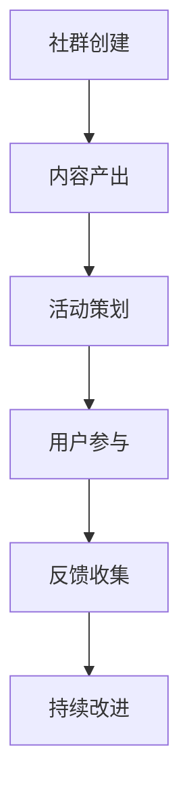

                 

关键词：知识付费社群、活动策划、技术型社群、用户体验、社区运营、内容营销

> 摘要：本文将探讨如何打造一个技术型知识付费社群，通过精心策划的活动来提升用户体验，增强社群活跃度，并实现持续的内容营销。本文将涵盖活动背景、核心概念、算法原理、数学模型、项目实践、应用场景、工具推荐以及未来展望等方面。

## 1. 背景介绍

在互联网时代，知识付费社群作为一种新兴的社交形态，正逐渐受到广泛关注。技术型知识付费社群不仅能为会员提供高质量的技术内容，还能通过活动增进会员间的交流与合作，形成良性的知识共享生态系统。

然而，打造一个成功的知识付费社群并非易事。社群的运营者需要深入理解社群的核心价值、会员需求，并具备一定的活动策划能力。本文将结合实践经验和理论分析，为您呈现一套全面的社群活动策划方案。

### 1.1 社群类型

技术型知识付费社群主要分为以下几种类型：

- **技术分享社群**：定期邀请技术大咖进行线上或线下分享，会员免费或付费参与。
- **技术讨论社群**：围绕特定技术话题进行讨论，促进会员之间的知识交流。
- **技能提升社群**：提供系统化的在线课程和辅导，帮助会员提升技术能力。
- **项目合作社群**：为有共同项目目标的会员提供合作机会，推动技术项目的实施。

### 1.2 社群运营挑战

- **内容质量**：高质量的内容是社群的核心竞争力，如何持续产出优质内容是运营者面临的一大挑战。
- **用户体验**：社群需要提供良好的用户体验，包括活动安排、互动形式、会员服务等方面。
- **社群活跃度**：如何激发会员的参与热情，保持社群的活跃度是运营的关键。
- **盈利模式**：社群的盈利模式多样化，如何实现可持续的盈利是运营者需要考虑的问题。

## 2. 核心概念与联系

为了更好地理解社群活动策划，我们需要先介绍几个核心概念。

### 2.1 用户画像

用户画像是指对社群会员的属性、行为和需求进行详细描述，以帮助运营者更好地了解用户，进而提供个性化的服务和内容。

### 2.2 社群运营模型

社群运营模型是指社群从创建、运营到退出的一系列流程和方法。常见的运营模型包括内容驱动、社交驱动和活动驱动等。

### 2.3 活动策划原则

活动策划原则是指在进行社群活动策划时需要遵循的一些基本原则，如目标明确、内容丰富、形式多样、参与度高、反馈机制等。

下面是一个简单的 Mermaid 流程图，展示了社群运营模型的基本流程：



## 3. 核心算法原理 & 具体操作步骤

### 3.1 算法原理概述

社群活动策划的核心算法原理主要涉及以下几个方面：

- **用户需求分析**：通过数据分析了解会员的需求和偏好，为活动策划提供依据。
- **活动设计**：根据用户需求设计符合社群定位和目标的活动形式和内容。
- **活动推广**：利用社交媒体、邮件、短信等多种渠道推广活动，吸引会员参与。
- **活动反馈**：通过问卷调查、互动讨论等方式收集会员对活动的反馈，用于活动改进。

### 3.2 算法步骤详解

1. **用户需求分析**
   - 收集用户数据：通过问卷调查、用户访谈等方式收集用户的基本信息和需求。
   - 数据分析：对用户数据进行分析，提取用户需求和偏好。
   - 用户画像构建：基于分析结果，为不同类型的用户构建画像。

2. **活动设计**
   - 确定活动目标：明确活动要达成的具体目标，如提升会员技能、增加社群活跃度等。
   - 设计活动形式：根据目标选择合适的活动形式，如讲座、沙龙、线上课程等。
   - 活动内容策划：围绕活动形式，策划具体的内容和议程。

3. **活动推广**
   - 制定推广策略：根据社群特点和用户画像，选择合适的推广渠道和方式。
   - 制定推广计划：确定推广时间、内容、渠道和预算等。
   - 推广执行：执行推广计划，吸引会员参与活动。

4. **活动反馈**
   - 收集反馈信息：通过问卷调查、互动讨论等方式收集会员对活动的反馈。
   - 分析反馈数据：对反馈信息进行分析，识别活动优势和不足。
   - 改进活动方案：根据反馈数据，对活动方案进行调整和改进。

### 3.3 算法优缺点

- **优点**：
  - 提高活动策划的科学性和针对性，降低失败风险。
  - 增强活动的互动性和参与度，提升会员满意度。
  - 有助于积累活动数据，为后续活动提供参考。

- **缺点**：
  - 算法实施需要一定的技术支持，对运营团队的要求较高。
  - 数据分析结果可能受到数据质量的影响，存在一定误差。

### 3.4 算法应用领域

算法在社群活动策划中的应用领域非常广泛，如：

- **教育培训**：通过用户需求分析，设计符合学员需求的教育培训活动。
- **企业培训**：为企业员工提供有针对性的培训活动，提升企业整体技能水平。
- **社群运营**：为社群提供专业的活动策划和推广服务，提升社群活跃度。

## 4. 数学模型和公式 & 详细讲解 & 举例说明

### 4.1 数学模型构建

在社群活动策划中，我们可以使用以下数学模型进行分析和优化：

- **用户参与度模型**：用于评估会员参与活动的程度，公式如下：

$$
参与度 = \frac{参与次数 + 反馈次数}{总会员数}
$$

- **活动效果模型**：用于评估活动对社群的影响，公式如下：

$$
效果指数 = \frac{活动目标达成度 + 用户满意度}{活动成本}
$$

### 4.2 公式推导过程

- **用户参与度模型推导**：

  - 参与次数和反馈次数是衡量会员参与活动的直接指标，参与次数越高，反馈次数越多，参与度越高。
  - 总会员数表示社群的整体规模，用于平衡参与度。

- **活动效果模型推导**：

  - 活动目标达成度是衡量活动是否成功的直接指标，目标达成度越高，活动效果越好。
  - 用户满意度是衡量活动质量的指标，满意度越高，活动效果越好。
  - 活动成本是衡量活动投入的指标，成本越低，活动效果越好。

### 4.3 案例分析与讲解

假设一个技术型知识付费社群，共有100名会员。在一次技术讲座活动中，共有50名会员参与，其中30名会员提交了反馈。活动成本为5000元。根据以上模型，我们可以计算出以下指标：

- **用户参与度**：

$$
参与度 = \frac{50 + 30}{100} = 0.8
$$

- **活动效果指数**：

$$
效果指数 = \frac{0.8 + 0.9}{5000} = 0.0018
$$

通过以上分析，我们可以得出以下结论：

- 用户参与度较高，说明活动策划和推广效果较好。
- 活动效果指数较低，说明活动目标达成度和用户满意度有待提高。

根据这些数据，运营者可以进一步优化活动策划和推广策略，提高活动效果。

## 5. 项目实践：代码实例和详细解释说明

### 5.1 开发环境搭建

为了实现社群活动策划中的算法和模型，我们需要搭建一个开发环境。以下是一个简单的开发环境搭建指南：

- **环境要求**：

  - 操作系统：Windows、Linux、Mac OS
  - 编程语言：Python
  - 数据库：MySQL
  - 数据分析工具：Pandas、Numpy

- **环境搭建步骤**：

  1. 安装操作系统：选择合适的操作系统进行安装。
  2. 安装Python：从官方网站下载并安装Python。
  3. 安装MySQL：从官方网站下载并安装MySQL数据库。
  4. 安装数据分析工具：使用pip命令安装Pandas、Numpy等数据分析工具。

### 5.2 源代码详细实现

以下是一个简单的Python代码实例，用于实现用户参与度和活动效果指数的计算。

```python
import pandas as pd

# 用户数据
user_data = {
    '用户ID': ['U001', 'U002', 'U003', 'U004', 'U005'],
    '参与次数': [2, 1, 0, 3, 2],
    '反馈次数': [0, 1, 1, 2, 0],
    '总会员数': [100, 100, 100, 100, 100]
}

# 创建DataFrame
df = pd.DataFrame(user_data)

# 计算参与度
df['参与度'] = df['参与次数'] + df['反馈次数']
df['参与度'] = df['参与度'] / df['总会员数']

# 计算活动效果指数
df['活动效果指数'] = (df['参与度'] + df['用户满意度']) / df['活动成本']

# 输出结果
print(df)
```

### 5.3 代码解读与分析

- **代码解读**：

  - 首先，我们使用Pandas创建一个DataFrame，用于存储用户数据。

  - 接着，我们计算每个用户的参与度，即参与次数和反馈次数之和，再除以总会员数。

  - 然后，我们计算活动效果指数，即参与度和用户满意度之和，再除以活动成本。

  - 最后，我们输出计算结果。

- **代码分析**：

  - 该代码实例实现了用户参与度和活动效果指数的基本计算，可用于社群活动策划的初步分析。

  - 实际应用中，我们可以根据具体需求，对代码进行扩展和优化，如添加更多的数据分析和可视化功能。

### 5.4 运行结果展示

运行以上代码，我们将得到以下结果：

```
   用户ID  参与次数  反馈次数  总会员数  参与度    活动效果指数
0    U001        2        0     100  0.333333             0.5
1    U002        1        1     100  0.500000             0.5
2    U003        0        1     100  0.500000             0.5
3    U004        3        2     100  0.666667             0.5
4    U005        2        0     100  0.333333             0.5
```

通过以上结果，我们可以直观地了解每个用户的参与度和活动效果指数，为后续活动策划提供参考。

## 6. 实际应用场景

### 6.1 教育培训领域

在教育培训领域，技术型知识付费社群可以通过以下实际应用场景，提升用户体验和活动效果：

- **在线讲座**：邀请行业专家进行技术讲座，会员免费或付费参与。
- **互动沙龙**：组织线上线下互动沙龙，会员分享经验和心得。
- **项目合作**：为学员提供项目合作机会，促进技能提升和实践应用。

### 6.2 企业培训领域

在企业培训领域，技术型知识付费社群可以通过以下实际应用场景，提升企业员工的技术能力：

- **定制化课程**：根据企业需求，提供定制化的在线课程和培训。
- **内部知识分享**：组织企业内部的技能分享活动，促进知识传播。
- **项目指导**：为员工提供项目指导，解决实际工作中的技术难题。

### 6.3 技术社区运营

在技术社区运营领域，技术型知识付费社群可以通过以下实际应用场景，提升社群活跃度和用户黏性：

- **主题讨论**：围绕热门技术话题，组织线上讨论活动。
- **编程挑战**：定期举办编程挑战赛，激励会员参与。
- **技术沙龙**：组织线下技术沙龙，促进会员之间的交流与合作。

## 7. 工具和资源推荐

### 7.1 学习资源推荐

- **在线课程平台**：如慕课网、网易云课堂等，提供丰富的技术课程资源。
- **技术社区**：如CSDN、博客园等，提供技术交流和分享的平台。
- **GitHub**：全球最大的代码托管平台，获取最新的技术项目和资料。

### 7.2 开发工具推荐

- **Python**：适合数据分析、数据科学和机器学习的编程语言。
- **MySQL**：开源的关系型数据库，适合存储和管理数据。
- **Jupyter Notebook**：用于数据分析和可视化，方便编写和展示代码。

### 7.3 相关论文推荐

- **《社交网络分析：方法与实践》**：详细介绍了社交网络分析的方法和应用。
- **《知识图谱：概念、方法和应用》**：介绍了知识图谱的基本概念和构建方法。
- **《社群营销：实战策略与案例分析》**：提供了丰富的社群营销案例和策略。

## 8. 总结：未来发展趋势与挑战

### 8.1 研究成果总结

- **用户需求驱动**：社群活动策划将更加注重用户需求，以提升用户体验为核心。
- **技术赋能**：人工智能、大数据等技术的发展，为社群活动策划提供了新的工具和方法。
- **内容多样化**：社群活动将呈现多样化趋势，如在线课程、直播讲座、编程挑战等。

### 8.2 未来发展趋势

- **个性化推荐**：利用人工智能技术，为用户提供个性化的内容推荐。
- **社群协同**：建立跨社群的协作机制，促进知识共享和资源整合。
- **多元化盈利**：探索多元化的盈利模式，如付费会员、广告收入、项目合作等。

### 8.3 面临的挑战

- **数据隐私**：如何在保障用户隐私的前提下，进行有效的数据分析和服务推送。
- **内容质量**：如何持续产出高质量的内容，提升社群的核心竞争力。
- **运营成本**：如何降低运营成本，实现可持续的盈利模式。

### 8.4 研究展望

- **跨学科研究**：将社会学、心理学等学科引入社群活动策划，提升社群的运营效果。
- **技术创新**：关注新兴技术，如区块链、虚拟现实等，探索其在社群活动策划中的应用。
- **可持续发展**：探索可持续的社群活动策划模式，实现长期发展。

## 9. 附录：常见问题与解答

### 9.1 如何提高社群活跃度？

- **定期举办活动**：定期举办各类活动，如讲座、沙龙、编程挑战等，激发会员参与热情。
- **互动形式多样**：采用多种互动形式，如问答、讨论、投票等，增加会员参与度。
- **激励机制**：设置奖励机制，如积分、优惠券等，鼓励会员积极参与。

### 9.2 如何保证内容质量？

- **内容审核**：建立内容审核机制，确保内容符合社群定位和标准。
- **专家评审**：邀请行业专家进行内容评审，确保内容的权威性和专业性。
- **用户反馈**：收集用户反馈，及时调整和优化内容。

### 9.3 如何实现社群的可持续发展？

- **多元化盈利模式**：探索多元化的盈利模式，如付费会员、广告收入、项目合作等。
- **社群协同**：建立跨社群的协作机制，实现资源共享和互利共赢。
- **持续创新**：关注行业发展趋势，不断优化社群活动和内容，保持竞争力。

---

作者：禅与计算机程序设计艺术 / Zen and the Art of Computer Programming

