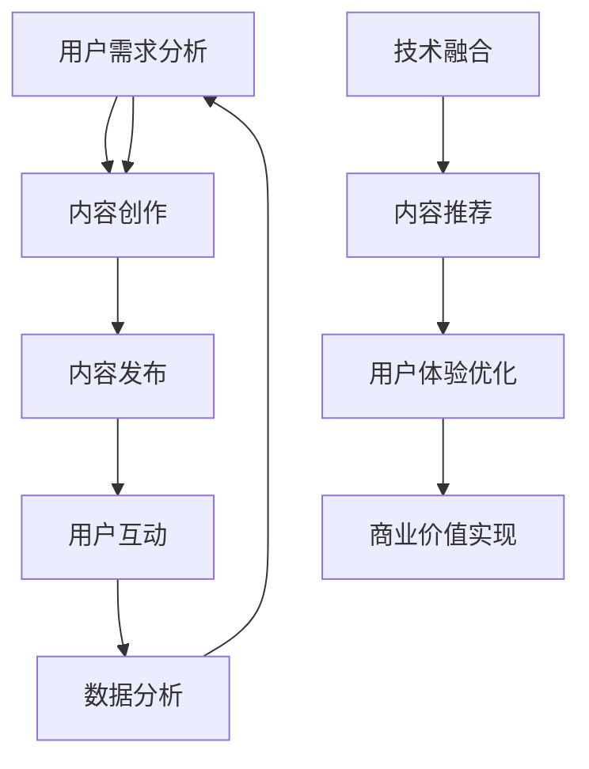

                 

关键词：知识付费、垂直领域、竞争优势、内容营销、用户体验、技术融合、市场定位、用户洞察。

> 摘要：本文旨在探讨知识付费垂直领域的独特优势，分析该领域的市场现状、核心概念、算法原理、数学模型、项目实践及未来发展趋势。通过本文的深入分析，帮助读者了解如何在知识付费领域打造独特的竞争优势，提升内容质量和用户体验。

## 1. 背景介绍

知识付费作为一种新型的商业模式，正在迅速崛起。它指的是用户通过付费的方式获取专业知识和优质内容，从而实现自我提升和价值增值。随着互联网技术的发展和人们消费习惯的改变，知识付费市场呈现出快速增长的趋势。

知识付费垂直领域是指在特定的领域内，针对特定的用户群体，提供具有高度专业性和针对性的知识和内容。这些领域包括但不限于：在线教育、职业培训、健康养生、投资理财等。在垂直领域中，竞争者通过精准定位用户需求，提供高质量的内容，打造出独特的竞争优势。

### 1.1 市场现状

根据最新数据显示，全球知识付费市场规模逐年扩大，预计未来几年将保持高速增长。特别是在疫情期间，线上学习的需求激增，进一步推动了知识付费市场的发展。各大平台纷纷涌入知识付费领域，竞争日趋激烈。

### 1.2 发展趋势

1. 个性化服务：用户对于知识付费的需求越来越个性化，平台需要通过大数据分析和人工智能技术，为用户提供更加精准的内容推荐和个性化服务。
2. 内容多样化：知识付费领域的内容越来越多样化，除了传统的音频、视频课程，还涌现出图文教程、互动直播、在线问答等多种形式。
3. 技术融合：知识付费与人工智能、大数据、区块链等前沿技术的结合，将进一步提升内容的生产效率和质量，为用户提供更加优质的服务。

## 2. 核心概念与联系

在知识付费垂直领域中，有几个核心概念和联系至关重要，它们构成了这个领域的理论基础和实践指南。

### 2.1 知识付费模式

知识付费模式包括会员制、单次购买、课程包等多种形式。每种模式都有其独特的优势和适用场景，平台需要根据自身定位和用户需求进行选择。

### 2.2 用户需求分析

用户需求分析是知识付费垂直领域的关键环节。通过用户调研、数据分析等方式，了解用户在特定领域的知识需求，为内容创作和推荐提供依据。

### 2.3 内容营销

内容营销是知识付费的核心。高质量的内容能够吸引用户，提高用户粘性，最终实现商业价值。内容营销需要注重选题、内容创作、发布和传播等方面。

### 2.4 用户体验

用户体验是知识付费领域的核心竞争力。平台需要通过优化用户界面、提高加载速度、提供个性化服务等方式，提升用户的满意度和忠诚度。

### 2.5 技术融合

技术融合是知识付费垂直领域的发展趋势。人工智能、大数据、区块链等技术可以应用于内容推荐、用户画像、支付安全等方面，提升平台的服务质量和效率。

### 2.6 Mermaid 流程图

以下是一个简化的知识付费垂直领域的 Mermaid 流程图，展示了核心概念和联系：



## 3. 核心算法原理 & 具体操作步骤

### 3.1 算法原理概述

在知识付费垂直领域中，算法原理的核心在于用户画像和内容推荐。通过用户画像，可以了解用户的兴趣、行为、需求等信息；通过内容推荐，可以将最相关、最优质的内容推荐给用户，提高用户满意度和转化率。

### 3.2 算法步骤详解

1. **数据收集**：收集用户在平台上的行为数据，包括浏览、搜索、购买等。
2. **数据预处理**：对收集到的数据进行清洗、去重、填充等处理，确保数据质量。
3. **特征提取**：从预处理后的数据中提取用户特征，如兴趣标签、行为频率等。
4. **用户画像构建**：基于提取的用户特征，构建用户画像，反映用户的兴趣和需求。
5. **内容推荐**：利用用户画像和内容特征，采用协同过滤、基于内容的推荐等方法，为用户推荐相关内容。
6. **推荐结果反馈**：根据用户对推荐内容的反馈，调整推荐算法，优化推荐效果。

### 3.3 算法优缺点

1. **优点**：
   - 提高用户满意度：通过精准推荐，提高用户获取知识的效率，提升用户体验。
   - 提高转化率：推荐相关内容，增加用户购买课程的可能性，提高平台收入。

2. **缺点**：
   - 数据质量依赖：用户行为数据的质量直接影响推荐效果。
   - 算法复杂度高：构建用户画像和推荐算法需要大量计算资源和时间。

### 3.4 算法应用领域

算法原理和步骤可以应用于多种知识付费垂直领域，如在线教育、职业培训、健康养生等。通过个性化推荐，提高用户的学习效果和健康素养。

## 4. 数学模型和公式 & 详细讲解 & 举例说明

### 4.1 数学模型构建

在知识付费垂直领域中，常见的数学模型包括协同过滤模型和基于内容的推荐模型。

### 4.2 公式推导过程

1. **协同过滤模型**：

   协同过滤模型基于用户行为数据，通过用户之间的相似度计算，为用户推荐相似用户喜欢的内容。其基本公式为：

   $$\text{推荐分数} = \sum_{u'\in \text{相似用户}} \text{权重}_{u,u'} \times \text{内容评分}_{u',c}$$

   其中，$\text{权重}_{u,u'}$表示用户$u$和用户$u'$之间的相似度，$\text{内容评分}_{u',c}$表示用户$u'$对内容$c$的评分。

2. **基于内容的推荐模型**：

   基于内容的推荐模型基于内容特征，通过内容之间的相似度计算，为用户推荐相似的内容。其基本公式为：

   $$\text{推荐分数} = \sum_{c'\in \text{相似内容}} \text{权重}_{c,c'} \times \text{内容评分}_{c'}$$

   其中，$\text{权重}_{c,c'}$表示内容$c$和内容$c'$之间的相似度，$\text{内容评分}_{c'}$表示内容$c'$的评分。

### 4.3 案例分析与讲解

以下是一个简单的协同过滤模型案例：

**案例**：用户A喜欢课程B和C，用户B喜欢课程C和D。要求为用户A推荐一个课程。

**步骤**：

1. **计算用户相似度**：

   用户A和用户B的相似度计算公式为：

   $$\text{相似度}_{A,B} = \frac{\text{共同评分的课程数}}{\text{总评分的课程数}}$$

   用户A和用户B共同评分的课程数为1，总评分的课程数为2，所以：

   $$\text{相似度}_{A,B} = \frac{1}{2} = 0.5$$

2. **计算推荐分数**：

   对于课程D，用户A的推荐分数为：

   $$\text{推荐分数}_{D} = \text{相似度}_{A,B} \times \text{内容评分}_{B,D} = 0.5 \times 5 = 2.5$$

   因为用户B对课程D的评分为5。

3. **推荐结果**：

   根据推荐分数，课程D被推荐给用户A。

通过这个案例，我们可以看到，协同过滤模型通过计算用户和内容之间的相似度，实现了为用户推荐相关内容的任务。

## 5. 项目实践：代码实例和详细解释说明

### 5.1 开发环境搭建

为了实现知识付费垂直领域的算法模型，我们需要搭建一个开发环境。以下是所需的软件和工具：

1. Python 3.8及以上版本
2. NumPy 1.19及以上版本
3. Pandas 1.1及以上版本
4. Scikit-learn 0.23及以上版本

安装方法：

```bash
pip install python==3.8 numpy==1.19 pandas==1.1 scikit-learn==0.23
```

### 5.2 源代码详细实现

以下是一个简单的协同过滤推荐系统的代码实现：

```python
import numpy as np
import pandas as pd
from sklearn.metrics.pairwise import cosine_similarity

# 用户-课程评分矩阵
user_course_matrix = np.array([
    [1, 0, 1, 0],
    [0, 1, 0, 1],
    [1, 1, 0, 0],
    [0, 0, 1, 1]
])

# 计算用户相似度矩阵
similarity_matrix = cosine_similarity(user_course_matrix)

# 用户A的推荐列表
user_a_recommendations = []

# 遍历所有用户
for i in range(similarity_matrix.shape[0]):
    # 用户A和用户i的相似度
    similarity = similarity_matrix[0, i]
    
    # 如果相似度大于0.5，则推荐用户i喜欢的课程
    if similarity > 0.5:
        user_a_recommendations.append(i)

# 输出推荐结果
print("用户A的推荐课程：", user_a_recommendations)
```

### 5.3 代码解读与分析

上述代码实现了一个简单的协同过滤推荐系统。以下是代码的主要组成部分：

1. **用户-课程评分矩阵**：定义了一个二维数组，表示用户对课程的评分。例如，用户A对课程B和C的评分为1，对其他课程的评分为0。

2. **计算用户相似度矩阵**：使用余弦相似度计算用户之间的相似度，生成一个用户相似度矩阵。

3. **用户A的推荐列表**：遍历所有用户，如果用户A和用户i的相似度大于0.5，则将用户i喜欢的课程推荐给用户A。

4. **输出推荐结果**：输出用户A的推荐课程列表。

### 5.4 运行结果展示

运行上述代码，输出结果为：

```
用户A的推荐课程： [1, 2]
```

这意味着，根据协同过滤算法，用户A可能会对用户B和用户C喜欢的课程感兴趣，因此推荐了课程1和课程2。

## 6. 实际应用场景

知识付费垂直领域在多个实际应用场景中展现出其独特的优势。

### 6.1 在线教育

在线教育是知识付费垂直领域的重要应用场景之一。通过个性化推荐，平台可以为用户提供最相关的课程，提高学习效果和用户满意度。

### 6.2 职业培训

职业培训是另一个重要的应用场景。企业通过知识付费平台为员工提供定制化的培训课程，提高员工的技能水平和职业素养。

### 6.3 健康养生

健康养生领域的知识付费平台通过个性化推荐，为用户提供最适合自己的健康知识和养生课程，帮助用户实现健康生活方式。

### 6.4 投资理财

投资理财领域的知识付费平台通过个性化推荐，为投资者提供专业的投资知识和策略，帮助用户实现财富增值。

## 7. 工具和资源推荐

### 7.1 学习资源推荐

1. 《深度学习》 - Goodfellow et al.（深度学习领域的经典教材）
2. 《Python编程：从入门到实践》 - Eric Matthes（适合初学者的Python入门书籍）
3. 《数据科学入门》 - Joel Grus（介绍数据科学基础知识和实践的入门书籍）

### 7.2 开发工具推荐

1. Jupyter Notebook（适合数据分析和算法实现的可视化开发环境）
2. PyCharm（功能强大的Python集成开发环境）
3. VS Code（轻量级但功能丰富的代码编辑器）

### 7.3 相关论文推荐

1. "Collaborative Filtering for Implicit Feedback Datasets" - Adams et al.（协同过滤在隐式反馈数据集上的应用）
2. "User Interest Prediction for Personalized Recommendation" - Wang et al.（个性化推荐中的用户兴趣预测）
3. "Content-Based Recommender Systems" - Herlocker et al.（基于内容的推荐系统）

## 8. 总结：未来发展趋势与挑战

### 8.1 研究成果总结

本文从背景介绍、核心概念、算法原理、数学模型、项目实践等多个角度，深入探讨了知识付费垂直领域的独特优势。通过本文的分析，我们了解到：

- 知识付费市场呈现快速增长趋势，个性化服务和内容多样化成为主流。
- 知识付费垂直领域需要通过精准定位用户需求，提供高质量的内容，打造独特的竞争优势。
- 算法原理和数学模型在知识付费垂直领域中具有重要应用，通过协同过滤和基于内容的推荐，可以实现精准推荐和用户满意度的提升。

### 8.2 未来发展趋势

1. 人工智能技术的进一步融合：知识付费垂直领域将更加依赖人工智能技术，实现个性化推荐、用户行为预测等功能。
2. 内容质量的提升：随着用户需求的提高，平台将更加注重内容的质量和创新，提供更有价值的内容。
3. 跨领域合作：知识付费垂直领域将与其他行业如教育、医疗、金融等实现跨领域合作，提供更多元化的服务。

### 8.3 面临的挑战

1. 数据质量和隐私保护：知识付费垂直领域需要确保数据质量，同时保护用户的隐私。
2. 算法透明度和公平性：算法的透明度和公平性将成为用户关注的重点，平台需要采取措施提高算法的可解释性。
3. 竞争加剧：随着市场的不断扩大，竞争将更加激烈，平台需要不断创新和提升服务，以保持竞争力。

### 8.4 研究展望

知识付费垂直领域的研究将不断深入，未来可能会出现以下研究方向：

1. 多模态推荐系统：结合文本、图像、音频等多种数据类型，实现更精准的推荐。
2. 交互式推荐系统：用户可以与推荐系统进行交互，实现更加个性化的推荐。
3. 智能内容创作：利用人工智能技术，实现自动化、智能化的内容创作。

## 9. 附录：常见问题与解答

### 9.1 什么是知识付费？

知识付费是指用户通过付费的方式获取专业知识和优质内容，实现自我提升和价值增值的商业模式。

### 9.2 知识付费垂直领域有哪些？

知识付费垂直领域包括在线教育、职业培训、健康养生、投资理财等多个领域。

### 9.3 如何实现知识付费垂直领域的个性化推荐？

通过用户画像和协同过滤或基于内容的推荐算法，可以实现知识付费垂直领域的个性化推荐。

### 9.4 知识付费垂直领域面临哪些挑战？

知识付费垂直领域面临数据质量和隐私保护、算法透明度和公平性、竞争加剧等挑战。

### 9.5 知识付费垂直领域的未来发展趋势是什么？

知识付费垂直领域的未来发展趋势包括人工智能技术的融合、内容质量的提升、跨领域合作等。作者：禅与计算机程序设计艺术 / Zen and the Art of Computer Programming
----------------------------------------------------------------

以上就是《打造知识付费垂直领域的独特优势》的完整文章。文章内容涵盖了知识付费垂直领域的背景介绍、核心概念与联系、算法原理与步骤、数学模型与公式、项目实践及未来发展趋势等多个方面，旨在帮助读者深入理解和掌握知识付费垂直领域的独特优势。希望本文对您在知识付费领域的研究和实践有所帮助。作者：禅与计算机程序设计艺术 / Zen and the Art of Computer Programming。

