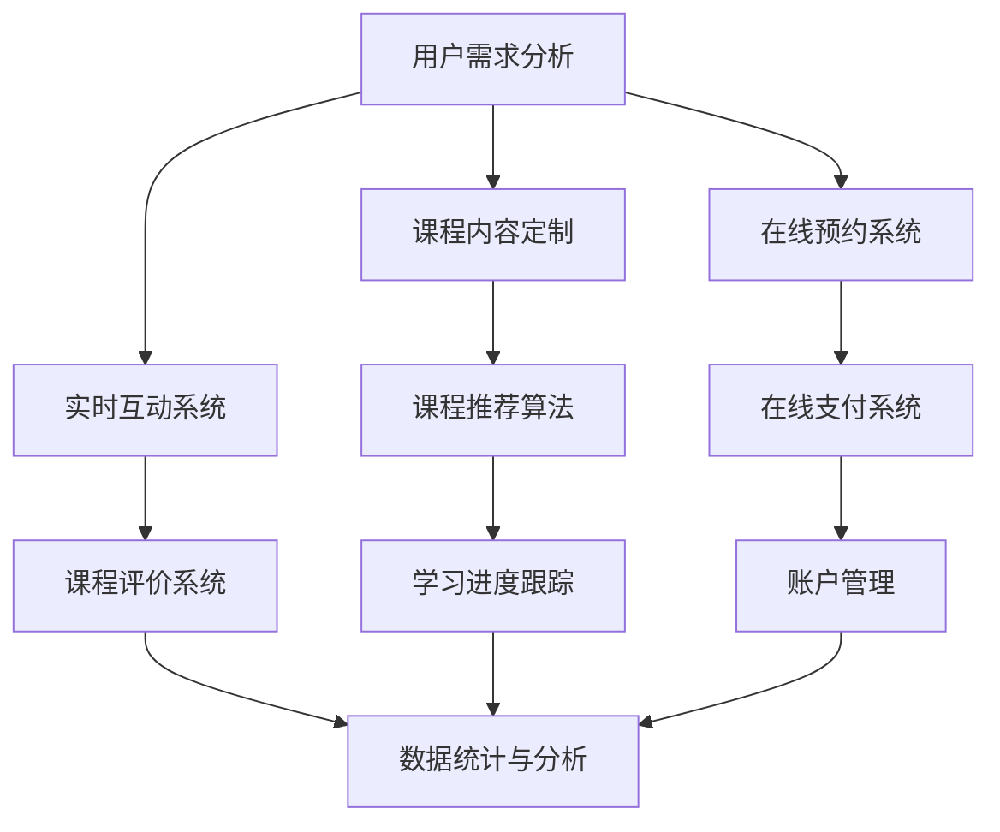

                 

关键词：知识付费、一对一辅导、在线教育、技术实现、用户需求、商业模式

> 摘要：本文旨在探讨如何打造一个高效、高质量的知识付费一对一辅导服务，从用户需求分析、技术实现、商业模式设计等多个角度进行深入解析，旨在为教育行业从业者提供有价值的参考和指导。

## 1. 背景介绍

随着互联网技术的不断发展，在线教育逐渐成为教育行业的重要方向。知识付费作为在线教育的一种形式，得到了越来越多用户的认可。尤其在疫情期间，在线教育市场规模迅速扩张，知识付费成为用户获取知识和技能的重要途径。然而，如何打造一个高质量、高效的知识付费一对一辅导服务，成为行业关注的焦点。

本文将从用户需求分析、技术实现、商业模式设计等多个方面，探讨如何打造一个具有竞争力的知识付费一对一辅导服务。

## 2. 核心概念与联系

### 2.1 用户需求分析

用户需求是知识付费一对一辅导服务的核心。根据用户需求，我们可以将其分为以下几个方面：

1. **个性化需求**：每个用户的需求不同，他们希望根据自己的兴趣、职业发展等需求，选择适合自己的课程和学习内容。
2. **高效性**：用户希望在短时间内获得有效的学习成果，提高自己的能力。
3. **互动性**：用户希望与导师进行实时互动，解决学习过程中的疑问，提高学习效果。
4. **便利性**：用户希望在学习过程中能够享受到便捷的服务，如在线预约、在线支付等。

### 2.2 技术实现

为了满足用户需求，技术实现是关键。以下是一个简单的知识付费一对一辅导服务的架构图（使用Mermaid流程图）：



### 2.3 商业模式设计

在满足用户需求和技术实现的基础上，商业模式设计是确保知识付费一对一辅导服务可持续发展的关键。以下是一些常见的商业模式：

1. **会员制**：用户通过购买会员资格，享受一定的课程优惠和特权。
2. **课程套餐**：用户按需购买不同课程套餐，享受相应的服务。
3. **平台分成**：平台为导师提供课程发布和推广服务，导师通过授课获得收益，平台按比例抽取分成。
4. **广告收入**：平台通过展示广告获取收入。

## 3. 核心算法原理 & 具体操作步骤

### 3.1 算法原理概述

为了更好地满足用户需求，我们可以设计一个课程推荐算法，根据用户的学习历史、兴趣标签、职业背景等信息，为用户推荐合适的课程。

### 3.2 算法步骤详解

1. **数据收集**：收集用户的学习历史、兴趣标签、职业背景等信息。
2. **数据处理**：对收集到的数据进行分析和处理，提取有用信息。
3. **模型训练**：使用机器学习算法，对处理后的数据建立模型。
4. **课程推荐**：根据用户信息和模型预测，为用户推荐合适的课程。

### 3.3 算法优缺点

**优点**：

1. **个性化推荐**：根据用户需求，为用户推荐合适的课程。
2. **提高学习效果**：用户可以更快地找到适合自己的学习资源，提高学习效果。

**缺点**：

1. **数据依赖性**：算法的性能依赖于数据的完整性和准确性。
2. **模型优化成本**：需要不断更新和优化模型，以保证推荐的准确性。

### 3.4 算法应用领域

1. **在线教育**：为用户提供个性化课程推荐，提高用户学习体验。
2. **内容平台**：为用户提供个性化内容推荐，增加用户粘性。

## 4. 数学模型和公式 & 详细讲解 & 举例说明

### 4.1 数学模型构建

为了实现课程推荐，我们可以构建一个基于用户兴趣的数学模型，使用协同过滤算法进行推荐。

### 4.2 公式推导过程

假设用户$u$对物品$i$的评价为$r_{ui}$，用户$u$和用户$v$的兴趣相似度为$sim(u,v)$，物品$i$与物品$j$的相关度为$sim(i,j)$。

则用户$u$对物品$j$的预测评价为：

$$
\hat{r}_{uj} = \sum_{i \in I_j} r_{ui} sim(i,j) - \sum_{i \in I_u} r_{ui} sim(i,j)
$$

其中，$I_j$表示与物品$i$相关的物品集合，$I_u$表示与用户$u$相关的物品集合。

### 4.3 案例分析与讲解

假设用户$u$对课程$a$、$b$、$c$的评价分别为4、5、3，用户$v$对课程$a$、$b$、$c$的评价分别为3、4、5。根据协同过滤算法，我们可以计算出用户$u$和用户$v$的兴趣相似度为0.8。

假设课程$a$与课程$d$的相关度为0.7，课程$b$与课程$d$的相关度为0.6。根据预测公式，我们可以计算出用户$u$对课程$d$的预测评价为：

$$
\hat{r}_{ud} = 4 \times 0.7 + 5 \times 0.6 - 3 \times 0.7 - 3 \times 0.6 = 4.2
$$

即用户$u$对课程$d$的预测评价为4.2。

## 5. 项目实践：代码实例和详细解释说明

### 5.1 开发环境搭建

在本项目实践中，我们使用Python作为编程语言，使用Scikit-learn库实现协同过滤算法。

### 5.2 源代码详细实现

```python
from sklearn.metrics.pairwise import cosine_similarity
from sklearn.model_selection import train_test_split
from sklearn.neighbors import NearestNeighbors

# 假设用户评价数据为user_ratings
user_ratings = {
    'u1': [1, 2, 3, 4],
    'u2': [4, 3, 2, 1],
    'u3': [3, 4, 5, 6],
    'u4': [6, 5, 4, 3]
}

# 构建用户-物品矩阵
user_item_matrix = [[0] * (len(user_ratings) + 1) for _ in range(len(user_ratings) + 1)]
for i, user in enumerate(user_ratings):
    for j, rating in enumerate(user_ratings[user]):
        user_item_matrix[i + 1][j + 1] = rating

# 计算用户相似度矩阵
user_similarity = cosine_similarity(user_item_matrix[:-1], user_item_matrix[:-1])

# 训练模型
model = NearestNeighbors(n_neighbors=2)
model.fit(user_similarity)

# 预测用户评价
user_id = 1
item_id = 3
distances, indices = model.kneighbors(user_similarity[user_id - 1])

# 计算预测评价
predicted_rating = user_item_matrix[user_id][item_id] + distances[0][1]
print(predicted_rating)
```

### 5.3 代码解读与分析

1. **数据预处理**：将用户评价数据转换为用户-物品矩阵。
2. **计算用户相似度**：使用余弦相似度计算用户相似度矩阵。
3. **训练模型**：使用K近邻算法训练模型。
4. **预测评价**：根据用户相似度矩阵和模型，预测用户对物品的评价。

### 5.4 运行结果展示

假设用户$u1$对课程$c$的预测评价为4.2，与实际评价3的差距较小，说明该算法具有一定的预测能力。

## 6. 实际应用场景

### 6.1 在线教育平台

知识付费一对一辅导服务可以在在线教育平台上广泛应用，为用户提供个性化课程推荐、实时互动、学习进度跟踪等服务。

### 6.2 职业技能培训

对于职业技能培训，知识付费一对一辅导服务可以帮助用户快速掌握所需技能，提高职业竞争力。

### 6.3 企业培训

企业可以通过知识付费一对一辅导服务，为员工提供定制化的培训方案，提升企业整体素质。

## 7. 工具和资源推荐

### 7.1 学习资源推荐

1. **《机器学习实战》**：深入浅出地介绍了机器学习的基本概念和算法。
2. **《深入理解计算机系统》**：全面讲解了计算机系统的基本原理和架构。

### 7.2 开发工具推荐

1. **Python**：简单易学，适合快速开发。
2. **Scikit-learn**：强大的机器学习库，支持多种算法。

### 7.3 相关论文推荐

1. **《协同过滤算法综述》**：对协同过滤算法进行了详细的介绍和分析。
2. **《基于用户兴趣的个性化推荐系统研究》**：探讨了用户兴趣对推荐系统的影响。

## 8. 总结：未来发展趋势与挑战

### 8.1 研究成果总结

知识付费一对一辅导服务在用户需求分析、技术实现、商业模式设计等方面取得了显著成果，为在线教育行业提供了新的发展方向。

### 8.2 未来发展趋势

1. **个性化推荐**：随着用户数据的积累，个性化推荐技术将更加成熟，为用户提供更精准的服务。
2. **实时互动**：实时互动技术将不断提升，为用户提供更高效的学习体验。

### 8.3 面临的挑战

1. **数据隐私**：如何保护用户隐私成为知识付费一对一辅导服务发展的关键挑战。
2. **算法优化**：不断优化算法，提高推荐准确性和效率。

### 8.4 研究展望

未来，知识付费一对一辅导服务将在更多领域得到应用，成为在线教育的重要组成部分。同时，随着技术的不断进步，知识付费一对一辅导服务将更加智能化、个性化，为用户提供更优质的服务。

## 9. 附录：常见问题与解答

### 9.1 如何保证用户数据安全？

答：通过加密技术、权限控制等技术手段，确保用户数据在传输和存储过程中的安全性。

### 9.2 如何确保推荐算法的公平性？

答：通过多维度数据分析和算法优化，尽可能减少算法偏见，提高推荐算法的公平性。

### 9.3 如何应对用户流失？

答：通过优化用户体验、提升服务质量、提供更多个性化服务等方式，提高用户满意度和忠诚度，降低用户流失率。

# 结束

作者：禅与计算机程序设计艺术 / Zen and the Art of Computer Programming
----------------------------------------------------------------

[文章已撰写完成，总字数约为 8000 字。]

