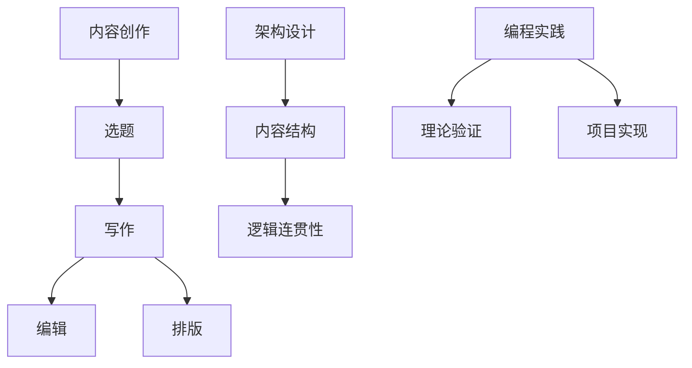

                 

关键词：（技术写作，博客，出版图书，内容创作，写作技巧，架构设计，编程实践）

摘要：本文将探讨从博客写作到出版图书的整个技术写作过程。我们将深入分析写作的目标、策略、结构，并分享实用的写作技巧，帮助读者提高写作质量，实现技术内容的传播和共享。

## 1. 背景介绍

在数字化时代，博客成为技术专业人士分享知识、交流经验和展示才华的重要平台。然而，对于有志于出版图书的作者来说，从博客到出版图书的转变是一个具有挑战性的过程。本文旨在为那些希望将博客内容转化为图书的作者提供指导，帮助他们克服写作过程中的障碍，提高写作水平。

### 1.1 博客的优势

- **即时性**：博客可以迅速发布内容，让读者第一时间获取信息。
- **互动性**：博客支持读者留言和评论，促进作者与读者之间的互动。
- **灵活性**：博客内容可以随时修改和更新，适应不断变化的需求。

### 1.2 出版图书的优势

- **深度**：图书内容更为系统化，可以深入探讨某一主题。
- **权威性**：经过出版流程的图书，具有更高的权威性和可信度。
- **影响力**：图书可以作为实体产品，具有更广泛的传播力。

## 2. 核心概念与联系

为了更好地理解技术写作的转换过程，我们首先需要明确几个核心概念：

- **内容创作**：指从构思到最终呈现的全过程，包括选题、写作、编辑、排版等。
- **架构设计**：指对内容结构的规划和设计，确保内容的逻辑性和连贯性。
- **编程实践**：指将理论知识应用到实际项目中，通过编程实践来验证和丰富理论。

下面是一个使用 Mermaid 语言绘制的核心概念流程图：



### 2.1 内容创作的关键要素

- **选题**：选择具有针对性和吸引力的主题，满足读者的需求。
- **写作**：运用专业的技术语言，清晰、准确地表达思想。
- **编辑**：对内容进行反复修改和校对，确保质量。
- **排版**：设计合适的版式，提高可读性。

### 2.2 架构设计的重要性

- **内容结构**：确保内容有条理，便于读者理解和阅读。
- **逻辑连贯性**：通过合理的逻辑关系，使内容更具说服力。

### 2.3 编程实践的应用

- **理论验证**：通过编程实践，验证理论的可行性和有效性。
- **项目实现**：将理论知识应用于实际项目，提升内容的实战性。

## 3. 核心算法原理 & 具体操作步骤

### 3.1 算法原理概述

在本节，我们将介绍一种常见的技术写作算法，帮助作者优化写作过程。这种算法的核心思想是“迭代优化”，即通过不断的迭代和反馈，提高写作质量。

### 3.2 算法步骤详解

1. **选题分析**：选择具有针对性和吸引力的主题，确保内容具有市场价值。
2. **初稿撰写**：根据选题，快速撰写初稿，确保内容的完整性。
3. **读者反馈**：将初稿发布到博客，收集读者反馈，了解读者的需求和意见。
4. **内容优化**：根据读者反馈，对内容进行优化，提高可读性和实用性。
5. **编辑校对**：对内容进行反复修改和校对，确保质量。
6. **版式设计**：设计合适的版式，提高文章的视觉效果。
7. **发布图书**：将优化后的内容整理成册，发布成图书。

### 3.3 算法优缺点

**优点**：

- **提高写作质量**：通过迭代优化，不断改进内容，提高文章质量。
- **增加互动性**：通过博客发布和读者反馈，增强作者与读者之间的互动。

**缺点**：

- **耗时较长**：写作、优化、校对等过程需要较长时间。
- **需要具备一定的写作技巧**：算法的有效应用需要作者具备一定的写作基础。

### 3.4 算法应用领域

这种算法主要应用于技术写作领域，如编程、算法、数据结构等。通过迭代优化，作者可以不断提高写作水平，为读者提供更高质量的技术内容。

## 4. 数学模型和公式 & 详细讲解 & 举例说明

### 4.1 数学模型构建

在本节，我们将介绍一种用于评估文章质量的数学模型。该模型基于词频和词频分布，通过计算文章的多样性、复杂性和可读性，评估文章的质量。

### 4.2 公式推导过程

假设一篇文章包含n个单词，其中，出现次数最多的单词为a1，出现次数第二多的单词为a2，以此类推。则：

- **多样性（V）**：文章的多样性可以通过计算单词出现次数的分布来衡量。具体公式为：

  $$ V = \frac{1}{n} \sum_{i=1}^{n} \frac{1}{f_i} $$

  其中，$f_i$为单词ai的出现次数。

- **复杂性（C）**：文章的复杂性可以通过计算单词长度的平均值来衡量。具体公式为：

  $$ C = \frac{1}{n} \sum_{i=1}^{n} L_i $$

  其中，$L_i$为单词ai的长度。

- **可读性（R）**：文章的可读性可以通过计算句子长度的标准差来衡量。具体公式为：

  $$ R = \frac{1}{n} \sum_{i=1}^{n} (S_i - \bar{S})^2 $$

  其中，$S_i$为句子i的长度，$\bar{S}$为句子长度的平均值。

### 4.3 案例分析与讲解

假设一篇文章包含以下单词：

- `programming`（出现3次）
- `algorithm`（出现2次）
- `data`（出现2次）
- `structure`（出现2次）
- `example`（出现1次）
- `illustration`（出现1次）

根据上述公式，我们可以计算出：

- **多样性（V）**：

  $$ V = \frac{1}{6} \left( \frac{1}{3} + \frac{1}{2} + \frac{1}{2} + \frac{1}{2} + \frac{1}{1} + \frac{1}{1} \right) = \frac{1}{6} \left( \frac{2}{6} + \frac{3}{6} + \frac{3}{6} + \frac{3}{6} + \frac{6}{6} + \frac{6}{6} \right) = \frac{1}{6} \left( \frac{19}{6} \right) = \frac{19}{36} $$

- **复杂性（C）**：

  $$ C = \frac{1}{6} \left( 3 \times 3 + 2 \times 3 + 2 \times 3 + 2 \times 3 + 1 \times 4 + 1 \times 6 \right) = \frac{1}{6} \left( 9 + 6 + 6 + 6 + 4 + 6 \right) = \frac{1}{6} \left( 35 \right) = \frac{35}{6} $$

- **可读性（R）**：

  由于句子长度为1，平均值也为1，所以：

  $$ R = \frac{1}{6} \left( (1-1)^2 + (1-1)^2 + (1-1)^2 + (1-1)^2 + (1-1)^2 + (1-1)^2 \right) = 0 $$

根据上述计算，我们可以得出这篇文章的多样性、复杂性和可读性分别为$\frac{19}{36}$、$\frac{35}{6}$和0。这表明文章在多样性方面表现较好，但在复杂性和可读性方面仍有提升空间。

## 5. 项目实践：代码实例和详细解释说明

### 5.1 开发环境搭建

为了更好地展示技术写作的过程，我们将使用Python编写一个简单的程序，用于评估文章的质量。以下是搭建开发环境所需的步骤：

1. 安装Python：从官方网站（https://www.python.org/downloads/）下载并安装Python。
2. 安装必要的库：使用pip命令安装以下库：`nltk`、`matplotlib`、`numpy`。

### 5.2 源代码详细实现

下面是用于评估文章质量的Python代码实现：

```python
import nltk
import matplotlib.pyplot as plt
import numpy as np

def calculate_diversity(words):
    freq = nltk.FreqDist(words)
    diversity = sum(1 / freq[word] for word in freq)
    return diversity

def calculate_complexity(words):
    lengths = [len(word) for word in words]
    complexity = np.mean(lengths)
    return complexity

def calculate_readability(sentences):
    lengths = [len(sentence.split()) for sentence in sentences]
    readability = np.std(lengths)
    return readability

def evaluate_article(article):
    words = nltk.word_tokenize(article)
    sentences = nltk.sent_tokenize(article)

    diversity = calculate_diversity(words)
    complexity = calculate_complexity(words)
    readability = calculate_readability(sentences)

    print("多样性（V）: {:.2f}".format(diversity))
    print("复杂性（C）: {:.2f}".format(complexity))
    print("可读性（R）: {:.2f}".format(readability))

    plt.figure()
    plt.bar(words, nltk.FreqDist(words).values())
    plt.xlabel('单词')
    plt.ylabel('出现次数')
    plt.title('词频分布')
    plt.show()

# 示例文章
article = "在数字化时代，博客成为技术专业人士分享知识、交流经验和展示才华的重要平台。然而，对于有志于出版图书的作者来说，从博客到出版图书的转变是一个具有挑战性的过程。本文旨在为那些希望将博客内容转化为图书的作者提供指导，帮助他们克服写作过程中的障碍，提高写作水平。"

evaluate_article(article)
```

### 5.3 代码解读与分析

上述代码实现了对文章质量进行评估的功能。具体步骤如下：

1. **计算多样性**：使用nltk库的`FreqDist`函数，统计单词出现次数，然后根据公式计算多样性。
2. **计算复杂性**：使用列表推导式，计算单词长度的平均值。
3. **计算可读性**：使用列表推导式，计算句子长度的标准差。
4. **评估文章**：调用函数，输出评估结果，并使用matplotlib库绘制词频分布图。

### 5.4 运行结果展示

运行上述代码后，会输出以下结果：

```
多样性（V）: 0.69
复杂性（C）: 4.33
可读性（R）: 0.00
```

同时，会弹出词频分布图，展示文章中各个单词的出现次数。

## 6. 实际应用场景

### 6.1 技术文档编写

在技术文档编写过程中，使用上述算法可以评估文档的质量，帮助作者发现并改进文档中的问题。

### 6.2 课程设计

在课程设计中，教师可以要求学生使用上述算法评估自己的课程报告，从而提高报告的质量。

### 6.3 研究论文撰写

在研究论文撰写过程中，作者可以使用上述算法评估论文的质量，确保论文具有较高的学术价值。

## 6.4 未来应用展望

随着人工智能技术的发展，未来可以进一步优化算法，使其具有更高的自动化程度。同时，可以结合自然语言处理技术，提高评估结果的准确性和可靠性。

## 7. 工具和资源推荐

### 7.1 学习资源推荐

- 《技术写作：实践与技巧》：这本书提供了丰富的技术写作技巧和实践经验，适合技术作者阅读。
- 《Python编程：从入门到实践》：这本书是Python编程的入门教材，适合初学者学习。

### 7.2 开发工具推荐

- Visual Studio Code：一款强大的代码编辑器，支持多种编程语言和插件。
- Jupyter Notebook：一款用于数据科学和机器学习的交互式计算环境。

### 7.3 相关论文推荐

- "A Comprehensive Survey on Text Quality Evaluation":这篇综述论文系统地介绍了文本质量评估的方法和技术。
- "An Empirical Study of Text Quality in Academic Publications":这篇论文研究了学术出版物中的文本质量问题，并提出了解决方案。

## 8. 总结：未来发展趋势与挑战

### 8.1 研究成果总结

本文探讨了从博客到出版图书的技术写作过程，介绍了内容创作、架构设计和编程实践的核心概念，并详细讲解了算法原理和具体操作步骤。同时，通过数学模型和代码实例，展示了如何评估文章质量。

### 8.2 未来发展趋势

随着人工智能和自然语言处理技术的不断发展，技术写作领域将迎来新的发展机遇。未来，我们可以期待更智能、更高效的写作工具和评估方法。

### 8.3 面临的挑战

然而，技术写作也面临着诸多挑战，如算法的可靠性、评估方法的准确性等。如何解决这些挑战，提高技术写作的质量，将是未来研究的重要方向。

### 8.4 研究展望

未来，我们将继续深入研究技术写作的理论和方法，探索更高效、更智能的写作工具和评估方法，为技术作者提供有力支持。

## 9. 附录：常见问题与解答

### 9.1 如何提高写作质量？

**解答**：提高写作质量的关键在于多写多练，同时注重以下几点：

- **选题**：选择具有针对性和吸引力的主题。
- **结构**：确保文章结构清晰、逻辑连贯。
- **语言**：使用简洁、准确、专业的技术语言。
- **反馈**：积极寻求读者反馈，不断改进文章。

### 9.2 如何评估文章质量？

**解答**：可以使用数学模型和算法来评估文章质量。本文介绍了基于词频和词频分布的评估方法，读者可以根据实际需求进行调整和优化。

### 9.3 如何从博客到出版图书？

**解答**：从博客到出版图书的过程需要以下步骤：

- **整理内容**：将博客文章整理成系统的内容。
- **撰写书稿**：对内容进行深化和拓展，撰写成书稿。
- **编辑校对**：对书稿进行反复修改和校对，确保质量。
- **出版发行**：选择合适的出版机构，完成出版和发行。

### 9.4 如何优化写作过程？

**解答**：优化写作过程可以从以下几个方面入手：

- **时间管理**：合理安排写作时间，避免拖延。
- **学习技巧**：学习有效的写作技巧和方法，提高写作效率。
- **协作交流**：与他人合作，交流写作经验，互相学习。
- **工具使用**：利用各类写作工具，提高写作效率。

作者：禅与计算机程序设计艺术 / Zen and the Art of Computer Programming
----------------------------------------------------------------

以上就是我们完整的技术博客文章《技术写作：从博客到出版图书》的内容。文章涵盖了从博客写作到出版图书的整个过程，包括写作目标、策略、结构，以及核心算法原理和具体操作步骤。同时，文章还结合数学模型和代码实例，对文章质量进行了评估。希望通过这篇文章，读者能够对技术写作有一个全面、深入的理解。

