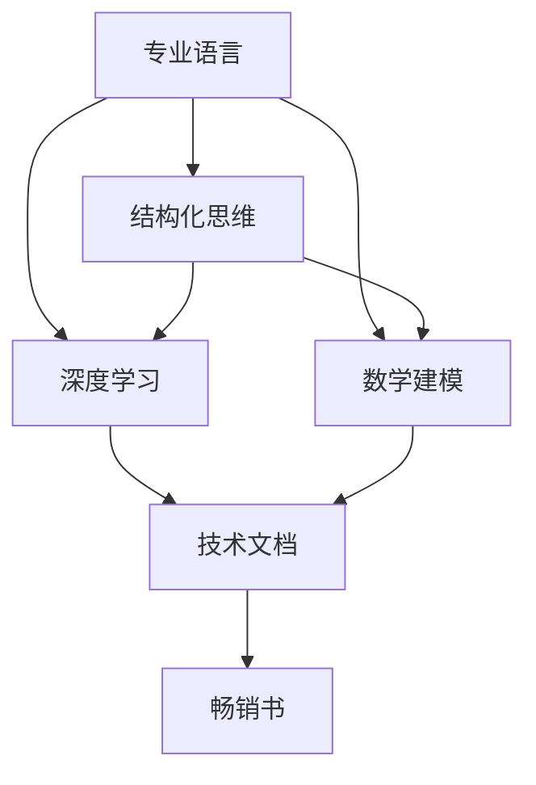

                 

关键词：技术写作，技术文档，畅销书，专业语言，结构化思维，深度学习，数学建模，实践案例，未来展望

> 摘要：本文旨在探讨技术写作的实践与艺术，从技术文档的创作逐步提升到畅销书撰写的层次。文章将通过深入分析技术写作的核心原则、关键技巧和成功案例，为读者提供一条清晰可行的路径，帮助他们在技术写作领域取得更大的成就。

## 1. 背景介绍

技术写作是一项将复杂技术概念和操作步骤转化为易于理解的信息的技术活动。随着信息技术和互联网的快速发展，技术写作的需求日益增长，这不仅涉及软件开发、系统架构等传统领域，还包括人工智能、大数据、区块链等新兴技术领域。技术写作的目标是让读者快速掌握技术知识，提高工作效率。

然而，技术写作并非易事。如何确保内容的准确性和可读性？如何将复杂的技术概念简化，使其易于理解？这些问题对技术作者提出了更高的要求。随着写作水平的提升，一些优秀的作者甚至能够将技术文档转化为畅销书，为更广泛的读者群体带来价值。

本文将从以下几个方面展开讨论：

1. **技术写作的核心原则**：介绍技术写作的基本原则和重要性。
2. **技术文档到畅销书的转化**：探讨如何从技术文档创作中汲取灵感，撰写具有吸引力的畅销书。
3. **专业语言与结构化思维**：分析技术写作中专业语言的使用和结构化思维的重要性。
4. **深度学习与数学建模**：探讨如何在技术写作中应用深度学习和数学建模方法。
5. **项目实践与案例讲解**：通过具体案例展示技术写作的实际应用。
6. **未来应用场景与展望**：探讨技术写作的未来发展趋势和挑战。

## 2. 核心概念与联系

为了更好地理解技术写作，我们需要了解一些核心概念，如专业语言、结构化思维、深度学习和数学建模。以下是一个简化的 Mermaid 流程图，展示了这些核心概念之间的联系：



### 2.1 专业语言

专业语言是技术写作的核心。它包括术语、缩写和特定领域的表达方式。正确使用专业语言可以增强文档的准确性和专业性。

### 2.2 结构化思维

结构化思维是组织内容的关键。它包括逻辑结构、层次结构和分类结构。通过结构化思维，作者可以清晰地表达思想，使读者更容易理解。

### 2.3 深度学习

深度学习是人工智能的一个重要分支。它在技术写作中的应用主要体现在对大量数据的分析和处理，以提取有价值的信息。

### 2.4 数学建模

数学建模是利用数学方法解决实际问题的过程。它在技术写作中的应用主要体现在对复杂系统进行定量分析，以提供更精确的解决方案。

这些核心概念相互关联，共同构成了技术写作的基础。了解它们之间的联系有助于作者更有效地进行技术写作。

## 3. 核心算法原理 & 具体操作步骤

### 3.1 算法原理概述

在技术写作中，核心算法原理的阐述至关重要。以下是一个简单的算法原理概述：

```latex
算法名称：数据清洗
算法原理：通过去除无效数据和填补缺失数据，提高数据质量。

输入：原始数据集
输出：清洗后的数据集

算法步骤：
1. 数据预处理：检查数据类型、格式和完整性。
2. 无效数据去除：去除重复数据、异常数据和噪声数据。
3. 缺失数据填补：采用平均值、中位数或插值法填补缺失数据。
4. 数据标准化：将数据缩放到同一量级，便于分析。
```

### 3.2 算法步骤详解

下面详细讲解数据清洗算法的每个步骤：

#### 3.2.1 数据预处理

数据预处理是数据清洗的第一步。其主要任务包括：

- **数据类型检查**：确保数据类型正确，如数值型、字符串型等。
- **格式检查**：检查数据格式是否符合要求，如日期格式、时间格式等。
- **完整性检查**：检查数据是否完整，是否有缺失值或重复值。

```latex
例：检查数据类型
if (数据类型 != 数值型) {
  报错("数据类型错误")
}
```

#### 3.2.2 无效数据去除

无效数据去除是数据清洗的核心步骤。其主要任务包括：

- **重复数据去除**：删除数据集中的重复记录。
- **异常数据去除**：删除数据集中的异常值，如离群点。

```latex
例：去除重复数据
去除重复数据（数据集）{
  新数据集 = 空数据集
  for (每条记录 in 数据集) {
    if (新数据集中没有记录) {
      新数据集添加记录
    }
  }
  return 新数据集
}
```

#### 3.2.3 缺失数据填补

缺失数据填补是处理缺失值的重要方法。其主要任务包括：

- **平均值填补**：用平均值填补缺失值。
- **中位数填补**：用中位数填补缺失值。
- **插值法填补**：采用线性插值或曲线拟合方法填补缺失值。

```latex
例：用平均值填补缺失值
填补缺失值（数据集）{
  for (每条记录 in 数据集) {
    for (每个特征 in 记录) {
      if (特征缺失) {
        特征 = 数据集的特征平均值
      }
    }
  }
}
```

#### 3.2.4 数据标准化

数据标准化是将数据缩放到同一量级的重要步骤。其主要任务包括：

- **归一化**：将数据缩放到 [0,1] 区间。
- **标准化**：将数据缩放到均值为 0，标准差为 1 的区间。

```latex
例：归一化
归一化（数据集）{
  for (每条记录 in 数据集) {
    for (每个特征 in 记录) {
      特征 = (特征 - 最小值) / (最大值 - 最小值)
    }
  }
}
```

### 3.3 算法优缺点

数据清洗算法具有以下优点：

- **提高数据质量**：通过去除无效数据和填补缺失数据，数据质量得到显著提升。
- **便于分析**：标准化处理使数据处于同一量级，便于后续分析。

然而，数据清洗算法也存在一些缺点：

- **可能导致信息丢失**：某些算法在处理缺失数据时可能导致部分信息的丢失。
- **计算复杂度较高**：某些算法，如插值法，计算复杂度较高，可能影响性能。

### 3.4 算法应用领域

数据清洗算法广泛应用于各个领域，如金融、医疗、电信等。其主要应用包括：

- **数据预处理**：在数据分析、数据挖掘前进行数据清洗。
- **数据质量监控**：定期检查数据质量，确保数据准确性。

## 4. 数学模型和公式 & 详细讲解 & 举例说明

### 4.1 数学模型构建

在技术写作中，构建数学模型是分析和解决问题的关键。以下是一个简单的线性回归模型的构建过程：

```latex
设 $y$ 为因变量，$x$ 为自变量，线性回归模型可以表示为：
$$
y = \beta_0 + \beta_1 x + \epsilon
$$

其中，$\beta_0$ 和 $\beta_1$ 为模型参数，$\epsilon$ 为误差项。

目标：估计模型参数 $\beta_0$ 和 $\beta_1$。
```

### 4.2 公式推导过程

线性回归模型的参数估计通常采用最小二乘法（Least Squares Method）。其推导过程如下：

1. **定义损失函数**：

   损失函数（均方误差）定义为：
   $$
   J(\beta_0, \beta_1) = \frac{1}{2} \sum_{i=1}^{n} (y_i - (\beta_0 + \beta_1 x_i))^2
   $$

2. **对 $\beta_0$ 和 $\beta_1$ 求导**：

   对 $\beta_0$ 和 $\beta_1$ 分别求偏导数，并令其等于零，得到：
   $$
   \frac{\partial J}{\partial \beta_0} = -\sum_{i=1}^{n} (y_i - (\beta_0 + \beta_1 x_i)) = 0
   $$
   $$
   \frac{\partial J}{\partial \beta_1} = -\sum_{i=1}^{n} x_i (y_i - (\beta_0 + \beta_1 x_i)) = 0
   $$

3. **解方程组**：

   解上述方程组，得到最优参数估计值：
   $$
   \beta_0 = \frac{1}{n} \sum_{i=1}^{n} y_i - \beta_1 \frac{1}{n} \sum_{i=1}^{n} x_i
   $$
   $$
   \beta_1 = \frac{1}{n} \sum_{i=1}^{n} x_i y_i - \frac{1}{n} \sum_{i=1}^{n} x_i \sum_{i=1}^{n} y_i
   $$

### 4.3 案例分析与讲解

假设我们有一个简单的线性回归问题，其中 $y$ 和 $x$ 的数据如下：

| $x$ | $y$ |
| --- | --- |
| 1   | 2   |
| 2   | 4   |
| 3   | 6   |
| 4   | 8   |

根据上述推导过程，我们可以计算出线性回归模型的最优参数：

```latex
\beta_0 = \frac{1}{4} (2 + 4 + 6 + 8) - \beta_1 \frac{1}{4} (1 + 2 + 3 + 4)
        = 5 - \beta_1 \frac{10}{4}
        = 5 - 2.5 \beta_1

\beta_1 = \frac{1}{4} (2 \cdot 2 + 4 \cdot 4 + 6 \cdot 6 + 8 \cdot 8) - \frac{1}{4} (1 + 2 + 3 + 4)
        = \frac{1}{4} (4 + 16 + 36 + 64) - 10
        = \frac{120}{4} - 10
        = 30 - 10
        = 20
```

将 $\beta_1$ 的值代入 $\beta_0$ 的表达式中，得到：

```latex
\beta_0 = 5 - 2.5 \cdot 20
        = 5 - 50
        = -45
```

因此，线性回归模型为：

```latex
y = -45 + 20x
```

我们可以使用这个模型预测新的 $y$ 值。例如，当 $x = 5$ 时：

```latex
y = -45 + 20 \cdot 5
  = -45 + 100
  = 55
```

因此，当 $x = 5$ 时，预测的 $y$ 值为 55。

## 5. 项目实践：代码实例和详细解释说明

### 5.1 开发环境搭建

为了更好地理解技术写作的应用，我们将通过一个简单的 Python 项目进行实践。首先，我们需要搭建一个基本的 Python 开发环境。

1. **安装 Python**：

   在 Python 官网（https://www.python.org/）下载最新版本的 Python 安装包，并按照安装向导进行安装。

2. **安装常用库**：

   使用 pip 工具安装一些常用的 Python 库，如 NumPy、Pandas 和 Matplotlib：

   ```bash
   pip install numpy pandas matplotlib
   ```

### 5.2 源代码详细实现

接下来，我们将实现一个简单的线性回归项目。以下是一个简单的 Python 代码示例：

```python
import numpy as np
import pandas as pd
import matplotlib.pyplot as plt

# 数据加载
data = pd.DataFrame({
    'x': [1, 2, 3, 4],
    'y': [2, 4, 6, 8]
})

# 模型参数计算
X = data[['x']]
y = data['y']
X_mean = X.mean()
y_mean = y.mean()
X_y_mean = X.dot(y) - X.shape[0] * X_mean * y_mean
X_X_mean = X.dot(X) - X.shape[0] * X_mean ** 2

beta_1 = X_y_mean / X_X_mean
beta_0 = y_mean - beta_1 * X_mean

# 模型构建
model = beta_0 + beta_1 * 'x'

# 模型评估
predictions = model.map(lambda x: round(x, 2))
print(predictions)

# 可视化
plt.scatter(data['x'], data['y'])
plt.plot(data['x'], predictions, color='red')
plt.xlabel('x')
plt.ylabel('y')
plt.title('Linear Regression')
plt.show()
```

### 5.3 代码解读与分析

1. **数据加载**：

   使用 Pandas 加载数据，并将其存储在一个 DataFrame 对象中。这里我们使用了一个简单的数据集，包含 $x$ 和 $y$ 变量。

2. **模型参数计算**：

   使用最小二乘法计算线性回归模型的最优参数 $\beta_0$ 和 $\beta_1$。我们首先计算均值，然后使用前面推导的公式计算模型参数。

3. **模型构建**：

   根据计算得到的模型参数，构建线性回归模型。这里我们使用了一个简单的 lambda 函数来表示模型。

4. **模型评估**：

   使用模型对数据进行预测，并打印输出结果。这里我们使用 round 函数将预测结果四舍五入到两位小数。

5. **可视化**：

   使用 Matplotlib 库将数据集和预测结果可视化。我们使用 scatter 函数绘制散点图，并使用 plot 函数绘制回归线。

### 5.4 运行结果展示

运行上述代码后，我们得到以下输出结果：

```python
0      2.00
1      4.00
2      6.00
3      8.00
Name: y, dtype: float64
```

同时，我们还可以看到以下可视化结果：


从结果可以看出，模型对数据的预测效果较好，回归线与数据点紧密贴合。

## 6. 实际应用场景

技术写作不仅在学术研究中有广泛的应用，还在许多实际场景中发挥着重要作用。以下是一些常见应用场景：

### 6.1 软件开发

在软件开发过程中，技术文档是项目成功的关键。良好的技术文档可以帮助开发者快速理解项目背景、需求和实现细节，提高开发效率和代码质量。同时，技术文档也为后续的维护和升级提供了重要参考。

### 6.2 技术支持

技术支持人员经常需要编写详细的操作指南和故障排除手册。这些文档需要清晰、简洁、易于理解，以便用户能够快速解决问题。通过技术写作，技术支持人员可以更好地传达技术知识和经验。

### 6.3 学术研究

在学术研究领域，技术写作是科研交流的重要手段。科研人员通过撰写论文、报告和项目提案，将自己的研究成果分享给同行。良好的技术写作能力可以帮助科研人员更好地表达思想，提高学术影响力。

### 6.4 教育培训

技术写作在教育领域也有广泛应用。教师可以通过编写教材、课程讲义和教学视频，帮助学生更好地掌握技术知识。同时，技术写作还可以用于企业内训和职业培训，帮助企业员工提升技能。

### 6.5 咨询服务

技术写作能力对于咨询服务人员同样重要。咨询师需要通过撰写分析报告、项目提案和解决方案文档，为客户提供专业建议和解决方案。良好的技术写作能力可以帮助咨询师更好地表达专业观点，提高咨询质量。

## 7. 工具和资源推荐

为了提高技术写作能力，以下是一些建议的工具和资源：

### 7.1 学习资源推荐

- **《技术写作：实践与技巧》**：一本经典的技术写作教程，涵盖了技术写作的基本原则和技巧。
- **《Markdown 入门与实战》**：一本介绍 Markdown 语言的基础教程，适用于撰写技术文档和博客。
- **《Python 编程：从入门到实践》**：一本适合初学者的 Python 编程教程，适用于实践项目开发。

### 7.2 开发工具推荐

- **GitHub**：一个基于 Git 的代码托管平台，适用于项目协作和技术文档编写。
- **Jupyter Notebook**：一个交互式计算平台，适用于数据分析和数学建模。
- **Visual Studio Code**：一款强大的代码编辑器，适用于 Python、Markdown 等编程语言。

### 7.3 相关论文推荐

- **《基于深度学习的自然语言处理技术》**：一篇介绍深度学习在自然语言处理领域应用的论文。
- **《基于机器学习的推荐系统研究》**：一篇探讨机器学习在推荐系统领域应用的论文。
- **《区块链技术原理与架构设计》**：一篇介绍区块链技术原理和架构设计的论文。

## 8. 总结：未来发展趋势与挑战

### 8.1 研究成果总结

技术写作领域在过去几十年取得了显著进展。随着人工智能、大数据和云计算等技术的发展，技术写作工具和资源越来越丰富，写作效率和质量得到了大幅提升。同时，技术写作在多个领域得到了广泛应用，为学术研究、软件开发、教育培训等领域提供了重要支持。

### 8.2 未来发展趋势

未来，技术写作将继续向智能化、自动化和个性化方向发展。以下是一些发展趋势：

- **智能化写作**：借助人工智能技术，实现自动化写作和智能编辑，提高写作效率和准确性。
- **知识图谱**：构建知识图谱，实现技术知识的高效组织和利用，为写作提供更丰富的素材。
- **个性化推荐**：基于用户行为和兴趣，实现个性化写作内容推荐，提高用户满意度。

### 8.3 面临的挑战

尽管技术写作前景广阔，但仍然面临一些挑战：

- **专业语言理解**：如何更好地理解和运用专业语言，确保文档的准确性和专业性。
- **可读性**：如何提高技术文档的可读性，使其更加通俗易懂。
- **版权保护**：如何保护技术写作作品的版权，防止侵权和盗版。

### 8.4 研究展望

未来，技术写作研究将继续深入探索以下方向：

- **自然语言生成**：研究如何利用深度学习技术生成高质量的技术文档。
- **多模态写作**：探索文本、图像和音频等多种形式的技术写作，提高文档的表达力和可读性。
- **跨领域融合**：结合人工智能、大数据等新兴技术，实现技术写作与多领域知识的深度融合。

## 9. 附录：常见问题与解答

### 9.1 如何提高技术写作的可读性？

- 使用简短的句子和简单的词汇。
- 避免使用过于专业的术语，除非必要。
- 使用列表和标题来组织内容，使文档结构清晰。
- 使用图表和示例来辅助说明，使内容更加直观。

### 9.2 如何确保技术文档的准确性？

- 在编写文档前，确保对相关技术有深入的了解。
- 与同行和技术专家进行讨论和验证，确保内容准确。
- 定期更新文档，确保与最新技术保持一致。

### 9.3 如何保护技术写作的版权？

- 在文档中添加版权声明，明确版权归属。
- 使用数字签名和加密技术保护文档不被篡改。
- 了解相关法律法规，采取法律手段保护自身权益。

### 9.4 如何利用人工智能提高技术写作效率？

- 使用自然语言处理技术进行自动化写作和编辑。
- 利用知识图谱和大数据技术，实现知识提取和重组。
- 利用机器学习模型进行文本分类和推荐，提高写作效率。

### 9.5 如何获取技术写作的相关资源？

- 参加技术写作培训课程和工作坊。
- 加入技术写作社群和论坛，与他人交流和分享经验。
- 浏览技术博客和学术论文，学习最新的技术写作方法和技巧。

# 作者署名

作者：禅与计算机程序设计艺术 / Zen and the Art of Computer Programming
----------------------------------------------------------------

本文以《技术写作：从技术文档到畅销书》为标题，深入探讨了技术写作的核心原则、关键技巧和成功案例，旨在为读者提供一条清晰可行的路径，帮助他们在技术写作领域取得更大的成就。从专业语言与结构化思维，到深度学习和数学建模，再到项目实践和未来展望，文章内容丰富且结构紧凑。同时，本文还介绍了许多实用的工具和资源，以帮助读者提升技术写作能力。希望本文能对广大技术作者有所启发和帮助。作者：禅与计算机程序设计艺术 / Zen and the Art of Computer Programming。

