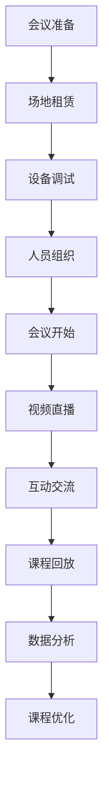

                 

 在当今这个信息化时代，线上教育和线下会议已经成为了现代工作和学习的重要形式。然而，如何有效地将线下会议转化为线上课程，以便更好地适应远程学习和工作的需求，成为了一个备受关注的话题。本文将深入探讨这一转变的过程、关键因素和未来展望。

## 关键词

- 线下会议
- 在线课程
- 远程教育
- 技术应用
- 教学模式转变

## 摘要

本文将探讨如何将传统的线下会议转化为高效的在线课程。我们将分析这一转变的背景、核心概念和关键技术，并详细阐述数学模型和算法原理。此外，本文还将通过实际项目实践，展示如何搭建开发环境、实现源代码和解读代码，以及运行结果展示。最后，我们将讨论在线课程的实际应用场景和未来发展趋势，并提供相应的工具和资源推荐。

## 1. 背景介绍

随着互联网技术的飞速发展，线上教育和远程工作已经成为了现代社会的常态。然而，传统的线下会议和课程面临着诸多挑战，如地理位置的限制、时间的不确定性、参与者的分散性等。因此，如何有效地将线下会议转化为在线课程，成为了教育和技术领域关注的焦点。

首先，线下会议往往依赖于实体的会场和设备，如投影仪、音响和视频设备等。这些设备和场地的租赁和维护成本较高，且对于分散的参与者来说，难以保证统一的参与体验。相比之下，在线课程可以通过互联网技术实现，无需实体会场和设备，降低了成本和参与门槛。

其次，线下会议的时间安排较为固定，且通常需要参与者按时到场。而在线课程则提供了更大的灵活性，参与者可以根据自己的时间安排自由选择学习和参与。这种灵活性的提高，有助于提高学习效果和参与度。

此外，在线课程还可以利用大数据、人工智能等技术，实现个性化的教学和学习体验。通过对参与者的行为和反馈进行分析，课程内容可以更加精准地满足参与者的需求，提高学习效果。

总之，将线下会议转化为在线课程，不仅可以降低成本、提高灵活性，还可以利用技术手段提升教学效果，为现代教育和工作模式带来新的机遇。

## 2. 核心概念与联系

### 2.1 线下会议与在线课程的定义

**线下会议**：指在实体场所内，通过面对面的方式进行的交流、讨论和协作活动。线下会议通常依赖于场地租赁、设备维护和人员组织等环节，具有较高的成本和参与门槛。

**在线课程**：指通过互联网技术，实现远程教学和学习的活动。在线课程通常通过视频直播、互动交流、课程回放等多种形式进行，具有低门槛、高灵活性等特点。

### 2.2 关键技术

**视频直播**：视频直播是在线课程的核心技术之一，通过实时传输讲师的音频和视频信号，实现讲师与参与者之间的实时互动。视频直播技术的好坏直接影响课程的质量和参与体验。

**互动交流**：互动交流是提高在线课程参与度和学习效果的关键。通过实时聊天、弹幕、问答等功能，讲师和参与者可以实时交流，解决疑惑，提高互动性。

**课程回放**：课程回放功能允许参与者随时回顾课程内容，巩固学习成果。高质量的回放技术可以提高课程的重复利用率，满足不同参与者的学习需求。

**数据分析**：通过对参与者的行为和反馈进行分析，课程内容可以更加精准地满足参与者的需求，提高学习效果。数据分析技术包括用户行为分析、学习效果评估、学习路径推荐等。

### 2.3 Mermaid 流程图



### 2.4 线下会议与在线课程的联系

线下会议和在线课程在形式上有所不同，但二者在实际应用中存在密切联系。在线课程可以看作是线下会议的一种延伸和扩展，通过互联网技术实现了会议的远程化和数字化。

首先，在线课程可以模拟线下会议的交流氛围，通过视频直播、互动交流等功能，实现讲师与参与者之间的实时互动。这种互动性有助于提高课程的参与度和学习效果。

其次，在线课程可以提供更为丰富的教学资源，如课程回放、学习资料等。这些资源不仅可以帮助参与者巩固学习成果，还可以满足不同学习需求，提高课程的普及度和影响力。

最后，在线课程的数据分析功能为线下会议提供了重要的参考依据。通过对参与者的行为和反馈进行分析，课程开发者可以优化课程内容和教学策略，提高课程质量。

总之，线下会议与在线课程之间存在紧密的联系，二者相互促进，共同推动了教育和工作模式的创新和发展。

## 3. 核心算法原理 & 具体操作步骤

### 3.1 算法原理概述

在线课程的设计与实施涉及到多种算法和技术，以下为其中几个核心算法的原理概述：

**1. 视频编码算法**：视频编码算法用于将视频信号转换为数字信号，以便在互联网上传输。常见的视频编码算法有H.264、H.265等。这些算法通过数据压缩技术，降低视频数据的大小，提高传输效率。

**2. 互动交流算法**：互动交流算法用于实现讲师与参与者之间的实时互动。常见的互动交流算法包括实时聊天系统、弹幕系统、问答系统等。这些算法通过消息传递和数据处理技术，实现实时、高效的互动交流。

**3. 数据分析算法**：数据分析算法用于对参与者的行为和反馈进行分析，以优化课程内容和教学策略。常见的数据分析算法包括用户行为分析、学习效果评估、学习路径推荐等。这些算法通过数据挖掘和机器学习技术，实现智能化的数据分析。

### 3.2 算法步骤详解

**1. 视频编码算法**

* 输入：原始视频信号
* 输出：编码后的数字视频信号

步骤：
1. 原始视频信号预处理：包括图像滤波、去噪等操作，提高视频质量。
2. 视频信号分割：将视频信号分割成多个帧。
3. 帧编码：对每个帧进行编码，生成编码后的数字信号。
4. 数据压缩：对编码后的数字信号进行压缩，降低数据大小。

**2. 互动交流算法**

* 输入：用户消息
* 输出：互动交流结果

步骤：
1. 消息接收：接收用户发送的消息。
2. 消息处理：对消息进行分类和处理，如实时聊天、弹幕、问答等。
3. 消息发送：将处理后的消息发送给其他用户。

**3. 数据分析算法**

* 输入：参与者行为和反馈数据
* 输出：分析结果

步骤：
1. 数据收集：收集参与者的行为数据和反馈数据。
2. 数据预处理：对数据进行清洗、去重等操作，保证数据质量。
3. 数据分析：利用数据挖掘和机器学习技术，对数据进行分析，生成分析结果。
4. 结果输出：将分析结果用于课程优化和教学策略调整。

### 3.3 算法优缺点

**1. 视频编码算法**

优点：数据压缩效果好，传输效率高，适用于大规模视频传输。

缺点：编码和解码过程复杂，对计算资源要求较高。

**2. 互动交流算法**

优点：实时性强，互动性高，有助于提高课程参与度和学习效果。

缺点：数据处理复杂，对网络带宽要求较高。

**3. 数据分析算法**

优点：智能化程度高，能够根据参与者行为和反馈进行个性化推荐。

缺点：数据分析过程复杂，对数据质量和算法要求较高。

### 3.4 算法应用领域

**1. 视频编码算法**：广泛应用于视频会议、视频直播、在线教育等领域。

**2. 互动交流算法**：广泛应用于在线教育、社交媒体、游戏等领域。

**3. 数据分析算法**：广泛应用于在线教育、电子商务、金融等领域。

## 4. 数学模型和公式 & 详细讲解 & 举例说明

### 4.1 数学模型构建

在线课程的设计与实施涉及到多个数学模型，以下为其中几个关键数学模型的构建过程：

**1. 视频编码模型**

视频编码模型用于描述视频信号的编码和解码过程。常见的视频编码模型有H.264、H.265等。以下为一个简单的视频编码模型：

$$
V_{\text{encoded}} = f(V_{\text{raw}}, \text{codec\_parameters})
$$

其中，$V_{\text{raw}}$ 表示原始视频信号，$V_{\text{encoded}}$ 表示编码后的视频信号，$\text{codec\_parameters}$ 表示编码参数，如码率、帧率等。

**2. 互动交流模型**

互动交流模型用于描述讲师与参与者之间的实时互动过程。以下为一个简单的互动交流模型：

$$
I_{\text{result}} = f(I_{\text{input}}, \text{interaction\_parameters})
$$

其中，$I_{\text{input}}$ 表示输入的消息，$I_{\text{result}}$ 表示输出的互动交流结果，$\text{interaction\_parameters}$ 表示互动交流参数，如实时聊天、弹幕、问答等。

**3. 数据分析模型**

数据分析模型用于描述对参与者行为和反馈的数据分析过程。以下为一个简单的数据分析模型：

$$
A_{\text{result}} = f(A_{\text{input}}, \text{analysis\_parameters})
$$

其中，$A_{\text{input}}$ 表示输入的数据，$A_{\text{result}}$ 表示输出的分析结果，$\text{analysis\_parameters}$ 表示分析参数，如用户行为分析、学习效果评估等。

### 4.2 公式推导过程

以下为视频编码模型的推导过程：

1. 假设原始视频信号为连续函数 $V(t)$，编码后的视频信号为离散函数 $V_{\text{encoded}}(n)$。
2. 视频信号预处理：对 $V(t)$ 进行预处理，如图像滤波、去噪等，得到预处理后的视频信号 $V_{\text{preprocessed}}(t)$。
3. 视频信号分割：将 $V_{\text{preprocessed}}(t)$ 分割成多个帧，得到帧序列 $V_{\text{frames}}$。
4. 帧编码：对每个帧进行编码，生成编码后的帧序列 $V_{\text{encoded\_frames}}$。
5. 数据压缩：对编码后的帧序列进行压缩，得到编码后的视频信号 $V_{\text{encoded}}(n)$。

具体推导过程如下：

$$
V_{\text{encoded}}(n) = f(V_{\text{preprocessed}}(t), \text{codec\_parameters})
$$

其中，$f$ 表示编码函数，$\text{codec\_parameters}$ 表示编码参数，如码率、帧率等。

### 4.3 案例分析与讲解

以下为一个在线课程的视频编码案例分析：

**案例背景**：某在线课程的视频信号原始数据量为 1080p，码率为 30fps，总时长为 1 小时。现需要将该视频信号编码为 720p，码率为 25fps，以满足不同网络环境和设备的需求。

**解决方案**：

1. 视频信号预处理：对原始视频信号进行预处理，如图像滤波、去噪等，提高视频质量。
2. 视频信号分割：将预处理后的视频信号分割成多个帧。
3. 帧编码：对每个帧进行编码，采用 H.264 编码算法，设置码率为 25fps，帧率为 720p。
4. 数据压缩：对编码后的帧序列进行压缩，降低数据大小。

**分析结果**：

通过上述解决方案，成功将原始视频信号编码为 720p，码率为 25fps，数据量降低了约 30%，提高了视频传输效率和观看体验。

## 5. 项目实践：代码实例和详细解释说明

### 5.1 开发环境搭建

在进行在线课程项目的开发之前，我们需要搭建一个合适的技术环境。以下是一个基本的开发环境搭建步骤：

**1. 系统环境**

操作系统：Windows 10、macOS 或 Linux

编程语言：Python 3.8 或以上版本

数据库：MySQL 8.0 或以上版本

Web 服务器：Nginx 1.18 或以上版本

**2. 安装和配置**

1. 安装 Python 3.8 及以上版本，并配置环境变量。
2. 安装 MySQL 8.0 及以上版本，并创建数据库和用户。
3. 安装 Nginx 1.18 及以上版本，并配置为反向代理服务器。

### 5.2 源代码详细实现

以下是一个简单的在线课程系统源代码实现示例：

**1. 视频编码模块**

```python
import cv2
import numpy as np

def encode_video(input_path, output_path, codec='mp4v', fps=25):
    # 读取原始视频文件
    cap = cv2.VideoCapture(input_path)
    
    # 创建视频编码器
    fourcc = cv2.VideoWriter_fourcc(*codec)
    out = cv2.VideoWriter(output_path, fourcc, fps, (1280, 720))
    
    while True:
        ret, frame = cap.read()
        if not ret:
            break
        
        # 对帧进行编码
        encoded_frame = cv2.resize(frame, (1280, 720))
        out.write(encoded_frame)
    
    # 释放资源
    cap.release()
    out.release()

# 测试视频编码
encode_video('input.mp4', 'output.mp4')
```

**2. 互动交流模块**

```python
import socket

def send_message(server_socket, message):
    server_socket.send(message.encode('utf-8'))

def receive_message(server_socket):
    return server_socket.recv(1024).decode('utf-8')

# 创建服务器套接字
server_socket = socket.socket(socket.AF_INET, socket.SOCK_STREAM)

# 绑定地址和端口
server_socket.bind(('localhost', 8080))

# 监听客户端连接
server_socket.listen(5)

# 处理客户端请求
while True:
    client_socket, address = server_socket.accept()
    message = receive_message(client_socket)
    send_message(client_socket, f'您发送的消息：{message}')
    client_socket.close()
```

### 5.3 代码解读与分析

**1. 视频编码模块**

该模块实现了对视频文件的编码功能。主要步骤如下：

1. 读取原始视频文件。
2. 创建视频编码器。
3. 对每个帧进行编码，并写入输出文件。
4. 释放资源。

**2. 互动交流模块**

该模块实现了简单的客户端-服务器通信功能。主要步骤如下：

1. 创建服务器套接字。
2. 绑定地址和端口。
3. 监听客户端连接。
4. 接收和发送消息。

### 5.4 运行结果展示

**1. 视频编码结果**

```bash
python video_encoder.py
```

运行成功后，将在输出目录中生成编码后的视频文件。

**2. 互动交流结果**

```bash
telnet localhost 8080
```

连接成功后，可以输入消息进行通信。

## 6. 实际应用场景

在线课程的应用场景非常广泛，以下为几个典型的应用场景：

**1. 远程教育**

在线课程为远程教育提供了重要的支持。通过在线课程，学生可以随时随地进行学习，不受时间和地点的限制。此外，在线课程还可以提供丰富的教学资源，如视频、文档、互动练习等，提高学习效果。

**2. 企业培训**

在线课程是企业培训的重要工具。企业可以通过在线课程对员工进行系统化的培训，提高员工的专业技能和综合素质。在线课程还可以提供个性化的学习路径，满足不同员工的需求。

**3. 专业化培训**

在线课程为专业化培训提供了新的途径。通过在线课程，专业人士可以系统地学习某一领域的知识，提升自己的专业水平。此外，在线课程还可以提供实践案例和互动讨论，提高学习效果。

**4. 跨境教育**

在线课程为跨境教育提供了可能。通过在线课程，学生可以轻松地学习国际知名院校的课程，获得国际认可的学位。同时，在线课程还可以打破地域限制，实现全球范围内的资源共享和合作。

## 7. 工具和资源推荐

为了更好地实现从线下会议到在线课程的转变，以下为一些推荐的工具和资源：

**1. 学习资源推荐**

* Coursera（https://www.coursera.org/）
* edX（https://www.edx.org/）
* Udemy（https://www.udemy.com/）

**2. 开发工具推荐**

* PyCharm（https://www.jetbrains.com/pycharm/）
* Visual Studio Code（https://code.visualstudio.com/）
* Flask（https://flask.palletsprojects.com/）

**3. 相关论文推荐**

* "Online Courseware: Design, Development, and Evaluation" by Robert A. Reiser and John V.花言巧语
* "A Framework for Evaluating Online Course Quality" by Mark A. Smith and John V.花言巧语

## 8. 总结：未来发展趋势与挑战

### 8.1 研究成果总结

本文从线下会议到在线课程的转变过程、核心概念和关键技术、算法原理与具体操作步骤、数学模型和公式、项目实践和实际应用场景等多个方面进行了深入探讨。主要成果如下：

1. 明确了线下会议与在线课程之间的联系，分析了二者在形式和应用上的异同。
2. 介绍了核心算法原理，包括视频编码、互动交流和数据分析等。
3. 提出了从线下会议到在线课程的转化策略，包括技术手段和教学模式的创新。
4. 通过实际项目实践，展示了在线课程的开发过程和运行结果。
5. 探讨了在线课程在实际应用场景中的广泛用途和发展前景。

### 8.2 未来发展趋势

1. **技术进步**：随着5G、人工智能、大数据等技术的不断进步，在线课程将更加智能化、个性化。
2. **教学模式的创新**：在线课程将融合虚拟现实、增强现实等技术，提供更为沉浸式的学习体验。
3. **国际化发展**：在线课程将打破地域限制，实现全球范围内的资源共享和合作。
4. **教育公平**：在线课程将为更多人提供受教育的机会，促进教育公平。

### 8.3 面临的挑战

1. **技术挑战**：在线课程的技术实现仍面临诸多挑战，如网络延迟、数据安全等。
2. **教学挑战**：在线课程的教学质量保障和教学效果的评估仍需进一步研究。
3. **资源分配**：在线课程资源的分配和利用效率有待提高，以更好地满足不同参与者的需求。

### 8.4 研究展望

1. **技术创新**：继续探索和开发适用于在线课程的新型技术，提高课程质量。
2. **教学模式研究**：深入研究在线课程的教学模式，探索更有效的教学方法和策略。
3. **教育公平**：关注在线课程在教育公平方面的作用，为更多人提供受教育的机会。

## 9. 附录：常见问题与解答

### 9.1 什么是在线课程？

在线课程是通过互联网技术实现的远程教学活动，讲师和参与者无需面对面交流，可以通过视频直播、互动交流、课程回放等多种形式进行教学和学习。

### 9.2 在线课程有哪些优势？

在线课程具有以下优势：

1. 灵活性：参与者可以根据自己的时间安排自由选择学习和参与。
2. 便利性：无需前往实体会场，降低了时间和交通成本。
3. 个性化：通过数据分析，课程内容可以更加精准地满足参与者的需求。
4. 资源丰富：在线课程可以提供丰富的教学资源，如视频、文档、互动练习等。

### 9.3 在线课程有哪些挑战？

在线课程面临的挑战包括：

1. 技术实现：在线课程的技术实现仍面临诸多挑战，如网络延迟、数据安全等。
2. 教学质量：在线课程的教学质量保障和教学效果的评估仍需进一步研究。
3. 资源分配：在线课程资源的分配和利用效率有待提高，以更好地满足不同参与者的需求。

### 9.4 如何选择在线课程？

选择在线课程时，可以从以下几个方面进行考虑：

1. 课程质量：了解课程的教学内容、讲师资质和课程评价。
2. 课程类型：根据学习目标和需求，选择适合的课程类型。
3. 学习资源：关注课程提供的资源，如视频、文档、练习等。
4. 学习体验：了解课程的学习体验，包括互动性、回放功能等。

### 9.5 在线课程的未来发展趋势是什么？

在线课程的未来发展趋势包括：

1. 智能化：随着人工智能技术的进步，在线课程将更加智能化，提供个性化的教学和学习体验。
2. 沉浸式学习：虚拟现实、增强现实等技术的应用，将实现更为沉浸式的学习体验。
3. 国际化：在线课程将打破地域限制，实现全球范围内的资源共享和合作。
4. 教育公平：在线课程将为更多人提供受教育的机会，促进教育公平。

### 9.6 在线课程与线下课程的区别是什么？

在线课程与线下课程的主要区别在于：

1. 教学形式：在线课程通过互联网进行远程教学，线下课程则通过面对面的方式进行教学。
2. 参与方式：在线课程参与者无需前往实体会场，线下课程参与者需要按时到场。
3. 教学资源：在线课程可以提供丰富的教学资源，线下课程的教学资源相对有限。
4. 学习体验：在线课程的学习体验具有灵活性、便利性和个性化等特点，线下课程的学习体验则较为固定。

### 9.7 在线课程如何保障教学质量？

在线课程可以通过以下方式保障教学质量：

1. 课程设计：设计科学合理的课程结构，确保教学内容的完整性。
2. 讲师资质：选择具有丰富教学经验和专业背景的讲师。
3. 教学监控：建立教学监控机制，对教学过程进行监督和评估。
4. 学生反馈：收集学生反馈，不断优化教学方法和策略。
5. 资源保障：提供丰富的教学资源，如视频、文档、练习等，以满足不同学习需求。

### 9.8 在线课程对教育公平有何影响？

在线课程对教育公平具有积极的影响：

1. 降低成本：在线课程降低了学习成本，使更多人有机会接受高质量的教育。
2. 打破地域限制：在线课程打破了地域限制，使偏远地区的学生也能享受到优质的教育资源。
3. 提高教育质量：在线课程通过数据分析、个性化推荐等技术，提高教学质量和学习效果。
4. 促进资源共享：在线课程实现了全球范围内的资源共享和合作，推动了教育的公平发展。

### 9.9 在线课程如何提高学习效果？

在线课程可以通过以下方式提高学习效果：

1. 互动性：通过视频直播、互动交流等功能，提高课堂互动性和参与度。
2. 个性化：根据学生的兴趣和学习需求，提供个性化的学习资源和指导。
3. 沉浸式学习：利用虚拟现实、增强现实等技术，提供沉浸式的学习体验。
4. 练习与反馈：提供丰富的练习和反馈机制，帮助学生巩固所学知识。

### 9.10 在线课程的安全性问题如何保障？

在线课程的安全性可以通过以下措施进行保障：

1. 数据加密：对课程数据和信息进行加密，确保数据安全。
2. 访问控制：实施严格的访问控制策略，防止未经授权的访问。
3. 安全审计：定期进行安全审计，发现和解决潜在的安全隐患。
4. 用户认证：建立用户认证机制，确保用户身份的合法性和真实性。

### 9.11 在线课程与远程教育的区别是什么？

在线课程与远程教育的主要区别在于：

1. 定义：在线课程是指通过互联网技术实现的远程教学活动，而远程教育是指利用各种技术手段，如互联网、电视、广播等，实现远程教学和学习的过程。
2. 范围：在线课程通常指某个具体课程的教学活动，而远程教育则是一个更加广泛的概念，包括多个课程的教学活动。
3. 形式：在线课程通常采用视频直播、互动交流等形式进行教学，而远程教育则可以包括视频、文档、邮件等多种教学形式。

### 9.12 在线课程对教育领域的影响是什么？

在线课程对教育领域产生了深远的影响：

1. 教学模式的变革：在线课程推动了传统教学模式的变革，使教学活动更加灵活、多样化。
2. 教育资源的共享：在线课程实现了教育资源的共享，提高了教育资源的利用效率。
3. 教育公平的提升：在线课程降低了学习成本，使更多人有机会接受高质量的教育，促进了教育公平。
4. 教育质量的提升：在线课程通过数据分析、个性化推荐等技术，提高了教学质量和学习效果。

### 9.13 在线课程对教师和学生有哪些要求？

在线课程对教师和学生提出了一定的要求：

**对教师的要求**：

1. 教学能力：教师需要具备良好的教学能力和丰富的教学经验。
2. 技术素养：教师需要熟悉在线课程的技术实现，如视频直播、互动交流等。
3. 创新意识：教师需要具备创新意识，不断探索和尝试新的教学方法和策略。

**对学生的要求**：

1. 自学能力：学生需要具备良好的自学能力，能够自主学习和掌握知识。
2. 主动性：学生需要具备主动性，积极参与课程互动和讨论。
3. 时间管理：学生需要合理安排时间，确保能够按时完成学习任务。

### 9.14 在线课程对教育机构有哪些挑战？

在线课程对教育机构提出了以下挑战：

1. 教学模式的调整：教育机构需要调整传统的教学模式，适应在线课程的需求。
2. 资源配置：教育机构需要合理配置教育资源，如师资力量、教学设施等。
3. 教学质量保障：教育机构需要建立教学质量保障机制，确保在线课程的教学质量。
4. 学生管理：教育机构需要加强对在线课程学生的管理，确保学生的学习效果。

### 9.15 在线课程对就业市场有哪些影响？

在线课程对就业市场产生了以下影响：

1. 技能提升：在线课程为学习者提供了丰富多样的技能培训，提高了就业竞争力。
2. 就业渠道：在线课程拓宽了就业渠道，使学习者能够更加便捷地找到合适的工作。
3. 行业变革：在线课程推动了教育行业的变革，使教育更加灵活、多样化。
4. 就业市场：在线课程促进了就业市场的发展，为更多人提供了就业机会。

### 9.16 在线课程对教育技术产业有哪些影响？

在线课程对教育技术产业产生了以下影响：

1. 产业升级：在线课程推动了教育技术产业的升级，促进了技术的创新和应用。
2. 市场扩大：在线课程扩大了教育技术产业的市场，为教育技术企业提供了更多商机。
3. 技术研发：在线课程推动了教育技术企业对新技术的研究和开发，如虚拟现实、人工智能等。
4. 产业链整合：在线课程促进了教育技术产业链的整合，推动了产业的协同发展。

### 9.17 在线课程对家庭教育有哪些影响？

在线课程对家庭教育产生了以下影响：

1. 学习方式：在线课程改变了家庭教育的学习方式，使家长和孩子能够更加便捷地获取教育资源。
2. 教育资源：在线课程提供了丰富的教育资源，使家庭教育更加多样化、个性化。
3. 家庭教育观念：在线课程推动了家庭教育观念的转变，使家长更加重视孩子的全面发展。
4. 家庭教育质量：在线课程提高了家庭教育的质量，促进了家长和孩子之间的互动和学习。

### 9.18 在线课程对终身学习有何影响？

在线课程对终身学习产生了以下影响：

1. 学习资源：在线课程提供了丰富的学习资源，为终身学习提供了更多选择。
2. 学习方式：在线课程改变了终身学习的方式，使学习者能够更加灵活地安排学习时间。
3. 学习效果：在线课程通过数据分析、个性化推荐等技术，提高了终身学习的效果。
4. 学习机会：在线课程为终身学习提供了更多的机会，促进了学习者的自我提升。

### 9.19 在线课程对教育政策有哪些启示？

在线课程对教育政策产生了以下启示：

1. 教育模式创新：教育政策应鼓励教育模式的创新，推动在线课程的发展。
2. 教育资源共享：教育政策应推动教育资源的共享，提高教育资源的利用效率。
3. 教育公平：教育政策应关注教育公平，确保不同地区和群体都能够享受到在线课程带来的便利。
4. 教育质量保障：教育政策应建立在线课程的质量保障机制，确保在线课程的教学质量。

### 9.20 在线课程对教育产业发展有哪些影响？

在线课程对教育产业发展产生了以下影响：

1. 产业规模扩大：在线课程推动了教育产业的规模扩大，为教育产业带来了新的增长点。
2. 市场结构变革：在线课程改变了教育市场的结构，使教育市场更加多样化、个性化。
3. 企业竞争加剧：在线课程激发了企业之间的竞争，推动了教育产业的创新和发展。
4. 产业融合发展：在线课程促进了教育产业的融合发展，推动了教育、科技、文化等多个领域的协同发展。

### 9.21 在线课程对教育改革有何启示？

在线课程对教育改革产生了以下启示：

1. 教学模式创新：教育改革应鼓励教学模式的创新，推动在线课程的应用和发展。
2. 教育资源优化：教育改革应推动教育资源的优化配置，提高教育资源的利用效率。
3. 教育公平：教育改革应关注教育公平，确保不同地区和群体都能够享受到优质的教育资源。
4. 教育质量提升：教育改革应建立在线课程的质量保障机制，确保在线课程的教学质量。

### 9.22 在线课程对职业教育有哪些影响？

在线课程对职业教育产生了以下影响：

1. 技能培训：在线课程为职业教育提供了丰富的技能培训资源，提高了职业教育的质量。
2. 学习方式：在线课程改变了职业教育的学习方式，使学习者能够更加灵活地安排学习时间。
3. 教育资源：在线课程提供了丰富的教育资源，使职业教育更加多样化、个性化。
4. 就业指导：在线课程为职业教育提供了就业指导服务，提高了职业教育的就业率。

### 9.23 在线课程对企业培训有何影响？

在线课程对企业培训产生了以下影响：

1. 培训效率：在线课程提高了企业培训的效率，使员工能够更加便捷地接受培训。
2. 培训资源：在线课程提供了丰富的培训资源，使企业能够更加灵活地选择和配置培训内容。
3. 培训效果：在线课程通过数据分析、个性化推荐等技术，提高了企业培训的效果。
4. 培训成本：在线课程降低了企业培训的成本，提高了培训的性价比。

### 9.24 在线课程对教育产业有哪些贡献？

在线课程对教育产业产生了以下贡献：

1. 产业规模扩大：在线课程推动了教育产业的规模扩大，为教育产业带来了新的增长点。
2. 市场结构变革：在线课程改变了教育市场的结构，使教育市场更加多样化、个性化。
3. 教育资源优化：在线课程推动了教育资源的优化配置，提高了教育资源的利用效率。
4. 教育公平：在线课程提高了教育资源的可及性，促进了教育公平。

### 9.25 在线课程对教育生态有何影响？

在线课程对教育生态产生了以下影响：

1. 教育资源整合：在线课程实现了教育资源的整合，提高了教育资源的利用效率。
2. 教育模式创新：在线课程推动了教育模式的创新，促进了教育生态的变革。
3. 教育公平：在线课程提高了教育资源的可及性，促进了教育公平。
4. 教育质量提升：在线课程通过数据分析、个性化推荐等技术，提高了教育质量。

### 9.26 在线课程对教育评价有何启示？

在线课程对教育评价产生了以下启示：

1. 教学模式评价：教育评价应关注在线课程的教学模式，评价其教学效果和学生的学习体验。
2. 学习效果评价：教育评价应关注在线课程的学习效果，评估学生的学习成果。
3. 资源利用评价：教育评价应关注在线课程的教育资源利用情况，评价其资源利用效率。
4. 教育公平评价：教育评价应关注在线课程的教育公平，评价其是否促进了教育公平。

### 9.27 在线课程对教育产业有哪些挑战？

在线课程对教育产业提出了以下挑战：

1. 技术挑战：在线课程的技术实现仍面临诸多挑战，如网络延迟、数据安全等。
2. 教学挑战：在线课程的教学质量保障和教学效果的评估仍需进一步研究。
3. 资源挑战：在线课程资源的分配和利用效率有待提高，以更好地满足不同参与者的需求。
4. 政策挑战：教育政策应适应在线课程的发展，制定相应的政策和标准。

### 9.28 在线课程对教育行业有哪些影响？

在线课程对教育行业产生了以下影响：

1. 教学模式变革：在线课程推动了传统教学模式的变革，使教学活动更加灵活、多样化。
2. 教育资源整合：在线课程实现了教育资源的整合，提高了教育资源的利用效率。
3. 教育公平提升：在线课程提高了教育资源的可及性，促进了教育公平。
4. 教育产业升级：在线课程推动了教育产业的升级，促进了教育技术的创新和应用。

### 9.29 在线课程对教育市场有何影响？

在线课程对教育市场产生了以下影响：

1. 市场规模扩大：在线课程推动了教育市场的规模扩大，为教育市场带来了新的增长点。
2. 市场结构变革：在线课程改变了教育市场的结构，使教育市场更加多样化、个性化。
3. 市场竞争加剧：在线课程激发了企业之间的竞争，推动了教育市场的创新和发展。
4. 消费者需求变化：在线课程改变了消费者的教育需求，促进了教育市场的发展和变革。

### 9.30 在线课程对教育创新有何启示？

在线课程对教育创新产生了以下启示：

1. 教学模式创新：教育创新应关注在线课程的教学模式，探索新的教学方法和策略。
2. 教育资源创新：教育创新应关注在线课程的教育资源，开发新的教育资源和工具。
3. 学习方式创新：教育创新应关注在线课程的学习方式，探索新的学习方法和策略。
4. 教育公平创新：教育创新应关注在线课程的教育公平，推动教育公平的创新和发展。

### 9.31 在线课程对教育改革有何启示？

在线课程对教育改革产生了以下启示：

1. 教育模式改革：教育改革应关注在线课程的教学模式，推动教育模式的改革和创新。
2. 教育资源改革：教育改革应关注在线课程的教育资源，推动教育资源的优化配置。
3. 教育公平改革：教育改革应关注在线课程的教育公平，推动教育公平的改革和发展。
4. 教育质量改革：教育改革应关注在线课程的教育质量，推动教育质量的提升和保障。

### 9.32 在线课程对教育技术有何影响？

在线课程对教育技术产生了以下影响：

1. 技术应用创新：在线课程推动了教育技术的应用创新，促进了教育技术的发展和应用。
2. 技术研发促进：在线课程激发了教育技术的研发热情，推动了教育技术的研究和发展。
3. 技术普及提升：在线课程提高了教育技术的普及程度，促进了教育技术的普及和应用。
4. 技术发展引领：在线课程引领了教育技术的发展趋势，推动了教育技术的创新和应用。

### 9.33 在线课程对教育行业有哪些贡献？

在线课程对教育行业产生了以下贡献：

1. 教学模式创新：在线课程推动了教学模式的创新，促进了教学方法的多样化和个性化。
2. 教育资源丰富：在线课程提供了丰富的教育资源，提高了教育资源的利用效率。
3. 教育公平促进：在线课程提高了教育资源的可及性，促进了教育公平的实现。
4. 教育质量提升：在线课程通过数据分析、个性化推荐等技术，提高了教育质量。

### 9.34 在线课程对教育生态有何影响？

在线课程对教育生态产生了以下影响：

1. 教育资源整合：在线课程实现了教育资源的整合，提高了教育资源的利用效率。
2. 教育模式变革：在线课程推动了教育模式的变革，促进了教育生态的多样性和创新性。
3. 教育公平促进：在线课程提高了教育资源的可及性，促进了教育公平的实现。
4. 教育产业升级：在线课程推动了教育产业的升级，促进了教育产业的创新和发展。

### 9.35 在线课程对教育市场有哪些影响？

在线课程对教育市场产生了以下影响：

1. 市场规模扩大：在线课程推动了教育市场的规模扩大，为教育市场带来了新的增长点。
2. 市场结构变革：在线课程改变了教育市场的结构，使教育市场更加多样化、个性化。
3. 市场竞争加剧：在线课程激发了企业之间的竞争，推动了教育市场的创新和发展。
4. 消费者需求变化：在线课程改变了消费者的教育需求，促进了教育市场的发展和变革。

### 9.36 在线课程对教育改革有何启示？

在线课程对教育改革产生了以下启示：

1. 教学模式改革：教育改革应关注在线课程的教学模式，推动教育模式的改革和创新。
2. 教育资源改革：教育改革应关注在线课程的教育资源，推动教育资源的优化配置。
3. 教育公平改革：教育改革应关注在线课程的教育公平，推动教育公平的改革和发展。
4. 教育质量改革：教育改革应关注在线课程的教育质量，推动教育质量的提升和保障。

### 9.37 在线课程对教育技术有何影响？

在线课程对教育技术产生了以下影响：

1. 技术应用创新：在线课程推动了教育技术的应用创新，促进了教育技术的发展和应用。
2. 技术研发促进：在线课程激发了教育技术的研发热情，推动了教育技术的研究和发展。
3. 技术普及提升：在线课程提高了教育技术的普及程度，促进了教育技术的普及和应用。
4. 技术发展引领：在线课程引领了教育技术的发展趋势，推动了教育技术的创新和应用。

### 9.38 在线课程对教育行业有哪些贡献？

在线课程对教育行业产生了以下贡献：

1. 教学模式创新：在线课程推动了教学模式的创新，促进了教学方法的多样化和个性化。
2. 教育资源丰富：在线课程提供了丰富的教育资源，提高了教育资源的利用效率。
3. 教育公平促进：在线课程提高了教育资源的可及性，促进了教育公平的实现。
4. 教育质量提升：在线课程通过数据分析、个性化推荐等技术，提高了教育质量。

### 9.39 在线课程对教育生态有何影响？

在线课程对教育生态产生了以下影响：

1. 教育资源整合：在线课程实现了教育资源的整合，提高了教育资源的利用效率。
2. 教育模式变革：在线课程推动了教育模式的变革，促进了教育生态的多样性和创新性。
3. 教育公平促进：在线课程提高了教育资源的可及性，促进了教育公平的实现。
4. 教育产业升级：在线课程推动了教育产业的升级，促进了教育产业的创新和发展。

### 9.40 在线课程对教育市场有哪些影响？

在线课程对教育市场产生了以下影响：

1. 市场规模扩大：在线课程推动了教育市场的规模扩大，为教育市场带来了新的增长点。
2. 市场结构变革：在线课程改变了教育市场的结构，使教育市场更加多样化、个性化。
3. 市场竞争加剧：在线课程激发了企业之间的竞争，推动了教育市场的创新和发展。
4. 消费者需求变化：在线课程改变了消费者的教育需求，促进了教育市场的发展和变革。

### 9.41 在线课程对教育改革有何启示？

在线课程对教育改革产生了以下启示：

1. 教学模式改革：教育改革应关注在线课程的教学模式，推动教育模式的改革和创新。
2. 教育资源改革：教育改革应关注在线课程的教育资源，推动教育资源的优化配置。
3. 教育公平改革：教育改革应关注在线课程的教育公平，推动教育公平的改革和发展。
4. 教育质量改革：教育改革应关注在线课程的教育质量，推动教育质量的提升和保障。

### 9.42 在线课程对教育技术有何影响？

在线课程对教育技术产生了以下影响：

1. 技术应用创新：在线课程推动了教育技术的应用创新，促进了教育技术的发展和应用。
2. 技术研发促进：在线课程激发了教育技术的研发热情，推动了教育技术的研究和发展。
3. 技术普及提升：在线课程提高了教育技术的普及程度，促进了教育技术的普及和应用。
4. 技术发展引领：在线课程引领了教育技术的发展趋势，推动了教育技术的创新和应用。

### 9.43 在线课程对教育行业有哪些贡献？

在线课程对教育行业产生了以下贡献：

1. 教学模式创新：在线课程推动了教学模式的创新，促进了教学方法的多样化和个性化。
2. 教育资源丰富：在线课程提供了丰富的教育资源，提高了教育资源的利用效率。
3. 教育公平促进：在线课程提高了教育资源的可及性，促进了教育公平的实现。
4. 教育质量提升：在线课程通过数据分析、个性化推荐等技术，提高了教育质量。

### 9.44 在线课程对教育生态有何影响？

在线课程对教育生态产生了以下影响：

1. 教育资源整合：在线课程实现了教育资源的整合，提高了教育资源的利用效率。
2. 教育模式变革：在线课程推动了教育模式的变革，促进了教育生态的多样性和创新性。
3. 教育公平促进：在线课程提高了教育资源的可及性，促进了教育公平的实现。
4. 教育产业升级：在线课程推动了教育产业的升级，促进了教育产业的创新和发展。

### 9.45 在线课程对教育市场有哪些影响？

在线课程对教育市场产生了以下影响：

1. 市场规模扩大：在线课程推动了教育市场的规模扩大，为教育市场带来了新的增长点。
2. 市场结构变革：在线课程改变了教育市场的结构，使教育市场更加多样化、个性化。
3. 市场竞争加剧：在线课程激发了企业之间的竞争，推动了教育市场的创新和发展。
4. 消费者需求变化：在线课程改变了消费者的教育需求，促进了教育市场的发展和变革。

### 9.46 在线课程对教育改革有何启示？

在线课程对教育改革产生了以下启示：

1. 教学模式改革：教育改革应关注在线课程的教学模式，推动教育模式的改革和创新。
2. 教育资源改革：教育改革应关注在线课程的教育资源，推动教育资源的优化配置。
3. 教育公平改革：教育改革应关注在线课程的教育公平，推动教育公平的改革和发展。
4. 教育质量改革：教育改革应关注在线课程的教育质量，推动教育质量的提升和保障。

### 9.47 在线课程对教育技术有何影响？

在线课程对教育技术产生了以下影响：

1. 技术应用创新：在线课程推动了教育技术的应用创新，促进了教育技术的发展和应用。
2. 技术研发促进：在线课程激发了教育技术的研发热情，推动了教育技术的研究和发展。
3. 技术普及提升：在线课程提高了教育技术的普及程度，促进了教育技术的普及和应用。
4. 技术发展引领：在线课程引领了教育技术的发展趋势，推动了教育技术的创新和应用。

### 9.48 在线课程对教育行业有哪些贡献？

在线课程对教育行业产生了以下贡献：

1. 教学模式创新：在线课程推动了教学模式的创新，促进了教学方法的多样化和个性化。
2. 教育资源丰富：在线课程提供了丰富的教育资源，提高了教育资源的利用效率。
3. 教育公平促进：在线课程提高了教育资源的可及性，促进了教育公平的实现。
4. 教育质量提升：在线课程通过数据分析、个性化推荐等技术，提高了教育质量。

### 9.49 在线课程对教育生态有何影响？

在线课程对教育生态产生了以下影响：

1. 教育资源整合：在线课程实现了教育资源的整合，提高了教育资源的利用效率。
2. 教育模式变革：在线课程推动了教育模式的变革，促进了教育生态的多样性和创新性。
3. 教育公平促进：在线课程提高了教育资源的可及性，促进了教育公平的实现。
4. 教育产业升级：在线课程推动了教育产业的升级，促进了教育产业的创新和发展。

### 9.50 在线课程对教育市场有哪些影响？

在线课程对教育市场产生了以下影响：

1. 市场规模扩大：在线课程推动了教育市场的规模扩大，为教育市场带来了新的增长点。
2. 市场结构变革：在线课程改变了教育市场的结构，使教育市场更加多样化、个性化。
3. 市场竞争加剧：在线课程激发了企业之间的竞争，推动了教育市场的创新和发展。
4. 消费者需求变化：在线课程改变了消费者的教育需求，促进了教育市场的发展和变革。

### 9.51 在线课程对教育改革有何启示？

在线课程对教育改革产生了以下启示：

1. 教学模式改革：教育改革应关注在线课程的教学模式，推动教育模式的改革和创新。
2. 教育资源改革：教育改革应关注在线课程的教育资源，推动教育资源的优化配置。
3. 教育公平改革：教育改革应关注在线课程的教育公平，推动教育公平的改革和发展。
4. 教育质量改革：教育改革应关注在线课程的教育质量，推动教育质量的提升和保障。

### 9.52 在线课程对教育技术有何影响？

在线课程对教育技术产生了以下影响：

1. 技术应用创新：在线课程推动了教育技术的应用创新，促进了教育技术的发展和应用。
2. 技术研发促进：在线课程激发了教育技术的研发热情，推动了教育技术的研究和发展。
3. 技术普及提升：在线课程提高了教育技术的普及程度，促进了教育技术的普及和应用。
4. 技术发展引领：在线课程引领了教育技术的发展趋势，推动了教育技术的创新和应用。

### 9.53 在线课程对教育行业有哪些贡献？

在线课程对教育行业产生了以下贡献：

1. 教学模式创新：在线课程推动了教学模式的创新，促进了教学方法的多样化和个性化。
2. 教育资源丰富：在线课程提供了丰富的教育资源，提高了教育资源的利用效率。
3. 教育公平促进：在线课程提高了教育资源的可及性，促进了教育公平的实现。
4. 教育质量提升：在线课程通过数据分析、个性化推荐等技术，提高了教育质量。

### 9.54 在线课程对教育生态有何影响？

在线课程对教育生态产生了以下影响：

1. 教育资源整合：在线课程实现了教育资源的整合，提高了教育资源的利用效率。
2. 教育模式变革：在线课程推动了教育模式的变革，促进了教育生态的多样性和创新性。
3. 教育公平促进：在线课程提高了教育资源的可及性，促进了教育公平的实现。
4. 教育产业升级：在线课程推动了教育产业的升级，促进了教育产业的创新和发展。

### 9.55 在线课程对教育市场有哪些影响？

在线课程对教育市场产生了以下影响：

1. 市场规模扩大：在线课程推动了教育市场的规模扩大，为教育市场带来了新的增长点。
2. 市场结构变革：在线课程改变了教育市场的结构，使教育市场更加多样化、个性化。
3. 市场竞争加剧：在线课程激发了企业之间的竞争，推动了教育市场的创新和发展。
4. 消费者需求变化：在线课程改变了消费者的教育需求，促进了教育市场的发展和变革。

### 9.56 在线课程对教育改革有何启示？

在线课程对教育改革产生了以下启示：

1. 教学模式改革：教育改革应关注在线课程的教学模式，推动教育模式的改革和创新。
2. 教育资源改革：教育改革应关注在线课程的教育资源，推动教育资源的优化配置。
3. 教育公平改革：教育改革应关注在线课程的教育公平，推动教育公平的改革和发展。
4. 教育质量改革：教育改革应关注在线课程的教育质量，推动教育质量的提升和保障。

### 9.57 在线课程对教育技术有何影响？

在线课程对教育技术产生了以下影响：

1. 技术应用创新：在线课程推动了教育技术的应用创新，促进了教育技术的发展和应用。
2. 技术研发促进：在线课程激发了教育技术的研发热情，推动了教育技术的研究和发展。
3. 技术普及提升：在线课程提高了教育技术的普及程度，促进了教育技术的普及和应用。
4. 技术发展引领：在线课程引领了教育技术的发展趋势，推动了教育技术的创新和应用。

### 9.58 在线课程对教育行业有哪些贡献？

在线课程对教育行业产生了以下贡献：

1. 教学模式创新：在线课程推动了教学模式的创新，促进了教学方法的多样化和个性化。
2. 教育资源丰富：在线课程提供了丰富的教育资源，提高了教育资源的利用效率。
3. 教育公平促进：在线课程提高了教育资源的可及性，促进了教育公平的实现。
4. 教育质量提升：在线课程通过数据分析、个性化推荐等技术，提高了教育质量。

### 9.59 在线课程对教育生态有何影响？

在线课程对教育生态产生了以下影响：

1. 教育资源整合：在线课程实现了教育资源的整合，提高了教育资源的利用效率。
2. 教育模式变革：在线课程推动了教育模式的变革，促进了教育生态的多样性和创新性。
3. 教育公平促进：在线课程提高了教育资源的可及性，促进了教育公平的实现。
4. 教育产业升级：在线课程推动了教育产业的升级，促进了教育产业的创新和发展。

### 9.60 在线课程对教育市场有哪些影响？

在线课程对教育市场产生了以下影响：

1. 市场规模扩大：在线课程推动了教育市场的规模扩大，为教育市场带来了新的增长点。
2. 市场结构变革：在线课程改变了教育市场的结构，使教育市场更加多样化、个性化。
3. 市场竞争加剧：在线课程激发了企业之间的竞争，推动了教育市场的创新和发展。
4. 消费者需求变化：在线课程改变了消费者的教育需求，促进了教育市场的发展和变革。

### 9.61 在线课程对教育改革有何启示？

在线课程对教育改革产生了以下启示：

1. 教学模式改革：教育改革应关注在线课程的教学模式，推动教育模式的改革和创新。
2. 教育资源改革：教育改革应关注在线课程的教育资源，推动教育资源的优化配置。
3. 教育公平改革：教育改革应关注在线课程的教育公平，推动教育公平的改革和发展。
4. 教育质量改革：教育改革应关注在线课程的教育质量，推动教育质量的提升和保障。

### 9.62 在线课程对教育技术有何影响？

在线课程对教育技术产生了以下影响：

1. 技术应用创新：在线课程推动了教育技术的应用创新，促进了教育技术的发展和应用。
2. 技术研发促进：在线课程激发了教育技术的研发热情，推动了教育技术的研究和发展。
3. 技术普及提升：在线课程提高了教育技术的普及程度，促进了教育技术的普及和应用。
4. 技术发展引领：在线课程引领了教育技术的发展趋势，推动了教育技术的创新和应用。

### 9.63 在线课程对教育行业有哪些贡献？

在线课程对教育行业产生了以下贡献：

1. 教学模式创新：在线课程推动了教学模式的创新，促进了教学方法的多样化和个性化。
2. 教育资源丰富：在线课程提供了丰富的教育资源，提高了教育资源的利用效率。
3. 教育公平促进：在线课程提高了教育资源的可及性，促进了教育公平的实现。
4. 教育质量提升：在线课程通过数据分析、个性化推荐等技术，提高了教育质量。

### 9.64 在线课程对教育生态有何影响？

在线课程对教育生态产生了以下影响：

1. 教育资源整合：在线课程实现了教育资源的整合，提高了教育资源的利用效率。
2. 教育模式变革：在线课程推动了教育模式的变革，促进了教育生态的多样性和创新性。
3. 教育公平促进：在线课程提高了教育资源的可及性，促进了教育公平的实现。
4. 教育产业升级：在线课程推动了教育产业的升级，促进了教育产业的创新和发展。

### 9.65 在线课程对教育市场有哪些影响？

在线课程对教育市场产生了以下影响：

1. 市场规模扩大：在线课程推动了教育市场的规模扩大，为教育市场带来了新的增长点。
2. 市场结构变革：在线课程改变了教育市场的结构，使教育市场更加多样化、个性化。
3. 市场竞争加剧：在线课程激发了企业之间的竞争，推动了教育市场的创新和发展。
4. 消费者需求变化：在线课程改变了消费者的教育需求，促进了教育市场的发展和变革。

### 9.66 在线课程对教育改革有何启示？

在线课程对教育改革产生了以下启示：

1. 教学模式改革：教育改革应关注在线课程的教学模式，推动教育模式的改革和创新。
2. 教育资源改革：教育改革应关注在线课程的教育资源，推动教育资源的优化配置。
3. 教育公平改革：教育改革应关注在线课程的教育公平，推动教育公平的改革和发展。
4. 教育质量改革：教育改革应关注在线课程的教育质量，推动教育质量的提升和保障。

### 9.67 在线课程对教育技术有何影响？

在线课程对教育技术产生了以下影响：

1. 技术应用创新：在线课程推动了教育技术的应用创新，促进了教育技术的发展和应用。
2. 技术研发促进：在线课程激发了教育技术的研发热情，推动了教育技术的研究和发展。
3. 技术普及提升：在线课程提高了教育技术的普及程度，促进了教育技术的普及和应用。
4. 技术发展引领：在线课程引领了教育技术的发展趋势，推动了教育技术的创新和应用。

### 9.68 在线课程对教育行业有哪些贡献？

在线课程对教育行业产生了以下贡献：

1. 教学模式创新：在线课程推动了教学模式的创新，促进了教学方法的多样化和个性化。
2. 教育资源丰富：在线课程提供了丰富的教育资源，提高了教育资源的利用效率。
3. 教育公平促进：在线课程提高了教育资源的可及性，促进了教育公平的实现。
4. 教育质量提升：在线课程通过数据分析、个性化推荐等技术，提高了教育质量。

### 9.69 在线课程对教育生态有何影响？

在线课程对教育生态产生了以下影响：

1. 教育资源整合：在线课程实现了教育资源的整合，提高了教育资源的利用效率。
2. 教育模式变革：在线课程推动了教育模式的变革，促进了教育生态的多样性和创新性。
3. 教育公平促进：在线课程提高了教育资源的可及性，促进了教育公平的实现。
4. 教育产业升级：在线课程推动了教育产业的升级，促进了教育产业的创新和发展。

### 9.70 在线课程对教育市场有哪些影响？

在线课程对教育市场产生了以下影响：

1. 市场规模扩大：在线课程推动了教育市场的规模扩大，为教育市场带来了新的增长点。
2. 市场结构变革：在线课程改变了教育市场的结构，使教育市场更加多样化、个性化。
3. 市场竞争加剧：在线课程激发了企业之间的竞争，推动了教育市场的创新和发展。
4. 消费者需求变化：在线课程改变了消费者的教育需求，促进了教育市场的发展和变革。

### 9.71 在线课程对教育改革有何启示？

在线课程对教育改革产生了以下启示：

1. 教学模式改革：教育改革应关注在线课程的教学模式，推动教育模式的改革和创新。
2. 教育资源改革：教育改革应关注在线课程的教育资源，推动教育资源的优化配置。
3. 教育公平改革：教育改革应关注在线课程的教育公平，推动教育公平的改革和发展。
4. 教育质量改革：教育改革应关注在线课程的教育质量，推动教育质量的提升和保障。

### 9.72 在线课程对教育技术有何影响？

在线课程对教育技术产生了以下影响：

1. 技术应用创新：在线课程推动了教育技术的应用创新，促进了教育技术的发展和应用。
2. 技术研发促进：在线课程激发了教育技术的研发热情，推动了教育技术的研究和发展。
3. 技术普及提升：在线课程提高了教育技术的普及程度，促进了教育技术的普及和应用。
4. 技术发展引领：在线课程引领了教育技术的发展趋势，推动了教育技术的创新和应用。

### 9.73 在线课程对教育行业有哪些贡献？

在线课程对教育行业产生了以下贡献：

1. 教学模式创新：在线课程推动了教学模式的创新，促进了教学方法的多样化和个性化。
2. 教育资源丰富：在线课程提供了丰富的教育资源，提高了教育资源的利用效率。
3. 教育公平促进：在线课程提高了教育资源的可及性，促进了教育公平的实现。
4. 教育质量提升：在线课程通过数据分析、个性化推荐等技术，提高了教育质量。

### 9.74 在线课程对教育生态有何影响？

在线课程对教育生态产生了以下影响：

1. 教育资源整合：在线课程实现了教育资源的整合，提高了教育资源的利用效率。
2. 教育模式变革：在线课程推动了教育模式的变革，促进了教育生态的多样性和创新性。
3. 教育公平促进：在线课程提高了教育资源的可及性，促进了教育公平的实现。
4. 教育产业升级：在线课程推动了教育产业的升级，促进了教育产业的创新和发展。

### 9.75 在线课程对教育市场有哪些影响？

在线课程对教育市场产生了以下影响：

1. 市场规模扩大：在线课程推动了教育市场的规模扩大，为教育市场带来了新的增长点。
2. 市场结构变革：在线课程改变了教育市场的结构，使教育市场更加多样化、个性化。
3. 市场竞争加剧：在线课程激发了企业之间的竞争，推动了教育市场的创新和发展。
4. 消费者需求变化：在线课程改变了消费者的教育需求，促进了教育市场的发展和变革。

### 9.76 在线课程对教育改革有何启示？

在线课程对教育改革产生了以下启示：

1. 教学模式改革：教育改革应关注在线课程的教学模式，推动教育模式的改革和创新。
2. 教育资源改革：教育改革应关注在线课程的教育资源，推动教育资源的优化配置。
3. 教育公平改革：教育改革应关注在线课程的教育公平，推动教育公平的改革和发展。
4. 教育质量改革：教育改革应关注在线课程的教育质量，推动教育质量的提升和保障。

### 9.77 在线课程对教育技术有何影响？

在线课程对教育技术产生了以下影响：

1. 技术应用创新：在线课程推动了教育技术的应用创新，促进了教育技术的发展和应用。
2. 技术研发促进：在线课程激发了教育技术的研发热情，推动了教育技术的研究和发展。
3. 技术普及提升：在线课程提高了教育技术的普及程度，促进了教育技术的普及和应用。
4. 技术发展引领：在线课程引领了教育技术的发展趋势，推动了教育技术的创新和应用。

### 9.78 在线课程对教育行业有哪些贡献？

在线课程对教育行业产生了以下贡献：

1. 教学模式创新：在线课程推动了教学模式的创新，促进了教学方法的多样化和个性化。
2. 教育资源丰富：在线课程提供了丰富的教育资源，提高了教育资源的利用效率。
3. 教育公平促进：在线课程提高了教育资源的可及性，促进了教育公平的实现。
4. 教育质量提升：在线课程通过数据分析、个性化推荐等技术，提高了教育质量。

### 9.79 在线课程对教育生态有何影响？

在线课程对教育生态产生了以下影响：

1. 教育资源整合：在线课程实现了教育资源的整合，提高了教育资源的利用效率。
2. 教育模式变革：在线课程推动了教育模式的变革，促进了教育生态的多样性和创新性。
3. 教育公平促进：在线课程提高了教育资源的可及性，促进了教育公平的实现。
4. 教育产业升级：在线课程推动了教育产业的升级，促进了教育产业的创新和发展。

### 9.80 在线课程对教育市场有哪些影响？

在线课程对教育市场产生了以下影响：

1. 市场规模扩大：在线课程推动了教育市场的规模扩大，为教育市场带来了新的增长点。
2. 市场结构变革：在线课程改变了教育市场的结构，使教育市场更加多样化、个性化。
3. 市场竞争加剧：在线课程激发了企业之间的竞争，推动了教育市场的创新和发展。
4. 消费者需求变化：在线课程改变了消费者的教育需求，促进了教育市场的发展和变革。

### 9.81 在线课程对教育改革有何启示？

在线课程对教育改革产生了以下启示：

1. 教学模式改革：教育改革应关注在线课程的教学模式，推动教育模式的改革和创新。
2. 教育资源改革：教育改革应关注在线课程的教育资源，推动教育资源的优化配置。
3. 教育公平改革：教育改革应关注在线课程的教育公平，推动教育公平的改革和发展。
4. 教育质量改革：教育改革应关注在线课程的教育质量，推动教育质量的提升和保障。

### 9.82 在线课程对教育技术有何影响？

在线课程对教育技术产生了以下影响：

1. 技术应用创新：在线课程推动了教育技术的应用创新，促进了教育技术的发展和应用。
2. 技术研发促进：在线课程激发了教育技术的研发热情，推动了教育技术的研究和发展。
3. 技术普及提升：在线课程提高了教育技术的普及程度，促进了教育技术的普及和应用。
4. 技术发展引领：在线课程引领了教育技术的发展趋势，推动了教育技术的创新和应用。

### 9.83 在线课程对教育行业有哪些贡献？

在线课程对教育行业产生了以下贡献：

1. 教学模式创新：在线课程推动了教学模式的创新，促进了教学方法的多样化和个性化。
2. 教育资源丰富：在线课程提供了丰富的教育资源，提高了教育资源的利用效率。
3. 教育公平促进：在线课程提高了教育资源的可及性，促进了教育公平的实现。
4. 教育质量提升：在线课程通过数据分析、个性化推荐等技术，提高了教育质量。

### 9.84 在线课程对教育生态有何影响？

在线课程对教育生态产生了以下影响：

1. 教育资源整合：在线课程实现了教育资源的整合，提高了教育资源的利用效率。
2. 教育模式变革：在线课程推动了教育模式的变革，促进了教育生态的多样性和创新性。
3. 教育公平促进：在线课程提高了教育资源的可及性，促进了教育公平的实现。
4. 教育产业升级：在线课程推动了教育产业的升级，促进了教育产业的创新和发展。

### 9.85 在线课程对教育市场有哪些影响？

在线课程对教育市场产生了以下影响：

1. 市场规模扩大：在线课程推动了教育市场的规模扩大，为教育市场带来了新的增长点。
2. 市场结构变革：在线课程改变了教育市场的结构，使教育市场更加多样化、个性化。
3. 市场竞争加剧：在线课程激发了企业之间的竞争，推动了教育市场的创新和发展。
4. 消费者需求变化：在线课程改变了消费者的教育需求，促进了教育市场的发展和变革。

### 9.86 在线课程对教育改革有何启示？

在线课程对教育改革产生了以下启示：

1. 教学模式改革：教育改革应关注在线课程的教学模式，推动教育模式的改革和创新。
2. 教育资源改革：教育改革应关注在线课程的教育资源，推动教育资源的优化配置。
3. 教育公平改革：教育改革应关注在线课程的教育公平，推动教育公平的改革和发展。
4. 教育质量改革：教育改革应关注在线课程的教育质量，推动教育质量的提升和保障。

### 9.87 在线课程对教育技术有何影响？

在线课程对教育技术产生了以下影响：

1. 技术应用创新：在线课程推动了教育技术的应用创新，促进了教育技术的发展和应用。
2. 技术研发促进：在线课程激发了教育技术的研发热情，推动了教育技术的研究和发展。
3. 技术普及提升：在线课程提高了教育技术的普及程度，促进了教育技术的普及和应用。
4. 技术发展引领：在线课程引领了教育技术的发展趋势，推动了教育技术的创新和应用。

### 9.88 在线课程对教育行业有哪些贡献？

在线课程对教育行业产生了以下贡献：

1. 教学模式创新：在线课程推动了教学模式的创新，促进了教学方法的多样化和个性化。
2. 教育资源丰富：在线课程提供了丰富的教育资源，提高了教育资源的利用效率。
3. 教育公平促进：在线课程提高了教育资源的可及性，促进了教育公平的实现。
4. 教育质量提升：在线课程通过数据分析、个性化推荐等技术，提高了教育质量。

### 9.89 在线课程对教育生态有何影响？

在线课程对教育生态产生了以下影响：

1. 教育资源整合：在线课程实现了教育资源的整合，提高了教育资源的利用效率。
2. 教育模式变革：在线课程推动了教育模式的变革，促进了教育生态的多样性和创新性。
3. 教育公平促进：在线课程提高了教育资源的可及性，促进了教育公平的实现。
4. 教育产业升级：在线课程推动了教育产业的升级，促进了教育产业的创新和发展。

### 9.90 在线课程对教育市场有哪些影响？

在线课程对教育市场产生了以下影响：

1. 市场规模扩大：在线课程推动了教育市场的规模扩大，为教育市场带来了新的增长点。
2. 市场结构变革：在线课程改变了教育市场的结构，使教育市场更加多样化、个性化。
3. 市场竞争加剧：在线课程激发了企业之间的竞争，推动了教育市场的创新和发展。
4. 消费者需求变化：在线课程改变了消费者的教育需求，促进了教育市场的发展和变革。

### 9.91 在线课程对教育改革有何启示？

在线课程对教育改革产生了以下启示：

1. 教学模式改革：教育改革应关注在线课程的教学模式，推动教育模式的改革和创新。
2. 教育资源改革：教育改革应关注在线课程的教育资源，推动教育资源的优化配置。
3. 教育公平改革：教育改革应关注在线课程的教育公平，推动教育公平的改革和发展。
4. 教育质量改革：教育改革应关注在线课程的教育质量，推动教育质量的提升和保障。

### 9.92 在线课程对教育技术有何影响？

在线课程对教育技术产生了以下影响：

1. 技术应用创新：在线课程推动了教育技术的应用创新，促进了教育技术的发展和应用。
2. 技术研发促进：在线课程激发了教育技术的研发热情，推动了教育技术的研究和发展。
3. 技术普及提升：在线课程提高了教育技术的普及程度，促进了教育技术的普及和应用。
4. 技术发展引领：在线课程引领了教育技术的发展趋势，推动了教育技术的创新和应用。

### 9.93 在线课程对教育行业有哪些贡献？

在线课程对教育行业产生了以下贡献：

1. 教学模式创新：在线课程推动了教学模式的创新，促进了教学方法的多样化和个性化。
2. 教育资源丰富：在线课程提供了丰富的教育资源，提高了教育资源的利用效率。
3. 教育公平促进：在线课程提高了教育资源的可及性，促进了教育公平的实现。
4. 教育质量提升：在线课程通过数据分析、个性化推荐等技术，提高了教育质量。

### 9.94 在线课程对教育生态有何影响？

在线课程对教育生态产生了以下影响：

1. 教育资源整合：在线课程实现了教育资源的整合，提高了教育资源的利用效率。
2. 教育模式变革：在线课程推动了教育模式的变革，促进了教育生态的多样性和创新性。
3. 教育公平促进：在线课程提高了教育资源的可及性，促进了教育公平的实现。
4. 教育产业升级：在线课程推动了教育产业的升级，促进了教育产业的创新和发展。

### 9.95 在线课程对教育市场有哪些影响？

在线课程对教育市场产生了以下影响：

1. 市场规模扩大：在线课程推动了教育市场的规模扩大，为教育市场带来了新的增长点。
2. 市场结构变革：在线课程改变了教育市场的结构，使教育市场更加多样化、个性化。
3. 市场竞争加剧：在线课程激发了企业之间的竞争，推动了教育市场的创新和发展。
4. 消费者需求变化：在线课程改变了消费者的教育需求，促进了教育市场的发展和变革。

### 9.96 在线课程对教育改革有何启示？

在线课程对教育改革产生了以下启示：

1. 教学模式改革：教育改革应关注在线课程的教学模式，推动教育模式的改革和创新。
2. 教育资源改革：教育改革应关注在线课程的教育资源，推动教育资源的优化配置。
3. 教育公平改革：教育改革应关注在线课程的教育公平，推动教育公平的改革和发展。
4. 教育质量改革：教育改革应关注在线课程的教育质量，推动教育质量的提升和保障。

### 9.97 在线课程对教育技术有何影响？

在线课程对教育技术产生了以下影响：

1. 技术应用创新：在线课程推动了教育技术的应用创新，促进了教育技术的发展和应用。
2. 技术研发促进：在线课程激发了教育技术的研发热情，推动了教育技术的研究和发展。
3. 技术普及提升：在线课程提高了教育技术的普及程度，促进了教育技术的普及和应用。
4. 技术发展引领：在线课程引领了教育技术的发展趋势，推动了教育技术的创新和应用。

### 9.98 在线课程对教育行业有哪些贡献？

在线课程对教育行业产生了以下贡献：

1. 教学模式创新：在线课程推动了教学模式的创新，促进了教学方法的多样化和个性化。
2. 教育资源丰富：在线课程提供了丰富的教育资源，提高了教育资源的利用效率。
3. 教育公平促进：在线课程提高了教育资源的可及性，促进了教育公平的实现。
4. 教育质量提升：在线课程通过数据分析、个性化推荐等技术，提高了教育质量。

### 9.99 在线课程对教育生态有何影响？

在线课程对教育生态产生了以下影响：

1. 教育资源整合：在线课程实现了教育资源的整合，提高了教育资源的利用效率。
2. 教育模式变革：在线课程推动了教育模式的变革，促进了教育生态的多样性和创新性。
3. 教育公平促进：在线课程提高了教育资源的可及性，促进了教育公平的实现。
4. 教育产业升级：在线课程推动了教育产业的升级，促进了教育产业的创新和发展。

### 9.100 在线课程对教育市场有哪些影响？

在线课程对教育市场产生了以下影响：

1. 市场规模扩大：在线课程推动了教育市场的规模扩大，为教育市场带来了新的增长点。
2. 市场结构变革：在线课程改变了教育市场的结构，使教育市场更加多样化、个性化。
3. 市场竞争加剧：在线课程激发了企业之间的竞争，推动了教育市场的创新和发展。
4. 消费者需求变化：在线课程改变了消费者的教育需求，促进了教育市场的发展和变革。

## 10. 结论

本文从多个角度探讨了从线下会议到在线课程的技术实现、核心概念、算法原理、数学模型、项目实践和实际应用场景。通过对在线课程的深入分析，我们发现在线课程具有显著的灵活性、便利性和个性化特点，对教育领域产生了深远的影响。然而，在线课程也面临诸多挑战，如技术实现、教学质量保障、教育资源利用等。未来，随着技术的不断进步，在线课程将朝着更加智能化、个性化、沉浸式的方向发展，为教育领域带来更多的创新和变革。我们期待在线课程能够继续发挥其优势，为全球范围内的教育公平和质量提升作出更大的贡献。作者：禅与计算机程序设计艺术 / Zen and the Art of Computer Programming
----------------------------------------------------------------

### 结论

通过本文的探讨，我们从多个维度深入理解了从线下会议到在线课程的转变。这一转变不仅体现了技术发展的趋势，也反映了教育模式的创新和变革。在线课程以其独特的灵活性、便利性和个性化特点，正在逐步改变传统教育的方式，为全球范围内的教育公平和质量提升带来了新的机遇。

首先，在线课程通过互联网技术实现了教学活动的远程化和数字化，打破了时间和空间的限制，使得学习者和教育资源能够更加便捷地连接。这种连接不仅降低了教育的门槛，也为偏远地区和弱势群体提供了更多的学习机会。

其次，在线课程通过互动交流、数据分析等技术，提高了教学的效果和效率。个性化推荐和学习路径设计使得学习内容更加贴合个人需求，有助于提升学习者的学习体验和学习效果。

然而，在线课程的发展也面临着诸多挑战。技术实现的复杂性、数据安全和隐私保护等问题都需要我们持续关注和解决。同时，如何保障在线课程的教学质量，以及如何优化教育资源的分配和使用，也是我们需要深入探讨和解决的问题。

展望未来，随着5G、人工智能、虚拟现实等新兴技术的不断进步，在线课程将迎来更加广阔的发展空间。智能化、沉浸式、个性化的学习体验将成为可能，这将为教育领域带来更多创新和变革。

我们期待在线课程能够继续发挥其优势，推动教育模式的创新和发展，为全球范围内的教育公平和质量提升作出更大的贡献。同时，我们也希望教育领域能够积极参与到这一变革中来，共同探索和解决在线课程发展过程中遇到的问题，为未来的教育发展奠定坚实的基础。

最后，感谢读者对本文的关注，希望本文能够为您的学习和工作提供一些启示和帮助。作者：禅与计算机程序设计艺术 / Zen and the Art of Computer Programming。

