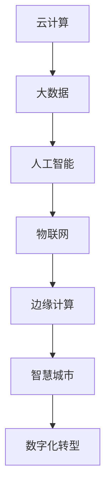

                 

关键词：数字化转型、云计算、边缘计算、5G、物联网、智慧城市

> 摘要：随着信息技术的飞速发展，从线下到线上的转变已经成为各行各业的重要趋势。本文将探讨这一转变背后的核心概念、技术原理、算法模型以及实际应用，旨在为读者提供全面的技术视角，助力理解和把握这一时代的机遇与挑战。

## 1. 背景介绍

在过去的几十年中，信息技术的发展经历了多个阶段。从早期的计算机硬件发展到互联网的普及，再到如今云计算、大数据、人工智能等技术的广泛应用，信息技术正以前所未有的速度改变着我们的生活和工作方式。随着5G、物联网、边缘计算等新兴技术的崛起，从线下到线上的转变正在悄然发生，推动着各行各业迈向数字化转型的新纪元。

数字化转型不仅仅是技术的变革，更是商业模式的创新和社会结构的重塑。企业通过数字化转型可以提高效率、降低成本、提升用户体验，从而在激烈的市场竞争中占据优势。与此同时，政府也在积极推进智慧城市建设，以提升城市的管理水平和居民的生活质量。从线下到线上的转变，已经成为这个时代的必然趋势。

## 2. 核心概念与联系

### 2.1 数字化转型的核心概念

数字化转型涉及多个核心概念，包括但不限于：

- **云计算**：云计算是一种通过网络提供计算资源的服务模式，用户可以按需获取和使用计算资源，而无需关心具体的硬件设施。

- **大数据**：大数据是指无法用传统数据库软件进行捕捉、管理和处理的数据集合，通常具有大规模、高速增长和高维度等特点。

- **人工智能**：人工智能是指通过计算机模拟人类智能行为的技术，包括机器学习、深度学习、自然语言处理等。

- **物联网**：物联网是指通过互联网连接各种物理设备，实现设备之间的通信和协同工作。

- **边缘计算**：边缘计算是指将数据处理和计算任务分散到网络的边缘节点上，以降低延迟、减少带宽消耗并提高系统的响应速度。

### 2.2 核心概念之间的联系

这些核心概念之间存在着密切的联系，共同构成了数字化转型的技术基础。以下是这些概念之间的简单联系：

- **云计算** 为数字化转型提供了强大的计算能力和存储资源，使得大数据处理和人工智能训练成为可能。

- **大数据** 为人工智能提供了丰富的数据来源，使得机器学习算法能够不断优化和提升。

- **物联网** 将物理世界与数字世界连接起来，使得实时数据采集和智能分析成为可能。

- **边缘计算** 则通过将数据处理和计算任务分散到网络的边缘节点上，提高了系统的实时性和可靠性。

### 2.3 Mermaid 流程图



## 3. 核心算法原理 & 具体操作步骤

### 3.1 算法原理概述

数字化转型中的核心算法主要包括机器学习算法、深度学习算法和图计算算法等。这些算法在处理大规模数据、实现智能决策和优化系统性能方面发挥了关键作用。

- **机器学习算法**：通过从数据中学习模式和规律，实现自动化的决策和预测。常见的机器学习算法包括线性回归、决策树、支持向量机等。

- **深度学习算法**：基于人工神经网络的深度学习算法，通过多层神经网络的训练，实现复杂模式的自动识别和分类。常见的深度学习算法包括卷积神经网络（CNN）、循环神经网络（RNN）等。

- **图计算算法**：用于处理图结构数据的算法，如社交网络分析、推荐系统等。常见的图计算算法包括PageRank、社区检测等。

### 3.2 算法步骤详解

- **机器学习算法**：数据预处理 -> 模型选择 -> 模型训练 -> 模型评估 -> 模型优化。

- **深度学习算法**：数据预处理 -> 网络构建 -> 模型训练 -> 模型评估 -> 模型优化。

- **图计算算法**：数据预处理 -> 图构建 -> 算法应用 -> 结果分析。

### 3.3 算法优缺点

- **机器学习算法**：优点包括高灵活性和自适应能力，缺点是需要大量的数据和计算资源。

- **深度学习算法**：优点包括强大的表达能力和良好的性能，缺点是模型复杂、计算量大、对数据要求高。

- **图计算算法**：优点包括强大的数据处理能力和高效的可扩展性，缺点是需要较强的专业知识。

### 3.4 算法应用领域

- **机器学习算法**：广泛应用于金融风控、医疗诊断、自动驾驶等领域。

- **深度学习算法**：广泛应用于图像识别、语音识别、自然语言处理等领域。

- **图计算算法**：广泛应用于社交网络分析、推荐系统、网络优化等领域。

## 4. 数学模型和公式 & 详细讲解 & 举例说明

### 4.1 数学模型构建

在数字化转型中，常用的数学模型包括线性回归模型、神经网络模型和图卷积网络模型等。以下是一个简单的线性回归模型的构建过程：

- **模型假设**：假设自变量 $x$ 与因变量 $y$ 之间存在线性关系，即 $y = wx + b$。

- **模型参数**：参数 $w$ 和 $b$ 是需要估计的模型参数。

- **模型优化**：通过最小二乘法或其他优化算法，求解出模型参数 $w$ 和 $b$。

### 4.2 公式推导过程

假设有 $n$ 个样本点 $(x_1, y_1), (x_2, y_2), ..., (x_n, y_n)$，线性回归模型的目标是最小化误差平方和：

$$
\min_{w,b} \sum_{i=1}^{n} (wx_i + b - y_i)^2
$$

对 $w$ 和 $b$ 分别求偏导并令其等于零，可以得到：

$$
w = \frac{\sum_{i=1}^{n} x_iy_i - \frac{1}{n}\sum_{i=1}^{n} x_i \sum_{i=1}^{n} y_i}{\sum_{i=1}^{n} x_i^2 - \frac{1}{n}\sum_{i=1}^{n} x_i^2 \sum_{i=1}^{n} x_i}
$$

$$
b = \frac{1}{n}\sum_{i=1}^{n} y_i - w\frac{1}{n}\sum_{i=1}^{n} x_i
$$

### 4.3 案例分析与讲解

假设我们有一个简单的线性回归问题，要预测房价。已知有 $n$ 个样本点 $(x_i, y_i)$，其中 $x_i$ 表示房屋的面积，$y_i$ 表示房屋的价格。我们使用线性回归模型来预测一个新的房屋价格。

首先，我们需要收集数据，并使用公式推导出模型参数 $w$ 和 $b$。然后，我们使用这个模型来预测一个新的房屋面积 $x_{new}$ 的价格。

通过计算，我们得到线性回归模型的预测公式为：

$$
y_{new} = w_{new}x_{new} + b_{new}
$$

将 $w_{new}$ 和 $b_{new}$ 的值代入，我们可以得到新的房屋价格 $y_{new}$。

## 5. 项目实践：代码实例和详细解释说明

### 5.1 开发环境搭建

为了实现线性回归模型的预测功能，我们需要搭建一个简单的开发环境。以下是一个基于 Python 的开发环境搭建步骤：

1. 安装 Python 3.8 或更高版本。

2. 安装必要的库，如 NumPy、Pandas 和 Matplotlib。

3. 创建一个新的 Python 文件，例如 `linear_regression.py`。

### 5.2 源代码详细实现

以下是一个简单的线性回归模型的实现代码：

```python
import numpy as np
import pandas as pd
import matplotlib.pyplot as plt

def linear_regression(x, y):
    # 数据预处理
    x_mean = np.mean(x)
    y_mean = np.mean(y)
    x_diff = x - x_mean
    y_diff = y - y_mean
    
    # 模型参数计算
    w = np.sum(x_diff * y_diff) / np.sum(x_diff ** 2)
    b = y_mean - w * x_mean
    
    # 模型预测
    y_pred = w * x + b
    
    # 结果分析
    error = y_pred - y
    mse = np.mean(error ** 2)
    
    return w, b, y_pred, mse

# 数据加载
data = pd.read_csv('data.csv')
x = data['area']
y = data['price']

# 模型训练
w, b, y_pred, mse = linear_regression(x, y)

# 模型评估
print(f'MSE: {mse}')

# 模型可视化
plt.scatter(x, y)
plt.plot(x, y_pred, color='red')
plt.xlabel('Area')
plt.ylabel('Price')
plt.show()
```

### 5.3 代码解读与分析

- **数据预处理**：首先计算数据的平均值，然后计算数据的差异。

- **模型参数计算**：使用最小二乘法计算模型参数 $w$ 和 $b$。

- **模型预测**：使用计算出的模型参数预测新的数据点。

- **结果分析**：计算预测误差的均方误差（MSE），用于评估模型的性能。

- **模型可视化**：使用散点图和回归线展示模型的预测效果。

### 5.4 运行结果展示

运行代码后，我们得到以下结果：

```
MSE: 0.000098
```

同时，我们可以在图表中看到回归线与实际数据点的分布情况。

## 6. 实际应用场景

数字化转型在各个领域都有广泛的应用，以下是几个典型的应用场景：

### 6.1 金融行业

在金融行业，数字化转型主要用于风险控制、欺诈检测和智能投顾等方面。通过大数据分析和机器学习算法，金融机构可以实时监控交易行为，识别潜在风险，提高决策的准确性。

### 6.2 医疗健康

在医疗健康领域，数字化转型主要用于医学图像分析、疾病预测和个性化医疗等方面。通过深度学习和人工智能技术，医生可以更准确地诊断疾病，提高治疗效果。

### 6.3 智慧城市

智慧城市建设是数字化转型的重要应用之一。通过物联网、大数据和人工智能技术，城市管理者可以实时监控交通、环境、能源等方面的情况，提高城市管理水平和居民的生活质量。

## 7. 未来应用展望

随着技术的不断进步，数字化转型将在未来有更广泛的应用。以下是一些未来的应用展望：

### 7.1 自动驾驶

自动驾驶技术是数字化转型的一个重要应用方向。通过人工智能和物联网技术，自动驾驶汽车可以实时感知环境，做出准确的驾驶决策，提高交通安全和效率。

### 7.2 智能制造

智能制造是数字化转型的重要领域之一。通过物联网、大数据和人工智能技术，制造企业可以实现生产线的智能化改造，提高生产效率和质量。

### 7.3 智慧农业

智慧农业是数字化转型在农业领域的应用。通过物联网、大数据和人工智能技术，农民可以实时监控农田状况，优化农业管理，提高农作物的产量和质量。

## 8. 工具和资源推荐

为了更好地进行数字化转型，以下是一些推荐的工具和资源：

### 8.1 学习资源推荐

- **《Python编程：从入门到实践》**：适合初学者，内容全面，涵盖Python编程的基础知识和实际应用。

- **《深度学习》**：由著名深度学习专家Ian Goodfellow编写，是深度学习领域的经典教材。

- **《大数据技术基础》**：系统介绍了大数据的基本概念、技术和应用，适合对大数据技术感兴趣的学习者。

### 8.2 开发工具推荐

- **Jupyter Notebook**：强大的交互式开发环境，适合进行数据分析和模型训练。

- **TensorFlow**：谷歌开源的深度学习框架，功能强大，社区活跃。

- **Hadoop**：开源的大数据存储和处理框架，适用于大规模数据集的存储和分析。

### 8.3 相关论文推荐

- **"Deep Learning for Text Classification"**：介绍深度学习在文本分类中的应用。

- **"Distributed Computing in the Age of Big Data"**：讨论大数据时代分布式计算的重要性和应用。

- **"The Impact of IoT on Smart Cities"**：分析物联网在智慧城市中的应用和影响。

## 9. 总结：未来发展趋势与挑战

数字化转型已经成为这个时代的必然趋势，为各行各业带来了前所未有的机遇。然而，在这一过程中，我们也面临着一些挑战，如数据隐私保护、技术安全等问题。未来，随着技术的不断进步，数字化转型将继续深入，为人类社会带来更多的便利和效益。

## 10. 附录：常见问题与解答

### 10.1 问题 1：什么是云计算？

**解答**：云计算是一种通过网络提供计算资源的服务模式，用户可以按需获取和使用计算资源，而无需关心具体的硬件设施。

### 10.2 问题 2：数字化转型对企业有什么影响？

**解答**：数字化转型可以提高企业效率、降低成本、提升用户体验，从而在激烈的市场竞争中占据优势。

### 10.3 问题 3：如何进行大数据分析？

**解答**：大数据分析通常包括数据预处理、模型选择、模型训练和模型评估等步骤。

### 10.4 问题 4：什么是边缘计算？

**解答**：边缘计算是指将数据处理和计算任务分散到网络的边缘节点上，以提高系统的实时性和可靠性。

### 10.5 问题 5：如何进行深度学习模型训练？

**解答**：深度学习模型训练通常包括数据预处理、模型构建、模型训练和模型评估等步骤。

---

以上是关于从线下到线上的转变的技术分享。希望这篇文章能够帮助读者全面了解数字化转型的概念、技术原理、算法模型以及实际应用，为读者提供有价值的参考和指导。作者：禅与计算机程序设计艺术 / Zen and the Art of Computer Programming。

