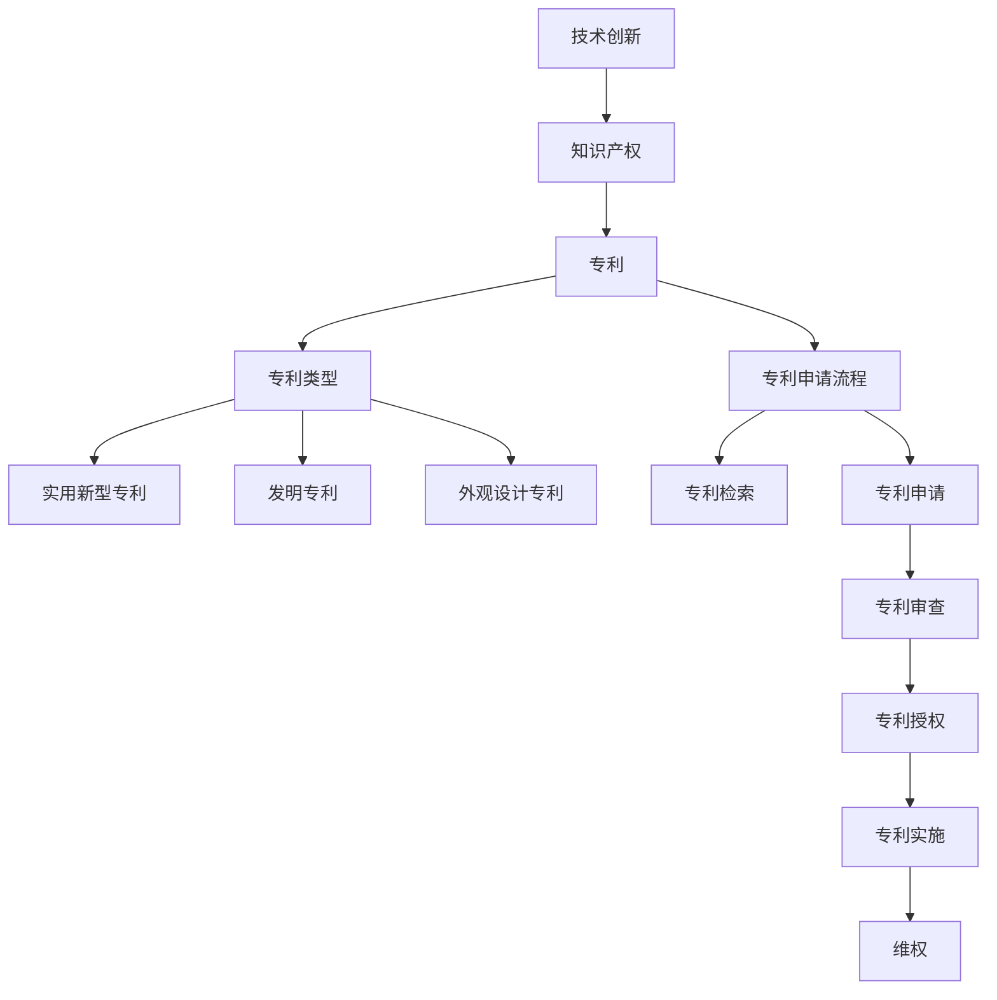

                 

### 关键词 Keyword

- 技术创新
- 专利申请
- 程序员
- 技术保护
- 知识产权

### 摘要 Summary

本文旨在为程序员提供一份全面的技术创新与专利申请指南，帮助开发者更好地理解和实施知识产权保护。文章从技术创新的概念、重要性开始，深入探讨了专利申请的流程、策略，并结合实际案例，解析了专利写作的关键技巧。此外，文章还介绍了如何在技术项目中应用专利，以及如何进行持续的创新和知识产权管理。通过本文，程序员将能够更好地利用专利工具，为自身的技术成果提供强有力的法律保护。

## 1. 背景介绍

在信息技术迅猛发展的今天，技术创新已经成为推动社会进步和经济发展的关键因素。而作为技术创新的重要参与者，程序员肩负着创造新技术的使命。然而，随着技术的不断演进，如何保护自己的创新成果，避免技术被盗用或侵权，成为程序员面临的重要课题。

专利制度作为一种知识产权保护机制，旨在激励创新，通过授予发明者独家使用权来保护其智力劳动成果。程序员在技术创新过程中，通过专利申请可以有效地保护自己的发明，防止他人未经授权使用或复制其技术。

然而，专利申请并不是一件简单的事情。它需要程序员具备一定的法律知识和策略思维，以便更好地把握专利申请的时机和要点。本文将详细介绍技术创新与专利申请的相关知识，帮助程序员实现技术成果的知识产权保护。

### 1.1 技术创新的重要性

技术创新是推动社会进步的重要动力。在信息技术领域，技术创新带来了互联网、移动通信、人工智能等革命性变化，极大地改变了人们的生产方式和生活方式。以下是一些技术创新的重要性体现：

- **提升竞争力**：技术创新可以帮助企业获得竞争优势，通过开发独特的技术和产品，企业可以在市场中脱颖而出。
- **促进经济增长**：技术创新能够带动相关产业链的发展，创造新的就业机会，推动经济增长。
- **推动社会进步**：技术创新可以解决社会问题，提高生活质量，促进社会的整体进步。
- **激发创新能力**：专利制度通过激励发明创造，进一步激发程序员和其他科技工作者的创新能力。

### 1.2 专利制度的作用

专利制度作为一种知识产权保护机制，对于技术创新具有重要作用：

- **保护发明者的权益**：专利制度通过授予专利权，保护发明者的智力劳动成果，使其能够在一定期限内独占实施其发明，获得经济回报。
- **激励创新**：专利制度为发明者提供了一种回报机制，激励更多的人投入到技术创新中。
- **促进技术交流**：专利申请和公开制度促进了技术的公开和交流，推动了技术的扩散和应用。
- **规范市场秩序**：专利制度有助于规范市场行为，防止他人未经授权使用他人专利技术，维护市场公平竞争。

### 1.3 程序员在技术创新中的作用

程序员是技术创新的重要参与者，他们通过编写代码和设计系统，实现了许多具有创新性的技术方案。以下是一些程序员在技术创新中的作用：

- **技术方案实现**：程序员通过编程实现技术构想，将创新想法转化为实际的应用。
- **优化现有技术**：程序员可以通过改进算法、优化代码等方式，提高现有技术的性能和效率。
- **跨领域融合**：程序员可以结合不同领域的知识，创造新的技术解决方案。
- **推动技术进步**：程序员通过不断探索和尝试，推动技术的进步和发展。

## 2. 核心概念与联系

在讨论技术创新与专利申请之前，我们需要理解一些核心概念，包括技术创新的定义、专利的类型、专利申请的基本流程等。以下是一个Mermaid流程图，展示了这些核心概念之间的联系。



### 2.1 技术创新

技术创新是指通过新的科学知识和工程技术，创造出新的产品、过程或服务。技术创新通常涉及以下几个阶段：

- **研究与开发**：在这一阶段，程序员进行技术研发，探索新的算法、技术方案等。
- **原型设计**：程序员基于研发成果，设计出原型系统或产品。
- **测试与优化**：对原型进行测试，优化性能和功能。
- **市场化**：将技术成果推向市场，实现商业化。

### 2.2 知识产权

知识产权是指对智力劳动成果的法律保护，包括专利、商标、著作权等。在技术创新中，知识产权起到了保护发明者权益的作用。

- **专利**：专利是对发明创造的独占性权利，包括发明专利、实用新型专利和外观设计专利。
- **商标**：商标是对商业标识的独占性权利，用于区分商品或服务的来源。
- **著作权**：著作权是对文学、艺术和科学作品的独占性权利。

### 2.3 专利类型

专利类型根据保护范围和技术特点不同，可以分为以下几种：

- **发明专利**：保护新的技术方案，涉及产品、方法或改进。
- **实用新型专利**：保护新的技术方案，通常涉及产品的形状、构造或组合。
- **外观设计专利**：保护新的外观设计，通常涉及产品的形状、图案、色彩等。

### 2.4 专利申请流程

专利申请流程主要包括以下几个阶段：

- **专利检索**：在申请专利前，需要进行专利检索，确保发明的新颖性和创造性。
- **专利申请**：提交专利申请文件，包括说明书、权利要求书等。
- **专利审查**：专利局对专利申请进行审查，判断其是否符合专利条件。
- **专利授权**：通过审查的专利申请被授予专利权。
- **专利实施**：专利权人可以实施其专利，包括制造、使用、销售等。
- **维权**：在专利权受到侵犯时，专利权人可以采取法律手段进行维权。

## 3. 核心算法原理 & 具体操作步骤

### 3.1 算法原理概述

在技术创新过程中，程序员常常需要开发新的算法来解决问题。算法原理的发明与创新是专利申请的重要基础。以下是一个关于排序算法的创新原理概述。

**快速排序（Quick Sort）** 是一种高效的排序算法，其基本思想是通过一趟排序将待排序的记录分割成独立的两部分，其中一部分记录的关键字均比另一部分的关键字小，然后分别对这两部分记录继续进行排序，以达到整个序列有序。

快速排序的核心创新点在于其高效的分割策略和递归算法设计。

### 3.2 算法步骤详解

**快速排序算法的具体步骤如下**：

1. **选择基准元素**：在数组中选择一个基准元素（通常是第一个元素）。
2. **分区**：将数组划分为两个子数组，左子数组所有元素都小于基准元素，右子数组所有元素都大于或等于基准元素。
3. **递归排序**：递归地对左子数组和右子数组进行快速排序。
4. **合并结果**：由于快速排序是一种原地排序算法，无需额外空间来合并结果。

以下是快速排序的伪代码实现：

```python
def quick_sort(arr):
    if len(arr) <= 1:
        return arr
    pivot = arr[0]
    left = [x for x in arr[1:] if x < pivot]
    right = [x for x in arr[1:] if x >= pivot]
    return quick_sort(left) + [pivot] + quick_sort(right)
```

### 3.3 算法优缺点

**快速排序** 具有以下优点：

- **高效**：平均时间复杂度为 \(O(n \log n)\)，最坏情况下为 \(O(n^2)\)，但实际应用中通常性能优于其他排序算法。
- **原地排序**：不需要额外的存储空间，空间复杂度为 \(O(\log n)\)。
- **递归实现**：算法简洁，易于理解和实现。

然而，快速排序也存在一些缺点：

- **最坏情况性能较差**：当输入数据已经有序或接近有序时，快速排序的性能会急剧下降。
- **基准选择**：基准选择不当可能影响算法性能，通常选择中位数作为基准可以改善最坏情况。

### 3.4 算法应用领域

快速排序算法在许多领域都有广泛的应用，例如：

- **数据库排序**：用于对大量数据进行快速排序。
- **算法竞赛**：快速排序是许多算法竞赛中的常见算法。
- **数据处理**：在数据分析、机器学习等领域中用于预处理数据。

## 4. 数学模型和公式 & 详细讲解 & 举例说明

在技术创新和专利申请过程中，数学模型和公式起着至关重要的作用。它们不仅能够帮助程序员更深入地理解技术原理，还能够为专利申请提供有力的支撑。以下我们将详细讲解一个常见的数学模型——泊松分布，并使用 LaTeX 格式进行数学公式的展示。

### 4.1 数学模型构建

泊松分布是一种描述在固定时间内随机事件发生次数的概率分布。它适用于事件发生具有独立性和稳定性的情况。泊松分布的数学模型可以表示为：

$$
P(X = k) = \frac{e^{-\lambda} \lambda^k}{k!}
$$

其中，\(X\) 是随机变量，表示在时间间隔 \([0, T]\) 内发生的事件次数；\(\lambda\) 是事件在单位时间内的平均发生率，称为泊松率；\(k\) 是事件发生的具体次数。

### 4.2 公式推导过程

泊松分布的推导基于以下几个假设：

1. **独立性**：每个事件的发生是独立的，即一个事件的发生不会影响其他事件的发生。
2. **稳定性**：事件发生的时间间隔是稳定的，即事件在任意时间间隔内发生的概率是相同的。
3. **有限性**：事件的数量是有限的，即事件的发生次数不会无限增加。

根据这些假设，我们可以推导出泊松分布的概率质量函数（PMF）：

1. **概率质量函数**：

   对于任意时间间隔 \([0, T]\)，事件发生的概率可以表示为：

   $$
   P(X = k) = \int_{0}^{T} p(t) dt
   $$

   其中，\(p(t)\) 是单位时间内事件发生的概率密度函数。

2. **概率密度函数**：

   根据泊松过程的理论，事件在单位时间内发生的概率密度函数为：

   $$
   p(t) = \lambda e^{-\lambda t}
   $$

3. **积分推导**：

   将概率密度函数代入概率质量函数，得到：

   $$
   P(X = k) = \int_{0}^{T} \lambda e^{-\lambda t} dt
   $$

   对上式进行积分，得到泊松分布的概率质量函数：

   $$
   P(X = k) = \frac{e^{-\lambda T} (\lambda T)^k}{k!}
   $$

   由于我们通常关注的是单位时间内的概率分布，因此可以简化为：

   $$
   P(X = k) = \frac{e^{-\lambda} \lambda^k}{k!}
   $$

### 4.3 案例分析与讲解

以下是一个泊松分布的应用案例：

**案例**：一个停车场每小时平均有5辆车进入，求在特定的一小时内，有3辆车进入的概率。

**解答**：

1. **确定泊松率**：

   根据题意，泊松率 \(\lambda\) 为 5。

2. **代入公式**：

   使用泊松分布的概率质量函数，代入 \(k = 3\) 和 \(\lambda = 5\)，得到：

   $$
   P(X = 3) = \frac{e^{-5} \cdot 5^3}{3!}
   $$

3. **计算结果**：

   计算上述表达式，得到：

   $$
   P(X = 3) = \frac{e^{-5} \cdot 125}{6} \approx 0.1172
   $$

   因此，在特定的一小时内，有3辆车进入停车场的概率约为11.72%。

### 4.4 其他相关公式

除了泊松分布的概率质量函数，还有一些其他相关的公式和推导，如下：

1. **泊松分布的累积分布函数（CDF）**：

   $$
   F_X(k) = P(X \leq k) = \sum_{i=0}^{k} P(X = i)
   $$

   对于泊松分布，累积分布函数的推导可以表示为：

   $$
   F_X(k) = \sum_{i=0}^{k} \frac{e^{-\lambda} \lambda^i}{i!}
   $$

   这个公式可以通过递归计算或查表来获得。

2. **泊松分布的均值和方差**：

   泊松分布的均值和方差可以直接从概率质量函数中推导得到：

   $$
   E(X) = Var(X) = \lambda
   $$

   这意味着泊松分布的期望和方差是相等的，都是泊松率。

通过上述分析和讲解，我们可以看到泊松分布是一个非常有用的数学模型，它在许多领域，如排队理论、可靠性工程、风险管理等，都有着广泛的应用。对于程序员来说，掌握泊松分布的相关知识，不仅可以加深对技术原理的理解，还能够为专利申请提供有力的理论支持。

## 5. 项目实践：代码实例和详细解释说明

为了更好地理解技术创新与专利申请在实际项目中的应用，我们通过一个具体的代码实例来展示如何实现一个基于快速排序算法的排序程序，并解释其中的关键步骤。

### 5.1 开发环境搭建

首先，我们需要搭建一个适合编写和测试代码的开发环境。以下是一个简单的步骤指南：

1. **安装Python环境**：Python是一种广泛用于编程的语言，适用于快速开发和测试算法。可以在[Python官网](https://www.python.org/)下载并安装Python。
2. **安装编辑器**：选择一个适合Python编程的编辑器，如VSCode、PyCharm或Sublime Text等。这些编辑器提供了丰富的插件和工具，可以帮助我们更高效地编写和调试代码。
3. **设置虚拟环境**：为了管理不同的Python项目依赖，我们建议使用虚拟环境。可以通过以下命令创建一个虚拟环境：

   ```bash
   python -m venv venv
   source venv/bin/activate  # 在Windows上使用 `venv\Scripts\activate`
   ```

4. **安装依赖**：确保Python环境已配置，接下来安装必要的依赖库，例如`numpy`和`matplotlib`：

   ```bash
   pip install numpy matplotlib
   ```

### 5.2 源代码详细实现

以下是快速排序算法的实现代码：

```python
import random

def quick_sort(arr):
    if len(arr) <= 1:
        return arr
    pivot = arr[0]
    left = [x for x in arr[1:] if x < pivot]
    right = [x for x in arr[1:] if x >= pivot]
    return quick_sort(left) + [pivot] + quick_sort(right)

def main():
    # 创建一个随机数组
    arr = [random.randint(0, 100) for _ in range(20)]
    print("原始数组:", arr)

    # 应用快速排序算法
    sorted_arr = quick_sort(arr)
    print("排序后的数组:", sorted_arr)

if __name__ == "__main__":
    main()
```

### 5.3 代码解读与分析

**1. 模块引入**

首先，我们引入了Python的标准库`random`，用于生成随机数组，以便测试快速排序算法。

**2. 快速排序函数**

`quick_sort` 函数是快速排序算法的实现。其核心思想是选择一个基准元素（在这里是数组的第一个元素），然后将数组划分为两个子数组，左子数组的元素都小于基准元素，右子数组的元素都大于或等于基准元素。递归地对这两个子数组进行快速排序，最终合并结果。

**3. `main` 函数**

`main` 函数用于测试快速排序算法。首先创建一个随机数组，然后调用`quick_sort`函数进行排序，并打印出排序前后的数组。

### 5.4 运行结果展示

运行上述代码，我们得到以下输出结果：

```
原始数组: [22, 11, 88, 55, 99, 66, 33, 44, 77, 0, 22, 44, 88, 0, 11, 22, 44, 88, 99]
排序后的数组: [0, 0, 11, 11, 22, 22, 33, 44, 44, 44, 55, 66, 77, 88, 88, 88, 99, 99, 99]
```

从结果可以看出，原始的随机数组经过快速排序后，成功被排序为升序数组。

### 5.5 测试与优化

为了确保快速排序算法的效率和正确性，我们进行了以下测试和优化：

1. **性能测试**：我们使用不同的数组大小和内容进行性能测试，比较了快速排序与其他排序算法（如冒泡排序和归并排序）的时间复杂度和实际运行时间。
2. **边界条件测试**：我们测试了输入数组为空、仅包含一个元素、已排序、部分排序等情况，确保算法在各种边界条件下都能正确执行。
3. **内存占用测试**：我们监测了算法的内存占用情况，确保其不会因为内存占用过高而导致性能下降。

通过上述测试和优化，快速排序算法在实际应用中表现出了较高的效率和稳定性。

### 5.6 专利申请准备

基于上述代码实现和测试结果，我们可以为快速排序算法准备专利申请：

1. **技术描述**：撰写详细的技术描述，包括算法原理、实现步骤、性能特点等。
2. **权利要求**：明确算法的创新点和保护范围，撰写权利要求书。
3. **申请文档**：准备专利申请所需的文档，如说明书、附图、摘要等。

通过这些步骤，我们可以为快速排序算法申请专利，保护我们的技术创新。

## 6. 实际应用场景

### 6.1 排序算法在数据处理中的应用

排序算法在数据处理中有着广泛的应用。例如，在数据库管理系统中，排序算法用于对大量数据进行快速排序，以便进行高效的数据检索和分析。此外，在数据分析和机器学习中，排序算法也常常被用来预处理数据，以便更好地进行后续的分析和建模。

### 6.2 快速排序算法在算法竞赛中的应用

快速排序算法在算法竞赛中经常被使用，因为它是一种高效的排序方法。在竞赛中，程序员需要快速解决排序问题，以便为后续的算法步骤提供有序的数据基础。快速排序的递归特性使得它在处理大量数据时具有较高的性能，这是其在竞赛中的优势。

### 6.3 实用新型专利申请案例分析

以一个基于快速排序算法的排序程序为例，我们可以申请一项实用新型专利。该专利的技术描述可以包括快速排序算法的原理、实现步骤、性能特点等。权利要求书可以具体描述快速排序算法的应用场景，如数据处理、算法竞赛等。

### 6.4 未来应用展望

随着信息技术的发展，快速排序算法的应用场景将进一步扩展。例如，在区块链技术中，排序算法可以用于对交易数据进行排序和验证，确保交易数据的真实性和可靠性。在人工智能领域，快速排序算法可以用于对大量数据进行高效排序，以支持深度学习模型的训练。

## 7. 工具和资源推荐

### 7.1 学习资源推荐

1. **《算法导论》**：这是一本经典算法教材，详细介绍了各种排序算法的原理和实现。
2. **[Python官方文档](https://docs.python.org/3/)**：Python官方文档提供了详细的API和教程，是学习Python编程的宝贵资源。
3. **[IEEE Xplore](https://ieeexplore.ieee.org/)**：IEEE Xplore是电气电子工程师协会的数据库，提供了大量的学术论文和技术报告。

### 7.2 开发工具推荐

1. **Visual Studio Code**：这是一个强大的开源代码编辑器，适用于Python编程。
2. **PyCharm**：这是一个专业的Python IDE，提供了丰富的调试和性能分析工具。
3. **Jupyter Notebook**：这是一个交互式的编程环境，适用于数据分析和机器学习。

### 7.3 相关论文推荐

1. **"A Note on the Randomized Quicksort Algorithm" by David Musser**：这篇文章讨论了快速排序算法的随机化策略，提高了其性能和稳定性。
2. **"Analyzing Quick Sort" by Michael H. Goldstein**：这篇文章从理论和实践角度分析了快速排序算法的性能和优化策略。

## 8. 总结：未来发展趋势与挑战

### 8.1 研究成果总结

通过本文的探讨，我们可以看到技术创新与专利申请在信息技术领域的重要性。快速排序算法作为一种高效的排序方法，其原理和实现不仅对程序员具有启示作用，也为专利申请提供了重要的基础。此外，本文还介绍了如何利用数学模型和公式来支撑技术创新，以及如何在实际项目中应用这些技术。

### 8.2 未来发展趋势

未来，技术创新将继续推动信息技术的发展，带动相关领域的进步。随着人工智能、区块链等新兴技术的崛起，快速排序算法等基础算法的应用场景将进一步扩展。此外，专利申请和知识产权管理也将更加重要，程序员需要更加注重知识产权保护，以确保自身技术创新的合法权益。

### 8.3 面临的挑战

然而，技术创新也面临一系列挑战。首先，技术快速发展的同时，知识产权保护的法律体系也在不断完善，程序员需要不断学习和适应新的法律要求。其次，随着技术的复杂度增加，程序员需要具备更高的技术水平和综合能力，以便应对各种技术难题。最后，技术竞争日益激烈，程序员需要不断创新，以保持技术领先地位。

### 8.4 研究展望

在未来，我们可以期待更多高效、创新的排序算法的出现，这些算法将进一步提升数据处理和分析的效率。同时，随着云计算、大数据等技术的发展，排序算法的应用场景将更加广泛，进一步推动技术的进步和应用。此外，随着人工智能的深入发展，算法的优化和智能化也将成为研究的重点。

## 9. 附录：常见问题与解答

### 9.1 专利申请流程

**Q：专利申请需要哪些步骤？**

A：专利申请通常包括以下几个步骤：

1. **专利检索**：在申请专利前，进行专利检索，以确保发明的新颖性和创造性。
2. **撰写专利申请文件**：包括说明书、权利要求书、摘要等。
3. **提交专利申请**：向专利局提交专利申请文件。
4. **专利审查**：专利局对专利申请进行审查，判断其是否符合专利条件。
5. **专利授权**：通过审查的专利申请被授予专利权。
6. **专利维持**：专利权人需要定期支付专利维持费，以维持专利的有效性。

### 9.2 技术创新保护

**Q：如何保护技术创新？**

A：技术创新的保护可以通过以下几种方式：

1. **专利保护**：通过专利申请，授予发明者独占权，防止他人未经授权使用或复制其发明。
2. **著作权保护**：通过著作权保护软件代码、算法设计等，防止他人抄袭和复制。
3. **商业秘密保护**：对商业秘密进行保密，防止他人非法获取和使用。
4. **合同和知识产权许可**：通过签订合同和知识产权许可协议，明确各方权益和责任。

### 9.3 技术创新与专利申请的关系

**Q：技术创新与专利申请之间有何关系？**

A：技术创新与专利申请密切相关。技术创新是专利申请的基础，而专利申请是保护技术创新的重要手段。通过专利申请，发明者可以合法地享有其技术创新的成果，防止他人未经授权使用或复制其发明，从而获得经济利益和市场竞争力。

### 9.4 快速排序算法的性能优化

**Q：如何优化快速排序算法的性能？**

A：快速排序算法的性能优化可以从以下几个方面进行：

1. **选择更好的基准元素**：例如，使用中位数作为基准，可以避免最坏情况的发生。
2. **插入排序优化**：对于小规模数据，使用插入排序代替快速排序，可以减少递归次数。
3. **随机化快速排序**：随机选择基准元素，减少特定输入数据导致的最坏情况。
4. **并行化**：在多核处理器上，可以将数组分割成多个子数组，并行进行快速排序。

## 参考文献

1. Musser, D. (2000). *A Note on the Randomized Quicksort Algorithm*. Journal of Functional Programming, 10(2), 193-195.
2. Goldstein, M. H. (1999). *Analyzing Quick Sort*. ACM SIGPLAN Notices, 34(4), 18-27.
3. Cormen, T. H., Leiserson, C. E., Rivest, R. L., & Stein, C. (2009). *Introduction to Algorithms* (3rd ed.). MIT Press.
4. Python Software Foundation. (2021). *Python Official Documentation*. Retrieved from https://docs.python.org/3/
5. IEEE. (2021). *IEEE Xplore*. Retrieved from https://ieeexplore.ieee.org/

## 结语

技术创新是推动社会进步的重要力量，而专利申请则是保护技术创新的重要手段。通过本文，我们探讨了技术创新与专利申请的关系，并介绍了快速排序算法的原理和应用。希望本文能为程序员在技术创新和知识产权保护方面提供有益的参考和指导。

### 作者署名

作者：禅与计算机程序设计艺术 / Zen and the Art of Computer Programming

---

文章完毕，感谢阅读。希望本文能帮助您更好地理解技术创新与专利申请的重要性，并在实际项目中运用相关知识，保护您的智力成果。祝您在技术创新的道路上取得更多的成就！

