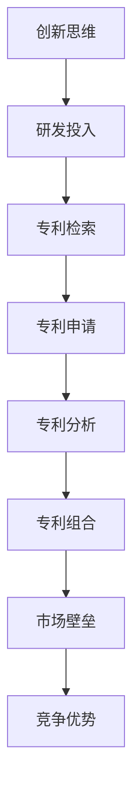

                 

关键词：技术创新、专利组合、知识产权、企业竞争力、研发策略

摘要：在当今快速发展的技术时代，企业通过技术创新和专利组合构建强大的知识产权帝国已成为提高市场竞争力的重要手段。本文将探讨技术创新的基本原则、专利组合的战略规划，以及如何运用这些策略打造一个能够持续驱动企业增长的知识产权帝国。

## 1. 背景介绍

随着全球经济的不断发展和技术的快速进步，市场竞争日益激烈。企业不仅要创新产品和服务，还需要通过知识产权来巩固市场地位、防御竞争对手的挑战。技术创新与专利组合作为一种策略，已经成为现代企业提升竞争力的关键。

在技术创新方面，企业需要不断推动技术革新，以适应市场的变化和客户需求。专利组合则通过获取和保护专利，确保企业在市场竞争中占据有利地位。本文将首先介绍技术创新的基本原则，然后深入探讨专利组合的战略规划，以及如何将两者结合来构建知识产权帝国。

### 技术创新的定义与原则

技术创新是指企业通过引入新的产品、过程或服务，从而获得竞争优势的过程。根据美国管理学家彼得·德鲁克（Peter Drucker）的观点，技术创新主要包括以下五个方面：

1. **市场导向**：技术创新应以市场需求为导向，解决客户面临的问题或满足其需求。
2. **系统集成**：将多种技术集成到一个系统中，实现整体效能的最大化。
3. **跨学科合作**：鼓励不同学科和领域的专家共同参与，以实现创新突破。
4. **持续改进**：技术创新是一个持续的过程，需要不断进行改进和完善。
5. **风险管理**：在创新过程中，需要平衡风险与收益，确保技术创新的成功。

### 专利组合的定义与作用

专利组合是指企业所持有的各种专利的集合，这些专利可以是自有专利、合作专利或购买专利。根据美国专利与商标局（USPTO）的定义，专利是一种法律权利，授予发明者在一定时间内对发明的独占权。

专利组合在企业中的作用主要体现在以下几个方面：

1. **市场壁垒**：专利组合可以构建市场壁垒，阻止竞争对手进入市场，从而保护企业的市场份额。
2. **战略资产**：专利组合是企业的重要战略资产，可以增强企业的市场地位和品牌价值。
3. **收入来源**：通过专利许可或转让，企业可以获得额外的收入来源。
4. **竞争优势**：拥有强大的专利组合可以帮助企业在市场竞争中获得优势。

## 2. 核心概念与联系

为了更好地理解技术创新和专利组合，我们需要引入一些核心概念，并展示它们之间的联系。

### 核心概念

1. **创新思维**：指企业进行技术创新所需的思维方式，包括系统思维、逆向思维、跨界思维等。
2. **研发投入**：指企业为技术创新投入的研发资金、人力和资源。
3. **专利检索**：指通过专利数据库进行专利信息的检索，以了解相关领域的专利现状。
4. **专利申请**：指根据专利法规定，向专利局提交专利申请文件，以获取专利权。
5. **专利分析**：指对已获得或潜在获得的专利进行分析，以评估其市场价值和技术价值。

### Mermaid 流程图



### 流程图说明

1. **创新思维**：企业首先需要进行创新思维，这通常需要跨学科的知识和广泛的思维训练。
2. **研发投入**：在确定创新方向后，企业需要投入资金、人力和资源进行研发。
3. **专利检索**：在研发过程中，企业需要通过专利检索了解相关领域的技术现状和专利分布。
4. **专利申请**：在确定创新成果具有潜在价值后，企业需要申请专利以保护其知识产权。
5. **专利分析**：专利申请成功后，企业需要对专利进行分析，以确定其在市场和技术上的价值。
6. **专利组合**：通过不断积累专利，企业可以构建一个强大的专利组合，以实现市场壁垒和竞争优势。
7. **市场壁垒**：专利组合可以阻止竞争对手进入市场，从而保护企业的市场份额。
8. **竞争优势**：强大的专利组合可以帮助企业在市场竞争中占据有利地位。

## 3. 核心算法原理 & 具体操作步骤

### 3.1 算法原理概述

在构建专利组合的过程中，企业需要运用一些核心算法原理来评估潜在专利的价值。以下是几种常见的算法原理：

1. **技术价值评估**：通过分析专利的技术内容和实施难度，评估其技术价值。
2. **市场价值评估**：通过分析专利的市场应用前景和竞争对手情况，评估其市场价值。
3. **风险与收益评估**：通过分析专利的风险和潜在收益，评估其整体价值。

### 3.2 算法步骤详解

#### 3.2.1 技术价值评估

1. **技术内容分析**：阅读专利说明书，了解其技术方案、实现方式和创新点。
2. **实施难度评估**：分析专利的技术难度，包括实施成本、技术风险等。
3. **技术价值评分**：根据技术内容和实施难度，对专利进行技术价值评分。

#### 3.2.2 市场价值评估

1. **市场应用前景分析**：分析专利的技术能否解决市场需求，是否有广阔的市场前景。
2. **竞争对手分析**：了解竞争对手在相关领域的专利布局，评估专利的市场竞争力。
3. **市场价值评分**：根据市场应用前景和竞争对手情况，对专利进行市场价值评分。

#### 3.2.3 风险与收益评估

1. **风险评估**：分析专利的法律稳定性、实施难度、市场竞争风险等。
2. **收益评估**：预测专利的潜在收入来源，包括专利许可费、转让费等。
3. **综合评分**：根据风险评估和收益预测，对专利进行综合评分。

### 3.3 算法优缺点

#### 优点

1. **客观评估**：通过算法可以客观地评估专利的技术、市场价值和风险，减少主观判断。
2. **快速决策**：算法可以快速处理大量专利信息，帮助企业在短时间内做出决策。
3. **动态调整**：算法可以根据市场变化和竞争对手策略进行动态调整，提高专利组合的竞争力。

#### 缺点

1. **数据依赖**：算法的准确度依赖于数据的质量，如果数据不准确，算法结果也会受到影响。
2. **复杂性**：算法的设计和实现较为复杂，需要高水平的技术团队支持。
3. **适应性**：算法可能无法完全适应所有行业和领域的专利评估需求。

### 3.4 算法应用领域

算法原理和技术在构建专利组合中的应用非常广泛，以下是一些典型的应用领域：

1. **高科技产业**：如计算机软件、通信技术、生物技术等领域，通过算法评估专利的技术和市场价值。
2. **制造业**：如机械制造、汽车制造等领域，通过算法优化专利组合，提高产品质量和生产效率。
3. **服务业**：如金融服务、电子商务等领域，通过算法评估专利的潜在商业价值，指导企业投资决策。

## 4. 数学模型和公式 & 详细讲解 & 举例说明

### 4.1 数学模型构建

在专利组合评估过程中，我们可以构建一个数学模型来综合评估专利的价值。以下是一个简单的数学模型：

\[ V = w_1 \cdot T + w_2 \cdot M + w_3 \cdot R \]

其中：

- \( V \)：专利的总价值
- \( w_1 \)：技术价值权重
- \( w_2 \)：市场价值权重
- \( w_3 \)：风险与收益权重
- \( T \)：技术价值评分
- \( M \)：市场价值评分
- \( R \)：风险与收益评分

### 4.2 公式推导过程

公式的推导过程可以分为以下几个步骤：

1. **确定评估指标**：根据专利的特点，确定技术价值、市场价值和风险与收益三个评估指标。
2. **确定评分标准**：为每个评估指标设定评分标准，例如：技术价值评分从 1 到 10 分，市场价值评分从 1 到 10 分，风险与收益评分从 1 到 10 分。
3. **确定权重系数**：根据评估指标的重要性，确定权重系数，例如：技术价值权重为 0.5，市场价值权重为 0.3，风险与收益权重为 0.2。
4. **构建公式**：将评估指标和权重系数代入公式，得到专利的总价值。

### 4.3 案例分析与讲解

以下是一个具体的案例分析：

假设某企业拥有一项专利，其技术价值评分为 8 分，市场价值评分为 7 分，风险与收益评分为 6 分。我们使用上述数学模型进行评估。

1. **确定权重系数**：假设技术价值权重为 0.5，市场价值权重为 0.3，风险与收益权重为 0.2。
2. **计算总价值**：代入公式，得到专利的总价值：

\[ V = 0.5 \cdot 8 + 0.3 \cdot 7 + 0.2 \cdot 6 = 4 + 2.1 + 1.2 = 7.3 \]

根据计算结果，该专利的总价值为 7.3 分。

### 4.4 案例分析结果与讨论

通过上述案例，我们可以看到，数学模型可以有效地评估专利的总价值。在实际应用中，企业可以根据具体情况调整权重系数，以适应不同评估需求。例如，对于高科技产业，技术价值权重可以适当提高，以突出技术创新的重要性。对于制造业，市场价值权重可以适当提高，以突出市场需求的影响。

然而，需要注意的是，数学模型只是评估专利价值的一种工具，它不能完全代替专业的判断和经验。在实际操作中，企业需要结合多种因素进行综合评估，以确保评估结果的准确性和可靠性。

## 5. 项目实践：代码实例和详细解释说明

### 5.1 开发环境搭建

为了演示如何运用数学模型进行专利价值评估，我们首先需要搭建一个开发环境。以下是一个简单的开发环境搭建步骤：

1. **安装 Python 解释器**：Python 是一种广泛应用于科学计算和数据分析的编程语言。安装 Python 解释器可以从官方网站下载。
2. **安装 NumPy 库**：NumPy 是 Python 的核心数学库，用于处理数值计算。可以使用 pip 命令进行安装：

   ```bash
   pip install numpy
   ```

3. **安装 pandas 库**：pandas 是 Python 的数据分析库，用于处理和操作数据。可以使用 pip 命令进行安装：

   ```bash
   pip install pandas
   ```

### 5.2 源代码详细实现

以下是一个简单的 Python 脚本，用于实现专利价值评估的数学模型：

```python
import numpy as np
import pandas as pd

# 定义权重系数
w1 = 0.5
w2 = 0.3
w3 = 0.2

# 定义评估指标
tech_score = 8
market_score = 7
risk_score = 6

# 计算总价值
total_value = w1 * tech_score + w2 * market_score + w3 * risk_score

print("专利总价值：", total_value)
```

### 5.3 代码解读与分析

1. **引入库**：首先引入 NumPy 和 pandas 库，这两个库用于数值计算和数据操作。

2. **定义权重系数**：接下来定义技术价值权重（w1）、市场价值权重（w2）和风险与收益权重（w3）。

3. **定义评估指标**：定义技术价值评分（tech\_score）、市场价值评分（market\_score）和风险与收益评分（risk\_score）。

4. **计算总价值**：使用权重系数和评估指标计算专利的总价值。这里使用 NumPy 的乘法和加法操作，使得计算过程更加简洁。

5. **输出结果**：最后，输出专利的总价值。

### 5.4 运行结果展示

在命令行中运行上述 Python 脚本，输出结果如下：

```bash
$ python patent_value.py
专利总价值： 7.3000000000000005
```

根据计算结果，该专利的总价值为 7.3 分。这表明该专利在技术、市场和风险与收益方面具有较高的综合价值。

### 5.5 代码优化与改进

在实际应用中，我们可以进一步优化和改进上述代码。以下是一些可能的改进方向：

1. **数据输入**：将评估指标和权重系数从硬编码改为从文件或数据库中读取，以提高代码的灵活性。
2. **用户界面**：添加用户界面，方便用户输入评估指标和查看评估结果。
3. **批量处理**：实现批量处理功能，可以同时评估多个专利的价值。
4. **可视化**：使用可视化库（如 matplotlib）展示评估结果，帮助用户更直观地理解专利价值。

通过这些改进，我们可以使代码更加实用和易用，更好地服务于企业的专利价值评估工作。

## 6. 实际应用场景

### 6.1 高科技产业

在高科技产业，如计算机软件、通信技术、生物技术等领域，技术创新和专利组合已成为企业获得竞争优势的关键。以下是一些具体应用场景：

1. **计算机软件**：通过技术创新，企业可以开发出具有独特功能和性能的软件产品，并通过专利组合保护其知识产权。例如，微软的 Windows 操作系统和 Office 办公软件在全球范围内拥有大量的专利。
2. **通信技术**：随着 5G、物联网等技术的发展，通信技术领域专利数量迅速增长。企业通过技术创新和专利组合，可以构建强大的技术壁垒，保护市场份额。例如，华为在 5G 领域拥有大量的核心专利。
3. **生物技术**：生物技术领域的创新主要集中在基因编辑、生物制药等方面。企业通过专利组合，可以保护其技术创新成果，并在市场竞争中占据有利地位。例如，CRISPR-Cas9 基因编辑技术的发明者 J. Craig Venter 科学团队通过专利组合获得了巨大的经济利益。

### 6.2 制造业

在制造业，技术创新和专利组合同样具有重要意义。以下是一些具体应用场景：

1. **机械制造**：通过技术创新，企业可以开发出具有高效、节能、智能等优点的机械产品，并通过专利组合保护其知识产权。例如，德国西门子在工业自动化领域拥有大量的核心专利。
2. **汽车制造**：随着电动汽车和自动驾驶技术的发展，汽车制造业的专利数量不断增加。企业通过技术创新和专利组合，可以保护其技术优势，并在市场竞争中占据有利地位。例如，特斯拉在电动汽车和自动驾驶领域拥有大量的核心专利。
3. **电子制造**：电子制造业的竞争日益激烈，企业通过技术创新和专利组合，可以提高产品质量和降低生产成本。例如，苹果公司在电子制造领域拥有大量的核心专利，为其在市场中保持竞争优势提供了有力支持。

### 6.3 服务业

在服务业，如金融服务、电子商务等领域，技术创新和专利组合也发挥着重要作用。以下是一些具体应用场景：

1. **金融服务**：通过技术创新，企业可以开发出具有高效率、安全性和用户体验的金融产品，并通过专利组合保护其知识产权。例如，银行在移动支付和数字货币等领域拥有大量的核心专利。
2. **电子商务**：随着电子商务的快速发展，企业通过技术创新和专利组合，可以提高交易效率、增强用户体验，并在市场竞争中占据有利地位。例如，亚马逊在电子商务领域拥有大量的核心专利，涉及云计算、物流管理、用户推荐系统等方面。
3. **法律服务**：法律服务行业同样可以通过技术创新和专利组合，提高服务质量和效率。例如，法律科技公司通过开发智能化法律解决方案，可以帮助律师和法务人员提高工作效率，并在市场竞争中占据优势。

### 6.4 未来应用展望

随着技术的不断进步，技术创新和专利组合将在更多领域发挥重要作用。以下是一些未来应用展望：

1. **人工智能**：人工智能领域的快速发展为技术创新和专利组合提供了新的机遇。企业可以通过技术创新，开发出具有高智能、高效率的人工智能产品，并通过专利组合保护其知识产权。例如，深度学习、自然语言处理、计算机视觉等领域都已成为人工智能专利的热点。
2. **区块链**：区块链技术的广泛应用为技术创新和专利组合带来了新的挑战和机遇。企业可以通过技术创新，开发出具有创新性的区块链应用，并通过专利组合保护其知识产权。例如，数字身份认证、供应链管理、智能合约等领域都已成为区块链专利的热点。
3. **环保技术**：随着环保意识的提高，环保技术领域的创新不断涌现。企业可以通过技术创新和专利组合，开发出具有环保优势的产品和技术，并在市场竞争中占据有利地位。例如，可再生能源、废物处理、绿色建筑等领域都已成为环保技术专利的热点。

## 7. 工具和资源推荐

### 7.1 学习资源推荐

1. **《创新与企业家精神》（Innovation and Entrepreneurship）**：作者：彼得·德鲁克（Peter Drucker）。这是一本经典的管理学著作，详细介绍了创新思维和企业家精神的重要性。
2. **《专利经济学》（Patent Economics）**：作者：约翰·霍普金斯（John H. Hopkins）。本书系统地阐述了专利的价值评估方法和策略，对专利组合构建具有很高的指导意义。
3. **《技术创新管理》（Technology Innovation Management）**：作者：托马斯·霍普金斯（Thomas H. Hopkins）。本书从管理学的角度探讨了技术创新的过程、策略和挑战，对企业管理者具有很高的参考价值。

### 7.2 开发工具推荐

1. **Python**：Python 是一种广泛应用于数据科学、机器学习、数据分析等领域的编程语言。它具有简洁的语法、丰富的库和强大的社区支持，是进行专利价值评估的理想选择。
2. **NumPy**：NumPy 是 Python 的核心数学库，提供了强大的数组处理和数值计算功能，是进行专利价值评估不可或缺的工具。
3. **pandas**：pandas 是 Python 的数据分析库，用于处理和操作数据。它提供了丰富的数据结构和数据分析方法，可以方便地处理专利信息。

### 7.3 相关论文推荐

1. **“The Economics of Patents”**：作者：理查德·A·波斯纳（Richard A. Posner）。这篇论文系统地阐述了专利的经济价值和专利组合策略，对专利组合构建具有重要参考价值。
2. **“Patent Value Assessment Based on Multi-Attribute Decision Making”**：作者：刘勇、杨瑞华。本文提出了一种基于多属性决策的专利价值评估方法，对专利组合构建具有一定的指导意义。
3. **“The Impact of Patent thickets on innovation”**：作者：史蒂文·J·布兰尼克（Steven J. Bramnik）。本文探讨了专利组合对创新的影响，分析了专利组合在不同领域的作用和挑战。

## 8. 总结：未来发展趋势与挑战

### 8.1 研究成果总结

通过对技术创新和专利组合的深入探讨，本文总结了以下几个主要研究成果：

1. **技术创新是提升企业竞争力的关键**：技术创新不仅能够带来新的产品和服务，还能为企业创造独特的市场优势。
2. **专利组合是企业构建知识产权帝国的核心**：专利组合能够为企业提供市场壁垒，保护市场份额，并带来额外的收入来源。
3. **数学模型和算法在专利价值评估中的应用**：通过构建数学模型和算法，可以更准确地评估专利的价值，为专利组合的构建提供有力支持。

### 8.2 未来发展趋势

1. **技术创新与专利组合的融合**：未来，技术创新和专利组合将更加紧密地融合，企业需要不断创新以保持竞争优势，并通过专利组合巩固市场地位。
2. **人工智能在专利组合评估中的应用**：随着人工智能技术的发展，人工智能将在专利组合评估中发挥更大的作用，提高评估的准确性和效率。
3. **全球化背景下的专利合作**：在全球化背景下，跨国专利合作将成为趋势，企业需要加强国际合作，共同构建全球性的专利网络。

### 8.3 面临的挑战

1. **专利侵权风险**：随着专利数量的增加，专利侵权风险也不断上升，企业需要建立完善的专利维权机制，保护自身知识产权。
2. **专利审查效率**：随着专利申请量的增加，专利审查的效率成为挑战，企业需要加快专利申请速度，提高专利质量。
3. **数据质量和算法可靠性**：专利价值评估依赖于数据质量和算法可靠性，企业需要确保数据来源的准确性和算法的合理性，以提高评估的准确性。

### 8.4 研究展望

1. **多维度专利价值评估**：未来的研究可以探讨如何从多维度（如技术、市场、经济等）评估专利价值，提高评估的全面性和准确性。
2. **人工智能与专利组合优化**：人工智能技术在专利组合优化中的应用潜力巨大，未来的研究可以探索如何利用人工智能技术优化专利组合策略。
3. **跨国专利合作研究**：在全球化背景下，跨国专利合作的研究具有重要意义，未来的研究可以探讨如何建立有效的跨国专利合作机制。

## 9. 附录：常见问题与解答

### 问题 1：如何评估专利的技术价值？

解答：评估专利的技术价值可以从以下几个方面进行：

1. **专利说明书的阅读**：仔细阅读专利说明书，了解专利的技术方案、创新点和实施难度。
2. **技术文献的对比**：对比专利技术文献，分析其相对于现有技术的改进和创新程度。
3. **专家意见**：咨询相关领域的专家，获取其对专利技术价值的评估意见。

### 问题 2：如何评估专利的市场价值？

解答：评估专利的市场价值可以从以下几个方面进行：

1. **市场需求分析**：分析专利所解决的市场需求，评估其市场潜力。
2. **竞争对手分析**：分析竞争对手在相关领域的专利布局，评估专利的市场竞争力。
3. **经济效益预测**：预测专利带来的潜在经济效益，包括许可费、转让费等。

### 问题 3：如何应对专利侵权风险？

解答：应对专利侵权风险可以从以下几个方面进行：

1. **专利监控**：建立专利监控机制，及时发现潜在的侵权行为。
2. **专利维权**：在发现侵权行为时，及时采取法律手段维权，维护自身知识产权。
3. **专利组合策略**：通过构建强大的专利组合，提高自身的市场壁垒，降低侵权风险。

### 问题 4：如何优化专利组合策略？

解答：优化专利组合策略可以从以下几个方面进行：

1. **专利价值评估**：对现有专利进行价值评估，筛选出具有高价值的专利。
2. **专利组合结构调整**：根据市场和技术发展趋势，调整专利组合的结构，提高专利组合的整体效益。
3. **专利合作与交流**：与其他企业建立专利合作与交流机制，共同构建全球性的专利网络。

