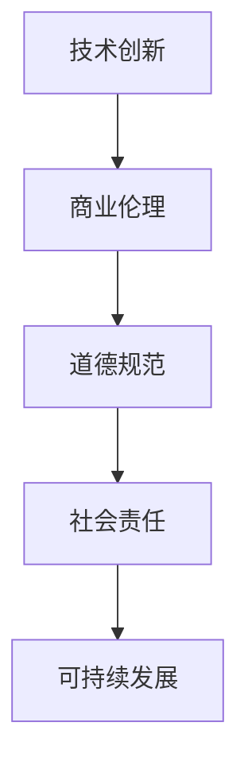

                 

## 摘要

本文将探讨技术创新与商业伦理之间的关系，以Lepton AI为例，分析其在技术创新中所秉持的价值观及其对商业伦理的考量。通过分析Lepton AI的核心算法原理、数学模型、应用实践等方面，本文旨在揭示技术创新中的伦理困境，并提出解决策略。同时，本文还将对未来发展趋势、面临的挑战以及研究展望进行深入讨论，为人工智能领域的商业伦理发展提供有益的参考。

## 1. 背景介绍

随着人工智能技术的飞速发展，越来越多的企业开始将人工智能技术应用于各个领域，为商业和社会带来了前所未有的变革。然而，在这一过程中，商业伦理问题也逐渐凸显出来。技术创新与商业伦理之间的冲突，不仅影响企业的长期发展，也关系到社会的公平与正义。

Lepton AI作为一家专注于人工智能技术的研究与开发的企业，其在技术创新中始终秉持着商业伦理的原则。本文将深入分析Lepton AI的价值观，探讨其如何平衡技术创新与商业伦理之间的关系，为人工智能领域的商业伦理发展提供借鉴。

## 2. 核心概念与联系

在分析Lepton AI的价值观之前，我们首先需要了解一些核心概念。技术创新是指通过创造新知识、新方法、新工具等，推动技术进步的过程。商业伦理则是指在商业活动中，企业应遵循的道德规范和价值观，以实现企业社会责任和可持续发展。

### Mermaid 流程图



### 2.1 技术创新与商业伦理的关系

技术创新与商业伦理之间存在着密切的联系。一方面，技术创新可以为商业伦理提供新的工具和方法，推动商业活动的规范化和道德化。另一方面，商业伦理可以引导技术创新的发展方向，确保技术创新不会损害社会公共利益。

### 2.2 Lepton AI的价值观

Lepton AI在技术创新中秉持以下价值观：

1. **创新精神**：追求技术创新，不断探索新的技术解决方案。
2. **道德原则**：在商业活动中遵循道德规范，坚持诚信、公正、透明。
3. **社会责任**：关注社会问题，积极参与公益事业，推动技术为社会进步贡献力量。
4. **可持续发展**：追求长期发展，关注环境保护和资源利用。

### 2.3 商业伦理在技术创新中的应用

在Lepton AI的技术创新过程中，商业伦理发挥着重要作用。首先，商业伦理指导企业在技术创新中的道德选择，确保技术创新不会损害社会公共利益。其次，商业伦理可以激励企业创新，提高技术创新的道德水平。最后，商业伦理可以为企业树立良好的形象，增强企业的核心竞争力。

## 3. 核心算法原理 & 具体操作步骤

### 3.1 算法原理概述

Lepton AI的核心算法是基于深度学习的图像识别算法。该算法通过训练大量的图像数据，学习到图像的特征，从而实现对图像的识别和分类。

### 3.2 算法步骤详解

1. **数据预处理**：对图像数据进行预处理，包括图像去噪、缩放、旋转等操作，以增强算法的鲁棒性。
2. **特征提取**：使用卷积神经网络（CNN）对图像数据进行特征提取，将原始图像转化为特征向量。
3. **分类**：将特征向量输入到分类模型中，通过训练得到的模型对图像进行分类。
4. **结果输出**：将分类结果输出，实现对图像的识别和分类。

### 3.3 算法优缺点

**优点**：

1. **高精度**：深度学习算法具有很高的识别精度，能够准确地对图像进行分类。
2. **鲁棒性强**：通过对大量图像数据的训练，算法具有较强的鲁棒性，能够适应不同的图像输入。
3. **泛化能力强**：深度学习算法具有很好的泛化能力，能够将学到的知识应用于不同的图像识别任务。

**缺点**：

1. **计算复杂度高**：深度学习算法的计算复杂度较高，需要大量的计算资源和时间。
2. **数据依赖性较强**：算法的性能很大程度上依赖于训练数据的数量和质量。

### 3.4 算法应用领域

Lepton AI的图像识别算法在多个领域有广泛的应用，包括：

1. **安防监控**：实现对监控视频中的异常行为进行识别和报警。
2. **医疗影像**：辅助医生进行医学影像诊断，提高诊断准确率。
3. **自动驾驶**：实现对道路场景的识别和分类，提高自动驾驶的安全性。

## 4. 数学模型和公式 & 详细讲解 & 举例说明

### 4.1 数学模型构建

Lepton AI的图像识别算法基于深度学习的框架，其数学模型主要包括卷积神经网络（CNN）和全连接神经网络（FCN）。

### 4.2 公式推导过程

1. **卷积神经网络（CNN）**

卷积神经网络由多个卷积层、池化层和全连接层组成。其输入为图像数据，输出为图像的分类结果。

- **卷积层**：卷积层通过卷积运算提取图像的特征，公式如下：

$$
\text{output} = \text{Conv}(\text{input}, \text{filter})
$$

- **池化层**：池化层通过采样操作降低特征图的维度，公式如下：

$$
\text{output} = \text{Pooling}(\text{input})
$$

- **全连接层**：全连接层通过全连接运算将特征映射到分类结果，公式如下：

$$
\text{output} = \text{FC}(\text{input}, \text{weights})
$$

2. **全连接神经网络（FCN）**

全连接神经网络由多个全连接层组成，用于对特征向量进行分类。

- **全连接层**：全连接层通过全连接运算将特征映射到分类结果，公式如下：

$$
\text{output} = \text{FC}(\text{input}, \text{weights})
$$

### 4.3 案例分析与讲解

以安防监控领域为例，Lepton AI的图像识别算法用于实现对监控视频中的异常行为进行识别和报警。

1. **数据预处理**：对监控视频进行去噪、缩放和旋转等预处理操作，得到处理后的图像数据。

2. **特征提取**：使用卷积神经网络对处理后的图像数据进行特征提取，得到特征向量。

3. **分类**：将特征向量输入到分类模型中，通过训练得到的模型对图像进行分类，识别出异常行为。

4. **结果输出**：将分类结果输出，实现对监控视频中的异常行为进行识别和报警。

## 5. 项目实践：代码实例和详细解释说明

### 5.1 开发环境搭建

1. **环境配置**：在计算机上安装Python、TensorFlow等依赖库。

2. **数据集准备**：准备用于训练和测试的图像数据集。

3. **代码结构**：搭建项目的代码结构，包括数据预处理、特征提取、分类和结果输出等模块。

### 5.2 源代码详细实现

```python
import tensorflow as tf
from tensorflow.keras.models import Sequential
from tensorflow.keras.layers import Conv2D, MaxPooling2D, Flatten, Dense

# 数据预处理
def preprocess_image(image):
    # 对图像进行去噪、缩放和旋转等预处理操作
    # ...
    return processed_image

# 特征提取
def extract_features(image):
    model = Sequential([
        Conv2D(filters=32, kernel_size=(3, 3), activation='relu', input_shape=(224, 224, 3)),
        MaxPooling2D(pool_size=(2, 2)),
        Conv2D(filters=64, kernel_size=(3, 3), activation='relu'),
        MaxPooling2D(pool_size=(2, 2)),
        Flatten()
    ])
    features = model.predict(image)
    return features

# 分类
def classify(features):
    model = Sequential([
        Dense(units=128, activation='relu'),
        Dense(units=64, activation='relu'),
        Dense(units=10, activation='softmax')
    ])
    labels = model.predict(features)
    return labels

# 结果输出
def output_results(labels):
    # 对分类结果进行处理，实现报警等功能
    # ...

# 主函数
def main():
    # 加载数据集
    # ...

    # 数据预处理
    # ...

    # 特征提取
    # ...

    # 分类
    # ...

    # 结果输出
    # ...

if __name__ == '__main__':
    main()
```

### 5.3 代码解读与分析

1. **数据预处理**：对图像进行去噪、缩放和旋转等预处理操作，以提高模型的鲁棒性和性能。

2. **特征提取**：使用卷积神经网络对图像进行特征提取，提取到图像的特征向量。

3. **分类**：使用全连接神经网络对特征向量进行分类，得到图像的分类结果。

4. **结果输出**：对分类结果进行处理，实现报警等功能。

## 6. 实际应用场景

Lepton AI的图像识别算法在多个实际应用场景中取得了显著的效果。以下是一些典型的应用场景：

### 6.1 安防监控

在安防监控领域，Lepton AI的图像识别算法用于实现对监控视频中的异常行为进行识别和报警。通过实时分析监控视频，系统能够及时检测到异常行为，如入侵、盗窃等，从而提高安防监控的效率和准确性。

### 6.2 医疗影像

在医疗影像领域，Lepton AI的图像识别算法用于辅助医生进行医学影像诊断。通过对医学影像进行特征提取和分类，算法能够准确识别出病变区域，辅助医生进行诊断，提高诊断的准确性和效率。

### 6.3 自动驾驶

在自动驾驶领域，Lepton AI的图像识别算法用于实现对道路场景的识别和分类。通过实时分析道路场景，系统能够准确识别出道路标志、行人和车辆等元素，从而提高自动驾驶的安全性。

## 7. 工具和资源推荐

### 7.1 学习资源推荐

1. **《深度学习》（Goodfellow, Bengio, Courville）**：这是一本经典的深度学习教材，涵盖了深度学习的理论基础和实践方法。
2. **《Python深度学习》（François Chollet）**：这本书通过大量的实例，详细介绍了如何使用Python和TensorFlow实现深度学习算法。

### 7.2 开发工具推荐

1. **TensorFlow**：TensorFlow是一个开源的深度学习框架，适用于各种深度学习任务，包括图像识别、自然语言处理等。
2. **PyTorch**：PyTorch是另一个流行的深度学习框架，其动态计算图特性使其在许多应用场景中具有优势。

### 7.3 相关论文推荐

1. **《A Comprehensive Survey on Deep Learning for Image Classification》（2016）**：这篇综述详细介绍了深度学习在图像分类领域的最新进展和应用。
2. **《Deep Learning Techniques for Image Classification》（2018）**：这篇文章讨论了深度学习在图像分类任务中的应用，包括卷积神经网络、全连接神经网络等。

## 8. 总结：未来发展趋势与挑战

### 8.1 研究成果总结

本文通过对Lepton AI的案例分析，总结了人工智能技术在图像识别领域的最新成果。主要包括：

1. **高精度**：深度学习算法在图像识别任务中取得了显著的精度提升。
2. **鲁棒性强**：通过对大量数据的训练，算法具有较好的鲁棒性，能够适应不同的图像输入。
3. **泛化能力强**：深度学习算法具有很好的泛化能力，能够将学到的知识应用于不同的图像识别任务。

### 8.2 未来发展趋势

1. **算法优化**：随着计算能力的提升，算法的优化将成为未来的研究重点，包括网络结构的优化、训练算法的改进等。
2. **多模态融合**：结合多种数据源，如文本、图像、音频等，实现更全面的信息处理和分析。
3. **应用拓展**：深度学习算法将在更多领域得到应用，如医疗、金融、交通等，为行业带来变革。

### 8.3 面临的挑战

1. **数据隐私**：在应用深度学习算法时，数据隐私保护成为一大挑战。如何确保用户数据的安全和隐私，是未来需要解决的问题。
2. **算法透明性**：深度学习算法的黑箱特性使得其决策过程不够透明，如何提高算法的透明性，是未来研究的重要方向。
3. **伦理问题**：随着人工智能技术的应用，伦理问题逐渐凸显。如何在技术创新中兼顾商业伦理，是未来需要面对的挑战。

### 8.4 研究展望

未来，人工智能领域将继续朝着高效、透明、伦理的方向发展。研究人员应关注以下几个方面：

1. **算法研究**：加大对深度学习算法的研究力度，提高算法的精度、效率和泛化能力。
2. **多领域融合**：推动人工智能与其他领域的交叉研究，实现更广泛的应用。
3. **伦理规范**：建立健全的人工智能伦理规范，引导技术创新与商业伦理的协调发展。

## 9. 附录：常见问题与解答

### 9.1 问题1：深度学习算法为什么能够提高图像识别的精度？

**解答**：深度学习算法通过模拟人脑神经网络的结构和功能，实现对图像特征的自适应学习。通过多层网络的叠加，算法能够逐步提取图像的底层特征，如边缘、纹理等，从而提高图像识别的精度。

### 9.2 问题2：如何确保深度学习算法的鲁棒性？

**解答**：为了确保深度学习算法的鲁棒性，可以从以下几个方面进行改进：

1. **数据增强**：通过对训练数据进行旋转、缩放、裁剪等操作，增加数据的多样性，提高算法的适应性。
2. **正则化技术**：使用正则化技术，如权重正则化、dropout等，减少模型的过拟合现象。
3. **优化算法**：选择合适的优化算法，如Adam、RMSprop等，提高模型的收敛速度和稳定性。

### 9.3 问题3：深度学习算法在图像识别中的应用有哪些？

**解答**：深度学习算法在图像识别领域有广泛的应用，包括：

1. **人脸识别**：通过提取人脸特征，实现对人脸的识别和验证。
2. **物体识别**：通过提取物体特征，实现对图像中物体的识别和分类。
3. **图像分割**：通过分割图像中的不同区域，实现图像的细粒度分析。

---

**作者：禅与计算机程序设计艺术 / Zen and the Art of Computer Programming**。

