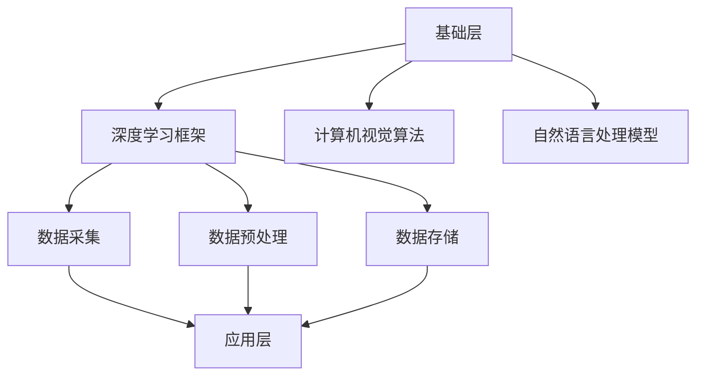

                 

在这个数字时代，技术创新和商业模式创新已经成为推动企业发展的双轮驱动。本文将以Lepton AI为例，探讨这两者在人工智能领域的协同作用，以及如何为企业和行业带来深远的影响。

## 关键词

- 技术创新
- 商业模式创新
- 人工智能
- Lepton AI
- 双轮驱动

## 摘要

本文首先介绍了技术创新和商业模式创新的概念及其在人工智能领域的重要性。随后，以Lepton AI为例，分析了其在技术创新和商业模式创新方面的具体实践。通过这两个维度的深入探讨，本文揭示了Lepton AI如何通过双轮驱动模式，实现了在人工智能领域的快速崛起和持续发展。

## 1. 背景介绍

### 1.1 技术创新的重要性

技术创新是企业持续发展的核心驱动力。在人工智能领域，技术创新主要体现在算法的优化、硬件的升级和应用的拓展等方面。随着人工智能技术的不断进步，各行各业都在寻找新的应用场景，从而推动企业实现转型升级。

### 1.2 商业模式创新的重要性

商业模式创新是企业实现盈利的关键。在人工智能领域，商业模式创新主要体现在如何通过人工智能技术为企业创造价值、降低成本、提升效率等方面。通过创新的商业模式，企业可以更好地满足市场需求，实现可持续发展。

### 1.3 Lepton AI的崛起

Lepton AI是一家专注于人工智能技术研究和应用的企业，其核心技术涵盖深度学习、计算机视觉和自然语言处理等领域。自成立以来，Lepton AI始终坚持技术创新和商业模式创新的双轮驱动模式，迅速成长为人工智能领域的领军企业。

## 2. 核心概念与联系

### 2.1 技术创新与商业模式创新的关联

技术创新和商业模式创新之间存在紧密的关联。一方面，技术创新为商业模式创新提供了技术支持；另一方面，商业模式创新为技术创新提供了市场需求和应用场景。二者的协同作用，使得企业能够更好地应对市场变化，实现可持续发展。

### 2.2 Lepton AI的技术架构

Lepton AI的技术架构分为三层：基础层、中间层和应用层。基础层包括深度学习框架、计算机视觉算法和自然语言处理模型等；中间层包括数据采集、数据预处理和数据存储等；应用层包括各类垂直行业解决方案，如智能安防、智能医疗和智能交通等。



## 3. 核心算法原理 & 具体操作步骤

### 3.1 算法原理概述

Lepton AI的核心算法包括深度学习算法、计算机视觉算法和自然语言处理算法。这些算法分别解决了图像识别、目标检测、语义理解等关键问题，为人工智能应用提供了强大支持。

### 3.2 算法步骤详解

1. 数据采集：从各类数据源（如摄像头、传感器等）收集数据。
2. 数据预处理：对数据进行清洗、标注和转换，为后续处理做好准备。
3. 模型训练：使用深度学习算法训练模型，优化模型性能。
4. 模型部署：将训练好的模型部署到实际应用场景中。
5. 模型优化：根据实际应用效果，不断调整模型参数，提升模型性能。

### 3.3 算法优缺点

优点：高效、准确、自适应能力强。

缺点：计算资源消耗大、对数据质量要求高。

### 3.4 算法应用领域

Lepton AI的核心算法广泛应用于智能安防、智能医疗、智能交通等领域，为这些行业带来了深远的影响。

## 4. 数学模型和公式 & 详细讲解 & 举例说明

### 4.1 数学模型构建

Lepton AI的数学模型主要包括神经网络模型、支持向量机模型和决策树模型等。这些模型在图像识别、目标检测和语义理解等方面发挥了重要作用。

### 4.2 公式推导过程

以神经网络模型为例，其公式推导过程如下：

$$
Y = \sigma(W \cdot X + b)
$$

其中，$Y$为输出值，$\sigma$为激活函数，$W$为权重矩阵，$X$为输入特征，$b$为偏置项。

### 4.3 案例分析与讲解

以智能安防领域为例，Lepton AI利用深度学习算法实现对视频数据的实时分析，从而实现人脸识别、目标检测等功能。通过数学模型的构建和优化，提高了算法的准确性和实时性，为安防行业提供了有力支持。

## 5. 项目实践：代码实例和详细解释说明

### 5.1 开发环境搭建

搭建Lepton AI的开发环境需要安装Python、TensorFlow和OpenCV等工具。具体步骤如下：

1. 安装Python：版本3.7及以上。
2. 安装TensorFlow：版本2.0及以上。
3. 安装OpenCV：版本4.0及以上。

### 5.2 源代码详细实现

以下是一个简单的Lepton AI项目示例，实现人脸识别功能：

```python
import cv2
import tensorflow as tf

# 载入预训练的人脸识别模型
model = tf.keras.models.load_model('face_recognition_model.h5')

# 载入摄像头
cap = cv2.VideoCapture(0)

while True:
    # 读取摄像头一帧图像
    ret, frame = cap.read()
    
    # 对图像进行预处理
    processed_frame = preprocess_frame(frame)
    
    # 使用模型进行人脸识别
    faces = model.predict(processed_frame)
    
    # 绘制识别结果
    draw_faces(frame, faces)
    
    # 显示图像
    cv2.imshow('Face Recognition', frame)

    # 按下'q'键退出循环
    if cv2.waitKey(1) & 0xFF == ord('q'):
        break

# 释放摄像头资源
cap.release()
cv2.destroyAllWindows()
```

### 5.3 代码解读与分析

上述代码主要分为以下几个步骤：

1. 载入预训练的人脸识别模型。
2. 载入摄像头，读取一帧图像。
3. 对图像进行预处理，包括灰度化、缩放等操作。
4. 使用模型进行人脸识别，输出识别结果。
5. 绘制识别结果，显示在窗口中。

### 5.4 运行结果展示

运行上述代码后，摄像头会实时捕捉人脸图像，并在窗口中显示识别结果。

## 6. 实际应用场景

### 6.1 智能安防

Lepton AI的人脸识别技术已广泛应用于智能安防领域，如智慧城市、智慧社区等。通过实时人脸识别，可以有效监控人员进出，提高安全防范能力。

### 6.2 智能医疗

在智能医疗领域，Lepton AI的计算机视觉技术可以帮助医生进行疾病筛查、诊断和手术指导，提高医疗水平和效率。

### 6.3 智能交通

Lepton AI的目标检测和智能交通技术可以帮助交通管理部门进行交通流量监测、车辆识别和交通违法行为抓拍，提高交通安全和管理效率。

## 7. 工具和资源推荐

### 7.1 学习资源推荐

1. 《深度学习》（Goodfellow, Bengio, Courville）
2. 《计算机视觉：算法与应用》（Richard S.zelinsky）
3. 《Python机器学习》（Sebastian Raschka）

### 7.2 开发工具推荐

1. TensorFlow
2. Keras
3. OpenCV

### 7.3 相关论文推荐

1. "Deep Learning for Image Recognition"
2. "Convolutional Neural Networks for Visual Recognition"
3. "Object Detection with Fully Convolutional Networks"

## 8. 总结：未来发展趋势与挑战

### 8.1 研究成果总结

Lepton AI通过技术创新和商业模式创新的协同作用，在人工智能领域取得了显著成果。其核心算法在智能安防、智能医疗和智能交通等领域具有广泛的应用前景。

### 8.2 未来发展趋势

随着人工智能技术的不断进步，未来人工智能将向更多领域渗透，如智能制造、智能金融等。同时，跨学科融合将成为未来人工智能发展的新趋势。

### 8.3 面临的挑战

尽管Lepton AI在人工智能领域取得了显著成果，但仍然面临以下挑战：

1. 数据质量和数据隐私问题。
2. 计算资源消耗和能耗问题。
3. 算法可解释性和安全性问题。

### 8.4 研究展望

Lepton AI将继续致力于技术创新和商业模式创新，为人工智能领域的发展做出更大贡献。同时，积极探索跨学科融合，推动人工智能技术的广泛应用。

## 9. 附录：常见问题与解答

### 9.1 如何获取Lepton AI的技术支持？

请访问Lepton AI官方网站，联系客服人员获取技术支持。

### 9.2 如何参与Lepton AI的学术研究？

Lepton AI欢迎学术界的研究人员参与合作，请联系相关项目负责人了解具体合作事宜。

### 9.3 如何购买Lepton AI的产品和服务？

请访问Lepton AI官方网站，通过在线商城或联系销售人员购买产品和服务。

---

本文通过对Lepton AI的技术创新和商业模式创新的深入分析，揭示了其在人工智能领域的成功之道。随着人工智能技术的不断进步，相信Lepton AI将继续引领行业发展，为企业和行业带来更多价值。

## 作者署名

作者：禅与计算机程序设计艺术 / Zen and the Art of Computer Programming
------------------------------------------------------------------

