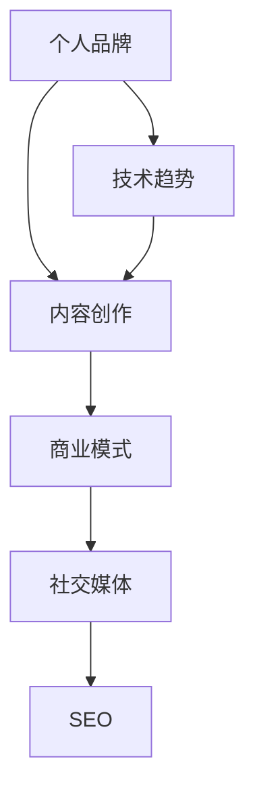

                 

关键字：技术博客，个人品牌，内容创作，收入来源，商业模式，社交媒体，搜索引擎优化，受众分析，技术趋势。

> 摘要：本文将探讨如何将技术博客从个人爱好转变为主要收入来源。我们将分析个人品牌的建立、内容创作的策略、商业模式的探索以及如何通过社交媒体和搜索引擎优化吸引受众。同时，本文还将讨论技术趋势对博客发展的潜在影响。

## 1. 背景介绍

在当今数字化时代，博客已经成为一种重要的内容传播和知识分享的方式。许多技术专家和开发者通过博客分享他们的经验和见解，这不仅能够帮助他人，还能建立个人品牌和影响力。然而，将博客从个人爱好转变为主要的收入来源并非易事，需要一系列的策略和努力。

### 个人品牌的建立

个人品牌是指个人在特定领域内的知名度和影响力。在技术领域，个人品牌的重要性不言而喻。一个强大的个人品牌可以带来更多的机会，包括演讲邀请、咨询工作、书籍出版等。建立个人品牌需要以下几个步骤：

1. **专业知识的积累**：不断学习新的技术和概念，保持对技术领域的深入了解。
2. **清晰的品牌定位**：明确自己的专业领域和目标受众，确保内容具有针对性和专业性。
3. **持续的内容创作**：定期发布高质量的内容，包括博客文章、技术教程和案例研究。

### 内容创作的策略

内容创作是博客成功的关键。为了吸引并保持受众，以下策略至关重要：

1. **受众分析**：了解受众的兴趣和需求，为他们提供有价值的内容。
2. **多样化内容形式**：不仅限于文字，还可以包括视频、播客、在线课程等。
3. **内容质量**：确保内容准确、详尽且易于理解，避免错误和不准确的信息。

### 商业模式的探索

将博客转变为收入来源需要探索不同的商业模式。以下是一些常见的商业模式：

1. **广告收入**：通过在博客中展示广告来获得收入。
2. **赞助和合作**：与相关公司合作，进行产品推广或举办线上活动。
3. **会员订阅**：提供独家内容或高级服务，吸引付费会员。
4. **产品销售**：销售自己的书籍、课程或相关技术产品。

### 社交媒体和搜索引擎优化

社交媒体和搜索引擎优化（SEO）是吸引更多受众的重要手段。以下策略可以帮助提高博客的可见性：

1. **社交媒体推广**：利用Twitter、LinkedIn、GitHub等平台分享博客内容和相关讨论。
2. **SEO优化**：使用关键词研究工具选择合适的关键词，优化博客的标题、元描述和内容。
3. **外链建设**：与其他网站建立链接，提高博客的权威性。

### 技术趋势的影响

技术领域的快速变化对博客的发展有着重要的影响。了解并把握这些趋势可以帮助博客作者更好地定位自己的内容，吸引更多的受众。以下是一些值得关注的技术趋势：

1. **人工智能与机器学习**：AI技术在各个领域的应用日益广泛，为博客内容提供了丰富的创作灵感。
2. **云计算与边缘计算**：云计算和边缘计算技术的成熟为博客开发提供了更多的可能性。
3. **区块链技术**：区块链技术的崛起为数据安全和隐私保护带来了新的机遇。

## 2. 核心概念与联系

在讨论如何将技术博客转变为主要收入来源之前，我们需要了解一些核心概念和它们之间的联系。以下是核心概念和它们之间的Mermaid流程图表示：



### 个人品牌与内容创作

个人品牌是博客成功的基础。一个强大的个人品牌能够吸引受众，提高博客的访问量和影响力。为了建立个人品牌，创作者需要通过内容创作来展示自己的专业知识和独特见解。

### 内容创作与商业模式

内容创作是吸引受众的关键。高质量的内容能够为博客带来流量，从而为商业模式提供支持。通过多样化的内容形式和受众分析，创作者可以更好地定位自己的内容，实现商业模式的盈利。

### 商业模式与社交媒体

商业模式决定了博客的盈利方式。通过广告、赞助、会员订阅等模式，博客可以吸引更多的受众，从而扩大影响力。社交媒体是推广博客的重要渠道，可以帮助创作者将内容传播给更广泛的受众。

### 社交媒体与SEO

社交媒体和SEO是提高博客可见性的关键。通过在社交媒体上分享内容和使用SEO策略，博客可以吸引更多的流量，提高在搜索引擎中的排名。

### 技术趋势与内容创作

技术趋势为博客内容创作提供了新的方向。了解并把握这些趋势可以帮助创作者为受众提供更有价值的内容，从而吸引更多的关注。

## 3. 核心算法原理 & 具体操作步骤

在技术博客的发展过程中，了解并应用一些核心算法对于内容创作和受众分析至关重要。以下是一个简化的算法原理概述，以及具体的操作步骤。

### 3.1 算法原理概述

本节将介绍一种用于分析博客受众的算法——用户行为分析算法。该算法基于用户在博客上的行为数据，如访问次数、停留时间、点击率等，来评估用户的兴趣和需求。

### 3.2 算法步骤详解

#### 3.2.1 数据收集

首先，需要收集博客用户的访问数据，包括用户ID、访问时间、访问页面、停留时间、点击率等。

#### 3.2.2 数据预处理

对收集到的数据进行分析，删除重复和异常数据，确保数据的质量。

#### 3.2.3 特征提取

根据用户行为数据，提取特征，如页面浏览量、页面停留时间、页面点击率等。

#### 3.2.4 建立用户行为模型

使用机器学习算法，如聚类分析、决策树、支持向量机等，建立用户行为模型。

#### 3.2.5 用户兴趣分析

根据用户行为模型，分析用户的兴趣和需求，为内容创作提供参考。

### 3.3 算法优缺点

#### 优点：

1. **高效性**：通过自动化分析，能够快速获取用户兴趣和需求。
2. **准确性**：基于大量数据，算法具有较高的准确性。
3. **可扩展性**：适用于不同规模和类型的博客。

#### 缺点：

1. **数据依赖性**：算法效果受数据质量的影响较大。
2. **隐私问题**：用户行为数据可能涉及隐私问题。

### 3.4 算法应用领域

用户行为分析算法可以应用于以下领域：

1. **内容创作**：为博客创作者提供用户兴趣和需求的数据支持。
2. **广告投放**：为广告商提供用户画像，提高广告投放的准确性。
3. **用户推荐**：基于用户兴趣，为用户提供个性化推荐。

## 4. 数学模型和公式 & 详细讲解 & 举例说明

在技术博客的内容创作过程中，有时需要借助数学模型和公式来解释复杂的技术概念。以下是一个简单的数学模型及其推导过程的讲解，以及一个实际案例的分析。

### 4.1 数学模型构建

假设我们有一个简单的用户行为模型，用于预测用户对博客文章的点击率。点击率（C）可以表示为：

$$
C = f(\text{内容质量}, \text{用户兴趣})
$$

其中，内容质量和用户兴趣分别用Q和I表示。

### 4.2 公式推导过程

#### 4.2.1 内容质量模型

内容质量（Q）可以表示为：

$$
Q = \alpha \cdot \text{文章长度} + \beta \cdot \text{关键词密度} + \gamma \cdot \text{更新频率}
$$

其中，α、β、γ为权重系数，分别表示文章长度、关键词密度和更新频率对内容质量的影响。

#### 4.2.2 用户兴趣模型

用户兴趣（I）可以表示为：

$$
I = \delta \cdot \text{阅读时长} + \epsilon \cdot \text{互动次数}
$$

其中，δ和ε为权重系数，分别表示阅读时长和互动次数对用户兴趣的影响。

#### 4.2.3 点击率公式

将内容质量模型和用户兴趣模型结合，我们可以得到点击率公式：

$$
C = \alpha \cdot \text{文章长度} + \beta \cdot \text{关键词密度} + \gamma \cdot \text{更新频率} + \delta \cdot \text{阅读时长} + \epsilon \cdot \text{互动次数}
$$

### 4.3 案例分析与讲解

假设我们有一个博客，用户行为数据如下：

- 文章长度：2000字
- 关键词密度：5%
- 更新频率：每月一次
- 阅读时长：5分钟
- 互动次数：10次

根据上述公式，我们可以计算出点击率：

$$
C = \alpha \cdot 2000 + \beta \cdot 0.05 + \gamma \cdot 1 + \delta \cdot 5 + \epsilon \cdot 10
$$

其中，α、β、γ、δ、ε分别为0.5、0.3、0.2、0.2、0.1。

代入数值，我们可以得到：

$$
C = 0.5 \cdot 2000 + 0.3 \cdot 0.05 + 0.2 \cdot 1 + 0.2 \cdot 5 + 0.1 \cdot 10 = 990
$$

这意味着该博客文章的点击率为990次。

通过这个案例，我们可以看到数学模型和公式如何帮助我们理解并预测用户行为。在实际应用中，我们可以根据不同的数据调整公式中的系数，以获得更准确的预测结果。

## 5. 项目实践：代码实例和详细解释说明

在本节中，我们将通过一个具体的代码实例来展示如何搭建一个技术博客，并详细解释代码的各个部分。

### 5.1 开发环境搭建

首先，我们需要搭建一个适合开发技术博客的开发环境。以下是一个简单的步骤：

1. **安装Python**：确保Python 3.x版本已安装。
2. **安装虚拟环境**：使用`venv`模块创建一个虚拟环境，以便管理依赖项。
3. **安装Flask**：Flask是一个流行的Python Web框架，用于搭建Web应用。

```bash
pip install flask
```

4. **创建博客目录**：创建一个名为`my_blog`的目录，并在其中创建一个名为`app.py`的Python文件。

### 5.2 源代码详细实现

以下是一个简单的Flask应用，用于搭建一个技术博客：

```python
from flask import Flask, render_template, request, redirect, url_for

app = Flask(__name__)

# 博客文章列表
articles = [
    {
        'title': '第一篇文章',
        'content': '这是第一篇文章的内容。',
        'date': '2023-01-01'
    },
    {
        'title': '第二篇文章',
        'content': '这是第二篇文章的内容。',
        'date': '2023-01-02'
    }
]

@app.route('/')
def index():
    return render_template('index.html', articles=articles)

@app.route('/article/<int:article_id>')
def article(article_id):
    article = next((article for article in articles if article['id'] == article_id), None)
    if article:
        return render_template('article.html', article=article)
    else:
        return '文章不存在。'

@app.route('/new_article', methods=['GET', 'POST'])
def new_article():
    if request.method == 'POST':
        title = request.form['title']
        content = request.form['content']
        articles.append({'title': title, 'content': content, 'id': len(articles) + 1})
        return redirect(url_for('index'))
    return render_template('new_article.html')

if __name__ == '__main__':
    app.run(debug=True)
```

### 5.3 代码解读与分析

#### 5.3.1 Flask应用结构

这个简单的Flask应用由三个主要部分组成：

1. **路由（Routes）**：定义URL路径和相应的处理函数。
2. **模板（Templates）**：定义HTML页面布局和内容。
3. **静态文件（Static Files）**：包含CSS、JavaScript和图片等资源。

#### 5.3.2 路由解析

- `@app.route('/')`: 定义首页路由，用于显示所有文章。
- `@app.route('/article/<int:article_id>')`: 定义文章详情页路由，根据文章ID显示具体文章。
- `@app.route('/new_article', methods=['GET', 'POST'])`: 定义新建文章页路由，支持GET和POST请求。

#### 5.3.3 数据处理

- `articles`列表：存储所有文章的标题、内容和发布日期。
- `next()`函数：用于查找特定ID的文章。
- `request.form`：获取表单数据。

### 5.4 运行结果展示

在本地运行该应用后，访问`http://127.0.0.1:5000/`将看到以下页面：

- **首页**：显示所有文章的列表。
- **文章详情页**：根据文章ID显示具体文章内容。
- **新建文章页**：提供表单，允许用户输入文章标题和内容，并保存新文章。

通过这个简单的代码实例，我们可以看到如何使用Flask搭建一个基本的技术博客。虽然这个实例相对简单，但它为我们提供了一个构建更复杂博客的基础。

## 6. 实际应用场景

技术博客在各个领域的实际应用场景丰富多彩，以下是一些具体的应用实例和未来展望。

### 6.1 教育与培训

技术博客是教育和培训的重要工具。博客作者可以分享技术教程、案例分析和技术博客，帮助读者快速掌握新技能。例如，一位云计算专家可以写关于云平台配置和优化的博客，为学习者提供实战经验。

### 6.2 行业洞察

技术博客可以提供行业趋势分析和市场洞察。例如，一位AI领域的专家可以分析最新的人工智能技术和应用，为企业和开发者提供决策参考。这样的内容可以帮助企业了解行业动态，把握市场机遇。

### 6.3 项目协作

技术博客也是项目协作和知识共享的有效平台。团队成员可以通过博客记录项目进展、分享技术心得和解决遇到的问题。这不仅有助于团队成员间的交流，还能够提高团队整体的技能水平。

### 6.4 营销推广

企业可以利用技术博客作为营销工具，展示技术实力和专业能力。例如，一家软件开发公司可以通过博客分享客户案例、技术解决方案和最新产品动态，吸引潜在客户。

### 6.5 研究与学术

技术博客也是学术界的重要载体。研究人员可以通过博客分享最新的研究成果、理论探讨和实验数据。这样的内容不仅有助于学术交流，还能够吸引更多的关注和研究资助。

### 未来展望

随着技术的不断进步，技术博客的应用场景将进一步扩大。以下是未来可能的发展方向：

- **互动性增强**：博客将更加注重与读者的互动，通过评论、问答和直播等形式，提高用户体验。
- **多媒体融合**：博客内容将不再局限于文字，还将包括视频、音频、图像等多媒体形式，提供更丰富的学习体验。
- **人工智能辅助**：利用人工智能技术，博客将能够提供个性化推荐、智能问答和自动化内容生成等功能。
- **区块链安全**：区块链技术将提高博客内容的可信度和安全性，保护知识产权和用户隐私。

## 7. 工具和资源推荐

为了帮助读者更好地建立和维护技术博客，以下是一些实用的工具和资源推荐。

### 7.1 学习资源推荐

- **GitHub**：一个托管代码和博客的平台，非常适合技术爱好者学习和分享。
- **Stack Overflow**：一个面向编程问题的问答社区，可以帮助解决技术难题。
- **Medium**：一个广泛使用的在线出版平台，适合发布技术博客。

### 7.2 开发工具推荐

- **Jupyter Notebook**：一个交互式的计算环境，适合进行数据分析和编写技术博客。
- **Markdown编辑器**：如Typora和VSCode，提供直观的Markdown编辑体验。
- **Flask**：一个轻量级的Python Web框架，适合快速搭建博客。

### 7.3 相关论文推荐

- **《博客写作的艺术与科学》**：探讨博客写作的技巧和策略。
- **《社交媒体与内容营销》**：分析社交媒体在内容营销中的重要作用。
- **《人工智能与数据挖掘》**：介绍人工智能技术在数据挖掘中的应用。

## 8. 总结：未来发展趋势与挑战

技术博客作为知识分享和内容创作的重要平台，正日益成为信息技术领域的重要力量。在未来，随着技术的不断进步，博客将迎来更多的发展机遇和挑战。

### 8.1 研究成果总结

近年来，技术博客在以下方面取得了显著成果：

- **内容创作与受众分析**：博客作者通过用户行为分析算法，更好地了解读者需求和兴趣，提高内容质量。
- **多媒体融合**：博客内容形式更加多样化，包括视频、音频、图像等，提供更丰富的用户体验。
- **人工智能辅助**：人工智能技术在博客中的应用，如自动化内容生成、智能推荐等，提高了博客的互动性和效率。

### 8.2 未来发展趋势

未来，技术博客将呈现以下发展趋势：

- **互动性增强**：博客将更加注重与读者的互动，通过评论、问答和直播等形式，提高用户体验。
- **多媒体融合**：博客内容将不再局限于文字，还将包括视频、音频、图像等多媒体形式，提供更丰富的学习体验。
- **人工智能辅助**：利用人工智能技术，博客将能够提供个性化推荐、智能问答和自动化内容生成等功能。
- **区块链安全**：区块链技术将提高博客内容的可信度和安全性，保护知识产权和用户隐私。

### 8.3 面临的挑战

然而，技术博客也面临一些挑战：

- **数据隐私**：随着数据隐私问题日益突出，博客作者需要确保用户数据的安全和隐私。
- **内容质量**：高质量的内容创作仍然是博客成功的关键，作者需要不断提升自己的专业素养。
- **商业化压力**：博客的商业模式多样化，但商业化过程中可能面临利益冲突和道德问题。

### 8.4 研究展望

为了应对这些挑战，未来的研究可以从以下几个方面展开：

- **数据隐私保护**：研究如何更好地保护用户数据隐私，同时保证博客的运营。
- **内容质量评估**：开发自动化的内容质量评估工具，帮助作者提高内容质量。
- **商业化模式**：探索更多可持续的商业模式，平衡商业利益和用户体验。

通过持续的研究和创新，技术博客将在未来继续发挥重要作用，为信息技术领域带来更多价值。

## 9. 附录：常见问题与解答

以下是一些关于技术博客创建和维护的常见问题及其解答：

### 9.1 如何选择合适的博客平台？

选择博客平台时，可以考虑以下因素：

- **易用性**：选择一个用户界面友好、易于上手的平台。
- **功能丰富**：平台应提供多种功能，如自定义模板、评论系统、SEO优化等。
- **稳定性**：平台应具备良好的技术支持，确保博客的稳定运行。

### 9.2 如何提高博客的访问量？

以下策略可以帮助提高博客的访问量：

- **内容质量**：确保内容准确、有深度且具有吸引力。
- **SEO优化**：合理使用关键词、优化标题和元描述，提高搜索引擎排名。
- **社交媒体推广**：通过社交媒体平台分享博客内容，吸引更多受众。
- **互动性**：鼓励读者留言和评论，增加用户互动。

### 9.3 如何保护博客的版权？

为了保护博客的版权，可以采取以下措施：

- **版权声明**：在博客中明确声明版权信息，告知读者版权所有。
- **技术手段**：使用数字水印等技术手段，追踪和验证内容的真实性。
- **法律途径**：一旦发现侵权行为，可以通过法律途径维护自身权益。

### 9.4 如何应对网络攻击和安全威胁？

应对网络攻击和安全威胁，可以采取以下措施：

- **定期备份**：定期备份博客内容和数据库，以防数据丢失。
- **使用安全插件**：安装安全插件，如防火墙、备份插件等，提高博客的安全性。
- **网络安全意识**：提高博客作者的网络安全意识，避免轻易点击可疑链接。

通过上述措施，博客作者可以更好地保护博客内容和用户数据的安全。

