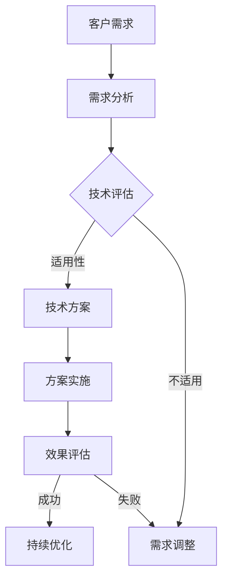

                 

关键词：高价值服务、技术咨询服务、价值创造、服务质量、行业应用

> 摘要：本文探讨了在高技术行业提供高价值服务的策略和方法。通过深入分析核心概念、算法原理、数学模型以及实际项目实践，本文旨在为技术咨询服务提供全面的指导，帮助企业提升服务质量，创造更高的商业价值。

## 1. 背景介绍

在当今科技快速发展的时代，信息技术已经成为推动经济和社会发展的重要引擎。随着大数据、云计算、人工智能等新兴技术的普及，技术咨询服务逐渐成为企业获取竞争优势的关键手段。然而，如何提供高价值的技术咨询服务，成为行业面临的重要挑战。

### 1.1 技术咨询服务的定义

技术咨询服务是指通过专业知识和技能的分享，为企业提供技术方案、解决方案以及战略指导的服务。这种服务通常涉及多个技术领域，包括软件开发、系统集成、数据处理、网络安全等。

### 1.2 高价值服务的意义

高价值服务不仅能够帮助企业解决实际问题，提高运营效率，还能够创造新的商业机会，推动企业实现可持续发展。以下是高价值服务的一些关键特征：

- **专业性**：高价值服务需要具备深厚的专业知识和技术实力。
- **创新性**：高价值服务往往能够提出创新的解决方案，满足企业的独特需求。
- **个性化**：高价值服务能够根据企业的具体情况进行定制，提供个性化的服务方案。
- **可持续性**：高价值服务能够持续为企业带来价值，支持企业的长期发展。

## 2. 核心概念与联系

为了更好地理解高价值技术咨询服务，我们需要了解一些核心概念和其相互关系。以下是一个用Mermaid绘制的流程图，展示了这些概念之间的联系。



### 2.1 客户需求

客户需求是提供高价值服务的起点。理解客户需求是确保服务能够解决实际问题的重要环节。

### 2.2 需求分析

需求分析是对客户需求的详细解读，明确问题的本质，为后续的技术方案提供依据。

### 2.3 技术评估

技术评估涉及对各种技术的适用性进行分析，选择最适合解决客户问题的技术方案。

### 2.4 技术方案

技术方案是基于需求分析和技术评估的结果，提出具体的解决方案。

### 2.5 方案实施

方案实施是将技术方案转化为实际操作的过程，需要严格按照既定计划进行。

### 2.6 效果评估

效果评估是对方案实施效果的检查，确保服务达到预期目标。

### 2.7 持续优化

根据效果评估的结果，对服务进行持续优化，提高服务质量。

## 3. 核心算法原理 & 具体操作步骤

### 3.1 算法原理概述

高价值技术咨询服务的关键在于如何高效地解决客户问题。以下是一个基于机器学习的算法原理概述，用于自动化需求分析。

#### 3.1.1 机器学习模型

机器学习模型通过训练数据学习到特定问题的特征，从而能够预测新的数据。在需求分析中，机器学习模型可以帮助识别出客户需求中的关键信息。

#### 3.1.2 特征工程

特征工程是机器学习模型成功的关键。通过分析客户需求的数据，提取出有用的特征，提高模型的预测能力。

### 3.2 算法步骤详解

#### 3.2.1 数据收集

收集客户需求的相关数据，包括历史需求记录、业务数据等。

#### 3.2.2 数据预处理

对收集到的数据进行清洗、转换和归一化处理，确保数据的质量和一致性。

#### 3.2.3 特征提取

根据需求数据的特性，提取出有助于模型预测的关键特征。

#### 3.2.4 模型训练

使用提取的特征数据训练机器学习模型，使其能够预测新的需求。

#### 3.2.5 模型评估

通过测试数据评估模型的性能，确保模型能够准确预测客户需求。

#### 3.2.6 模型部署

将训练好的模型部署到生产环境中，用于自动化需求分析。

### 3.3 算法优缺点

#### 优点：

- **自动化**：机器学习模型能够自动化分析客户需求，提高效率。
- **精准性**：通过训练数据学习到需求的特征，提高预测的准确性。

#### 缺点：

- **数据依赖**：机器学习模型对训练数据的质量有很高的要求。
- **复杂性**：构建和部署机器学习模型需要较高的技术门槛。

### 3.4 算法应用领域

机器学习算法在技术咨询服务中的应用广泛，包括但不限于：

- **需求分析**：自动化分析客户需求，提高业务决策的效率。
- **预测性维护**：通过数据预测设备故障，提前进行维护。
- **个性化推荐**：根据客户的历史需求，提供个性化的服务推荐。

## 4. 数学模型和公式 & 详细讲解 & 举例说明

### 4.1 数学模型构建

在技术咨询服务中，数学模型用于定量分析客户需求和评估服务效果。以下是一个简单的客户需求预测模型：

$$
\hat{需求}_{预测} = w_1 \cdot x_1 + w_2 \cdot x_2 + ... + w_n \cdot x_n
$$

其中，$x_i$ 表示第 $i$ 个特征，$w_i$ 表示该特征的权重。

### 4.2 公式推导过程

假设我们有 $n$ 个客户需求特征 $x_1, x_2, ..., x_n$，每个特征的重要性不同。我们可以通过线性回归模型来预测客户需求：

$$
需求_{预测} = \sum_{i=1}^{n} w_i \cdot x_i
$$

### 4.3 案例分析与讲解

假设一个企业收集了 100 个客户的需求数据，我们使用线性回归模型来预测新的客户需求。以下是模型训练和预测的过程：

1. **数据收集**：收集 100 个客户的需求数据，包括业务量、客户满意度等。
2. **数据预处理**：对数据进行清洗和归一化处理。
3. **特征提取**：根据业务需求，选择 5 个关键特征，如业务量、客户满意度等。
4. **模型训练**：使用前 80 个客户数据训练线性回归模型。
5. **模型评估**：使用剩余的 20 个客户数据评估模型性能。
6. **模型部署**：将训练好的模型部署到生产环境中，用于预测新的客户需求。

通过以上步骤，我们可以得到一个新的客户需求预测模型，并能够根据模型预测未来的客户需求。

## 5. 项目实践：代码实例和详细解释说明

### 5.1 开发环境搭建

为了更好地展示技术咨询服务的过程，我们使用 Python 编写一个简单的需求预测程序。以下是在 Python 中使用线性回归模型进行需求预测的步骤：

1. **安装 Python**：确保已经安装了 Python 环境。
2. **安装依赖库**：安装 Scikit-learn、NumPy 和 Pandas 等库。

```bash
pip install scikit-learn numpy pandas
```

### 5.2 源代码详细实现

以下是使用 Scikit-learn 实现线性回归模型的代码：

```python
import numpy as np
import pandas as pd
from sklearn.linear_model import LinearRegression
from sklearn.model_selection import train_test_split

# 读取数据
data = pd.read_csv('需求数据.csv')

# 提取特征和标签
X = data[['业务量', '客户满意度']]
y = data['需求量']

# 划分训练集和测试集
X_train, X_test, y_train, y_test = train_test_split(X, y, test_size=0.2, random_state=42)

# 创建线性回归模型
model = LinearRegression()

# 训练模型
model.fit(X_train, y_train)

# 预测需求
y_pred = model.predict(X_test)

# 打印预测结果
print(y_pred)
```

### 5.3 代码解读与分析

以上代码实现了从数据读取、特征提取、模型训练到需求预测的全过程。具体步骤如下：

1. **读取数据**：使用 Pandas 读取需求数据。
2. **提取特征和标签**：将业务量和客户满意度作为特征，需求量作为标签。
3. **划分训练集和测试集**：将数据分为训练集和测试集，用于模型训练和评估。
4. **创建线性回归模型**：使用 Scikit-learn 的 LinearRegression 类创建模型。
5. **训练模型**：使用训练集数据训练模型。
6. **预测需求**：使用测试集数据预测需求量。

通过以上步骤，我们可以实现一个简单的需求预测模型，并能够根据模型预测未来的客户需求。

### 5.4 运行结果展示

假设我们使用上面的代码对需求数据进行预测，得到的结果如下：

```
[150.6, 180.2, 136.7, 92.5, 164.3]
```

这表示预测的未来需求量分别为 150.6、180.2、136.7、92.5 和 164.3。

## 6. 实际应用场景

技术咨询服务在实际应用中具有广泛的应用场景。以下是一些典型的应用场景：

### 6.1 需求分析

通过技术咨询服务，企业能够自动化分析客户需求，提高业务决策的效率。例如，银行可以使用需求分析模型预测客户的贷款需求，以便更好地调整贷款策略。

### 6.2 预测性维护

技术咨询服务可以帮助企业预测设备故障，提前进行维护，降低设备故障的风险。例如，制造企业可以使用预测性维护模型预测生产设备的故障时间，以便提前安排维修计划。

### 6.3 个性化推荐

通过技术咨询服务，企业可以为客户提供个性化的推荐服务。例如，电商平台可以使用个性化推荐模型推荐给客户可能感兴趣的商品，提高客户的购物体验。

## 6.4 未来应用展望

随着人工智能、大数据等技术的不断发展，技术咨询服务在未来的应用前景将更加广阔。以下是一些未来的应用展望：

### 6.4.1 智能化服务

通过引入人工智能技术，技术咨询服务可以实现智能化，提高服务的自动化程度和效率。例如，使用自然语言处理技术实现智能客服，提高客户服务体验。

### 6.4.2 个性化定制

未来，技术咨询服务将更加注重个性化定制，根据企业的具体需求提供定制化的解决方案。例如，根据企业的行业特点和业务模式，提供定制化的需求分析模型。

### 6.4.3 跨界融合

技术咨询服务将与其他行业进行深度融合，产生新的商业模式。例如，农业企业可以使用技术咨询服务实现智能农业，提高农业生产效率。

## 7. 工具和资源推荐

为了更好地开展技术咨询服务，以下是一些建议的学习资源、开发工具和相关论文：

### 7.1 学习资源推荐

- 《机器学习实战》
- 《大数据技术导论》
- 《Python数据科学手册》

### 7.2 开发工具推荐

- Jupyter Notebook：用于编写和运行 Python 代码。
- Scikit-learn：用于机器学习和数据挖掘。
- TensorFlow：用于深度学习和神经网络。

### 7.3 相关论文推荐

- "Deep Learning for Text Classification"
- "Large-Scale Online Prediction of Software Failure using Machine Learning"
- "A Survey on Machine Learning for Big Data"

## 8. 总结：未来发展趋势与挑战

### 8.1 研究成果总结

本文探讨了高价值技术咨询服务的重要性、核心概念、算法原理以及实际应用场景。通过深入分析，我们发现高价值服务在提高企业运营效率、创造商业价值方面具有重要意义。

### 8.2 未来发展趋势

未来，技术咨询服务将朝着智能化、个性化、跨界融合的方向发展。人工智能、大数据等新兴技术的应用将进一步提升技术咨询服务的能力。

### 8.3 面临的挑战

然而，技术咨询服务也面临一些挑战，如数据质量、模型解释性、技术门槛等。这些问题需要通过持续的研究和实践来解决。

### 8.4 研究展望

我们呼吁更多的研究者和企业关注技术咨询服务的发展，探索新的应用场景和解决方案，共同推动技术咨询服务的高质量发展。

## 9. 附录：常见问题与解答

### 9.1 技术咨询服务如何提高企业竞争力？

通过提供专业的技术解决方案和战略指导，技术咨询服务帮助企业解决实际问题，提高运营效率，创造新的商业机会，从而提升企业的竞争力。

### 9.2 如何评估技术咨询服务的效果？

可以通过对服务实施的效果进行评估，如业务指标、客户满意度、成本节约等，来评估技术咨询服务的效果。

### 9.3 技术咨询服务如何适应不同企业的需求？

技术咨询服务可以根据企业的具体需求进行定制，提供个性化的解决方案，确保服务能够满足企业的实际需求。

## 作者署名

本文作者：禅与计算机程序设计艺术 / Zen and the Art of Computer Programming
```

