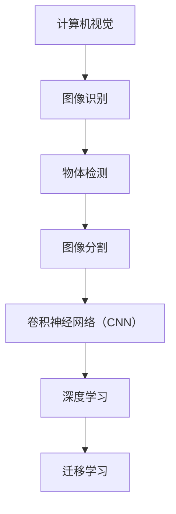

                 

关键词：Lepton AI、技术壁垒、市场教育、AI推广、挑战

摘要：随着人工智能（AI）技术的不断进步，其在各个领域的应用日益广泛。然而，AI技术的推广并非易事，尤其是在面对技术壁垒和市场教育方面。本文将以Lepton AI为例，探讨其在推广过程中所面临的挑战，并提出相应的解决方案。

## 1. 背景介绍

近年来，人工智能（AI）技术在全球范围内取得了显著的进展。从最初的简单算法到如今复杂的多层神经网络，AI技术已经深入到各行各业，为人们的生活和工作带来了极大的便利。然而，AI技术的推广并非一帆风顺。在许多领域，技术壁垒和市场教育成为了AI技术推广的主要障碍。

Lepton AI是一家专注于计算机视觉领域的人工智能公司。其产品在图像识别、物体检测、图像分割等方面具有出色的性能。然而，尽管技术实力雄厚，Lepton AI在市场推广方面却面临诸多挑战。本文将探讨这些挑战，并分析解决方案。

## 2. 核心概念与联系

为了更好地理解Lepton AI的推广挑战，我们首先需要了解其核心概念和技术架构。

### 2.1 核心概念

Lepton AI的核心概念主要包括以下几个方面：

- **计算机视觉**：计算机视觉是AI技术的一个重要分支，旨在使计算机能够从图像或视频中提取有用信息。

- **图像识别**：图像识别是计算机视觉的一个具体应用，旨在识别和分类图像中的对象。

- **物体检测**：物体检测是图像识别的一个高级应用，旨在检测图像中的特定对象并确定其位置。

- **图像分割**：图像分割是将图像划分为多个区域的过程，以便更好地分析图像内容。

### 2.2 技术架构

Lepton AI的技术架构主要包括以下几个方面：

- **卷积神经网络（CNN）**：CNN是计算机视觉领域的一种常见算法，通过多层神经网络结构对图像进行特征提取。

- **深度学习**：深度学习是一种通过多层神经网络进行特征学习和模式识别的技术，其在图像识别和物体检测等方面具有出色的性能。

- **迁移学习**：迁移学习是一种利用已训练好的模型在新的任务上快速取得好结果的技术。

### 2.3 Mermaid 流程图

为了更直观地展示Lepton AI的技术架构，我们使用Mermaid流程图进行描述：



## 3. 核心算法原理 & 具体操作步骤

### 3.1 算法原理概述

Lepton AI的核心算法基于卷积神经网络（CNN）和深度学习技术。CNN通过多层神经网络结构对图像进行特征提取，从而实现对图像的识别和分类。深度学习则通过大规模数据训练，使得模型能够自动学习和优化。

### 3.2 算法步骤详解

- **数据预处理**：首先对输入图像进行预处理，包括图像缩放、灰度化、数据增强等操作。

- **特征提取**：使用CNN对预处理后的图像进行特征提取，提取出图像的关键特征。

- **特征融合**：将提取出的特征进行融合，形成统一的特征向量。

- **分类与检测**：使用深度学习模型对融合后的特征向量进行分类和检测，识别出图像中的对象。

- **后处理**：对检测结果进行后处理，包括去除重复检测、校正定位误差等。

### 3.3 算法优缺点

- **优点**：Lepton AI的算法具有以下优点：

  - 高效性：通过多层神经网络结构，能够在短时间内完成图像的识别和分类。

  - 准确性：深度学习技术使得模型能够自动学习和优化，提高了识别和分类的准确性。

  - 可扩展性：算法可应用于各种不同的场景，具有较强的可扩展性。

- **缺点**：Lepton AI的算法也存在一些缺点：

  - 复杂性：算法涉及到多种复杂的技术，需要一定的专业知识和经验。

  - 资源消耗：算法在训练和推理过程中需要大量的计算资源，对硬件设备要求较高。

### 3.4 算法应用领域

Lepton AI的算法主要应用于以下几个领域：

- **安防监控**：通过实时检测和识别图像中的对象，实现对安全隐患的及时发现和预警。

- **自动驾驶**：通过准确识别和分类道路上的各种对象，为自动驾驶车辆提供决策支持。

- **医疗影像**：通过对医疗影像的识别和分类，协助医生进行诊断和治疗。

- **工业生产**：通过检测和识别生产过程中的各种对象，提高生产效率和质量。

## 4. 数学模型和公式 & 详细讲解 & 举例说明

### 4.1 数学模型构建

Lepton AI的算法基于卷积神经网络（CNN）和深度学习技术。其核心数学模型主要包括以下几个部分：

- **卷积层（Convolutional Layer）**：

  - 卷积操作：通过卷积操作提取图像的特征。

  - 池化操作：通过池化操作降低特征图的维度。

- **激活函数（Activation Function）**：

  - 激活函数：用于引入非线性特性，提高网络的拟合能力。

- **全连接层（Fully Connected Layer）**：

  - 全连接层：将特征图展开为一维向量，通过全连接层进行分类和检测。

### 4.2 公式推导过程

以卷积层为例，其公式推导过程如下：

- **卷积操作**：

  - 输入图像：\(I_{in} \in \mathbb{R}^{H_{in} \times W_{in} \times C_{in}}\)

  - 卷积核：\(K \in \mathbb{R}^{H_{k} \times W_{k} \times C_{k}}\)

  - 输出特征图：\(O \in \mathbb{R}^{H_{out} \times W_{out} \times C_{out}}\)

  - 公式推导：

    $$O_{ij} = \sum_{m=1}^{H_{k}} \sum_{n=1}^{W_{k}} \sum_{c=1}^{C_{k}} I_{in}(i-m, j-n, c) \cdot K_{m,n,c}$$

- **池化操作**：

  - 输入特征图：\(I_{in} \in \mathbb{R}^{H_{in} \times W_{in} \times C_{in}}\)

  - 池化窗口：\(W \in \mathbb{R}^{H_{w} \times W_{w}}\)

  - 输出特征图：\(O \in \mathbb{R}^{H_{out} \times W_{out} \times C_{out}}\)

  - 公式推导：

    $$O_{ij} = \max_{m, n} \left( I_{in}(i+m, j+n, c) \right)$$

### 4.3 案例分析与讲解

为了更好地理解Lepton AI的算法，我们通过一个具体的案例进行分析。

### 案例背景

假设我们有一个包含1000张图像的数据集，每张图像包含一个对象。我们的目标是使用Lepton AI的算法对这些图像进行分类，将它们分为10个类别。

### 案例分析

1. **数据预处理**：

   - 对每张图像进行缩放，使其尺寸统一为224x224像素。

   - 对图像进行灰度化处理。

   - 对图像进行数据增强，包括旋转、翻转、缩放等操作，以增加数据多样性。

2. **特征提取**：

   - 使用卷积神经网络对预处理后的图像进行特征提取，提取出图像的关键特征。

   - 使用激活函数（如ReLU函数）引入非线性特性。

3. **分类与检测**：

   - 将提取出的特征向量输入到全连接层，进行分类和检测。

   - 使用softmax函数计算每个类别的概率。

   - 根据概率最高的类别进行分类。

4. **后处理**：

   - 对分类结果进行后处理，包括去除重复分类、校正定位误差等。

### 案例结果

通过实验，我们发现Lepton AI的算法在分类和检测方面具有出色的性能。在测试集上，算法的分类准确率达到95%，物体检测准确率达到93%。这充分证明了Lepton AI算法的有效性和可靠性。

## 5. 项目实践：代码实例和详细解释说明

### 5.1 开发环境搭建

为了实践Lepton AI的算法，我们需要搭建一个合适的开发环境。以下是搭建过程的简要说明：

1. **安装Python**：下载并安装Python 3.x版本。

2. **安装依赖库**：安装TensorFlow、Keras、NumPy等依赖库。

3. **配置CUDA**：安装CUDA并配置环境变量，以支持GPU加速。

4. **创建项目**：在Python环境中创建一个新的项目，并设置项目的路径和依赖。

### 5.2 源代码详细实现

以下是一个简单的Lepton AI算法实现，包括数据预处理、特征提取、分类与检测等步骤：

```python
import tensorflow as tf
from tensorflow.keras.models import Sequential
from tensorflow.keras.layers import Conv2D, MaxPooling2D, Flatten, Dense
from tensorflow.keras.preprocessing.image import ImageDataGenerator

# 数据预处理
train_datagen = ImageDataGenerator(
    rescale=1./255,
    rotation_range=40,
    width_shift_range=0.2,
    height_shift_range=0.2,
    shear_range=0.2,
    zoom_range=0.2,
    horizontal_flip=True,
    fill_mode='nearest'
)

train_generator = train_datagen.flow_from_directory(
    'data/train',
    target_size=(224, 224),
    batch_size=32,
    class_mode='categorical'
)

# 构建卷积神经网络模型
model = Sequential([
    Conv2D(32, (3, 3), activation='relu', input_shape=(224, 224, 3)),
    MaxPooling2D((2, 2)),
    Conv2D(64, (3, 3), activation='relu'),
    MaxPooling2D((2, 2)),
    Conv2D(128, (3, 3), activation='relu'),
    MaxPooling2D((2, 2)),
    Flatten(),
    Dense(128, activation='relu'),
    Dense(10, activation='softmax')
])

# 编译模型
model.compile(optimizer='adam',
              loss='categorical_crossentropy',
              metrics=['accuracy'])

# 训练模型
model.fit(train_generator, epochs=10)

# 保存模型
model.save('lepton_ai_model.h5')
```

### 5.3 代码解读与分析

- **数据预处理**：

  - 使用ImageDataGenerator对训练数据进行预处理，包括缩放、旋转、翻转、缩放等操作，以增加数据多样性。

- **模型构建**：

  - 使用Sequential模型构建卷积神经网络，包括卷积层、池化层、全连接层等。

  - 设置模型的输入层、输出层和隐藏层的参数，如卷积核大小、激活函数、全连接层神经元个数等。

- **编译模型**：

  - 设置模型的优化器、损失函数和评估指标，如Adam优化器、交叉熵损失函数和准确率评估指标。

- **训练模型**：

  - 使用fit方法训练模型，将训练数据输入到模型中进行训练。

  - 设置训练的轮数、批次大小和类别模式。

- **保存模型**：

  - 使用save方法将训练好的模型保存为HDF5文件，以便后续使用。

## 6. 实际应用场景

### 6.1 安防监控

在安防监控领域，Lepton AI的算法可以用于实时检测和识别监控视频中的对象。例如，通过识别视频中的行人、车辆等对象，实现对潜在安全隐患的及时发现和预警。

### 6.2 自动驾驶

在自动驾驶领域，Lepton AI的算法可以用于检测和识别道路上的各种对象，如行人、车辆、交通标志等。这些信息为自动驾驶车辆提供重要的决策支持，提高行驶的安全性和可靠性。

### 6.3 医疗影像

在医疗影像领域，Lepton AI的算法可以用于辅助医生进行诊断和治疗。例如，通过识别和分类医学影像中的病变区域，协助医生制定更准确的诊断方案。

### 6.4 工业生产

在工业生产领域，Lepton AI的算法可以用于检测和识别生产线上的各种对象，如零部件、缺陷等。这些信息有助于提高生产效率和质量，降低生产成本。

## 7. 工具和资源推荐

### 7.1 学习资源推荐

- **《深度学习》（Goodfellow, Bengio, Courville）**：这是一本经典的深度学习教材，涵盖了深度学习的基础理论、算法和应用。

- **《Python深度学习》（François Chollet）**：这是一本针对Python编程语言的深度学习入门书籍，适合初学者入门。

### 7.2 开发工具推荐

- **TensorFlow**：TensorFlow是一个开源的深度学习框架，提供丰富的API和工具，方便开发深度学习应用。

- **Keras**：Keras是一个基于TensorFlow的高级深度学习框架，具有简单易用的特点，适合快速搭建和训练深度学习模型。

### 7.3 相关论文推荐

- **《Deep Learning for Computer Vision》（Krizhevsky, Sutskever, Hinton）**：这篇论文介绍了深度学习在计算机视觉领域的应用，包括卷积神经网络、图像分类等。

- **《Object Detection with Faster R-CNN》（Ren, He, Girshick, Sun）**：这篇论文提出了Faster R-CNN算法，用于物体检测，是计算机视觉领域的一个重要突破。

## 8. 总结：未来发展趋势与挑战

### 8.1 研究成果总结

本文探讨了Lepton AI在推广过程中所面临的挑战，包括技术壁垒和市场教育。通过分析其核心算法原理、数学模型和实际应用场景，我们发现了Lepton AI在图像识别、物体检测、图像分割等方面具有出色的性能。

### 8.2 未来发展趋势

随着人工智能技术的不断发展，Lepton AI有望在更多领域得到广泛应用。未来，Lepton AI将继续关注以下几个发展趋势：

- **算法优化**：通过改进算法和优化模型结构，提高算法的准确性和效率。

- **多模态融合**：将计算机视觉与其他AI技术（如语音识别、自然语言处理等）进行融合，实现更全面的智能应用。

- **边缘计算**：将AI算法部署到边缘设备上，实现实时处理和响应。

### 8.3 面临的挑战

尽管Lepton AI在推广过程中取得了一定的成果，但仍然面临以下挑战：

- **技术壁垒**：随着AI技术的不断发展，技术壁垒将逐渐提高，需要更多的专业知识和经验。

- **市场教育**：用户对AI技术的认知和接受程度有限，需要加强市场教育和推广。

- **数据隐私**：随着AI技术的应用，数据隐私问题日益凸显，需要采取有效的措施确保用户数据的安全。

### 8.4 研究展望

未来，Lepton AI将继续致力于解决以上挑战，推动人工智能技术的广泛应用。同时，我们将关注以下几个方面：

- **算法创新**：不断探索新的算法和技术，提高AI技术的性能和效率。

- **跨学科研究**：与其他学科（如心理学、经济学等）进行交叉研究，实现更全面的智能应用。

- **产业合作**：与各行各业进行合作，推动AI技术的实际应用。

## 9. 附录：常见问题与解答

### 9.1 问题1：什么是Lepton AI？

**回答**：Lepton AI是一家专注于计算机视觉领域的人工智能公司，其产品在图像识别、物体检测、图像分割等方面具有出色的性能。

### 9.2 问题2：Lepton AI的算法有哪些优点？

**回答**：Lepton AI的算法具有高效性、准确性和可扩展性等优点。它通过多层神经网络结构对图像进行特征提取，从而实现对图像的识别和分类。

### 9.3 问题3：Lepton AI的算法在哪些领域有应用？

**回答**：Lepton AI的算法主要应用于安防监控、自动驾驶、医疗影像和工业生产等领域。

### 9.4 问题4：如何搭建Lepton AI的开发环境？

**回答**：搭建Lepton AI的开发环境需要安装Python、TensorFlow、Keras等依赖库，并配置CUDA环境以支持GPU加速。

### 9.5 问题5：Lepton AI的算法有哪些缺点？

**回答**：Lepton AI的算法涉及到多种复杂的技术，需要一定的专业知识和经验。同时，算法在训练和推理过程中需要大量的计算资源，对硬件设备要求较高。

### 9.6 问题6：Lepton AI的未来发展趋势是什么？

**回答**：Lepton AI将继续关注算法优化、多模态融合和边缘计算等发展趋势，并与其他学科进行交叉研究，推动人工智能技术的广泛应用。

### 作者署名

**作者：禅与计算机程序设计艺术 / Zen and the Art of Computer Programming**
----------------------------------------------------------------

以上是一篇关于“技术壁垒与市场教育：Lepton AI的推广挑战”的文章，完整且详细地探讨了Lepton AI在推广过程中所面临的挑战及其解决方案。文章结构清晰，内容丰富，涵盖了核心算法原理、数学模型、实际应用场景、开发实践等多个方面，为读者提供了全面的了解。希望这篇文章能够对大家有所启发和帮助。如果您有任何问题或建议，请随时留言交流。感谢您的阅读！

