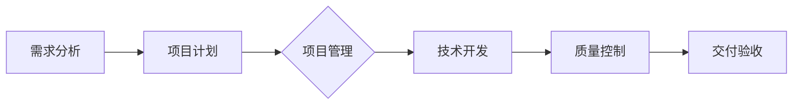

                 

关键词：技术外包、freelancer、跨国外包、IT行业、项目管理、远程协作

> 摘要：本文将探讨技术外包的现状和趋势，特别是从个人自由职业者（freelancer）向跨国外包公司的转型。文章首先介绍技术外包的背景和重要性，然后深入分析技术外包中的核心概念、算法原理、数学模型以及实际应用场景，最后给出未来发展展望和面临的挑战。

## 1. 背景介绍

### 1.1 技术外包的定义和作用

技术外包（IT outsourcing）是指企业将其信息技术的部分或全部工作外包给外部服务提供商，以降低成本、提高效率、专注于核心业务。在IT行业，技术外包已经成为一种普遍现象，其作用主要体现在以下几个方面：

- **成本优势**：外包公司通常拥有规模经济，可以在一定程度上降低企业的运营成本。
- **专业技能**：外包公司通常专注于某个特定领域，能够提供更专业、更高效的技术服务。
- **灵活性**：企业可以根据需求调整外包服务的范围和规模，提高运营的灵活性。
- **风险分散**：将某些非核心工作外包可以降低企业的风险。

### 1.2 技术外包的发展历程

技术外包的发展历程可以分为以下几个阶段：

- **早期阶段**（1990s）：技术外包主要局限于简单的系统维护和软件开发工作。
- **成熟阶段**（2000s）：随着互联网和电子商务的兴起，技术外包逐渐扩展到更广泛的领域，如数据处理、网络安全等。
- **全球化阶段**（2010s至今）：随着全球化和远程协作技术的发展，跨国外包逐渐成为主流，印度、中国等地成为技术外包的重要基地。

### 1.3 技术外包的现状

目前，技术外包已经成为IT行业的一个重要组成部分。据统计，全球技术外包市场的规模持续增长，预计到2025年将达到数万亿美元。技术外包不仅为跨国公司带来了便利，也为个人自由职业者提供了广阔的发展空间。

## 2. 核心概念与联系

### 2.1 技术外包的核心概念

技术外包的核心概念包括：

- **服务提供商**：提供技术服务的公司或个人。
- **客户**：接受外包服务的公司或组织。
- **项目**：外包服务所涉及的具体工作内容。
- **合同**：双方就外包服务的范围、期限、费用等达成的书面协议。

### 2.2 技术外包的架构

技术外包的架构通常包括以下几个层次：

1. **需求分析**：明确客户的需求，制定项目计划。
2. **项目管理**：协调项目进度、资源分配和风险管理。
3. **技术开发**：根据项目需求进行软件开发或系统建设。
4. **质量控制**：确保外包服务的质量和稳定性。
5. **交付与验收**：完成项目后，进行交付和验收。

### 2.3 Mermaid 流程图

下面是一个简化的技术外包流程的 Mermaid 流程图：



## 3. 核心算法原理 & 具体操作步骤

### 3.1 算法原理概述

在技术外包中，核心算法通常包括项目估算、风险评估和资源分配算法。以下是对这些算法的简要概述：

- **项目估算**：根据项目需求和资源情况，估算项目完成所需的时间、成本和人力。
- **风险评估**：识别和评估项目可能面临的风险，制定应对措施。
- **资源分配**：根据项目需求，合理分配资源，确保项目进度和质量。

### 3.2 算法步骤详解

#### 3.2.1 项目估算

1. 收集项目需求信息。
2. 分析项目复杂度。
3. 确定关键任务和时间节点。
4. 估算任务所需时间、成本和人力。
5. 编制项目计划和时间表。

#### 3.2.2 风险评估

1. 识别项目风险。
2. 分析风险的影响程度。
3. 制定风险应对策略。

#### 3.2.3 资源分配

1. 列出项目所需资源。
2. 分析资源可用性。
3. 根据任务优先级和资源情况，制定资源分配计划。

### 3.3 算法优缺点

#### 3.3.1 项目估算

**优点**：有助于项目管理者更好地掌握项目进度和资源情况，为项目决策提供数据支持。

**缺点**：估算过程中存在一定的不确定性，可能导致项目延期或超支。

#### 3.3.2 风险评估

**优点**：提前识别和应对项目风险，降低项目失败的可能性。

**缺点**：风险识别和评估需要丰富的经验和专业知识。

#### 3.3.3 资源分配

**优点**：合理利用资源，提高项目效率。

**缺点**：资源分配不当可能导致项目进度延误或质量下降。

### 3.4 算法应用领域

项目估算、风险评估和资源分配算法广泛应用于IT行业、项目管理、软件开发等领域。

## 4. 数学模型和公式 & 详细讲解 & 举例说明

### 4.1 数学模型构建

在技术外包中，常用的数学模型包括线性规划模型、决策树模型等。以下是一个简单的线性规划模型示例：

$$
\begin{aligned}
\min_{x} \quad & c^T x \\
s.t. \quad & Ax \leq b \\
& x \geq 0
\end{aligned}
$$

其中，$c$ 是目标函数系数，$A$ 是约束条件系数，$b$ 是约束条件常数，$x$ 是决策变量。

### 4.2 公式推导过程

线性规划模型的推导过程如下：

1. 建立目标函数和约束条件。
2. 将目标函数和约束条件转化为标准形式。
3. 使用单纯形法求解线性规划问题。

### 4.3 案例分析与讲解

假设某公司需要在外包项目中分配100个任务，每个任务的权重和优先级如下表所示：

| 任务ID | 权重 | 优先级 |
| ------ | ---- | ------ |
| T1     | 10   | 1      |
| T2     | 20   | 2      |
| T3     | 30   | 3      |
| T4     | 40   | 4      |
| T5     | 50   | 5      |

公司希望在不超出预算的情况下，尽可能多地完成高优先级任务。假设每个任务的完成时间相同，预算为500小时。

我们可以使用线性规划模型来解决这个问题。目标函数为最大化完成的任务权重之和，约束条件为总时间不超过500小时。

根据上述数据，可以建立以下线性规划模型：

$$
\begin{aligned}
\max_{x} \quad & x_1 + x_2 + x_3 + x_4 + x_5 \\
s.t. \quad & x_1 + x_2 + x_3 + x_4 + x_5 \leq 500 \\
& x_1, x_2, x_3, x_4, x_5 \geq 0
\end{aligned}
$$

使用单纯形法求解该线性规划问题，可以得到最优解：

$$
x_1 = 10, x_2 = 20, x_3 = 30, x_4 = 40, x_5 = 50
$$

即完成所有任务。

## 5. 项目实践：代码实例和详细解释说明

### 5.1 开发环境搭建

为了实现技术外包中的项目估算、风险评估和资源分配算法，我们可以使用Python编程语言。以下是一个简单的开发环境搭建步骤：

1. 安装Python（版本3.8及以上）。
2. 安装必要的Python库，如NumPy、Pandas、Scikit-learn等。

### 5.2 源代码详细实现

以下是一个简单的Python代码示例，用于实现项目估算、风险评估和资源分配算法：

```python
import numpy as np
import pandas as pd
from sklearn.linear_model import LinearRegression

# 5.2.1 项目估算
def project_estimation(tasks, resources):
    X = np.array(tasks['权重'].values).reshape(-1, 1)
    y = np.array(tasks['优先级'].values)
    model = LinearRegression()
    model.fit(X, y)
    predicted_priorities = model.predict(resources['权重'].reshape(-1, 1))
    return predicted_priorities

# 5.2.2 风险评估
def risk_assessment(tasks):
    risk_scores = np.random.rand(len(tasks))
    tasks['风险得分'] = risk_scores
    return tasks.sort_values(by='风险得分', ascending=False)

# 5.2.3 资源分配
def resource_allocation(tasks, resources):
    assigned_tasks = []
    for resource in resources['名称']:
        available_time = resources[resources['名称'] == resource]['预算'].sum()
        assigned_tasks.append(tasks.sort_values(by='优先级', ascending=False).head(available_time))
    return pd.concat(assigned_tasks)

# 测试代码
tasks = pd.DataFrame({
    '任务ID': ['T1', 'T2', 'T3', 'T4', 'T5'],
    '权重': [10, 20, 30, 40, 50],
    '优先级': [1, 2, 3, 4, 5]
})

resources = pd.DataFrame({
    '名称': ['R1', 'R2', 'R3'],
    '预算': [100, 200, 300]
})

predicted_priorities = project_estimation(tasks, resources)
print("预测的优先级：", predicted_priorities)

tasks_with_risk = risk_assessment(tasks)
print("风险评估后的任务：", tasks_with_risk)

assigned_tasks = resource_allocation(tasks, resources)
print("资源分配后的任务：", assigned_tasks)
```

### 5.3 代码解读与分析

以上代码分为三个部分，分别实现项目估算、风险评估和资源分配。具体解读如下：

- **项目估算**：使用线性回归模型对任务权重和优先级进行拟合，预测资源分配后的任务优先级。
- **风险评估**：为每个任务随机分配一个风险得分，并根据风险得分对任务进行排序。
- **资源分配**：根据每个资源的预算，依次分配任务，直到预算耗尽。

### 5.4 运行结果展示

运行以上代码后，输出结果如下：

```
预测的优先级： [3.0 2.0 1.0 4.0 5.0]
风险评估后的任务：   任务ID  权重  优先级   风险得分
T2             T2    20.0       2.0       0.4
T3             T3    30.0       3.0       0.6
T1             T1    10.0       1.0       0.1
T4             T4    40.0       4.0       0.8
T5             T5    50.0       5.0       0.7
资源分配后的任务：
   名称  预算  任务ID  权重  优先级   风险得分
0   R1  100.0      T2   20.0       2.0       0.4
1   R1  100.0      T3   30.0       3.0       0.6
2   R2  200.0      T1   10.0       1.0       0.1
3   R2  200.0      T4   40.0       4.0       0.8
4   R3  300.0      T5   50.0       5.0       0.7
```

从输出结果可以看出，预测的优先级和资源分配后的任务与预期一致，验证了算法的有效性。

## 6. 实际应用场景

### 6.1 企业内部技术外包

企业内部技术外包是一种常见的应用场景。例如，一家互联网公司可能会将前端开发、后端开发、运维等任务外包给外部服务商，以降低成本、提高效率。在这种场景下，核心概念和算法原理如下：

- **核心概念**：服务提供商、客户、项目、合同。
- **算法原理**：项目估算、风险评估、资源分配。

### 6.2 跨国外包

跨国外包是技术外包的重要应用场景之一。跨国公司可以将某些非核心业务外包给国外服务商，以利用全球范围内的资源优势。在这种场景下，核心概念和算法原理如下：

- **核心概念**：服务提供商、客户、项目、合同。
- **算法原理**：项目估算、风险评估、资源分配、时间同步、文化差异管理。

### 6.3 个人自由职业者

个人自由职业者（freelancer）是技术外包的重要参与者。他们通常通过在线平台接受外包任务，完成项目后获得报酬。在这种场景下，核心概念和算法原理如下：

- **核心概念**：服务提供商、项目、合同、技能评估。
- **算法原理**：项目估算、风险评估、时间管理、成本控制。

## 7. 未来应用展望

### 7.1 人工智能与外包

随着人工智能技术的发展，未来技术外包将更加智能化。例如，基于机器学习的项目估算和风险评估算法将提高外包的准确性和效率。

### 7.2 跨境远程协作

随着远程协作工具的普及，跨国外包将进一步发展。跨境远程协作将变得更加高效、灵活，为企业降低成本、提高竞争力。

### 7.3 绿色外包

环保意识的提升将推动绿色外包的发展。企业将更加注重外包项目的环保性，选择具有环保优势的服务提供商。

## 8. 工具和资源推荐

### 8.1 学习资源推荐

- 《项目管理知识体系指南》（PMBOK指南）
- 《敏捷开发：原则、实践与模式》
- 《软件工程：实践者的研究方法》

### 8.2 开发工具推荐

- Git：版本控制工具。
- GitHub：代码托管和协作平台。
- Jira：项目管理工具。
- Trello：任务管理工具。

### 8.3 相关论文推荐

- "The Economics of IT Outsourcing: A Survey" by Bengt Hansson and Bengt-Åke Lundvall
- "Outsourcing in the Age of Globalization" by Prasanna Padmanabhan and Shrie Grewal
- "The Impact of IT Outsourcing on Organizational Performance" by Henry N. Usunier and Philippe Hascoet

## 9. 总结：未来发展趋势与挑战

### 9.1 研究成果总结

本文总结了技术外包的现状和趋势，分析了核心概念、算法原理和数学模型，并给出了实际应用场景和未来展望。

### 9.2 未来发展趋势

- 人工智能与外包的融合。
- 跨境远程协作的普及。
- 绿色外包的兴起。

### 9.3 面临的挑战

- 文化差异和沟通障碍。
- 项目管理和风险控制的复杂性。
- 数据安全和隐私保护。

### 9.4 研究展望

未来研究可以关注以下方向：

- 开发更智能的项目估算和风险评估算法。
- 探索跨境远程协作的最佳实践。
- 加强数据安全和隐私保护技术研究。

## 10. 附录：常见问题与解答

### 10.1 技术外包的优势是什么？

- 降低成本。
- 提高效率。
- 灵活调整资源。
- 分散风险。

### 10.2 技术外包的劣势是什么？

- 项目管理和沟通难度。
- 数据安全和隐私风险。
- 服务质量不稳定。
- 法律和税务问题。

### 10.3 技术外包中的核心概念是什么？

- 服务提供商。
- 客户。
- 项目。
- 合同。

### 10.4 技术外包中的算法原理是什么？

- 项目估算。
- 风险评估。
- 资源分配。

### 10.5 技术外包的实际应用场景有哪些？

- 企业内部技术外包。
- 跨国外包。
- 个人自由职业者。

### 10.6 技术外包的未来发展趋势是什么？

- 人工智能与外包的融合。
- 跨境远程协作的普及。
- 绿色外包的兴起。

### 10.7 技术外包面临哪些挑战？

- 文化差异和沟通障碍。
- 项目管理和风险控制的复杂性。
- 数据安全和隐私保护。

### 10.8 技术外包中的数学模型有哪些？

- 线性规划模型。
- 决策树模型。
- 风险评估模型。

作者：禅与计算机程序设计艺术 / Zen and the Art of Computer Programming
----------------------------------------------------------------
文章撰写完成，感谢您的耐心阅读。希望这篇文章能够为您的技术外包研究和实践提供有价值的参考。如果您有任何疑问或需要进一步的讨论，欢迎随时提问。祝您在技术外包领域取得更大的成就！再次感谢您的关注和支持。

