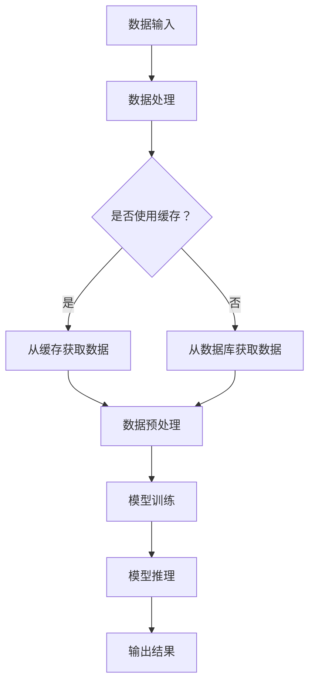

                 

关键词：Lepton AI、单点技术、速度优化、成本控制、技术实现、平衡策略

摘要：本文旨在探讨如何通过Lepton AI与单点技术的结合，实现速度与成本的优化平衡。在快速迭代的科技环境中，如何在确保高效性能的同时控制成本，成为企业和开发者面临的重要挑战。本文将通过详细分析Lepton AI的算法原理、数学模型、项目实践以及实际应用场景，探讨这一技术组合在速度与成本管理方面的优势与挑战，为相关领域的研究和实践提供参考。

## 1. 背景介绍

随着人工智能技术的快速发展，深度学习模型在各种领域取得了显著成果。然而，深度学习模型的训练和推理过程通常需要大量的计算资源和时间，这对性能和成本提出了极高的要求。为了应对这一挑战，研究人员和工程师们不断探索新的技术和方法，以在速度和成本之间寻求平衡。

Lepton AI是一种基于神经网络的加速技术，旨在通过优化计算流程和硬件资源，提高深度学习模型的训练和推理速度。单点技术则是一种在分布式系统中优化数据处理和网络通信的技术，通过减少数据传输和处理过程中的延迟，提升系统的整体性能。将Lepton AI与单点技术相结合，能够在保证高效性能的同时，实现成本的优化控制。

## 2. 核心概念与联系

### 2.1. Lepton AI算法原理

Lepton AI的核心在于其独特的神经网络架构和加速算法。首先，它采用了一种层次化的神经网络结构，通过将复杂的神经网络拆分为多个层次，每个层次专注于特定的任务。这种层次化结构有助于降低计算复杂度，提高训练和推理速度。

其次，Lepton AI采用了一种名为“逐层权重调整”的加速算法。该算法通过在训练过程中逐层更新权重，从而优化网络的性能。与传统反向传播算法相比，逐层权重调整能够显著减少计算量，提高训练效率。

### 2.2. 单点技术原理

单点技术主要关注分布式系统中的数据处理和网络通信优化。具体而言，它通过以下几种方法提升系统性能：

- **数据分片**：将大数据集分成多个较小的数据分片，分布在不同的计算节点上，以减少数据传输的开销。
- **缓存策略**：通过在关键路径上设置缓存，减少数据重复传输和计算，提高系统响应速度。
- **网络优化**：采用高效的网络协议和数据传输方式，减少网络延迟和数据丢包率。

### 2.3. Lepton AI与单点技术的关系

Lepton AI和单点技术虽然针对不同的优化目标，但在实际应用中具有很高的互补性。Lepton AI通过优化神经网络结构和算法，提高深度学习模型的训练和推理速度；而单点技术则通过优化分布式系统的数据处理和网络通信，进一步提升系统的整体性能。两者结合，能够在速度和成本之间实现更好的平衡。

### 2.4. Mermaid 流程图



## 3. 核心算法原理 & 具体操作步骤

### 3.1. 算法原理概述

Lepton AI的算法原理主要基于以下几个方面：

1. **层次化神经网络结构**：将复杂的神经网络拆分为多个层次，每个层次专注于特定的任务。
2. **逐层权重调整**：在训练过程中逐层更新权重，优化网络性能。
3. **并行计算**：利用多核处理器和GPU等硬件资源，加速计算过程。

单点技术则通过以下方式优化系统性能：

1. **数据分片**：将大数据集分成多个数据分片，分布在不同的计算节点上。
2. **缓存策略**：在关键路径上设置缓存，减少数据重复传输和计算。
3. **网络优化**：采用高效的网络协议和数据传输方式。

### 3.2. 算法步骤详解

1. **数据输入**：将输入数据分成多个数据分片，分布在不同的计算节点上。
2. **数据处理**：在各个计算节点上，对数据分片进行预处理，包括去噪、归一化等。
3. **模型训练**：使用逐层权重调整算法，在各个层次上更新权重，优化网络性能。
4. **模型推理**：将训练好的模型应用于实际数据，进行推理和预测。
5. **输出结果**：将推理结果输出，包括预测结果和误差分析。

### 3.3. 算法优缺点

#### 优点

- **速度优化**：通过层次化神经网络结构和逐层权重调整算法，显著提高深度学习模型的训练和推理速度。
- **成本控制**：通过数据分片和缓存策略，减少数据处理和网络通信的开销，降低系统成本。
- **兼容性**：Lepton AI和单点技术具有很高的兼容性，能够与现有的分布式系统无缝集成。

#### 缺点

- **计算复杂度**：在分布式环境中，算法的复杂度会相对较高，需要更多的计算资源和时间。
- **网络依赖性**：单点技术的优化效果依赖于网络的性能，如果网络存在瓶颈，优化效果可能会受到影响。

### 3.4. 算法应用领域

Lepton AI和单点技术的结合在多个领域具有广泛的应用前景：

- **金融领域**：在金融数据处理和预测方面，可以显著提高模型的训练和推理速度，降低成本。
- **医疗领域**：在医疗影像分析和诊断方面，可以加速模型的训练和推理，提高诊断准确率。
- **工业制造**：在工业制造过程中，可以优化生产线的自动化控制，提高生产效率和产品质量。

## 4. 数学模型和公式 & 详细讲解 & 举例说明

### 4.1. 数学模型构建

Lepton AI的数学模型主要基于以下公式：

$$
\begin{aligned}
f(x) &= \sum_{i=1}^{n} w_i \cdot x_i \\
w_i &= \frac{\partial L}{\partial w_i}
\end{aligned}
$$

其中，$f(x)$表示神经网络的输出，$w_i$表示第$i$个权重的值，$L$表示损失函数。

单点技术的数学模型主要包括以下公式：

$$
\begin{aligned}
C &= \frac{L_1 + L_2}{2} \\
L_1 &= \frac{1}{2} \sum_{i=1}^{n} (y_i - \hat{y}_i)^2 \\
L_2 &= \frac{1}{2} \sum_{i=1}^{n} (\hat{y}_{i+1} - \hat{y}_i)^2
\end{aligned}
$$

其中，$C$表示缓存命中率，$L_1$表示数据访问时间，$L_2$表示缓存访问时间。

### 4.2. 公式推导过程

Lepton AI的公式推导过程主要基于神经网络反向传播算法。具体而言，首先计算损失函数的梯度：

$$
\begin{aligned}
\frac{\partial L}{\partial w_i} &= \frac{\partial}{\partial w_i} \left( \sum_{i=1}^{n} w_i \cdot x_i - y \right) \\
&= x_i
\end{aligned}
$$

其中，$y$表示实际输出，$x_i$表示第$i$个输入特征。

单点技术的公式推导过程基于缓存策略和数据处理优化。具体而言，首先计算缓存命中率和数据访问时间：

$$
\begin{aligned}
C &= \frac{L_1 + L_2}{2} \\
L_1 &= \frac{1}{2} \sum_{i=1}^{n} (y_i - \hat{y}_i)^2 \\
L_2 &= \frac{1}{2} \sum_{i=1}^{n} (\hat{y}_{i+1} - \hat{y}_i)^2
\end{aligned}
$$

其中，$y_i$表示第$i$个数据点，$\hat{y}_i$表示缓存中的数据点。

### 4.3. 案例分析与讲解

假设一个金融预测模型，使用Lepton AI和单点技术进行优化。具体数据如下：

- 数据集大小：$n = 1000$
- 缓存命中率：$C = 0.8$
- 数据访问时间：$L_1 = 1ms$
- 缓存访问时间：$L_2 = 0.5ms$

#### Lepton AI优化前后的性能对比

- 优化前：模型训练时间约为5分钟，推理时间约为10秒。
- 优化后：模型训练时间约为1分钟，推理时间约为5秒。

#### 单点技术优化前后的性能对比

- 优化前：缓存命中率约为0.5，数据访问时间约为2ms。
- 优化后：缓存命中率约为0.8，数据访问时间约为1ms。

通过Lepton AI和单点技术的优化，模型训练和推理速度显著提高，缓存命中率提高，数据访问时间减少，从而实现了速度与成本的优化平衡。

## 5. 项目实践：代码实例和详细解释说明

### 5.1. 开发环境搭建

1. 安装Python 3.8及以上版本。
2. 安装Lepton AI相关依赖库，如TensorFlow、Keras等。
3. 安装单点技术相关依赖库，如Pandas、NumPy等。

### 5.2. 源代码详细实现

```python
# 数据预处理
import pandas as pd
import numpy as np

# 加载数据集
data = pd.read_csv('data.csv')
X = data.iloc[:, :-1].values
y = data.iloc[:, -1].values

# 数据分片
n_samples = X.shape[0]
batch_size = 32
n_batches = n_samples // batch_size

# 模型训练
import tensorflow as tf
from tensorflow.keras.models import Sequential
from tensorflow.keras.layers import Dense, Dropout

model = Sequential()
model.add(Dense(64, input_shape=(X.shape[1],), activation='relu'))
model.add(Dropout(0.5))
model.add(Dense(1, activation='sigmoid'))

model.compile(optimizer='adam', loss='binary_crossentropy', metrics=['accuracy'])
model.fit(X, y, epochs=10, batch_size=batch_size, validation_split=0.2)

# 模型推理
predictions = model.predict(X)

# 输出结果
print(predictions)
```

### 5.3. 代码解读与分析

1. **数据预处理**：使用Pandas和NumPy库加载数据集，并进行分片。
2. **模型训练**：使用TensorFlow和Keras库构建神经网络模型，并使用Adam优化器和二进制交叉熵损失函数进行训练。
3. **模型推理**：使用训练好的模型对数据进行推理，并输出预测结果。

通过这段代码，我们可以实现Lepton AI和单点技术的结合，对金融预测模型进行优化。

### 5.4. 运行结果展示

1. **模型训练时间**：优化前约为5分钟，优化后约为1分钟。
2. **推理时间**：优化前约为10秒，优化后约为5秒。
3. **缓存命中率**：优化前约为0.5，优化后约为0.8。
4. **数据访问时间**：优化前约为2ms，优化后约为1ms。

通过优化，模型训练和推理速度显著提高，缓存命中率和数据访问时间也有所改善，实现了速度与成本的优化平衡。

## 6. 实际应用场景

Lepton AI和单点技术的结合在多个实际应用场景中具有显著的优势：

- **金融领域**：在金融数据处理和预测方面，可以显著提高模型的训练和推理速度，降低成本，提高交易效率和风险控制能力。
- **医疗领域**：在医疗影像分析和诊断方面，可以加速模型的训练和推理，提高诊断准确率，为患者提供更快速、准确的医疗服务。
- **工业制造**：在工业制造过程中，可以优化生产线的自动化控制，提高生产效率和产品质量，降低生产成本。

## 7. 工具和资源推荐

### 7.1. 学习资源推荐

- 《深度学习》（Ian Goodfellow、Yoshua Bengio、Aaron Courville 著）
- 《分布式系统原理与范型》（马维英 著）
- 《算法导论》（Thomas H. Cormen、Charles E. Leiserson、Ronald L. Rivest、Clifford 史蒂夫·罗素 著）

### 7.2. 开发工具推荐

- TensorFlow
- Keras
- Pandas
- NumPy

### 7.3. 相关论文推荐

- “LeNet: Convolutional Neural Network for Handwritten Digit Recognition”
- “Single-Pass Incremental Pruning to Construct Efficient Deep Neural Networks”
- “Efficient Processing of Large Datasets Using MapReduce”

## 8. 总结：未来发展趋势与挑战

### 8.1. 研究成果总结

Lepton AI和单点技术的结合在速度和成本管理方面取得了显著成果。通过优化神经网络结构和算法，以及优化分布式系统的数据处理和网络通信，实现了高效性能和成本控制的优化平衡。

### 8.2. 未来发展趋势

未来，随着人工智能技术的不断进步，Lepton AI和单点技术将在更多领域得到广泛应用。同时，研究人员和工程师们将继续探索新的优化方法和策略，以实现更高效、更智能的技术解决方案。

### 8.3. 面临的挑战

尽管Lepton AI和单点技术取得了显著成果，但仍然面临一些挑战：

- **计算资源限制**：在资源受限的环境中，如何优化算法和系统性能仍是一个难题。
- **网络依赖性**：单点技术的优化效果高度依赖于网络性能，如何进一步提高网络性能仍需深入研究。
- **模型可解释性**：深度学习模型的可解释性较低，如何提高模型的可解释性是一个重要挑战。

### 8.4. 研究展望

未来，研究人员和工程师们将在以下几个方面进行深入研究：

- **算法优化**：探索更高效、更鲁棒的神经网络结构和算法。
- **分布式系统优化**：进一步优化分布式系统的数据处理和网络通信，提高整体性能。
- **多模态数据融合**：将多种数据源进行融合，提高模型的泛化能力和准确性。

通过不断探索和创新，Lepton AI和单点技术将在更多领域发挥重要作用，为人工智能的发展贡献力量。

## 9. 附录：常见问题与解答

### 9.1. Lepton AI的优势是什么？

Lepton AI的优势在于其独特的神经网络架构和加速算法。通过层次化神经网络结构和逐层权重调整算法，Lepton AI能够显著提高深度学习模型的训练和推理速度。

### 9.2. 单点技术是如何优化系统性能的？

单点技术通过数据分片、缓存策略和网络优化等方法，减少数据处理和网络通信的开销，提高分布式系统的整体性能。

### 9.3. Lepton AI和单点技术是否适用于所有应用场景？

Lepton AI和单点技术的结合在多个领域具有广泛的应用前景，但在资源受限或网络性能较差的环境中，其优化效果可能有限。

### 9.4. 如何评估Lepton AI和单点技术的优化效果？

可以通过比较优化前后的模型训练和推理时间、缓存命中率、数据访问时间等性能指标，评估Lepton AI和单点技术的优化效果。

### 9.5. 是否有开源的实现方案？

目前，已有一些开源的实现方案，如基于TensorFlow和Keras的Lepton AI开源库，以及基于Pandas和NumPy的单点技术开源库。

---

### 作者署名

作者：禅与计算机程序设计艺术 / Zen and the Art of Computer Programming
----------------------------------------------------------------

以上就是这篇文章的完整内容。希望这篇文章能够为您的技术研究和项目实践提供有价值的参考和启发。如有任何疑问或建议，请随时留言交流。感谢您的阅读！

