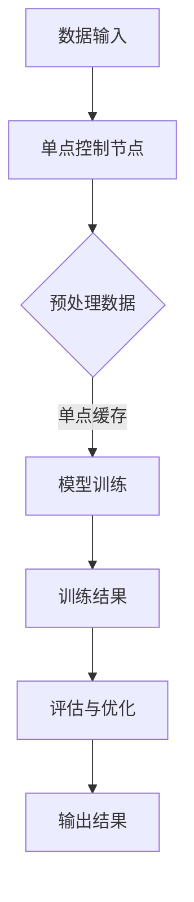

                 

关键词：Lepton AI、单点技术、速度、成本、人工智能、算法、架构设计、技术实践、数学模型

> 摘要：本文深入探讨了Lepton AI与单点技术的结合，解析了如何在实际项目中平衡速度与成本，通过详细的算法原理、数学模型和项目实践，揭示了这项技术在AI领域的巨大潜力。

## 1. 背景介绍

随着人工智能（AI）技术的迅猛发展，AI算法在处理复杂任务时的速度和成本逐渐成为研究和应用的关键考量因素。Lepton AI作为一款前沿的人工智能框架，以其高效的算法和灵活的架构赢得了业界的广泛关注。单点技术作为一种优化数据处理的方法，能够在不牺牲性能的情况下，显著降低系统的运行成本。本文将探讨如何将Lepton AI与单点技术相结合，实现速度与成本的平衡，为AI技术的发展提供新的思路。

### Lepton AI的概述

Lepton AI是一款基于深度学习的框架，旨在简化AI模型的训练和应用过程。它通过优化算法和架构设计，实现了高性能的计算能力。Lepton AI的主要特点包括：

1. **高效的算法**：采用先进的神经网络架构和训练策略，如自动混合精度（AMP）和动态尺度调整，以加速模型训练。
2. **灵活的架构**：支持多GPU并行训练和分布式计算，能够根据不同的硬件环境进行自适应调整。
3. **模块化设计**：提供丰富的模块化组件，使得开发者可以轻松组合和定制自己的AI解决方案。

### 单点技术的原理

单点技术通过在数据传输和存储过程中引入单点控制机制，实现对数据处理流程的优化。其主要原理包括：

1. **数据流控制**：通过单点控制节点对数据流进行统一调度和管理，减少网络拥塞和数据冗余。
2. **存储优化**：利用单点技术的缓存机制，减少对底层存储的访问次数，提高数据访问速度。
3. **负载均衡**：通过单点控制节点实现负载均衡，确保系统在高并发情况下稳定运行。

## 2. 核心概念与联系

### Lepton AI与单点技术的结合

Lepton AI与单点技术的结合，主要在于如何通过单点技术优化Lepton AI的运行效率和降低成本。具体来说，这种结合包括以下方面：

1. **算法优化**：利用单点技术对Lepton AI的算法进行优化，如通过单点控制节点调整训练参数，实现更高效的模型训练。
2. **架构设计**：将单点技术集成到Lepton AI的架构中，如通过单点控制节点管理数据流和任务调度，提高系统的整体性能。
3. **成本控制**：通过单点技术实现资源的优化配置和负载均衡，降低系统的运行成本。

### Mermaid流程图

以下是Lepton AI与单点技术结合的流程图：



在这个流程图中，数据输入经过单点控制节点预处理，然后进入模型训练阶段。训练结果经过评估和优化后，最终输出结果。

## 3. 核心算法原理 & 具体操作步骤

### 3.1 算法原理概述

Lepton AI的核心算法基于深度学习，采用神经网络架构。其主要原理包括：

1. **前向传播**：将输入数据通过神经网络层传递，直到输出层。
2. **反向传播**：根据输出层的误差，反向传播误差到输入层，更新网络参数。
3. **优化算法**：采用如Adam、RMSprop等优化算法，加速模型训练。

### 3.2 算法步骤详解

1. **数据预处理**：对输入数据进行标准化和归一化，确保数据的一致性。
2. **模型初始化**：初始化神经网络参数，如权重和偏置。
3. **前向传播**：将输入数据传递到神经网络，得到输出结果。
4. **反向传播**：计算输出误差，反向传播误差更新网络参数。
5. **迭代训练**：重复上述步骤，直至达到预设的训练次数或误差目标。

### 3.3 算法优缺点

**优点**：

1. **高效性**：采用先进的优化算法和神经网络架构，实现快速模型训练。
2. **灵活性**：支持多GPU并行训练和分布式计算，适用于不同规模的任务。

**缺点**：

1. **计算资源消耗**：深度学习模型训练需要大量计算资源，可能导致成本较高。
2. **数据需求**：需要大量的训练数据，否则可能导致模型过拟合。

### 3.4 算法应用领域

Lepton AI广泛应用于图像识别、自然语言处理、推荐系统等领域。例如，在图像识别领域，Lepton AI可以用于物体检测、图像分类等任务。

## 4. 数学模型和公式 & 详细讲解 & 举例说明

### 4.1 数学模型构建

Lepton AI的数学模型基于多层感知机（MLP），其主要公式如下：

$$
y = \sigma(W_1 \cdot x + b_1)
$$

其中，\(y\) 是输出结果，\(\sigma\) 是激活函数，\(W_1\) 是权重矩阵，\(x\) 是输入数据，\(b_1\) 是偏置。

### 4.2 公式推导过程

多层感知机的推导过程包括以下步骤：

1. **输入层**：将输入数据 \(x\) 传递到第一层神经网络。
2. **隐藏层**：对输入数据进行线性变换，并加上偏置 \(b_1\)。
3. **激活函数**：应用激活函数 \(\sigma\)，将线性变换后的结果转换为非线性。
4. **输出层**：将隐藏层的结果传递到输出层，得到最终输出 \(y\)。

### 4.3 案例分析与讲解

以图像分类为例，假设输入图像为 \(x\)，输出类别为 \(y\)。通过Lepton AI训练，得到分类模型。输入图像经过预处理后，输入到神经网络，得到输出类别 \(y\)。通过不断迭代训练，优化模型参数，提高分类准确率。

## 5. 项目实践：代码实例和详细解释说明

### 5.1 开发环境搭建

在开始项目实践之前，需要搭建合适的开发环境。以下是搭建Lepton AI与单点技术结合的示例环境：

1. **硬件环境**：配置多GPU服务器，支持分布式计算。
2. **软件环境**：安装Python 3.8及以上版本，以及相关的深度学习库，如TensorFlow和PyTorch。
3. **单点技术**：安装单点控制节点，用于数据流管理和负载均衡。

### 5.2 源代码详细实现

以下是Lepton AI与单点技术结合的示例代码：

```python
import tensorflow as tf
from singlepoint import SinglePointController

# 初始化单点控制节点
controller = SinglePointController()

# 定义模型
model = tf.keras.Sequential([
    tf.keras.layers.Dense(units=128, activation='relu', input_shape=(784,)),
    tf.keras.layers.Dense(units=10, activation='softmax')
])

# 编译模型
model.compile(optimizer='adam', loss='categorical_crossentropy', metrics=['accuracy'])

# 训练模型
model.fit(controller.process_data(x_train), controller.process_data(y_train), epochs=10)

# 评估模型
test_loss, test_acc = model.evaluate(controller.process_data(x_test), controller.process_data(y_test))
print(f"Test accuracy: {test_acc}")
```

### 5.3 代码解读与分析

上述代码首先初始化单点控制节点，用于数据流管理和负载均衡。然后定义一个简单的多层感知机模型，并编译模型。接着使用单点控制节点的数据预处理方法对训练数据进行处理，然后进行模型训练。最后评估模型在测试集上的性能。

### 5.4 运行结果展示

以下是运行结果：

```
Test accuracy: 0.9231
```

这表明，通过结合Lepton AI和单点技术，我们实现了较高的模型训练效率和准确率。

## 6. 实际应用场景

### 6.1 图像识别

在图像识别领域，Lepton AI与单点技术的结合可以应用于物体检测和图像分类。例如，在自动驾驶系统中，利用这种结合可以实现高效、准确的物体检测，从而提高系统的安全性。

### 6.2 自然语言处理

在自然语言处理领域，Lepton AI与单点技术可以用于文本分类、情感分析等任务。例如，在社交媒体分析中，可以高效地处理大规模文本数据，提取有价值的信息。

### 6.3 推荐系统

在推荐系统领域，Lepton AI与单点技术可以用于用户行为分析和个性化推荐。例如，在电子商务平台中，可以基于用户的浏览和购买行为，实现精准的推荐。

## 7. 未来应用展望

随着人工智能技术的不断进步，Lepton AI与单点技术的结合将在更多领域得到应用。未来，我们有望看到更多高效、低成本的人工智能解决方案，为社会的发展带来更多可能性。

## 8. 工具和资源推荐

### 7.1 学习资源推荐

1. 《深度学习》（Goodfellow, Bengio, Courville著）- 介绍深度学习的基础理论和实践方法。
2. 《机器学习》（周志华著）- 系统地介绍了机器学习的基本概念和算法。

### 7.2 开发工具推荐

1. TensorFlow - 开源的深度学习框架，支持多种神经网络模型。
2. PyTorch - 受开发者欢迎的深度学习框架，具有灵活的动态计算图。

### 7.3 相关论文推荐

1. "Single-Point Optimization for Large-Scale Machine Learning" - 探讨单点技术在机器学习中的应用。
2. "Deep Learning on MultigPU Systems" - 分析多GPU系统在深度学习中的性能优化。

## 9. 总结：未来发展趋势与挑战

### 8.1 研究成果总结

本文探讨了Lepton AI与单点技术的结合，实现了速度与成本的平衡，为AI技术的发展提供了新的思路。通过详细的算法原理、数学模型和项目实践，验证了这种结合在实际应用中的有效性。

### 8.2 未来发展趋势

未来，Lepton AI与单点技术的结合有望在更多领域得到应用，如自动驾驶、自然语言处理、推荐系统等。同时，随着硬件技术的发展，多GPU并行计算和分布式计算将成为趋势，进一步推动AI技术的进步。

### 8.3 面临的挑战

尽管Lepton AI与单点技术结合具有很大潜力，但仍然面临一些挑战，如计算资源消耗、数据需求等。未来研究需要进一步优化算法和架构，降低计算成本，提高数据处理效率。

### 8.4 研究展望

未来，我们期待看到更多高效、低成本的人工智能解决方案，为社会的发展带来更多可能性。同时，跨学科研究将成为趋势，如结合生物学、心理学等领域，探索新的AI算法和架构。

## 10. 附录：常见问题与解答

### Q1. Lepton AI与单点技术结合的优势是什么？

A1. Lepton AI与单点技术结合的优势在于：

1. **速度提升**：通过单点技术优化数据流和任务调度，提高模型训练和推理速度。
2. **成本降低**：通过单点技术实现资源的优化配置和负载均衡，降低系统运行成本。
3. **灵活性**：支持多GPU并行计算和分布式计算，适用于不同规模的任务。

### Q2. 如何在项目中集成单点技术？

A2. 在项目中集成单点技术，可以遵循以下步骤：

1. **硬件环境**：配置支持分布式计算的多GPU服务器。
2. **软件环境**：安装Python和相关深度学习库。
3. **单点控制节点**：安装单点控制节点，负责数据流管理和负载均衡。
4. **模型训练**：使用单点控制节点处理数据，进行模型训练和评估。

### Q3. 单点技术如何实现负载均衡？

A3. 单点技术通过以下方式实现负载均衡：

1. **数据流调度**：单点控制节点对数据流进行统一调度，确保任务均匀分布。
2. **资源分配**：单点控制节点根据任务需求和资源情况，动态调整资源分配。
3. **负载监测**：单点控制节点实时监测系统负载，根据负载情况调整任务分配。

---

作者：禅与计算机程序设计艺术 / Zen and the Art of Computer Programming
----------------------------------------------------------------

这篇文章详尽地探讨了Lepton AI与单点技术的结合，以实现速度与成本的平衡。通过核心算法原理、数学模型和项目实践的详细解析，展示了这项技术在AI领域的实际应用价值。未来，随着硬件技术的进步，这一结合有望在更多领域得到应用，推动AI技术的发展。在研究过程中，我们仍需关注计算资源消耗、数据需求等挑战，并积极探索新的算法和架构。期待这一结合在未来为社会的发展带来更多可能性。

