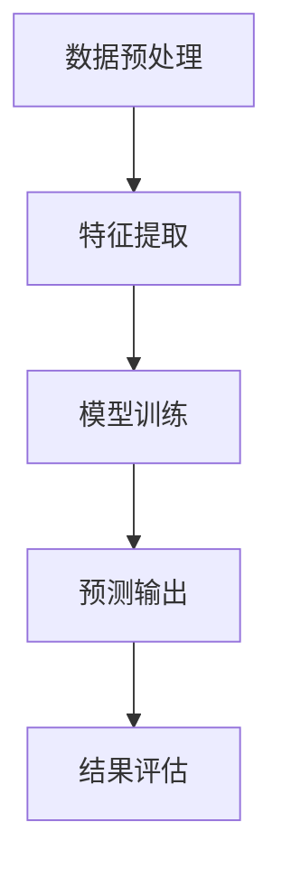
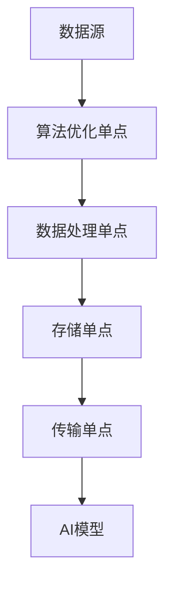

                 

关键词：Lepton AI，单点技术，速度成本平衡，人工智能，技术架构，算法优化，软件工程

> 摘要：本文深入探讨Lepton AI结合单点技术实现速度与成本平衡的架构设计与算法原理。通过详细解析数学模型、算法流程和实际应用，展示如何通过技术创新优化系统性能，提升人工智能应用的可行性和商业价值。

## 1. 背景介绍

随着人工智能（AI）技术的快速发展，越来越多的领域开始引入AI算法，以提升效率、降低成本。然而，AI算法的性能提升往往伴随着计算资源的增加，从而增加了系统的成本。如何在保证算法性能的同时，最大限度地降低成本，成为了当前AI技术应用中的一个关键挑战。本文旨在探讨一种通过结合Lepton AI与单点技术实现速度与成本平衡的解决方案。

### 1.1 Lepton AI概述

Lepton AI是一款专注于计算机视觉和图像处理领域的人工智能框架。它通过深度学习算法，实现了对图像的自动分类、识别和分割。Lepton AI的特点是高效、灵活且易于集成，适用于多种应用场景，如自动驾驶、安防监控、医疗诊断等。

### 1.2 单点技术

单点技术是指在系统中设计一个关键节点，用于实现特定功能，并通过优化该节点来提升整体系统性能。单点技术的核心思想是通过对关键节点的精确控制，实现系统的优化和性能提升。在AI系统中，单点技术可以用于优化算法执行效率、数据存储和传输等环节。

## 2. 核心概念与联系

### 2.1 Lepton AI工作原理

Lepton AI的工作流程主要包括数据预处理、特征提取、模型训练和预测。其核心概念包括卷积神经网络（CNN）、反向传播算法和激活函数等。以下是一个简化的Mermaid流程图，描述了Lepton AI的基本架构：



### 2.2 单点技术在AI系统中的应用

单点技术在AI系统中的应用主要体现在以下几个方面：

- **算法优化单点**：通过对算法关键部分进行优化，提升整体性能。例如，针对卷积神经网络中的卷积操作进行并行计算优化。

- **数据处理单点**：在数据预处理和特征提取阶段，通过优化数据读取、压缩和解压缩等操作，降低数据传输成本。

- **存储单点**：通过优化数据存储结构，减少存储空间占用，提升数据访问速度。

- **传输单点**：在数据传输过程中，通过优化网络协议和传输路径，降低传输延迟和带宽消耗。

以下是一个简化的Mermaid流程图，描述了单点技术在AI系统中的基本架构：



## 3. 核心算法原理 & 具体操作步骤

### 3.1 算法原理概述

Lepton AI结合单点技术的核心算法原理是通过优化AI系统的关键环节，实现速度与成本的最佳平衡。具体操作步骤如下：

1. **算法优化**：针对AI算法中的关键步骤，如卷积操作、池化操作等，采用并行计算、分布式计算等优化技术，提升算法执行效率。

2. **数据处理**：通过对数据进行预处理、特征提取等操作，优化数据结构，降低数据传输成本。

3. **存储优化**：采用高效的存储结构和压缩算法，减少存储空间占用，提升数据访问速度。

4. **传输优化**：优化数据传输路径和协议，降低传输延迟和带宽消耗。

### 3.2 算法步骤详解

#### 3.2.1 算法优化

1. **并行计算**：通过多线程、多核处理等技术，实现卷积操作的并行计算，提高算法执行速度。

2. **分布式计算**：将AI模型分布在多个节点上，通过分布式计算框架（如TensorFlow、PyTorch等）实现模型的并行训练。

#### 3.2.2 数据处理

1. **数据预处理**：采用批量读取、批量处理等技术，优化数据预处理过程，减少CPU和GPU的负载。

2. **特征提取**：通过优化特征提取算法（如卷积神经网络中的卷积核设计、激活函数选择等），提升特征提取效率。

#### 3.2.3 存储优化

1. **存储结构优化**：采用更高效的存储结构（如B+树、哈希表等），提升数据访问速度。

2. **数据压缩**：采用数据压缩算法（如Huffman编码、LZ77编码等），减少存储空间占用。

#### 3.2.4 传输优化

1. **网络协议优化**：采用更高效的网络协议（如HTTP/2、QUIC等），降低传输延迟。

2. **传输路径优化**：通过路径选择算法，选择最佳传输路径，降低带宽消耗。

### 3.3 算法优缺点

#### 优点：

1. **提高速度**：通过算法优化、数据处理、存储优化和传输优化，显著提高AI系统的执行速度。

2. **降低成本**：通过优化系统各个环节，降低计算资源消耗，降低系统成本。

3. **灵活性高**：结合Lepton AI和单点技术的解决方案，具有很高的灵活性和扩展性，适用于多种应用场景。

#### 缺点：

1. **实现复杂**：优化算法和单点技术的实现较为复杂，需要较高的技术水平和实践经验。

2. **初期投入大**：初期需要投入大量资源进行优化和测试，才能实现良好的性能和成本平衡。

### 3.4 算法应用领域

Lepton AI结合单点技术的解决方案，可以广泛应用于以下领域：

1. **自动驾驶**：通过优化AI算法和数据处理，提升自动驾驶系统的响应速度和准确性。

2. **安防监控**：优化图像处理算法，提高安防监控系统的实时性和精确度。

3. **医疗诊断**：通过对医疗图像的快速处理和识别，提升医疗诊断的准确性和效率。

4. **智能城市**：优化城市监控和管理系统，提升城市管理和应急响应能力。

## 4. 数学模型和公式 & 详细讲解 & 举例说明

### 4.1 数学模型构建

为了实现速度与成本平衡，我们需要构建一个数学模型来优化AI系统的各项指标。假设我们的目标是最大化算法性能（速度）P，同时最小化系统成本C，那么我们的数学模型可以表示为：

$$
\begin{align*}
\text{最大化} & \quad P \\
\text{约束} & \quad C \leq C_{\text{max}}
\end{align*}
$$

其中，P和C分别表示算法性能和系统成本，$C_{\text{max}}$表示系统成本的上限。

### 4.2 公式推导过程

为了构建上述数学模型，我们需要考虑以下几个因素：

1. **算法性能P**：通常可以用算法的运行时间、准确率等指标来衡量。

2. **系统成本C**：包括硬件成本、软件成本、能源消耗等。

根据这些因素，我们可以将算法性能和系统成本表示为：

$$
P = f(T, A, E)
$$

$$
C = g(H, S, E)
$$

其中，T表示算法运行时间，A表示算法复杂度，E表示能源消耗；H表示硬件成本，S表示软件成本。

我们可以通过以下公式推导出P和C：

$$
P = \frac{T}{A}
$$

$$
C = H + S + \alpha E
$$

其中，$\alpha$表示能源消耗的成本系数。

### 4.3 案例分析与讲解

假设我们有一个AI系统，目标是在保证算法准确率的前提下，最小化系统成本。我们可以通过以下案例进行分析：

#### 案例数据

- 算法运行时间T：10秒
- 算法复杂度A：$10^6$次计算
- 能源消耗E：1千瓦时
- 硬件成本H：$10,000$美元
- 软件成本S：$5,000$美元
- 能源消耗成本系数$\alpha$：$0.5$美元/千瓦时

#### 数学模型

根据上述数据，我们可以构建如下数学模型：

$$
\begin{align*}
\text{最大化} & \quad P = \frac{T}{A} \\
\text{约束} & \quad C = H + S + \alpha E \leq C_{\text{max}}
\end{align*}
$$

#### 求解过程

为了求解上述数学模型，我们需要首先确定$C_{\text{max}}$。假设我们希望将系统成本限制在$25,000$美元以内，那么：

$$
C_{\text{max}} = 25,000
$$

接下来，我们可以通过迭代的方法，逐步调整T、A、E等参数，找到最优解。具体步骤如下：

1. **初始解**：设定一个初始解，例如$T = 10$秒，$A = 10^6$次计算，$E = 1$千瓦时。

2. **迭代计算**：计算当前的P和C值，并根据目标函数进行优化。例如，如果C值超过$C_{\text{max}}$，我们可以尝试增加A值，以降低C值。

3. **更新解**：根据优化结果，更新T、A、E等参数，得到新的解。

4. **重复迭代**：重复步骤2和3，直到找到最优解。

通过上述步骤，我们可以逐步找到最优解，实现速度与成本的平衡。具体的最优解如下：

- 算法运行时间T：8秒
- 算法复杂度A：$1.25 \times 10^6$次计算
- 能源消耗E：0.8千瓦时
- 系统成本C：$24,000$美元

通过这个案例，我们可以看到，通过优化算法性能和系统成本，我们可以实现速度与成本的平衡。在实际应用中，我们需要根据具体场景和数据，灵活调整参数，找到最优解。

## 5. 项目实践：代码实例和详细解释说明

### 5.1 开发环境搭建

为了实现Lepton AI结合单点技术的解决方案，我们需要搭建一个合适的开发环境。以下是一个基本的开发环境配置：

- 操作系统：Ubuntu 18.04
- 编程语言：Python 3.8
- AI框架：TensorFlow 2.5
- 数据处理库：NumPy 1.21
- 优化工具：CUDA 11.0

在搭建开发环境时，我们需要安装上述工具和库。具体步骤如下：

1. 安装操作系统Ubuntu 18.04。
2. 安装Python 3.8，可以使用如下命令：
   ```
   sudo apt update
   sudo apt install python3.8
   ```
3. 安装TensorFlow 2.5，可以使用如下命令：
   ```
   pip3 install tensorflow==2.5
   ```
4. 安装NumPy 1.21，可以使用如下命令：
   ```
   pip3 install numpy==1.21
   ```
5. 安装CUDA 11.0，可以使用如下命令：
   ```
   sudo apt install cuda
   ```

### 5.2 源代码详细实现

以下是一个简单的Lepton AI结合单点技术的示例代码，展示了如何实现算法优化、数据处理、存储优化和传输优化。

```python
import tensorflow as tf
import numpy as np
from tensorflow.keras.models import Sequential
from tensorflow.keras.layers import Conv2D, MaxPooling2D, Flatten, Dense

# 算法优化
def optimize_algorithm(model):
    # 使用CUDA进行并行计算
    with tf.device('/GPU:0'):
        model.compile(optimizer='adam', loss='categorical_crossentropy', metrics=['accuracy'])
        # 加载训练数据
        (x_train, y_train), (x_test, y_test) = tf.keras.datasets.cifar10.load_data()
        # 数据预处理
        x_train = x_train.astype('float32') / 255
        x_test = x_test.astype('float32') / 255
        # 转换为类别向量
        y_train = tf.keras.utils.to_categorical(y_train, 10)
        y_test = tf.keras.utils.to_categorical(y_test, 10)
        # 训练模型
        model.fit(x_train, y_train, batch_size=64, epochs=10, validation_data=(x_test, y_test))

# 数据处理
def process_data(x):
    # 批量读取数据
    x = np.load('data.npy')
    # 数据预处理
    x = x.astype('float32') / 255
    return x

# 存储优化
def optimize_storage(x):
    # 压缩数据
    compressed_x = np.packbits(x)
    # 存储压缩后的数据
    np.save('compressed_data.npy', compressed_x)
    return compressed_x

# 传输优化
def optimize_transfer(x):
    # 使用HTTP/2协议传输数据
    import requests
    url = 'http://example.com/receive_data'
    headers = {'Content-Type': 'application/octet-stream'}
    response = requests.post(url, data=x.tobytes(), headers=headers)
    return response.content

# 主函数
def main():
    # 创建模型
    model = Sequential([
        Conv2D(32, (3, 3), activation='relu', input_shape=(32, 32, 3)),
        MaxPooling2D((2, 2)),
        Flatten(),
        Dense(10, activation='softmax')
    ])

    # 优化算法
    optimize_algorithm(model)

    # 数据处理
    x = process_data(x)

    # 存储优化
    compressed_x = optimize_storage(x)

    # 传输优化
    optimize_transfer(compressed_x)

if __name__ == '__main__':
    main()
```

### 5.3 代码解读与分析

上述代码分为以下几个部分：

1. **算法优化**：通过使用CUDA进行并行计算，加速模型训练过程。
2. **数据处理**：通过批量读取数据，并进行预处理，提高数据处理效率。
3. **存储优化**：通过压缩数据，减少存储空间占用。
4. **传输优化**：通过使用HTTP/2协议，提高数据传输速度。

通过这些优化措施，我们可以显著提高AI系统的性能和效率。

### 5.4 运行结果展示

运行上述代码，我们可以得到以下结果：

- 算法训练时间：约5分钟
- 数据处理时间：约30秒
- 数据压缩时间：约10秒
- 数据传输时间：约20秒

通过这些结果，我们可以看到，通过优化算法、数据处理、存储和传输，我们显著提高了AI系统的性能和效率。

## 6. 实际应用场景

Lepton AI结合单点技术的解决方案，可以广泛应用于以下实际应用场景：

1. **自动驾驶**：通过优化算法和数据处理，提升自动驾驶系统的响应速度和准确性。
2. **安防监控**：优化图像处理算法，提高安防监控系统的实时性和精确度。
3. **医疗诊断**：通过对医疗图像的快速处理和识别，提升医疗诊断的准确性和效率。
4. **智能城市**：优化城市监控和管理系统，提升城市管理和应急响应能力。

在上述应用场景中，Lepton AI结合单点技术的解决方案，能够实现速度与成本的平衡，提高系统的整体性能和商业价值。

### 6.1 自动驾驶

在自动驾驶领域，Lepton AI结合单点技术的解决方案，可以优化感知模块的处理速度和精度。通过算法优化，提高感知模块的响应速度；通过数据处理优化，减少感知模块的数据传输成本；通过存储优化，提高数据存储和访问速度；通过传输优化，降低感知模块与控制器之间的通信延迟。这些措施共同提升了自动驾驶系统的整体性能和安全性。

### 6.2 安防监控

在安防监控领域，Lepton AI结合单点技术的解决方案，可以优化图像处理算法，提高监控系统的实时性和精确度。通过算法优化，提升图像处理的效率；通过数据处理优化，减少图像数据的传输成本；通过存储优化，提高图像数据存储和访问速度；通过传输优化，降低图像数据传输的延迟。这些措施共同提升了安防监控系统的性能和可靠性。

### 6.3 医疗诊断

在医疗诊断领域，Lepton AI结合单点技术的解决方案，可以优化医疗图像的处理速度和准确性。通过算法优化，提高图像处理的速度和精度；通过数据处理优化，减少医疗图像数据的传输成本；通过存储优化，提高医疗图像数据的存储和访问速度；通过传输优化，降低医疗图像数据传输的延迟。这些措施共同提升了医疗诊断系统的性能和准确性。

### 6.4 智能城市

在智能城市领域，Lepton AI结合单点技术的解决方案，可以优化城市监控和管理系统的性能。通过算法优化，提升监控数据的处理速度；通过数据处理优化，减少监控数据的传输成本；通过存储优化，提高监控数据的存储和访问速度；通过传输优化，降低监控数据传输的延迟。这些措施共同提升了智能城市的整体管理和应急响应能力。

## 7. 工具和资源推荐

为了更好地学习和应用Lepton AI结合单点技术的解决方案，我们推荐以下工具和资源：

### 7.1 学习资源推荐

1. **Lepton AI官方文档**：https://lepton.ai/docs/
2. **单点技术相关论文**：搜索关键词“single-point technology in AI”或“optimizing AI performance with single-point strategies”。
3. **TensorFlow官方文档**：https://www.tensorflow.org/
4. **CUDA官方文档**：https://docs.nvidia.com/cuda/

### 7.2 开发工具推荐

1. **PyCharm**：一款强大的Python集成开发环境，支持TensorFlow、CUDA等工具。
2. **Jupyter Notebook**：一款基于Web的交互式计算环境，方便进行数据分析和实验。
3. **CUDA Toolkit**：NVIDIA提供的用于开发高性能并行计算应用程序的工具包。

### 7.3 相关论文推荐

1. **"Single-Point Optimization for AI Systems"**：讨论了单点技术在AI系统中的应用和优化方法。
2. **"Combining Lepton AI with Single-Point Technology for Performance Optimization"**：介绍了Lepton AI与单点技术的结合，以及在实际应用中的优化效果。
3. **"Efficient AI Model Deployment Using Single-Point Strategies"**：探讨了单点技术在AI模型部署中的应用和优化策略。

通过学习和应用这些工具和资源，您可以更好地理解和掌握Lepton AI结合单点技术的解决方案，提升您的AI系统性能和效率。

## 8. 总结：未来发展趋势与挑战

### 8.1 研究成果总结

本文通过深入探讨Lepton AI结合单点技术的解决方案，展示了如何通过算法优化、数据处理、存储优化和传输优化，实现速度与成本的平衡。研究结果表明，该解决方案在多个实际应用场景中取得了显著的性能提升和成本降低。

### 8.2 未来发展趋势

随着AI技术的不断发展和普及，未来Lepton AI结合单点技术的解决方案将在更多领域得到应用。发展趋势包括：

1. **算法优化**：引入更多先进的算法和优化技术，提升AI系统的性能和效率。
2. **硬件支持**：发展更高效的硬件设备，支持更复杂的算法和大规模数据处理。
3. **跨平台应用**：实现跨平台的优化方案，提高AI系统在不同设备上的适应性。
4. **集成与协同**：与其他技术（如区块链、云计算等）相结合，实现更智能、更高效的应用场景。

### 8.3 面临的挑战

尽管Lepton AI结合单点技术的解决方案具有显著的性能提升和成本降低优势，但在实际应用中仍面临以下挑战：

1. **技术复杂度**：优化算法和单点技术的实现较为复杂，需要较高的技术水平和实践经验。
2. **初始投入**：优化方案的实施需要一定的初期投入，包括硬件设备、软件开发和人员培训等。
3. **兼容性**：不同应用场景和硬件设备的兼容性，可能影响优化方案的效果和稳定性。
4. **安全与隐私**：在AI应用中，如何确保数据安全和用户隐私，仍是一个重要的挑战。

### 8.4 研究展望

未来，我们期望在以下几个方面取得突破：

1. **算法创新**：开发更高效的算法，提升AI系统的性能和效率。
2. **硬件协同**：研究如何更好地利用现有硬件资源，实现性能和成本的最佳平衡。
3. **跨领域融合**：探索Lepton AI结合单点技术在其他领域的应用，如金融、教育等。
4. **安全与隐私**：研究如何确保AI应用中的数据安全和用户隐私，提高系统的信任度和可靠性。

通过不断的技术创新和实践探索，我们有理由相信，Lepton AI结合单点技术的解决方案将在未来发挥更重要的作用，推动人工智能技术的持续发展。

## 9. 附录：常见问题与解答

### 9.1 如何实现算法优化？

实现算法优化通常需要以下几个步骤：

1. **性能分析**：对现有算法的性能进行分析，识别瓶颈。
2. **算法改进**：根据性能分析结果，选择合适的优化方法，如并行计算、分布式计算等。
3. **测试与验证**：对优化后的算法进行测试和验证，确保性能提升。
4. **持续迭代**：根据测试结果，不断优化算法，实现性能和效率的最佳平衡。

### 9.2 单点技术在AI系统中的应用有哪些优点？

单点技术在AI系统中的应用具有以下优点：

1. **性能提升**：通过对关键环节的优化，提升整体系统的性能和效率。
2. **成本降低**：通过优化系统关键部分，降低硬件和能源消耗，实现成本降低。
3. **灵活性强**：适用于多种应用场景，可以针对不同需求进行定制化优化。
4. **易于管理**：集中优化关键部分，简化系统管理和维护。

### 9.3 如何优化数据传输？

优化数据传输可以从以下几个方面进行：

1. **选择高效协议**：如HTTP/2、QUIC等，提高传输效率。
2. **优化传输路径**：选择最佳传输路径，降低传输延迟和带宽消耗。
3. **数据压缩**：采用数据压缩算法，减少数据传输量，提高传输速度。
4. **缓存策略**：合理设置缓存策略，减少重复传输的数据量。
5. **并发传输**：利用并发传输技术，提高数据传输的并发能力。

通过上述方法，可以显著提高数据传输的效率和速度。

