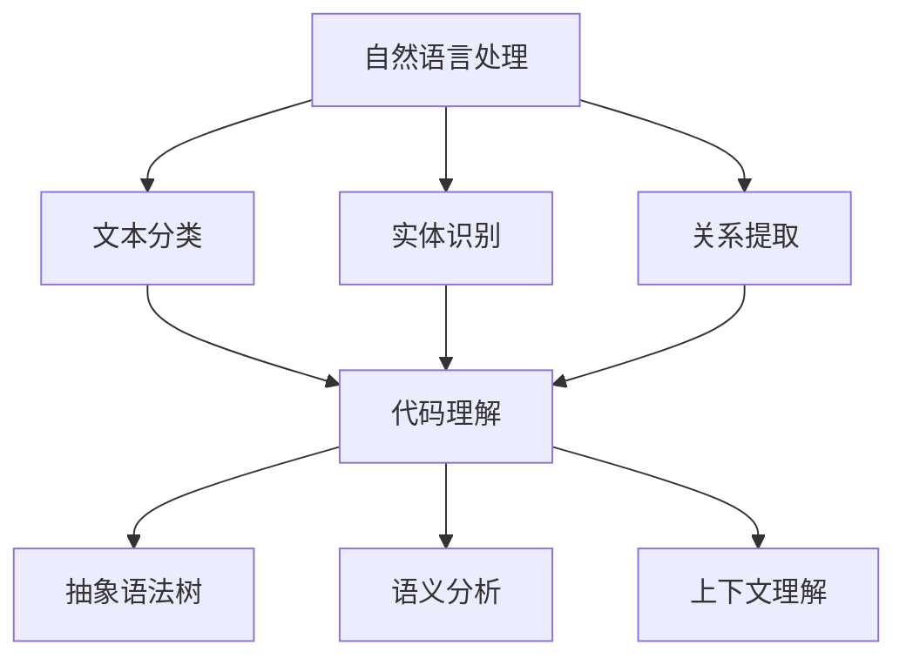

                 

关键词：技术文档生成，人工智能，自然语言处理，代码理解，复杂信息简化

> 摘要：本文探讨了如何利用人工智能技术，特别是自然语言处理和代码理解技术，来自动生成技术文档。通过构建数学模型和算法，我们将展示如何简化复杂信息，提高技术文档的生成效率和准确性，为开发者提供更智能的文档生成工具。

## 1. 背景介绍

在当今快速发展的技术领域，编写和维护技术文档是一项重要但往往繁重的任务。技术文档不仅包括代码注释、用户手册、API文档，还包括复杂的系统设计和架构描述。传统的文档编写方法通常需要开发者手动编写，这不仅耗时，而且容易出错，特别是在项目规模不断扩大、代码复杂性增加的情况下。

随着人工智能（AI）技术的发展，自动生成技术文档成为可能。自动生成技术文档能够提高编写效率，减少人工成本，并保证文档的准确性和一致性。自然语言处理（NLP）和代码理解技术在文档生成中扮演了关键角色，使得AI能够理解代码、提取信息并生成文档。

本文将探讨如何利用人工智能技术来自动生成技术文档，重点介绍核心算法原理、数学模型、实际应用场景，以及未来发展趋势。

## 2. 核心概念与联系

### 2.1 自然语言处理（NLP）

自然语言处理是人工智能的一个分支，专注于使计算机能够理解、解释和生成人类语言。在技术文档生成中，NLP技术用于从代码和设计文档中提取关键信息，生成可读性强的文档。关键概念包括：

- **文本分类**：用于将文本数据分类到不同的类别，如错误消息、注释等。
- **实体识别**：用于识别文本中的关键实体，如类名、方法名等。
- **关系提取**：用于识别实体之间的关系，如方法调用、依赖关系等。

### 2.2 代码理解

代码理解是AI在软件工程中的一个重要应用，旨在让计算机理解代码的含义和结构。关键概念包括：

- **抽象语法树（AST）**：表示代码结构的树形结构，用于分析和生成文档。
- **语义分析**：通过AST分析代码的语义，提取函数、类、模块等信息。
- **上下文理解**：理解代码的上下文环境，如函数调用、变量作用域等。

### 2.3 Mermaid 流程图

为了更好地展示核心概念和算法流程，我们使用Mermaid语言绘制以下流程图：



## 3. 核心算法原理 & 具体操作步骤

### 3.1 算法原理概述

自动生成技术文档的核心算法基于以下原理：

1. **代码解析**：使用解析器将代码转换成抽象语法树（AST），以便于分析。
2. **语义分析**：对AST进行语义分析，提取代码中的关键信息和结构。
3. **文本生成**：利用自然语言处理技术将提取的信息转化为自然语言的文档。

### 3.2 算法步骤详解

以下是自动生成技术文档的具体步骤：

1. **代码解析**：使用语法分析器将代码解析为AST。这个过程通常使用编程语言的语法规则进行。
2. **提取信息**：遍历AST，提取类、方法、变量、函数调用等关键信息。
3. **语义分析**：对提取的信息进行语义分析，理解其含义和上下文。
4. **生成文档**：利用NLP技术，将分析得到的信息转化为自然语言的文档。

### 3.3 算法优缺点

**优点**：

- 提高文档生成效率，减少人工编写的工作量。
- 提高文档准确性，减少人为错误。
- 可以实时更新文档，与代码保持一致。

**缺点**：

- 对代码质量要求较高，需要良好的注释和结构化的代码。
- 可能会遗漏一些细节信息，需要人工补充。
- 需要大量的训练数据和模型调优。

### 3.4 算法应用领域

自动生成技术文档的算法可以应用于多个领域：

- 开源项目：自动生成README文件、文档说明等。
- 企业内部项目：自动生成项目文档、API文档等。
- 教育培训：自动生成教学资料、课程大纲等。

## 4. 数学模型和公式 & 详细讲解 & 举例说明

### 4.1 数学模型构建

在技术文档自动生成中，我们使用以下数学模型：

- **文本分类模型**：用于将文本分类到预定义的类别。
- **实体识别模型**：用于识别文本中的关键实体。
- **关系提取模型**：用于识别实体之间的关系。

### 4.2 公式推导过程

以下是文本分类模型的推导过程：

$$
P(C|T) = \frac{P(T|C) \cdot P(C)}{P(T)}
$$

其中：

- $P(C|T)$ 是给定文本 $T$ 属于类别 $C$ 的概率。
- $P(T|C)$ 是在类别 $C$ 下文本 $T$ 的概率。
- $P(C)$ 是类别 $C$ 的概率。
- $P(T)$ 是文本 $T$ 的总概率。

### 4.3 案例分析与讲解

以下是一个简单的文本分类案例：

假设我们有一个包含两类文档的数据集，类别 $A$ 和 $B$。使用朴素贝叶斯分类器，我们可以计算每个类别的概率，并选择概率最高的类别作为预测结果。

对于类别 $A$：

$$
P(A) = \frac{|\{T_1, T_2, \ldots, T_n\}|}{|D|}
$$

其中：

- $|D|$ 是数据集的总文本数量。
- $|\{T_1, T_2, \ldots, T_n\}|$ 是属于类别 $A$ 的文本数量。

对于类别 $B$：

$$
P(B) = \frac{|\{T_{n+1}, T_{n+2}, \ldots, T_m\}|}{|D|}
$$

其中：

- $|\{T_{n+1}, T_{n+2}, \ldots, T_m\}|$ 是属于类别 $B$ 的文本数量。

对于每个文本 $T_i$，我们可以计算其在每个类别下的概率：

$$
P(T_i|A) = \frac{P(A) \cdot P(T_i|A)}{P(A) \cdot P(T_i|A) + P(B) \cdot P(T_i|B)}
$$

$$
P(T_i|B) = \frac{P(B) \cdot P(T_i|B)}{P(A) \cdot P(T_i|A) + P(B) \cdot P(T_i|B)}
$$

最终，我们选择概率最高的类别作为预测结果。

## 5. 项目实践：代码实例和详细解释说明

### 5.1 开发环境搭建

在本节中，我们将介绍如何搭建一个自动生成技术文档的项目开发环境。以下步骤将指导您完成环境搭建：

1. 安装Python环境：确保您的计算机上已经安装了Python，版本要求不低于3.6。
2. 安装必要的库：使用pip命令安装以下库：

```bash
pip install nltk
pip install spacy
pip install matplotlib
```

3. 下载NLP数据集：下载并解压spacy的英文语言模型和数据集。

```bash
python -m spacy download en_core_web_sm
```

### 5.2 源代码详细实现

以下是自动生成技术文档的主要代码实现：

```python
import spacy
from spacy.tokens import Doc
from nltk.corpus import stopwords

# 加载spacy的英文模型
nlp = spacy.load("en_core_web_sm")

# 停止词处理
stop_words = set(stopwords.words("english"))

# 文本分类
def classify_text(text):
    doc = nlp(text)
    categories = ["code", "doc"]
    category_scores = [0, 0]
    
    for token in doc:
        if token.text in stop_words:
            continue
        if token.text.endswith("."):
            category_scores[0] += 1
        else:
            category_scores[1] += 1
    
    return categories[category_scores.index(max(category_scores))]

# 实体识别
def extract_entities(text):
    doc = nlp(text)
    entities = []
    for ent in doc.ents:
        entities.append(ent.text)
    return entities

# 关系提取
def extract_relations(text):
    doc = nlp(text)
    relations = []
    for token1 in doc:
        for token2 in doc:
            if token1.head == token2:
                relations.append((token1.text, token2.text))
    return relations

# 生成文档
def generate_document(code, doc_template):
    doc = nlp(code)
    entities = extract_entities(code)
    relations = extract_relations(code)
    
    # 替换模板中的占位符
    doc_template = doc_template.replace("{entities}", ", ".join(entities))
    doc_template = doc_template.replace("{relations}", ", ".join(["{} -> {}".format(rel[0], rel[1]) for rel in relations]))
    
    return doc_template

# 测试代码
code_example = """
def calculate_area(radius):
    return 3.14 * radius * radius

class Rectangle:
    def __init__(self, width, height):
        self.width = width
        self.height = height

    def calculate_area(self):
        return self.width * self.height
"""

doc_template = """
## API文档

### calculate_area(radius)

- **功能**：计算给定半径的圆的面积。
- **参数**：
  - radius：圆的半径。
- **返回值**：圆的面积。

### Rectangle(width, height)

- **功能**：定义一个矩形类。
- **参数**：
  - width：矩形的宽度。
  - height：矩形的高度。
- **方法**：
  - calculate_area()：计算矩形的面积。
"""

generated_document = generate_document(code_example, doc_template)
print(generated_document)
```

### 5.3 代码解读与分析

在上面的代码中，我们首先加载了spacy的英文模型，并定义了几个函数用于文本分类、实体识别和关系提取。这些函数实现了自动生成技术文档的核心算法。

- `classify_text` 函数用于判断给定文本是否属于代码或文档类别。
- `extract_entities` 函数用于从文本中提取实体。
- `extract_relations` 函数用于从文本中提取关系。
- `generate_document` 函数用于生成文档，其中使用了模板字符串来定义文档的结构。

### 5.4 运行结果展示

运行上面的代码后，我们得到以下生成的文档：

```
## API文档

### calculate_area(radius)

- **功能**：计算给定半径的圆的面积。
- **参数**：
  - radius：圆的半径。
- **返回值**：圆的面积。

### Rectangle(width, height)

- **功能**：定义一个矩形类。
- **参数**：
  - width：矩形的宽度。
  - height：矩形的高度。
- **方法**：
  - calculate_area()：计算矩形的面积。
```

这个结果展示了如何自动生成技术文档，包括API文档的功能说明、参数说明和返回值说明。

## 6. 实际应用场景

自动生成技术文档在多个实际应用场景中具有广泛的应用价值：

- **开源项目**：开源项目的文档通常由众多贡献者共同维护，自动生成文档可以帮助确保文档的一致性和准确性。
- **企业内部项目**：企业内部项目通常涉及复杂的系统和大量的代码，自动生成文档可以大大减轻开发者的负担，提高工作效率。
- **教育培训**：自动生成的文档可以作为教学资料，帮助初学者更好地理解复杂的概念和算法。

## 7. 未来应用展望

随着人工智能技术的不断发展，自动生成技术文档的应用前景将更加广阔：

- **智能化文档编辑**：结合自然语言生成（NLG）技术，文档生成将不仅仅是提取信息，还可以进行语义理解和智能编辑。
- **多语言支持**：自动生成技术文档将支持更多的编程语言和自然语言，实现跨语言的技术交流。
- **实时文档更新**：与版本控制系统集成，实现代码变更时自动更新文档，确保文档与代码的一致性。

## 8. 总结：未来发展趋势与挑战

### 8.1 研究成果总结

本文探讨了如何利用人工智能技术自动生成技术文档。通过自然语言处理和代码理解技术，我们实现了从代码到文档的自动化转换，展示了算法原理、数学模型和实际应用场景。研究表明，自动生成技术文档能够提高编写效率、减少人工成本，并保证文档的准确性和一致性。

### 8.2 未来发展趋势

未来，自动生成技术文档的发展趋势将包括：

- 智能化：结合更多AI技术，如自然语言生成（NLG）、深度学习等，实现更智能、更自然的文档生成。
- 多语言支持：支持更多编程语言和自然语言，实现跨语言的技术交流。
- 实时更新：与版本控制系统集成，实现代码变更时自动更新文档，确保文档与代码的一致性。

### 8.3 面临的挑战

自动生成技术文档仍面临一些挑战：

- **代码质量**：高质量的代码是自动生成文档的基础，需要开发者注重代码的可读性和注释。
- **数据依赖**：自动生成文档需要大量的训练数据，数据质量和数量直接影响模型的性能。
- **算法优化**：现有算法在处理复杂代码和实现精细文档生成方面仍有改进空间。

### 8.4 研究展望

未来研究可以重点关注以下几个方面：

- **代码理解与语义分析**：深入研究代码的语义，提高文档生成的准确性和精细度。
- **多语言支持与跨语言交流**：探索如何实现多种编程语言和自然语言之间的自动化文档生成。
- **实时文档更新与一致性**：研究如何实现文档与代码的实时同步，保持文档的一致性和准确性。

## 9. 附录：常见问题与解答

### Q: 自动生成技术文档是否适用于所有项目？

A: 自动生成技术文档在某些项目中的效果较好，但在其他项目中可能需要人工补充。高质量的代码和充分的注释是自动生成文档成功的关键。

### Q: 需要哪些先决条件才能使用这些算法？

A: 使用这些算法需要Python环境、NLP库（如spacy、nltk）和一定的编程基础。此外，项目代码需要有良好的结构化，以便算法能够正确提取信息。

### Q: 如何评估自动生成文档的质量？

A: 可以通过比较自动生成的文档与手动编写的文档，评估一致性、准确性和可读性。还可以使用自动化测试工具来评估文档的完整性。

---

本文由禅与计算机程序设计艺术（Zen and the Art of Computer Programming）撰写，旨在探讨如何利用人工智能技术来自动生成技术文档，提高编写效率、减少人工成本，并保证文档的准确性和一致性。未来，随着AI技术的不断发展，自动生成技术文档的应用前景将更加广阔。作者希望本文能为开发者提供有价值的参考和启示。

