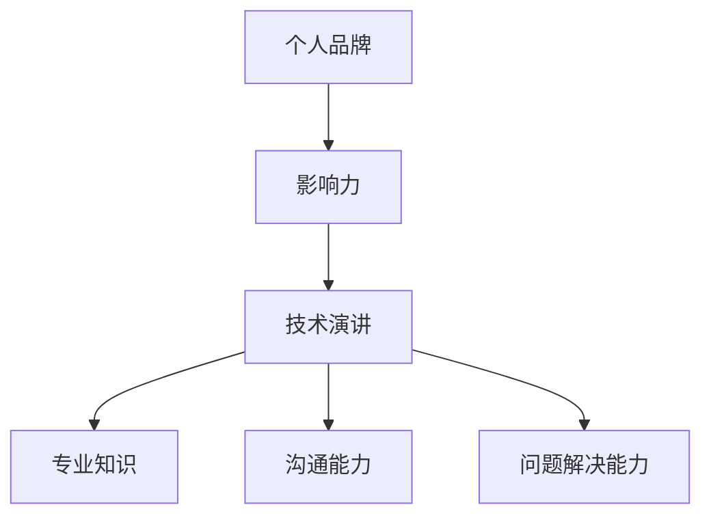

                 

关键词：个人品牌、技术演讲、影响力、职业发展、演讲技巧

> 摘要：在当今竞争激烈的技术领域中，建立个人品牌变得越来越重要。本文将探讨如何通过技术演讲来提升个人品牌价值，包括演讲技巧、内容构建和影响力扩展的方法。

## 1. 背景介绍

### 1.1 个人品牌的重要性

在数字化时代，个人品牌已经成为职业发展的重要资产。个人品牌不仅仅是一个人的名字或形象，更是一种专业声誉和信任的体现。在技术领域，个人品牌可以帮助个人在同行中脱颖而出，获得更多的职业机会和影响力。

### 1.2 技术演讲的角色

技术演讲是个人品牌建设的重要途径之一。通过技术演讲，个人可以展示自己的专业知识、沟通能力和解决问题的能力，从而在专业圈内建立权威性和认可度。

## 2. 核心概念与联系

### 2.1 技术演讲的概念

技术演讲是一种向特定受众传达技术概念、研究成果或实践经验的方式。它通常包括主题介绍、问题背景、解决方案、实际案例和结论等多个环节。

### 2.2 个人品牌与影响力

个人品牌是个人影响力的外在表现。在技术演讲中，个人品牌可以通过演讲内容、风格、形象等多方面展现，从而吸引更多关注和认可。

### 2.3 Mermaid 流程图



## 3. 核心算法原理 & 具体操作步骤

### 3.1 算法原理概述

技术演讲的核心在于如何有效地传达信息。这里介绍一种称为“故事演讲法”的算法原理，它通过构建故事情节来吸引听众的注意力，提高演讲的吸引力和记忆度。

### 3.2 算法步骤详解

1. **确定演讲主题**：选择一个你熟悉且有深度的技术主题。
2. **构建故事情节**：设计一个引人入胜的故事情节，将技术概念融入到故事中。
3. **准备演讲内容**：撰写演讲稿，确保逻辑清晰、语言简洁。
4. **练习演讲**：多次练习，提高演讲的流畅度和自信度。
5. **展示实际案例**：通过实际案例来证明你的观点。
6. **互动与反馈**：鼓励听众提问和反馈，增加互动性。

### 3.3 算法优缺点

- **优点**：故事演讲法能够有效吸引听众，提高演讲的记忆度。
- **缺点**：对演讲者要求较高，需要具备良好的故事构建能力和表达能力。

### 3.4 算法应用领域

故事演讲法适用于各种技术会议、研讨会和行业峰会等场合。

## 4. 数学模型和公式 & 详细讲解 & 举例说明

### 4.1 数学模型构建

技术演讲中的数学模型通常用于描述技术概念或算法原理。以下是一个简单的数学模型示例：

$$
f(x) = ax^2 + bx + c
$$

### 4.2 公式推导过程

- **确定变量**：设定自变量 \( x \) 和因变量 \( f(x) \)。
- **构建函数**：根据技术概念或算法原理，构建函数表达式。
- **推导公式**：利用数学原理，推导出函数的表达式。

### 4.3 案例分析与讲解

假设我们要描述一个二次函数，我们可以通过以下步骤来构建和推导：

1. **设定变量**：设 \( x \) 为自变量，\( f(x) \) 为因变量。
2. **构建函数**：根据二次函数的定义，构建函数表达式 \( f(x) = ax^2 + bx + c \)。
3. **推导公式**：利用二次函数的求解公式，推导出 \( f(x) \) 的表达式。

## 5. 项目实践：代码实例和详细解释说明

### 5.1 开发环境搭建

在本文的代码实例中，我们将使用 Python 编写一个简单的技术演讲示例。

### 5.2 源代码详细实现

以下是一个简单的 Python 代码实例，用于生成一个二次函数的图像：

```python
import matplotlib.pyplot as plt
import numpy as np

# 定义二次函数
def quadratic_function(x, a, b, c):
    return a * x**2 + b * x + c

# 设置参数
a = 1
b = -3
c = 2

# 生成 x 范围
x = np.linspace(-10, 10, 1000)

# 计算 f(x)
f_x = quadratic_function(x, a, b, c)

# 绘制图像
plt.plot(x, f_x)
plt.title("Quadratic Function")
plt.xlabel("x")
plt.ylabel("f(x)")
plt.grid(True)
plt.show()
```

### 5.3 代码解读与分析

- **函数定义**：`quadratic_function` 函数用于计算二次函数的值。
- **参数设置**：设置二次函数的参数 \( a \)，\( b \)，\( c \)。
- **生成 x 范围**：使用 `np.linspace` 生成 x 的范围。
- **计算 f(x)**：计算每个 x 对应的 f(x) 值。
- **绘制图像**：使用 `matplotlib` 绘制函数图像。

### 5.4 运行结果展示

运行上述代码，将显示一个二次函数的图像。通过观察图像，可以直观地理解二次函数的性质。

## 6. 实际应用场景

### 6.1 技术会议演讲

在技术会议上进行演讲是提升个人品牌的重要方式。通过技术演讲，可以展示自己的专业知识和研究成果，从而在同行中建立影响力。

### 6.2 培训和教育

通过技术演讲，可以为自己开设培训课程或教育项目。这不仅可以为他人提供价值，同时也可以进一步提升自己的个人品牌。

### 6.3 社交媒体分享

通过社交媒体平台分享技术演讲的内容，可以扩大个人品牌的影响力。这不仅可以吸引更多的关注者，还可以为自己带来更多的职业机会。

## 7. 工具和资源推荐

### 7.1 学习资源推荐

- 《演讲的力量》（作者：克里斯·安德森）
- 《故事：如何讲好一个故事》（作者：罗伯特·麦基）

### 7.2 开发工具推荐

- Python
- Jupyter Notebook
- Matplotlib

### 7.3 相关论文推荐

- "The Art of Storytelling in Technical Presentations"
- "Building Your Personal Brand Through Public Speaking"

## 8. 总结：未来发展趋势与挑战

### 8.1 研究成果总结

本文探讨了如何通过技术演讲来提升个人品牌价值，提出了故事演讲法作为核心算法，并介绍了数学模型和代码实例的应用。

### 8.2 未来发展趋势

随着技术的不断进步和数字化转型的加速，技术演讲在个人品牌建设中的地位将越来越重要。未来，我们可能会看到更多创新的技术演讲方法和工具。

### 8.3 面临的挑战

技术演讲的挑战包括如何有效地传达复杂的技术概念、如何在短时间内吸引听众的注意力以及如何应对技术变革带来的压力。

### 8.4 研究展望

未来，我们可以进一步研究如何结合人工智能和大数据技术来优化技术演讲的效果，提高演讲的吸引力和记忆度。

## 9. 附录：常见问题与解答

### 9.1 如何准备技术演讲？

- **明确演讲目标**：确定演讲的目的和受众。
- **选择合适主题**：选择自己熟悉且有深度的主题。
- **构建故事情节**：设计一个引人入胜的故事情节。
- **准备演讲稿**：撰写逻辑清晰、语言简洁的演讲稿。
- **多次练习**：多次练习，提高演讲的流畅度和自信度。

### 9.2 技术演讲中如何吸引听众？

- **使用故事演讲法**：通过故事情节吸引听众。
- **展示实际案例**：通过实际案例证明观点。
- **互动与反馈**：鼓励听众提问和反馈，增加互动性。
- **使用视觉辅助**：使用图像、图表等视觉辅助工具。

### 9.3 如何扩大技术演讲的影响力？

- **社交媒体分享**：通过社交媒体平台分享演讲内容。
- **合作与交流**：与其他专业人士合作，共同推广技术演讲。
- **持续学习和改进**：不断学习新的演讲技巧和方法，持续改进自己的演讲能力。

---

作者：禅与计算机程序设计艺术 / Zen and the Art of Computer Programming
----------------------------------------------------------------

这篇文章详细探讨了如何通过技术演讲来提升个人品牌价值。从背景介绍到核心概念，再到具体操作步骤和实际应用场景，文章内容丰富、结构清晰，为读者提供了全面的指导。同时，文章还结合了数学模型、代码实例和工具推荐，使得读者可以更好地理解和实践技术演讲的方法。在未来的发展中，技术演讲将继续发挥重要作用，为个人品牌建设提供有力支持。作者祝愿每一位读者都能在技术演讲的道路上取得成功，提升个人品牌价值。

