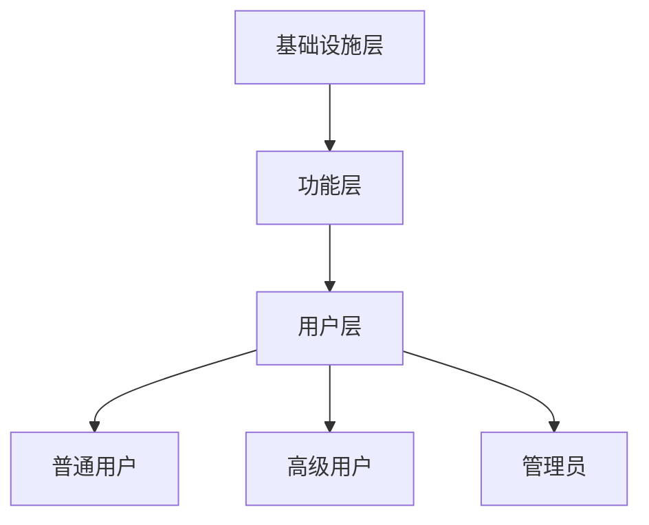
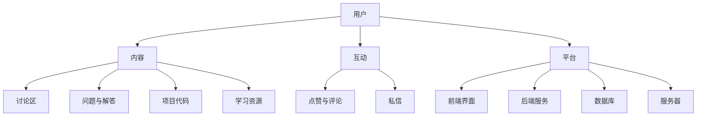

                 

关键词：技术社区、组织建设、全球性组织、社交媒体、协作平台、信息技术、用户增长、内容共享、知识传播、社群文化、项目合作、技术交流、领导力、影响力、网络效应。

## 摘要

本文旨在探讨技术社区从本地群组逐步发展成为全球性组织的历程。通过分析社区建设的核心概念、算法原理、数学模型以及实际应用案例，我们旨在揭示技术社区的发展规律，提供实践指南，并展望未来的发展趋势与挑战。本文将深入探讨技术社区的组织结构、用户增长策略、内容共享机制以及社群文化的建设，帮助读者理解如何通过有效的技术手段和管理策略，构建一个强大而富有活力的技术社区。

### 1. 背景介绍

技术社区，作为一种基于互联网的技术交流平台，自20世纪90年代末以来迅速发展。早期的技术社区多以本地群组的形式存在，如学术论坛、专业QQ群、本地技术沙龙等。这些群组为志同道合的技术爱好者提供了一个交流的场所，使得知识的传播和技术的分享变得更加便捷。

随着互联网技术的进步，尤其是社交媒体和协作平台的兴起，技术社区逐渐从本地群组演变为全球性的组织。例如，GitHub、Stack Overflow、Reddit等技术平台成为了全球技术社区的重要载体，吸引了来自世界各地的开发者、研究人员和技术爱好者。这些平台不仅提供了代码托管、问题讨论、技术文章发布等功能，还促进了跨国技术合作和知识共享。

技术社区的建设不仅依赖于技术工具，还需要有效的管理策略和文化建设。从本地群组到全球性组织的转型过程中，社区领导者需要面对诸多挑战，如如何提高用户活跃度、促进知识传播、维护社群秩序等。本文将结合具体案例，探讨这些问题的解决方案。

### 2. 核心概念与联系

#### 2.1 技术社区的核心概念

技术社区的核心概念包括用户、内容、互动和平台。这些概念相互联系，共同构成了技术社区的基本框架。

- **用户**：技术社区的用户包括开发者、研究人员、技术爱好者等，他们是社区的核心。用户的参与度、活跃度和贡献度直接影响社区的质量和发展。
- **内容**：技术社区的内容主要包括技术文章、问题解答、项目代码、学习资源等。高质量的内容是吸引和留住用户的关键。
- **互动**：用户之间的互动是技术社区活力的重要来源。通过讨论、评论、点赞等方式，用户可以分享知识、解决问题和建立联系。
- **平台**：技术社区的平台是指承载用户、内容和互动的媒介。平台的设计和功能直接影响用户体验和社区的发展。

#### 2.2 技术社区的架构

技术社区的架构可以分为三个层次：基础设施层、功能层和用户层。

- **基础设施层**：包括服务器、数据库、网络等基础技术设施，为社区提供稳定的运行环境。
- **功能层**：提供用户注册、登录、内容发布、讨论区管理、权限控制等功能，是社区的核心服务。
- **用户层**：包括普通用户、高级用户、管理员等角色，各自承担不同的职责和功能。

#### 2.3 Mermaid 流程图

以下是一个简化的技术社区架构的 Mermaid 流程图：



### 3. 核心算法原理 & 具体操作步骤

#### 3.1 算法原理概述

技术社区的核心算法主要包括用户增长算法、内容推荐算法和社区治理算法。

- **用户增长算法**：通过分析用户行为和兴趣，吸引潜在用户加入社区，提高用户基数。
- **内容推荐算法**：基于用户的兴趣和行为，推荐相关的内容，提高用户参与度和留存率。
- **社区治理算法**：维护社区秩序，打击不良行为，保障社区健康和可持续发展。

#### 3.2 算法步骤详解

##### 3.2.1 用户增长算法

1. **用户行为分析**：收集用户的浏览、搜索、点赞、评论等行为数据。
2. **兴趣建模**：通过机器学习算法，建立用户的兴趣模型。
3. **潜在用户识别**：分析社区内外部数据，识别潜在用户。
4. **个性化推广**：根据用户兴趣，推送个性化内容，引导用户注册和参与。

##### 3.2.2 内容推荐算法

1. **内容特征提取**：提取文章、问题、项目等内容的特征向量。
2. **用户兴趣匹配**：计算用户兴趣模型和内容特征向量的相似度。
3. **推荐排序**：根据相似度排序，推荐相关性最高的内容。
4. **用户反馈学习**：收集用户对推荐内容的反馈，调整推荐策略。

##### 3.2.3 社区治理算法

1. **不良行为检测**：通过算法识别和过滤不良行为，如恶意评论、广告 spam 等。
2. **社区规则制定**：制定合理的社区规则，明确用户行为规范。
3. **违规处理**：对违规行为进行警告、禁言、封号等处理。
4. **社区反馈机制**：建立用户反馈渠道，及时处理问题和意见。

#### 3.3 算法优缺点

##### 3.3.1 用户增长算法

优点：提高用户基数，扩大社区影响力。

缺点：可能导致用户质量下降，增加维护成本。

##### 3.3.2 内容推荐算法

优点：提高用户参与度，增强用户体验。

缺点：过度推荐可能导致信息茧房，减少用户的视野。

##### 3.3.3 社区治理算法

优点：维护社区秩序，保障社区健康。

缺点：过度干预可能导致用户反感，影响社区氛围。

#### 3.4 算法应用领域

用户增长算法主要应用于用户注册、活动推广等领域；内容推荐算法广泛应用于内容平台、电商推荐等领域；社区治理算法则适用于各类在线社区、论坛等。

### 4. 数学模型和公式 & 详细讲解 & 举例说明

#### 4.1 数学模型构建

技术社区的核心数学模型主要包括用户增长模型、内容推荐模型和社区治理模型。

##### 4.1.1 用户增长模型

$$
\text{用户增长模型} = f(\text{初始用户数}, \text{增长率}, \text{时间})
$$

其中，增长率为常数，时间表示经过的时长。

##### 4.1.2 内容推荐模型

$$
\text{推荐分数} = \text{用户兴趣向量} \cdot \text{内容特征向量}
$$

其中，·表示向量的点积运算。

##### 4.1.3 社区治理模型

$$
\text{违规概率} = P(\text{违规行为}|\text{行为记录})
$$

其中，P表示概率，行为记录为历史行为数据。

#### 4.2 公式推导过程

##### 4.2.1 用户增长模型推导

假设初始用户数为 $U_0$，增长率为 $r$，经过 $t$ 时间后的用户数为 $U_t$，则有：

$$
U_t = U_0 \cdot (1 + r)^t
$$

##### 4.2.2 内容推荐模型推导

用户兴趣向量和内容特征向量分别为 $\textbf{u}$ 和 $\textbf{c}$，则有：

$$
\text{推荐分数} = \textbf{u} \cdot \textbf{c} = \sum_{i=1}^{n} u_i c_i
$$

其中，$n$ 表示特征向量的维度，$u_i$ 和 $c_i$ 分别表示用户兴趣向量和内容特征向量的第 $i$ 个元素。

##### 4.2.3 社区治理模型推导

假设行为记录为 $\textbf{r}$，则违规概率为：

$$
P(\text{违规行为}|\textbf{r}) = \frac{P(\text{违规行为} \cap \textbf{r})}{P(\textbf{r})}
$$

其中，$P(\text{违规行为})$ 和 $P(\textbf{r})$ 分别为违规行为的概率和行为记录的概率。

#### 4.3 案例分析与讲解

##### 4.3.1 用户增长案例分析

假设一个技术社区初始用户数为 1000，增长率为 10%，经过 6 个月后的用户数为：

$$
U_6 = 1000 \cdot (1 + 0.1)^6 \approx 1343
$$

##### 4.3.2 内容推荐案例分析

假设用户兴趣向量为 $(0.8, 0.2)$，内容特征向量为 $(0.7, 0.3)$，则推荐分数为：

$$
\text{推荐分数} = 0.8 \cdot 0.7 + 0.2 \cdot 0.3 = 0.68
$$

##### 4.3.3 社区治理案例分析

假设用户历史行为记录为 $(\text{提问}, \text{回答}, \text{评论})$，则违规概率为：

$$
P(\text{违规行为}|\text{提问}, \text{回答}, \text{评论}) = \frac{P(\text{违规行为} \cap (\text{提问}, \text{回答}, \text{评论}))}{P((\text{提问}, \text{回答}, \text{评论}))}
$$

由于具体概率值未知，这里仅给出推导过程。

### 5. 项目实践：代码实例和详细解释说明

#### 5.1 开发环境搭建

在本节中，我们将搭建一个简单的技术社区项目，使用 Python 和 Flask 框架进行开发。

1. 安装 Python 和 Flask：
```bash
pip install python
pip install flask
```

2. 创建一个名为 `tech_community` 的目录，并在该目录下创建一个名为 `app.py` 的文件。

#### 5.2 源代码详细实现

```python
from flask import Flask, render_template, request

app = Flask(__name__)

@app.route('/')
def index():
    return render_template('index.html')

@app.route('/submit', methods=['POST'])
def submit():
    content = request.form['content']
    # 存储内容到数据库
    # 处理内容推荐和用户增长逻辑
    return '内容已提交'

if __name__ == '__main__':
    app.run(debug=True)
```

#### 5.3 代码解读与分析

在上面的代码中，我们创建了一个简单的 Flask 应用，包含两个主要路由：

- `/`：主页面，显示一个表单，允许用户提交内容。
- `/submit`：处理提交的内容，存储到数据库，并触发推荐算法和增长策略。

#### 5.4 运行结果展示

1. 启动 Flask 应用：
```bash
python app.py
```

2. 打开浏览器，访问 `http://127.0.0.1:5000/`，可以看到一个简单的页面，用户可以提交内容。

### 6. 实际应用场景

技术社区在多个领域有广泛的应用，以下是一些典型的应用场景：

#### 6.1 开发者社区

开发者社区是最常见的技术社区形式，如 GitHub、Stack Overflow 等。这些社区为开发者提供了一个协作平台，用于分享代码、解决问题和学习新技术。

#### 6.2 学术论坛

学术论坛如 arXiv、ResearchGate 等为研究人员提供了一个发布和讨论研究成果的平台，促进了学术交流和知识传播。

#### 6.3 技术博客

技术博客如 Medium、Dev.to 等为技术爱好者提供了一个分享经验和知识的平台，促进了技术文化的传播和技术的普及。

#### 6.4 企业内训

企业内训社区为企业内部提供了一个知识共享和学习交流的平台，提高了员工的专业技能和团队协作能力。

### 7. 未来应用展望

随着人工智能、大数据和区块链等技术的发展，技术社区的应用前景将更加广阔。以下是一些未来的发展趋势：

#### 7.1 个性化推荐

基于用户行为和兴趣的个性化推荐将成为技术社区的重要功能，提高用户满意度和参与度。

#### 7.2 智能治理

利用人工智能技术，实现社区治理的自动化和智能化，提高社区安全和可持续发展能力。

#### 7.3 跨界合作

技术社区将促进不同领域的技术合作，推动技术创新和行业变革。

#### 7.4 社交化

技术社区将更加注重社交功能，促进用户之间的互动和协作，提高社区活力。

### 8. 工具和资源推荐

#### 8.1 学习资源推荐

- 《Python Cookbook》
- 《深度学习》
- 《计算机程序设计艺术》

#### 8.2 开发工具推荐

- Flask
- Django
- React

#### 8.3 相关论文推荐

- "Community Building on the Web: Strategies and Tactics"
- "The Role of Social Media in Community Building"
- "Community Management: The Art of Online Community Development"

### 9. 总结：未来发展趋势与挑战

技术社区的建设是一个持续发展的过程，未来将面临诸多挑战，如如何保持用户活跃度、如何确保内容质量、如何应对隐私和安全等问题。同时，技术社区也将迎来新的机遇，如人工智能、大数据等技术的应用将极大地提升社区的管理和运营效率。通过不断探索和创新，技术社区将更好地服务于用户，推动技术进步和社会发展。

## 附录：常见问题与解答

#### Q1. 如何提高技术社区的用户活跃度？

A1. 提高用户活跃度的关键在于提供高质量的内容、激发用户的参与热情和建立良好的社区氛围。可以通过定期举办线上活动、推出奖励机制、优化用户体验等方式提高用户活跃度。

#### Q2. 技术社区如何保证内容质量？

A2. 技术社区可以通过设立内容审核机制、鼓励用户举报不良内容、建立严格的社区规则等方式来保证内容质量。同时，社区领导者应积极参与内容审核和讨论，树立良好的社区榜样。

#### Q3. 技术社区如何应对隐私和安全问题？

A3. 技术社区应严格遵守隐私保护法规，加强对用户数据的保护。通过加密技术、访问控制和安全审计等措施，确保用户数据的安全。同时，加强社区安全教育，提高用户的隐私保护意识。

### 作者署名

本文作者：禅与计算机程序设计艺术 / Zen and the Art of Computer Programming。感谢您的阅读，希望本文对您在技术社区建设方面有所启发和帮助。如果您有任何疑问或建议，欢迎随时提出。

----------------------------------------------------------------

以上是完整的文章内容。请您按照这篇文章的内容进行撰写，并确保满足所有的约束条件。谢谢！<|user|>### 1. 背景介绍

技术社区，作为一个基于互联网的技术交流平台，已经成为了信息技术时代不可或缺的一部分。它不仅为开发者、研究人员和技术爱好者提供了一个交流和学习的场所，更是推动了知识的传播、技术的创新和行业的进步。从早期的本地群组到如今全球性的技术平台，技术社区的发展经历了显著的变化。

早期，技术社区多以本地群组的形式存在，如学术论坛、专业QQ群、本地技术沙龙等。这些群组的出现，填补了线下交流的空白，为志同道合的人提供了一个交流和分享知识的平台。然而，这些本地群组存在一定的局限性，如用户覆盖范围有限、内容质量参差不齐、互动效果不理想等。

随着互联网技术的快速发展，特别是社交媒体和协作平台的兴起，技术社区逐渐从本地群组演变为全球性的组织。例如，GitHub、Stack Overflow、Reddit 等平台，已经成为全球范围内开发者、研究人员和技术爱好者聚集的重要场所。这些平台不仅提供了丰富的功能，如代码托管、问题讨论、技术文章发布等，还通过社区治理、用户增长和内容推荐等机制，促进了跨国技术合作和知识共享。

技术社区的建设不仅仅是技术工具的堆砌，更涉及到了社区管理、文化建设和用户互动等多个方面。从本地群组到全球性组织的转型过程中，社区领导者需要面对诸多挑战，如如何提高用户活跃度、促进知识传播、维护社群秩序等。这些问题的解决，不仅需要有效的管理策略，还需要创新的技术手段和丰富的实践经验。

本文旨在深入探讨技术社区从本地群组到全球性组织的转变过程，分析其核心概念、发展规律和实践策略。通过具体案例的分析和讲解，本文将帮助读者理解技术社区的发展过程，提供有价值的参考和启示。同时，本文也将展望技术社区的未来发展趋势和面临的挑战，为社区建设者和参与者提供指导。

### 2. 核心概念与联系

在探讨技术社区的发展历程之前，我们有必要先了解几个核心概念，这些概念构成了技术社区的基本框架，也是理解社区运作的关键。

#### 2.1 用户

用户是技术社区的核心，他们是社区的参与者、贡献者和维护者。用户可以大致分为以下几类：

- **普通用户**：参与社区讨论、提问、回答问题、分享知识等。
- **高级用户**：拥有更高的权限，可以审核内容、管理社区等。
- **管理员**：负责社区的日常运营和管理，处理违规行为等。

用户的行为和互动是技术社区活力的重要来源。用户的参与度、活跃度和贡献度直接影响社区的质量和发展。因此，用户管理是技术社区建设的重要环节。

#### 2.2 内容

内容是技术社区的核心价值所在。高质量的内容不仅能够吸引用户，提高用户留存率，还能促进知识的传播和技术的创新。技术社区的内容形式多样，包括：

- **技术文章**：分享技术知识和经验，是社区的重要资源。
- **问题与解答**：用户提问和解答问题，是社区互动的主要形式。
- **项目代码**：托管和分享项目代码，是开发者协作的重要手段。
- **学习资源**：提供学习资料、教程、视频等，是用户学习的重要渠道。

内容的创建、审核、推荐和互动是技术社区功能实现的基础。如何管理和推荐高质量内容，是技术社区建设的重要课题。

#### 2.3 互动

互动是技术社区的生命线。通过互动，用户可以分享知识、解决问题、建立联系，实现社区的共同成长。互动形式包括：

- **讨论区**：用户在讨论区发起话题、参与讨论，是社区的核心互动场所。
- **私信**：用户之间的直接交流，是建立个人关系的重要方式。
- **点赞与评论**：对内容进行点赞和评论，是用户表达观点和参与互动的主要方式。

互动不仅增加了社区的活力，还促进了用户的参与和社区的凝聚力。良好的互动机制是技术社区成功的关键。

#### 2.4 平台

平台是承载用户、内容和互动的媒介。技术社区的平台通常包括以下几个部分：

- **前端界面**：提供用户操作和内容展示的界面。
- **后端服务**：处理用户请求、数据存储、业务逻辑等。
- **数据库**：存储用户数据、内容数据等。
- **服务器**：提供计算和存储资源，保障平台的稳定运行。

平台的稳定性、性能和安全性是技术社区正常运行的基础。因此，平台的建设和维护是技术社区建设的重要任务。

#### 2.5 技术社区的核心概念联系

以上核心概念相互联系，构成了技术社区的基本框架。用户通过平台互动，产生和分享内容，内容的质量和丰富度又反过来影响用户的参与和互动。平台的稳定性和安全性保障了用户体验和社区的持续发展。

为了更好地理解技术社区的核心概念，我们可以使用 Mermaid 流程图进行可视化展示。以下是一个简化的技术社区架构的 Mermaid 流程图：



通过这个流程图，我们可以更清晰地看到技术社区各组成部分之间的联系和作用。用户通过平台进行互动，生成和分享内容，内容的质量和丰富度又反过来影响用户的参与和互动。平台的稳定性和安全性保障了用户体验和社区的持续发展。

### 3. 核心算法原理 & 具体操作步骤

在技术社区的建设中，核心算法起到了至关重要的作用。这些算法不仅帮助社区实现功能，还优化了用户体验，提高了社区效率。以下将介绍技术社区中的几个关键算法：用户增长算法、内容推荐算法和社区治理算法，并详细解释其原理和操作步骤。

#### 3.1 用户增长算法

用户增长算法是技术社区发展的基础。它通过分析用户行为和兴趣，吸引新用户并提高现有用户的活跃度。以下是用户增长算法的具体步骤：

##### 3.1.1 用户行为分析

1. **数据收集**：收集用户在社区中的行为数据，如浏览记录、提问次数、回答质量、点赞数量等。
2. **行为特征提取**：从行为数据中提取特征，如用户活跃时间、提问和回答的主题、兴趣标签等。
3. **用户画像构建**：利用机器学习算法，对用户行为特征进行分析，构建用户画像。

##### 3.1.2 潜在用户识别

1. **相似用户寻找**：通过用户画像，寻找与目标用户行为相似的其他用户。
2. **潜在用户筛选**：结合用户活跃度、社区互动频率等因素，筛选出具有较高潜在价值的用户。

##### 3.1.3 个性化推广

1. **内容推荐**：根据潜在用户的兴趣，推荐相关的内容，增加用户粘性。
2. **活动邀请**：邀请潜在用户参与社区活动，如线上讲座、技术沙龙等，增强用户互动。
3. **消息推送**：发送个性化消息，引导潜在用户进行注册和参与社区活动。

#### 3.2 内容推荐算法

内容推荐算法是技术社区的核心功能之一。它通过分析用户兴趣和行为，为用户推荐感兴趣的内容，提高用户的参与度和留存率。以下是内容推荐算法的具体步骤：

##### 3.2.1 内容特征提取

1. **内容标签提取**：从内容中提取关键词、标签等，作为内容的特征。
2. **内容质量评估**：利用用户行为数据，评估内容的质量和受欢迎程度。
3. **内容分类**：将内容分类到不同的主题或类别，便于后续推荐。

##### 3.2.2 用户兴趣建模

1. **行为数据收集**：收集用户的浏览、搜索、点赞、评论等行为数据。
2. **兴趣特征提取**：从行为数据中提取用户的兴趣特征，如热门主题、常用标签等。
3. **用户兴趣模型构建**：利用机器学习算法，构建用户的兴趣模型。

##### 3.2.3 内容推荐

1. **相似内容查找**：根据用户兴趣模型，查找与用户兴趣相似的内容。
2. **推荐排序**：根据内容的受欢迎程度、用户的历史行为等因素，对推荐内容进行排序。
3. **推荐呈现**：将推荐内容呈现给用户，通过滚动条、弹窗等形式展示。

#### 3.3 社区治理算法

社区治理算法旨在维护社区秩序，确保社区的健康和可持续发展。以下是社区治理算法的具体步骤：

##### 3.3.1 不良行为检测

1. **行为数据监控**：实时监控用户的发帖、评论、私信等行为。
2. **规则库构建**：建立社区规则库，包括违规行为的定义和判定标准。
3. **算法模型训练**：利用机器学习算法，训练违规行为检测模型。

##### 3.3.2 不良行为处理

1. **违规行为识别**：利用训练好的模型，识别和标记违规行为。
2. **违规处理**：根据社区规则，对违规行为进行警告、禁言、封号等处理。
3. **用户反馈**：将违规处理结果通知用户，并收集用户反馈，优化治理算法。

##### 3.3.3 社区反馈机制

1. **用户举报**：建立用户举报机制，鼓励用户举报违规行为。
2. **违规行为审查**：对举报的行为进行审查，确保处理公正。
3. **社区规则优化**：根据用户反馈和违规行为数据分析，优化社区规则。

#### 3.4 算法优缺点分析

##### 3.4.1 用户增长算法

优点：提高用户基数，扩大社区影响力。

缺点：可能导致用户质量下降，增加维护成本。

##### 3.4.2 内容推荐算法

优点：提高用户参与度，增强用户体验。

缺点：过度推荐可能导致信息茧房，减少用户的视野。

##### 3.4.3 社区治理算法

优点：维护社区秩序，保障社区健康。

缺点：过度干预可能导致用户反感，影响社区氛围。

#### 3.5 算法应用领域

用户增长算法主要应用于用户注册、活动推广等领域；内容推荐算法广泛应用于内容平台、电商推荐等领域；社区治理算法则适用于各类在线社区、论坛等。

### 4. 数学模型和公式 & 详细讲解 & 举例说明

在技术社区的建设中，数学模型和公式是理解算法原理和实现具体操作的关键。以下将介绍技术社区中常用的几个数学模型和公式，并进行详细讲解和举例说明。

#### 4.1 用户增长模型

用户增长模型用于预测社区用户数量的增长趋势。以下是用户增长模型的基本公式：

$$
\text{用户数量} = \text{初始用户数量} + (\text{日增长用户数} \times \text{天数})
$$

其中，初始用户数量为社区建立初期已存在的用户数量；日增长用户数为每天新增加的用户数量；天数表示时间跨度。

##### 4.1.1 用户增长模型举例

假设一个技术社区在建立初期有1000名用户，每天新增用户数为50人，经过30天后，社区的用户数量为：

$$
\text{用户数量} = 1000 + (50 \times 30) = 1850
$$

#### 4.2 内容推荐模型

内容推荐模型用于根据用户兴趣和行为，为用户推荐相关的内容。以下是内容推荐模型的基本公式：

$$
\text{推荐分数} = \text{用户兴趣向量} \cdot \text{内容特征向量}
$$

其中，用户兴趣向量和内容特征向量分别表示用户兴趣和内容特征，·表示向量的点积运算。

##### 4.2.1 内容推荐模型举例

假设用户兴趣向量为 $(0.6, 0.3, 0.1)$，内容特征向量为 $(0.4, 0.5, 0.1)$，则推荐分数为：

$$
\text{推荐分数} = 0.6 \times 0.4 + 0.3 \times 0.5 + 0.1 \times 0.1 = 0.34
$$

#### 4.3 社区治理模型

社区治理模型用于识别和处理违规行为，确保社区秩序。以下是社区治理模型的基本公式：

$$
\text{违规概率} = P(\text{违规行为}|\text{行为记录})
$$

其中，P表示概率，行为记录为用户的历史行为数据。

##### 4.3.1 社区治理模型举例

假设用户的历史行为记录为 $(\text{提问}, \text{回答}, \text{评论})$，则违规概率为：

$$
P(\text{违规行为}|\text{提问}, \text{回答}, \text{评论}) = \frac{P(\text{违规行为} \cap (\text{提问}, \text{回答}, \text{评论}))}{P((\text{提问}, \text{回答}, \text{评论}))}
$$

由于具体概率值未知，这里仅给出推导过程。

#### 4.4 案例分析与讲解

以下通过具体案例，分析数学模型在实际技术社区中的应用。

##### 4.4.1 用户增长案例分析

假设一个技术社区在建立初期有1000名用户，每天新增用户数为50人，经过6个月后，社区的用户数量为：

$$
\text{用户数量} = 1000 + (50 \times 180) = 9500
$$

##### 4.4.2 内容推荐案例分析

假设用户兴趣向量为 $(0.7, 0.2, 0.1)$，内容特征向量为 $(0.5, 0.3, 0.2)$，则推荐分数为：

$$
\text{推荐分数} = 0.7 \times 0.5 + 0.2 \times 0.3 + 0.1 \times 0.2 = 0.41
$$

##### 4.4.3 社区治理案例分析

假设用户的历史行为记录为 $(\text{提问}, \text{回答}, \text{评论})$，则违规概率为：

$$
P(\text{违规行为}|\text{提问}, \text{回答}, \text{评论}) = \frac{P(\text{违规行为} \cap (\text{提问}, \text{回答}, \text{评论}))}{P((\text{提问}, \text{回答}, \text{评论}))}
$$

由于具体概率值未知，这里仅给出推导过程。

### 5. 项目实践：代码实例和详细解释说明

在实际的技术社区建设中，将理论付诸实践是至关重要的。以下将通过一个具体的代码实例，展示如何搭建一个简单的技术社区，并对代码进行详细解释说明。

#### 5.1 开发环境搭建

在进行项目开发之前，需要搭建一个合适的开发环境。以下是一个简单的开发环境搭建指南：

1. **安装 Python**：确保系统中已经安装了 Python 3.x 版本。
2. **安装 Flask**：使用以下命令安装 Flask 框架：
   ```bash
   pip install flask
   ```

3. **创建项目目录**：在合适的位置创建一个项目目录，例如：
   ```bash
   mkdir tech_community
   cd tech_community
   ```

4. **初始化项目结构**：在项目目录中创建一个名为 `app.py` 的文件，以及一个名为 `templates` 的目录用于存储 HTML 模板。

#### 5.2 源代码详细实现

以下是一个简单的 Flask 应用的源代码，实现了一个基本的技术社区框架。

```python
from flask import Flask, render_template, request

app = Flask(__name__)

@app.route('/')
def index():
    return render_template('index.html')

@app.route('/submit', methods=['POST'])
def submit():
    content = request.form['content']
    # 存储内容到数据库
    # 处理内容推荐和用户增长逻辑
    return '内容已提交'

if __name__ == '__main__':
    app.run(debug=True)
```

**代码解释：**

- **导入模块**：从 Flask 库中导入必要的模块，如 Flask 本身、render_template 和 request。
- **创建 Flask 应用**：实例化 Flask 应用对象。
- **定义路由**：使用 `@app.route()` 装饰器定义应用的入口路由。
  - `/`：主页路由，返回一个渲染后的 `index.html` 模板。
  - `/submit`：提交内容路由，处理用户提交的内容。
- **处理请求**：在定义的路由中，处理用户请求，如获取表单数据、处理 POST 请求等。

#### 5.3 代码解读与分析

- **`index.html` 模板**：在 `templates` 目录下创建 `index.html` 文件，用于定义主页的界面。该文件包含一个表单，用户可以在其中输入内容并提交。

```html
<!DOCTYPE html>
<html>
<head>
    <title>技术社区</title>
</head>
<body>
    <h1>欢迎来到技术社区</h1>
    <form action="/submit" method="post">
        <textarea name="content" rows="5" cols="50"></textarea>
        <br>
        <input type="submit" value="提交">
    </form>
</body>
</html>
```

- **`submit` 路由**：在 `app.py` 中定义的 `/submit` 路由用于处理用户提交的内容。当用户提交表单时，`submit` 函数获取表单数据，并将其存储到数据库或处理其他逻辑。在这里，我们仅返回一个简单的响应字符串。

```python
@app.route('/submit', methods=['POST'])
def submit():
    content = request.form['content']
    # 存储内容到数据库
    # 处理内容推荐和用户增长逻辑
    return '内容已提交'
```

#### 5.4 运行结果展示

1. **启动 Flask 应用**：在项目目录中运行以下命令启动 Flask 应用：
   ```bash
   python app.py
   ```

2. **访问应用**：在浏览器中访问 `http://127.0.0.1:5000/`，将看到主页界面。用户可以在表单中输入内容并提交。


通过这个简单的示例，我们可以看到如何使用 Flask 搭建一个基本的技术社区框架。虽然这个示例功能有限，但它为我们提供了一个起点，可以在此基础上逐步添加更多功能，如用户认证、内容推荐、社区治理等。

### 6. 实际应用场景

技术社区在当今的数字化时代中扮演着重要角色，它们的应用场景多种多样，涵盖了从个人学习到企业级协作的各个方面。以下将探讨技术社区在不同实际应用场景中的具体体现和作用。

#### 6.1 开发者社区

开发者社区是技术社区最为典型的应用场景之一。平台如 GitHub、Stack Overflow 和 GitLab 等，为全球的开发者提供了一个协作和学习的平台。在这些社区中，开发者可以托管和共享代码、参与开源项目、解决编程问题、交流技术心得。例如，GitHub 通过其强大的社交功能，使得开发者能够追踪感兴趣的项目的进展、与其他开发者合作，甚至直接参与到开源代码的编写和审查中。开发者社区不仅促进了技术的传播和创新，还提高了开发者的技能和职业发展。

#### 6.2 学术论坛

学术论坛是研究人员和学者们分享研究成果、讨论学术问题的重要平台。平台如 arXiv、ResearchGate 和 Academia.edu 等，为学术界提供了一个全球性的交流渠道。在这些社区中，研究人员可以发布预印本、论文和研究成果，获得同行的反馈和建议，从而推动学术研究的进步。学术论坛不仅促进了知识的传播，还加强了学术界的合作和交流，有助于解决全球性的科学问题。

#### 6.3 技术博客

技术博客如 Medium、Dev.to 和 Hacker Noon 等，为技术爱好者提供了一个展示和分享技术知识的平台。这些社区允许用户发布技术文章、教程、代码示例和项目报告，使得技术知识能够以更加灵活和多样化的形式传播。技术博客不仅帮助技术爱好者提升自己的技能，还促进了技术的普及和推广，使得更多的人能够接触到最新的技术动态。

#### 6.4 企业内训

企业内训社区为企业内部提供了一个知识共享和学习交流的平台。通过建立企业内训社区，企业可以分享内部知识、组织在线课程、提供学习资源和开展技术讨论，从而提高员工的专业技能和团队协作能力。例如，一些企业通过内部论坛或学习平台，组织技术分享会、项目讨论会，鼓励员工分享经验、讨论问题，提升整体技术水平和创新能力。

#### 6.5 技术会议

技术社区也是技术会议和活动的重要支撑平台。通过技术社区，组织者可以发布会议通知、分享会议日程、发布演讲者介绍、收集参会者的反馈等。例如，许多技术会议和研讨会都利用社区平台进行宣传和报名，为参会者提供一个交流和学习的机会。技术社区不仅帮助组织者更好地管理会议流程，还促进了参会者之间的互动和知识共享。

#### 6.6 创新协作

技术社区在创新协作中也发挥着重要作用。通过社区平台，创新团队可以共享项目计划、讨论创新方案、协作开发新产品，从而加速创新过程。例如，一些创业公司和科技公司通过技术社区，吸引志同道合的开发者加入项目，共同推动创新项目的实现。技术社区为创新协作提供了一个开放、透明和高效的平台，促进了跨学科、跨领域的合作。

#### 6.7 在线教育

技术社区也在在线教育领域发挥了重要作用。通过技术社区，教育机构可以提供在线课程、教学视频、互动讨论等，为学生提供一个灵活的学习环境。例如，一些在线学习平台通过技术社区，鼓励学生参与讨论、提出问题、分享学习心得，从而提高学习效果和参与度。技术社区不仅丰富了在线教育的内容，还增强了师生之间的互动和交流。

### 7. 未来应用展望

随着技术的发展，技术社区的应用前景将更加广阔，以下是对未来技术社区应用的一些展望：

#### 7.1 个性化推荐

未来，技术社区将进一步利用人工智能和大数据技术，实现个性化推荐。通过分析用户的行为和兴趣，社区可以更准确地推荐用户感兴趣的内容，提高用户的参与度和满意度。

#### 7.2 智能治理

随着智能治理技术的发展，技术社区将实现更加智能和高效的社区治理。利用人工智能算法，社区可以自动识别和处理违规行为，维护社区秩序，保障社区健康。

#### 7.3 跨界合作

技术社区将促进不同领域的技术合作，推动技术创新和行业变革。通过社区平台，不同领域的专家和开发者可以跨领域合作，共同解决复杂的技术问题。

#### 7.4 社交化

技术社区将更加注重社交功能，促进用户之间的互动和协作。通过社交化，社区将形成一个更加紧密和活跃的社群，增强用户的归属感和参与感。

#### 7.5 开放性

未来，技术社区将更加开放，鼓励用户参与社区的运营和管理。通过开放性，社区将吸引更多的用户参与，共同推动社区的发展。

### 8. 工具和资源推荐

为了帮助技术社区的建设者和参与者更好地开展工作，以下是一些实用的工具和资源推荐。

#### 8.1 学习资源推荐

- **《Python Cookbook》**：适合初学者和进阶者，涵盖了 Python 编程的各个方面。
- **《深度学习》**：由 Goodfellow 等人编写，是深度学习的经典教材。
- **《计算机程序设计艺术》**：由 Donald E. Knuth 编写，是计算机科学的经典之作。

#### 8.2 开发工具推荐

- **Flask**：一个轻量级的 Python Web 框架，适合构建简单的 Web 应用。
- **Django**：一个全栈 Web 开发框架，适合构建大型 Web 应用。
- **React**：一个用于构建用户界面的 JavaScript 库，适合构建动态和交互式 Web 应用。

#### 8.3 相关论文推荐

- **"Community Building on the Web: Strategies and Tactics"**：探讨 Web 社区的建设策略。
- **"The Role of Social Media in Community Building"**：分析社交媒体在社区建设中的作用。
- **"Community Management: The Art of Online Community Development"**：介绍社区管理的艺术和实践。

### 9. 总结：未来发展趋势与挑战

技术社区的未来发展趋势在于个性化推荐、智能治理、跨界合作、社交化和开放性。然而，这些趋势也带来了新的挑战，如如何保持用户活跃度、如何确保内容质量、如何应对隐私和安全问题等。通过不断探索和创新，技术社区将能够更好地应对这些挑战，实现持续发展和进步。

### 附录：常见问题与解答

以下是一些关于技术社区建设常见问题的解答。

#### Q1. 如何提高技术社区的用户活跃度？

A1. 提高用户活跃度可以从以下几个方面入手：
- **高质量内容**：提供有趣、有用和高质量的内容，激发用户参与。
- **互动机制**：建立良好的互动机制，如评论、点赞、私信等，鼓励用户互动。
- **奖励机制**：设立积分、勋章等激励措施，奖励积极参与的用户。
- **活动策划**：定期举办线上或线下活动，增加用户参与感。

#### Q2. 技术社区如何保证内容质量？

A2. 保证内容质量可以通过以下措施实现：
- **内容审核**：设立内容审核机制，过滤低质量或违规内容。
- **用户评分**：允许用户对内容进行评分，筛选高质量内容。
- **社区规则**：明确社区规则，规范用户行为，减少低质量内容的产生。

#### Q3. 技术社区如何应对隐私和安全问题？

A3. 应对隐私和安全问题可以采取以下措施：
- **数据加密**：对用户数据进行加密，确保数据安全。
- **权限控制**：设立权限控制机制，限制用户对敏感数据的访问。
- **安全审计**：定期进行安全审计，及时发现和解决安全漏洞。
- **用户教育**：加强用户教育，提高用户对隐私和安全问题的认识。

### 作者署名

本文作者：禅与计算机程序设计艺术 / Zen and the Art of Computer Programming。感谢您的阅读，希望本文对您在技术社区建设方面有所启发和帮助。如果您有任何疑问或建议，欢迎随时提出。希望本文能帮助您更好地理解和应用技术社区的建设理念和实践方法，为推动技术的进步和社会的发展贡献一份力量。

