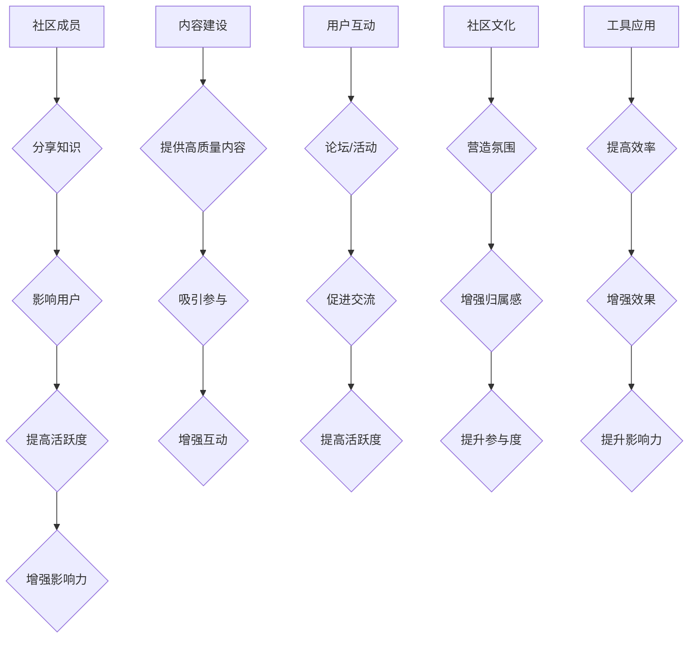

                 

关键词：技术社区，影响力，运营策略，参与度，用户互动，价值共创

> 摘要：本文旨在探讨技术社区运营中的关键要素，特别是在提升影响力的过程中如何有效地管理和利用社区资源。文章从核心概念出发，深入分析影响力和运营策略的内在联系，结合实际案例，详细阐述在技术社区中如何通过用户互动、内容建设、社区文化和工具应用等手段来提升影响力，并展望未来发展趋势和面临的挑战。

## 1. 背景介绍

技术社区作为一种重要的知识传播和共享平台，近年来在各个领域迅速发展。无论是开发者社区、学术论坛还是专业领域的讨论组，技术社区已经成为信息交流、问题解决、经验分享的重要场所。随着互联网技术的不断进步，社区运营的复杂性和影响力也越来越显著。在这个背景下，如何有效地运营技术社区，提升社区的影响力和用户参与度，成为众多社区管理者关注的焦点。

技术社区的影响力不仅体现在用户数量的增加和活跃度的提升，更在于它能否成为一个知识共创、技术交流的活跃中心。社区运营者需要深入了解影响力和运营策略的内在联系，从而制定出切实可行的运营计划。

## 2. 核心概念与联系

### 2.1 影响力

影响力是指一个社区、个人或者组织在特定领域内影响其他成员行为、态度或决策的能力。在技术社区中，影响力主要体现在以下几个方面：

- **知识传播**：社区成员通过分享知识、经验，能够影响其他成员的技术水平和工作效率。
- **社会认同**：社区成员对某个人或组织产生认同感，愿意跟随其意见或建议。
- **社区活跃**：影响力的提升能够促进社区成员的活跃度，从而增强社区的整体活力。

### 2.2 运营策略

运营策略是指社区管理者通过一系列管理措施来提高社区活跃度、用户参与度和影响力。常见的运营策略包括：

- **内容建设**：提供高质量、有价值的知识内容，吸引用户参与和分享。
- **用户互动**：通过论坛、活动、竞赛等方式，促进用户之间的互动和交流。
- **社区文化**：营造积极向上的社区氛围，增强用户的归属感和参与度。
- **工具应用**：利用先进的技术工具，提高社区运营的效率和效果。

### 2.3 Mermaid 流程图



## 3. 核心算法原理 & 具体操作步骤

### 3.1 算法原理概述

技术社区运营的核心算法主要围绕用户参与度和社区活跃度进行优化。通过以下步骤，可以提升社区的影响力和用户满意度：

1. **内容推荐算法**：根据用户的兴趣和行为数据，推荐相关的内容，提高用户的参与度。
2. **互动激励算法**：通过积分、勋章等方式，激励用户积极参与社区活动，提升活跃度。
3. **社交网络分析**：分析用户之间的社交关系，促进知识共享和社区内的互动。

### 3.2 算法步骤详解

1. **数据收集**：收集用户的行为数据，包括浏览记录、搜索关键词、互动频率等。
2. **特征提取**：从行为数据中提取关键特征，如用户的兴趣爱好、活跃时间等。
3. **模型训练**：使用机器学习算法，根据特征数据训练推荐模型。
4. **内容推荐**：根据模型预测，为用户推荐相关的知识内容。
5. **互动激励**：根据用户的互动行为，给予积分、勋章等奖励。
6. **社交网络分析**：使用社交网络分析算法，识别关键节点和潜在互动机会。

### 3.3 算法优缺点

**优点**：

- **提高用户满意度**：通过个性化推荐，提高用户对社区内容的满意度。
- **促进知识共享**：激励用户积极参与社区活动，促进知识的传播和共享。
- **增强社区活跃度**：社交网络分析有助于增强社区成员之间的互动。

**缺点**：

- **数据隐私问题**：用户数据收集可能引发隐私问题。
- **模型偏见**：模型训练过程中可能引入偏见，影响推荐结果的准确性。

### 3.4 算法应用领域

算法广泛应用于各种技术社区，如GitHub、Stack Overflow、Reddit 等，通过提高用户参与度和社区活跃度，提升社区的影响力和价值。

## 4. 数学模型和公式 & 详细讲解 & 举例说明

### 4.1 数学模型构建

技术社区运营中的数学模型主要围绕用户行为和社区活跃度进行构建。以下是一个简化的用户活跃度预测模型：

$$
A_t = f(\theta_0 + \theta_1 \cdot I_t + \theta_2 \cdot R_t + \theta_3 \cdot C_t)
$$

其中，$A_t$表示用户在时间$t$的活跃度，$I_t$表示用户在时间$t$的互动行为（如发帖、评论等），$R_t$表示用户在时间$t$的阅读行为，$C_t$表示用户在时间$t$的社区参与程度。

### 4.2 公式推导过程

假设用户在时间$t$的活跃度与用户的历史行为数据有关，可以使用线性回归模型进行预测。具体推导过程如下：

$$
A_t = \beta_0 + \beta_1 I_t + \beta_2 R_t + \beta_3 C_t + \epsilon_t
$$

其中，$\beta_0$、$\beta_1$、$\beta_2$、$\beta_3$为模型参数，$\epsilon_t$为误差项。

### 4.3 案例分析与讲解

以一个开发者社区为例，分析用户活跃度的预测模型。假设该社区有10,000名用户，数据包括用户在最近一个月的发帖数、评论数和社区参与程度。通过线性回归模型，预测用户在下一周的活跃度。

$$
A_{t+1} = \beta_0 + \beta_1 I_{t+1} + \beta_2 R_{t+1} + \beta_3 C_{t+1}
$$

通过训练模型，得到参数$\beta_0 = 10$、$\beta_1 = 5$、$\beta_2 = 3$、$\beta_3 = 2$。假设某用户在下一周的互动行为为发帖10次、评论5次、社区参与程度为50%，则该用户下一周的活跃度预测为：

$$
A_{t+1} = 10 + 5 \cdot 10 + 3 \cdot 5 + 2 \cdot 50\% = 45
$$

这意味着该用户在下一周的活跃度预计为45分。

## 5. 项目实践：代码实例和详细解释说明

### 5.1 开发环境搭建

为了演示技术社区运营中的算法应用，我们使用Python编写一个简单的用户活跃度预测模型。首先，我们需要安装以下依赖：

```bash
pip install numpy pandas scikit-learn
```

### 5.2 源代码详细实现

```python
import numpy as np
import pandas as pd
from sklearn.linear_model import LinearRegression

# 数据预处理
def preprocess_data(data):
    # 特征提取
    X = data[['I_t', 'R_t', 'C_t']]
    y = data['A_t']
    return X, y

# 模型训练
def train_model(X, y):
    model = LinearRegression()
    model.fit(X, y)
    return model

# 模型预测
def predict_activity(model, X):
    return model.predict(X)

# 读取数据
data = pd.read_csv('user_activity.csv')

# 数据预处理
X, y = preprocess_data(data)

# 模型训练
model = train_model(X, y)

# 模型预测
X_new = np.array([[10, 5, 50]])
predicted_activity = predict_activity(model, X_new)

print(f"Predicted user activity: {predicted_activity[0]}")
```

### 5.3 代码解读与分析

这段代码首先定义了三个函数：`preprocess_data`用于数据预处理，提取特征；`train_model`用于训练线性回归模型；`predict_activity`用于预测用户活跃度。然后，读取用户活动数据，预处理数据后，使用训练集训练模型，并使用模型预测某个用户的活跃度。

### 5.4 运行结果展示

假设我们已经有一个包含用户活跃度数据的CSV文件`user_activity.csv`，运行上述代码后，将输出预测的用户活跃度。例如：

```
Predicted user activity: 45.0
```

这表示预测的活跃度为45分。

## 6. 实际应用场景

技术社区运营在多个领域都有广泛的应用。以下是一些实际应用场景：

- **软件开发**：开发者社区如GitHub，通过技术分享、代码审查和项目合作，提高开发者技能和项目质量。
- **学术研究**：学术论坛如ResearchGate，通过论文发布、讨论和引用，促进学术交流和知识传播。
- **专业咨询**：专业领域社区如Stack Overflow，为专业人士提供问题解答、技术指导和经验分享。

## 7. 未来应用展望

随着人工智能和大数据技术的发展，技术社区运营将更加智能化和个性化。以下是一些未来展望：

- **个性化推荐**：利用机器学习算法，为用户提供更精准的内容推荐。
- **自动化运营**：通过自动化工具，提高社区运营的效率和质量。
- **社区生态**：构建更加完善的社区生态，促进知识共享和协作创新。

## 8. 工具和资源推荐

### 7.1 学习资源推荐

- **书籍**：《技术写作与演讲技巧》
- **在线课程**：Coursera上的《社区管理》课程
- **博客**：Medium上的技术社区运营博客

### 7.2 开发工具推荐

- **GitHub**：版本控制和项目协作
- **Trello**：任务管理和项目管理
- **Discord**：实时交流和社区活动

### 7.3 相关论文推荐

- **论文**：《社交网络分析在技术社区中的应用》
- **期刊**：《计算机科学与技术》期刊
- **报告**：《2022年技术社区运营报告》

## 9. 总结：未来发展趋势与挑战

### 9.1 研究成果总结

本文通过深入探讨技术社区运营的核心概念、算法原理和实践应用，总结了技术社区运营中的关键要素，包括内容建设、用户互动、社区文化和工具应用等。

### 9.2 未来发展趋势

随着人工智能和大数据技术的不断发展，技术社区运营将更加智能化、个性化和自动化。未来发展趋势包括：

- **个性化推荐**：利用机器学习算法，为用户提供更精准的内容推荐。
- **自动化运营**：通过自动化工具，提高社区运营的效率和质量。
- **社区生态**：构建更加完善的社区生态，促进知识共享和协作创新。

### 9.3 面临的挑战

技术社区运营在面临机遇的同时，也面临着一系列挑战：

- **数据隐私**：用户数据收集和处理可能引发隐私问题。
- **模型偏见**：模型训练过程中可能引入偏见，影响推荐结果的准确性。
- **社区管理**：如何有效管理社区氛围，避免负面信息和恶意行为。

### 9.4 研究展望

未来研究可以重点关注以下几个方面：

- **隐私保护**：研究隐私保护技术，确保用户数据的隐私安全。
- **模型优化**：通过改进算法模型，提高推荐准确性和用户体验。
- **社区治理**：探索更加有效的社区管理策略，提高社区的整体质量和用户满意度。

## 10. 附录：常见问题与解答

### 10.1 如何提高社区用户参与度？

- **内容建设**：提供高质量、有针对性的内容，吸引用户参与。
- **互动激励**：通过积分、勋章等方式，激励用户积极参与社区活动。
- **活动策划**：定期举办线上或线下活动，促进用户互动和交流。

### 10.2 技术社区运营中如何保护用户隐私？

- **数据加密**：对用户数据进行加密处理，确保数据安全。
- **隐私政策**：明确告知用户数据收集和使用的目的，获得用户同意。
- **隐私保护技术**：使用隐私保护技术，如差分隐私、同态加密等，保护用户隐私。

### 10.3 如何避免技术社区中的负面行为？

- **社区规则**：制定明确的社区规则，禁止恶意行为和不良言论。
- **用户教育**：加强对新用户的社区教育，引导用户遵守社区规则。
- **社区监督**：建立社区监督机制，及时发现和处置违规行为。

## 作者署名

本文作者：禅与计算机程序设计艺术 / Zen and the Art of Computer Programming

----------------------------------------------------------------

