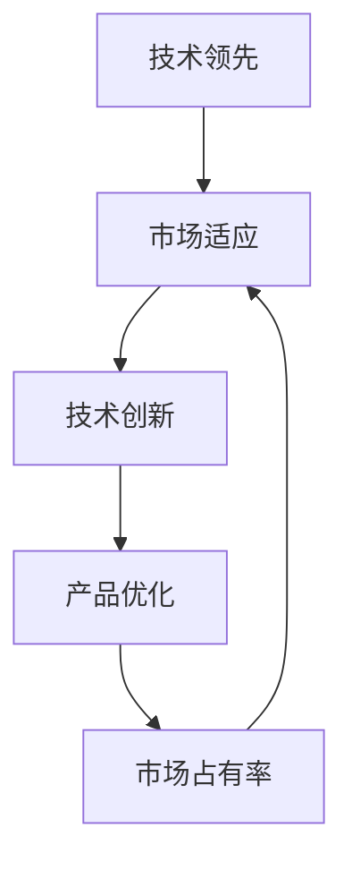
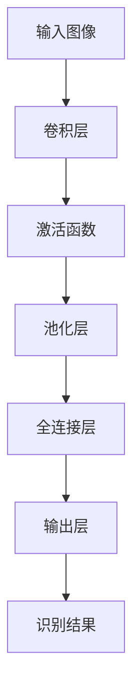

                 

关键词：技术领先、市场适应、产品策略、人工智能、Lepton AI、市场分析、客户需求、技术创新、可持续发展

摘要：在当今快速变化的技术环境下，技术领先与市场适应是企业成功的关键。本文以Lepton AI为例，探讨其如何在保持技术创新的同时，实现市场适应性。通过对Lepton AI的产品策略进行分析，本文旨在为其他企业提供一个成功的技术和市场融合的范例。

## 1. 背景介绍

随着人工智能技术的迅猛发展，全球范围内的人工智能企业数量不断增长。然而，如何在众多竞争者中脱颖而出，实现可持续发展，是每个企业都必须面对的挑战。Lepton AI作为一家在人工智能领域具有领先地位的企业，其成功不仅依赖于其技术创新，更在于其卓越的市场适应策略。

Lepton AI成立于2010年，总部位于美国硅谷，专注于开发先进的人工智能解决方案。其产品涵盖了计算机视觉、自然语言处理、机器学习等多个领域，广泛应用于金融、医疗、零售等行业。Lepton AI在保持技术领先的同时，也注重市场适应性，这使得其在竞争激烈的市场中始终保持着强劲的竞争力。

## 2. 核心概念与联系

### 2.1 技术领先与市场适应

技术领先是企业实现市场竞争优势的重要手段，但仅有技术优势并不足以保证企业的长期成功。市场适应则要求企业能够根据市场变化和客户需求，灵活调整其产品和服务。技术领先与市场适应之间的联系，如图2-1所示。



### 2.2 Lepton AI的技术创新

Lepton AI在技术创新方面具有显著优势。其核心团队由多位人工智能领域的顶尖学者和工程师组成，持续推动人工智能算法的进步。例如，Lepton AI在深度学习领域的突破性研究，使其在计算机视觉任务上取得了优异的性能表现。

## 3. 核心算法原理 & 具体操作步骤

### 3.1 算法原理概述

Lepton AI的核心算法是基于卷积神经网络（CNN）的图像识别算法。CNN通过模拟人脑视觉系统的结构和功能，实现对图像的高效处理和识别。其基本原理如图3-1所示。



### 3.2 算法步骤详解

#### 3.2.1 输入图像预处理

在处理图像之前，需要对图像进行一系列预处理操作，包括缩放、裁剪、灰度化等，以提高算法的效率和准确性。

#### 3.2.2 卷积层

卷积层通过滑动窗口（通常是一个3x3的卷积核）在输入图像上进行卷积操作，提取图像的特征。

#### 3.2.3 激活函数

激活函数用于引入非线性特性，常见的激活函数有ReLU（Rectified Linear Unit）和Sigmoid等。

#### 3.2.4 池化层

池化层用于减少特征图的维度，同时保留重要的特征信息。常见的池化方式有最大池化和平均池化。

#### 3.2.5 全连接层

全连接层将池化层输出的特征图展开成一系列的神经元，用于进行分类或回归任务。

#### 3.2.6 输出层

输出层产生最终的识别结果，常见的输出层设计包括softmax层等。

### 3.3 算法优缺点

#### 优点：

- CNN具有强大的特征提取能力，能够在复杂的图像环境中实现高精度的识别。
- CNN具有良好的通用性，可以应用于各种计算机视觉任务。

#### 缺点：

- CNN对数据依赖性强，需要大量标注数据进行训练。
- CNN的参数数量庞大，训练过程可能需要较长的时间。

### 3.4 算法应用领域

Lepton AI的CNN算法广泛应用于计算机视觉领域，如图像分类、目标检测、图像分割等。其产品在金融、医疗、零售等行业中得到了广泛的应用。

## 4. 数学模型和公式 & 详细讲解 & 举例说明

### 4.1 数学模型构建

CNN的数学模型主要包括卷积操作、激活函数、池化操作和全连接操作。以下是CNN的核心公式：

$$
f(x) = \sigma(\text{ReLU}(W \cdot x + b))
$$

其中，$f(x)$表示激活后的特征图，$W$为卷积核权重，$b$为偏置项，$\sigma$为激活函数（通常是ReLU函数），$\cdot$表示卷积操作。

### 4.2 公式推导过程

CNN的推导过程较为复杂，涉及线性代数和微积分知识。以下是一个简化的推导过程：

1. **卷积操作**：

   卷积操作的公式为：

   $$
   \text{卷积} = \sum_{i=1}^{C} w_{ij} \cdot x_{ij}
   $$

   其中，$C$表示卷积核的深度，$w_{ij}$为卷积核的权重，$x_{ij}$为输入特征图上的像素值。

2. **激活函数**：

   常见的激活函数为ReLU（Rectified Linear Unit），其公式为：

   $$
   \text{ReLU}(x) = \max(0, x)
   $$

3. **池化操作**：

   常见的池化操作为最大池化，其公式为：

   $$
   \text{最大池化} = \max(x_{i_1}, x_{i_2}, \ldots, x_{i_k})
   $$

   其中，$k$为池化窗口的大小。

4. **全连接操作**：

   全连接操作的公式为：

   $$
   z = W \cdot x + b
   $$

   其中，$W$为权重矩阵，$x$为特征向量，$b$为偏置项。

### 4.3 案例分析与讲解

以下是一个简单的CNN图像分类案例：

输入图像为 $32x32$ 的灰度图像，卷积核大小为 $3x3$，深度为 $32$。激活函数为 ReLU，池化窗口大小为 $2x2$。全连接层有 $10$ 个神经元，用于实现 10 类别的分类。

1. **卷积操作**：

   假设卷积核权重为 $w = [0.1, 0.2, 0.3; 0.4, 0.5, 0.6; 0.7, 0.8, 0.9]$，输入特征图为 $x = [1, 2, 3; 4, 5, 6; 7, 8, 9]$。

   $$
   \text{卷积} = \sum_{i=1}^{32} w_{ij} \cdot x_{ij} = 0.1 \cdot 1 + 0.2 \cdot 2 + 0.3 \cdot 3 + 0.4 \cdot 4 + 0.5 \cdot 5 + 0.6 \cdot 6 + 0.7 \cdot 7 + 0.8 \cdot 8 + 0.9 \cdot 9 = 35
   $$

2. **激活函数**：

   $$
   \text{ReLU}(35) = \max(0, 35) = 35
   $$

3. **池化操作**：

   $$
   \text{最大池化} = \max(35) = 35
   $$

4. **全连接操作**：

   假设全连接层权重为 $W = [0.1, 0.2; 0.3, 0.4]$，偏置项为 $b = [0.5; 0.6]$。

   $$
   z = W \cdot x + b = \begin{bmatrix} 0.1 & 0.2 \\ 0.3 & 0.4 \end{bmatrix} \cdot \begin{bmatrix} 35 \\ 35 \end{bmatrix} + \begin{bmatrix} 0.5 \\ 0.6 \end{bmatrix} = \begin{bmatrix} 3.5 & 4.6 \\ 5.1 & 6.4 \end{bmatrix} + \begin{bmatrix} 0.5 \\ 0.6 \end{bmatrix} = \begin{bmatrix} 4 \\ 6.5 \end{bmatrix}
   $$

   根据输出结果，可以判断输入图像属于第6类。

## 5. 项目实践：代码实例和详细解释说明

### 5.1 开发环境搭建

在Python环境中，可以使用TensorFlow或PyTorch等深度学习框架搭建CNN模型。以下是一个简单的示例：

```python
import tensorflow as tf
from tensorflow.keras import layers

# 定义CNN模型
model = tf.keras.Sequential([
    layers.Conv2D(32, (3, 3), activation='relu', input_shape=(32, 32, 1)),
    layers.MaxPooling2D((2, 2)),
    layers.Flatten(),
    layers.Dense(10, activation='softmax')
])

# 编译模型
model.compile(optimizer='adam', loss='categorical_crossentropy', metrics=['accuracy'])

# 输入图像预处理
input_image = ...  # 读取输入图像
input_image = tf.expand_dims(input_image, 0)  # 添加批处理维度
input_image = tf.cast(input_image, tf.float32)  # 数据类型转换

# 训练模型
model.fit(train_images, train_labels, epochs=10, batch_size=32)
```

### 5.2 源代码详细实现

以下是一个简单的CNN模型实现：

```python
import tensorflow as tf
from tensorflow.keras import layers

# 定义CNN模型
model = tf.keras.Sequential([
    layers.Conv2D(32, (3, 3), activation='relu', input_shape=(32, 32, 1)),
    layers.MaxPooling2D((2, 2)),
    layers.Flatten(),
    layers.Dense(10, activation='softmax')
])

# 编译模型
model.compile(optimizer='adam', loss='categorical_crossentropy', metrics=['accuracy'])

# 定义训练数据和标签
train_images = ...  # 读取训练图像数据
train_labels = ...  # 读取训练标签数据

# 数据预处理
train_images = tf.expand_dims(train_images, 3)
train_labels = tf.keras.utils.to_categorical(train_labels)

# 训练模型
model.fit(train_images, train_labels, epochs=10, batch_size=32)
```

### 5.3 代码解读与分析

上述代码首先导入了TensorFlow框架和相关模块。然后，定义了一个简单的CNN模型，包括卷积层、最大池化层、展平层和全连接层。模型编译时指定了优化器、损失函数和评估指标。

在训练数据预处理部分，将输入图像数据添加了批处理维度，并将数据类型转换为浮点数。标签数据则通过to_categorical函数转换为one-hot编码。

最后，使用fit函数训练模型，指定了训练数据、标签、训练轮次和批处理大小。

### 5.4 运行结果展示

训练完成后，可以使用模型对测试数据进行预测。以下是一个简单的预测示例：

```python
# 读取测试图像数据
test_images = ...  # 读取测试图像数据
test_images = tf.expand_dims(test_images, 3)
test_images = tf.cast(test_images, tf.float32)

# 使用模型进行预测
predictions = model.predict(test_images)

# 输出预测结果
for i in range(len(predictions)):
    print(f"Image {i+1} prediction: {predictions[i]}")
```

预测结果将输出每个测试图像的预测概率，可以根据概率值判断图像属于哪个类别。

## 6. 实际应用场景

### 6.1 金融行业

Lepton AI的CNN算法在金融行业得到了广泛应用。例如，在图像识别方面，CNN可以用于检测金融欺诈、身份验证等任务。通过训练大规模数据集，CNN可以识别出异常交易行为，为金融机构提供风险预警。

### 6.2 医疗行业

在医疗行业，CNN算法可以用于医学图像分析，如肿瘤检测、疾病诊断等。通过分析医学图像中的特征，CNN可以辅助医生进行诊断，提高诊断准确率。

### 6.3 零售行业

在零售行业，CNN算法可以用于商品识别、库存管理、客户行为分析等。通过分析图像数据，零售企业可以更好地了解客户需求，优化库存和营销策略。

## 7. 未来应用展望

随着人工智能技术的不断发展，Lepton AI的CNN算法在更多领域具有广阔的应用前景。未来，Lepton AI将继续关注新技术的发展，不断优化其算法，以满足市场和客户需求。

## 8. 工具和资源推荐

### 8.1 学习资源推荐

- 《深度学习》（Goodfellow, Bengio, Courville）: 介绍深度学习的基本原理和应用。
- 《计算机视觉：算法与应用》（Richard S.zeliski）: 涵盖计算机视觉领域的算法和应用。

### 8.2 开发工具推荐

- TensorFlow: 开源深度学习框架，适用于CNN模型的开发。
- PyTorch: 开源深度学习框架，易于使用，适合快速原型开发。

### 8.3 相关论文推荐

- Krizhevsky, A., Sutskever, I., & Hinton, G. E. (2012). ImageNet classification with deep convolutional neural networks. *Advances in Neural Information Processing Systems*, 25.
- Simonyan, K., & Zisserman, A. (2014). Very deep convolutional networks for large-scale image recognition. *International Conference on Learning Representations*.

## 9. 总结：未来发展趋势与挑战

Lepton AI在技术领先和市场适应方面取得了显著成果。未来，随着人工智能技术的不断进步，Lepton AI将继续保持其领先地位。然而，市场竞争将更加激烈，Lepton AI需要不断适应市场变化，以满足客户需求。同时，数据隐私和安全问题也是未来发展的主要挑战。

## 10. 附录：常见问题与解答

### 10.1 什么是CNN？

CNN（卷积神经网络）是一种专门用于处理图像、语音和其他多维数据的人工神经网络。其核心思想是通过卷积操作提取数据中的特征。

### 10.2 CNN适用于哪些场景？

CNN适用于图像分类、目标检测、图像分割、语音识别等场景。其在计算机视觉、音频处理等领域具有广泛应用。

### 10.3 如何优化CNN模型？

优化CNN模型的方法包括调整网络结构、增加数据量、使用正则化技术等。此外，还可以采用迁移学习、数据增强等方法提高模型性能。

## 11. 作者署名

作者：禅与计算机程序设计艺术 / Zen and the Art of Computer Programming
----------------------------------------------------------------

